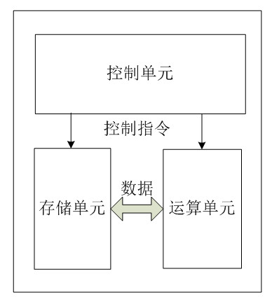
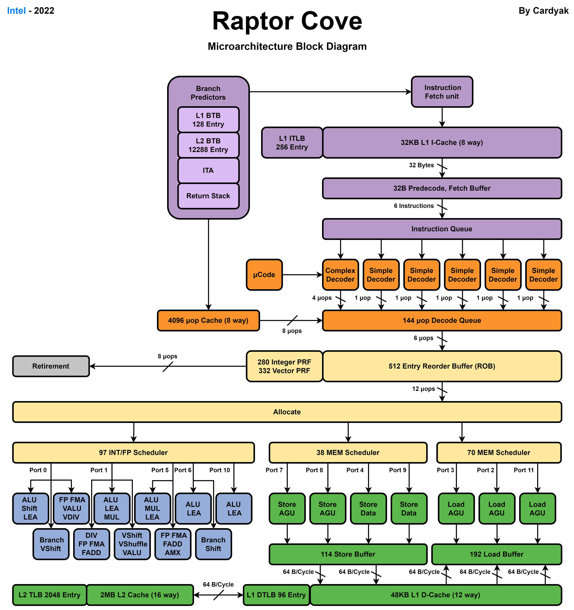
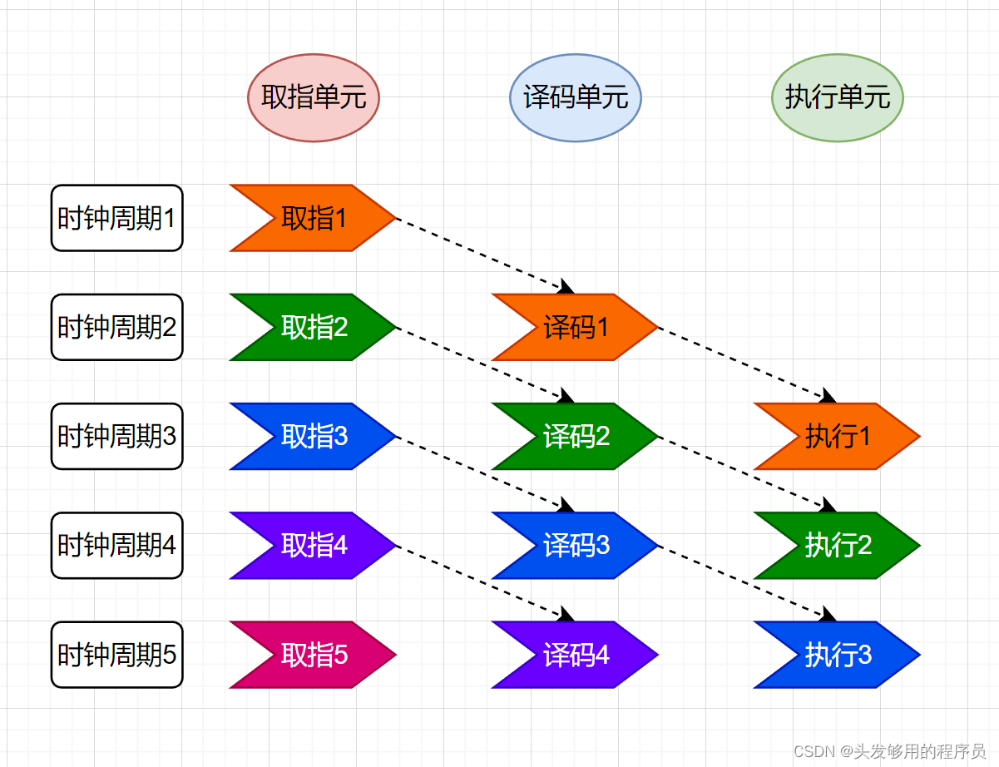

# 中央处理器

> 本章介绍计算机的核心部件——中央处理器(CPU)的工作原理和基本结构。

## 导读
- 预备知识：[计算机系统概论](./计算机系统概论.md)
- 相关内容：[总线系统](./总线系统.md)、[存储系统](./存储系统.md)
- 学习重点：CPU结构、指令执行、流水线技术、中断机制

## CPU的功能和基本结构

### 主要功能
1. **指令控制**
   - 取指令
   - 分析指令
   - 执行指令

2. **操作控制**
   - 产生控制信号
   - 控制指令执行过程
   - 协调各部件工作

3. **数据处理**
   - 算术运算
   - 逻辑运算
   - 数据传送

### 基本结构
1. **运算器**
   - ALU（算术逻辑单元）
   - 累加器
   - 通用寄存器组
   - 状态寄存器

2. **控制器**
   - 指令寄存器（IR）
   - 程序计数器（PC）
   - 指令译码器
   - 时序产生器
   - 控制单元

3. **内部总线**
   - 数据总线
   - 地址总线
   - 控制总线

## 指令执行过程

### 指令周期
1. **取指周期**
   - 从内存读取指令
   - PC指向下一条指令

2. **间址周期**
   - 获取有效地址
   - 可能存在多次间址

3. **执行周期**
   - 执行指令操作
   - 获取操作结果

4. **中断周期**
   - 检查中断请求
   - 保存现场
   - 转入中断处理

### 指令执行方式
1. **单指令周期**
   - 一个时钟周期完成一条指令
   - 实现简单
   - 执行效率低

2. **多指令周期**
   - 不同指令使用不同周期数
   - 执行时间灵活
   - 硬件利用率高

3. **流水线方式**
   - 并行执行多条指令的不同阶段
   - 提高指令吞吐率
   - 需要解决相关性问题

## 流水线技术

### 基本概念
1. **流水线级数**
   - 将指令分成多个执行阶段
   - 常见5级流水线：IF-ID-EX-MEM-WB

2. **流水线性能**
   - 吞吐率
   - 加速比
   - 效率

### 流水线冒险
1. **结构冒险**
   - 硬件资源冲突
   - 解决方法：
     * 资源重复配置
     * 流水线暂停

2. **数据冒险**
   - 数据依赖导致的冲突
   - 解决方法：
     * 数据转发
     * 编译优化
     * 流水线暂停

3. **控制冒险**
   - 程序分支导致的冲突
   - 解决方法：
     * 分支预测
     * 延迟分支
     * 分支目标缓冲器

### 流水线优化
1. **超标量技术**
   - 同时取出多条指令
   - 并行执行多条指令
   - 提高处理器性能

2. **乱序执行**
   - 按数据依赖关系执行
   - 提高指令级并行度
   - 复杂度较高

## 中断系统

### 中断分类
1. **硬件中断**
   - 外设请求中断
   - I/O中断
   - 时钟中断

2. **软件中断**
   - 程序异常
   - 系统调用

3. **可屏蔽中断**
   - 可以通过开关控制
   - 优先级可设置

4. **不可屏蔽中断**
   - 必须响应
   - 用于处理重要事件

### 中断处理过程
1. **中断请求**
   - 检测中断源
   - 判断中断优先级

2. **现场保护**
   - 保存程序状态
   - 保存寄存器内容

3. **中断服务**
   - 执行中断服务程序
   - 处理中断事件

4. **现场恢复**
   - 恢复程序状态
   - 恢复寄存器内容
   - 返回主程序

### 中断向量
1. **中断向量表**
   - 存储中断服务程序入口地址
   - 按优先级排序

2. **中断向量地址**
    - 固定分配
    - 便于快速查找

## 案例分析

### 现代处理器实例

1. **Intel Core 处理器**
   - 超标量执行
   - 乱序执行
   - 分支预测
   - 多级缓存
   - 硬件虚拟化

2. **ARM 处理器**
   - 低功耗设计
   - RISC架构
   - 可扩展性
   - 广泛应用于移动设备

### 流水线优化案例

1. **Intel Skylake架构**
   - 14级流水线
   - 多端口乱序执行
   - 高级分支预测
   - 硬件预取

2. **性能提升方案**
   - 指令级并行
   - 数据预取
   - 分支预测优化
   - 缓存优化

## 思考题
1. 为什么现代CPU要采用流水线技术？流水线的瓶颈主要在哪里？

2. 分析乱序执行对CPU性能提升的原理，并思考其可能带来的问题。

3. CPU中的分支预测为什么重要？错误的分支预测会带来什么影响？

4. 比较RISC和CISC架构的优缺点，为什么移动设备多采用RISC架构？

5. 在多核CPU中，如何协调各个核心的工作？缓存一致性问题如何解决？

## 本章小结
- CPU是计算机的核心部件，负责指令执行和数据处理
- 流水线技术是提高CPU性能的关键技术
- 现代CPU采用多种优化技术提升性能
- 理解CPU工作原理对于程序优化很重要

## 参考资料
1. John L. Hennessy, "Computer Architecture: A Quantitative Approach"
2. David A. Patterson, "Computer Organization and Design"
3. Intel® 64 and IA-32 Architectures Software Developer's Manual
4. ARM® Architecture Reference Manual