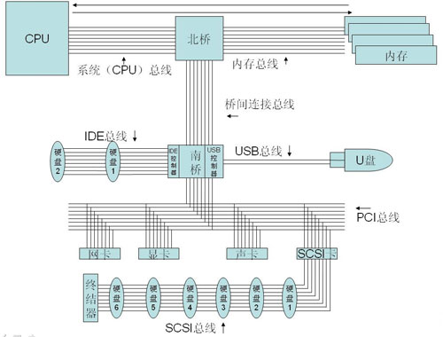
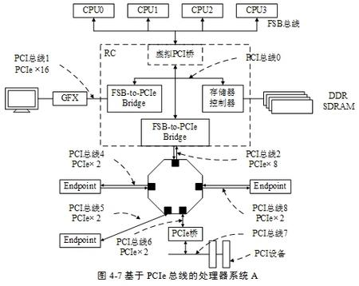

# 总线系统

> 本章将介绍计算机中的总线系统，这是连接各个硬件组件的关键基础设施。

## 导读
- 预备知识：[计算机系统概论](./计算机系统概论.md)
- 相关内容：[中央处理器](./中央处理器.md)、[存储系统](./存储系统.md)
- 学习重点：总线的基本概念、分类、仲裁机制和性能指标

## 总线概述

### 总线的基本概念
1. **定义**
   - 共享的传输通路
   - 连接多个部件
   - 传输地址、数据和控制信息

2. **特性**
   - 分时共享
   - 传输双向性
   - 信号同步性
   - 标准化接口

### 总线分类
1. **片内总线**
   - CPU内部的总线
   - 连接CPU内部各个功能部件
   - 速度最快

2. **系统总线**
   - 主板上的总线
   - 连接CPU、内存和主要部件
   - 速度较快

3. **外部总线**
   - 连接外设的总线
   - 速度相对较慢
   - 标准接口协议

### 总线的组成
1. **数据总线**
   - 传输数据信息
   - 双向传输
   - 位数决定数据传输效率

2. **地址总线**
   - 传输地址信息
   - 单向传输
   - 位数决定寻址范围

3. **控制总线**
   - 传输控制信号
   - 协调各部件工作
   - 确定传输方向和时序

## 总线仲裁

### 仲裁方式
1. **集中式仲裁**
   - 集中控制器处理
   - 响应速度快
   - 实现简单

2. **分布式仲裁**
   - 设备自行仲裁
   - 可靠性高
   - 实现复杂

### 仲裁算法
1. **固定优先级**
   - 优先级固定不变
   - 实现简单
   - 可能产生饥饿现象

2. **轮询方式**
   - 循环询问
   - 公平性好
   - 效率可能较低

3. **动态优先级**
   - 优先级动态调整
   - 适应性强
   - 实现复杂

## 总线操作和定时

### 总线操作周期
1. **申请阶段**
   - 主设备申请总线使用权
   - 等待仲裁结果

2. **寻址阶段**
   - 主设备发送地址信息
   - 选择从设备

3. **传输阶段**
   - 数据交换
   - 确认应答

4. **释放阶段**
   - 结束数据传输
   - 释放总线控制权

### 总线定时方式
1. **同步定时**
   - 统一时钟控制
   - 所有设备同步工作
   - 适用于速度接近的设备

2. **异步定时**
   - 设备间互相握手
   - 速度自适应
   - 适用于速度差异大的设备

3. **半同步定时**
   - 同步和异步结合
   - 既保证可靠性
   - 又提高效率

### 总线标准
1. **内部总线**
   - FSB（前端总线）
   - QPI（快速通道互联）
   - DMI（直接媒体接口）

2. **外部总线**
   - PCI（外设组件互联）
   - PCI Express
   - USB（通用串行总线）
   - SATA（串行高级技术附件）

### 总线性能指标
1. **总线宽度**
   - 数据线的根数
   - 决定并行传输能力

2. **总线带宽**
   - 单位时间内传输的数据量
   - 衡量总线传输能力

3. **时钟频率**
   - 总线工作的时钟速率
   - 影响数据传输速度

4. **总线复用**
    - 地址线和数据线复用
    - 减少总线引脚数
    - 降低传输效率

## 案例分析

### PCI Express总线

1. **特点分析**
   - 点对点串行连接
   - 高速数据传输
   - 热插拔支持
   - 向下兼容性

2. **应用场景**
   - 显卡接口
   - 固态硬盘接口
   - 网卡接口

### USB总线演进
1. **各版本特点**
   - USB 1.0/1.1：低速/全速
   - USB 2.0：高速
   - USB 3.x：超高速
   - USB 4：超高速+

2. **成功因素**
   - 标准统一
   - 即插即用
   - 广泛兼容
   - 持续改进

## 思考题
1. 为什么现代计算机系统需要多种类型的总线？它们各自的作用是什么？

2. 比较同步总线和异步总线的优缺点，它们分别适用于什么场景？

3. 在实际计算机系统中，为什么地址总线通常是单向的，而数据总线是双向的？

4. 分析PCIe总线取代传统PCI总线的技术原因和优势。

5. 如何理解和评估总线的性能指标？在实际应用中应该如何选择合适的总线类型？

## 本章小结
- 总线是计算机系统的重要组成部分，承担各部件间的数据传输任务
- 不同类型的总线适应不同的应用场景和性能需求
- 总线的发展趋势是向高速、串行化和标准化方向发展
- 理解总线工作原理对于系统性能优化和硬件选型很重要

## 参考资料
1. William Stallings, "Computer Organization and Architecture"
2. David A. Patterson, "Computer Organization and Design"
3. PCI Express Base Specification
4. USB Specifications