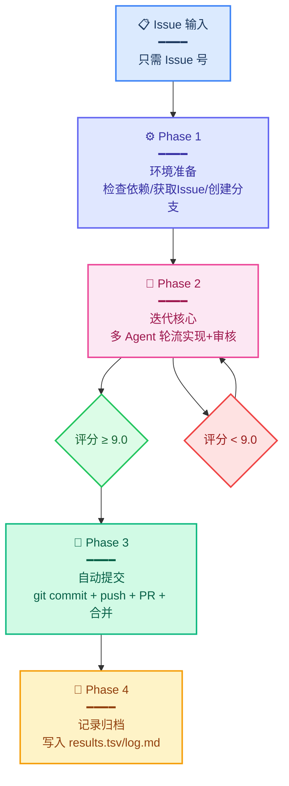
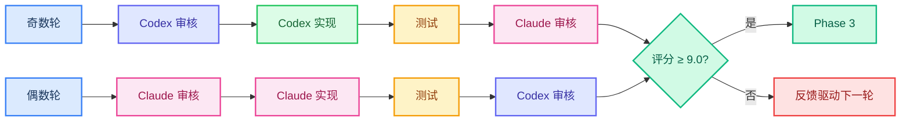
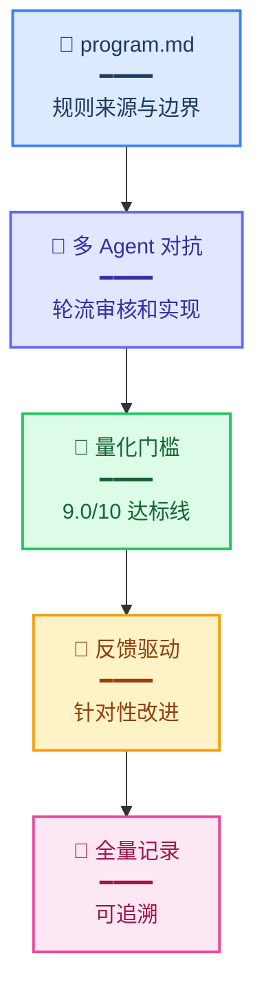
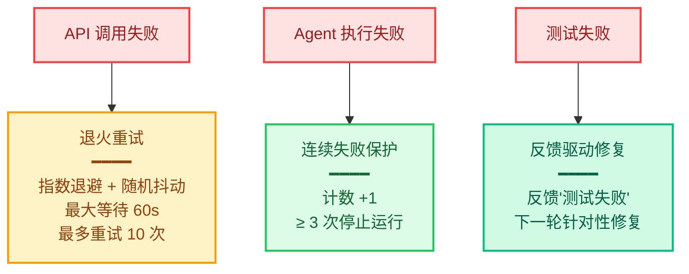

# AutoResearch 在软件开发领域的应用

> [!abstract] 核心结论
> 1. **AutoResearch 核心思想**：把"修改 train.py → 跑实验 → val loss 改善才保留"迁移为"实现 GitHub Issue → 跑测试 → 多维评分达标才合并"
> 2. **三大关键改进**：多 Agent 交叉审核、5 维度加权评分、审核反馈驱动迭代
> 3. **完全闭环**：从 Issue 号输入 → 自动实现 → 自动测试 → 自动审核 → 自动 PR + 合并，人只提供 Issue 号
> 4. **质量保证**：Codex/Claude 轮流担任实现者和审核者，交叉验证减少盲区，≥ 9.0/10 才通过
> 5. **量化标准**：正确性 35% + 测试 25% + 代码质量 20% + 安全 10% + 性能 10%，替代主观判断

---

## 关键概念

| 概念 | 一句话解释 |
|------|-----------|
| AutoResearch | Andrej Karpathy 开源项目：让 AI 自主完成 ML 研究，只有 val loss 改善才 commit |
| program.md | 相当于给 Agent 的"研究章程"或"宪法"，定义目标、约束、质量标准 |
| 多 Agent 交叉审核 | Codex 和 Claude 轮流担任实现者和审核者：A 写完 B 审，B 写完 A 审 |
| 5 维度加权评分 | 正确性 35% + 测试 25% + 代码质量 20% + 安全 10% + 性能 10%，总分 ≥ 9.0 才通过 |
| 审核反馈驱动 | 上一轮的审核问题直接传入下一轮 Agent 的提示词，针对性改进而非盲目重试 |
| acpx | Agent 控制工具，让 Codex/Claude 在命令行中协作 |

---

## 背景与动机

### 传统开发流程的痛点

| 传统流程 | 问题 |
|---------|------|
| 人类写代码 → 运行测试 → 修复问题 | Issues 上百个时不再可行 |
| Claude Code 等 AI 工具 | 仍需一轮轮 chat 交互，人工检查输出，发现问题，告诉 AI 改 |
| Ralph Wiggum 方法 | 单 Agent 自写自测自改，没有外部审核视角，质量靠 prompt 工夫 |
| 人始终被绑在循环里 | 离开就不转 |

### Karpathy AutoResearch 的精髓

1. **量化目标**：val loss 是唯一判断标准
2. **自主循环**：Agent 不需要人类每轮介入
3. **只保留改进**：退化就 git revert，绝不将就

**迁移思路**：把 ML 研究的"val loss 改善"替换为软件工程的"多维评分达标"。

---

## 系统架构



### 四个阶段详解

| 阶段 | 内容 | 时间占比 |
|------|------|---------|
| Phase 1: 环境准备 | 检查依赖 (gh/acpx/go)、获取 Issue 信息、创建分支 | 几秒（一次性） |
| Phase 2: 迭代核心 | 多 Agent 轮流实现+审核、测试验证、评分判定 | 几乎全部 |
| Phase 3: 自动提交 | git commit + push + PR + 合并 | 评分达标后触发 |
| Phase 4: 记录归档 | 写入 results.tsv、更新 workflows/issue-N/log.md | 最后 |

### Phase 2 迭代循环



---

## 核心文件结构

```
autoresearch/
├── program.md                 # 宪法：实现规则、权限边界、代码规范、质量标准
├── agents/
│   ├── codex.md              # Codex 角色：实现者指令 + 代码规范 + 自检清单
│   ├── claude.md             # Claude 角色：审核者指令 + 评分标准 + 问题模板
│   └── gemini.md             # Gemini 角色：实现者指令（扩展 Agent）
├── workflows/
│   └── issue-{n}/
│       ├── log.md            # 总日志：迭代记录、评分历史
│       ├── codex-*.md        # 各轮 Codex 输出
│       ├── claude-*.md       # 各轮 Claude 输出
│       └── test-*.txt        # 各轮测试结果
└── results.tsv               # 全量结果汇总
```

---

## 三大关键改进

### 1. 多 Agent 交叉审核

**单 Agent 自审的问题**：自己写、自己测、自己改，没有外部视角，有盲区。

**交叉审核机制**：

| 轮次 | 审核 | 实现 | 再次审核 |
|------|------|------|---------|
| 奇数 | Codex | Codex | Claude |
| 偶数 | Claude | Claude | Codex |

> [!important] 不同模型有不同的盲区和强项，交叉审核能发现单 Agent 发现不了的问题。

### 2. 5 维度加权评分

**替代单一 metric**：Karpathy 用 val loss 一个数字，但软件工程的质量是多维的。

| 维度 | 权重 | 评分标准 |
|------|------|---------|
| 正确性 | 35% | 功能是否符合 Issue 要求 |
| 测试 | 25% | 测试覆盖是否充分 |
| 代码质量 | 20% | 代码规范、可读性 |
| 安全 | 10% | 是否有漏洞、越权 |
| 性能 | 10% | 性能坑、硬编码等 |

**达标线**：总分 ≥ 9.0/10 才自动提交 PR，否则反馈驱动下一轮改进。

### 3. 审核反馈驱动

**Ralph Wiggum 的问题**：每轮循环是独立的，新上下文重新开始，不记得上轮犯了什么错。

**反馈驱动**：上一轮的审核问题直接传入下一轮 Agent 的提示词，Agent 看到具体问题后针对性改进。

---

## 核心原则

### 六条核心原则



1. **规则来源**：program.md 定义权限边界、代码规范、质量标准
2. **多 Agent 对抗**：Codex/Claude 轮流，交叉验证减少盲区
3. **量化门槛**：9.0/10 达标线，替代主观判断
4. **反馈驱动**：审核反馈直接传入下一轮，针对性改进
5. **全量记录**：迭代过程写入日志，可追溯
6. **错误处理**：退火重试、连续失败保护、测试失败处理

### program.md 要点

**权限边界**：
- Agent ✓ internal /, cmd/
- Agent ✓ / / ✓ ✓ /
- Agent ✗ /, Makefile, CI/CD ✗ ✗ ✗
- Issue ✗ /

**代码规范（Go 示例）**：
1. 错误处理优先
2. 接口定义清晰
3. 代码可读性
4. 性能考虑
5. 禁止 time.Sleep、外部依赖、全局状态、硬编码端口

---

## Issue 选择策略

### 排除规则

以下 Issue 不处理：
- 标签：wontfix / duplicate / invalid / blocked / needs discussion / on hold / external
- 标题含 [WIP] / [DRAFT]
- 正文含 DO NOT IMPLEMENT
- 已有 PR 关联

### 优先级计算

```
分数 = 基础权重(15) + 标签权重 + 类型权重 + 时间因子
```

| 权重类型 | 值 |
|---------|-----|
| 标签权重 | critical(100) > high(50) > medium(20) > low(10) |
| 类型权重 | bug(30) > feature(20) > refactor(10) > test(5) > docs(3) |
| 时间因子 | 新 Issue +10 / 陈年 Issue +15 / 近期更新 +5 |

### 复杂度评估

```
复杂度 = 基础分 + 影响范围 + 依赖复杂度 + 测试难度
```

---

## 错误处理



---

## 快速开始

### 前置条件

| 工具 | 检查命令 |
|------|---------|
| GitHub CLI (gh) | `gh auth status` |
| Agent 控制工具 (acpx) | `which acpx` |
| Go 环境 | `go version` |

### 运行

```bash
# 进入 GitHub 项目目录
cd /path/to/project

# 处理单个 Issue
/path/to/autoresearch/run.sh 21

# 指定最大迭代次数
/path/to/autoresearch/run.sh 21 10
```

脚本会自动：检查环境 → 获取 Issue → 创建分支 → 轮流 Codex/Claude 实现+审核 → 达标后自动 PR + 合并

### 自定义配置

在项目根目录创建 `.autoresearch/` 目录可覆盖默认配置：

```
.autoresearch/
├── agents/
│   ├── codex.md    # 自定义 Codex 指令
│   ├── claude.md   # 自定义 Claude 指令
│   └── gemini.md   # 自动生成
```

---

## 实战案例

### Issue #21: 10 分钟完成，3 轮迭代

**Issue**：feat: enhance job execution with agent selection and timeout

**迭代过程**：
```
轮次 1: Codex 审核 → Codex 实现 → 测试 → Claude 审核(5.0) → Claude 实现
轮次 2: Codex 审核 → Codex 实现 → 测试 → Claude 审核(7.0) → Claude 实现
轮次 3: Codex 审核 → Codex 实现 → 测试 → Claude 审核(9.1) → 达标！→ 自动 PR + 合并 ✓
```

**代码改动**：
- 新增 `internal/job/Timeout` 和 `TestExecuteJob_Timeout`
- 修改 `internal/job/` 17 行，删除 10 行，新增 47 行
- RPC 10 → 17 → 47，3 个文件变更

**回放链接**：https://asciinema.org/a/896260

### Issue #15: 2 轮迭代达标

**复杂度**：中（单一模块，变更明确）

**迭代过程**：
```
轮次 1: 5.0 → 轮次 2: 7.0 → 轮次 3: 9.1 → commit + PR + 合并
```

### Issue #6: 5 轮迭代达标

**复杂度**：高（涉及多个模块、需要设计决策）

**迭代过程**：
```
轮次 1: 4.5 → 轮次 2: 6.0 → 轮次 3: 7.5 → 轮次 4: 8.5 → 轮次 5: 15.0 → 达标
```

**最终评分**：15/10（Claude 和 Codex 均评分最高）

---

## 最佳实践

1. **从小 Issue 开始**：先用简单的 bug fix 测试流程
2. **保持 program.md 更新**：根据运行情况调整规则和约束
3. **关注评分趋势**：每次迭代的评分记录在 log.md 中，观察是否稳步上升
4. **利用多 Agent 对抗**：Codex/Claude 轮流实现+审核，交叉验证减少盲区
5. **退火重试**：API 不稳定时脚本自动退避重试，无需人工干预

---

## 设计灵感

| 项目 | 领域 | 核心机制 |
|------|------|---------|
| karpathy/autoresearch | ML 研究 | 只保留可测量的改进，其余全部回滚 |
| acpx | Agent 控制工具 | 让 Codex/Claude 在命令行中协作 |
| imclaw | 本项目文件 | https://github.com/smallnest/imclaw |

---

## 项目地址

- **GitHub**：https://github.com/smallnest/autoresearch
- **原文链接**：https://mp.weixin.qq.com/s/JFvYo9RCn9Xm8ilx1Chd6g

---

## 掌握验证

> [!check] 自测题

1. **核心思想**：AutoResearch 从 ML 研究迁移到软件开发，核心变化是什么？
   - [参考答案：从"val loss 改善才保留"变为"多维评分（≥ 9.0）达标才合并"]

2. **三大改进**：与传统单 Agent 方法相比，AutoResearch 做了哪三个关键改进？
   - [参考答案：①多 Agent 交叉审核，② 5 维度加权评分，③ 审核反馈驱动下一轮]

3. **评分体系**：5 个维度及其权重分别是什么？
   - [参考答案：正确性 35%、测试 25%、代码质量 20%、安全 10%、性能 10%]

4. **迭代流程**：奇数轮和偶数轮的 Agent 分工有什么不同？
   - [参考答案：奇数轮 Codex 审核→Codex 实现→Claude 审核；偶数轮 Claude 审核→Claude 实现→Codex 审核]

5. **Issue 选择**：哪些 Issue 会被自动排除？
   - [参考答案：wontfix/duplicate/invalid/blocked/needs discussion/on hold/external 标签、[WIP]/[DRAFT] 标题、含 DO NOT IMPLEMENT、已有 PR 的 Issue]

---

## 未来扩展

- 支持更多编程语言和 Agent 类型
- 增加更多质量维度和评分权重配置
- 支持自定义 Agent 组合（1-3 个任意 Agent）
- 集成更多代码分析工具和静态检查
- 支持分布式部署和多仓库管理
