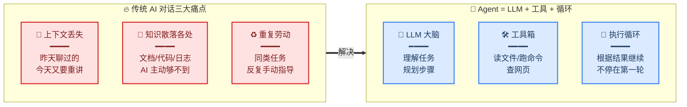
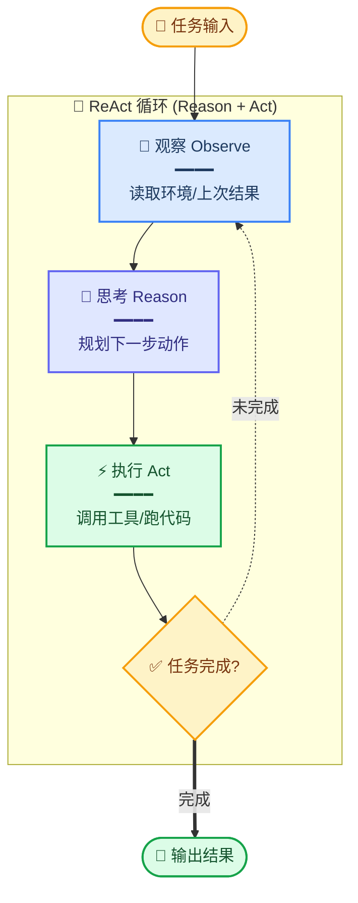
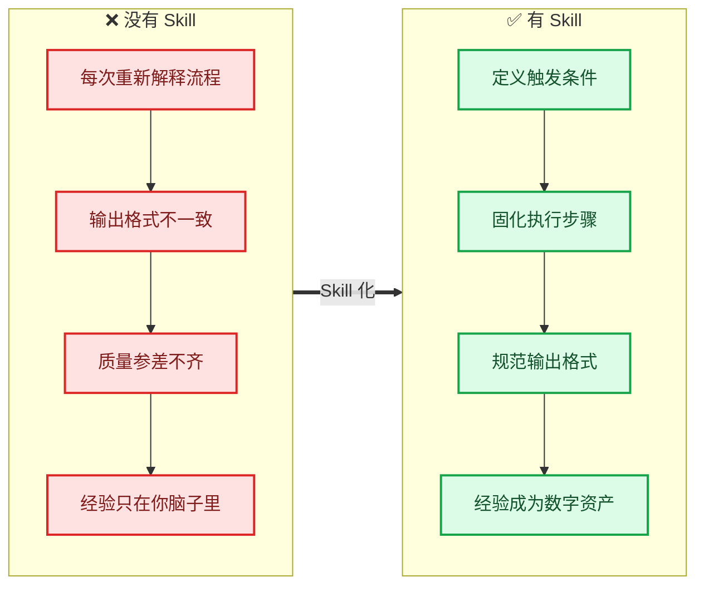
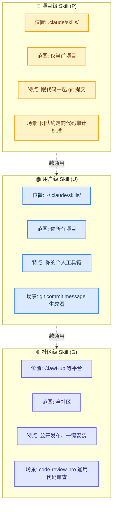
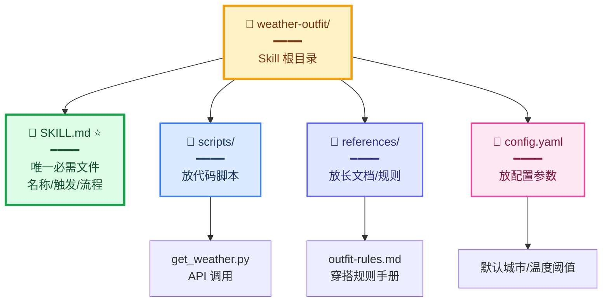
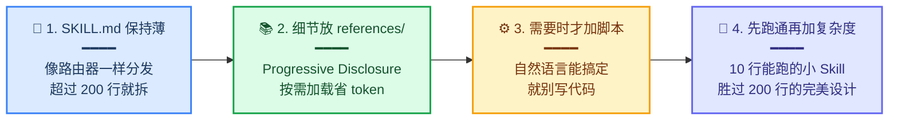
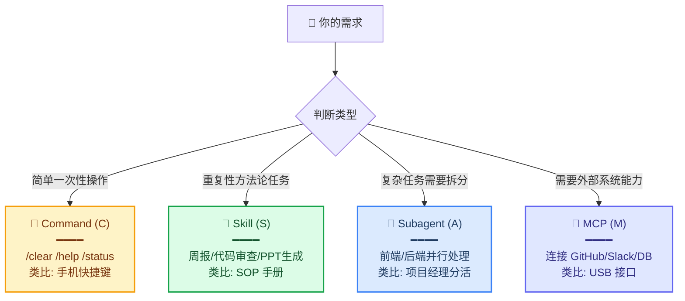
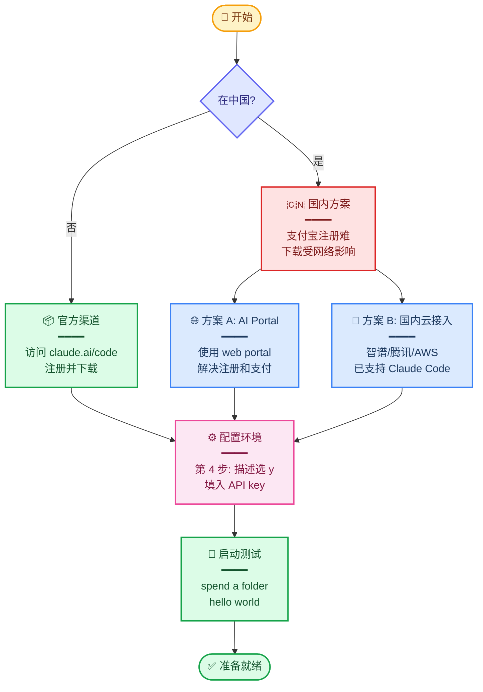

# Claude Code 入门与 Skill 系统

## 核心结论

> [!abstract]
> 1. **AI Agent ≠ 聊天机器人**：Agent = LLM 大脑 + 工具箱 + 执行循环，从「告诉你怎么做」升级为「替你把事做完」。
> 2. **ReAct 模式是 Agent 的运行内核**：观察 → 思考 → 执行 → 再观察，循环直到任务完成。
> 3. **Skill 是给 Agent 的「做事说明书」**：不是新模型、不是新技术，而是把隐性 know-how 显式化成可复用、可触发的方法封装。
> 4. **Skill 解决的不是「能不能做」，而是「能不能稳定、重复、高质量地做」**——这是从 prompt 工程走向 context 工程的关键。
> 5. **最小可用 Skill 只需要一个 `SKILL.md`**：先跑通再加复杂度，别一上来就堆目录结构。

---

## 关键概念

| 概念 | 一句话解释 |
| --- | --- |
| ==AI Agent== | 能自主感知、决策、执行的 AI 系统，由 LLM + 工具 + 循环组成 |
| ==ReAct 模式== | Reason + Act 的循环结构：思考一步 → 执行一步 → 观察结果再继续 |
| ==Skill== | Agent 的「做事说明书」，封装触发条件、步骤、规范、参考资料 |
| ==Progressive Disclosure== | 渐进式披露：`SKILL.md` 保持薄，详细内容放 `references/` 按需加载 |
| Command (C) | 一次性快捷指令，如 `/clear`、`/help` |
| Subagent (A) | 把复杂任务拆给独立执行单元并行处理 |
| MCP (M) | Model Context Protocol,把外部系统能力以标准协议接入 Agent |
| ClawHub | Skill 的「应用商店」,3200+ 社区 Skill 可一键安装 |

---

## 详细要点

### 一、为什么需要 AI Agent



> [!important]
> 问题不在「模型不够聪明」,而在交互方式还停留在**一问一答**。Agent 让 AI 从被动应答者变成主动执行者——这是从 V1 到 V2 的关键跃迁。

**三大痛点逐条拆解**:
1. **上下文丢失**: 不是效率问题，是体验问题——每次都要重新解释，耐心就没了。
2. **知识散落各处**: AI 只能基于你当场给的信息回答，所以输出「通用正确，但不是最需要」。
3. **重复劳动**: 每次写周报都要告诉 AI 「看 git log → 按模块分类 → 套模板」,累。

> [!example]
> **场景**: 让 AI 整理桌面
>
> - **聊天机器人**: 「你可以按文件类型分类，图片放图片夹，文档放文档夹……」(只告诉你怎么做)
> - **AI Agent**: 扫描桌面 → 识别 12 张截图 + 5 个 PDF + 3 个压缩包 → 创建对应文件夹 → 逐个移动 → 返回「整理完成」(直接帮你做完)
>
> 核心区别: **从「告诉我」到「替我做」**。

---

### 二、Agent 的工作原理:ReAct 模式



**传统 LLM vs ReAct Agent**:

| 维度 | 传统 LLM | ReAct Agent |
| --- | --- | --- |
| 工作模式 | 只做 Writing(写文字) | Writing + Action(写 + 做) |
| 反馈循环 | 无,一次性输出 | 有,根据结果迭代 |
| 工具调用 | 不调用 | 主动调用文件/命令/API |

> [!warning] **不是所有任务都需要 Agent**
> 当任务路径**固定**时(比如「每次部署 = git pull + npm build + scp」),你需要的是**脚本**,不是 Agent。
> 只有任务路径**动态**(比如「重构这个模块」)时,Agent 才有价值——因为它能根据中间结果决定下一步。

> [!example]
> **固定流程(用脚本)**: 每日数据备份、定时部署、固定格式的报表生成
>
> **动态任务(用 Agent)**: 重构一个模块、根据 bug 描述定位代码、根据用户反馈调整设计

---

### 三、Skill 是什么



> [!important] **Skill 的本质**
> Skill 不是另一个模型,也不是什么新 AI 技术。==它就是一份写给 Agent 看的「做事说明书」==。
>
> 如果说 Agent 是一个能干活的新人,那 Skill 就是入职手册:
> - **遇到这样的需求** → 触发条件
> - **按照这个流程来** → 执行步骤
> - **用这些工具** → 工具调用
> - **遵循这样的规范** → 输出格式
> - **参考这些文档** → references

**Skill 解决什么问题**:

> Skill 解决的并不是「能不能做」,而是「==能不能稳定、重复、高质量地做==」。

打比方:Claude 写周报,他能写,但每次格式不一样、重点不一样、质量参差不齐。有了 Skill 之后,模板、步骤、输入源都被固化,**输出就稳定了**。

> [!tip] **Skill 的开发者视角**
> Skill = 把你的隐性 know-how 显式化,打包给 AI 复用。
>
> 你的经验不再只属于你,它变成==可以被任何人、任何 AI 使用的数字资产==。

> [!example] **真实案例:PPT 生成 Skill**
> 课程中演示的 `PPT-Gen-Skill`,206 行 SKILL.md:
> - **trigger**: 用户说「做个 HTML PPT」「把这个做成网页演示」时触发
> - **steps**: 调用 `excel2ppt.py` → 读取 PPT prompt → 生成 HTML5 → 套用设计规范 → 输出
> - **references**: 放一个完整的参考 PPT 作为风格样本
> - **效果**: 一句「使用这个 skill 帮我生成 XXX」,直接出现代化 H5 PPT

---

### 四、Skill 的三个作用域



| 级别 | 路径 | 范围 | 通用性要求 |
| --- | --- | --- | --- |
| **P 项目级** | `.claude/skills/` | 仅当前项目 | 可以业务特定 |
| **U 用户级** | `~/.claude/skills/` | 所有项目 | 跨项目可复用 |
| **G 社区级** | ClawHub 等平台 | 全社区 | 高度通用、文档完善 |

> [!tip] **选择原则**
> 越往上层,要求 Skill 写得**越通用、越简单、越文档化**。
> 项目级 Skill 可以引用项目内特定文件;社区级 Skill 必须自包含、零外部依赖。

> [!note] **跨平台特性**
> Skill 虽然是 Claude Code 先提出的,但理念是**跨平台**的:Cursor Rules、Windsurf、Copilot Instructions 都有类似机制。==学会写 Skill 这个能力,可以迁移到任何 Agent 工具==。

---

### 五、Skill 的文件结构



| 组件 | 作用 | 何时使用 |
| --- | --- | --- |
| **`SKILL.md`** | 路由器,定义触发/流程/规范 | ==永远需要== |
| `scripts/` | 放 LLM 不擅长的精确操作 | 需要 API 调用、数据计算时 |
| `references/` | 放长文档、规则手册 | 内容超过 200 行时 |
| `config.yaml` | 放可变配置参数 | 多环境/多用户时 |

> [!important] **最小可用 Skill = 一个 `SKILL.md`**
>
> 很多初学者犯的错:还没写内容就开始搭复杂目录结构。
>
> ==正确做法==:
> 1. 先写 `SKILL.md`,跑通最基础的场景
> 2. 用过几次发现某个文档很大,挪到 `references/`
> 3. 发现某个步骤 LLM 老做错,写个脚本放 `scripts/`
> 4. 发现参数需要灵活配置,加 `config.yaml`

**SKILL.md 示例**(以天气穿搭为例):

```markdown
---
name: weather-outfit
description: 根据天气推荐穿搭。当用户问"今天穿什么"、"出门冷不冷"时触发。
---

# 天气穿搭助手

## 触发条件
用户询问当日穿衣、出门保暖、降温降雨等

## 执行步骤
1. 调用 scripts/get_weather.py 获取当前天气
2. 读取 references/outfit-rules.md 中的搭配规则
3. 按规则匹配并输出建议
```

> [!tip]
> 这就是一个**最小可用**的 Skill——三个段落就够了。先跑通,再迭代细化触发条件、补充步骤、加 references。

---

### 六、Skill 的四条铁律



#### 铁律 1:SKILL.md 保持薄

`SKILL.md` 是**路由器**,负责分发——告诉 Agent 该做什么、找什么信息、何时被触发。

> [!warning] **超过 200 行就大概率被屏蔽**
> Claude Code 对 SKILL.md 有长度限制,过长的 SKILL.md 会被忽略或截断。

#### 铁律 2:重细节放 `references/`

这就是 **Progressive Disclosure(渐进式披露)**:不一上来塞所有文档进上下文,只在需要时按引用加载。

> [!example] **错误做法 vs 正确做法**
>
> **❌ 错误**:把 50 页代码规范直接堆进 SKILL.md
>
> **✅ 正确**:在 SKILL.md 里只写一行——「代码规范详见 `references/coding-standards.md` 的『命名规范』章节」,Agent 实际审查时才去读那一节,省 token 又精确。

#### 铁律 3:只在需要时引入脚本

不要为了「看起来专业」而加脚本。

| LLM 擅长的(用自然语言) | LLM 不擅长的(写脚本) |
| --- | --- |
| 文本理解、改写、总结 | 精确 API 调用 |
| 代码生成、解释 | 大数据计算 |
| 流程规划 | 特殊文件格式解析 |
| 模板填充 | 严格数值计算 |

#### 铁律 4:先跑通再加复杂度

> [!important] **这是最重要的一条**
>
> 先写一个**能跑的小 Skill**,哪怕只有 10 行。然后根据使用中发现的问题逐一迭代。
>
> ==不要一上来就设计一个特别复杂的结构==。

---

### 七、Command vs Skill vs Subagent vs MCP 概念辨析



| 概念 | 用途 | 触发方式 | 类比 |
| --- | --- | --- | --- |
| **C - Command** | 一次性快捷指令 | `/xxx` | 手机快捷键 |
| **S - Skill** | 可复用方法论 | 自然语言触发 | SOP 标准操作流程 |
| **A - Subagent** | 复杂任务拆分 | 主 Agent 调度 | 项目经理分活 |
| **M - MCP** | 外部系统接入 | Agent 主动调用 | USB 接口 |

> [!tip] **选型口诀**
> - 重复任务 → 用 **Skill**
> - 外部系统 → 用 **MCP**
> - 复杂拆分 → 用 **Subagent**
> - 简单操作 → 用 **Command**

> [!example] **四个真实场景**
>
> **Command 场景**:对话太长 → `/clear` 一键重置
>
> **Skill 场景**:每周五说「写周报」→ 自动读 git log → 按模板输出
>
> **Subagent 场景**:重构大项目 → 主 Agent 拆任务 → 子 Agent A 改前端 + 子 Agent B 改后端 → 汇总
>
> **MCP 场景**:Agent 通过 MCP 读 GitHub PR → 自动发 Slack 通知 reviewer

---

### 八、Claude Code 安装与使用



#### 核心快捷命令

| 命令 | 作用 | 使用场景 |
| --- | --- | --- |
| `/help` | 查看帮助 | 不知道有什么命令时 |
| `/clear` | 清空对话上下文 | 对话过长想重置时 |
| `/skill-creator` | 启动 Skill 开发器 | 创建新 Skill 时 |
| `/agents` | 管理 Subagent | 查看/配置子智能体 |

> [!warning] **常见坑点**
> 1. **权限没开**: 执行命令时一定要开通权限,否则 Skill 跑不起来
> 2. **注册问题**: 国内用户难注册支付宝账号,建议用 AI Portal 中转
> 3. **网络问题**: 直接科学上网容易封号,推荐用国内云(智谱/腾讯/AWS)接入

---

## 掌握验证

> [!check] **基础概念**
>
> **Q1**: AI Agent 和聊天机器人最本质的区别是什么?
> > 参考要点: Agent 有「工具箱 + 执行循环」,从「告诉你怎么做」升级为「替你把事做完」;聊天机器人只有「写文字」能力,Agent 有「写文字 + 执行操作」能力。
>
> **Q2**: ReAct 模式的四个步骤是什么?为什么需要循环?
> > 参考要点: 观察 → 思考 → 执行 → 再观察。循环是因为任务往往需要多步,且每步结果会影响下一步决策。

> [!check] **Skill 设计**
>
> **Q3**: Skill 解决的是「能不能做」的问题吗?
> > 参考要点: ==不是==。Skill 解决的是「能不能**稳定、重复、高质量地做**」。模型本身就「能做」,但每次输出不一致——Skill 是把流程、模板、规范固化下来。
>
> **Q4**: 一个最小可用的 Skill 需要哪些文件?
> > 参考要点: ==只需要一个 `SKILL.md`==。`scripts/`、`references/`、`config.yaml` 都是按需添加的。
>
> **Q5**: 什么时候应该把内容从 SKILL.md 挪到 references/?
> > 参考要点: 没有死规则,但经验是:当某段说明超过 ~20 行,且**不是每次都需要读**(低频引用)时,挪到 references。原则是 Progressive Disclosure——按需加载。

> [!check] **概念辨析**
>
> **Q6**: 当任务流程**完全固定**时,应该用 Agent 还是脚本?
> > 参考要点: ==用脚本==。Agent 的价值是处理动态决策,固定路径任务用脚本更可靠、更便宜。
>
> **Q7**: Command、Skill、Subagent、MCP 各自适合什么场景?
> > 参考要点: 简单操作用 Command,重复方法论用 Skill,复杂拆分用 Subagent,外部系统用 MCP。

> [!check] **实战设计**
>
> **Q8**: 设计一个「每日代码审查」Skill,你会怎么规划目录结构?
> > 参考要点: `code-review-daily/SKILL.md`(触发条件 + 流程) + `references/team-coding-standards.md`(团队规范) + 可选 `scripts/git-diff-parser.py`(精确解析 diff)。先写 SKILL.md 跑通最基础场景,再迭代。
>
> **Q9**: Skill 触发不准时,首先应该改什么?
> > 参考要点: ==改 description==(而不是怪模型)。description 是 Agent 判断是否触发的关键,描述越具体、越贴近用户口语,触发越准。

---

## 未来扩展

- **SkillsBench / 测评体系**: Skill 质量正在被量化,出现专门的 benchmark 衡量 Skill 效果。
- **WAIC 创新赛道 / World AI Skills Championship**: Skill 从「技巧」变成「作品单位」,可以参赛、变现。
- **跨平台 Skill 标准**: Cursor Rules、Windsurf、Copilot Instructions 都在收敛到类似范式,未来可能出现统一标准。
- **从 Prompt Engineering 到 Context Engineering**: Tobi 提出的方向——你不再是写 prompt,而是设计 AI 的工作方式。
- **Agent 可观测性**: Simon Willison 强调日志和可观测性是调试 Agent 的关键,未来工具链会向这个方向发展。
- **AGENTS.md 范式**: Aakash 提出把上下文当「新同事入职手册」来写,这种思维方式会成为 Agent 项目的标配。

---

## 可执行动作

> [!todo] **第一阶段:环境搭建(本周)**
> - [ ] 安装 Claude Code(选择官方/AI Portal/国内云接入其中一种)
> - [ ] 跑通第一个 hello world 测试
> - [ ] 熟悉核心命令: `/help`、`/clear`、`/agents`
> - [ ] 开通必要权限(避免执行时卡壳)

> [!todo] **第二阶段:体验内置 Skill(下周)**
> - [ ] 浏览 ClawHub 上的热门 Skill,挑 1-2 个安装试用
> - [ ] 用 `openclaw skills search "code-review"` 找代码审查类 Skill
> - [ ] 观察 Skill 的触发方式和执行流程,理解 ReAct 在做什么

> [!todo] **第三阶段:创建第一个 Skill(2 周内)**
> - [ ] 从你日常工作中找 1 个重复性任务(如周报、commit message、代码审查清单)
> - [ ] 用 `/skill-creator` 启动开发器
> - [ ] 先写最小 SKILL.md,跑通核心场景
> - [ ] 用真实任务迭代 3-5 次,而不是凭空设计十种能力
> - [ ] 把 Skill 提交到项目 `.claude/skills/`(项目级) 或 `~/.claude/skills/`(用户级)

> [!todo] **第四阶段:进阶探索(1 个月)**
> - [ ] 阅读 Claude 官方文档,弥补课程未覆盖的 ~20% 内容
> - [ ] 尝试给 Skill 加 `references/`(放长文档)
> - [ ] 尝试给 Skill 加 `scripts/`(处理 LLM 不擅长的精确操作)
> - [ ] 考虑发布一个通用 Skill 到 ClawHub

---

## 原话摘录

> [!quote]
> 「问题并不在模型不够聪明,而是问题在交互方式可能还停留在一问一答。Agent 就是让 AI 变成一个主动执行者。」

> [!quote]
> 「Skill 解决的并不是能不能做的问题,而是能不能稳定、重复且高质量的去做。」

> [!quote]
> 「你的经验不再属于你,它变成一个可以被任何人、任何 AI 使用的数字资产。」

> [!quote]
> 「你不是在写文档,你是在设计 AI 的工作方式。」—— Tobi

---

## 待补充问题

- [ ] **SKILL.md 行数限制的具体阈值**:课程说「超过 200 行大概率被屏蔽」,需要查官方文档确认是硬上限还是软建议
- [ ] **ClawHub 当前的 Skill 数量与排行**:课程说有 3000+,需要更新到当前真实数据
- [ ] **国内云接入的最新支持情况**:智谱/腾讯/AWS 哪些支持完整 Skill 功能,哪些只支持基础对话——待核实
- [ ] **Skill 与 Subagent 的边界**:什么场景下「一个复杂 Skill」会优于「Skill + Subagent 组合」?需要更多实战案例
- [ ] **跨平台 Skill 迁移**:从 Claude Code 的 SKILL.md 迁移到 Cursor Rules 是否有自动转换工具?待核实
- [ ] **Skill 性能与 token 成本量化**:Progressive Disclosure 在实际使用中能节省多少 token?需要数据支持
