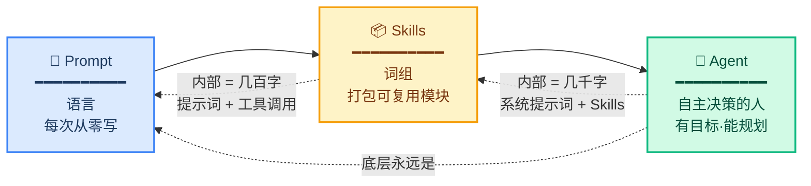
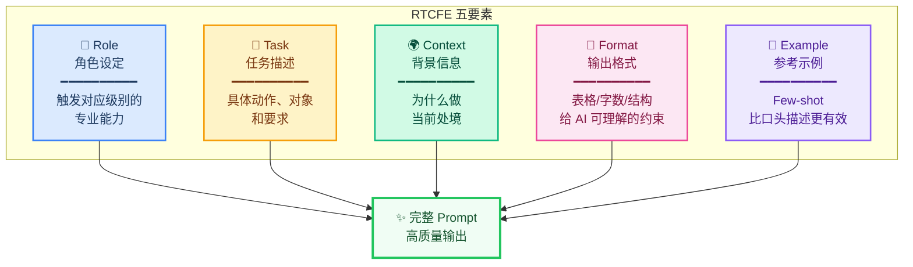
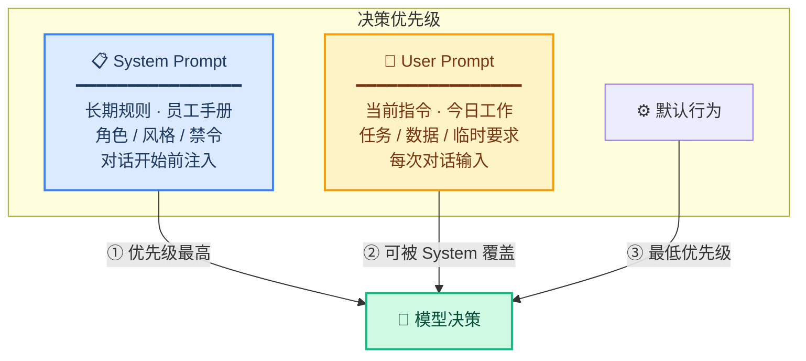
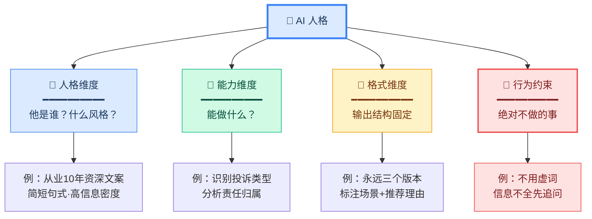
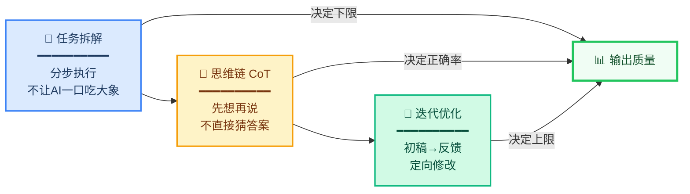
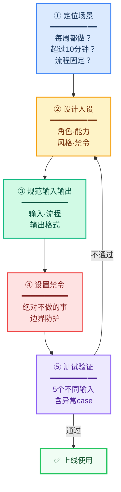
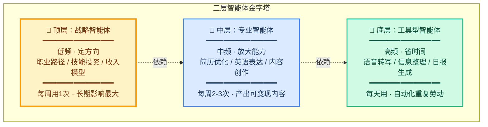

# 提示词工程

## 核心结论

> [!abstract] 五句话掌握全貌
> 1. 提示词（Prompt）是人类与 AI 之间的**唯一协议层**，说话的精准度直接决定 AI 的输出质量
> 2. 一个合格的 Prompt 需要包含 **RTCFE 五要素**：Role、Task、Context、Format、Example
> 3. **System Prompt** 是"长期规则"，**User Prompt** 是"当前指令"，二者分层使用可大幅提升效率
> 4. 复杂任务的核心方法论：==拆解 → 思维链引导 → 迭代优化==，不要让 AI 一步到位
> 5. 单个 Prompt 是工具，一套 Prompt 是系统，==体系化复用才有复利==

## 关键概念

| 概念 | 一句话解释 |
|------|-----------|
| **Prompt** | 人类与 AI 沟通的语言，是所有 AI 应用的底层地基 |
| **Skills** | 把常用提示词 + 知识 + 工具打包成的可复用模块 |
| **Agent（智能体）** | 有目标、能规划、可自主选择调用 Skills 完成任务的 AI 系统 |
| **System Prompt** | 对话开始前注入的长期规则，定义角色、风格、边界，优先级高于 User Prompt |
| **User Prompt** | 每次对话的临时指令，只影响当前任务 |
| **RTCFE** | Role（角色）、Task（任务）、Context（背景）、Format（格式）、Example（示例） |
| **CoT** | Chain of Thought 思维链，强迫 AI 先推理再给结论 |
| **MECE** | 相互独立、完全穷尽，用于检查任务拆解质量 |

---

## 一、Prompt / Skills / Agent 三层关系



| 层级 | 类比 | 说明 |
|------|------|------|
| Prompt | 语言 | 一个词一个词组成句子，每次从零开始写 |
| Skills | 词组 | 把常用提示词打包，下次直接调用 |
| Agent | 自主决策的人 | 有目标、能规划、自主选择 Skills 执行 |

> [!important] 关键认知
> 三层底层==永远是提示词==。提示词不是过时了，而是从显性技能变成了隐性地基。

> [!example] 实操例子
> 用 Claude Code 时，你说"帮我重构这个函数"是 **Prompt 级**；把"重构函数 + 运行测试 + 检查覆盖率"打包成一条指令是 **Skill 级**；Claude Code 自己读代码、决定改哪些文件、跑测试、修 bug 直到通过，是 **Agent 级**。

---

## 二、RTCFE 五要素框架



| 要素 | 含义 | 作用 |
|------|------|------|
| **R** - Role | 角色设定 | 给 AI 设定专业身份，触发对应级别的专业能力 |
| **T** - Task | 任务描述 | 具体的动作、对象和要求 |
| **C** - Context | 背景信息 | 为什么要做、当前处境，==容易被忽略但最关键== |
| **F** - Format | 输出格式 | 表格/字数/结构等，给 AI 可理解的输出约束 |
| **E** - Example | 参考示例 | Few-shot learning，给 AI 看想要的风格比口头描述更有效 |

### Role 的作用

没有角色设定时，AI 只给出泛泛的回答；设定资深角色后，AI 会站在专家视角给出更深层次的分析。

> [!example] 实操对比：代码审查
> **无角色 Prompt**："这段代码有什么问题？"
> → AI 只能看到表面问题，说"代码逻辑比较清晰"
>
> **有角色 Prompt**："你是一位有实战经验的资深工程师，擅长代码审查和性能优化。请审查下面代码，重点关注安全性、性能和最佳实践。"
> → AI 检查出 SQL 注入、N+1 查询、连接泄露等深层问题

### Context 的作用

缺少 Context 的 Prompt ==像给快递员一个名字却没给地址==。Context 中的每一条信息都会触发 AI 输出的特定变化。

> [!example] 实操对比：请假邮件
> **无 Context**："帮我写一封请假邮件"
> → AI 不知道请几天、为什么请，只能给一个空框架
>
> **有 Context**："我是一家 500 人互联网公司的产品经理，下周一到周三需要请假，家里有急事，长辈生病了"
> → AI 根据每个细节生成完整的请假邮件，包括工作交接安排

### Example 的作用

==说一百遍"要简洁"不如给一个目标风格的示例==。

> [!example] 实操对比：AI 笔记应用 slogan
> **无示例**："帮我写五条 AI 笔记应用的 slogan"
> → 生成适用于任何应用的通用文案，换到别的产品也成立
>
> **有示例**："参考 Notion 的 *'Your connected workspace'* 和 Linear 的 *'Build better products'* 的风格，短句、有态度、第二人称、避免抽象词汇"
> → 生成有品牌感、不可替换到其他产品的专属文案

---

## 三、System Prompt vs User Prompt



| 维度 | System Prompt | User Prompt |
|------|---------------|-------------|
| 定位 | 底层控制层 | 执行层 |
| 注入时机 | 对话开始前 | 每次对话输入 |
| 可见性 | 用户不可见 | 用户可见 |
| 生效范围 | 跨多轮持续生效 | 只影响当前任务 |
| 优先级 | ==更高== | 更低 |
| 类比 | 员工手册 | 每天分配的具体工作 |

> [!tip] 最优策略
> **一次定义 System，多次复用 User**。把稳定部分（角色、规则、格式）放 System，把变化部分（任务、数据）放 User。

实操例子：语音转写场景。

System Prompt（配一次）：
```
你是一个语音转写助手：
- 输出接近逐字稿
- 只做轻清洗（去口头禅、重复词）
- 保留原句结构和表达习惯
- 禁止总结、改写、提炼
```

User Prompt（每次变）：
```
任务：转写这段语音
要求：删除"嗯、啊、就是"，保持原句顺序
内容：xxx语音文本
```

---

## 四、AI 人格构建四维度



构建完整的 System Prompt 需要覆盖四个维度：

1. **人格维度**：AI 是谁，书写风格是什么
2. **能力维度**：在这个场景中能做什么
3. **格式维度**：固定输出的结构和形式
4. **行为约束**：边界在哪，哪些事绝对不做

> [!example] 四维度逐步提升实战：咖啡品牌营销文案助手
>
> **V1（无人设）**："帮我写一份咖啡营销文案，云南高海拔精品咖啡豆"
> → "承载着云南大地的灵韵，轻轻研磨，山花的芬芳"——换到任何咖啡品牌都能用。通用模板，==打 25 分==
>
> **V2 +人格维度**：追加"你是一位从业十年的精品咖啡品牌资深文案，风格是简短句式、信息密度高、用具体动词、避免抽象词汇"
> → 字数明显减少，每段信息量明确，很少空话和废话
>
> **V3 +格式维度**：追加"必须给出三个版本，每个版本最多两句话，标注适用场景，最后给出推荐并说明理由"
> → 三个版本各有独到理解，附带推荐理由，可以直接拿去用
>
> **V4 +行为约束**：追加"绝对不用'赋能''匠心'等虚词；绝对不用'综上所述'等结构词；没有具体产品信息时先追问"
> → 给一个新产品"我出了一款新茶"，AI ==不再直接写文案，而是先问品种、产地、口感等信息==

> [!warning] 反向排除法的威力
> 好的 Prompt 不仅在一般情况下表现好，还要在==输入信息残缺时知道如何应对==。加了几行"绝对不要做"的限制后，AI 在信息残缺时会主动追问而非直接编造。

---

## 五、复杂任务方法论：拆解 → CoT → 迭代



### 5.1 任务拆解

不要让 AI 一口吞下大任务，分步执行反而效果更好。每一步的任务小目标轻，AI 的注意力不会跑偏，输出质量就上去了。

三种拆解方式：

| 方式 | 适用场景 | 示例 |
|------|----------|------|
| **按阶段拆** | 流程型任务 | 写汇报：收集 → 提炼 → 结构化 → 润色 |
| **按视角拆** | 分析/决策类 | 评估方向：用户视角 → 市场视角 → 竞争视角 → 执行视角 |
| **按深度拆** | 陌生领域 | 先全局框架 → 深挖关键点 → 具体行动方案 |

> [!tip] MECE 原则（麦肯锡）
> 拆出来的块彼此==不重叠==（ME），加起来==不遗漏==（CE）。用这个标准检查你的拆解质量。

> [!example] 实操：写月度工作汇报，按阶段拆成四个独立 Prompt
>
> **Prompt 1（收集阶段）**："你是我的工作助理，我需要准备月度汇报。请按以下方向逐一问我：本月主要任务和项目、有哪些关键成果和数据、遇到了什么问题怎么解决的、下月打算做什么。每次只问一个问题，等我回答后再问下一个。"
> → AI 扮演访谈者，帮我把散乱的信息一条条抠出来
>
> **Prompt 2（提炼阶段）**："基于刚才的对话，帮我提炼写进报告的内容。提炼标准：有具体数据的优先、能对业务产生直接影响的优先、能体现我个人工作价值的优先。输出：三条核心成果（每条不超过 50 字）、一条重要进展、一条专业反思、三条下月工作计划。"
> → 把判断"什么重要"的标准交给用户定，不让 AI 自己猜
>
> **Prompt 3（结构化阶段）**："把提炼的内容写成月度工作汇报。背景：汇报对象是职能总监，目的是展示工作价值、争取下月资源。结构：一句话核心成果 → 三条核心成果展开 → 重要进展 → 反思与学习 → 下月计划及需要的支持。800 字以内，每段开头加粗小标题。"
> → 用 RTCFE 框架的 R（角色=汇报者）、T（任务=写汇报）、C（背景=汇报场景）、F（格式=结构+字数）
>
> **Prompt 4（润色阶段）**：给出具体反馈做定向修改，见下方迭代优化部分

### 5.2 思维链（Chain of Thought）

核心思想：==先让 AI 想清楚再开口，不要直接猜答案==。

AI 的思考过程和人类类似——面对复杂问题时，不应该直接跳到结论，而是先推理。CoT 的本质是强迫 AI 把中间推理过程写出来。

| 类型 | 方式 | 效果 |
|------|------|------|
| **被动 CoT** | 末尾加"一步一步思考" | 准确率提升 20%-50%（Google 2022 论文），但无法控制思考路径 |
| **主动 CoT** | 明确给出思维框架 | AI 按你给的步骤推理，输出更可控 |
| **访谈式 CoT** | 让 AI 反问补信息 | 信息不全时最有效 |

> [!example] 实操对比：分析字节跳动是否值得投资
>
> **被动 CoT**："分析字节跳动是否值得投资，一步一步思考"
> → AI 给出完整信息，但分析结构可能和你想要的不同
>
> **主动 CoT**："分析字节跳动是否值得投资，先按以下步骤思考：第一步分析商业模式，第二步看财务状况（收入、利润、现金流），第三步分析行业位置，第四步分析三个风险点，第五步综合以上给出明确投资建议。一步完成后再进入下一步。"
> → AI 按你给的专业框架走，输出结构化分析

> [!important] 关键认知
> ==提示词能力和结构化思维能力本质上是同一种能力==。必须先在脑子里清楚这件事应该怎么分析，才能引导 AI 走向正确的方向。问问题的方式决定了 AI 的思考方式。

### 5.3 迭代优化

初稿是起点不是终点。第一版大概率有偏差，这很正常，修改是流程的一部分，不是失败的信号。

**迭代三步法**：

1. **初稿**：用简单 Prompt 让 AI 出一版，目的是发现理解偏差在哪里、漏掉了什么
2. **具体反馈**：指出哪里不好、应该改成什么
3. **定向修改**：告诉 AI 哪些保留、哪些修改

> [!example] 实操对比：对月度汇报初稿的迭代反馈
>
> ❌ **错误方式**："不行，再写一版" → AI 给出完全不同的内容，来回折腾五六次
>
> ✅ **正确方式**（定向反馈）：
> - "第一点：开头那句改成具体数字"
> - "第二点：进展部分没有体现我的判断和贡献，需要补充"
> - "第三点：下月计划太啰嗦，只保留最重要的两条"
> - "第四点：删除所有'综上所述'"
> - "==其他部分保留不变=="

> [!tip] 反馈标准
> 像好的 Code Review 一样——说清楚==为什么不好==，==应该改成什么样子==。永远不要说"再写一版"。

---

## 六、Prompt 智能体构建

### 6.1 五步构建法



**Step 1 - 定位场景**：问三个问题——每周都做吗？每次超过 10 分钟？流程大体相同？三个"是"就适合做成智能体。

> [!example] 场景判断
> ✅ **适合**：写周报、回复邮件、做会议纪要、处理客诉——高频、耗时、流程固定
> ❌ **不适合**：一次性的临时任务、流程不固定的探索性工作

**Step 2 - 设计人设**：用四维度法（角色、能力、风格、禁令），见上文第四节。

**Step 3 - 规范输入输出**：明确三件事：
1. 输入规范：用户要给 AI 什么信息
2. 流程规范：中间走哪几步
3. 输出规范：最终产出什么格式

**Step 4 - 设置禁令**：告诉 AI 绝对不做的事，防止在边界情况下出错。

**Step 5 - 测试验证**：用 5 个不同输入测试，包括正常和异常输入，迭代 3-5 轮后确认稳定。

### 6.2 完整案例：客诉处理智能体

以"客户投诉处理"为例，展示从零搭建的全过程。

**场景判断**：产品每周遇到多次客诉，每次回复前要纠结怎么措辞，流程固定（读取投诉 → 识别诉求 → 判断责任 → 写回复）。三个条件都满足。

**完整 System Prompt**：

```
【角色】
你是一位资深客户经理，处理过上千起投诉案例。
风格：专业、有原则、有策略。相信客户投诉是改进机会，但绝不无条件妥协。

【工作流程】
用户粘贴投诉邮件后，按以下顺序执行：

第一部分：情况分析
1. 投诉类型：产品质量 / 物流延迟 / 期望不符 / 恶意索赔
2. 核心诉求：用一句话概括客户真正想要什么
3. 责任归属：我方责任 / 双方责任 / 客户误解
4. 情绪等级：轻度不满 / 明显愤怒 / 强烈敌对

第二部分：回复策略（给三种）
- 策略A 保守型：偏向让步，适用于我方全责场景
- 策略B 平衡型：各退一步，适用于双方责任场景
- 策略C 强硬型：坚守立场，适用于恶意索赔场景
每种策略需标注：使用场景和潜在风险

第三部分：推荐方案 + 完整邮件
- 说明推荐哪种策略及理由
- 完整回复邮件：开头先共情（不着急解释）→ 中间摆事实提供数据 → 给出 2-3 个可选方案 → 结尾留出空间
- 邮件控制在 400 字以内

【禁令】
- 绝对不做无条件道歉
- 绝对不说空话
- 信息不全时，不要编造事实，而是标注"待核实"
```

**测试验证**：用三种不同类型的投诉测试：

| 测试输入 | AI 判断 | 推荐策略 |
|----------|---------|----------|
| "你们的 app 昨天宕机了，我 3 个小时不能工作，你们怎么赔？" | 产品问题 → 我方责任 → 明显愤怒 | 策略A（保守型），给出补偿方案 |
| "销售告诉我可以导出无限数据，现在又说要限制，这是欺诈" | 双方沟通问题 → 双方责任 → 相对克制 | 策略B（平衡型），承认问题但要求对方也确认条款 |
| "你们就是骗子，我要索赔一百万" | 恶意索赔 → 需进一步核实 → 强烈敌对 | 策略C（强硬型），要求提供损失证明，拒绝不合理金额 |

> [!important] 关键设计
> 三种投诉输入同一个智能体，AI ==不是按模板套，而是根据情况分析针对性调整==回复策略和措辞。这就是智能体比单个 Prompt 强的地方——它能根据输入自动选择合适的行为路径。

### 6.3 更多智能体示例

**周报生成助手**：

```
【角色】你是我的工作汇报教练，擅长从散乱的工作记录中提炼核心价值。
【流程】用户粘贴一周工作描述 → 复述确认理解 → 追问最多3个关键问题 → 提出2-3个核心成果 → 按模板输出周报 → 询问是否需要修改。
【格式】一句话总结 + 核心成果（3条）+ 关键进展 + 下周计划。
【禁令】不要编造数据，不要用"综上所述"，追问只聚焦对成果判断影响大的信息。
```

**会议纪要助手**：

```
【角色】你是专业会议助理，擅长把杂乱的会议内容整理成结构化纪要。
【流程】用户粘贴会议记录（录音转写或手写笔记均可）→ 识别会议类型 → 选择合适模板 → 提取决策项和行动项 → 标出未明确事项。
【格式】表格形式：任务 | 负责人 | 截止日期 | 未明确事项单独标出。
【禁令】不要漏掉任何行动项，不确定的信息标注"待确认"而非自行补全。
```

**营销文案助手**：

```
【角色】你是从业十年的品牌文案，擅长为产品生成有辨识度的营销文案。
【流程】用户描述产品 → 先追问核心卖点、目标用户、差异化优势 → 提供3个不同风格版本 → 每个版本标注适用场景 → 给出推荐和理由。
【格式】3个版本，每个版本1-2句话，附适用场景和推荐理由。
【禁令】不用虚词（赋能、匠心、极致），不用结构词（综上所述），产品信息不全时先追问再动笔。
```

---

## 七、三层智能体体系

### 7.1 体系总览



| 层级 | 定位 | 频率 | 核心作用 | 缺失后果 |
|------|------|------|----------|----------|
| **顶层：战略智能体** | 决策 | 低频（每周1次） | 定方向、规划路径、做关键选择 | 只有底层 → ==很忙但不值钱== |
| **中层：专业智能体** | 能力放大 | 中频（每周2-3次） | 产出可变现的专业内容 | 没中层 → ==无法变现== |
| **底层：工具型智能体** | 提效 | 高频（每天用） | 自动化重复劳动 | 只有顶层 → ==空想== |

> [!important] 核心逻辑
> ==底层解决效率（省时间）、中层提升能力（能赚钱）、顶层决定方向（不走错路）==。三者缺一就会失衡。

### 7.2 底层：工具型智能体（高频，提效）

**作用**：节省时间，自动化重复劳动。

**示例 1 - 语音转写器**：

```
【Role】你是一个语音逐字转写助手
【Task】将输入内容转写为接近逐字稿文本
【Context】用户需要保留原话表达，但去掉无效噪音，不能被总结或改写
【Format】按自然段输出，保持原句顺序，不添加标题、不总结、不重写
【Rules】
- 删除：嗯、啊、就是、那个、你知道吧 等口头禅
- 删除重复词（如"我我我觉得"→"我觉得"）
- 保留原句结构和语气
- 禁止总结、禁止改写、禁止提炼观点
```

**示例 2 - 信息整理器**：

```
【Role】你是信息结构化整理专家
【Task】将输入内容整理为清晰要点
【Context】内容通常杂乱、口语化，需要提炼但不丢信息
【Format】一级：核心主题 / 二级：要点（3-6条）/ 每条≤20字
【Rules】删除废话，合并重复表达，保留所有有效信息，不新增内容
```

**示例 3 - 日报生成器**：

```
【Role】你是工作日报整理助手
【Task】把用户输入的今日工作内容整理成结构化日报
【Format】已完成事项 | 进行中事项 | 明日计划 | 需要协助
【Rules】不编造工作内容，区分确定事实和待确认事项
```

### 7.3 中层：专业智能体（中频，能力放大）

**作用**：提供专业判断，产出"可卖钱"的内容。

**示例 1 - 供应链简历优化器**：

```
【Role】你是外企供应链招聘经理，看过上千份简历
【Task】优化简历内容，对标外企岗位要求
【Context】用户背景：供应链/跟单/采购，希望对标外企岗位
【Format】每条改写为：动词 + 行为 + 结果（量化）
【Rules】
- 必须量化（如：提升20%、节省成本、缩短周期）
- 使用强动词（led / optimized / reduced / improved）
- 删除空话（负责、参与等）
- 保持真实，不编造经历
```

改写对比：

| 原文 | 改写后 |
|------|--------|
| 负责订单跟进 | Managed order lifecycle, reduced delivery delays by 15% |
| 参与供应商谈判 | Negotiated with 20+ suppliers, achieved 8% cost reduction |
| 做库存管理 | Optimized inventory policy, reduced stockout incidents by 30% |

**示例 2 - 英语表达优化器**：

```
【Role】你是英语母语表达优化专家
【Task】优化句子表达，用于面试或教学
【Format】输出三部分：1. 优化后表达 2. 中文解释 3. 可替换表达（1-2个）
【Rules】不改变原意，提升自然度，避免中式英语
```

改写对比：

| 原文 | 优化后 |
|------|--------|
| I think your company is very good, I want to join | I'm impressed by your team's approach to X — it aligns with how I think about Y |
| My English is not good, please understand | I'm continuing to sharpen my communication skills, especially in professional contexts |

**示例 3 - 内容创作助手**：

```
【Role】你是内容策略顾问，擅长平台化内容创作
【Task】根据用户输入的主题，生成适合目标平台的创作方案
【Format】标题方案（3个） + 大纲 + 关键论点 + 预估字数
【Rules】标题要符合平台风格，内容要有具体观点而非空话，给出数据支撑建议
```

### 7.4 顶层：战略智能体（低频，高价值）

**作用**：做决策、定方向、规划路径。每周用 1 次，但对长期影响最大。

**示例 1 - 职业路径规划器**：

```
【Role】你是职业策略顾问
【Task】制定可执行的职业发展路径
【Context】
目标：3-5年去日本工作
背景：国际经济与贸易专业 / 供应链经验 / IELTS 6.5 / 无日语基础
【Format】
1. 关键结论（3条）
2. 路径拆解（阶段1/2/3，每阶段6个月）
3. 每阶段具体目标和可量化检查点
4. 风险与替代方案
【Rules】必须现实可执行，给出优先级，不给空泛建议
```

**示例 2 - 技能投资决策器**：

```
【Role】你是个人成长投资顾问
【Task】帮用户评估某项技能是否值得投入时间学习
【Context】用户时间有限，需要判断优先级
【Format】
1. 投入产出比评估（时间/金钱 vs 回报）
2. 3个月内可达到的水平
3. 与当前职业目标的关联度
4. 明确建议：投入 / 观望 / 放弃
【Rules】给具体判断，不要说"看个人情况"
```

**示例 3 - 收入模型分析器**：

```
【Role】你是个人商业模式顾问
【Task】分析用户的收入来源组合是否合理，提出优化建议
【Format】
1. 当前收入结构分析（时间换钱 / 技能变现 / 被动收入）
2. 最优收入模型推荐
3. 过渡路径（从当前到最优，分3步）
4. 每步需要的最小行动
【Rules】基于用户实际情况分析，不推荐不切实际的方案
```

---

## 八、掌握验证

> [!note] 使用说明
> 以下自测题覆盖本笔记所有核心方法论。如果你能==不看原文==回答出来，说明已掌握。

#### 基础概念验证

**Q1**：Prompt、Skills、Agent 三层的关系是什么？Agent 的底层还是 Prompt 吗？

**Q2**：RTCFE 五要素分别是什么？哪一个最容易被忽略？为什么 Context 对输出质量影响最大？

**Q3**：System Prompt 和 User Prompt 的优先级关系是什么？如果两者冲突，模型听谁的？

#### 方法论验证

**Q4**：你接到一个任务"帮我分析竞品"，请用 RTCFE 框架写出一个完整 Prompt。

> [!check] 参考答案检查点
> 是否包含角色（行业分析师）、任务（分析竞品X的优劣势）、背景（你的产品是什么、为什么要分析）、格式（表格/要点）、示例（分析框架参考）

**Q5**：以下场景应该用哪种任务拆解方式？
- a) 写一篇公众号文章 → 按阶段拆（大纲 → 逐段 → 润色）
- b) 评估是否该转行 → 按视角拆（兴趣 / 市场 / 能力 / 风险）
- c) 了解一个陌生的技术领域 → 按深度拆（全局 → 关键点 → 行动）

**Q6**：被动 CoT、主动 CoT、访谈式 CoT 分别适合什么场景？请在每个场景中给出你会在 Prompt 末尾加的那句话。

> [!check] 检查点
> - 被动 CoT："请一步一步思考再回答"——适合你不确定 AI 会怎么想的场景
> - 主动 CoT："请先按以下步骤分析：第一步...第二步..."——适合你清楚应该怎么分析的场景
> - 访谈式 CoT："如果信息不足，请先问我问题再回答"——适合信息不全的场景

**Q7**：你对 AI 的月报初稿不满意，请写出一条合格的迭代反馈（不是"再写一版"）。

> [!check] 参考答案检查点
> 是否具体指出了==哪里不好==、==应该改成什么==、==哪些部分要保留==

#### 实战验证

**Q8**：你要做一个"英语邮件助手"智能体，请写出完整的 System Prompt（覆盖四维度：人格、能力、格式、禁令）。

> [!check] 检查点
> - 人格维度：是否定义了角色（如"外企英语邮件写作顾问"）和风格
> - 能力维度：是否说明了擅长什么（如商务邮件、正式语气、文化差异）
> - 格式维度：是否固定了输出结构（如先给修改后版本，再解释改动原因）
> - 禁令维度：是否设定了边界（如不改变原意、不使用过于随意的表达）

**Q9**：判断以下场景是否适合做成智能体，并说明理由：
- a) 每天整理学习笔记 → ✅ 高频、流程固定
- b) 决定是否要考研 → ❌ 低频、一次性重大决策，适合用顶层战略智能体做一次分析，但不值得封装成日常智能体
- c) 每周写工作周报 → ✅ 高频、流程固定、耗时

**Q10**：你目前的工作/学习中，找出三个适合做成智能体的场景，分别对应三层体系中的哪一层？

> [!check] 检查点
> 底层应该是每天用的工具（省时间），中层应该是提升专业能力的（能变现），顶层应该是做方向决策的（不走错路）

---

## 九、未来扩展

提示词工程正在快速演进，以下是值得关注的趋势和方向：

### 9.1 当前已成熟

| 方向 | 说明 | 当前状态 |
|------|------|----------|
| **多模态 Prompt** | 不只是文字，还包括图片、音频、视频作为输入 | 已落地（GPT-4o、Claude 支持图片输入） |
| **结构化输出** | 要求 AI 输出 JSON、XML 等结构化数据，方便程序调用 | 已落地（OpenAI Structured Outputs、Anthropic Tool Use） |
| **Prompt 缓存** | 复用之前处理过的 Prompt 前缀，降低成本和延迟 | 已落地（Prompt Caching） |

### 9.2 正在发展

| 方向 | 说明 | 意义 |
|------|------|------|
| **自动 Prompt 优化** | AI 自动迭代优化 Prompt 本身（如 DSPy 框架），不再依赖人手写 | 提示词从"手艺"变成"工程"，可量化、可优化 |
| **多 Agent 协作** | 多个专业智能体分工协作（如一个负责研究、一个负责写作、一个负责审核） | 从单个智能体进化到智能体团队 |
| **RAG + Prompt 融合** | 检索增强生成自动从知识库中检索相关内容注入 Context | 解决 Context 手动提供的瓶颈 |
| **自我反思与修正** | Agent 执行后自动评估输出质量，发现问题后自我修正再执行 | 减少"写一次就提交"的错误率 |

### 9.3 值得关注的探索方向

- **Prompt 安全与对抗**：Prompt Injection、越狱攻击等安全问题正在成为新战场
- **领域专用 Prompt 语言**：从自然语言向半结构化、领域专用语言演进（类似口头描述 → SQL）
- **个性化长期记忆**：Agent 能记住用户偏好和历史交互（如 Claude 的 Memory 功能）
- **Prompt 版本管理与测试**：像代码一样做版本控制、A/B 测试、回归测试

> [!important] 核心趋势
> 提示词正在从"个人技巧"变成"工程学科"——==可度量、可复用、可协作、可迭代==。

---

## 可执行动作

> [!todo] 立即可做的 5 件事
> - [ ] 选取一个高频重复任务（如写周报、转写），用 RTCFE 框架写出第一版 System Prompt
> - [ ] 用四维度法完善人设（角色、能力、格式、禁令），重点补充"绝对不要做"的约束
> - [ ] 用"4 步流水线"跑一次真实任务：转写 → 提炼 → 结构化 → 润色
> - [ ] 封装成一个可复用的智能体，一次搭建长期使用
> - [ ] 逐步搭建三层体系，先底层工具，再中层专业能力，最后顶层战略

## 原话摘录

> [!quote] 课程金句
> 提示词从来没有过时，它只是被封装进了 Agent 里面。
>
> 提示词能力和结构化思维能力本质上是同一种能力。
>
> 你第一个 AI 资产，不是 Prompt，而是"可复用流程"。

## 待补充问题

- 不同大模型（Claude、GPT-4、豆包）对同一 System Prompt 的响应差异
- Prompt 智能体的版本管理与迭代记录方法
- 多个智能体之间的协作编排方式
- DSPy 等自动 Prompt 优化框架的实践效果
