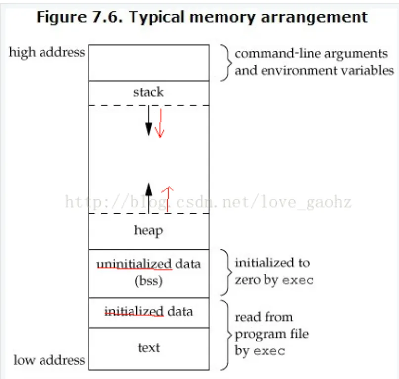

# 学习笔记： C语言内存分布图

在 C 语言程序运行时，内存被划分为几个主要区域，每个区域都有不同的用途和特点。以下是 C 语言内存分布的常见图示和解释：

https://blog.csdn.net/liuchunjie11/article/details/80431184




## 内存区域详解

1. **操作系统保留区 (OS Reserved)**
   - 包括操作系统使用的内存区域，这部分一般不对用户程序直接可见。

2. **代码区 (Text Segment)**
   - 存储程序的可执行代码。这部分内存是只读的，防止程序在运行时修改自己的指令。

3. **全局/静态数据区 (Global/Static Data)**
   - 存储全局变量和静态变量。这些变量在程序运行期间存在，并且只有一份。

4. **堆 (Heap)**
   - 动态分配内存区域，通过函数如 `malloc()` 和 `free()` 管理。程序在运行时可以动态申请和释放内存。

5. **栈 (Stack)**
   - 存储函数的局部变量和函数调用信息。栈内存由操作系统自动管理，栈的内存分配和释放是自动的。栈是从高地址向低地址增长的。

## 内存分配示例

- **全局变量 (`globalVar`)**: 存储在 **全局/静态数据区**。全局变量在程序的整个生命周期内都存在，并且在程序的所有函数中都可以访问。

- **局部变量 (`localVar`)**: 存储在 **栈区**。局部变量在函数调用时分配内存，当函数返回时，内存会被释放。

- **动态分配的内存 (`dynamicVar`)**: 存储在 **堆区**。通过动态内存分配函数（如 `malloc()`）分配的内存可以在程序运行时按需申请和释放。

以下是一个简单的示例，演示了如何在不同的内存区域分配变量：

```c
#include <stdio.h>
#include <stdlib.h>

// 全局变量
int globalVar = 10;

void function() {
    // 局部变量
    int localVar = 20;
    
    // 动态分配内存
    int *dynamicVar = (int*)malloc(sizeof(int));
    *dynamicVar = 30;

    // 输出变量的地址
    printf("Global Variable Address: %p\n", (void*)&globalVar);
    printf("Local Variable Address: %p\n", (void*)&localVar);
    printf("Dynamic Variable Address: %p\n", (void*)dynamicVar);

    // 释放动态分配的内存
    free(dynamicVar);
}

int main() {
    function();
    return 0;
}

## 相关笔记
<!-- AUTO-RELATED-START -->
- [C语言学习笔记](../C.md)
- [编程语言学习笔记](../../编程语言.md)
- [学习笔记： 全局变量 sizeof](02_全局变量.md)
<!-- AUTO-RELATED-END -->
