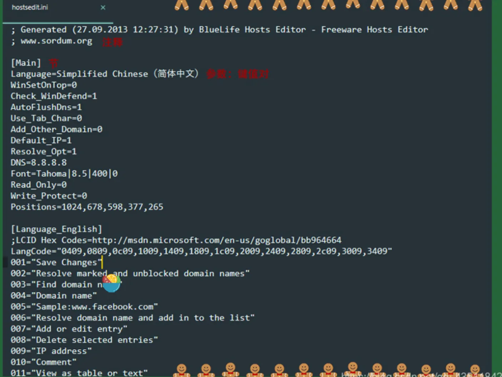

# Windows 平台程序常见文件夹和文件

在 Windows 平台上，有许多常见的文件类型和文件夹，它们在程序开发和运行中扮演重要角色。以下是一些常见文件类型及其说明：

## 1. `.ini` 文件 — 初始化文件

- **用途**: `.ini` 文件用于存储系统和程序配置。它们通常包含程序的初始化参数和设置。
- **特性**:
  - 使用分号（`;`）作为注解标记。分号后的文字直到行尾都视为注解，不会被处理。
  - 示例内容：
    ```ini
    [SectionName]
    Key=Value
    ; This is a comment
    ```

    
    
## 2. `bin` 文件夹

- **用途**: `bin` 文件夹通常用于存放可执行的二进制文件，如程序的主执行文件。
- **说明**: `bin` 是 "binary" 的缩写，表示存放二进制文件的文件夹。

## 3. `.lib` 文件和 `.dll` 文件

### `.lib` 文件（静态链接库）

- **用途**: `.lib` 文件用于静态链接，在编译阶段将函数和变量的地址信息嵌入到最终的可执行文件中。
- **特性**:
  - 静态链接库的代码在编译时直接包含在生成的 EXE 文件中，不需要在运行时加载。
  - 示例：`example.lib`

### `.dll` 文件（动态链接库）

- **用途**: `.dll` 文件在程序运行时动态加载，提供函数、变量和类的实现。
- **特性**:
  - 动态链接库允许程序在运行时根据需要加载和卸载库文件，提高了模块化和可维护性。
  - 示例：`example.dll`

### 静态链接与动态链接的区别

1. **静态链接**:
   - 代码在编译阶段直接包含在最终生成的可执行文件中。
   - 优点：无需在运行时加载库，适用于简单的应用程序。
   - 缺点：增加了生成文件的大小，所有依赖都被包含在一个文件中。

2. **动态链接**:
   - 程序在运行时动态加载库文件，EXE 文件不包含所有库代码。
   - 优点：减少了可执行文件的大小，可以在运行时更新库而不重新编译应用程序。
   - 缺点：需要处理 DLL 文件的路径和版本兼容性问题。

### 链接过程

- **编译和链接**: 程序编译和运行涉及两个主要过程：
  1. **编译**: 将源代码转换为对象文件（.obj）。
  2. **链接**: 将对象文件与库文件中的符号进行关联，生成最终的可执行文件（.exe）。

- **链接类型**:
  - **静态链接**: 将所有需要的代码直接包含到可执行文件中。
  - **动态链接**: 仅在运行时加载所需的库文件（DLL）。

## 其他相关说明

- **动态/静态库的通用性**:
  - 动态库和静态库的概念是通用的，不仅限于 C/C++ 语言。
  - Windows 平台上，动态库使用 `.dll` 后缀，静态库使用 `.lib` 后缀。
  - 在 Linux 平台上，动态库使用 `.so` 后缀，静态库使用 `.a` 后缀。
  - Java 程序通过 JNI 可以调用本地库，但 Java 本身通过虚拟机运行，不直接涉及这些库。

这些文件和文件夹在 Windows 平台上是程序开发和运行的重要组成部分，了解它们的用途和特性可以帮助你更好地管理和维护你的项目。
