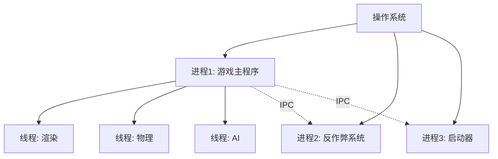
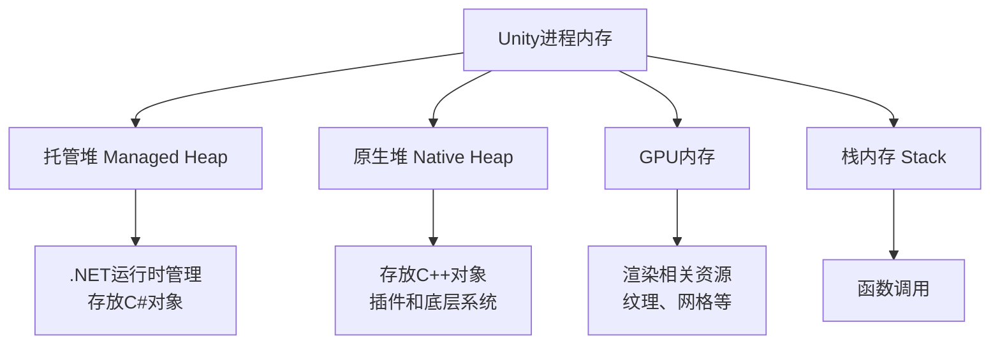

## 📊 图解

> [!info] 图示区
> 这里可以放置解释进程概念的 mermaid 图表、UML 类图或其他辅助理解的图片

## 📖 原理

### 核心概念

进程（Process）是操作系统分配资源的基本单位，是一个正在运行的程序的实例。

**主要特征：**
- 独立的内存空间
- 独立的系统资源
- 独立的执行上下文

在游戏开发中，Unity 游戏应用本身就是一个进程。

### 进程 vs 线程

| 特性 | 进程 | 线程 |
|------|------|------|
| 内存空间 | 独立 | 共享 |
| 资源占用 | 高 | 低 |
| 通信开销 | 大 | 小 |
| 创建成本 | 高 | 低 |
| 数据共享 | 困难 | 容易 |

## 💡 面试题

### Q1：什么是进程？它在游戏开发中的意义是什么？

进程本质上是操作系统分配资源的基本单位，是一个正在运行的程序的实例。它拥有独立的内存空间、系统资源和执行上下文。在游戏开发中，比如我们的 Unity 游戏应用本身就是一个进程。

**进程对游戏开发的意义主要体现在几个方面：**

1. **内存隔离性**：游戏作为一个独立进程运行，保证了内存隔离性，提高了系统稳定性

2. **进程间通信**：现代游戏可能需要与其他进程通信，比如与游戏平台、反作弊系统或辅助工具进行交互

3. **多线程并行**：我们通常会在单个游戏进程内创建多个线程来处理不同任务，如：
   - 渲染线程
   - 物理计算线程
   - 资源加载线程
   
   以充分利用多核处理器提高性能

> [!warning] 注意事项
> Unity 的主要 API 不是线程安全的，所以我们必须谨慎处理跨线程操作。

---

### Q2：进程和线程有什么区别？在游戏开发中如何取舍？

进程和线程的主要区别在于资源占用和通信效率。进程拥有独立的内存空间和系统资源，而线程则共享所属进程的内存和资源。

**在游戏开发中的取舍主要考虑以下几点：**

#### 1️⃣ 优先使用多线程的场景

对于核心游戏逻辑，我们通常使用**线程**而非多进程，因为：
- 线程间共享内存，通信开销小
- 适合频繁交互的游戏内部系统

> 💡 **示例**：在 Unity 中，我们可能用额外线程处理：
> - AI 计算
> - 寻路
> - 物理模拟
> 
> 这些都是不依赖 Unity 主线程的任务

#### 2️⃣ 适合使用多进程的场景

在某些场景下，多进程架构更有优势：

| 场景 | 说明 |
|------|------|
| 🎮 **启动器分离** | 游戏的启动器和主程序分离，可以实现更新游戏时不关闭启动器 |
| 🛡️ **反作弊系统** | 反作弊系统通常作为独立进程运行，增强安全性 |
| ⚡ **资源密集型任务** | 视频编码、大规模数据处理等，防止游戏崩溃时连带它们一起崩溃 |

#### 3️⃣ 移动平台的特殊考虑

移动平台上，由于资源限制，多进程使用更谨慎，一般只在必要时使用，如热更新组件可能独立进程运行。

#### ✅ 总结

游戏主体通常作为单一进程，内部使用多线程处理并行任务，而只在确实需要隔离或独立运行的功能上才考虑多进程架构。理解两者特性，根据具体需求灵活选择，才能构建高效稳定的游戏系统。

---

### Q3：请解释游戏开发中常见的进程间通信方式及其应用场景

在游戏开发中，几种常见的进程间通信（IPC）方式及其应用场景如下：

#### 🔄 IPC 方式对比

| IPC 方式 | 特点 | 游戏开发应用场景 |
|----------|------|------------------|
| **共享内存** | 最高效，多进程映射同一物理内存 | • 游戏与反作弊系统共享场景数据 • 主游戏与插件系统交换资源 |
| **管道/命名管道** | 适合单向或双向数据流 | • 日志收集系统 • 启动器与主游戏间的简单指令传递 |
| **消息队列** | 异步通信，收发不必同时 | • 成就系统 • 社交功能通知 |
| **套接字** | 最通用，适合跨网络 | • 游戏与本地辅助工具（DPS 统计、地图浏览器） • 网游客户端与服务器通信 |
| **内存映射文件** | 文件映射到地址空间 | • 加载器与主游戏传递初始化数据 • 游戏与编辑器工具共享资源 |

#### 💡 实战案例

> **案例 1**：主游戏与反作弊系统之间需要频繁交换大量数据又要求低延迟
> - **选择**：共享内存
>
> **案例 2**：游戏与社区 App 集成时，由于跨平台考虑和安全因素
> - **选择**：本地套接字通信

> [!tip] 核心要点
> 理解不同 IPC 机制的特点和适用场景，对构建高效、稳定、模块化的游戏系统至关重要，特别是当游戏规模增长到需要多进程协作的程度时。

---

### Q4：Unity游戏作为一个进程，它的内存布局有什么特点？如何进行内存管理？

#### 🧠 Unity 进程内存布局

Unity 进程的内存分为几个主要部分：

#### 📊 内存管理策略

Unity 采用了**混合式内存管理策略**：

| 内存类型 | 管理方式 |
|----------|----------|
| .NET 部分（托管堆） | 垃圾收集器（GC）自动管理 |
| C++ 部分（原生堆） | 手动管理或使用智能指针 |

#### 🎯 实际开发中的内存管理要点

##### 1️⃣ 控制 GC

频繁的垃圾收集会导致游戏卡顿。

**优化策略：**
- 使用对象池模式复用对象
- 避免在热点代码中分配临时对象
- 合理控制更新频率

> 💡 **实战案例**：在一个开放世界游戏中，我们为常用敌人、特效都建立了对象池，显著减少了运行时内存分配。

##### 2️⃣ 资源加载策略

大型游戏中，我会实现：
- **分区域加载卸载机制**：确保玩家看不到的内容不占用内存
- **异步加载和预加载技术**：提升体验
- **资源管理系统**：使用 Asset Bundle 或 Addressables，避免资源重复加载

##### 3️⃣ 内存泄漏防范

特别需要注意：
- C# 与原生代码交互处的内存管理
- 确保跨边界对象正确释放
- 建立严格的代码审查流程
- 定期使用 Unity Profiler 和 Memory Profiler 检测内存使用情况

##### 4️⃣ 针对不同平台优化

| 平台 | 策略 |
|------|------|
| 📱 **移动平台** | 内存有限，需要更激进的资源管理策略 |
| 🎮 **主机/PC** | 可适当提高资源质量和预加载量 |

---

## 🔗 相关链接

- [[操作系统和编译原理]] - 父主题索引
