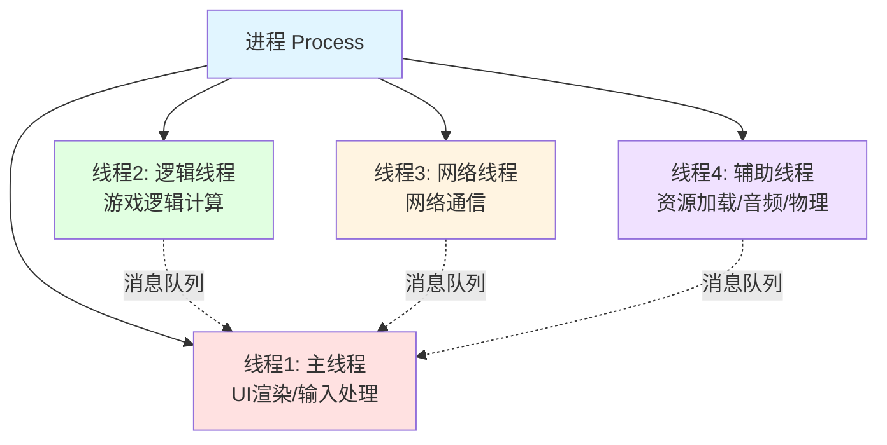
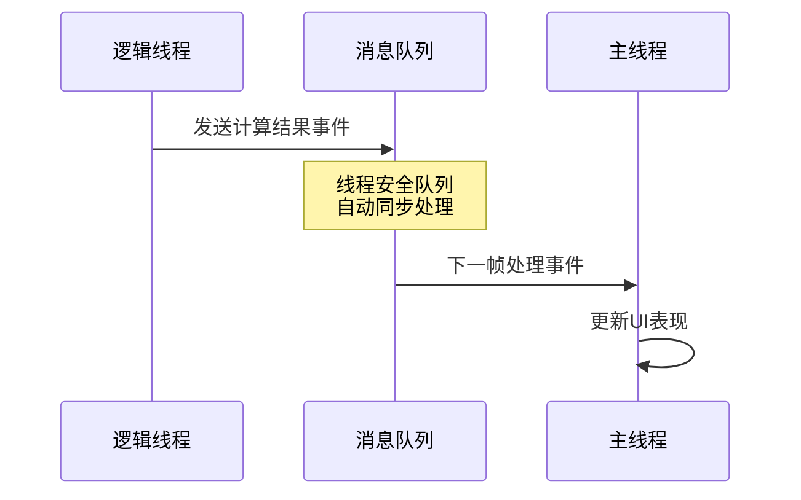
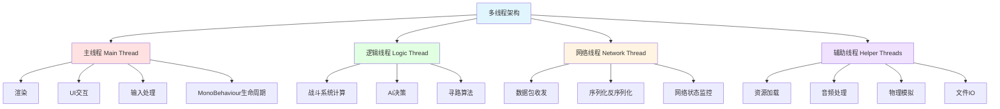
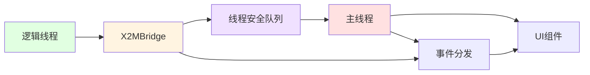
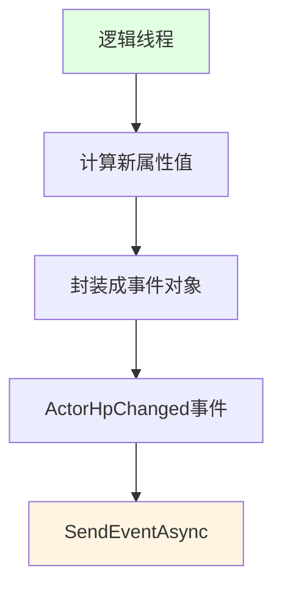
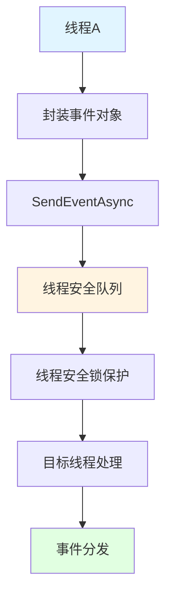

## 📊 图解

> [!info] 图示区
> 这里可以放置解释线程概念的 mermaid 图表、UML 类图或其他辅助理解的图片

**多线程架构通信流程：**

## 📖 原理

### 核心概念

线程（Thread）是进程内的执行单元，是 CPU 调度的基本单位。

**主要特征：**
- 共享进程的内存空间
- 拥有独立的线程栈和程序计数器
- 创建、销毁和切换开销远小于进程
- 同一进程内的线程可以直接访问共享数据

### 线程 vs 进程

| 特性 | 进程 | 线程 |
|------|------|------|
| 内存空间 | 独立 | 共享 |
| 资源占用 | 高 | 低 |
| 通信开销 | 大 | 小 |
| 创建成本 | 高 | 低 |
| 数据共享 | 困难 | 容易 |
| CPU 调度单位 | 否 | 是 |

### Unity 中的线程特殊性

> [!warning] 重要限制
> Unity 的主要 API **不是线程安全的**，只有主线程可以调用：
> - GameObject 操作
> - 场景管理
> - UI 更新
> - 大部分 Unity 组件方法

---

## 💡 面试题

### Q1：什么是线程？在游戏开发中它有什么重要性？

线程是进程内的执行单元，共享进程的内存空间，但拥有独立的线程栈和程序计数器。它是 CPU 调度的基本单位。相比进程，线程的创建、销毁和切换开销要小得多，这也是为什么现代游戏开发中广泛采用多线程架构。

**在游戏开发中，线程的重要性体现在几个方面：**

#### 1️⃣ 充分利用多核处理器

现代游戏需要同时处理多种复杂任务：
- 🎨 渲染
- ⚙️ 物理
- 🤖 AI
- 🌐 网络通信

单线程无法充分利用多核处理器的性能

#### 2️⃣ 提高游戏响应性

合理的多线程设计可以将耗时操作放在后台线程执行，避免主线程卡顿影响用户体验

#### 3️⃣ 高效资源利用

通过多线程可以实现更高效的资源利用，比如在加载资源时不阻塞游戏逻辑的执行

#### ⚠️ 多线程编程的挑战

多线程编程也带来了一系列挑战：

| 挑战 | 说明 |
|------|------|
| 🔒 线程同步 | 需要协调多个线程对共享资源的访问 |
| 🏃 数据竞争 | 多个线程同时修改数据可能导致不一致 |
| 🔐 死锁 | 线程互相等待导致永久阻塞 |

特别是在 Unity 这样的引擎中，由于主要 API 不是线程安全的，我们需要格外小心跨线程操作。

**常见的解决方案：**
- 使用线程安全的数据结构
- 采用锁机制保护共享资源
- 使用消息队列协调不同线程间的工作

> [!tip] 实践建议
> 在实际项目中，合理的多线程架构设计是游戏性能优化的关键环节。

---

### Q2：请详细介绍游戏开发中常见的多线程架构及各线程的职责

在我参与开发的游戏项目中，我们通常采用一种分工明确的多线程架构，主要包括主线程、逻辑线程、网络线程和各种辅助线程。这种架构让我们能够充分利用现代多核处理器的计算能力，同时保持代码的清晰和可维护性。

#### 🧵 多线程架构概览

#### 1️⃣ 主线程（Main Thread）

**职责：** 游戏的核心线程，负责处理 Unity 引擎的主要工作

| 任务类型 | 说明 |
|----------|------|
| 🎨 **渲染** | 处理所有图形渲染工作 |
| 🖱️ **UI 交互** | 处理用户界面交互 |
| ⌨️ **输入处理** | 处理键盘、鼠标等输入 |
| 🔄 **生命周期** | MonoBehaviour 的生命周期函数调用 |

> [!warning] 重要限制
> 由于 Unity 的大部分 API 只能在主线程调用，场景管理、GameObject 操作等都必须在这个线程进行。

**优化原则：** 尽量保持主线程的流畅运行，避免在其中执行耗时操作

#### 2️⃣ 逻辑线程（Logic Thread）

**职责：** 专门负责游戏核心逻辑的计算

| 任务类型 | 说明 |
|----------|------|
| ⚔️ **战斗系统** | 技能系统的数值计算、伤害计算 |
| 🤖 **AI 决策** | 敌人 AI 行为决策 |
| 🗺️ **寻路算法** | 路径规划计算 |

**优势：** 将这些纯计算任务从主线程分离出来，可以显著提升游戏的帧率稳定性

> 💡 **实战案例**：在我们的项目中，复杂的伤害计算和 buff 效果都放在逻辑线程中，计算结果通过线程安全的队列传回主线程更新 UI 和表现。

#### 3️⃣ 网络线程（Network Thread）

**职责：** 处理所有网络通信相关任务

| 任务类型 | 说明 |
|----------|------|
| 📡 **数据包收发** | 发送和接收网络数据 |
| 🔄 **序列化** | 数据的序列化和反序列化 |
| 📊 **状态监控** | 网络连接状态监控 |

**优势：** 独立的网络线程确保网络延迟不会影响游戏主循环的执行

> 💡 **工作流程**：网络线程会持续监听服务器消息，解析后通过事件系统通知主线程或逻辑线程进行处理。

#### 4️⃣ 辅助线程（Helper Threads）

根据需求可以有多种类型：

| 线程类型 | 说明 |
|----------|------|
| 📦 **资源加载线程** | 负责异步加载游戏资源，特别在开放世界游戏中实现无缝加载 |
| 🔊 **音频处理线程** | 处理音效解码、混音和播放 |
| ⚙️ **物理模拟线程** | 在某些引擎配置下可以将物理计算放入独立线程 |
| 💾 **文件 IO 线程** | 处理游戏存档、配置文件读写等操作 |

#### 🔄 线程间通信

线程间的通信我们主要通过以下方式实现：

| 通信方式 | 说明 |
|----------|------|
| 📬 **线程安全队列** | 最常用的通信方式 |
| 📡 **事件系统** | 基于发布订阅模式的事件通知 |
| 🎯 **命令模式** | 将操作封装成命令对象传递 |

> 💡 **示例**：逻辑线程计算出的结果会被放入一个命令队列，主线程在每帧更新时执行这些命令来更新游戏状态和表现。

#### ⚖️ 多线程的挑战

这种多线程架构带来了巨大的性能提升，但也增加了复杂性：

**必须非常小心地处理：**
- 🔒 线程同步问题
- 🏃 数据竞争问题
- 💀 死锁问题

**常用的同步机制：**
| 机制 | 用途 |
|------|------|
| 🔐 互斥锁 | 保护临界区 |
| 📖 读写锁 | 读多写少的场景 |
| ⚡ 原子操作 | 简单的计数器或标志位 |

> [!tip] 性能优化建议
> 尽量减少线程间频繁通信和共享数据，以避免锁争用带来的性能问题。

---

### Q3：你的项目中逻辑线程数据如何传输到主线程？

我们游戏中逻辑线程和主线程之间的数据传输主要通过一个称为 **Bridge 系统**的事件驱动架构来实现。这种设计让我们能够在多线程环境下安全高效地处理游戏状态更新和 UI 渲染。

#### 🌉 Bridge 系统架构

#### 📋 数据传输流程

##### 步骤 1️⃣：逻辑线程中的数据变化

当角色血量等属性发生变化时：

1. 逻辑线程会计算新的属性值（比如当前血量、最大血量等）
2. 将这些数据封装成事件对象，比如血量变化会创建一个 `ActorHpChanged` 事件
3. 通过 `X2MBridge` 的 `SendEventAsync` 方法将事件投递到事件队列中

##### 步骤 2️⃣：事件传输层

1. `X2MBridge` 继承自 `BridgeBase`，管理着从逻辑线程到主线程的事件流转
2. 所有事件会先进入一个线程安全的队列中
3. 队列中的事件会在适当的时机被主线程处理
4. 系统会自动处理线程同步问题，确保数据安全

##### 步骤 3️⃣：主线程中的处理

1. 每帧更新时，会检查来自逻辑线程的事件队列
2. 分发这些事件到已注册的监听器
3. UI 组件（如 `HudHPWidget`）会监听特定事件并更新视图

#### 🚀 优化机制

我们还实现了一些优化机制来提升性能：

| 优化机制 | 说明 | 效果 |
|----------|------|------|
| 👁️ **视野筛选系统** | 只有在玩家视野内的单位变化才会触发 UI 更新 | 减少无效更新 |
| 📦 **事件合并** | 相同类型的连续事件会合并处理 | 降低 UI 刷新频率 |
| ⚡ **优先级排序** | 重要事件优先处理 | 保证关键响应 |
| 🗂️ **脏数据标记** | 确保只有真正变化的数据才会引起 UI 重绘 | 避免冗余渲染 |

#### ✅ 系统优势

这种基于事件的数据传输机制的优势：

| 优势 | 说明 |
|------|------|
| 🔓 **完全解耦** | 游戏逻辑和 UI 渲染能够完全解耦 |
| 🎯 **职责分离** | 逻辑线程专注于游戏状态计算 |
| 🖼️ **渲染专注** | 主线程负责处理渲染和用户输入 |
| 📈 **性能提升** | 极大提高了游戏的性能和响应性 |

---

### Q4：你的项目如何在Unity中实现高效的多线程架构？

这个游戏实现高效多线程架构的方式非常巧妙，它主要采用了以下几个关键技术和设计模式：

#### 🏗️ 核心架构设计

##### 1️⃣ 线程职责明确分离

| 线程 | 职责 |
|------|------|
| 🎨 **主线程** | UI 渲染、用户输入处理、场景管理 |
| 🧮 **逻辑线程** | 游戏核心逻辑、战斗计算、AI 决策 |
| 🌐 **网络线程** | 网络通信、解析协议包 |

##### 2️⃣ Bridge 通信架构

实现了一套基于 `BridgeBase` 的跨线程通信系统：

| Bridge | 用途 |
|--------|------|
| `X2MBridge` | 逻辑线程 → 主线程传递数据 |
| `X2LBridge` | 主线程 → 逻辑线程传递指令 |
| `X2NBridge` | 网络线程 ↔ 其他线程通信 |

**关键特性：**
- 每个 Bridge 都有独立的事件队列
- 避免线程间直接访问共享数据

##### 3️⃣ 基于事件的数据传递机制

**特性：**
- 所有线程间通信都被封装成事件对象
- 事件通过 `SendEventAsync` 投递到目标线程的队列
- 使用线程安全锁（`ThreadSafeLock`）保证队列操作的原子性
- 支持事件的优先级排序和批处理

##### 4️⃣ 线程安全保障

| 机制 | 说明 |
|------|------|
| 🔍 **线程检查** | `BridgeBase` 中的 `CheckInDifferentThread` 严格检查 |
| 🔒 **锁保护** | 所有跨线程资源访问都通过锁保护 |
| 📦 **事件传递** | 避免直接的对象引用跨线程访问 |

##### 5️⃣ 高效的事件管理

| 优化技术 | 说明 |
|----------|------|
| 🔄 **事件合并** | 相同类型的连续事件可以合并处理 |
| 👁️ **视野筛选** | 只处理玩家视野内的事件 |
| 🗑️ **脏标记** | 避免冗余更新 |
| 💾 **缓存批处理** | 支持事件缓存和批处理 |

##### 6️⃣ 资源共享策略

| 策略 | 说明 |
|------|------|
| 📖 **只读共享** | 只读数据可以在多线程间共享访问 |
| 🔒 **写操作隔离** | 可写数据会被严格隔离在各自的线程内 |
| 📋 **数据副本** | 使用数据副本而非直接引用，避免线程竞争 |
| ♻️ **数据池技术** | 减少内存分配和 GC 压力 |

##### 7️⃣ 定制的对象池系统

| 特性 | 优势 |
|------|------|
| 🎯 **事件对象池** | 为频繁创建的对象（如事件）实现对象池 |
| ⬇️ **减少 GC** | 减少了 GC 压力和内存碎片化 |
| 🔗 **线程绑定** | 对象生命周期与线程绑定，避免跨线程释放问题 |

#### 🎯 架构优势

这种架构的最大优势在于：

| 优势 | 说明 |
|------|------|
| 🔓 **完全隔离** | 游戏逻辑和 UI 渲染完全隔离 |
| ⚡ **高效运行** | 游戏逻辑不受渲染帧率影响 |
| 🔐 **线程安全** | 确保数据的线程安全性 |
| 🛡️ **避免问题** | 有效避免死锁、竞争条件等多线程编程中常见的问题 |

---

## 🔗 相关链接

- [[操作系统和编译原理]] - 父主题索引
- [[进程]] - 相关主题：进程的概念和管理
- [[死锁（如何解决多线程竞争或实现线程安全）]] - 相关主题：线程安全和死锁避免
