## 📊 图解

> [!info] 图示区
> 这里可以放置解释死锁概念的 mermaid 图表、UML 类图或其他辅助理解的图片

### 死锁产生的典型场景

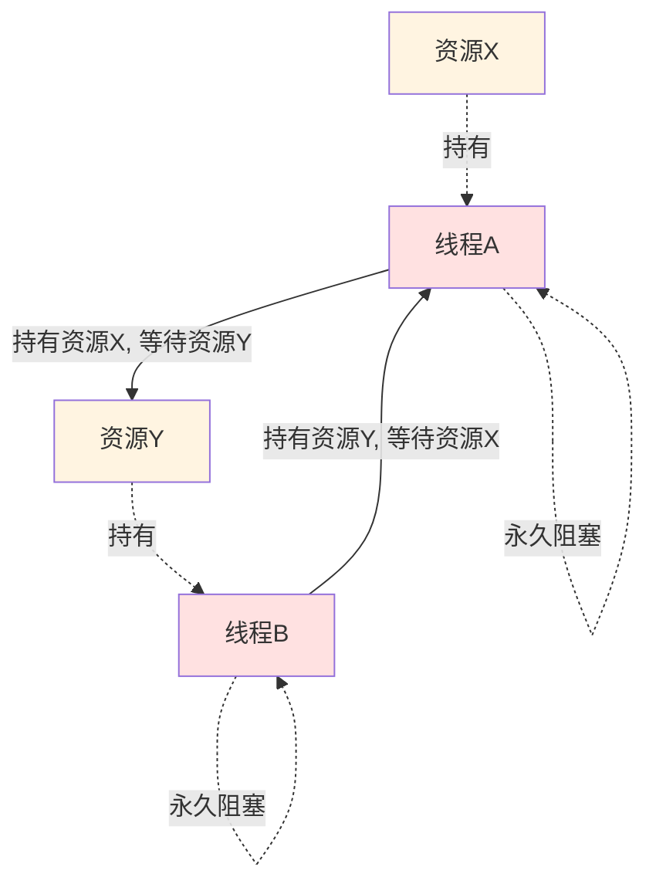

### 死锁的四个必要条件

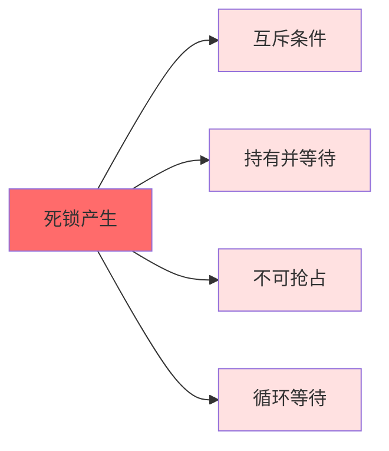

### 项目中的线程安全策略

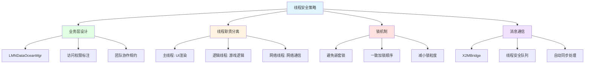

## 📖 原理

### 核心概念

#### 什么是死锁？

死锁（Deadlock）是指两个或多个线程互相等待对方持有的资源，导致所有相关线程永久阻塞的一种状态。

**典型场景：**
- 线程 A 持有资源 X 并等待资源 Y
- 线程 B 持有资源 Y 并等待资源 X
- 两个线程形成循环等待，谁都无法继续执行

#### 死锁的四个必要条件

| 条件 | 说明 |
|------|------|
| 🔒 **互斥条件** | 资源不能被多个线程同时使用 |
| 🤝 **持有并等待** | 线程持有至少一个资源，同时等待获取其他资源 |
| 🚫 **不可抢占** | 资源不能被强制抢占，只能由持有者自愿释放 |
| 🔄 **循环等待** | 存在线程资源的循环等待链 |

> [!tip] 破坏死锁
> 只要破坏上述四个条件中的任何一个，就可以避免死锁。

### 线程安全的基本策略

| 策略 | 说明 | 适用场景 |
|------|------|----------|
| 🔐 **锁机制** | 使用互斥锁、读写锁等同步原语 | 有共享资源竞争的场景 |
| 📋 **无锁编程** | 使用原子操作、无锁数据结构 | 简单的计数器或状态标志 |
| 🎯 **线程隔离** | 每个线程只操作自己的数据 | 可以避免共享的场景 |
| 📨 **消息传递** | 通过消息队列传递数据而非共享内存 | 需要解耦的场景 |

---

## 💡 面试题

### Q1：什么是死锁？游戏开发中如何避免死锁问题？

死锁是指两个或多个线程互相等待对方持有的资源，导致所有相关线程永久阻塞的一种状态。最典型的场景就是线程 A 持有资源 X 并等待资源 Y，而线程 B 持有资源 Y 并等待资源 X，两个线程形成了循环等待，谁都无法继续执行。

在游戏开发中，我们采用多种策略来避免死锁：

#### 🎯 策略一：业务层设计避免并发修改

最根本的方法是在业务层设计时就避免多线程竞争。

**核心实现：LMNDataOceanMgr**

在我们参与开发的项目中，我们实现了一个名为 `LMNDataOceanMgr` 的数据管理器，专门存放需要在主线程和逻辑线程间共享的数据。

**关键特点：**
- 这些数据实际上是"裸奔"在两个线程之间的，没有锁保护
- 通过严格的业务层设计避免了并发修改

**具体做法：**

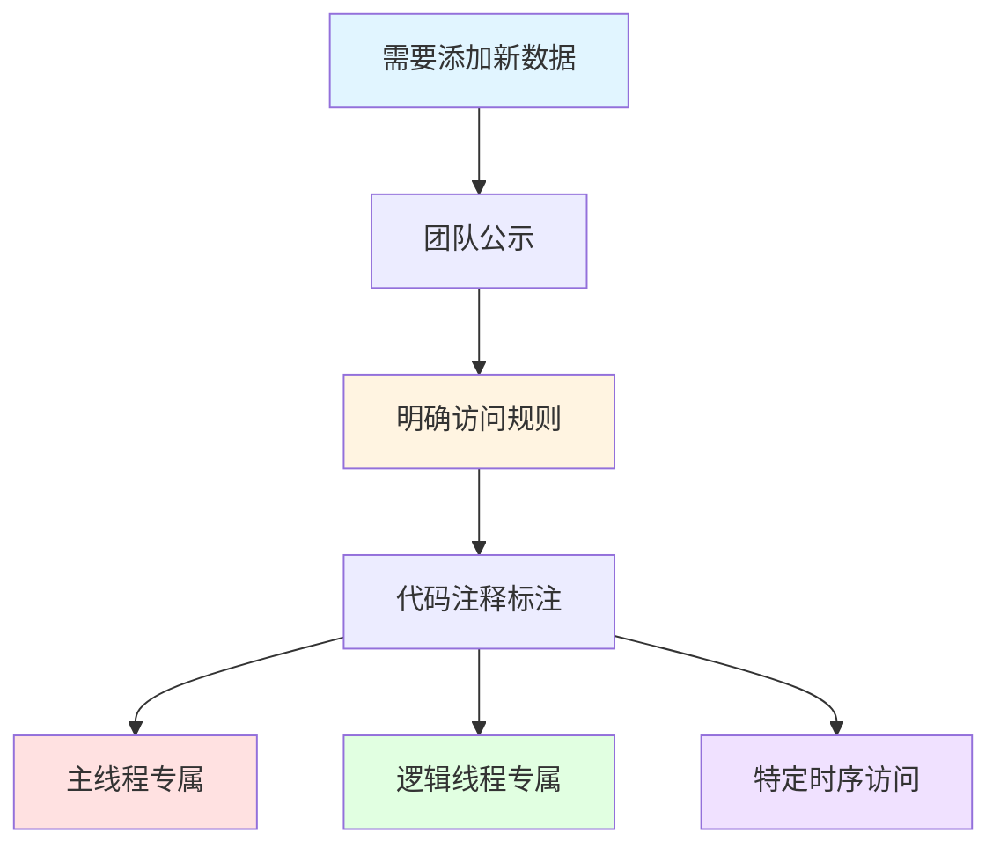

当需要在这个管理器中添加新数据时：
1. 📢 提前与团队沟通
2. 📝 在代码注释中明确标注每个变量的访问权限
3. 🔐 明确哪些变量只能由主线程修改，哪些只能由逻辑线程修改
4. ✅ 确保在同一时刻只有一个线程会去修改特定的数据

#### 🧵 策略二：明确的线程职责分离

通过线程 ID 检查机制确保不同线程只负责其特定的任务域：

| 线程 | 职责 | 专注领域 |
|------|------|----------|
| 🎨 **主线程** | UI 渲染和用户输入处理 | 渲染、交互 |
| 🧮 **逻辑线程** | 纯游戏逻辑计算 | 战斗、AI、寻路 |
| 🌐 **网络线程** | 网络消息的收发和处理 | 通信 |
| 💾 **文件线程** | 各类文件操作 | 存档、配置 |

**优势：** 这种职责分离大大减少了线程间资源竞争的可能性

#### 🔐 策略三：谨慎使用锁机制

对于确实需要在多线程间共享的资源，我们会谨慎地使用锁机制：

| 锁使用原则 | 说明 |
|----------|------|
| 🚫 **避免嵌套锁** | 防止死锁产生 |
| 📏 **一致加锁顺序** | 如果多个线程需要获取多个锁，总是按相同顺序请求 |
| ⚡ **减小锁粒度** | 只保护真正需要同步的代码 |

> 💡 **实战案例**：在我们的项目中需要生成对象池 ID 时，会使用一个静态对象作为锁来保护 ID 的生成过程：
>
> ```csharp
> private static readonly object idLock = new object();
> private static int nextId = 0;
>
> public static int GenerateUniqueId() {
>     lock (idLock) {
>         return nextId++;
>     }
> }
> ```

#### 🌉 策略四：跨线程消息通信机制

实现了高效的跨线程消息通信机制，如 **X2MBridge 消息桥**：

| 特性 | 说明 |
|------|------|
| 🔍 **自动判断** | 根据当前线程 ID 自动判断同步或异步发送 |
| 🔒 **线程安全** | 既确保了线程安全，又避免了不必要的线程阻塞 |

**工作原理：**

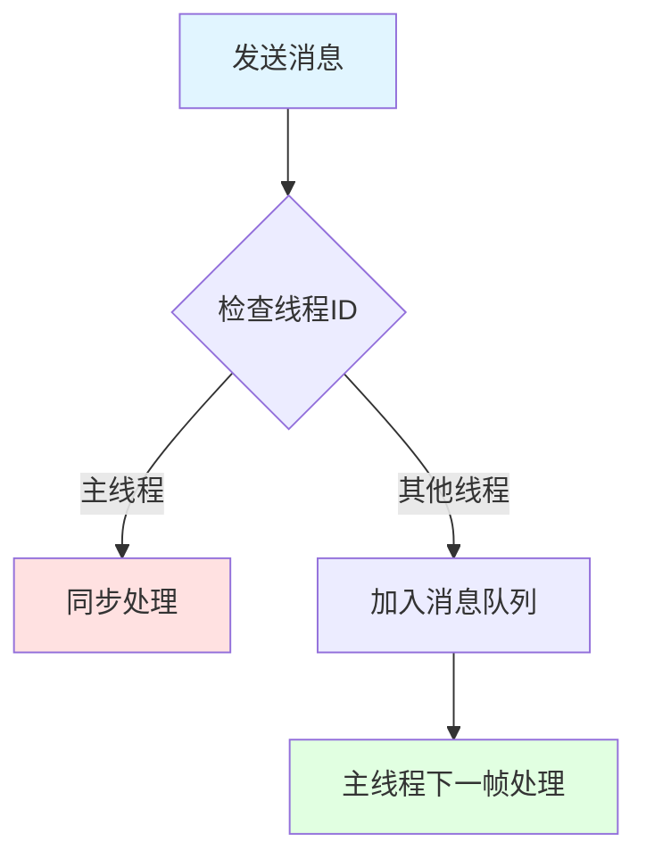

#### ✅ 综合效果

这些策略组合使用，使我们：

| 效果 | 说明 |
|------|------|
| 🎯 **源头消除** | 几乎从源头上消除了死锁问题 |
| ⚡ **性能保持** | 同时保持了良好的系统性能 |
| 📖 **可维护性** | 代码可维护性良好 |

> [!tip] 实践建议
> 这种基于业务设计和职责分离的方法比单纯依赖锁机制更有效，因为它减少了同步开销，提高了系统吞吐量。

---

### Q2：请详细介绍你们项目中如何通过业务层设计实现线程安全的？

在我们的游戏项目中，我们采取了一种比较特别的线程安全设计策略，它更多依赖于**业务层设计**而不是传统的锁机制。

#### 🎯 核心设计理念

**核心理念：** 通过严格的访问规则和团队协作确保线程安全，而非依赖锁机制

#### 📦 LMNDataOceanMgr 数据管理器

我们设计了一个名为 `LMNDataOceanMgr` 的数据管理器类：

**特点：**
- 作为主线程和逻辑线程之间共享数据的容器
- 数据在两个线程之间"裸奔"，没有加锁保护
- 通过严格的访问规则确保安全

#### 📋 工作原理详解

##### 步骤 1️⃣：访问权限标注

对于 DataOcean 中的每一个变量，在代码注释中明确标注访问权限规则：

| 标注示例 | 含义 |
|----------|------|
| `// 仅主线程可修改` | 只有主线程可以修改该变量 |
| `// 仅逻辑线程可读写` | 只有逻辑线程可以访问该变量 |
| `// 初始化阶段主线程写入，运行时仅逻辑线程读取` | 明确不同阶段的访问权限 |

> [!warning] 严格执行
> 这些注释不仅是文档，更是团队必须遵守的规约。

##### 步骤 2️⃣：团队协作机制

当开发者需要向 DataOcean 添加新的共享数据时：

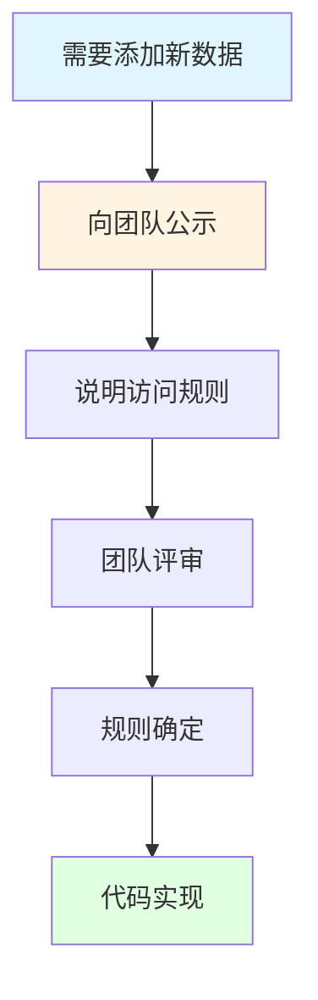

1. 📢 必须先向团队公示
2. 📝 明确说明这个数据的访问规则
3. ✅ 确保所有人都了解并遵守这些规则

##### 步骤 3️⃣：线程 ID 检查机制

我们在关键位置检查当前执行的是哪个线程：

| 检查机制 | 作用 |
|----------|------|
| 🔍 **线程 ID 验证** | 检查当前线程 ID 是否与操作允许的线程相符 |
| ⚠️ **错误报告** | 发现不符时立即报错或警告 |
| 🐛 **提前发现** | 在开发阶段就能发现潜在的线程安全问题 |

#### 💡 实战案例：战斗系统

在我们的战斗系统中：

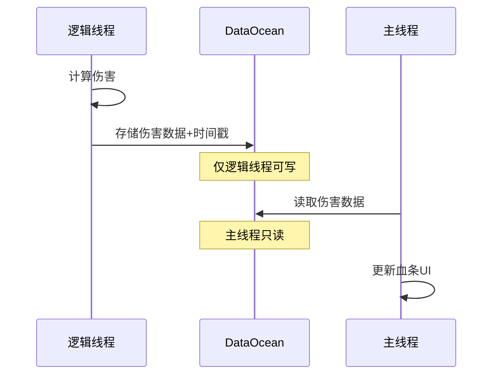

**职责分工：**
- 🧮 **伤害计算**：由逻辑线程负责
- 📊 **血条更新**：由主线程负责
- 📋 **数据流向**：通过明确的职责分工和数据流向，实现无锁的高效协作

#### 🛠️ 特殊场景的数据结构设计

在某些确实需要并发访问的场景，我们会设计特殊的数据结构：

| 技术 | 说明 | 适用场景 |
|------|------|----------|
| 🔄 **双缓冲技术** | 主线程和逻辑线程各自操作一个缓冲区，安全时交换 | 需要频繁交换数据的场景 |
| 📬 **无锁队列** | 使用无锁队列实现线程间的消息传递 | 避免直接资源竞争 |

#### ✅ 策略优势

这种基于业务设计的线程安全策略的优势：

| 优势 | 说明 |
|------|------|
| ⚡ **性能** | 避免了锁带来的开销 |
| 📖 **可读性** | 代码逻辑更加清晰 |
| 🔧 **可维护性** | 不会被复杂的同步机制所掩盖 |

> [!tip] 团队要求
> 当然，这种方式需要团队成员有较高的多线程编程素养和严格的自律，但在我们的项目中，这种方式运行得非常成功，几乎没有出现过多线程竞争导致的问题。

---

### Q3：你们的项目如何实现跨线程通信，特别是其他线程与主线程之间的消息传递？

在我们的游戏项目中，跨线程通信是一个关键挑战，尤其是考虑到 Unity 主线程的特殊性。为此，我们设计了一套高效的跨线程消息机制，主要通过 **X2MBridge** 这个"消息桥"来实现。

#### 🌉 X2MBridge 设计理念

让开发者能够以几乎相同的方式发送消息，无论是在主线程内部还是从其他线程发送到主线程，同时在底层自动处理线程安全问题。

#### 🔧 核心工作原理

##### 步骤 1️⃣：检查线程 ID

X2MBridge 通过检查当前线程 ID 来判断消息的发送方式：

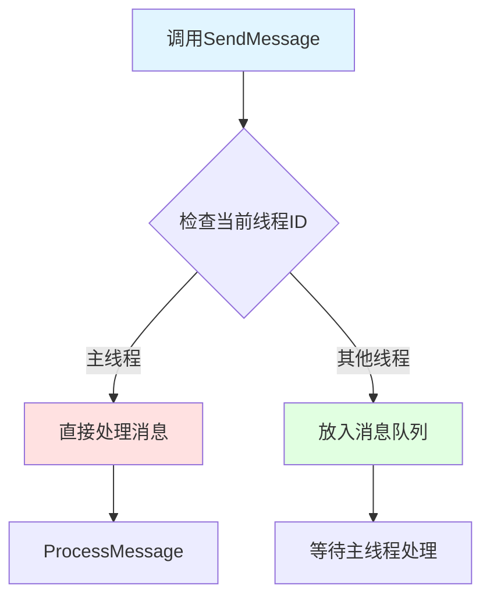

**代码示例：**

```csharp
public void SendMessage(MessageType type, object data) {
    if (Thread.CurrentThread.ManagedThreadId == mainThreadId) {
        // 在主线程中，直接处理消息
        ProcessMessage(type, data);
    } else {
        // 在其他线程中，将消息加入队列
        messageQueue.Enqueue(new Message(type, data));
    }
}
```

##### 步骤 2️⃣：主线程处理队列

主线程会在每帧的适当时机（通常是 Update 开始时）检查并处理这个消息队列中的所有消息


**关键优势：** 确保所有跨线程的通信最终都在主线程执行，避免了 Unity API 的线程安全问题

#### 🚀 高级功能支持

这个消息桥不仅处理基本的消息传递，还支持更复杂的功能：

| 功能 | 说明 | 应用场景 |
|------|------|----------|
| ⭐ **优先级机制** | 不同类型的消息可以有不同的优先级 | 玩家输入响应优先处理 |
| 📦 **批处理能力** | 相同类型的消息可以批量处理 | 减少函数调用开销 |
| ⏰ **延迟执行** | 可以指定消息在特定帧或时间点执行 | 定时任务、延迟动画 |
| 🛡️ **异常处理** | 单个消息的处理异常不会影响其他消息 | 提高系统稳定性 |

#### 💼 实际应用场景

这套机制被广泛用于各种跨线程场景：

| 场景 | 工作流程 |
|------|----------|
| 🌐 **网络消息处理** | 网络线程收到服务器消息 → X2MBridge → 主线程处理 |
| 🤖 **AI 到表现** | 逻辑线程完成 AI 决策 → 消息桥通知 → 主线程执行动画和特效 |
| 📦 **资源加载** | 文件线程加载完资源 → 消息桥通知 → 主线程更新 UI |

#### ⚡ 性能优化

在性能关键的场景中，我们还对消息桥进行了优化：

| 优化技术 | 说明 | 效果 |
|----------|------|------|
| ♻️ **对象池** | 使用对象池减少垃圾回收压力 | 减少 GC 暂停 |
| 📊 **预分配队列** | 预分配足够大的队列容量避免动态扩容 | 避免运行时分配 |
| 🚀 **无锁队列** | 使用无锁队列实现更高效的线程间通信 | 提高吞吐量 |

#### ✅ 系统优势

这种消息传递机制的最大优势：

| 优势 | 说明 |
|------|------|
| 🎯 **专注业务** | 开发者可以专注于业务逻辑，而不需要过多担心线程安全问题 |
| ⚡ **性能优势** | 充分利用多线程的性能优势 |
| 🔒 **避免竞争** | 避免了直接的线程竞争和复杂的锁机制 |
| 📈 **高效稳定** | 即使在高负载情况下，跨线程通信也能保持高效和稳定 |

---

### Q4：在必要情况下，你们是如何使用锁机制来保证线程安全的？请举例说明

虽然我们项目中主要通过业务层设计和线程责任分离来避免多线程竞争，但在某些场景下仍然需要使用传统的锁机制来保证线程安全。

#### 🎯 使用原则

**我们的原则：** "只在必要时才使用锁，并尽可能减小锁的粒度"

---

#### 📋 场景 1️⃣：对象池 ID 生成

**需求分析：**
在我们的游戏中，几乎所有系统都使用对象池来管理资源，而每个池化对象都需要一个唯一 ID。这个 ID 生成过程必须是线程安全的，因为可能有多个线程同时创建对象。

**解决方案：**

```csharp
private static readonly object idLock = new object();
private static int nextId = 0;

public static int GenerateUniqueId() {
    lock (idLock) {
        return nextId++;
    }
}
```

**设计要点：**

| 设计考虑 | 实现方式 |
|----------|----------|
| 🔒 **线程安全** | 使用静态对象作为锁 |
| ⚡ **锁粒度最小** | 只保护整数自增这一操作 |
| ⏱️ **最短持有时间** | 将锁的持有时间降到最低 |

**优势：** 无论哪个线程调用这个方法，都会安全地获取唯一的 ID，同时避免不必要的性能损失

---

#### 📋 场景 2️⃣：配置数据的延迟加载

**需求分析：**
我们的游戏使用了大量配置表，但不会在启动时全部加载，而是按需加载。由于配置加载可能发生在多个线程中，需要确保线程安全和性能。

**解决方案：双重检查锁定模式（DCLP）**

```csharp
private static object configLock = new object();
private static Dictionary<int, ConfigData> configData = null;

public static ConfigData GetConfig(int id) {
    if (configData == null) { // 第一次检查
        lock (configLock) { // 获取锁
            if (configData == null) { // 二次检查
                configData = LoadConfigData(); // 加载数据
            }
        }
    }
    return configData[id];
}
```

**工作流程：**

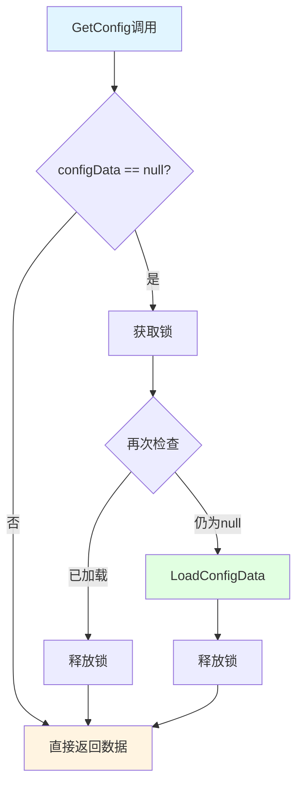

**优势：**

| 优势 | 说明 |
|------|------|
| ✅ **线程安全** | 确保配置数据只会被加载一次 |
| ⚡ **高性能** | 大多数情况下（配置已加载后）可以无锁访问 |

---

#### 📋 场景 3️⃣：原子操作

对于一些关键计数器或状态变量，我们会使用 .NET 提供的原子操作：

**Interlocked 类示例：**

```csharp
public static void IncrementActiveRequests() {
    Interlocked.Increment(ref activeRequestsCount);
}
```

**优势：**

| 优势 | 说明 |
|------|------|
| ⚡ **轻量级** | 提供比完整锁更轻量级的同步 |
| 🚀 **高性能** | 使用硬件级别的原子指令 |

---

#### 📋 场景 4️⃣：读写锁（ReaderWriterLockSlim）

对于读多写少的场景，我们使用 `ReaderWriterLockSlim` 来提高并发性能：

```csharp
private static ReaderWriterLockSlim cacheLock = new ReaderWriterLockSlim();
private static Dictionary<string, GameData> gameDataCache = new Dictionary<string, GameData>();

public static GameData GetGameData(string key) {
    // 尝试读锁
    cacheLock.EnterReadLock();
    try {
        if (gameDataCache.TryGetValue(key, out GameData data))
            return data;
    }
    finally {
        cacheLock.ExitReadLock();
    }

    // 缓存中没找到，需要加载 - 转写锁
    cacheLock.EnterWriteLock();
    try {
        // 再次检查（可能其他线程已经加载了）
        if (!gameDataCache.TryGetValue(key, out GameData data)) {
            data = LoadGameData(key);
            gameDataCache[key] = data;
        }
        return data;
    }
    finally {
        cacheLock.ExitWriteLock();
    }
}
```

**工作流程：**

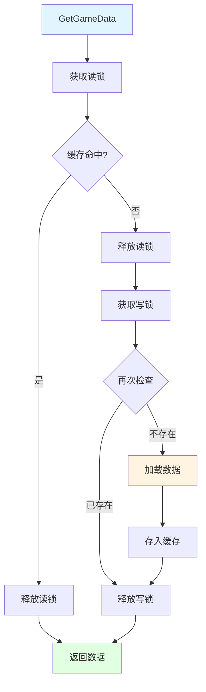

**优势：**

| 优势 | 说明 |
|------|------|
| 📖 **多读并发** | 允许多个读线程同时访问数据 |
| ✍️ **写操作独占** | 写操作需要独占访问 |
| ⚡ **高性能** | 在读多写少的场景下性能优异 |

---

#### 🛡️ 锁使用的安全原则

虽然使用锁机制，但我们始终遵循一些原则来避免死锁和性能问题：

| 原则 | 说明 | 实践方式 |
|------|------|----------|
| ⏱️ **最小化锁持有时间** | 只保护真正需要同步的代码 | 避免在锁内调用耗时方法 |
| 🚫 **避免在锁内调用外部方法** | 特别是可能会阻塞的方法 | 将外部调用移到锁外 |
| 📏 **固定顺序获取锁** | 避免循环等待 | 定义全局的锁获取顺序 |
| ⏰ **使用超时机制** | 避免永久阻塞 | 使用 `TryEnter` 带超时参数 |
| 📊 **定期性能分析** | 识别和优化锁竞争热点 | 使用性能分析工具 |

#### ✅ 综合策略

这些锁使用策略配合我们的主要线程安全策略（业务层设计和线程责任分离），共同构成了我们项目的多线程安全保障体系：

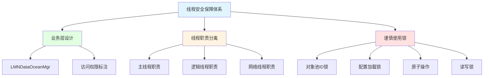

---

## 🔗 相关链接

- [[操作系统和编译原理]] - 父主题索引
- [[进程]] - 相关主题：进程的概念和通信
- [[线程]] - 相关主题：多线程架构设计
