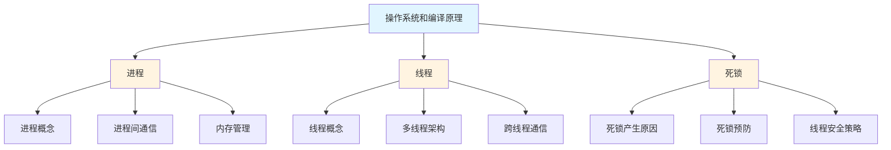

# 操作系统和编译原理

## 📋 来源信息

| 项目 | 内容 |
|------|------|
| **原始链接** | https://www.yuque.com/wanghao-yciao/dk58gg/npiklcg8e3v4ectm |
| **归档时间** | 2026-04-14 |
| **归档方式** | 语雀公开页抓取 |

## 📚 本地二级子页面索引

本主题包含以下核心知识点：

### 📖 子主题列表

| 序号 | 主题 | 说明 | 链接 |
|------|------|------|------|
| 01 | **进程** | 操作系统资源分配基本单位，进程间通信 | [[进程]] |
| 02 | **线程** | CPU调度基本单位，多线程架构设计 | [[线程]] |
| 03 | **死锁** | 多线程竞争与线程安全解决方案 | [[死锁（如何解决多线程竞争或实现线程安全）]] |

---

## 🎯 学习路径建议

### 推荐学习顺序

1. **进程** → 理解操作系统如何管理和分配资源
2. **线程** → 学习如何在进程内实现并发执行
3. **死锁** → 掌握多线程编程中的常见问题及解决方案

---

## 💡 核心概念关联

这三个主题紧密相关，形成了游戏客户端多线程编程的完整知识体系：

- **进程**提供了内存隔离和资源管理的边界
- **线程**在进程内部实现高效的并发处理
- **死锁**章节则解决了多线程编程中的同步和安全问题

> [!tip] 学习建议
> 建议按顺序学习这三个主题，先理解进程和线程的基本概念，再深入学习多线程架构设计，最后掌握线程安全和死锁避免的高级技巧。

---

## 🔗 相关链接

- [[游戏客户端面试题]] - 返回上级目录
