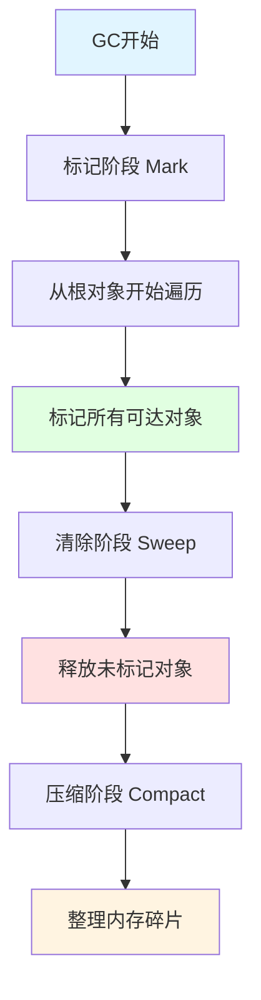
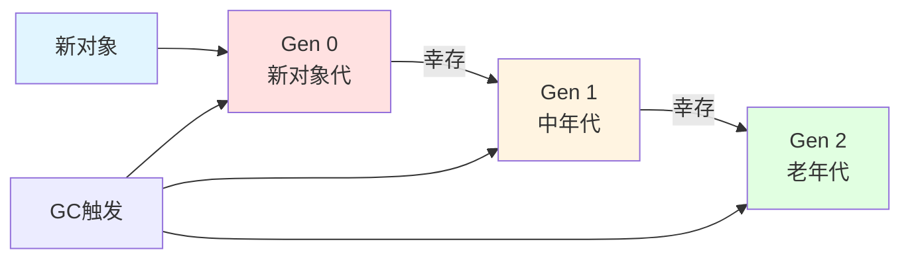
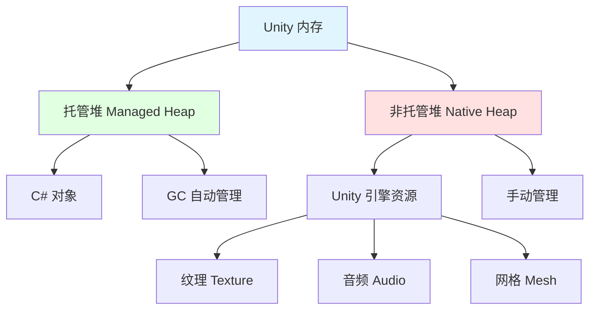
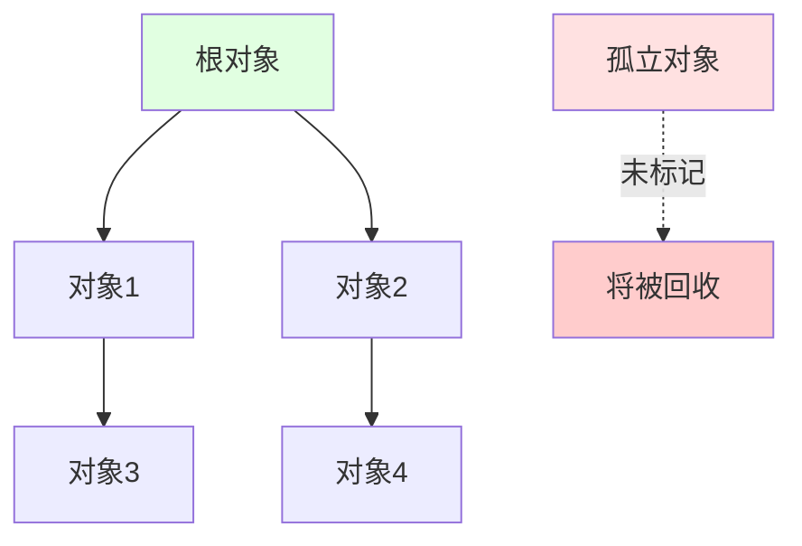

## 📊 图解

> [!info] 图示区
> 这里可以放置解释 GC 概念的 mermaid 图表、UML 类图或其他辅助理解的图片

### GC 工作流程



### 分代回收策略



### 托管堆 vs 非托管堆



## 📖 原理

### 核心概念

#### 什么是垃圾回收（GC）？

C# 的垃圾回收是 .NET 框架提供的**自动内存管理机制**，负责自动识别和回收不再使用的托管堆内存对象。

**主要优势：**
- ✅ 自动管理内存，开发者无需手动释放
- ✅ 防止内存泄漏
- ✅ 提高开发效率

### GC 工作原理

#### 三阶段回收过程

| 阶段 | 名称 | 说明 |
|------|------|------|
| 1️⃣ | **标记阶段** | 从"根"对象开始，递归标记所有可达对象为"活动" |
| 2️⃣ | **清除阶段** | 释放未被标记为活动的对象内存 |
| 3️⃣ | **压缩阶段** | 整理内存，减少碎片（可选） |

**根对象包括：**
- 🌐 全局变量
- 📊 静态变量
- 📍 当前执行方法中的局部变量

#### 分代回收策略

GC 采用**分代回收策略**，将对象分为三代：

| 代 | 名称 | 说明 | 回收频率 |
|---|------|------|----------|
| Gen 0 | **新对象代** | 新分配的对象 | 🔥 最高（每次 GC） |
| Gen 1 | **中年代** | 从 Gen 0 幸存的对象 | ⚡ 中等 |
| Gen 2 | **老年代** | 长寿命对象 | 🐢 最低（仅在需要时） |

> [!tip] 弱代假说
> 这种策略基于"弱代假说"：**新对象通常生命周期短**，频繁回收 Gen 0 可以提高效率。

### 托管堆 vs 非托管堆

| 特性 | 托管堆 | 非托管堆 |
|------|-------------------|---------------------|
| **存储内容** | C# 对象（类实例、数组等） | Unity 引擎资源（纹理、音频、网格等） |
| **管理方式** | CLR 通过 GC 自动管理 | 需要手动管理 |
| **释放方式** | 自动回收 | `Resources.UnloadUnusedAssets()` 或 `Destroy()` |
| **开发者干预** | 无需手动释放 | 必须显式释放 |

---

## 💡 面试题

### Q1：什么是C#的垃圾回收？它的工作原理是什么？

C# 的垃圾回收是 .NET 框架提供的自动内存管理机制，负责自动识别和回收不再使用的托管堆内存对象。

#### 🔧 工作原理

##### 1️⃣ 标记阶段（Mark）

从"根"对象开始，递归标记所有可达对象为"活动"

**根对象包括：**
- 🌐 全局变量
- 📊 静态变量
- 📍 当前执行方法中的局部变量



##### 2️⃣ 清除阶段（Sweep）

释放未被标记为活动的对象内存

##### 3️⃣ 压缩阶段（Compact）

整理内存，减少碎片（可选操作）

#### 📊 分代回收策略

GC 采用分代回收策略，将对象分为：

| 代 | 说明 | 触发时机 |
|---|------|----------|
| **Gen 0** | 新对象 | 每次都可能触发 |
| **Gen 1** | 幸存一次的对象 | 内存不足时触发 |
| **Gen 2** | 长寿命对象 | 只有在 Gen 0/1 不足时触发 |

> [!tip] 设计理念
> 这种策略基于"弱代假说"（新对象通常生命周期短），提高了回收效率。

---

### Q2：托管堆和非托管堆有什么区别？在Unity中如何管理它们？

#### 📋 托管堆（Managed Heap）

| 特性 | 说明 |
|------|------|
| 📦 **存储内容** | C# 对象，如类实例、数组等 |
| 🤖 **管理方式** | 由 CLR（公共语言运行时）通过 GC 自动管理 |
| ✅ **开发者操作** | 开发者无需手动释放内存 |

#### 📋 非托管堆（Native Heap）

| 特性 | 说明 |
|------|------|
| 🎮 **存储内容** | Unity 引擎资源，如纹理、音频、网格等 |
| 👨‍💼 **管理方式** | 需要手动管理和释放 |
| 🔧 **释放方式** | 通过 `Resources.UnloadUnusedAssets()` 或引用计数（如 `Destroy()` 方法）释放 |

#### 🎮 在 Unity 中的管理策略

##### 托管堆对象优化

| 优化策略 | 说明 |
|----------|------|
| ♻️ **对象池** | 使用对象池复用对象而非反复创建销毁 |
| 🚫 **减少临时对象** | 避免在频繁执行的代码中创建临时对象 |
| 💾 **缓存引用** | 缓存频繁使用的对象引用 |

##### 非托管资源管理

| 管理方式 | 说明 |
|----------|------|
| 📦 **AssetBundle** | 使用 AssetBundle 管理资源加载和卸载 |
| 🗑️ **UnloadUnusedAssets** | 合理调用 `Resources.UnloadUnusedAssets()` |
| ❌ **显式销毁** | 显式调用 `Destroy()` 方法释放资源 |

> [!warning] 重要提醒
> 非托管资源**必须**手动管理，否则会导致内存泄漏！

---

### Q3：如何优化Unity中的GC性能？

#### 1️⃣ 减少内存分配

| 策略 | 说明 | 示例 |
|------|------|------|
| 🚫 **避免热点分配** | 避免在频繁执行的代码（如 Update）中创建临时对象 | 缓存临时变量 |
| 💾 **缓存对象引用** | 缓存频繁使用的对象引用 | `private Transform cachedTransform;` |
| ♻️ **使用对象池** | 复用对象而非反复创建销毁 | `ObjectPool<T>` |

#### 2️⃣ 避免装箱拆箱

| 策略 | 说明 |
|------|------|
| ⚠️ **避免隐式转换** | 避免值类型与引用类型间的隐式转换 |
| 🎯 **谨慎使用泛型** | 谨慎使用泛型集合中的值类型操作 |
| 📊 **使用泛型集合** | 使用 `List<T>` 而非 `ArrayList` |

#### 3️⃣ 数据结构优化

| 优化方式 | 说明 | 效果 |
|----------|------|------|
| 🏗️ **合理使用 struct** | 用 struct 代替 class（小型且短生命周期的数据） | 减少堆分配 |
| 📝 **使用 StringBuilder** | 用 StringBuilder 替代字符串连接操作 | 减少临时字符串 |

#### 4️⃣ Unity 特定优化

| 优化技术 | 说明 |
|----------|------|
| ⏳ **协程优化** | 使用协程时注意避免 `yield return` 产生的 GC 压力 |
| 🎮 **新输入系统** | 使用 Unity 的新输入系统减少 GC |
| ⚙️ **GC 参数设置** | 合理设置项目的 GC 参数（增量 GC） |

#### 5️⃣ 监测与分析

| 工具 | 用途 |
|------|------|
| 📊 **Unity Profiler** | 监测 GC 分配和回收 |
| 🔍 **深度分析** | 识别并优化 GC 峰值 |
| ⚡ **帧率优化** | 特别关注导致帧率下降的情况 |

> [!tip] 优化流程
> 1. 使用 Profiler 识别 GC 热点
> 2. 针对性优化高频分配点
> 3. 使用对象池减少分配次数
> 4. 验证优化效果

---

### Q4：C#中的终结器(Finalizer)和IDisposable接口有什么区别和联系？

#### 🔍 终结器（Finalizer）

**语法：** `~ClassName()`

| 特性 | 说明 |
|------|------|
| 🤖 **调用方式** | 由 GC 在回收对象时自动调用 |
| ⏰ **执行时机** | 不确定，取决于 GC 的触发时间 |
| ⚠️ **性能影响** | 降低 GC 效率，因为带有终结器的对象至少要经历两次 GC 才能完全回收 |
| 💡 **主要用途** | 用于释放非托管资源 |

**示例：**
```csharp
public class ResourceHolder
{
    ~ResourceHolder()
    {
        // 释放非托管资源
    }
}
```

#### 🔍 IDisposable 接口

| 特性 | 说明 |
|------|------|
| 👨‍💼 **调用方式** | 提供 `Dispose()` 方法，需要显式调用 |
| ✅ **执行时机** | 确定，由开发者控制 |
| ⚡ **性能优势** | 用于及时释放资源，不依赖 GC |
| 🔄 **配合使用** | 通常与 `using` 语句配合使用 |

**示例：**
```csharp
public class ResourceHolder : IDisposable
{
    public void Dispose()
    {
        // 释放托管和非托管资源
        GC.SuppressFinalize(this); // 抑制终结器
    }
}

// 使用 using 语句
using (var resource = new ResourceHolder())
{
    // 使用资源
} // 自动调用 Dispose()
```

#### 🔗 两者的联系

| 关系 | 说明 |
|------|------|
| 🔄 **同时实现** | 通常同时实现两者，终结器作为 Dispose 未调用的备用方案 |
| ✅ **Dispose 模式** | 推荐采用"Dispose 模式"：Dispose() 方法中释放资源并抑制终结器 |

#### 📊 对比总结

| 特性 | 终结器 | IDisposable |
|------|--------|-------------|
| **调用方式** | 自动（GC） | 手动（显式） |
| **执行时机** | 不确定 | 确定 |
| **性能影响** | 较大 | 较小 |
| **主要用途** | 释放非托管资源 | 及时释放资源 |
| **推荐使用** | 备用方案 | 优先选择 |

> [!warning] 最佳实践
> 1. 优先实现 IDisposable 接口
> 2. 终结器作为最后的安全网
> 3. Dispose 方法中应调用 `GC.SuppressFinalize(this)`
> 4. 使用 `using` 语句确保及时释放

---

## 🔗 相关链接

- [[C#语言特性]] - 父主题索引
- [[装箱拆箱（堆与栈、类和结构体、值类型和引用类型）]] - 相关主题：值类型与引用类型
- [[面向对象]] - 相关主题：面向对象设计
