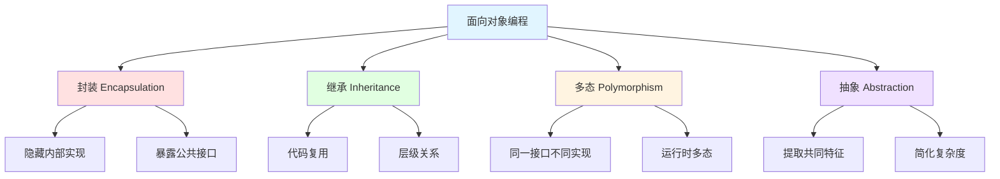
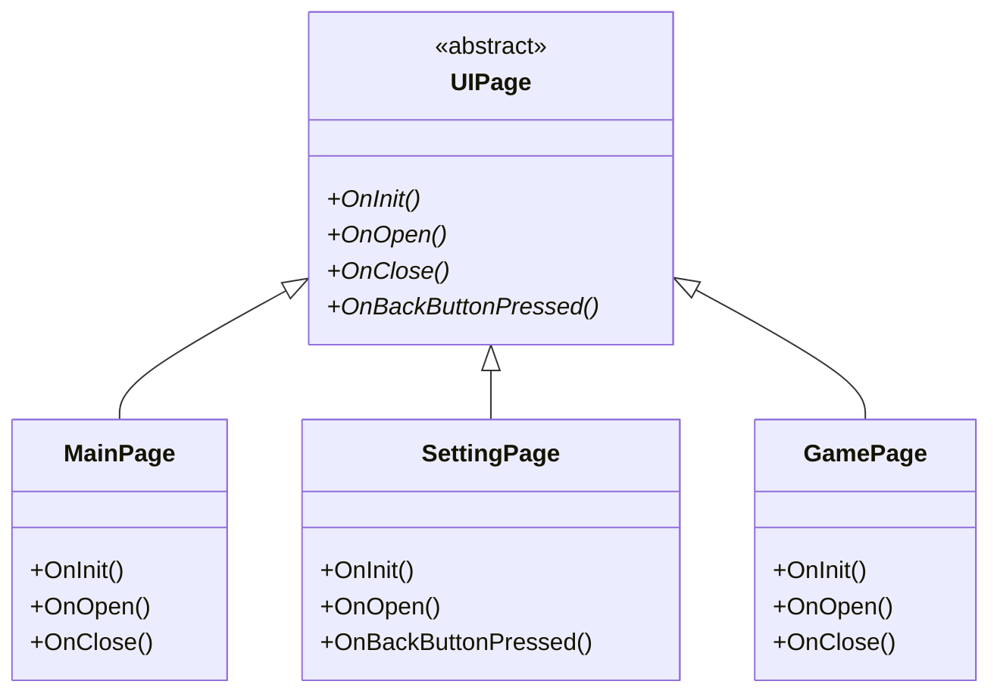
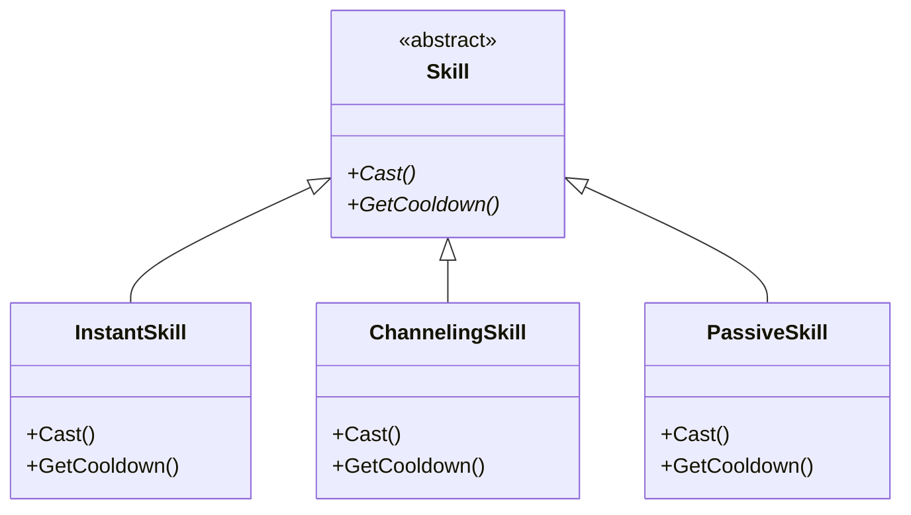
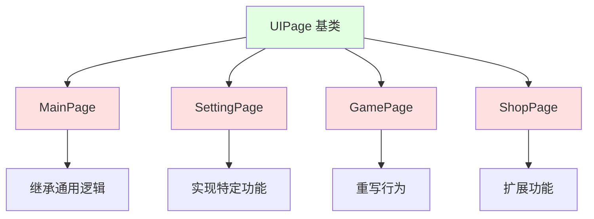
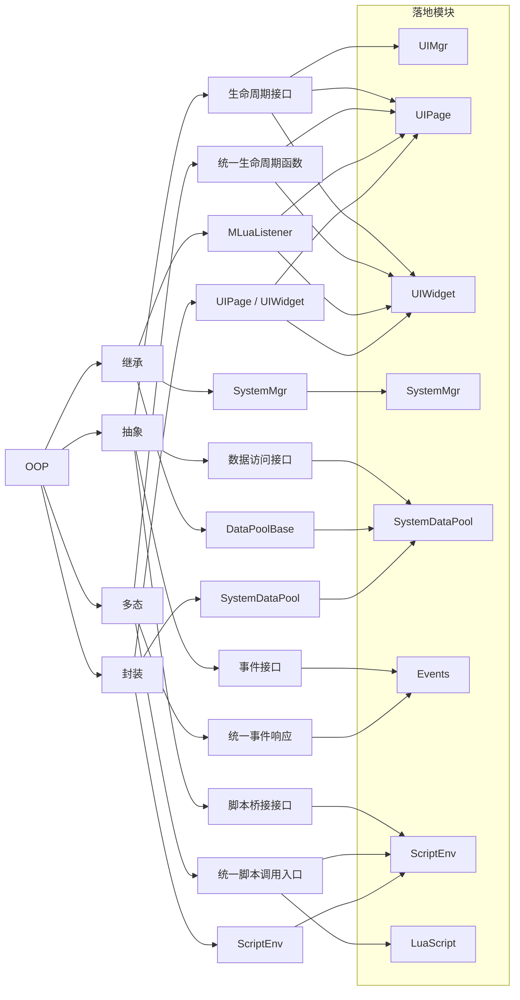
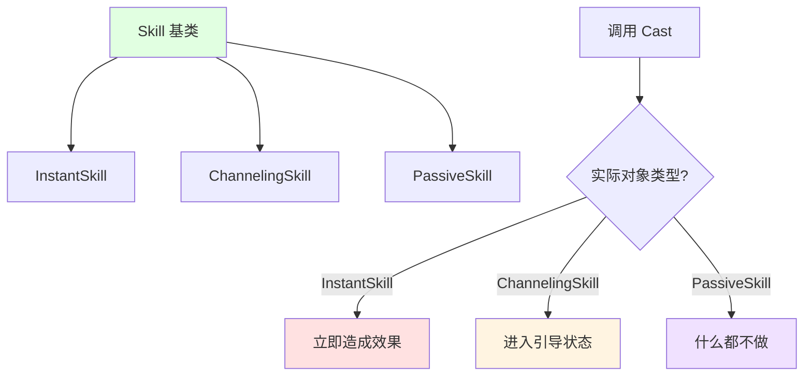
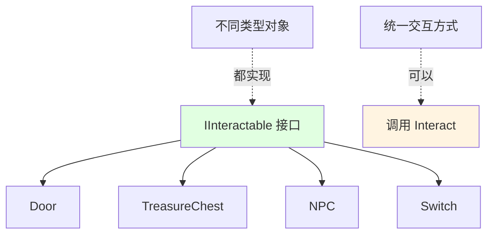
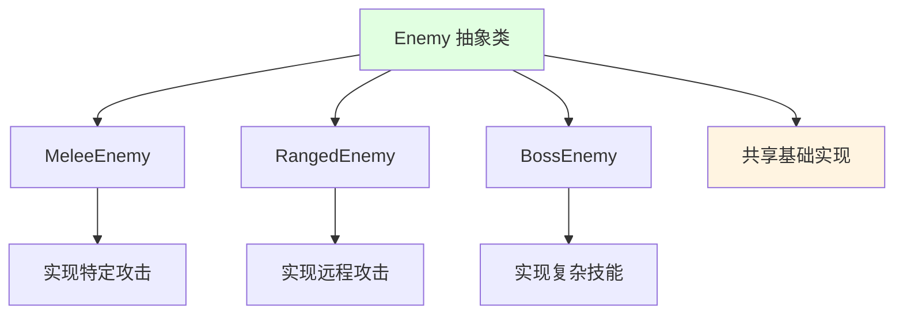
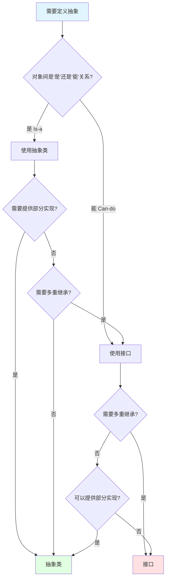
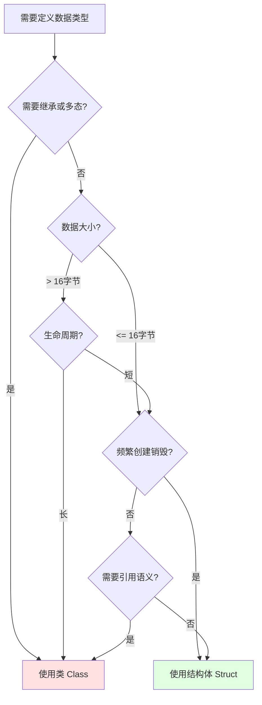

## 📊 图解

> [!info] 图示区
> 这里可以放置解释面向对象概念的 mermaid 图表、UML 类图或其他辅助理解的图片

### 面向对象四大特性



### UI 框架的面向对象设计



### 技能系统的多态实现



## 📖 原理

### 核心概念

面向对象编程（OOP）是一种编程范式，基于"对象"的概念，对象包含**数据**和**操作数据的方法**。

#### 四大支柱

| 特性 | 核心思想 | 优势 |
|------|----------|------|
| 🔐 **封装** | 隐藏内部实现，暴露公共接口 | 提高安全性、降低耦合 |
| 🧬 **继承** | 子类继承父类的属性和方法 | 代码复用、建立层级关系 |
| 🎭 **多态** | 同一接口，不同实现 | 灵活性、可扩展性 |
| 💭 **抽象** | 提取共同特征，忽略细节 | 简化复杂度、提高可维护性 |

---

## 💡 面试题

### Q1：你们的C#的UI框架是如何实现的？

这个项目使用的是一个基于 Lua 的混合 UI 框架。它充分利用了面向对象的特性：

#### 🔐 1. 封装（Encapsulation）

我们的 UI 框架将每个页面封装为独立的类，隐藏实现细节，只暴露必要接口。

**具体实现：**
- 📦 每个页面的内部状态对外不可见
- 🚪 提供标准方法供外部调用（如 `Open`、`Close` 等）

> 💡 **示例：**
> ```csharp
> public class SettingPage : UIPage
> {
>     private bool isInitialized; // 私有状态
>
>     public void Open() // 公共接口
>     {
>         if (!isInitialized)
>             Init();
>         Show();
>     }
> }
> ```

#### 🧬 2. 继承（Inheritance）

我们设计了基础 UI 类 `UIPage`，包含所有 UI 页面共有的属性和方法。

**生命周期函数：**
| 方法 | 说明 |
|------|------|
| `OnInit()` | 初始化页面 |
| `OnOpen()` | 打开页面 |
| `OnClose()` | 关闭页面 |
| `OnBackButtonPressed()` | 返回按钮处理 |

**优势：**
- ✅ 各具体页面通过继承复用通用逻辑
- 🎯 专注于自身业务实现



#### 🎭 3. 多态（Polymorphism）

UI 事件响应采用多态机制，不同页面可以重写基类的方法来实现个性化行为。

**示例：所有页面都继承 `OnBackButtonPressed` 方法**

| 页面类型 | 返回行为 |
|----------|----------|
| 🏠 主页 | 显示退出确认对话框 |
| ⚙️ 设置页 | 保存设置并关闭 |
| 🎮 游戏页 | 暂停游戏并显示暂停菜单 |

#### 💭 4. 抽象（Abstraction）

我们抽象出通用组件，定义统一接口：

| 组件类型 | 说明 |
|----------|------|
| 🔘 按钮 | 统一的点击事件处理 |
| 📋 列表 | 统一的数据绑定和滚动 |
| 💬 对话框 | 统一的显示和关闭逻辑 |

#### ✅ 架构优势

| 优势 | 说明 |
|------|------|
| 🔧 **可扩展性** | 新增页面只需继承基类并实现特定功能 |
| 📖 **可维护性** | 无需关心底层逻辑，易于维护 |
| 🎯 **一致性** | 所有页面遵循统一的设计模式 |

> [!tip] 实践总结
> 这种面向对象的架构让我们的 UI 系统具有高度可扩展性和可维护性，新增页面只需继承基类并实现特定功能，无需关心底层逻辑。

#### 🗺️ OOP 到 UI 框架的映射

下面这张图把面向对象概念和项目里的 UI + Lua 框架组件对应起来，适合在回答架构题时快速说明“概念如何落地到模块”。



可以把这张图对应到一句话里：

- 封装体现在页面、组件、数据池和脚本环境各自隐藏内部细节，对外只暴露必要接口。
- 继承体现在基础页面、监听器和数据池基类复用通用能力。
- 多态体现在统一生命周期、事件分发和脚本调用入口会根据具体对象执行不同逻辑。
- 抽象体现在生命周期、事件、数据访问和脚本桥接这些稳定接口上。

---

### Q2：如何理解面向对象中的多态性，请举例说明？

多态是面向对象中非常核心的特性，允许不同类对象对同一消息做出不同的响应。

#### 🎮 实战案例：技能系统

在我们的项目中，技能系统是多态的典型应用：

##### 📋 基类设计

```csharp
public abstract class Skill
{
    public abstract void Cast(); // 施放技能
    public abstract float GetCooldown(); // 获取冷却时间
}
```

##### 🎭 不同技能类型的实现

| 技能类型 | 说明 | Cast() 行为 |
|----------|------|-------------|
| ⚡ **InstantSkill** | 瞬发技能 | 立即造成效果 |
| 🎯 **ChannelingSkill** | 引导技能 | 进入引导状态 |
| 🛡️ **PassiveSkill** | 被动技能 | 可能什么都不做 |



#### 💡 多态的优势

##### 1️⃣ 统一的处理方式

当游戏逻辑调用 `someSkill.Cast()` 时，根据实际对象类型，会执行对应子类中重写的 `Cast()` 方法：

```csharp
// 统一的调用方式
foreach (var skill in playerSkills)
{
    skill.Cast(); // 根据实际类型执行不同行为
}
```

##### 2️⃣ 易于扩展

当新增技能类型时，只需创建新的子类并重写相关方法：

```csharp
public class ToggleSkill : Skill
{
    private bool isActive = false;

    public override void Cast()
    {
        isActive = !isActive; // 切换状态
    }

    public override float GetCooldown()
    {
        return 0f; // 切换技能无冷却
    }
}
```

> ✅ **无需修改调用代码**，体现了"开放-封闭原则"

#### 🎯 多态的实现方式

| 实现方式 | 说明 | 示例 |
|----------|------|------|
| 🔄 **方法重写** | 子类重写父类的虚方法 | `override void Cast()` |
| 🎭 **接口实现** | 不同类实现同一接口 | `IInteractable.Interact()` |
| 📦 **抽象类** | 定义抽象方法，子类实现 | `abstract void Cast()` |

---

### Q3：封装如何提高代码的安全性和可维护性？

封装通过隐藏对象的内部状态和实现细节，只暴露必要的接口，显著提高了代码的安全性和可维护性。

#### 🔐 安全性提升

| 优势 | 说明 |
|------|------|
| 🛡️ **防止非法访问** | 防止外部代码直接访问和修改对象的内部状态 |
| ✅ **数据验证** | 可以在 setter 方法中添加数据验证，确保状态的有效性 |
| 🔗 **降低耦合** | 避免依赖具体实现，降低代码耦合度 |

#### 🔧 可维护性提升

| 优势 | 说明 |
|------|------|
| 🔄 **内部实现可更改** | 内部实现可以更改而不影响外部调用代码 |
| 📊 **集中管理** | 集中管理状态变更，更容易追踪和调试 |
| 🎯 **接口简化** | 简化接口，使类的使用更直观 |

#### 💰 实战案例：用户账户系统

在我们的用户系统中，用户余额是一个敏感数据，我们不允许直接访问：

```csharp
public class UserAccount
{
    private decimal balance; // 私有字段 - 外部无法直接访问

    // 获取余额 - 带权限验证
    public decimal GetBalance()
    {
        // 验证用户权限后返回
        if (HasPermission())
            return balance;
        throw new UnauthorizedAccessException();
    }

    // 更新余额 - 带验证和日志
    public bool UpdateBalance(decimal amount, string operationType)
    {
        // 1. 验证操作合法性
        if (amount < 0 && !CanDeduct(amount))
            return false;

        // 2. 记录操作日志
        LogTransaction(amount, operationType);

        // 3. 更新余额
        balance += amount;

        // 4. 触发余额变化事件
        OnBalanceChanged?.Invoke(balance);

        return true;
    }
}
```

#### ✅ 封装的优势体现

| 方面 | 说明 |
|------|------|
| 🛡️ **安全性** | 所有余额变更都经过验证和日志记录，提高了系统安全性 |
| 🔧 **可维护性** | 将来如果需要修改余额的存储方式（比如从内存改为数据库），外部代码无需任何改变 |
| 📊 **可追踪性** | 所有操作都有日志记录，便于追踪和调试 |

> [!tip] 封装的最佳实践
> 1. **字段设为私有**，通过属性方法访问
> 2. **添加数据验证**，在 setter 中验证合法性
> 3. **记录操作日志**，便于追踪和调试
> 4. **触发事件通知**，让外部响应状态变化

---

### Q4：接口和抽象类有什么区别？在项目中如何选择？

接口和抽象类都是实现抽象的重要机制，但它们有着明显区别，在项目中应根据不同场景选择。

#### 📊 核心区别

| 对比维度 | 接口（Interface） | 抽象类（Abstract Class） |
|----------|-------------------|-------------------------|
| **设计目的** | 定义行为契约，回答"能做什么" | 提供部分实现的基类，表达"是什么" |
| **实现方式** | 只能包含方法声明、属性、索引器和事件 | 可以包含抽象方法和非抽象方法、字段、属性、构造函数等 |
| **继承限制** | 一个类可以实现多个接口 | 一个类只能继承一个抽象类（单继承） |
| **访问修饰符** | 默认 public，不能有其他修饰符 | 可以有各种访问修饰符 |
| **字段** | 不能包含字段 | 可以包含字段 |
| **构造函数** | 不能有构造函数 | 可以有构造函数 |

#### 🎯 使用场景对比

| 使用场景 | 选择 | 原因 |
|----------|------|------|
| 🤝 **不相关的类需要共享某些行为** | 接口 | 它们可能属于不同的继承层次 |
| 👨‍👩‍👧‍👦 **一组相关的类需要共享基础实现** | 抽象类 | 它们有"是"的关系 |
| 🔄 **需要多重继承** | 接口 | C# 不支持类的多重继承 |
| 📦 **需要提供部分实现** | 抽象类 | 可以包含具体实现 |
| 🎭 **定义能力或行为** | 接口 | 强调"能做什么" |

#### 🎮 游戏项目中的实际应用

##### 案例 1：接口 - IInteractable

使用 `IInteractable` 接口定义所有可交互物体：

```csharp
public interface IInteractable
{
    void Interact(GameObject player);
    string GetInteractionPrompt();
    bool CanInteract(GameObject player);
}
```

**实现类：**

| 类名 | 类型 | 交互行为 |
|------|------|----------|
| `Door` | 门 | 打开/关闭门 |
| `TreasureChest` | 宝箱 | 打开宝箱获取物品 |
| `NPC` | NPC | 对话 |
| `Switch` | 开关 | 触发机关 |



**优势：** 尽管它们是完全不同类型的对象，但都有"交互"功能

##### 案例 2：抽象类 - Enemy

使用 `Enemy` 抽象类为所有敌人提供共同的基础实现：

```csharp
public abstract class Enemy : MonoBehaviour
{
    [SerializeField] protected int maxHealth;
    [SerializeField] protected float moveSpeed;

    protected Health healthSystem;
    protected AIController aiController;

    // 通用实现
    public virtual void TakeDamage(int damage)
    {
        healthSystem.TakeDamage(damage);
        OnDamaged?.Invoke(damage);
    }

    // 抽象方法 - 子类必须实现
    protected abstract void InitializeAI();
    public abstract void Attack();

    // 虚方法 - 子类可以选择性重写
    public virtual void OnDeath()
    {
        Destroy(gameObject);
    }
}
```

**子类实现：**

| 敌人类型 | 特殊行为 |
|----------|----------|
| `MeleeEnemy` | 近战攻击 |
| `RangedEnemy` | 远程攻击 |
| `BossEnemy` | 复杂的技能和阶段 |



#### ✅ 选择决策树



> [!tip] 实践建议
> - **优先使用接口**：接口更灵活，支持多重继承
> - **抽象类用于代码复用**：当多个类需要共享实现时使用抽象类
> - **两者可以结合**：抽象类可以实现接口，获得两方面的优势

---

### Q5：在游戏开发中，如何选择使用类还是结构体？

在游戏开发中，类和结构体的选择对性能有着重大影响，尤其是在 Unity 等需要高性能的游戏引擎中。

#### 📊 核心区别

| 特性 | 类（Class） | 结构体（Struct） |
|------|-------------|-----------------|
| **类型** | 引用类型 | 值类型 |
| **内存位置** | 堆（托管堆） | 栈或内联到包含对象中 |
| **GC 影响** | 由 GC 管理 | 不产生 GC 压力 |
| **赋值行为** | 复制引用 | 复制整个数据 |
| **继承** | 支持继承 | 不支持继承（但可实现接口） |
| **默认构造函数** | 可以有无参构造函数 | 不能自定义无参构造函数 |
| **可空性** | 可以为 null | 不可为 null（除非使用 Nullable<T>） |

#### ⚡ 性能考量

| 场景 | 推荐 | 原因 |
|------|------|------|
| 📦 **小型数据（< 16 字节）** | 结构体 | 避免堆分配和 GC |
| 🔁 **频繁创建/销毁** | 结构体 | 减轻 GC 压力 |
| 📊 **大型数据（> 16 字节）** | 类 | 避免值复制的开销 |
| 🕐 **长生命周期** | 类 | 避免频繁复制 |
| 🎭 **需要多态/继承** | 类 | 结构体不支持继承 |

#### 🎮 游戏开发中的选择策略

##### 使用结构体的场景

| 场景 | 示例 | 原因 |
|------|------|------|
| 🔢 **数学计算** | `Vector3`, `Quaternion`, `Matrix4x4` | 小型、频繁创建 |
| ⚡ **临时参数** | 技能效果的临时参数数据 | 短生命周期 |
| 💥 **碰撞信息** | 物理碰撞的接触点信息 | 频繁创建销毁 |
| ✨ **粒子数据** | 粒子系统的单个粒子数据 | 大量小对象 |

**示例：战斗系统中的伤害数据**

```csharp
public struct DamageInfo
{
    public float amount;
    public DamageType type;
    public GameObject source;
    public bool isCritical;

    public DamageInfo(float amt, DamageType t, GameObject src, bool crit)
    {
        amount = amt;
        type = t;
        source = src;
        isCritical = crit;
    }
}

// 使用 - 不会产生 GC
DamageInfo damage = new DamageInfo(100f, DamageType.Physical, player, true);
```

##### 使用类的场景

| 场景 | 示例 | 原因 |
|------|------|------|
| 🎮 **游戏实体** | 角色、怪物、NPC | 复杂对象、需要引用语义 |
| 🔧 **系统管理器** | 音频管理器、输入管理器 | 单例、长生命周期 |
| 🎭 **Unity 组件** | 继承 MonoBehaviour 的组件 | Unity 要求 |
| 🧬 **需要多态** | 需要继承或虚方法的对象 | 结构体不支持继承 |

**示例：角色控制器**

```csharp
public class CharacterController : MonoBehaviour
{
    private Health health;
    private MovementSystem movement;

    public void TakeDamage(DamageInfo damage)
    {
        health.ApplyDamage(damage);
        UpdateUI();
    }

    private void UpdateUI()
    {
        // 更新血条显示
    }
}
```

#### ⚖️ 性能影响对比

| 操作 | 结构体 | 类 | 性能影响 |
|------|--------|-----|----------|
| **创建** | 栈分配（快速） | 堆分配（较慢） | 结构体更快 |
| **赋值** | 复制整个数据 | 复制引用（快速） | 类更快 |
| **传递参数** | 复制整个数据 | 传递引用（4/8 字节） | 类更快 |
| **GC 压力** | 无 | 有（需要回收） | 结构体更优 |

#### ✅ 实战优化案例

**场景：战斗系统优化**

> 💡 **案例背景**：在一次项目优化中，我们将所有技能效果数据从 `class` 改为 `struct`
>
> **优化结果**：
> - 📉 GC 峰值降低约 **40%**
> - ⚡ 帧率稳定性显著提升
> - 🎮 特别是在高强度战斗场景中效果明显
>
> **注意事项**：
> - ⚠️ 过度使用 struct 也可能因为值复制导致性能下降
> - 📊 需要根据实际情况进行性能测试和优化

#### 🎯 选择决策树



> [!tip] 最佳实践
> 1. **默认使用类**：除非有明确的性能需求
> 2. **小型数据用 struct**：特别是数学类型和临时数据
> 3. **大型复杂对象用 class**：避免复制开销
> 4. **性能测试验证**：使用 Profiler 验证优化效果
> 5. **避免过早优化**：先确保代码正确，再优化性能

---

## 🔗 相关链接

- [[C#语言特性]] - 父主题索引
- [[装箱拆箱（堆与栈、类和结构体、值类型和引用类型）]] - 相关主题：值类型与引用类型的深入讨论
- [[C# GC]] - 相关主题：垃圾回收与内存管理
