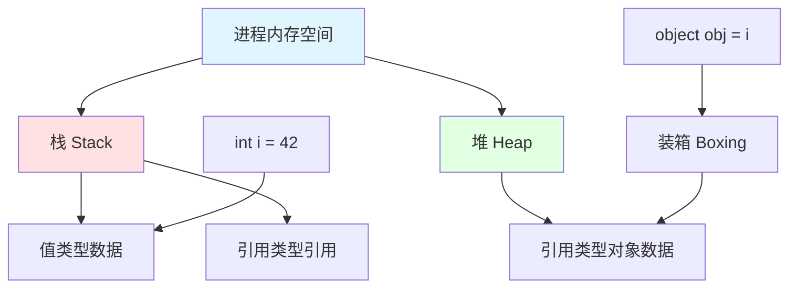
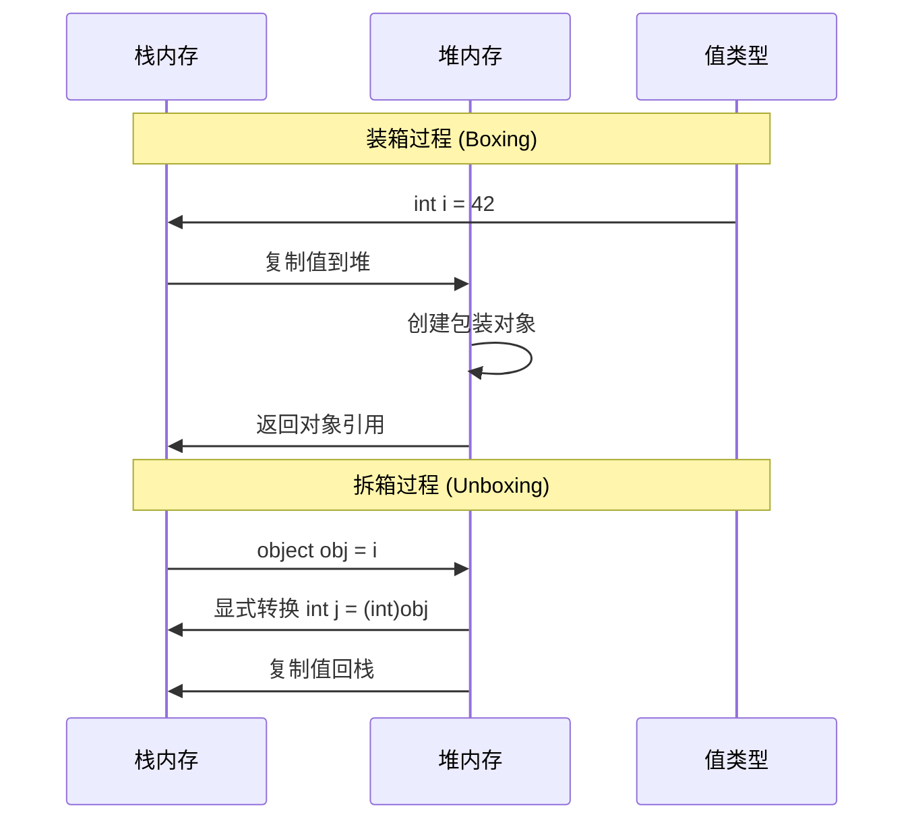
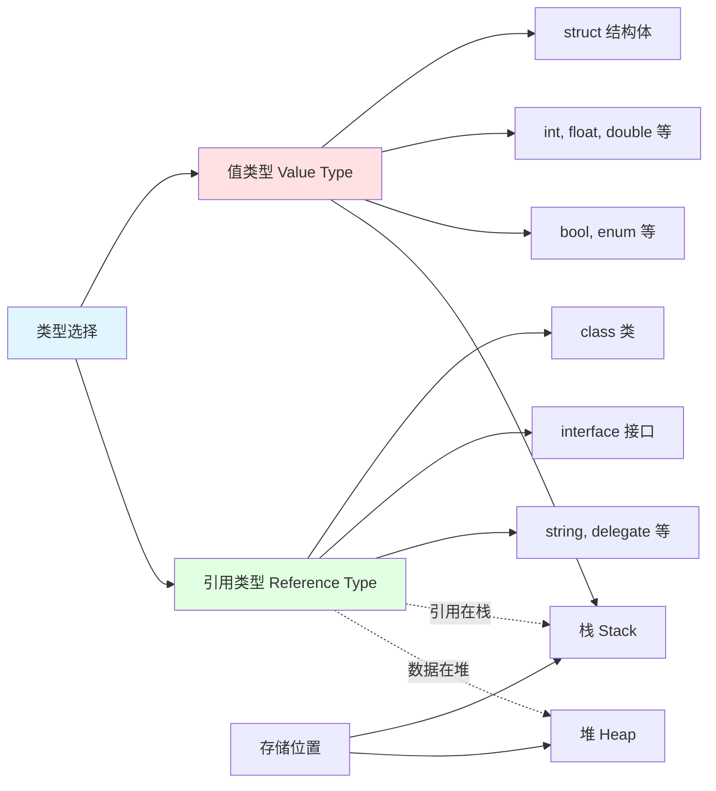
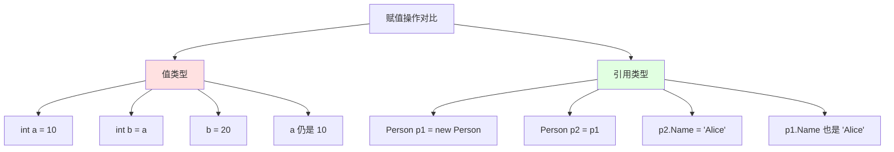
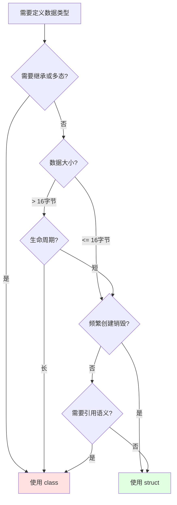
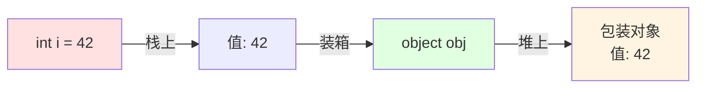
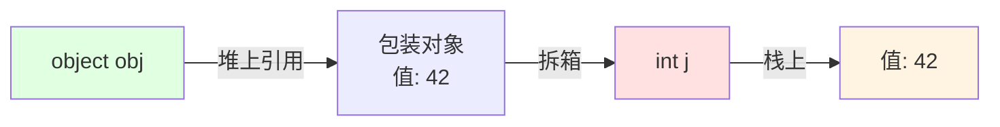

## 📊 图解

> [!info] 图示区
> 这里可以放置解释装箱拆箱概念的 mermaid 图表、UML 类图或其他辅助理解的图片

### 堆与栈的内存结构



### 装箱与拆箱过程



### 值类型 vs 引用类型



## 📖 原理

### 核心概念

#### 堆（Heap）vs 栈（Stack）

| 特性 | 栈（Stack） | 堆（Heap） |
|------|-------------|------------|
| **数据结构** | 后进先出（LIFO） | 动态分配 |
| **分配释放** | 自动（随函数调用） | GC 管理或手动释放 |
| **访问速度** | 快速 | 相对较慢 |
| **大小限制** | 有限 | 较大 |
| **存储内容** | 值类型数据、引用类型引用 | 引用类型对象数据 |

#### 值类型 vs 引用类型

| 特性 | 值类型 | 引用类型 |
|------|--------|----------|
| **定义** | struct、enum、基本类型 | class、interface、string、delegate |
| **存储位置** | 栈 | 堆（数据在堆，引用在栈） |
| **赋值行为** | 复制整个数据 | 复制引用（指针） |
| **继承** | 不能继承（隐式继承 ValueType） | 可以继承 |
| **可空性** | 不可为 null | 可以为 null |
| **默认值** | 0/false 等 | null |

#### 装箱（Boxing）vs 拆箱（Unboxing）

| 操作 | 说明 | 性能影响 |
|------|------|----------|
| **装箱** | 值类型 → 引用类型的隐式转换 | 堆分配 + 数据复制 |
| **拆箱** | 引用类型 → 值类型的显式转换 | 类型检查 + 数据复制 |

> [!warning] 性能陷阱
> 装箱和拆箱都会带来性能开销，频繁操作会导致 GC 压力增加和帧率下降。

---

## 💡 面试题

### Q1：请解释堆和栈的概念以及值类型和引用类型的区别。这对游戏开发有什么影响？

#### 📚 堆和栈的概念

堆和栈是两种程序运行时使用的内存区域，它们在内存管理方式上有根本区别。

##### 栈（Stack）

**特点：**
- 📚 后进先出（LIFO）的数据结构
- 🤖 内存分配和释放是自动的
- ⚡ 访问速度快
- 📏 大小有限

**用途：** 主要用于存储值类型数据和引用类型的引用（指针），随函数调用开始和结束

##### 堆（Heap）

**特点：**
- 📦 用于动态分配内存的区域
- 🗑️ 内存由垃圾回收器（GC）管理
- 🔄 生命周期更灵活
- ⏱️ 访问速度相对较慢

**用途：** 主要存储引用类型的实际对象数据

#### 🔍 值类型和引用类型的区别

值类型和引用类型是 C# 中两种基本的类型范畴。

##### 值类型（Value Types）

**特点：**
- 📊 数据直接存储在栈上
- 📋 赋值操作会复制整个数据
- 🔢 包括：`struct`、`int`、`float`、`bool`、`enum` 等

##### 引用类型（Reference Types）

**特点：**
- 🗃️ 对象实际数据存储在堆上
- 📍 在栈上只保存对这些数据的引用
- 🔗 赋值操作只复制引用而不是整个对象
- 📦 包括：`class`、`interface`、`string`、`delegate` 等



#### 🎮 对 Unity 游戏开发的影响

在 Unity 游戏开发中，这些概念有着深远影响：

##### 常见类型分类

| Unity 类型 | 类型分类 | 存储位置 |
|------------|----------|----------|
| `Vector3`、`Quaternion` | 结构体（值类型） | 栈 |
| `MonoBehaviour`、`GameObject` | 类（引用类型） | 堆 |

##### 性能影响

**选择值类型还是引用类型对游戏性能有直接影响：**

| 场景 | 推荐 | 原因 |
|------|------|------|
| 🔥 高频调用的函数参数 | 结构体 | 减少堆内存分配和 GC 压力 |
| 📦 小型、短生命周期数据 | struct | 避免堆分配 |
| 🏗️ 复杂、需要继承的对象 | class | 引用语义更高效 |
| 🕐 长生命周期对象 | class | 避免频繁复制 |

##### 实战策略

在我们的项目中，为了优化性能：

| 数据类型 | 选择策略 | 示例 |
|----------|----------|------|
| 🎯 坐标、旋转 | 使用 `struct` | `Vector3`、`Quaternion` |
| ⚡ 简单状态数据 | 使用 `struct` | 游戏中的状态标记 |
| 🎮 游戏实体 | 使用 `class` | 玩家角色、武器系统 |
| 🔧 系统管理器 | 使用 `class` | 需要引用语义和多态 |

> [!tip] 性能优化建议
> 在高频调用的函数中使用结构体作为参数可以减少堆内存分配和 GC 压力，显著提升游戏性能。

---

### Q2：在Unity游戏开发中，什么情况下应该使用struct(结构体)，什么情况下应该使用class(类)？请结合实例说明。

在 Unity 游戏开发中，选择使用 struct 还是 class 需要根据具体场景考虑，这直接关系到内存使用效率和性能表现。

#### ✅ 优先使用 struct 的场景

##### 1️⃣ 数据量小（< 16 字节）

**判断标准：** 当数据结构的体积小于 16 字节左右时，struct 通常更高效

> 💡 **实战案例：战斗系统的伤害数据**
>
> 在我们的战斗系统中，伤害数据结构包含伤害值、属性类型和几个标志位，总共不超过 12 字节：
>
> ```csharp
> public struct DamageInfo
> {
>     public float amount;           // 4 字节
>     public DamageType type;        // 4 字节（enum）
>     public bool isCritical;        // 1 字节
>     public bool reflectable;       // 1 字节
> }
> // 总计约 10 字节
> ```
>
> **优势：** 在计算伤害和传递伤害信息时，避免了不必要的堆内存分配

##### 2️⃣ 频繁创建和销毁

**适用场景：** 生命周期短暂、创建和销毁频繁的对象

> 💡 **实战案例：粒子特效系统**
>
> 在我们的粒子特效系统中，每帧需要计算大量粒子的位置和速度：
>
> ```csharp
> public struct Particle
> {
>     public Vector3 position;
>     public Vector3 velocity;
>     public float lifetime;
>     public Color32 color;
>
>     public void Update(float deltaTime)
>     {
>         position += velocity * deltaTime;
>         lifetime -= deltaTime;
>     }
> }
> ```
>
> **优势：** 使用结构体可以减轻 GC 压力，避免每帧创建大量对象

##### 3️⃣ 不需要继承关系

**适用场景：** 当数据结构是独立的，不需要参与类型继承层次时

**Unity 中的例子：**
- `Vector3` - 3D 向量
- `Quaternion` - 四元数旋转
- `Color` - 颜色
- `RaycastHit` - 射线检测结果

#### ❌ 应该使用 class 的场景

##### 1️⃣ 数据量大（> 16 字节）

**判断标准：** 当数据结构超过 16 字节时

> 💡 **实战案例：玩家技能配置**
>
> ```csharp
> public class SkillConfig
> {
>     public int id;
>     public string name;
>     public string description;
>     public Sprite icon;
>     public float cooldown;
>     public float manaCost;
>     public float range;
>     public List<Effect> effects;
>     public AnimationClip animation;
>     // ... 更多参数
> }
> ```
>
> **原因：** 作为方法参数传递或赋值操作会导致大量复制，此时用 class 更合适

##### 2️⃣ 需要引用语义

**适用场景：** 当多个部分需要引用和修改同一个对象时

> 💡 **实战案例：物品系统**
>
> ```csharp
> public class Item
> {
>     public int Id { get; set; }
>     public int Count { get; set; }
>     // ...
> }
>
> // 同一个物品同时存在于背包和装备栏中
> Item sword = inventory.GetItem(0);
> equipment.Equip(sword); // 引用同一个对象
> inventory.Remove(sword); // 两处都会同步
> ```
>
> **原因：** 需要保持数据一致

##### 3️⃣ 需要多态或继承

**适用场景：** 当需要利用面向对象的继承和多态特性时

> 💡 **实战案例：AI 行为树系统**
>
> ```csharp
> public abstract class BehaviorNode
> {
>     public abstract NodeStatus Execute();
> }
>
> public class SequenceNode : BehaviorNode
> {
>     public override NodeStatus Execute() { /* ... */ }
> }
>
> public class SelectorNode : BehaviorNode
> {
>     public override NodeStatus Execute() { /* ... */ }
> }
> ```
>
> **原因：** 必须使用 class

##### 4️⃣ 对象池复用

**适用场景：** 当对象需要频繁重用时

> 💡 **实战案例：特效管理系统**
>
> ```csharp
> public class ParticleEffect : MonoBehaviour
> {
>     public void Play()
>     {
>         gameObject.SetActive(true);
>     }
>
>     public void Stop()
>     {
>         gameObject.SetActive(false);
>         ObjectPool.Return(this);
>     }
> }
> ```
>
> **原因：** class 结合对象池通常比重复创建 struct 更高效

#### 📊 决策对比表

| 场景 | struct | class |
|------|--------|-------|
| 📏 **数据大小** | ≤ 16 字节 | > 16 字节 |
| 🔁 **创建频率** | 频繁创建销毁 | 长生命周期 |
| 🧬 **继承需求** | 不需要 | 需要 |
| 📎 **引用语义** | 不需要 | 需要 |
| 🎯 **性能考量** | 减少 GC | 避免复制开销 |

#### ⚡ 性能优化案例

> 💡 **真实项目优化案例**
>
> **背景：** 在一次对战游戏项目中
>
> **优化前：** 所有技能效果数据使用 `class`
>
> **优化后：** 改为 `struct`
>
> **结果：**
> - 📉 GC 峰值降低约 **40%**
> - ⚡ 帧率稳定性显著提升
> - 🎮 特别是在高强度战斗场景中效果明显
>
> **注意事项：**
> - ⚠️ 过度使用 struct 也可能因为值复制导致性能下降
> - 📊 需要根据实际情况进行性能测试和优化

#### 🎯 选择决策流程图



> [!tip] 最佳实践
> 1. **性能测试验证**：使用 Unity Profiler 验证选择的正确性
> 2. **避免过早优化**：先确保代码正确，再优化性能
> 3. **平衡考虑**：在性能和代码可读性之间找到平衡点

---

### Q3：请解释C#中的装箱(Boxing)和拆箱(Unboxing)，并说明它们如何影响Unity游戏性能以及如何避免这些性能开销。

#### 📦 装箱（Boxing）

**定义：** 装箱是将值类型隐式转换为引用类型的过程

**工作流程：**
1. 📊 在托管堆上分配内存
2. 🔄 将值类型的值复制到堆内存
3. 🔙 返回堆上新对象的引用

**示例：**
```csharp
int i = 42;           // 值类型，在栈上
object obj = i;       // 装箱：int → object
```



#### 📤 拆箱（Unboxing）

**定义：** 拆箱是将装箱后的引用类型显式转换回原始的值类型

**工作流程：**
1. 🔍 检查引用对象的类型是否与目标值类型匹配
2. 📋 将堆中的数据复制回栈内存
3. ⚡ 导致额外的 CPU 开销

**示例：**
```csharp
int j = (int)obj;    // 拆箱：object → int
```



#### ⚠️ 对 Unity 游戏性能的影响

##### 1️⃣ 内存分配

**问题：** 每次装箱都会在堆上创建一个新对象

**影响：**
- 📈 增加 GC 的压力
- ⏱️ 在对帧率要求高的游戏中，频繁的装箱操作可能导致 GC 频繁回收
- 📉 进而导致卡顿

##### 2️⃣ CPU 开销

**问题：** 装箱和拆箱操作涉及内存复制和类型检查

**影响：**
- 💢 增加了额外的 CPU 负担
- 📉 影响游戏的运行效率
- 🎯 特别在性能敏感的代码中影响明显

##### 3️⃣ 缓存不友好

**问题：** 装箱将原本在栈上的数据移到堆上

**影响：**
- 🔥 导致 CPU 缓存失效
- 📉 降低了缓存命中率
- ⚡ 影响性能

#### 🛡️ 避免装箱/拆箱的优化策略

##### 1️⃣ 避免值类型转换为 object 或接口类型

**❌ 不好的做法：**
```csharp
// 会触发装箱
public void LogError(object message)
{
    Debug.Log(message);
}

LogError(42);  // int 被装箱为 object
```

**✅ 好的做法：**
```csharp
// 使用泛型重载
public void LogError<T>(T message)
{
    Debug.Log(message);
}

LogError(42);  // 不会装箱
```

##### 2️⃣ 使用泛型

**泛型可以保留类型信息，避免装箱**

| 集合类型 | 是否装箱 | 说明 |
|----------|----------|------|
| `ArrayList` | ✅ 装箱 | 非泛型集合，元素为 object |
| `List<T>` | ❌ 不装箱 | 泛型集合，类型安全 |
| `Dictionary<TKey, TValue>` | ❌ 不装箱 | 泛型字典，类型安全 |

**示例：**
```csharp
// ❌ 会导致装箱
ArrayList list = new ArrayList();
list.Add(42);  // 装箱

// ✅ 使用泛型避免装箱
List<int> list = new List<int>();
list.Add(42);  // 不装箱
```

##### 3️⃣ 对象池复用

**当对象需要频繁重用时，结合对象池的方式**

**示例：**
```csharp
public class EffectPool
{
    private Stack<ParticleEffect> pool = new Stack<ParticleEffect>();

    public ParticleEffect Get()
    {
        return pool.Count > 0 ? pool.Pop() : new ParticleEffect();
    }

    public void Return(ParticleEffect effect)
    {
        effect.Reset();
        pool.Push(effect);
    }
}
```

##### 4️⃣ 避免使用字符串插值和格式化

**问题：** 在字符串插值或格式化时，值类型可能会触发装箱

**❌ 可能导致装箱：**
```csharp
int count = 42;
string message = $"Count: {count}";  // 可能装箱
```

**✅ 使用优化方式：**
```csharp
// 使用 ToString()
string message = "Count: " + count.ToString();

// 或使用 StringBuilder
var sb = new StringBuilder();
sb.Append("Count: ");
sb.Append(count);
```

##### 5️⃣ 避免使用 params 关键字

**问题：** 使用 params 时，传递的值类型会被装箱为数组

**❌ 会导致装箱：**
```csharp
public void PrintParams(params object[] args)
{
    foreach (var arg in args)
    {
        Debug.Log(arg);
    }
}

PrintParams(1, 2, 3);  // int 被装箱
```

**✅ 替代方案：**
```csharp
// 使用重载
public void Print(int a, int b, int c)
{
    Debug.Log($"{a}, {b}, {c}");
}

// 或直接传递数组
public void PrintArray(int[] args)
{
    Debug.Log(string.Join(", ", args));
}
```

##### 6️⃣ 使用专为值类型设计的集合

| 集合类型 | 用途 | 性能 |
|----------|------|------|
| `List<T>` | 泛型列表 | ⚡ 高性能，不装箱 |
| `HashSet<T>` | 泛型集合 | ⚡ 高性能，不装箱 |
| `Dictionary<TKey, TValue>` | 泛型字典 | ⚡ 高性能，不装箱 |

#### 📊 优化策略总结

| 策略 | 说明 | 效果 |
|------|------|------|
| 🚫 **避免转换为 object** | 避免值类型与接口或 object 之间的转换 | 减少装箱 |
| 🎯 **使用泛型** | 泛型可以保留类型信息 | 避免装箱 |
| ♻️ **对象池复用** | 频繁重用的对象使用对象池 | 减少分配 |
| 📝 **StringBuilder** | 字符串操作使用 StringBuilder | 避免装箱 |
| 🔢 **避免 params** | 使用直接参数或数组 | 避免装箱 |
| 📦 **泛型集合** | 使用 `List<T>` 而非 `ArrayList` | 避免装箱 |

#### 💡 实战优化案例

> **项目背景：** 数值计算系统
>
> **问题：** 系统频繁发生装箱操作，导致 GC 分配过多，影响游戏性能
>
> **优化前：**
> ```csharp
> ArrayList numbers = new ArrayList();
> numbers.Add(42);  // 装箱
> int sum = 0;
> foreach (int n in numbers)  // 拆箱
> {
>     sum += n;
> }
> ```
>
> **优化后：** 重构为基于泛型的实现
> ```csharp
> List<int> numbers = new List<int>();
> numbers.Add(42);  // 不装箱
> int sum = numbers.Sum();  // 不拆箱
> ```
>
> **结果：**
> - 📉 成功减少了约 **40%** 的 GC 分配
> - ⚡ 大大提升了性能
> - 🎮 特别是在大规模战斗场景中，帧率得到显著提升

#### 🔍 性能监测

**使用 Unity Profiler 检测装箱：**
1. 📊 打开 Unity Profiler
2. 🔍 查看 Memory Profiler
3. 🎯 识别 GC Alloc 峰值
4. 📉 定位装箱操作的代码位置
5. ⚡ 优化并验证效果

> [!tip] 持续优化
> 定期使用 Unity Profiler 等性能分析工具，检测代码中的装箱操作，并根据分析结果进行优化，确保游戏在各种设备上的流畅运行。

---

### Q4：在Unity游戏开发中，如何通过合理的内存管理策略（尤其是关于堆和栈的使用）来优化游戏性能？

在 Unity 游戏开发中，合理的内存管理策略对优化性能至关重要，尤其是关于堆和栈的使用。我们通过以下几种策略来实现这一目标：

#### 🏗️ 策略 1️⃣：合理使用结构体

**原则：** 对于小型、生命周期短的数据结构，优先使用 struct 而非 class

| 优化点 | 说明 | 示例 |
|------|------|------|
| 📏 **小型数据** | ≤ 16 字节的数据使用 struct | `Vector3`、`Quaternion` |
| ⚡ **避免 GC** | 减少堆内存分配和 GC | 临时数据结构 |

> 💡 **实战案例：物理系统的射线检测**
>
> 在我们的物理系统中，碰撞检测需要处理大量的射线检测结果：
>
> ```csharp
> public struct RaycastHitData
> {
>     public Vector3 point;
>     public Vector3 normal;
>     public Collider collider;
>     public float distance;
>
>     // 使用结构体避免对堆内存的频繁分配
> }
>
> // 使用自定义结构体存储临时结果
> RaycastHitData[] hits = new RaycastHitData[10];
> ```
>
> **优势：** 避免对堆内存的频繁分配和回收，减轻 GC 压力

> ⚠️ **注意事项：**
> - 不滥用结构体，特别是对于超过 16 字节的数据结构
> - 考虑到值传递的复制开销，大型数据用 class 可能更合适

#### ♻️ 策略 2️⃣：对象池模式

**原则：** 对于频繁创建和销毁的游戏对象，实现严格的对象池系统

| 优势 | 说明 |
|------|------|
| 🚫 **减少分配** | 避免频繁的内存分配 |
| ⬇️ **降低 GC** | 减轻 GC 压力 |
| ⚡ **提升性能** | 避免创建/销毁开销 |

> 💡 **实战案例：特效管理系统**
>
> ```csharp
> public class EffectPool : MonoBehaviour
> {
>     [SerializeField] private ParticleEffect prefab;
>     private Queue<ParticleEffect> pool = new Queue<ParticleEffect>();
>
>     public ParticleEffect Get()
>     {
>         if (pool.Count > 0)
>         {
>             var effect = pool.Dequeue();
>             effect.gameObject.SetActive(true);
>             return effect;
>         }
>         return Instantiate(prefab);
>     }
>
>     public void Return(ParticleEffect effect)
>     {
>         effect.gameObject.SetActive(false);
>         effect.Reset();
>         pool.Enqueue(effect);
>     }
> }
> ```
>
> **效果：** 将堆内存管理从自动转向半手动，避免频繁的内存分配和 GC

#### 📊 策略 3️⃣：数据导向设计

**原则：** 尽可能将数据与行为分离，并使用数组等连续内存结构存储数据

| 优势 | 说明 |
|------|------|
| 🚀 **缓存友好** | 提高缓存命中率 |
| 📦 **内存紧凑** | 更好地控制内存布局 |
| ⚡ **性能提升** | 减少缓存未命中 |

> 💡 **实战案例：实体组件系统（ECS）**
>
> ```csharp
> // 数据组件 - 使用结构体
> public struct TransformData
> {
>     public Vector3 position;
>     public Quaternion rotation;
>     public Vector3 scale;
> }
>
> public struct MovementData
> {
>     public Vector3 velocity;
>     public float speed;
> }
>
> // 使用数组存储，连续内存
> private TransformData[] transforms;
> private MovementData[] movements;
> ```
>
> **优势：**
> - 提高了缓存命中率
> - 更好地控制内存布局

#### 🚫 策略 4️⃣：避免装箱和拆箱

**原则：** 仔细审查代码，避免隐式装箱操作

| 策略 | 说明 |
|------|------|
| 🎯 **泛型集合** | 使用 `List<T>` 而非 `ArrayList` |
| 🔢 **避免转换** | 避免值类型与接口或 object 之间的转换 |
| 📝 **StringBuilder** | 字符串操作使用 `StringBuilder` |

**示例对比：**

| ❌ 不好的做法 | ✅ 好的做法 |
|-------------|-----------|
| `ArrayList list = new ArrayList();` | `List<int> list = new List<int>();` |
| `string s = "" + 42;` | `string s = "" + 42.ToString();` |
| `void Log(object msg)` | `void Log<T>(T msg)` |

#### 🔒 策略 5️⃣：合理使用值类型的可变性

**原则：** C# 中的 struct 默认是可变的，但在多线程环境下可能导致问题

| 策略 | 说明 |
|------|------|
| 🔒 **不可变设计** | 将结构体设计为不可变 |
| 📋 **完整复制** | 在修改前后完整复制 |

> 💡 **示例：不可变结构体**
>
> ```csharp
> public readonly struct DamageInfo
> {
>     public readonly float amount;
>     public readonly DamageType type;
>     public readonly GameObject source;
>
>     public DamageInfo(float amt, DamageType t, GameObject src)
>     {
>         amount = amt;
>         type = t;
>         source = src;
>     }
>
>     // 返回新实例而非修改自身
>     public DamageInfo WithAmount(float newAmount)
>     {
>         return new DamageInfo(newAmount, type, source);
>     }
> }
> ```

#### 🧹 策略 6️⃣：内存碎片化管理

**原则：** 对于长时间运行的游戏场景，定期触发小型 GC 以清理临时对象

| 策略 | 说明 | 效果 |
|------|------|------|
| 🕒 **定期小型 GC** | 定期触发小型 GC | 清理临时对象 |
| 🚫 **避免大型 GC** | 避免大型 GC 造成明显卡顿 | 保持帧率稳定 |

> 💡 **实现方式：**
>
> ```csharp
> // 在合适的时机（如场景切换时）触发 GC
> private void OnSceneUnload()
> {
>     // 先卸载未使用的资源
>     Resources.UnloadUnusedAssets();
>
>     // 然后触发 GC
>     System.GC.Collect();
>     System.GC.WaitForPendingFinalizers();
>     System.GC.Collect();
> }
> ```

#### 📊 综合优化效果

| 优化策略 | GC 影响 | 性能影响 |
|----------|---------|----------|
| ✅ 使用 struct | 📉 减少 GC 分配 | ⚡ 提升缓存命中率 |
| ♻️ 对象池 | 📉 大幅减少 GC | ⚡ 避免创建/销毁开销 |
| 📊 数据导向 | 📉 内存布局更优 | ⚡ 提升缓存性能 |
| 🚫 避免装箱 | 📉 减少临时对象 | ⚡ 减少 GC 压力 |
| 🧹 定期 GC | 📊 控制 GC 时机 | ⚡ 避免卡顿 |

> [!tip] 优化流程建议
> 1. 📊 使用 Profiler 识别内存热点
> 2. 🎯 针对性优化高频分配点
> 3. ♻️ 实施对象池等优化策略
> 4. ✅ 验证优化效果
> 5. 🔄 持续监控和调整

---

## 🔗 相关链接

- [[C#语言特性]] - 父主题索引
- [[面向对象]] - 相关主题：类与结构体的设计选择
- [[C# GC]] - 相关主题：垃圾回收与内存管理
