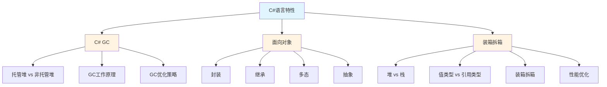

# C#语言特性

## 📋 来源信息

| 项目 | 内容 |
|------|------|
| **原始链接** | https://www.yuque.com/wanghao-yciao/dk58gg/rycg3i65h9vk6mzd |
| **归档时间** | 2026-04-14 |
| **归档方式** | 语雀公开页抓取 |

## 📚 本地二级子页面索引

本主题包含以下核心知识点：

### 📖 子主题列表

| 序号 | 主题 | 说明 | 链接 |
|------|------|------|------|
| 01 | **C# GC** | 垃圾回收机制、内存管理、性能优化 | [[C# GC]] |
| 02 | **面向对象** | 封装、继承、多态、抽象 | [[面向对象]] |
| 03 | **装箱拆箱** | 堆与栈、值类型与引用类型、性能影响 | [[装箱拆箱]] |

---

## 🎯 学习路径建议

### 推荐学习顺序

1. **面向对象** → 理解 C# 的核心编程范式和设计思想
2. **装箱拆箱** → 深入理解内存管理和性能影响因素
3. **C# GC** → 掌握自动内存管理机制和优化技巧

---

## 💡 核心概念关联

这三个主题共同构成了 C# 语言特性的基础，在游戏开发中密不可分：

| 主题 | 关键点 | 游戏开发影响 |
|------|--------|--------------|
| **面向对象** | 封装、继承、多态 | 代码架构、可维护性、扩展性 |
| **装箱拆箱** | 值类型、引用类型、内存布局 | 性能优化、GC 压力、内存使用 |
| **C# GC** | 托管堆、垃圾回收、资源管理 | 帧率稳定性、内存泄漏预防 |

> [!tip] 学习建议
> 这三个主题相互关联：面向对象提供了代码组织方式，装箱拆箱影响性能，而 GC 负责自动内存管理。在游戏开发中，需要综合考虑这三方面来编写高质量、高性能的代码。

---

## 🎮 Unity 游戏开发中的重要性

C# 是 Unity 的主要编程语言，理解这些特性对游戏开发至关重要：

### 性能优化
- 🎯 减少 GC 压力（避免装箱拆箱）
- ⚡ 合理使用值类型和引用类型
- 🔄 对象池模式减少内存分配

### 代码架构
- 🏗️ 面向对象设计模式
- 🔧 接口与抽象类的合理选择
- 📦 组件化开发（MonoBehaviour）

### 资源管理
- 💾 托管堆 vs 非托管堆
- 🗑️ 及时释放资源
- 📊 监控和分析内存使用

---

## 🔗 相关链接

- [[游戏客户端面试题]] - 返回上级目录
