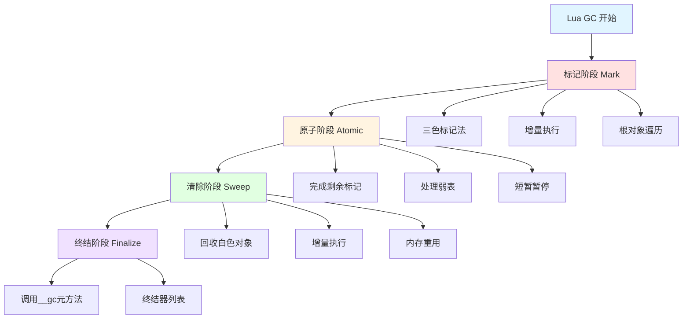
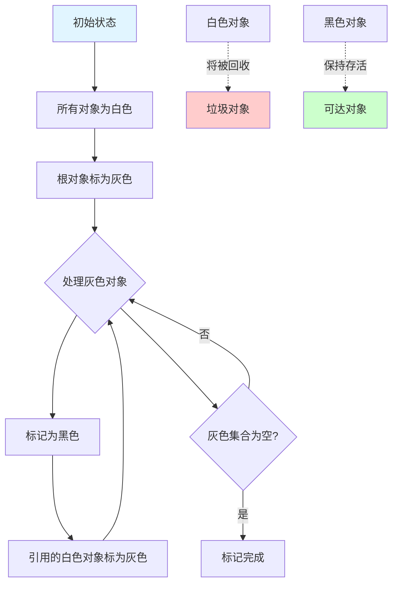
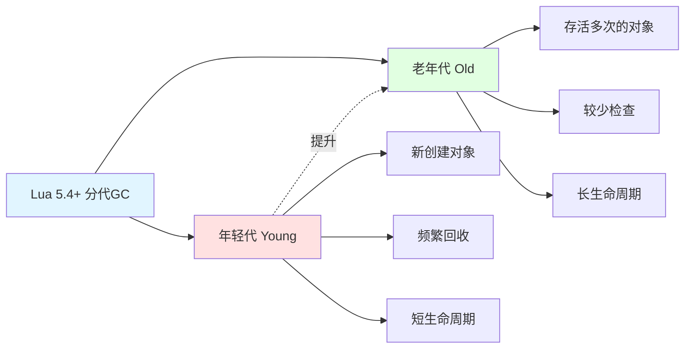
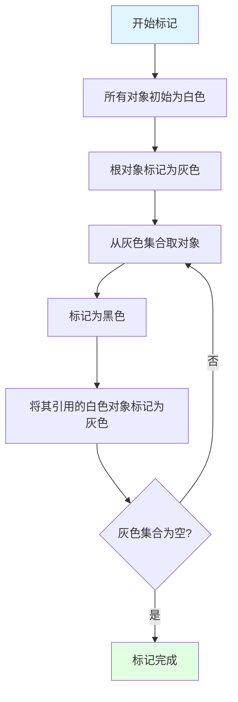
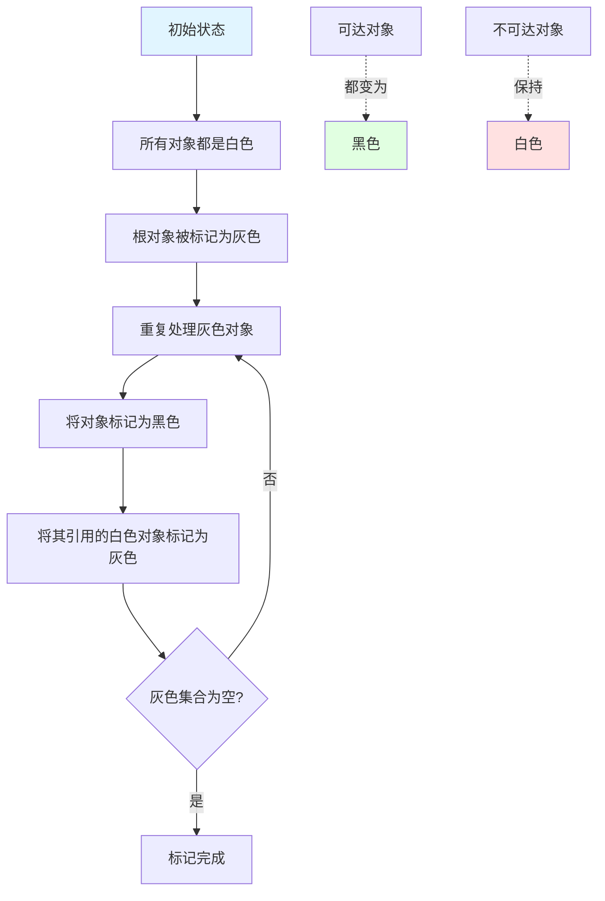
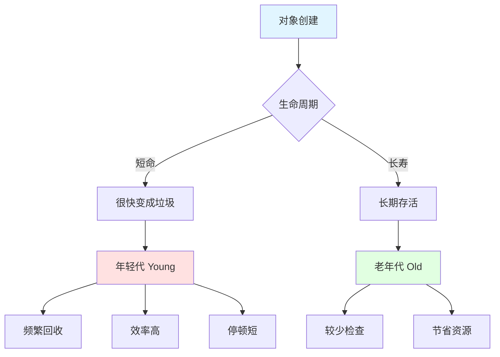

## 📊 图解

> [!info] 图示区
> 这里可以放置解释 Lua GC 概念的 mermaid 图表、UML 类图或其他辅助理解的图片

### Lua GC 的四个阶段



### 三色标记法



### 分代 GC 结构



## 📖 原理

### 核心概念

Lua 垃圾回收是基于**增量标记-清除算法**实现的，整个过程分为四个主要阶段。

#### 垃圾回收的四个阶段

| 阶段 | 名称 | 说明 | 执行方式 |
|------|------|------|----------|
| 1️⃣ | **标记阶段** | 标记所有可达对象 | 增量执行 |
| 2️⃣ | **原子阶段** | 完成标记，处理弱表 | 原子执行 |
| 3️⃣ | **清除阶段** | 回收不可达对象 | 增量执行 |
| 4️⃣ | **终结阶段** | 调用终结器 | 独立执行 |

#### 三色标记法

Lua 使用三色标记法来追踪对象的可达性：

| 颜色 | 状态 | 说明 |
|------|------|------|
| ⚪ **白色** | 未访问 | 初始状态，将被回收 |
| 🔵 **灰色** | 已访问未检查 | 中间状态，引用尚未完全检查 |
| ⚫ **黑色** | 已完成检查 | 确认存活，不会被回收 |

#### 写屏障机制

为了支持增量执行，Lua 实现了写屏障机制：

| 机制 | 作用 |
|------|------|
| 🛡️ **监控引用修改** | 当黑色对象引用白色对象时触发 |
| 🔄 **重新标记** | 将白色对象重新标记为灰色 |
| ✅ **保证正确性** | 确保可达对象不会被错误回收 |

---

## 💡 面试题

### Q1：请详细解释Lua垃圾回收的主要阶段及其工作原理。

Lua 垃圾回收是基于**增量标记-清除算法**实现的，整个过程分为四个主要阶段。

#### 🔄 1️⃣ 标记阶段（Marking Phase）

**目标：** 标记所有可达对象

**工作原理：**
- 🎯 从根对象开始（全局变量、注册表、Lua 栈等）
- 🎨 使用三色标记法标记可达对象
- ⏱️ 增量执行：分多次少量工作进行

**三色标记过程：**



**增量执行特点：**
- ✅ 每完成一小部分标记工作，控制权返回给主程序
- ⚡ 减少停顿时间
- 🔄 需要写屏障支持

#### ⚛️ 2️⃣ 原子阶段（Atomic Phase）

**目标：** 完成所有剩余的标记工作

**工作内容：**
| 操作 | 说明 |
|------|------|
| ✅ **完成标记** | 确保所有可达对象都已被正确标记 |
| 📋 **处理弱表** | 决定弱表中的条目是否需要被删除 |
| ⏸️ **短暂暂停** | 唯一可能导致程序短暂暂停的阶段 |

**为什么必须原子执行：**
- 🔒 确保标记的正确性
- 🚫 不能被中断，否则标记状态可能不一致

#### 🧹 3️⃣ 清除阶段（Sweeping Phase）

**目标：** 回收不可达对象

**工作原理：**
- 🗑️ 扫描所有对象链表
- ♻️ 回收所有仍然是白色（不可达）的对象
- 📦 将内存返回给系统或重用
- ⏱️ 增量执行，每次只清理一小部分

#### 💀 4️⃣ 终结阶段（Finalization Phase）

**目标：** 调用带有 `__gc` 元方法的对象的终结器

**工作原理：**
| 操作 | 说明 |
|------|------|
| 📋 **收集对象** | 将带有 `__gc` 元方法的对象放入单独列表 |
| ⏮️ **逆序调用** | 按照加入列表的相反顺序调用终结器 |
| 🔗 **依赖处理** | 确保依赖关系的正确处理 |

---

### Q2：解释Lua GC的三色标记法和写屏障机制，它们如何确保增量执行的正确性？

#### 🎨 三色标记法

**三色标记法**是 Lua 垃圾回收中用于追踪对象可达性的关键技术。

##### 三种颜色的含义

| 颜色 | 英文 | 状态 | 说明 |
|------|------|------|------|
| ⚪ 白色 | White | 未访问 | 初始状态，标记阶段结束后仍为白色的对象将被回收 |
| 🔵 灰色 | Gray | 已访问未检查 | 已被访问但其引用尚未完全检查的对象 |
| ⚫ 黑色 | Black | 已完成检查 | 已完全访问且其所有引用都已被检查的对象 |

##### 标记过程



#### 🛡️ 写屏障机制

**问题：** 在增量标记过程中，程序可能修改对象间的引用关系

##### 核心问题

当以下情况发生时：
- ⚫ 一个已经被标记为黑色的对象
- 🔗 引用了一个新的或尚未被访问的白色对象
- ❌ 如果不处理，白色对象可能被错误回收

##### 写屏障的工作原理


**工作流程：**
1. 📊 监控所有引用的修改操作
2. 🔍 当黑色对象 A 引用白色对象 B 时触发
3. 🔄 写屏障将对象 B 重新标记为灰色
4. ✅ 确保 B 及其引用链会被重新检查

##### 正确性保证

写屏障确保了两个关键不变量：

| 不变量 | 说明 |
|------|------|
| 💪 **强三色不变量** | 黑色对象不直接引用白色对象 |
| 🌐 **弱三色不变量** | 所有白色对象，如果被黑色对象引用，那么它也能通过一系列灰色对象被追踪到 |

#### ✅ 增量执行的正确性

通过三色标记法和写屏障机制：

| 优势 | 说明 |
|------|------|
| ✅ **正确性** | 不会错误地回收仍在使用的对象 |
| ⚡ **性能** | 将垃圾回收工作分散到程序执行过程中 |
| 🎮 **低延迟** | 减少对游戏流畅性的影响 |

> [!tip] 实现细节
> - Lua 实际上使用位标记而不是真正的"颜色"来标识对象
> - 写屏障的实现会带来少量运行时开销
> - 为了效率，写屏障可能会过度标记一些对象

---

### Q3：Lua GC的触发条件有哪些？collectgarbage函数提供了哪些控制GC行为的方法？

#### 🚦 GC 触发条件

Lua 垃圾回收的触发条件设计得非常灵活：

##### 1️⃣ 内存使用量超过阈值

**触发机制：**
- 📊 Lua 根据当前已分配内存的总量设定阈值
- ⚠️ 当内存使用超过这个阈值时，触发新的 GC 周期

**阈值计算公式：**
```lua
新阈值 = 当前使用量 × (100 + 暂停百分比) / 100
```

**默认设置：**
- 📈 默认暂停百分比是 **200%**
- 🔄 即当内存使用量增长到前次 GC 后的两倍时触发

##### 2️⃣ 显式调用

| 方法 | 说明 |
|------|------|
| 🔴 `collectgarbage("collect")` | 手动触发完整的 GC 周期 |
| ⚡ `collectgarbage("step", size)` | 执行部分 GC 工作 |

##### 3️⃣ 内存分配失败

| 情况 | 处理方式 |
|------|----------|
| ❌ 内存分配失败 | 触发紧急的完整 GC |
| 💥 GC 后仍无法分配 | 抛出内存错误 |

#### 🎛️ collectgarbage 函数

`collectgarbage` 函数提供了丰富的 GC 控制选项：

##### 1️⃣ collect - 执行完整 GC

```lua
collectgarbage("collect")  -- 强制执行完整GC
```

##### 2️⃣ stop/restart - 停止或重启 GC

```lua
collectgarbage("stop")     -- 暂停GC
collectgarbage("restart")  -- 重新启动GC
```

##### 3️⃣ step - 执行一步增量 GC

```lua
-- 执行相当于n字节工作量的GC步骤，返回是否已完成GC周期
local finished = collectgarbage("step", n)
```

##### 4️⃣ setpause - 设置 GC 暂停百分比

```lua
-- 设置暂停百分比为150%（内存增长到1.5倍时触发GC）
collectgarbage("setpause", 150)
```

##### 5️⃣ setstepmul - 设置 GC 步进倍率

```lua
-- 设置步进倍率为200（默认是200，数值越大单步工作量越大）
collectgarbage("setstepmul", 200)
```

##### 6️⃣ count - 返回内存使用量

```lua
local total_kb = collectgarbage("count")
print("内存使用: " .. total_kb .. " KB")
```

##### 7️⃣ isrunning - 检查 GC 状态

```lua
local running = collectgarbage("isrunning")  -- Lua 5.2+
```

##### 8️⃣ 切换 GC 模式（Lua 5.4+）

```lua
collectgarbage("generational")  -- 切换到分代模式
collectgarbage("incremental")   -- 切换到增量模式
```

#### 💼 实际应用案例

##### 案例 1：性能关键阶段控制

```lua
function performance_critical_task()
    local was_running = collectgarbage("isrunning")
    collectgarbage("stop")  -- 暂停GC
    
    -- 执行不希望被GC中断的操作
    -- ...
    
    if was_running then
        collectgarbage("restart")  -- 恢复原状态
    end
end
```

##### 案例 2：预防内存峰值

```lua
-- 在加载大量资源前先清理内存
function load_large_resources()
    collectgarbage("collect")  -- 先完全清理
    -- 加载资源
end
```

##### 案例 3：调整 GC 频率适应游戏场景

```lua
-- 战斗场景减少GC，提高流畅度
function enter_battle()
    collectgarbage("setpause", 300)  -- 提高触发阈值
end

-- 回到菜单界面，更积极地回收内存
function enter_menu()
    collectgarbage("setpause", 150)  -- 降低阈值
    collectgarbage("collect")        -- 立即清理
end
```

---

### Q4：Lua 5.4中引入的分代垃圾回收有什么优势？它与传统的增量GC有何不同？

#### 🌟 分代垃圾回收

Lua 5.4 引入的**分代垃圾回收**是对原有增量标记-清除算法的重要优化。

##### 基本原理

**核心观察：** 大多数对象要么很快就变成垃圾（"朝生夕死"），要么会存活很长时间（"长寿"）



##### 对象分类

| 分类 | 说明 | 处理方式 |
|------|------|----------|
| 👶 **年轻代** | 新创建的对象 | 频繁回收 |
| 👴 **老年代** | 经过多次 GC 仍然存活的对象 | 较少检查 |

#### 🔄 与传统增量 GC 的区别

##### 1️⃣ 回收策略差异

| 特性 | 增量 GC | 分代 GC |
|------|---------|----------|
| 📍 **检查范围** | 每次检查所有对象 | 大多数周期只检查年轻代 |
| ⏱️ **工作分配** | 工作分散到多个步骤 | 按代分配工作量 |
| 🎯 **关注重点** | 对所有对象一视同仁 | 集中在可能产生垃圾的年轻代 |

##### 2️⃣ 内存利用

| 方面 | 增量 GC | 分代 GC |
|------|---------|----------|
| 🔄 **对象检查** | 可能重复检查长寿对象 | 将更多精力集中在年轻代 |
| ⚡ **效率提升** | 一视同仁可能浪费资源 | 根据生命周期调整策略 |

##### 3️⃣ 工作流程

| 阶段 | 增量 GC | 分代 GC |
|------|---------|----------|
| 🔄 **执行方式** | 标记-清除被分割成小步骤 | 保留增量特性，增加分代策略 |
| 📊 **检查频率** | 所有对象平等 | 年轻代频繁，老年代稀少 |

#### ✅ 分代 GC 的优势

| 优势 | 说明 |
|------|------|
| 🚀 **提高回收效率** | 大部分 GC 操作集中在年轻代，减少检查对象数量 |
| ⚡ **减少 GC 停顿** | 年轻代回收通常比完整回收更快 |
| 📈 **内存使用更稳定** | 更频繁但更轻量的回收使内存占用曲线更平滑 |
| 🎯 **适应性强** | 更好地适应现代程序中对象生命周期的两极分化特性 |

#### 🔧 实现细节

##### 增强的写屏障

| 特性 | 说明 |
|------|------|
| 📊 **跨代引用记录** | 分代 GC 需要记录老年代对象引用年轻代对象 |
| 🛡️ **增强的写屏障** | 用于跟踪这些引用 |

##### 模式切换

```lua
collectgarbage("generational")  -- 切换到分代模式 (Lua 5.4+)
collectgarbage("incremental")   -- 切换回增量模式
```

##### 向后兼容

| 特性 | 说明 |
|------|------|
| ✅ **默认模式** | Lua 5.4 默认使用分代模式 |
| 🔄 **传统支持** | 保留对传统增量模式的完全支持 |

#### 🎮 适用场景

分代 GC 特别适合以下情况：

| 场景 | 说明 |
|------|------|
| ✨ **大量临时对象** | 如游戏中的粒子系统 |
| 🎭 **混合生命周期** | 同时存在短期和长期对象 |
| 🎮 **交互式应用** | 对 GC 停顿时间敏感的游戏 |

> [!tip] 总结
> 分代垃圾回收在保持 Lua GC 简洁设计的同时，通过更智能地分配回收资源，显著提升了垃圾回收的效率和程序的运行流畅度。这对于游戏开发等性能敏感型应用尤其重要。

---

## 🔗 相关链接

- [[Lua语言特性]] - 父主题索引
- [[Lua table底层实现]] - 相关主题：表的内存管理
- [[Lua实现闭包]] - 相关主题：闭包与内存管理
