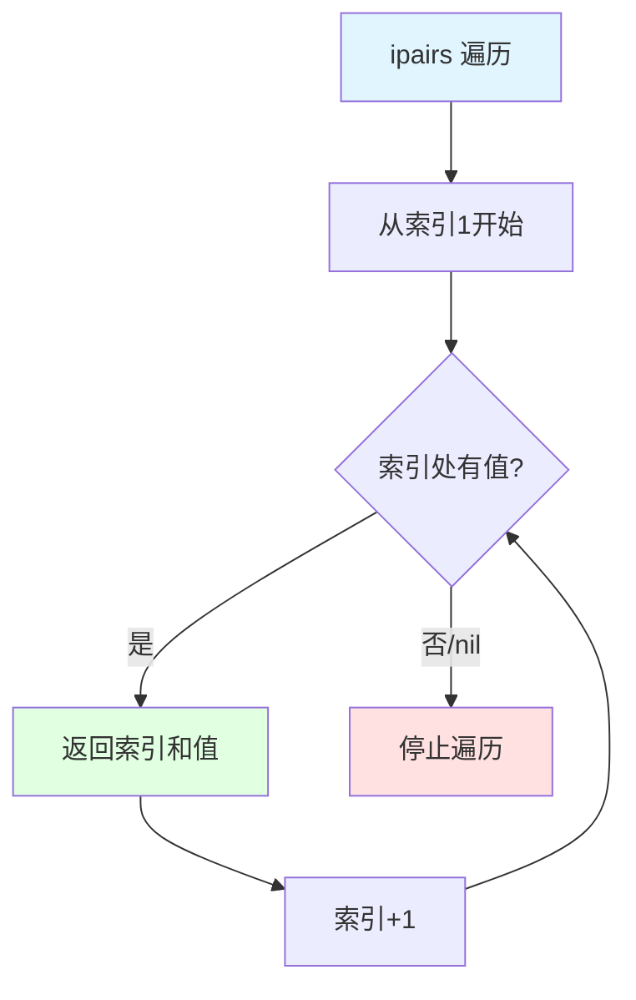
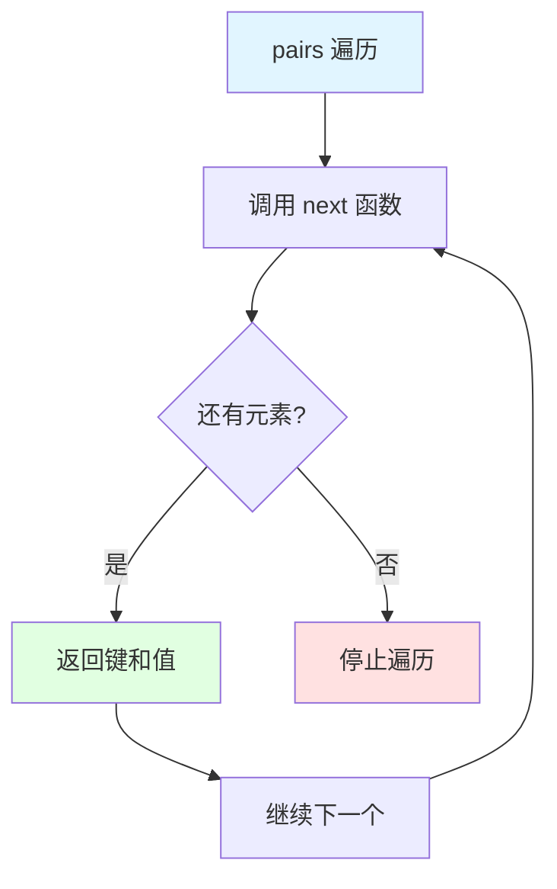
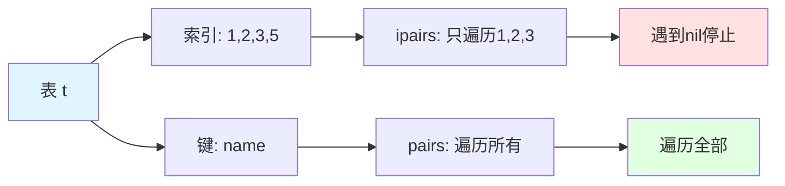
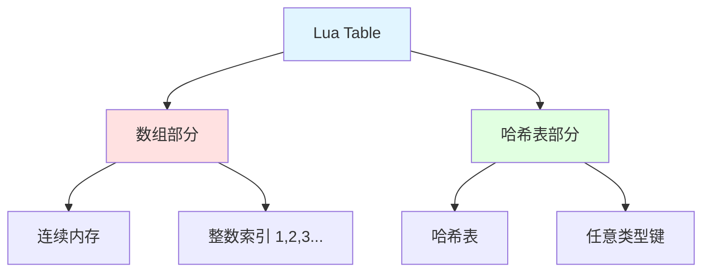
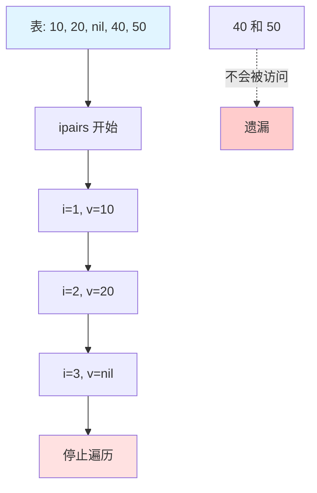

## 📊 图解

> [!info] 图示区
> 这里可以放置解释 ipairs 和 pairs 的 mermaid 图表、UML 类图或其他辅助理解的图片

### ipairs 遍历流程



### pairs 遍历流程



### 遍历对比示例



## 📖 原理

### 核心概念

#### ipairs vs pairs

| 特性 | ipairs | pairs |
|------|--------|-------|
| 🎯 **用途** | 遍历数组 | 遍历所有键值对 |
| 🔢 **键类型** | 连续整数，从1开始 | 任意类型 |
| 📊 **顺序** | 严格的数字顺序递增 | 顺序不确定 |
| 🛑 **终止条件** | 遇到第一个 nil 值停止 | 遍历所有元素 |
| 🔄 **返回值** | 索引和值 | 键和值 |

### ipairs 特点

- ✅ 专门用于遍历数组（键为连续整数且从1开始）
- 📊 按照严格的数字顺序递增遍历：1, 2, 3, ...
- 🛑 当遇到第一个 nil 值或索引不连续时停止遍历
- 📋 返回的是索引和值的组合

### pairs 特点

- ✅ 用于遍历表中所有键值对，无论键是什么类型
- 🎲 遍历顺序不确定，取决于 Lua 内部实现
- ♻️ 会访问表中的所有元素，包括非连续整数索引
- 📋 返回的是键和值的组合

---

## 💡 面试题

### Q1：详细解释Lua中ipairs和pairs的区别及各自的使用场景。

#### 🔍 核心区别

ipairs 和 pairs 是 Lua 中用于表遍历的两个函数，它们有着根本的区别：

| 对比维度 | ipairs | pairs |
|----------|--------|-------|
| 🎯 **目标** | 数组专用 | 通用遍历 |
| 📊 **顺序** | 严格递增 1,2,3... | 不确定 |
| 🛑 **终止** | 遇 nil 停止 | 遍历全部 |
| 🔑 **键类型** | 连续整数 | 任意类型 |

#### 💻 代码示例

```lua
local t = {10, 20, 30, name = "table", [5] = 50}

print("使用 ipairs 遍历:")
for i, v in ipairs(t) do
    print(i, v)  -- 只输出 1=10, 2=20, 3=30
end

print("\n使用 pairs 遍历:")
for k, v in pairs(t) do
    print(k, v)  -- 输出所有元素
end
```

**输出结果：**

```
使用 ipairs 遍历:
1       10
2       20
3       30

使用 pairs 遍历:
1       10
2       20
3       30
5       50
name    table
```

#### 🎯 使用场景

| 场景 | 推荐 | 原因 |
|------|------|------|
| 📊 **连续数组** | ipairs | 只关心连续部分 |
| 🔑 **需要访问所有元素** | pairs | 包含非数字键 |
| 📈 **按数字索引递增** | ipairs | 需要顺序 |
| 🎲 **完整遍历不关心顺序** | pairs | 全部内容 |

> [!tip] 选择建议
> - ipairs 对数组优化更好
> - pairs 更通用
> - 选择哪个取决于表的结构和遍历需求

---

### Q2：从实现原理角度，解释ipairs和pairs如何在底层工作，以及它们与Lua表的内部结构有什么关系？

#### 🏗️ Lua 表的内部结构

要理解 ipairs 和 pairs 的底层工作原理，首先需要了解 Lua 表的内部结构：

**Lua 表同时包含数组部分和哈希表部分**



#### 🔍 ipairs 的底层实现

##### 工作原理

1. **返回三元组**：ipairs 实际上返回迭代器函数、表和初始值(0)
2. **迭代器函数**：
   - 接收表和当前索引
   - 将索引加1
   - 检查新索引对应的值
   - 如果值为 nil，则返回 nil 表示结束
   - 否则返回新索引和对应值

##### 实现模拟

```lua
function iter(t, i)
    i = i + 1
    local v = t[i]
    if v ~= nil then
        return i, v
    end
end

function my_ipairs(t)
    return iter, t, 0
end
```

##### 性能优势

| 优势 | 说明 |
|------|------|
| 🚀 **内存连续** | 访问表的数组部分，连续内存 |
| ⚡ **缓存友好** | 顺序访问，CPU 缓存命中率高 |
| 🎯 **简单高效** | 基本上是一个简单的递增计数器 |

#### 🔍 pairs 的底层实现

##### 工作原理

1. **基于 next 函数**：pairs 直接基于 Lua 的内置函数 next
2. **next 函数行为**：
   - 首次调用时传入 nil 作为键，返回表中的第一个键值对
   - 之后每次调用传入上一次返回的键，获取下一个键值对
   - 当没有更多元素时返回 nil

##### 实现模拟

```lua
function my_pairs(t)
    return next, t, nil
end
```

#### 📊 与表内部结构的关系

| 方面 | ipairs | pairs |
|------|--------|-------|
| 📍 **访问范围** | 主要访问表的数组部分 | 遍历整个表 |
| 🗃️ **内存访问** | 连续内存，顺序访问 | 可能在数组和哈希表间跳转 |
| ⚡ **性能特点** | 利用数组连续特性，通常更高效 | 访问模式不理想 |

##### 元方法影响（Lua 5.2+）

| 元方法 | 作用 |
|--------|------|
| `__ipairs` | 可以被表的 `__ipairs` 元方法重载 |
| `__pairs` | 可以被表的 `__pairs` 元方法重载 |

> [!tip] 总结
> ipairs 和 pairs 的实现直接映射到 Lua 表的内部结构：
> - **ipairs**：利用数组部分的连续特性进行高效遍历
> - **pairs**：提供对整个表的完整访问能力

---

### Q3：讨论ipairs和pairs在性能上的差异，什么情况下哪个性能更好？

#### ⚡ 性能差异来源

ipairs 和 pairs 在性能上的差异主要源于它们的工作方式和 Lua 表的内部结构：

##### 1️⃣ 内存访问模式

| 方式 | ipairs | pairs |
|------|--------|-------|
| 📍 **访问模式** | 按顺序访问表的数组部分 | 使用 next 函数在不同部分间跳转 |
| 🧠 **缓存影响** | 连续内存访问，CPU 缓存友好 | 内存访问不连续 |
| 💥 **缓存未命中** | 减少缓存未命中 | 可能导致更多缓存未命中 |

##### 2️⃣ 操作复杂度

| 操作 | ipairs | pairs |
|------|--------|-------|
| 🔢 **实现复杂度** | 简单的递增计数器 | 基于 next 函数，需要在内部哈希表中查找 |
| 📊 **时间复杂度** | 基本操作 O(1) | 哈希查找平均 O(1)，但常数因子较大 |

##### 3️⃣ 遍历范围

| 方面 | ipairs | pairs |
|------|--------|-------|
| 🎯 **遍历范围** | 只遍历连续整数索引部分 | 遍历整个表 |
| 📊 **元素数量** | 可能只处理表的一小部分 | 处理的元素可能更多 |

#### 📊 性能测试示例

```lua
local function test_performance(size)
    local t = {}
    -- 填充表
    for i = 1, size do
        t[i] = i
        t["key"..i] = i  -- 添加字符串键
    end
    
    -- 测试 ipairs
    local start = os.clock()
    local sum = 0
    for i, v in ipairs(t) do
        sum = sum + v
    end
    local ipairs_time = os.clock() - start
    
    -- 测试 pairs
    start = os.clock()
    sum = 0
    for k, v in pairs(t) do
        if type(v) == "number" then
            sum = sum + v
        end
    end
    local pairs_time = os.clock() - start
    
    return ipairs_time, pairs_time
end

local itime, ptime = test_performance(1000000)
print(string.format("ipairs: %.6f, pairs: %.6f", itime, ptime))
```

#### 🎯 性能对比总结

##### ipairs 性能更好的情况

| 场景 | 说明 |
|------|------|
| 📊 **纯数组** | 表主要包含连续整数索引元素 |
| ⚡ **连续部分** | 只需要处理表的连续部分 |
| 🗄️ **大表** | 表很大且连续整数索引占大部分 |

##### pairs 性能更好的情况

| 场景 | 说明 |
|------|------|
| 💧 **稀疏数组** | 表中有大量间隙（稀疏数组） |
| 🔑 **非整数键** | 表的大部分元素都有非整数键 |
| 📦 **完整访问** | 需要访问所有元素且 ipairs 会过早停止时 |

#### 🎮 实际使用建议

| 建议 | 说明 |
|------|------|
| ✅ **语义优先** | 不要过早优化，先选择语义上正确的迭代器 |
| ⚡ **性能关键循环** | 如果确实需要遍历数组部分，ipairs 通常是更好的选择 |
| 🔍 **不确定结构** | 如果表结构不确定或需要访问所有元素，使用 pairs |
| 🚀 **手动循环** | 某些情况下，手动数字 for 循环可能比 ipairs 更高效 |

> [!warning] 注意事项
> 这些性能差异在小型表或非性能关键代码中通常可以忽略。选择正确的迭代器应该首先基于语义需求，而非性能考虑。

---

### Q4：如何理解ipairs遇到nil就停止遍历的特性？这在实际编程中有什么利弊和应用场景？

#### 🛑 ipairs 遇到 nil 就停止的特性

**工作原理：** 当 ipairs 遍历到索引 i 时，如果 `t[i]` 为 nil，则遍历立即终止

```lua
local t = {10, 20, nil, 40, 50}

-- ipairs 只会遍历到索引 1 和 2，因为索引 3 处的 nil 会终止遍历
for i, v in ipairs(t) do
    print(i, v)  -- 只输出 1 10 和 2 20
end
```



#### ✅ 这一特性的优势

##### 1️⃣ 语义明确

| 优势 | 说明 |
|------|------|
| 🎯 **符合数组概念** | 符合 Lua 中数组是从 1 开始的连续序列的概念 |
| 📏 **自然边界** | 提供了一种自然的方式表示数组的"长度"或"边界" |

##### 2️⃣ 性能优化

| 优势 | 说明 |
|------|------|
| ⚡ **不需要遍历整个表** | 不需要遍历整个可能很大的表 |
| 🔍 **避免处理空洞** | 避免处理稀疏数组中的空洞后面的元素 |

##### 3️⃣ 简化编程模型

| 优势 | 说明 |
|------|------|
| 🚫 **nil 作为终止标记** | 可以使用 nil 作为数组的终止标记 |
| 🔓 **未知长度遍历** | 允许在不知道确切长度的情况下遍历"有效"部分 |

#### ❌ 这一特性的劣势

##### 1️⃣ 意外终止

| 问题 | 说明 |
|------|------|
| ⚠️ **中间 nil 值** | 数组中间的 nil 值会导致意外终止遍历 |
| 💥 **可能错过数据** | 可能会错过重要数据，尤其是中间有意放置 nil 的情况 |

##### 2️⃣ 与 #t 的不一致

| 问题 | 说明 |
|------|------|
| ❓ **行为不确定** | Lua 的 # 操作符在表含有 nil 值时行为不确定 |
| 🔀 **可能不一致** | ipairs 的终止行为可能与 `#t` 的结果不一致 |

##### 3️⃣ 不适用于稀疏数组

| 问题 | 说明 |
|------|------|
| 🕳️ **稀疏数组** | 无法有效处理带"空洞"的数组 |
| 📉 **效率低下** | 对于非连续索引的集合效率低下 |

#### 🎮 实际应用场景

##### ✅ 适合使用 ipairs 的场景

| 场景 | 示例 |
|------|------|
| 📊 **真正的连续数组** | `local numbers = {1, 2, 3, 4, 5}` |
| 🤝 **基于协议的数据** | 解析外部 API 返回的数组数据，有明确约定确保连续性 |
| 🎯 **明确边界集合** | 使用 nil 故意标记数组的结束 |

```lua
-- 示例：表示具有明确边界的集合
local commands = {"move", "attack", nil, "reserved"}
-- ipairs 只会处理前两个命令
for i, cmd in ipairs(commands) do
    executeCommand(cmd)
end
```

##### ❌ 避免使用 ipairs 的场景

| 场景 | 解决方案 |
|------|----------|
| 🕳️ **处理可能含有 nil 的数组** | `for i=1, #t do if t[i] ~= nil then ... end end` |
| 🔢 **处理稀疏数组** | 使用 pairs 或自定义遍历逻辑 |
| 📏 **数组长度已知** | 使用数字 for 循环 `for i=1, known_length do ... end` |

#### 💡 最佳实践

| 实践 | 说明 |
|------|------|
| 🎓 **了解行为** | 了解 ipairs 的行为并有意识地选择 |
| ✅ **连续数组优先** | 对于确定是连续数组的数据，优先使用 ipairs（更清晰、更高效） |
| 🔍 **空洞集合** | 对于可能包含"空洞"的集合，使用 pairs 或自定义遍历 |
| 📋 **团队约定** | 记录和维护团队的约定，确保一致性使用 |

> [!tip] 总结
> 理解 ipairs 的这种行为对于编写健壮的 Lua 代码至关重要。这不仅是一个语法细节，而是反映了 Lua 对数组概念的基本理解。

---

## 🔗 相关链接

- [[Lua语言特性]] - 父主题索引
- [[Lua table底层实现]] - 相关主题：表的内部结构
- [[Lua GC]] - 相关主题：垃圾回收与性能
