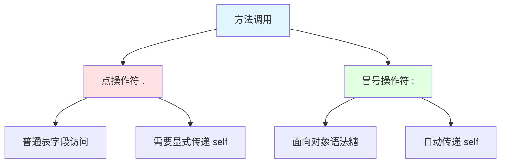
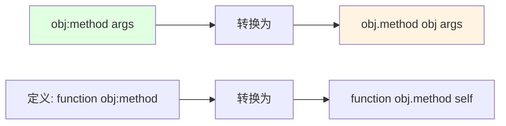
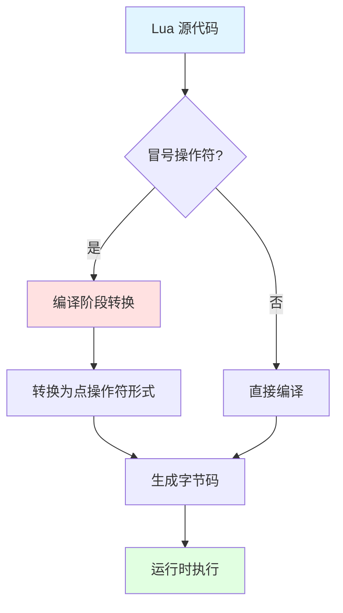
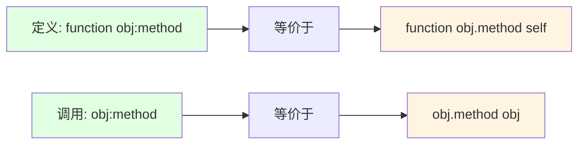
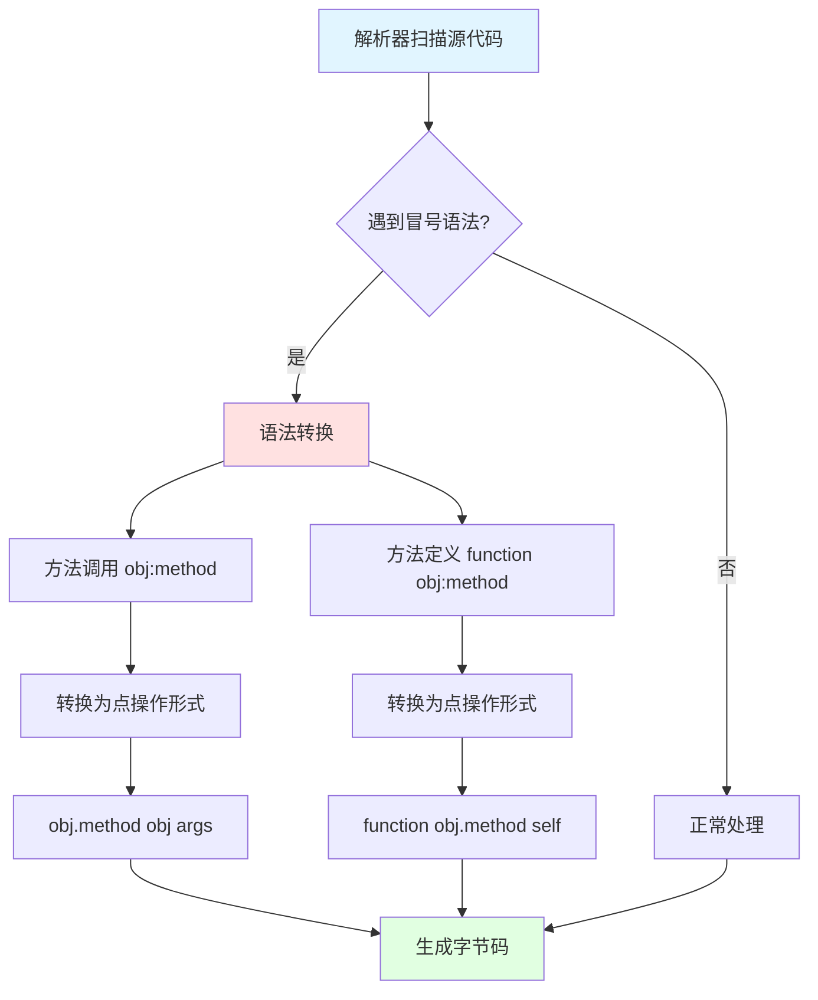
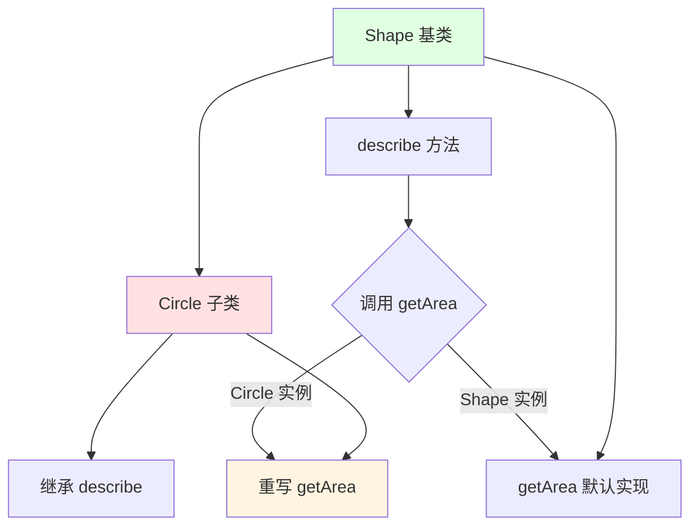

## 📊 图解

> [!info] 图示区
> 这里可以放置解释点和冒号区别的 mermaid 图表、UML 类图或其他辅助理解的图片

### 点操作符 vs 冒号操作符



### 参数传递对比



### 编译时转换



## 📖 原理

### 核心概念

Lua 中点操作符（.）和冒号操作符（:）的核心区别在于**对象自身参数（self）的处理方式**：

| 操作符 | 类型 | 说明 |
|--------|------|------|
| 🔵 **点操作符 (.)** | 普通表字段访问 | 调用方法时需要显式传递对象自身 |
| 🟢 **冒号操作符 (:)** | 面向对象语法糖 | 自动将调用者作为第一个参数传递给方法 |

#### 点操作符（.）

- 📋 普通的表字段访问
- 👨‍💼 调用方法时需要显式传递对象自身
- 🔢 更明确地展示了方法调用的实际参数传递过程

#### 冒号操作符（:）

- 🎭 面向对象的语法糖
- ⚡ 自动将调用者作为第一个参数传递
- 💡 让代码看起来更接近传统面向对象语言的语法

---

## 💡 面试题

### Q1：解释Lua中点操作符和冒号操作符的区别，并给出代码示例。

#### 🔍 核心区别

| 特性 | 点操作符 (.) | 冒号操作符 (:) |
|------|-------------|---------------|
| **本质** | 普通的表字段访问 | 面向对象的语法糖 |
| **self 参数** | 需要显式传递 | 自动传递 |
| **代码风格** | 更明确 | 更简洁 |
| **适用场景** | 工具函数、静态方法 | 对象方法 |

#### 💻 代码示例

```lua
-- 创建一个简单的表作为对象
local player = {
    health = 100,
    position = {x = 0, y = 0}
}

-- 使用点操作符定义方法
function player.move(self, dx, dy)
    self.position.x = self.position.x + dx
    self.position.y = self.position.y + dy
    return "新位置: " .. self.position.x .. ", " .. self.position.y
end

-- 使用冒号操作符定义方法
function player:damage(amount)
    self.health = self.health - amount
    return "剩余生命: " .. self.health
end

-- 点操作符调用 - 需要显式传递 self 参数
print(player.move(player, 10, 5))  -- 新位置: 10, 5

-- 冒号操作符调用 - 自动传递 self 参数
print(player:damage(30))           -- 剩余生命: 70

-- 这两种调用是等价的
print(player.damage(player, 20))   -- 剩余生命: 50
print(player:damage(20))           -- 剩余生命: 30
```

#### 📊 等价关系



#### ✨ 语法优势

| 优势 | 说明 |
|------|------|
| 🎯 **更直观** | 冒号语法看起来更像传统 OOP 语言 |
| ⚡ **更简洁** | 减少重复代码，自动传递 self |
| 🔒 **类型安全** | 明确表示这是对象方法调用 |

> [!tip] 选择建议
> - 对于对象方法，始终使用冒号定义和调用
> - 对于不需要 self 的函数，始终使用点定义和调用

---

### Q2：从实现原理角度，解释Lua解析器如何处理冒号操作符，以及什么时候应该选择点操作符而不是冒号操作符？

#### 🔧 冒号操作符的实现原理

Lua 解析器在**编译阶段**处理冒号操作符，而不是在运行时。

##### 处理流程



##### 转换规则

**对于方法调用 `obj:method(args)`：**
- 🔄 转换为等价的点操作形式 `obj.method(obj, args)`
- ➕ 自动将对象作为第一个参数插入参数列表

**对于方法定义 `function obj:method(args)`：**
- 🔄 转换为 `function obj.method(self, args)`
- ➕ 自动添加名为 self 的第一个参数

**关键点：** 这种转换发生在语法分析阶段，生成的字节码与使用点操作符的等价代码相同

#### ⚡ 性能影响

| 方面 | 说明 |
|------|------|
| ✅ **运行时无额外开销** | 编译时转换，运行时没有额外性能开销 |
| 🎯 **字节码相同** | 生成的字节码本质上是相同的 |
| 🚀 **零成本抽象** | 冒号操作符是零成本的语法糖 |

#### 🎯 何时选择点操作符

##### 适合使用点操作符的场景

| 场景 | 示例 | 原因 |
|------|------|------|
| 🔧 **工具函数** | `utils.formatString(text)` | 不需要 self |
| 🏭 **工厂函数** | `Class.new(config)` | 第一个参数不是 self |
| 📐 **静态方法** | `Math.max(a, b)` | 静态方法不需要实例 |
| 🎛️ **需要显式控制** | 代理或转发方法调用 | 需要显式控制 self 参数 |

#### 💻 示例代码

```lua
-- 适合使用点操作符的情况
local Utils = {}

-- 工具函数，不需要 self
function Utils.sum(a, b) 
    return a + b 
end

-- 构造函数/工厂函数
function Utils.createVector(x, y)
    local vector = {x = x or 0, y = y or 0}
    -- 对象方法使用冒号
    function vector:length()
        return math.sqrt(self.x * self.x + self.y * self.y)
    end
    return vector
end

-- 使用示例
print(Utils.sum(5, 10))  -- 15
local vec = Utils.createVector(3, 4)
print(vec:length())      -- 5
```

> [!tip] 最佳实践
> - 保持一致性：对于对象方法，始终使用冒号；对于不需要 self 的函数，始终使用点
> - 提高代码清晰度：在某些上下文中，显式传递 self 参数可能更清晰

---

### Q3：在Lua的面向对象编程中，冒号操作符如何帮助实现类似传统OOP语言的功能？请举例说明其在继承实现中的作用。

#### 🎭 冒号操作符在 OOP 中的关键作用

冒号操作符在 Lua 面向对象编程中扮演着关键角色，通过提供**隐式的 self 参数**，使得 Lua 代码能够模拟传统 OOP 语言的多种特性。

##### 1️⃣ 实例方法与状态封装

通过冒号语法，方法可以自然地访问和修改对象的状态：

```lua
function Shape:move(dx, dy)
    self.x = self.x + dx
    self.y = self.y + dy
end

-- 调用时感觉与传统 OOP 语言相似
myShape:move(5, 10)
```

##### 2️⃣ 继承与多态

冒号操作符配合元表机制，可以优雅地实现方法继承和多态：

```lua
-- 基类定义
Shape = {}
Shape.__index = Shape

function Shape:new(x, y)
    local instance = {x = x or 0, y = y or 0}
    setmetatable(instance, self)
    return instance
end

function Shape:getArea()
    return 0  -- 基类默认实现
end

function Shape:describe()
    return "形状位于 (" .. self.x .. "," .. self.y .. "), 面积: " .. self:getArea()
end

-- 子类定义
Circle = {}
Circle.__index = Circle
setmetatable(Circle, Shape)  -- Circle 继承 Shape

function Circle:new(x, y, radius)
    local instance = Shape:new(x, y)  -- 调用父类构造函数
    instance.radius = radius or 1
    setmetatable(instance, self)
    return instance
end

-- 重写父类方法（多态）
function Circle:getArea()
    return math.pi * self.radius * self.radius
end

-- 测试
local shape = Shape:new(10, 20)
local circle = Circle:new(15, 25, 5)

print(shape:describe())   -- "形状位于 (10,20), 面积: 0"
print(circle:describe())  -- "形状位于 (15,25), 面积: 78.53981633974483"
```



##### 3️⃣ 方法链式调用

冒号操作符还便于实现流畅的 API 和方法链：

```lua
function Shape:setColor(color)
    self.color = color
    return self  -- 返回 self 支持链式调用
end

function Shape:setName(name)
    self.name = name
    return self
end

-- 链式调用
circle:setColor("red"):setName("圆形1")
print(circle.name, circle.color)  -- 圆形1 red
```

#### ✨ 实现的传统 OOP 特性

| 特性 | 冒号操作符的作用 | 优势 |
|------|-----------------|------|
| 🔐 **封装** | 方法自然访问 self | 隐藏内部实现 |
| 🧬 **继承** | 子类调用父类方法 | 代码复用 |
| 🎭 **多态** | 子类重写父类方法 | 灵活性 |
| 🔗 **链式调用** | 返回 self | 流畅 API |

> [!tip] 总结
> 冒号操作符通过提供隐式的 self 参数，使得 Lua 这种没有内置类概念的语言能够简洁地实现传统 OOP 的核心特性，同时保持了语言的简洁性和灵活性。

---

### Q4：比较点操作符和冒号操作符在性能上的差异，并解释可能出现的常见错误。如何在实际开发中避免与self相关的问题？

#### ⚡ 性能比较

从性能角度看，点操作符和冒号操作符**几乎没有差异**：

##### 编译时转换

| 方面 | 说明 |
|------|------|
| 🔄 **转换时机** | 冒号操作符在编译阶段被转换为点操作符加 self 参数的形式 |
| 📝 **字节码相同** | 生成的字节码本质上是相同的 |
| ⚡ **运行时开销** | 运行时没有额外开销 |

##### 微小的差异

| 差异 | 说明 | 影响 |
|------|------|------|
| 📦 **临时变量** | 冒号调用会多创建一个临时变量来保存表引用 | 绝大多数情况下可忽略 |
| 🎯 **极端情况** | 只有在极端性能敏感的循环中才可能测量到差异 | 通常不需考虑 |

#### ⚠️ 常见错误

##### 错误 1️⃣：混淆点和冒号导致 self 缺失

```lua
local obj = {value = 10}
function obj:method() 
    return self.value 
end

-- ❌ 错误：用点调用需要手动传 self
print(obj.method())  -- error: attempt to index a nil value (local 'self')
```

##### 错误 2️⃣：定义与调用不一致

```lua
local obj = {value = 10}
function obj.method()  -- ❌ 错误：定义时没有 self 参数
    return self.value
end

-- error: attempt to index a nil value (global 'self')
print(obj:method())
```

##### 错误 3️⃣：闭包和回调中丢失 self

```lua
local obj = {value = 10}
function obj:method() 
    -- ❌ 错误：在闭包中，self 不会自动传递
    local callback = function() 
        return self.value * 2  -- 此处 self 可能在回调执行时已变化
    end
    return callback
end
```

##### 错误 4️⃣：方法赋值给变量时丢失 self 上下文

```lua
local obj = {value = 10}
function obj:method() 
    return self.value 
end

local func = obj.method  -- ❌ 注意：取方法引用时使用点
print(func())  -- error: 丢失了 self
```

#### 🛡️ 避免问题的最佳实践

##### 1️⃣ 保持一致性

| 规则 | 说明 |
|------|------|
| ✅ **对象方法用冒号** | 对于对象方法，始终使用冒号定义和调用 |
| 📋 **普通函数用点** | 对于不需要 self 的函数，始终使用点定义和调用 |

##### 2️⃣ 处理回调和闭包

**在闭包中显式捕获 self：**

```lua
function obj:method()
    local self = self  -- ✅ 捕获当前 self
    return function() 
        return self.value * 2 
    end
end
```

##### 3️⃣ 方法引用处理

**使用闭包保留 self 上下文：**

```lua
-- ✅ 方式 1：使用闭包
local func = function(...) 
    return obj:method(...) 
end

-- ✅ 方式 2：使用 bind 类似功能
local function bind(obj, method)
    return function(...) 
        return obj[method](obj, ...) 
    end
end

local func = bind(obj, "method")
```

##### 4️⃣ 显式文档标记

| 建议 | 说明 |
|------|------|
| 📝 **注释标记** | 在注释中明确标记哪些函数是方法（需要 self） |
| 🔍 **区分类型** | 区分静态函数和实例方法 |

##### 5️⃣ 命名约定

| 约定 | 示例 |
|------|------|
| 🎯 **实例方法** | 使用动词开头：`move()`, `attack()`, `update()` |
| 📊 **静态函数** | 使用名词或其他约定：`create()`, `getInstance()` |

#### 📊 错误预防总结

| 预防措施 | 效果 |
|----------|------|
| ✅ **一致性** | 始终如一地使用点和冒号 |
| 🔒 **闭包捕获** | 在闭包中显式捕获 self |
| 🎯 **明确文档** | 清晰标记函数类型 |
| 🔍 **代码审查** | 通过审查发现潜在问题 |

> [!tip] 总结
> 通过这些最佳实践，可以最大限度地减少与 self 相关的错误，同时保持代码的清晰度和一致性。理解点操作符和冒号操作符的底层原理，有助于开发者编写更健壮的 Lua 面向对象代码。

---

## 🔗 相关链接

- [[Lua语言特性]] - 父主题索引
- [[Lua实现面向对象]] - 相关主题：完整的面向对象实现
- [[Lua实现闭包]] - 相关主题：闭包与 self 捕获
