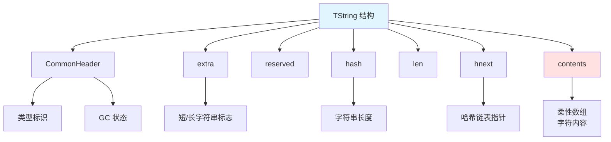
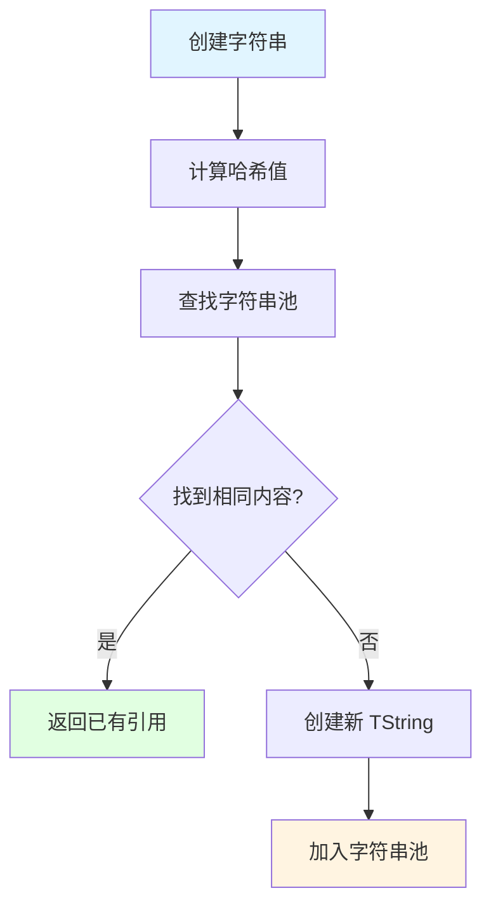
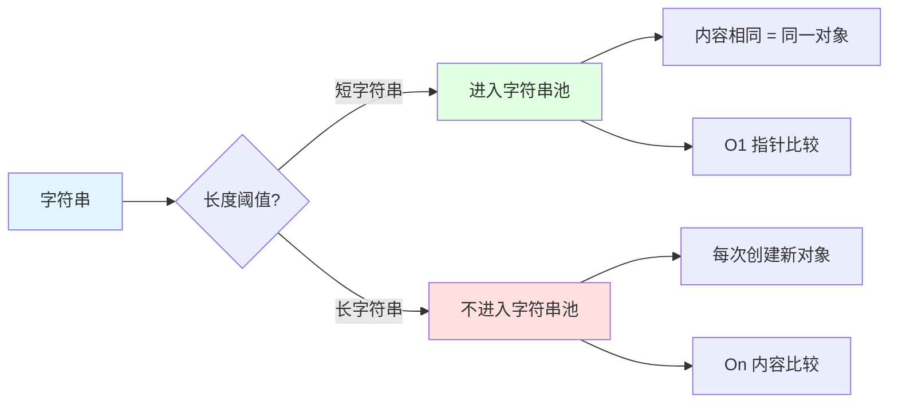
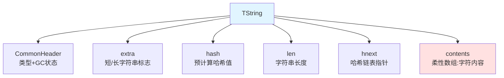
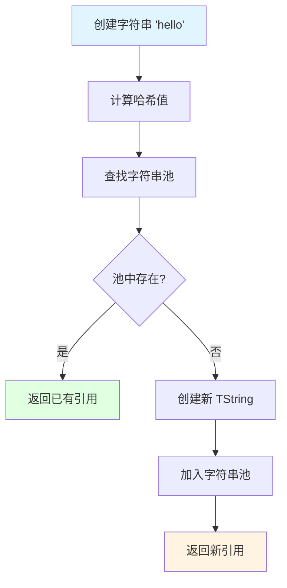
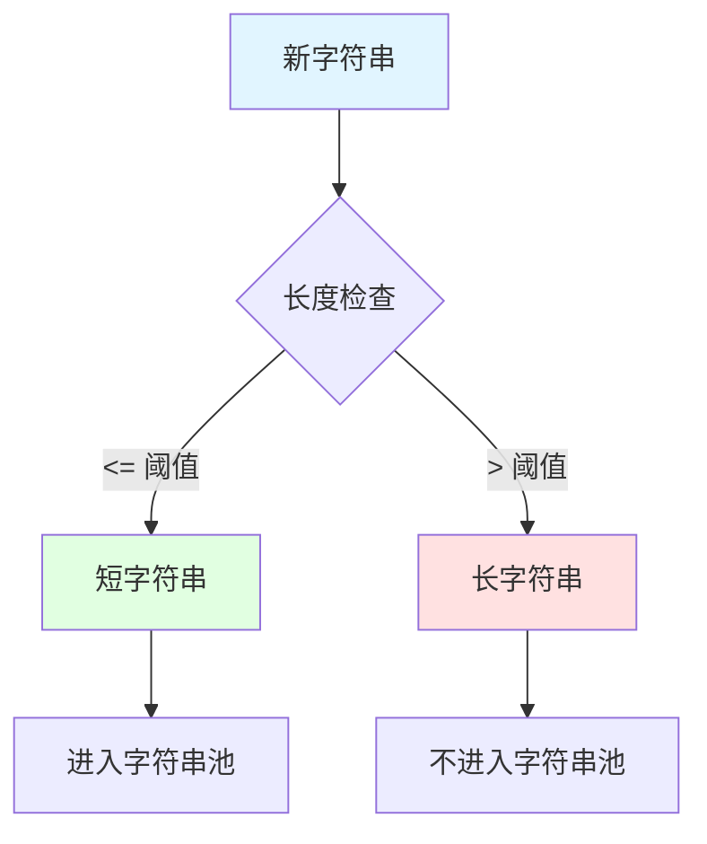
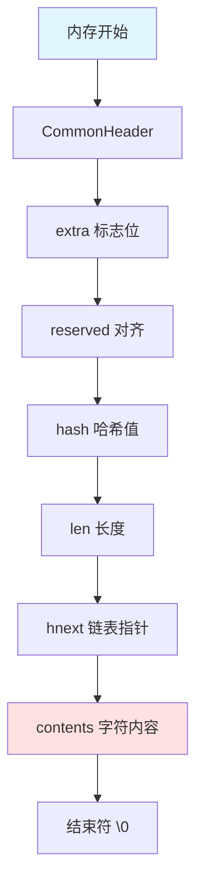
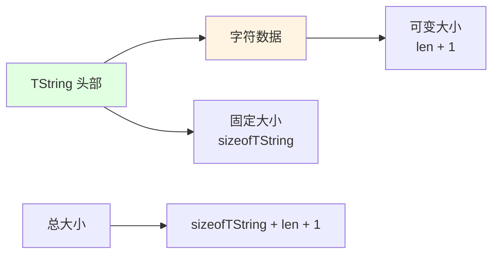

## 📊 图解

> [!info] 图示区
> 这里可以放置解释 Lua string 底层实现的 mermaid 图表、UML 类图或其他辅助理解的图片

### TString 结构内存布局

### 字符串池工作流程

### 短字符串 vs 长字符串

## 📖 原理

### 核心概念

Lua 字符串的底层结构是 **TString**，这是一个包含多个字段的结构体。

#### TString 结构组成

| 字段 | 类型 | 说明 |
|------|------|------|
| **CommonHeader** | Header | 所有 Lua 对象共有的头部，标识类型和 GC 状态 |
| **extra** | 标志位 | 区分短字符串和长字符串 |
| **hash** | 整数 | 预计算的哈希值 |
| **len** | 整数 | 字符串的长度 |
| **hnext** | 指针 | 用于构建字符串池中的冲突链表 |
| **contents** | 柔性数组 | 存储实际的字符内容 |

#### 字符串池的工作原理

1️⃣ **创建新字符串时**：Lua 首先计算它的哈希值
2️⃣ **查找字符串池**：根据哈希值查找（全局哈希表）
3️⃣ **查找结果处理**：
   - ✅ 找到相同内容 → 直接返回已有字符串的引用
   - ❌ 没有找到 → 创建新的 TString 结构，并添加到字符串池中

**这种机制称为"字符串内化"**

| 优势 | 说明 |
|------|------|
| 💾 **节省内存** | 重复字符串不会占用额外空间 |
| ⚡ **高效比较** | 相同内容的字符串具有相同指针，比较时只需 O(1) 时间复杂度 |

> [!warning] 注意事项
> 只有**短字符串**会被放入字符串池。长字符串（通常超过一定长度阈值）不会进入池。

---

## 💡 面试题

### Q1：请详细描述Lua字符串的底层结构及字符串池的工作原理。

#### 🏗️ Lua 字符串的底层结构

**TString 结构**包含以下关键字段：

#### 📦 字符串池的工作原理

##### 工作流程

##### 字符串内化的优势

| 优势 | 说明 | 性能提升 |
|------|------|----------|
| 💾 **内存节省** | 重复字符串在内存中只存在一份 | 减少内存占用 |
| ⚡ **快速比较** | 相同内容的字符串指针相同 | O(1) 指针比较 vs O(n) 内容比较 |
| 🔒 **哈希一致性** | 哈希值一旦计算永不变化 | 作为表的键时位置稳定 |

#### ⚠️ 重要限制

| 限制 | 说明 |
|------|------|
| 🎯 **短字符串专属** | 只有短字符串会被放入字符串池 |
| 📏 **长度阈值** | 长字符串不会进入池（防止字符串池过大） |
| 🔄 **减少冲突** | 避免哈希冲突和查找开销 |

> [!tip] 实践建议
> 在游戏中，频繁使用的标识符、关键字、短文本会自动享受字符串池的优化，无需手动干预。

---

### Q2：Lua如何区分短字符串和长字符串？这种区分对性能有什么影响？

#### 🔍 区分方式

Lua 通过 **TString 结构中的 extra 标志位**来区分短字符串和长字符串。

**区分标准**：字符串的长度（具体阈值取决于 Lua 的实现版本）

#### ✨ 短字符串特点

| 特点 | 说明 | 性能影响 |
|------|------|----------|
| 📋 **进入字符串池** | 会被加入全局字符串池 | 内存复用 |
| 🔄 **内容唯一** | 相同内容的短字符串在内存中只存在一个副本 | 节省内存 |
| ⚡ **指针比较** | 字符串比较通过直接比较指针实现 | O(1) 时间复杂度 |
| 🚀 **快速创建** | 创建相同内容时只需在池中查找即可复用 | 减少分配 |

#### 📊 长字符串特点

| 特点 | 说明 | 性能影响 |
|------|------|----------|
| 🚫 **不进入字符串池** | 不会被加入全局字符串池 | 避免字符串池过大 |
| 🆕 **每次创建新对象** | 每次创建都是新对象，即使内容相同 | 内存独立 |
| 📝 **内容比较** | 字符串比较需要逐字符比较内容 | O(n) 时间复杂度 |
| ⚡ **创建较快** | 创建时无需查找字符串池 | 创建速度可能略快 |

#### 📊 性能影响对比

| 方面 | 短字符串 | 长字符串 |
|------|----------|----------|
| **内存效率** | 🟢 高（字符串池复用） | 🟡 中（避免池过大） |
| **比较效率** | 🟢 O(1) 指针比较 | 🟡 O(n) 内容比较 |
| **创建效率** | 🟡 需要查找池 | 🟢 无需查找池 |
| **GC 回收** | 🟡 需等全部引用消失 | 🟢 无引用可立即回收 |

#### 💡 设计权衡

这种设计是**内存使用与性能之间的平衡**：

| 场景 | 优化目标 |
|------|----------|
| 📝 **常用标识符** | 字符串池提供极大的性能优势 |
| 📄 **长文本内容** | 避免字符串池查找和管理开销 |

> [!tip] 实践建议
> - 短字符串（如标识符）会自动优化
> - 长字符串（如文件内容）独立管理，避免池污染
> - 理解这种差异有助于编写更高效的代码

---

### Q3：Lua字符串的不可变性有什么优缺点？为什么Lua选择将字符串设计为不可变的？

#### 🔒 Lua 字符串的不可变性

**定义**：一旦字符串被创建，其内容就不能被修改。

#### ✅ 优点

##### 1️⃣ 安全性

| 优势 | 说明 |
|------|------|
| 🛡️ **参数传递安全** | 字符串作为函数参数传递时，不用担心被修改 |
| 🔗 **引用独立** | 多个变量引用同一字符串时，不会互相影响 |

##### 2️⃣ 可共享性

| 优势 | 说明 |
|------|------|
| 💾 **字符串池实现** | 不可变性是字符串池机制的前提条件 |
| 🔄 **内存共享** | 相同内容的字符串只需存储一份 |

##### 3️⃣ 哈希一致性

| 优势 | 说明 |
|------|------|
| 🔐 **哈希值固定** | 一旦计算字符串的哈希值，永远不会变化 |
| 📍 **表键稳定** | 作为表的键时，位置保持稳定 |

##### 4️⃣ 并发安全

| 优势 | 说明 |
|------|------|
| 🔒 **无需同步** | 不需要考虑并发访问的同步问题 |

##### 5️⃣ 简化实现

| 优势 | 说明 |
|------|------|
| 🎯 **API 简化** | 不需要复杂的字符串修改 API |
| 🗑️ **GC 简化** | 垃圾回收器处理更简单 |

#### ❌ 缺点

##### 1️⃣ 字符串操作效率

| 问题 | 影响 |
|------|------|
| 🔄 **修改创建新对象** | 任何修改操作都会创建新字符串 |
| ⚡ **GC 压力** | 频繁修改字符串会产生大量临时对象，增加垃圾回收压力 |

##### 2️⃣ 内存峰值

| 问题 | 影响 |
|------|------|
| 📈 **中间字符串** | 构建大字符串时可能需要多个中间字符串 |
| 💾 **内存峰值高** | 导致内存使用峰值高 |

#### 🤔 为什么 Lua 选择不可变设计

##### 1️⃣ 实现字符串池

| 考虑 | 说明 |
|------|------|
| ✅ **前提条件** | 不可变性是字符串池机制的前提条件 |
| ⚡ **性能优势** | 字符串池大大提高了内存效率和字符串比较性能 |

##### 2️⃣ 简化语言设计

| 考虑 | 说明 |
|------|------|
| 🎯 **符合理念** | 符合 Lua 简洁设计理念 |
| 📉 **减少复杂性** | 减少语言复杂性和潜在的错误 |

##### 3️⃣ 贴合常见使用模式

| 考虑 | 说明 |
|------|------|
| 📝 **主要用途** | 在脚本语言中，字符串更多用作标识符、文本常量等 |
| 🔄 **非主要场景** | 大量字符串拼接操作并不是主要场景 |

#### 💡 优化措施

针对字符串频繁修改的场景，Lua 提供了优化方案：

| 优化方案 | 说明 |
|----------|------|
| 📋 **table.concat** | 高效连接数组中的字符串 |
| 📚 **字符串缓冲库** | 减少不可变性带来的性能影响 |

> [!tip] 总结
> 整体而言，不可变设计的优点远大于缺点，特别是对于 Lua 这种嵌入式脚本语言。

---

### Q4：解释Lua字符串的柔性数组设计及其内存布局。这种设计有什么优势？

#### 🎯 柔性数组设计

Lua 字符串使用了**柔性数组（flexible array）**的设计技巧。

##### TString 结构体的内存布局

##### 柔性数组的工作原理

**"柔性数组"** 指的是 TString 结构体末尾的 contents 数组：

| 特性 | 说明 |
|------|------|
| 📝 **声明时占位** | 在声明时仅作为占位符，没有固定长度 |
| 🔄 **动态分配** | 实际创建字符串时，根据字符串的实际长度分配内存 |
| ⏩ **连续内存** | 头信息和字符内容在一起，连续存储 |

**内存分配示例：**

对于长度为 10 的字符串，Lua 会分配 `sizeof(TString) + 11` 字节的内存（包括额外的结束符 `\0`）

#### ✅ 这种设计的优势

##### 1️⃣ 内存局部性

| 优势 | 说明 |
|------|------|
| 🎯 **头信息在一起** | 头信息和字符内容在一起，提高 CPU 缓存命中率 |
| 🔗 **减少碎片** | 只需一次内存分配，减少内存碎片 |

##### 2️⃣ 访问效率

| 优势 | 说明 |
|------|------|
| ⚡ **直接访问** | 直接通过结构体指针访问字符内容，无需二次寻址 |
| 🚀 **减少间接引用** | 减少内存间接引用，提高访问速度 |

##### 3️⃣ 内存开销优化

| 优势 | 说明 |
|------|------|
| 📉 **避免指针开销** | 避免了额外的指针开销 |
| ⏱️ **减少分配次数** | 减少了内存分配的次数和相关开销 |

##### 4️⃣ 简化内存管理

| 优势 | 说明 |
|------|------|
| 🗑️ **单次释放** | 垃圾回收时只需释放一个内存块 |
| 🔒 **减少泄漏风险** | 减少内存泄漏风险 |

##### 5️⃣ C 语言兼容性

| 优势 | 说明 |
|------|------|
| 🔗 **C API 兼容** | 以 `\0` 结尾便于与 C 字符串 API 交互 |
| 🔒 **二进制安全** | Lua 内部使用明确的长度字段，支持二进制安全 |

#### 📊 设计优势总结

| 优势类别 | 具体优势 |
|----------|----------|
| ⚡ **性能** | 缓存友好、访问快速、开销低 |
| 💾 **内存** | 分配连续、碎片少、管理简单 |
| 🔧 **实现** | 简化 GC、减少泄漏、兼容 C |

> [!tip] 总结
> 这种设计是系统编程中常用的优化技巧，特别适合不可变字符串的实现。充分体现了 Lua 追求高效和精简的设计哲学。

---

## 🔗 相关链接

- [[Lua语言特性]] - 父主题索引
- [[Lua GC]] - 相关主题：字符串的垃圾回收
- [[Lua table底层实现]] - 相关主题：表的内存管理
