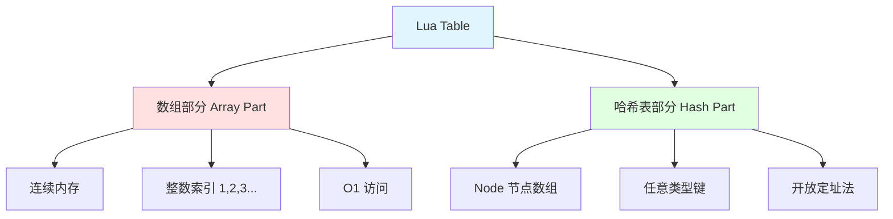
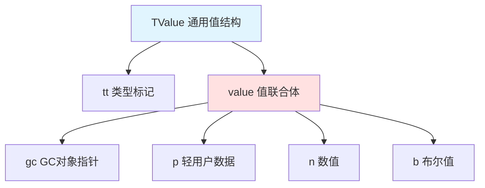
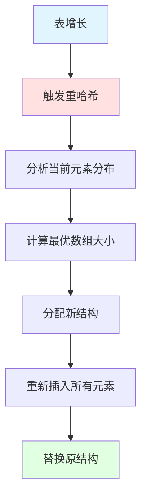
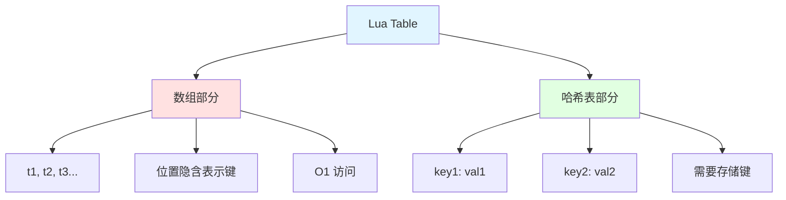
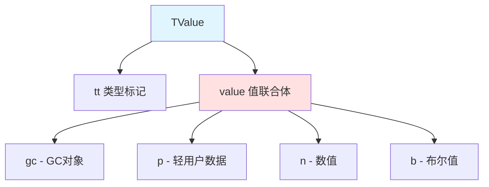
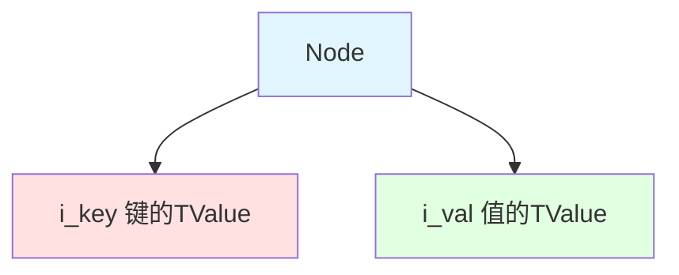
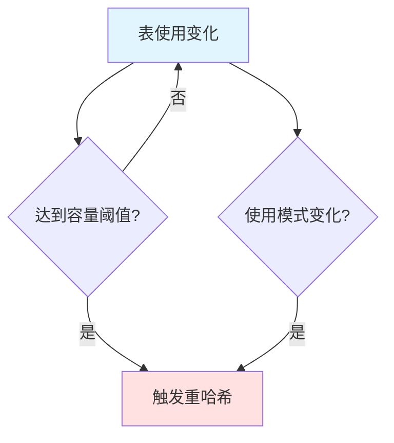
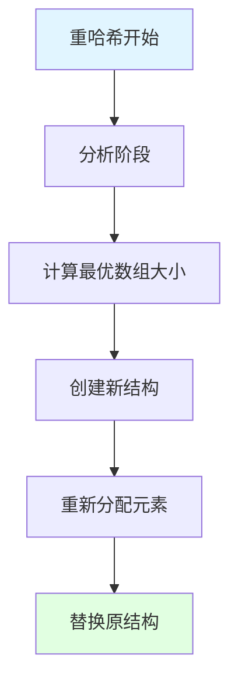

## 📊 图解

> [!info] 图示区
> 这里可以放置解释 Lua table 底层实现的 mermaid 图表、UML 类图或其他辅助理解的图片

### Lua Table 混合结构

### TValue 结构

### 重哈希过程

## 📖 原理

### 核心概念

Lua Table 的底层实现采用了**混合结构设计**，由两部分组成：

#### 📊 混合结构组成

| 部分 | 说明 | 键类型 | 访问速度 |
|------|------|---------|----------|
| 🔢 **数组部分** | 连续内存块 | 从 1 开始的连续整数 | O(1) |
| 🔑 **哈希表部分** | Node 节点数组 | 任意类型 | 平均 O(1) |

#### ✨ 设计优势

| 优势 | 说明 |
|------|------|
| ⚡ **效率优化** | 连续整数索引直接通过数组下标访问 |
| 🔧 **灵活性** | 同时处理任意类型的键 |
| ⚖️ **平衡** | 根据实际使用动态调整比例 |

---

## 💡 面试题

### Q1：请详细描述Lua Table的底层实现结构，为什么它被设计成既有数组部分又有哈希表部分？

#### 🏗️ Lua Table 的混合结构

Lua Table 的底层实现由**数组部分**和**哈希表部分**组成：

#### 📊 各部分详解

##### 数组部分

| 特性 | 说明 |
|------|------|
| 📍 **存储** | 连续内存块 |
| 🔑 **键类型** | 从 1 开始的连续整数 |
| ⚡ **访问** | O(1)，直接通过下标 |
| 💾 **特点** | 不需要存储键信息 |

##### 哈希表部分

| 特性 | 说明 |
|------|------|
| 📍 **存储** | Node 节点数组 |
| 🔑 **键类型** | 非整数键或超出数组范围的整数键 |
| ⚡ **访问** | 平均 O(1)，开放定址法 |
| 💾 **特点** | 每个节点包含完整的键值对 |

#### 🎯 设计优势

| 优势 | 说明 |
|------|------|
| ⚡ **高效** | 最常见的连续整数索引场景访问效率极高 |
| 🔧 **灵活** | 能处理任意类型的键，满足字典用途 |
| ⚖️ **平衡** | 动态调整数组和哈希表的比例 |

> [!tip] 统一性
> 这种设计使得 Lua Table 可以在单一数据结构中同时扮演数组、字典、对象系统等多种角色。

---

### Q2：解释Lua Table中TValue和Node的结构及其作用？以及Lua如何在内存中表示不同类型的值？

#### 🔍 TValue 结构

**TValue** 是 Lua 中表示任何值的通用结构：

##### TValue 组成部分

| 部分 | 类型 | 说明 |
|------|------|------|
| **value** | union | 可存储不同类型的值 |
| **tt** | 类型标记 | 表示 value 中存储的值的类型 |

##### Value 联合体成员

| 成员 | 存储内容 |
|------|----------|
| **gc** | GC 对象（字符串、表、函数等） |
| **p** | 轻用户数据 |
| **n** | 数值（lua_Number，通常是 double） |
| **b** | 布尔值（整数表示） |

#### 🔗 Node 结构

**Node** 是哈希表部分的基本单元：

##### Node 组成

| 部分 | 类型 | 说明 |
|------|------|------|
| **i_key** | TValue | 键的 TValue |
| **i_val** | TValue | 值的 TValue |

#### 🎯 类型表示的优势

这种结构设计使得 Lua 能够：

| 能力 | 说明 |
|------|------|
| 🎭 **动态类型** | 高效地表示和操作各种类型的值 |
| 🔄 **类型灵活** | 保持语言的动态特性和类型灵活性 |
| 🗑️ **GC 友好** | 便于垃圾回收器识别和处理 |
| ⚡ **快速转换** | 在不同类型间快速转换 |

---

### Q3：详细描述Lua Table的重哈希(rehash)过程是如何工作的？什么情况下会触发重哈希？

#### 🔄 重哈希（Rehash）

**重哈希**是 Lua Table 动态调整其内部结构的关键机制。

##### 触发条件

| 触发条件 | 说明 |
|----------|------|
| 📊 **容量限制** | 表中元素数量增加，达到当前容量的一定比例 |
| 🔄 **模式变化** | 表的使用模式发生显著变化 |
| ⚖️ **比例失衡** | 数组部分和哈希部分的比例失衡 |

##### 重哈希过程

**四步骤详解：**

| 步骤 | 操作 | 说明 |
|------|------|------|
| 1️⃣ **分析阶段** | 计算理想的数组和哈希表大小 | 选择最优数组大小，使利用率最高 |
| 2️⃣ **创建新结构** | 分配新的内存空间 | 数组大小合适，哈希表大小为 2 的幂 |
| 3️⃣ **重新分配** | 遍历原表所有元素 | 适合数组的放数组，其他放哈希表 |
| 4️⃣ **替换原结构** | 释放原内存，更新指针 | 完成重哈希 |

#### ⚡ 性能考虑

| 方面 | 说明 |
|------|------|
| ⚠️ **昂贵操作** | 重哈希是相对昂贵的操作 |
| 🎯 **启发式算法** | 使用启发式算法减少未来重哈希需要 |
| 📊 **额外空间** | 重哈希后的表通常有额外空间 |

> [!tip] 实践建议
> 在预知表会大幅增长时，可以预先创建合适大小的表，减少重哈希次数。

---

### Q4：Lua Table与其他语言的类似数据结构相比，有哪些独特的优势和可能的局限性？

#### ✨ 独特优势

##### 1️⃣ 统一的数据结构

| 优势 | 说明 |
|------|------|
| 🎯 **唯一复合类型** | Lua Table 是语言中唯一的复合数据结构 |
| 🎭 **多重角色** | 同时扮演数组、哈希表、对象系统等角色 |
| 📚 **简化学习** | 统一性简化了语言设计和学习曲线 |

##### 2️⃣ 混合结构的效率

| 优势 | 说明 |
|------|------|
| ⚡ **数组优化** | 数组部分对连续整数索引的优化非常高效 |
| 🔧 **灵活处理** | 大多数语言没有这种混合优化 |

##### 3️⃣ 元表机制

| 优势 | 说明 |
|------|------|
| 🎭 **自定义行为** | 通过元表可以自定义表的行为 |
| ⚡ **元编程能力** | 提供强大的元编程能力 |

##### 4️⃣ 其他优势

| 优势 | 说明 |
|------|------|
| 💾 **轻量级** | 内存开销相对较小 |
| 📊 **动态调整** | 动态调整数组/哈希比例优化内存 |
| ✨ **简洁语法** | 同时支持数组风格和键值对风格 |

#### ⚠️ 局限性

##### 1️⃣ 迭代顺序不确定

| 局限 | 影响 |
|------|------|
| ❌ **顺序不保证** | 不保证迭代顺序 |
| 🔧 **需要额外工作** | 有序集合需要额外处理 |

##### 2️⃣ 键的类型限制

| 局限 | 说明 |
|------|------|
| 🚫 **不能使用 nil** | 不能使用 nil 作为键 |
| ⚠️ **NaN 不可靠** | 浮点数 NaN 不能可靠地用作键 |

##### 3️⃣ 重哈希成本

| 局限 | 说明 |
|------|------|
| ⏱️ **性能下降** | 大表的重哈希可能导致性能暂时下降 |
| ⚠️ **不可预测延迟** | 实时系统中可能有问题 |

##### 4️⃣ 其他局限

| 局限 | 说明 |
|------|------|
| 📋 **功能有限** | 缺乏丰富的内置方法 |
| 🔗 **多值索引限制** | 不直接支持复合键 |

#### 📊 对比总结

| 方面 | Lua Table | Python dict | JS Object |
|------|----------|------------|----------|
| **迭代顺序** | ❌ 不保证 | ✅ 保证（3.7+） | ⚠️ 部分保证 |
| **nil 键** | ❌ 不支持 | ✅ 支持 | ❌ 不支持 |
| **混合结构** | ✅ 独有 | ❌ 无 | ❌ 无 |

> [!tip] 总结
> Lua Table 是一个极其精巧的数据结构设计，特别适合 Lua 作为嵌入式脚本语言的定位。它在简洁性、灵活性和效率之间取得了很好的平衡。

---

## 🔗 相关链接

- [[Lua语言特性]] - 父主题索引
- [[Lua GC]] - 相关主题：表的垃圾回收
- [[Lua string底层实现]] - 相关主题：字符串的内存管理
