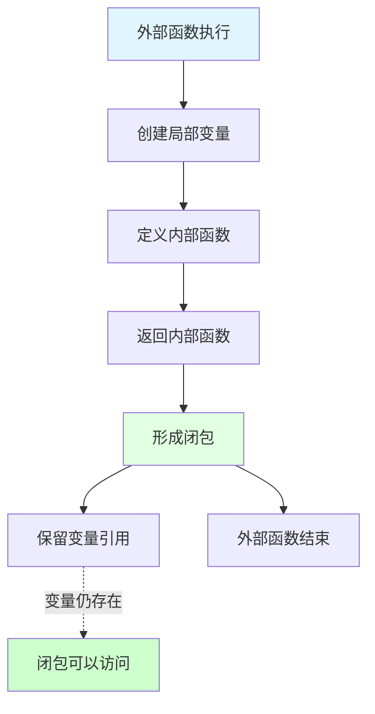
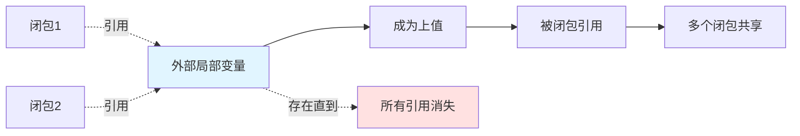
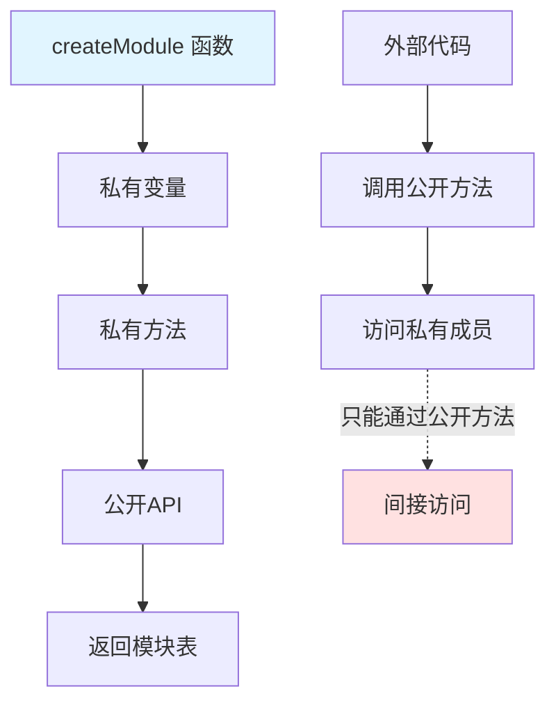
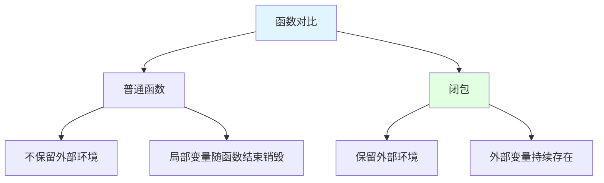
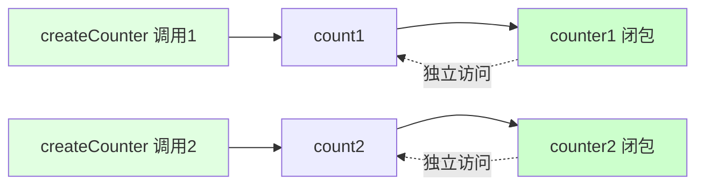
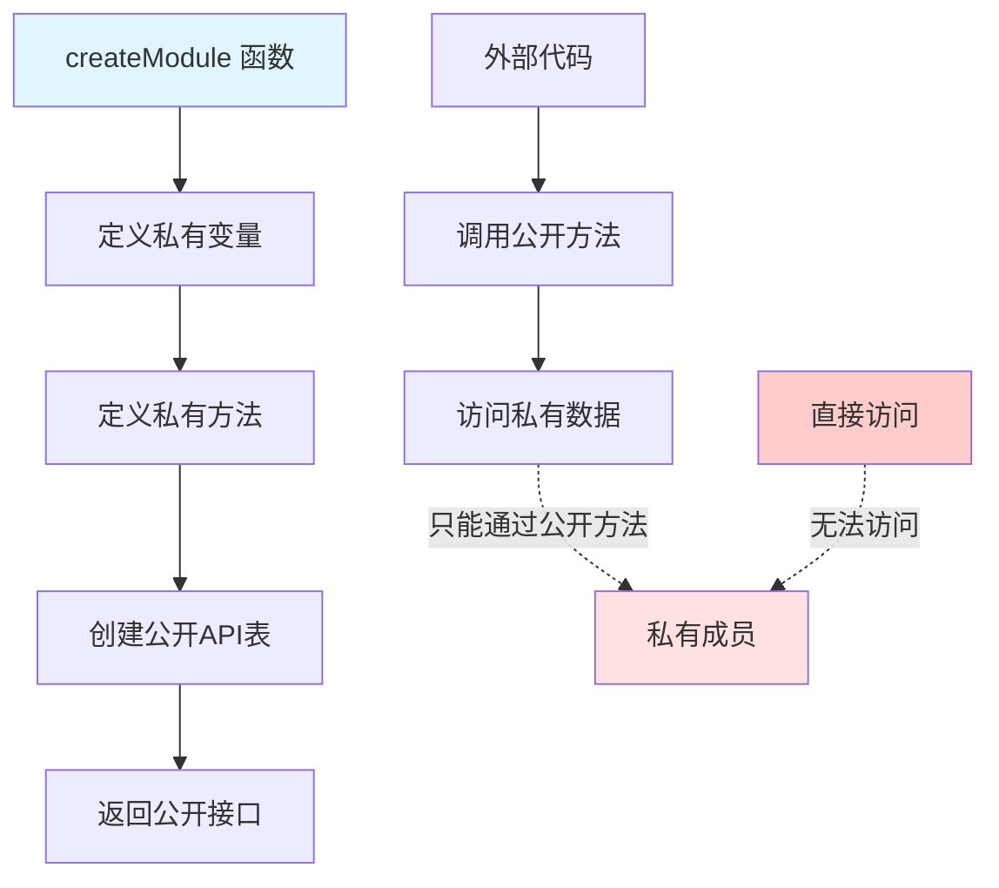
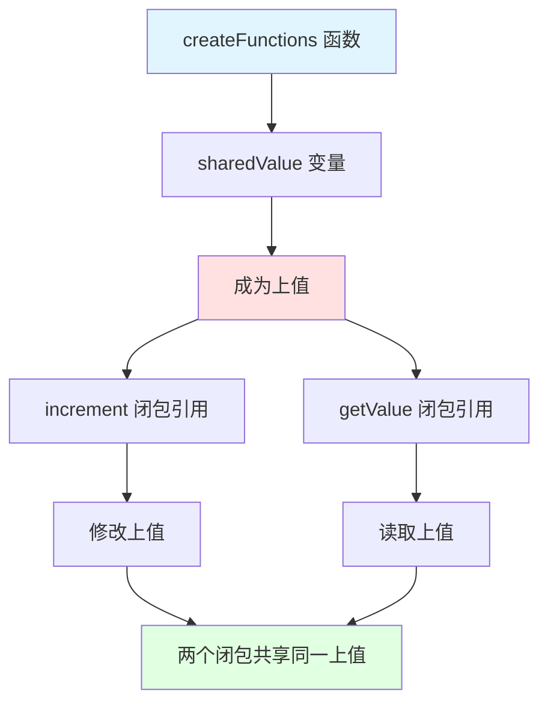
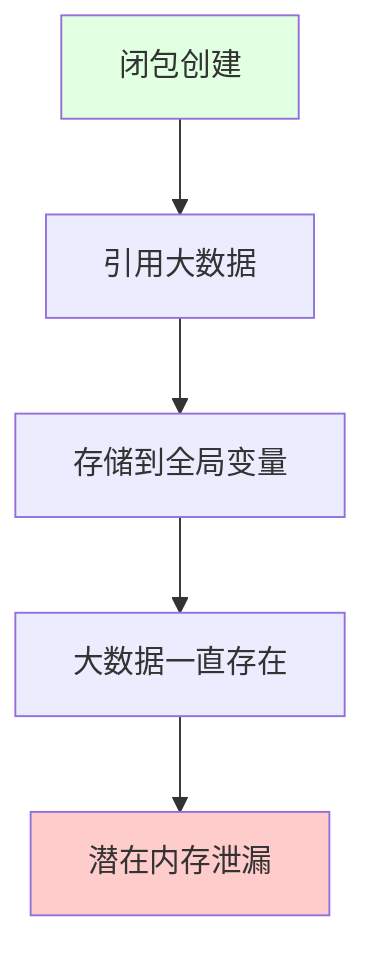

## 📊 图解

> [!info] 图示区
> 这里可以放置解释 Lua 闭包的 mermaid 图表、UML 类图或其他辅助理解的图片

### 闭包工作原理



### 上值机制



### 模块化封装



## 📖 原理

### 核心概念

**闭包**是一个函数与其能够访问的外部环境变量的组合体。

#### 🔍 闭包 vs 普通函数

| 特性 | 闭包 | 普通函数 |
|------|------|----------|
| 🧠 **环境记忆** | 可以"记住"创建时的环境 | 不保留外部环境 |
| ⏳ **生命周期** | 外部变量在函数执行完后仍存在 | 局部变量随函数结束而销毁 |
| 🔄 **独立性** | 每次创建的闭包是独立的 | 不依赖外部状态 |

#### 🎯 关键机制：上值（Upvalue）

| 概念 | 说明 |
|------|------|
| 📍 **定义** | 被内部函数引用的外部局部变量 |
| 🔗 **本质** | 对原始局部变量的引用，不是副本 |
| ⏱️ **生命周期** | 一直存在，直到没有任何闭包引用它 |

---

## 💡 面试题

### Q1：什么是Lua中的闭包，它与普通函数有什么区别？

#### 💡 闭包的定义

**闭包**是一个函数与其能够访问的外部环境变量的组合体。

当：
1. 📝 一个函数在另一个函数内部定义
2. 🔗 引用了外部函数的局部变量

就会创建一个**闭包**。

#### 🔄 与普通函数的区别



| 区别 | 普通函数 | 闭包 |
|------|----------|------|
| 🧠 **环境记忆** | ❌ 不保留 | ✅ "记住"创建时的环境 |
| ⏳ **变量生命周期** | ❌ 随函数结束 | ✅ 外部变量仍存在 |
| 🔄 **独立性** | ❌ 不依赖外部状态 | ✅ 每次创建的闭包独立 |

#### 💻 示例代码

```lua
function createCounter()
    local count = 0  -- 局部变量
    
    -- 返回的函数形成闭包，可以访问 count 变量
    return function()
        count = count + 1
        return count
    end
end

-- 创建两个独立的计数器（闭包）
counter1 = createCounter()
counter2 = createCounter()

print(counter1())  -- 1
print(counter1())  -- 2
print(counter2())  -- 1 (独立的计数)
print(counter1())  -- 3
```



> [!tip] 关键点
> 每次调用 `createCounter` 都会创建一个新的 `count` 变量，并返回一个引用这个特定 `count` 的函数。

---

### Q2：如何利用Lua闭包实现模块化的私有成员？请给出代码示例。

#### 🔐 模块化私有成员实现

Lua 闭包非常适合用于创建带有私有成员的模块。



#### 💻 完整示例代码

```lua
-- 创建一个带有私有成员的模块
local function createModule()
    -- 私有变量
    local privateData = "私有数据"
    local privateCounter = 0
    
    -- 私有方法
    local function privateFunction()
        return "这是私有函数"
    end
    
    -- 公开的 API
    local module = {}
    
    function module.incrementCounter()
        privateCounter = privateCounter + 1
        return privateCounter
    end
    
    function module.getData()
        return privateData .. " - " .. privateFunction() .. " (计数: " .. privateCounter .. ")"
    end
    
    function module.setData(newData)
        if type(newData) == "string" and #newData > 0 then
            privateData = newData
            return true
        end
        return false
    end
    
    return module
end

-- 使用模块
local myModule = createModule()
print(myModule.incrementCounter())  -- 1
print(myModule.getData())  -- 私有数据 - 这是私有函数 (计数: 1)

-- ❌ 无法直接访问私有成员
-- print(myModule.privateData)  -- nil
-- print(myModule.privateFunction())  -- error
```

#### ✅ 封装效果

| 特性 | 说明 |
|------|------|
| 🔒 **真正封装** | 私有成员只能通过公开方法访问 |
| 📋 **数据保护** | 外部代码不能直接操作私有成员 |
| 🎯 **接口清晰** | 公开明确的 API |

> [!tip] 实践建议
> 这种模式通过闭包实现了真正的封装，类似于其他语言中 `private` 修饰符的功能。

---

### Q3：请解释Lua闭包中的"上值"(upvalue)概念，以及它与闭包的关系。

#### 🎯 上值（Upvalue）概念

在 Lua 中，**"上值"**是指被内部函数引用的外部局部变量。



#### 🔗 上值与闭包的关系

| 关系 | 说明 |
|------|------|
| 1️⃣ **创建时机** | 创建引用外部局部变量的函数时，Lua 为每个变量创建上值 |
| 2️⃣ **本质** | 上值是对原始局部变量的引用，不是副本 |
| 3️⃣ **共享性** | 多个闭包引用同一变量时，它们共享同一个上值 |
| 4️⃣ **生命周期** | 上值一直存在，直到没有任何闭包引用它 |

#### 💻 示例代码

```lua
function createFunctions()
    local sharedValue = 0  -- 这将成为上值
    
    -- 两个闭包共享同一个上值
    local increment = function()
        sharedValue = sharedValue + 1
        return sharedValue
    end
    
    local getValue = function()
        return sharedValue
    end
    
    return increment, getValue
end

local inc, get = createFunctions()

print(get())  -- 0
print(inc())  -- 1
print(inc())  -- 2
print(get())  -- 2 (共享同一个上值)
```

#### 📊 上值的生命周期

```mermaid
stateDiagram-v2
    [*] --> 创建上值: 引用外部局部变量
    创建上值 --> 被引用: 至少一个闭包引用
    被引用 --> 无引用: 所有闭包都不再引用
    无引用 --> [*]: 被垃圾回收
    
    note right: 上值存在<br/>直到所有引用消失
```

> [!tip] 关键点
> 即使外部函数执行完毕，上值仍然存在，且被闭包共享。

---

### Q4：解释闭包在Lua中的内存管理机制，以及可能遇到的陷阱。

#### 🗑️ 闭包的内存管理

Lua 中闭包的内存管理依赖于其垃圾回收机制：

| 机制 | 说明 |
|------|------|
| 📊 **引用跟踪** | 闭包持有的上值会保持在内存中 |
| 🔄 **GC 回收** | 直到没有任何引用指向闭包时才回收 |

#### 💾 内存管理示例

```lua
function createLargeClosures()
    local largeData = string.rep("x", 1000000)  -- 创建大字符串
    
    local closure = function() return #largeData end
    
    return closure
end

local f = createLargeClosures()
print(f())  -- 1000000

-- 此时 largeData 仍然在内存中，因为闭包 f 引用了它
f = nil  -- 移除对闭包的引用
-- 此时 largeData 可以被垃圾回收
```

#### ⚠️ 闭包相关的内存管理陷阱

##### 陷阱 1️⃣：意外的引用持久化



**问题代码：**
```lua
function createLeakyFunction()
    local hugeData = {}
    for i = 1, 1000000 do
        hugeData[i] = string.rep("x", 100)
    end
    
    -- 返回的闭包引用了大数据结构
    return function(i) return hugeData[i] end
end

-- ⚠️ 全局引用会导致 hugeData 一直存在于内存中
globalFunction = createLeakyFunction()
```

##### 陷阱 2️⃣：循环引用

```lua
function potentialLeak()
    local t = {}
    
    -- 闭包与表 t 之间形成循环引用
    t.closure = function() return t end
    
    return t
end

local result = potentialLeak()
-- 虽然 Lua 的 GC 可以处理循环引用，但设置为 nil 可确保立即回收
result = nil
```

#### 🛡️ 避免陷阱的最佳实践

| 实践 | 说明 |
|------|------|
| 🔒 **避免全局引用** | 谨慎将闭包存储到全局变量中 |
| 📊 **及时释放** | 不再需要时显式设置为 nil |
| 🎯 **避免循环引用** | 注意闭包与数据结构间的引用关系 |
| 📉 **减少大对象捕获** | 闭包中避免捕获不必要的大对象 |

> [!tip] 实践建议
> 在处理大型数据和长期运行的应用程序时，理解这些机制对于避免内存泄漏至关重要。

---

## 🔗 相关链接

- [[Lua语言特性]] - 父主题索引
- [[Lua中点和冒号的区别]] - 相关主题：self 参数与闭包
- [[Lua实现面向对象]] - 相关主题：闭包在面向对象中的应用
