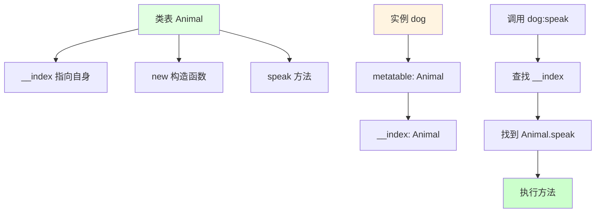
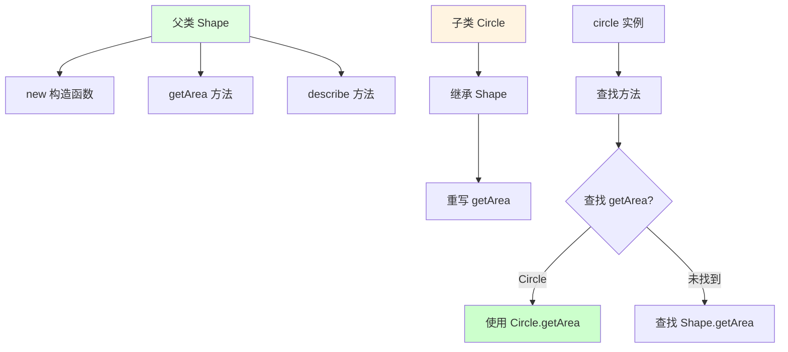
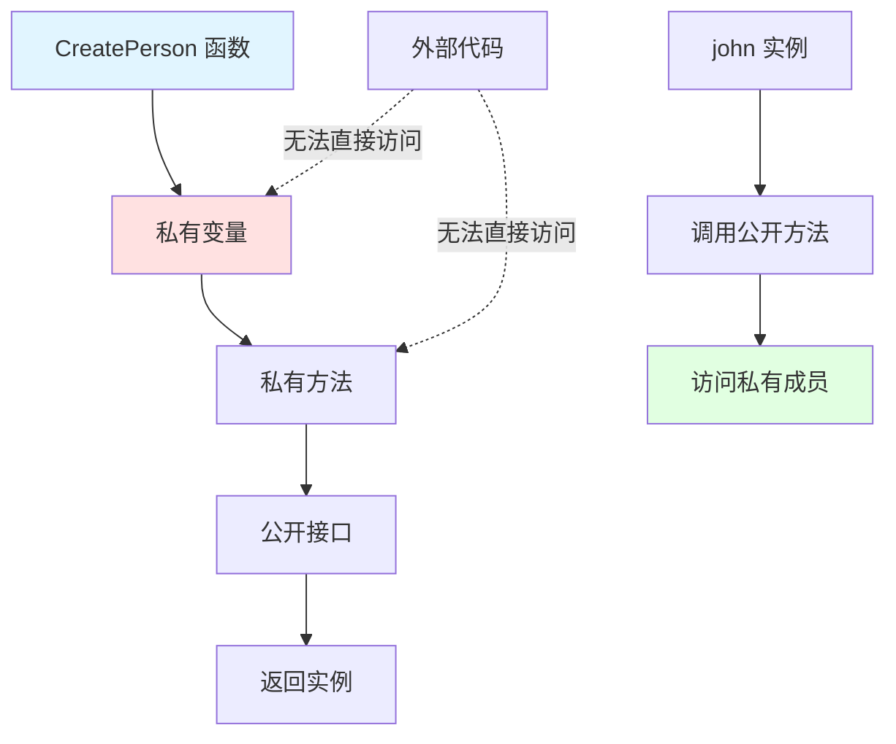
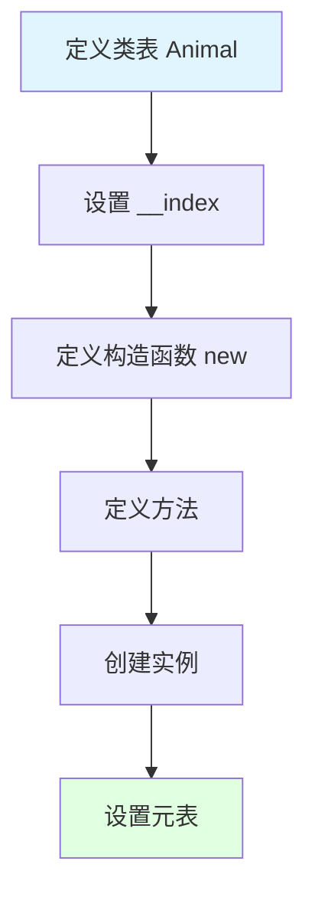
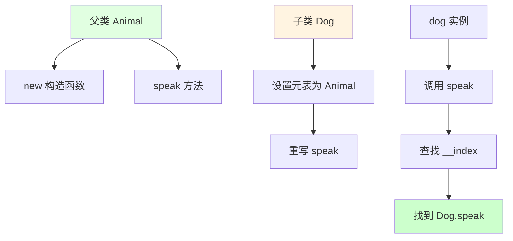
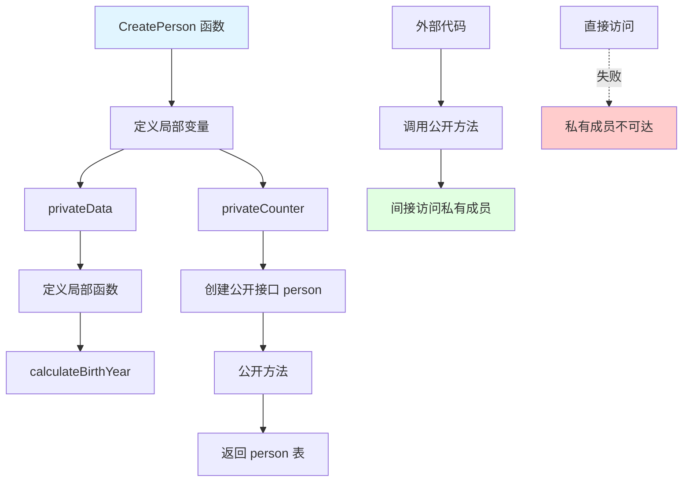
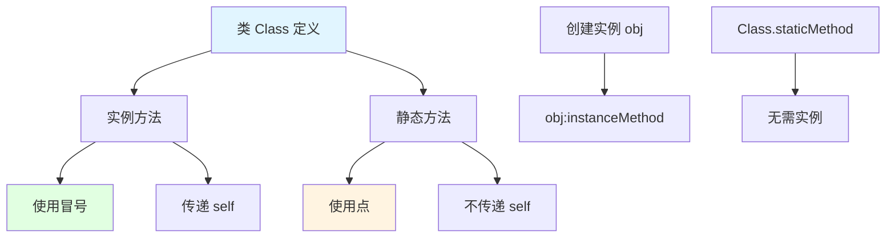

## 📊 图解

> [!info] 图示区
> 这里可以放置解释 Lua 面向对象实现的 mermaid 图表、UML 类图或其他辅助理解的图片

### 元表实现 OOP



### 继承实现



### 闭包实现私有成员



## 📖 原理

### 核心概念

Lua 通过**元表（metatable）**实现面向对象编程。

#### 🔧 实现方式

| 机制 | 作用 |
|------|------|
| 📋 **表作为类** | 使用表存储类的方法和数据 |
| 🔗 **元表关联** | 通过 setmetatable 关联元表 |
| 🎯 **__index 元方法** | 实现方法查找和继承 |
| ➕ **冒号语法糖** | 自动传递 self 参数 |

#### ⭐ OOP 特性实现

| 特性 | 实现方式 |
|------|----------|
| 🔐 **封装** | 通过闭包实现私有成员 |
| 🧬 **继承** | 通过元表 __index 链实现 |
| 🎭 **多态** | 通过方法重写实现 |
| 💭 **抽象** | 通过接口约定实现 |

---

## 💡 面试题

### Q1：请解释Lua中如何使用元表(metatable)实现面向对象，并给出一个简单的类定义和实例化示例。

#### 🎯 使用元表实现面向对象

Lua 通过元表（metatable）实现面向对象，具体步骤如下：



#### 💻 代码示例

```lua
-- 定义 Animal 类
Animal = {}  -- 创建类表
Animal.__index = Animal  -- __index 指向自身，实现方法查找

-- 构造函数
function Animal:new(name)
    local instance = {}  -- 创建实例表
    instance.name = name  -- 设置实例属性
    setmetatable(instance, self)  -- 设置元表，self 指向 Animal 表
    return instance
end

-- 定义方法
function Animal:speak()
    return self.name .. " makes a sound"
end

-- 创建实例
local dog = Animal:new("Dog")
print(dog:speak())  -- 输出: Dog makes a sound
```

#### 🔍 工作原理

| 组件 | 作用 |
|------|------|
| **类表** | 存储类的方法 |
| **__index** | 指向类表自身，实现方法查找 |
| **new 函数** | 构造函数，创建实例 |
| **setmetatable** | 关联元表，建立继承关系 |

> [!tip] 关键点
> `__index` 指向自身是关键，它使得实例能够访问类中定义的方法。

---

### Q2：如何在Lua中实现类的继承？请编写代码示例说明。

#### 🧬 实现继承

在 Lua 中实现继承主要通过设置子类的元表指向父类，并利用 **__index 链机制**。



#### 💻 完整示例代码

```lua
-- 父类 Animal
Animal = {}
Animal.__index = Animal

function Animal:new(name)
    local instance = {}
    instance.name = name
    setmetatable(instance, self)
    return instance
end

function Animal:speak()
    return self.name .. " makes a sound"
end

-- 子类 Dog 继承 Animal
Dog = {}
Dog.__index = Dog
setmetatable(Dog, Animal)  -- Dog 的元表是 Animal，实现继承

function Dog:new(name)
    -- 调用父类构造函数
    local instance = Animal:new(name)
    setmetatable(instance, self)
    return instance
end

-- 重写父类方法（多态）
function Dog:speak()
    return self.name .. " barks"
end

-- 测试
local animal = Animal:new("Generic Animal")
local dog = Dog:new("Buddy")

print(animal:speak())  -- Generic Animal makes a sound
print(dog:speak())     -- Buddy barks
```

#### 🎯 继承实现要点

| 步骤 | 说明 |
|------|------|
| 1️⃣ **创建父类和子类表** | 分别创建 Animal 和 Dog 表 |
| 2️⃣ **设置子类元表** | 子类的元表为父类，设置 __index 为子类自身 |
| 3️⃣ **方法重写** | 子类可以重写父类方法实现多态 |
| 4️⃣ **调用父类方法** | 子类可以通过 `Class.method(self)` 调用父类方法 |

#### 📊 继承的优势

| 优势 | 说明 |
|------|------|
| 🔄 **代码复用** | 子类继承父类的方法 |
| 🎭 **多态支持** | 重写父类方法 |
| 🔧 **扩展性** | 在父类基础上添加新功能 |

> [!tip] 实践建议
> 通过 __index 链机制，Lua 可以实现多层继承，支持复杂的面向对象设计。

---

### Q3：如何在Lua的面向对象实现中模拟实现私有属性和私有方法？

#### 🔐 使用闭包实现私有成员

Lua 中没有直接的访问修饰符，但可以通过**闭包和局部变量**来模拟实现私有成员。



#### 💻 完整示例代码

```lua
-- 使用闭包实现私有成员
function CreatePerson(name)
    -- 私有变量
    local privateData = {
        age = 0,
        secret = "This is private"
    }
    
    -- 私有方法
    local function calculateBirthYear()
        return os.date("%Y") - privateData.age
    end
    
    -- 公开接口/类实例
    local person = {}
    
    -- 公开方法，可以访问私有变量和方法
    function person:setAge(age)
        privateData.age = age
    end
    
    function person:getInfo()
        return {
            name = name,
            age = privateData.age,
            birthYear = calculateBirthYear()
        }
    end
    
    function person:setData(newData)
        if type(newData) == "string" and #newData > 0 then
            privateData.secret = newData
            return true
        end
        return false
    end
    
    return person
end

-- 使用示例
local john = CreatePerson("John")
john:setAge(30)
local info = john:getInfo()
print(info.name, info.age, info.birthYear)

-- ❌ 无法直接访问私有成员
-- print(john.privateData)  -- nil
-- print(john.calculateBirthYear)  -- nil
```

#### ✅ 封装效果

| 特性 | 说明 |
|------|------|
| 🔒 **真正私有** | 私有成员只能通过暴露的公开方法访问 |
| 🛡️ **数据保护** | 外部代码不能直接操作私有成员 |
| 🎯 **接口清晰** | 明确的公开 API |

> [!tip] 优势
> 这种模式通过闭包实现了真正的封装，私有数据和方法只能通过公开方法访问。

---

### Q4：在Lua中如何实现类似静态方法和类方法的功能？

#### 🔧 静态方法和类方法的实现

Lua 中可以通过不同的方式实现类似静态方法和类方法的功能：



#### 💻 完整示例代码

```lua
-- 定义类
local Class = {}
Class.__index = Class

-- 实例方法（使用冒号语法，隐式传递 self）
function Class:instanceMethod()
    return "Instance method called with name: " .. self.name
end

-- 类似静态方法（使用点语法，不传递 self）
function Class.staticMethod()
    return "Static method called"
end

-- 构造函数
function Class.new(name)
    local instance = {name = name}
    setmetatable(instance, Class)
    return instance
end

-- 使用示例

-- 调用"静态"方法
print(Class.staticMethod())  -- Static method called

-- 创建实例并调用实例方法
local obj = Class.new("Test Object")
print(obj:instanceMethod())  -- Instance method called with name: Test Object

-- 注意：静态方法也可以通过实例调用，但不会自动传递 self
print(obj.staticMethod())  -- Static method called
```

#### 📊 方法类型对比

| 类型 | 定义方式 | 调用方式 | self 参数 |
|------|----------|----------|-----------|
| **实例方法** | `function Class:method()` | `obj:method()` | ✅ 自动传递 |
| **静态方法** | `function Class.method()` | `Class.method()` | ❌ 不传递 |

#### 🎯 使用场景

| 场景 | 推荐方式 | 原因 |
|------|----------|------|
| 🏭 **工厂函数** | 静态方法 | 不需要访问实例状态 |
| 📐 **工具函数** | 静态方法 | 辅助函数，独立于实例 |
| 🎮 **实例操作** | 实例方法 | 需要访问和修改实例状态 |

> [!tip] 最佳实践
> 静态方法通常用于不需要访问实例状态的操作，比如工厂方法或辅助函数。

---

## 🔗 相关链接

- [[Lua语言特性]] - 父主题索引
- [[Lua中点和冒号的区别]] - 相关主题：self 参数与面向对象
- [[Lua实现闭包]] - 相关主题：闭包与私有成员实现
