# Lua语言特性

## 📋 来源信息

| 项目 | 内容 |
|------|------|
| **原始链接** | https://www.yuque.com/wanghao-yciao/dk58gg/lqyg25b9w9ou4u7c |
| **归档时间** | 2026-04-14 |
| **归档方式** | 语雀公开页抓取 |

## 📚 本地二级子页面索引

本主题包含以下核心知识点：

### 📖 子主题列表

| 序号 | 主题 | 说明 | 链接 |
|------|------|------|------|
| 01 | **Lua GC** | 垃圾回收机制、三色标记、分代GC | [[Lua GC]] |
| 02 | **Lua中ipairs和pairs的区别** | 表遍历机制、性能差异 | [[Lua中ipairs和pairs的区别]] |
| 03 | **Lua中点和冒号的区别** | self参数、面向对象语法糖 | [[Lua中点和冒号的区别]] |
| 04 | **Lua string底层实现** | 字符串池、不可变性、柔性数组 | [[Lua string底层实现]] |
| 05 | **Lua table底层实现** | 混合结构、重哈希、内存管理 | [[Lua table底层实现]] |
| 06 | **Lua实现闭包** | 上值、词法作用域、模块化 | [[Lua实现闭包]] |
| 07 | **Lua实现面向对象** | 元表、继承、私有成员 | [[Lua实现面向对象]] |

---

## 🎯 学习路径建议

```mermaid
graph TD
    A[Lua语言特性] --> B[Lua GC]
    A --> C[ipairs和pairs]
    A --> D[点和冒号的区别]
    A --> E[string底层实现]
    A --> F[table底层实现]
    A --> G[闭包]
    A --> H[面向对象]

    B --> B1[增量标记-清除]
    B --> B2[三色标记法]
    B --> B3[分代GC]

    C --> C1[数组遍历]
    C --> C2[全表遍历]
    C --> C3[性能差异]

    D --> D1[点操作符]
    D --> D2[冒号操作符]
    D --> D3[self参数]

    E --> E1[字符串池]
    E --> E2[不可变性]
    E --> E3[内存布局]

    F --> F1[数组+哈希混合]
    F --> F2[重哈希机制]
    F --> F3[TValue/Node]

    G --> G1[上值机制]
    G --> G2[词法作用域]
    G --> G3[模块化封装]

    H --> H1[元表机制]
    H --> H2[继承实现]
    H --> H3[私有成员]

    style A fill:#e1f5ff
    style B fill:#fff4e1
    style C fill:#fff4e1
    style D fill:#fff4e1
    style E fill:#fff4e1
    style F fill:#fff4e1
    style G fill:#fff4e1
    style H fill:#fff4e1
```

### 推荐学习顺序

1. **table和string底层** → 理解 Lua 的核心数据结构
2. **ipairs和pairs、点和冒号** → 掌握 Lua 的语法特性和最佳实践
3. **闭包和面向对象** → 学习高级编程技巧和设计模式
4. **Lua GC** → 深入理解内存管理和性能优化

---

## 💡 核心概念关联

这七个主题共同构成了 Lua 语言特性的完整知识体系：

| 主题 | 关键点 | 游戏开发应用 |
|------|--------|--------------|
| **Lua GC** | 增量回收、分代GC | 避免卡顿、内存优化 |
| **ipairs/pairs** | 表遍历、性能差异 | 性能优化、正确迭代 |
| **点/冒号** | self参数、语法糖 | 面向对象编程 |
| **string** | 字符串池、不可变性 | 内存管理、性能考虑 |
| **table** | 混合结构、重哈希 | 数据组织、性能优化 |
| **闭包** | 上值、作用域 | 模块化、状态管理 |
| **面向对象** | 元表、继承 | 代码架构、设计模式 |

> [!tip] 学习建议
> Lua 在游戏开发中常用作脚本语言，理解这些特性对于编写高效、可维护的 Lua 代码至关重要。建议重点关注 table 实现和 GC 机制，它们直接影响游戏性能。

---

## 🎮 Unity 游戏开发中的重要性

Lua 在游戏开发中有广泛应用，特别是在以下场景：

### 应用场景

| 场景 | 说明 | Lua 优势 |
|------|------|----------|
| 🔧 **热更新** | iOS 平台代码动态更新 | 无需审核即可更新 |
| 🎮 **游戏逻辑** | 配置、AI、UI 逻辑 | 快速迭代、灵活修改 |
| 🧪 **原型开发** | 快速验证游戏玩法 | 开发效率高 |
| 📦 **配置系统** | 游戏数据配置 | 易于修改、支持热更 |

### 性能关键点

在游戏开发中，需要特别注意：

| 关注点 | 优化建议 |
|--------|----------|
| ⚡ **避免频繁 GC** | 复用 table、使用对象池 |
| 📊 **table 性能** | 合理使用数组和哈希部分 |
| 🔁 **字符串操作** | 减少字符串拼接、利用字符串池 |
| 💾 **内存管理** | 及时释放引用、避免循环引用 |

---

## 🔗 相关链接

- [[游戏客户端面试题]] - 返回上级目录
