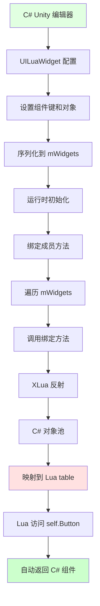
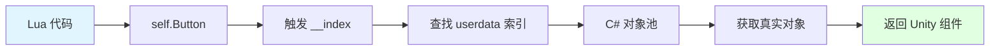
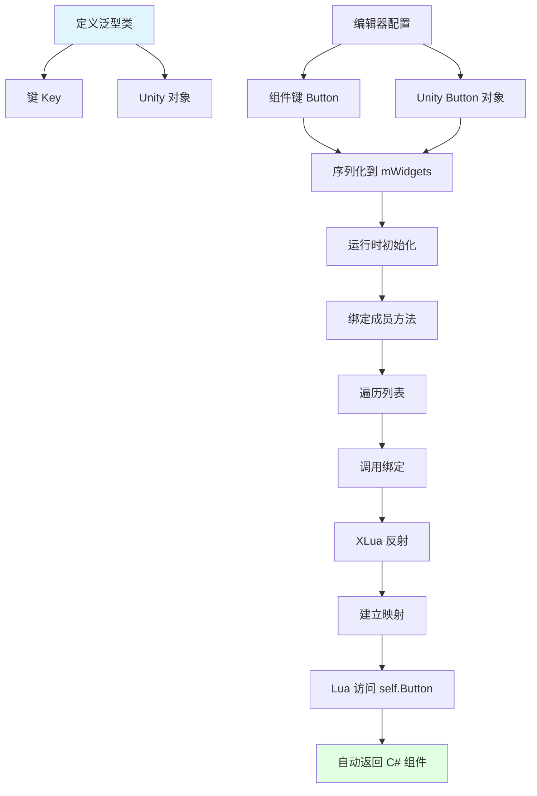
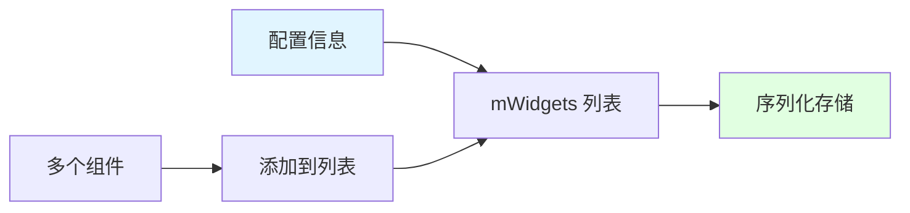
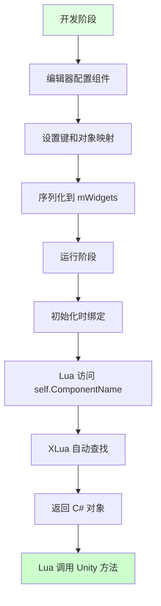

## 📊 图解

> [!info] 图示区
> 这里可以放置解释 Lua 获取节点信息的 mermaid 图表、UML 类图或其他辅助理解的图片

### 组件绑定流程



### 对象映射机制



## 📖 原理

### 核心概念

利用 **XLua 提供的跨语言绑定机制**，把 C# 中的 Unity 组件自动映射到 Lua 层。

#### 🎯 实现思路

1. **定义泛型类**：包含键和对应的 Unity 对象
2. **编辑器配置**：在 UILuaWidget 上配置组件
3. **序列化存储**：配置信息序列化到 mWidgets 列表
4. **运行时绑定**：自动绑定成员方法完成映射

#### ⚙️ XLua 反射机制

| 机制 | 作用 |
|------|------|
| 🔍 **反射获取类型** | 通过反射获取 C# 对象的类型信息 |
| 🔗 **建立映射** | 建立 Lua 和 C# 之间的映射关系 |
| 🤖 **自动代理** | 通过代理机制自动返回对应的 C# Unity 组件 |

---

## 💡 面试题

### Q：Lua层如何获取到节点的信息？

#### 🎯 实现思路

我们的实现思路是利用 **XLua 提供的跨语言绑定机制**，把 C# 中的 Unity 组件自动映射到 Lua 层。



#### 🔧 具体实现步骤

##### 步骤 1️⃣：定义泛型类

```csharp
// 泛型类，包含键和对应的 Unity 对象
public class WidgetMapping<TKey, TValue>
{
    public TKey key;
    public TValue unityObject;
}
```

##### 步骤 2️⃣：编辑器配置

在编辑器中为每个组件配置：

| 配置项 | 说明 |
|--------|------|
| 🔑 **键** | Lua 中访问的标识符（如 "Button"） |
| 🎮 **Unity 对象** | 关联的 Unity 组件引用 |

##### 步骤 3️⃣：序列化存储



##### 步骤 4️⃣：运行时绑定

**UILuaWidget 初始化流程：**

1. 📋 调用绑定成员的方法
2. 🔁 遍历 mWidgets 列表
3. 🔗 为每个 widget 调用绑定方法
4. 🎯 将 C# 对象绑定到 Lua 环境中的 table 上

##### 步骤 5️⃣：XLua 反射映射

**XLua 通过反射获取 C# 对象的类型信息：**

| 操作 | 说明 |
|------|------|
| 🔍 **反射类型** | 获取对象的类型信息 |
| 📋 **建立映射** | 创建 Lua 和 C# 之间的映射关系 |
| 🤖 **自动返回** | Lua 访问时自动返回对应的 C# 对象 |

#### ✨ 使用方式

**在 Lua 中访问 Unity 组件：**

```lua
-- Lua 代码
function UILuaWidget:OnButtonClick()
    -- 直接访问 self.Button，XLua 会自动返回对应的 C# Button 组件
    self.Button:SetActive(false)
    
    -- 访问其他组件
    self.Image.sprite = someSprite
    self.Text.text = "Hello"
end
```

**无需手动转换，XLua 自动处理：**

```lua
-- ❌ 不需要这样手动转换
local button = self:GetButton()  -- 手动获取
button:SetActive(false)

-- ✅ 直接访问即可
self.Button:SetActive(false)  -- 自动映射
```

#### 🎯 优势

| 优势 | 说明 |
|------|------|
| ✅ **自动化** | 编辑器配置后，运行时自动完成绑定 |
| ⚡ **透明访问** | Lua 代码直接访问，无需关心底层实现 |
| 🔧 **类型安全** | 通过 XLua 的类型系统保证类型安全 |
| 🎮 **开发效率** | 配置一次，即可在 Lua 中使用 |

#### 📊 工作流程总结



> [!tip] 实践建议
> - 在编辑器中合理配置组件键名，使用有意义的命名
> - 避免配置过多不必要的组件，增加内存开销
> - 确保组件引用正确，避免空引用异常

---

## 🔗 相关链接

- [[C#和Lua交互]] - 父主题索引
- [[XLua是如何通过反射与Lua层进行交互]] - 相关主题：反射交互详解
- [[XLua性能优化]] - 相关主题：性能优化策略
