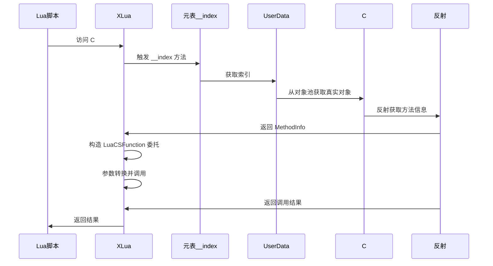
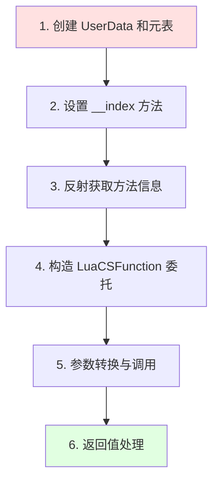
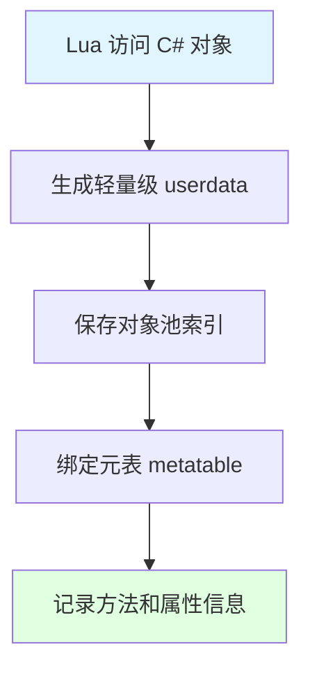
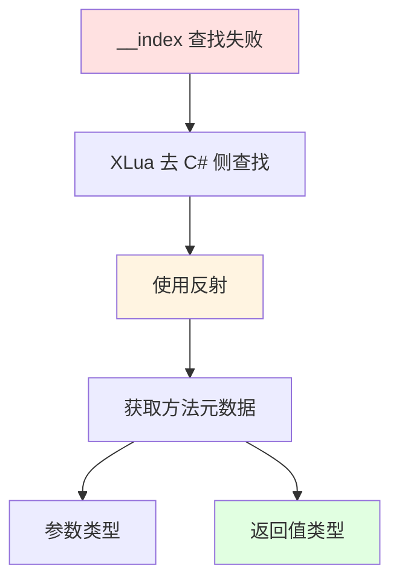
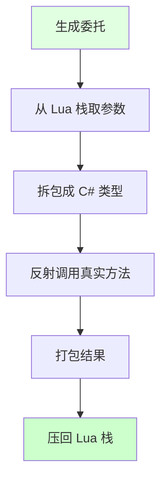
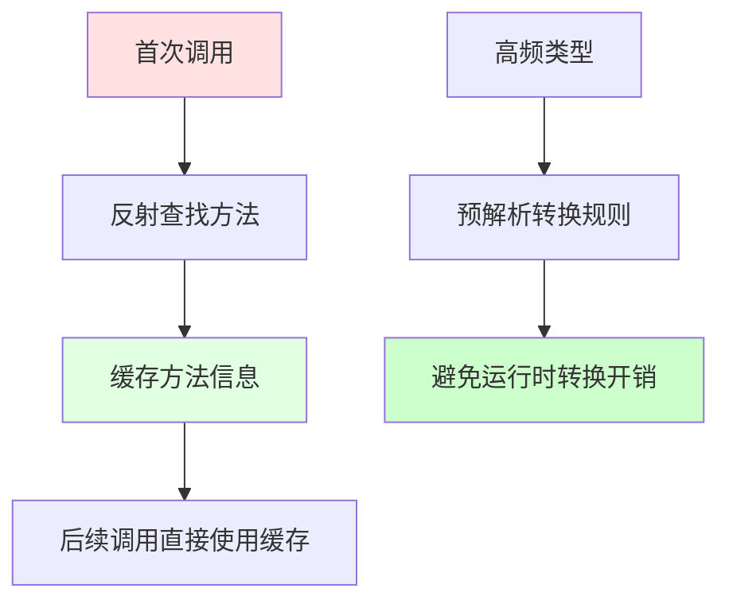

## 📊 图解

> [!info] 图示区
> 这里可以放置解释 XLua 反射机制的 mermaid 图表、UML 类图或其他辅助理解的图片

### XLua 反射交互流程



### 数据类型转换


## 📖 原理

### 核心概念

XLua 中，C# 对象通过**反射机制**暴露给 Lua 层。

#### 🔍 六步反射交互流程



| 步骤 | 操作 | 说明 |
|------|------|------|
| 1️⃣ | **创建 UserData** | 为 C# 对象创建轻量级 userdata，保存对象池索引 |
| 2️⃣ | **设置元表** | 为 userdata 设置元表，记录可调用的方法和属性 |
| 3️⃣ | **反射获取方法** | 从 C# 侧获取方法的元数据 |
| 4️⃣ | **构造委托** | 将 MethodInfo 封装为 LuaCSFunction 委托 |
| 5️⃣ | **参数转换** | Lua 栈参数转换为 C# 方法所需类型 |
| 6️⃣ | **返回值处理** | 返回值转换为 Lua 类型并压入栈 |

---

## 💡 面试题

### Q：XLua 是如何通过反射与 Lua 层进行交互的？

#### 🎯 六步反射交互机制详解

##### 步骤 1️⃣：创建 UserData 和元表

当 Lua 第一次访问 C# 对象时：



**特点：**
- 📦 userdata 仅保存对象在 C# 侧对象池的索引
- 🔗 元表记录了这个对象能调用的方法和属性
- 💡 元表告诉 Lua 该如何操作这个对象

##### 步骤 2️⃣：设置 __index 方法

当 Lua 代码调用 `obj:Method()` 时：

| 操作 | 说明 |
|------|------|
| 🎯 **触发元表** | 元表的 `__index` 方法会被触发 |
| 🔍 **查找对象** | XLua 通过 userdata 里的索引号从对象池查找真实的 C# 对象 |
| 🎮 **自动转发** | 将调用转发到真实的 C# 对象 |

##### 步骤 3️⃣：反射获取方法信息

如果元表的 `__index` 方法没找到该方法：



反射获取的信息包括：
- 📋 参数类型
- 📤 返回值类型
- 🏷️ 方法签名

##### 步骤 4️⃣：构造 LuaCSFunction 委托

拿到方法信息后，XLua 会生成一个 **LuaCSFunction 委托**：



**委托的工作流程：**
- 📥 从 Lua 栈上取出参数
- 🔄 拆包成 C# 需要的类型
- ⚡ 调用真实的 C# 方法
- 📦 将结果打包成 Lua 能理解的类型

#### ⚡ 优化：缓存与预转换

为了避免每次调用都调用反射查找，XLua 做了两个关键优化：

| 优化 | 说明 | 效果 |
|------|------|------|
| 💾 **方法缓存** | 第一次反射做预缓存 | 反射开销从 O(n) 降到 O(1) |
| 🔄 **参数预解析** | 对高频类型（int、string）提前写好转换规则 | 避免每次拆箱装箱 |



#### 💥 实战踩坑案例

**问题描述：**
我们之前有个战斗技能系统，Lua 频繁调用 Vector3 运算导致 GC 飙高。

**原因分析：**
- 🔍 每次反射都会触发值类型的装箱拆箱
- 📦 频繁创建临时对象增加 GC 压力

**解决方案：**
- ✅ 使用 `[GCOptimize]` 标记 Vector3
- 🎯 让 XLua 生成拆解为 float 传递的代码
- 📉 GC Alloc 直接清零

```csharp
// 使用 GCOptimize 标记
[GCOptimize]
public struct Vector3
{
    public float x;
    public float y;
    public float z;
}
```

#### 📊 核心设计哲学

XLua 通过以下机制实现跨语言交互：

| 机制 | 说明 |
|------|------|
| 🎭 **元表映射** | 通过元表实现 Lua 到 C# 的查找 |
| 🔄 **反射动态绑定** | 运行时动态查找和调用 |
| 📦 **委托代理** | 使用委托包装方法调用 |
| 💾 **缓存优化** | 缓存反射结果，提升性能 |

> [!tip] 性能建议
> - 对高频调用方法使用代码生成避免反射
> - 对值类型使用 [GCOptimize] 优化
> - 监控反射调用，识别性能热点

---

## 🔗 相关链接

- [[C#和Lua交互]] - 父主题索引
- [[Lua层如何获取到节点的信息]] - 相关主题：组件绑定机制
- [[XLua性能优化]] - 相关主题：性能优化策略
