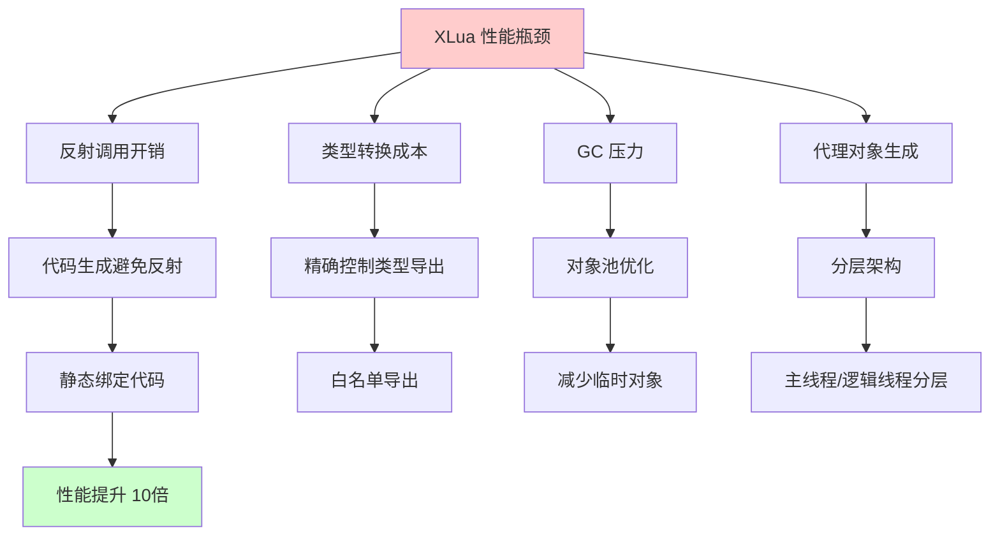
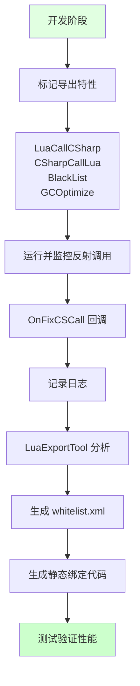
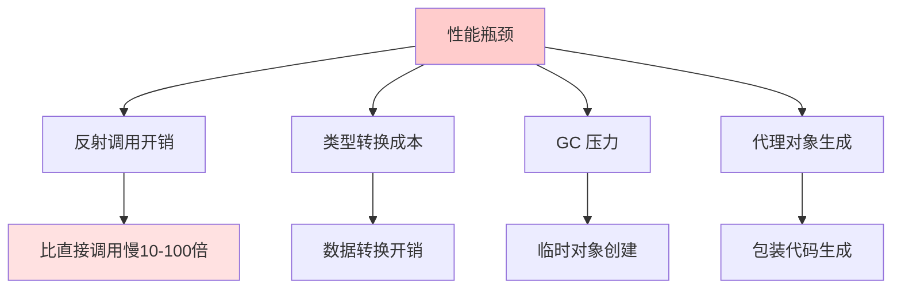
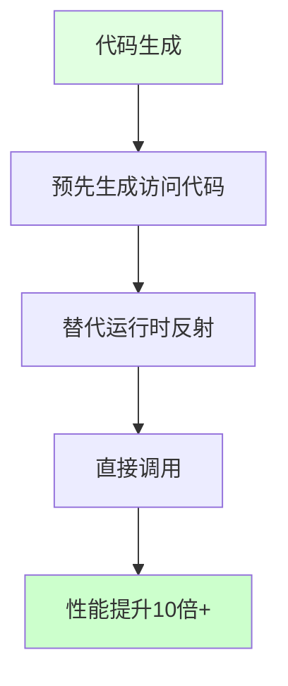
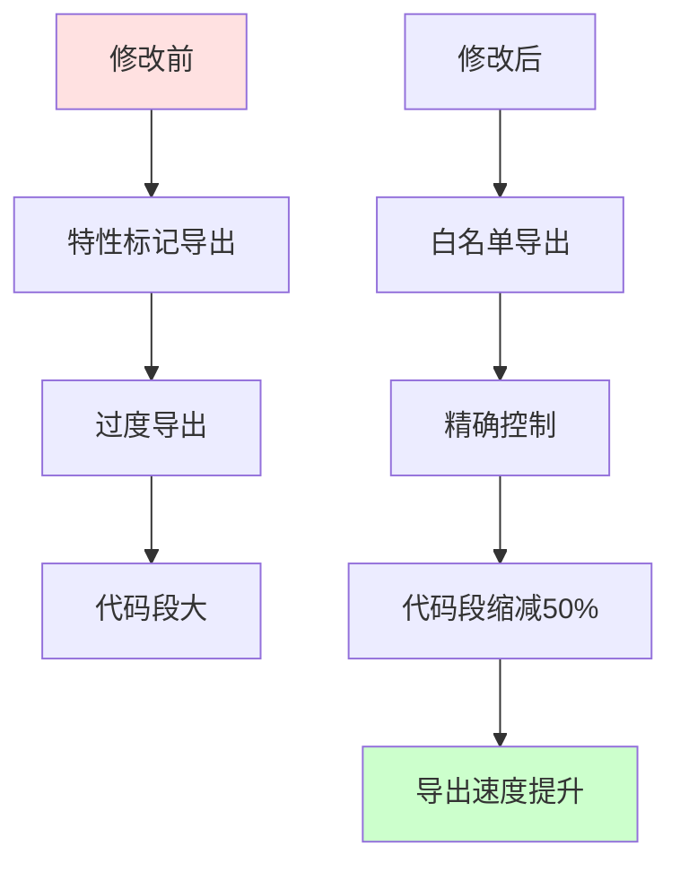
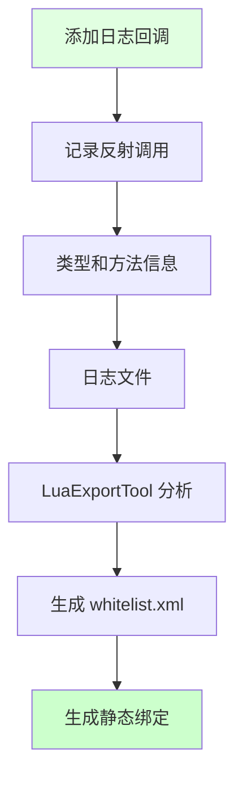
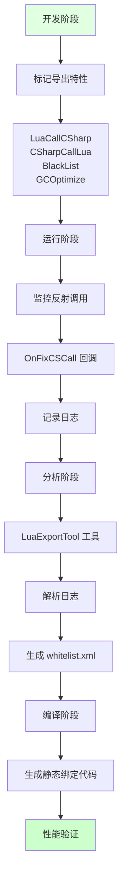

## 📊 图解

> [!info] 图示区
> 这里可以放置解释 XLua 性能优化的 mermaid 图表、UML 类图或其他辅助理解的图片

### 性能优化策略



### 优化流程



## 📖 原理

### 核心概念

XLua 的反射机制虽然提供了灵活的脚本扩展能力，但也带来了一定的性能开销。

#### ⚠️ 性能瓶颈来源

| 问题 | 影响 | 性能损失 |
|------|------|----------|
| 🔍 **反射调用开销** | 动态调用机制 | 比**直接方法调用慢 10-100 倍** |
| 🔄 **类型转换成本** | C# 和 Lua 数据类型之间转换 | 需要额外处理时间 |
| 💾 **GC 压力** | 频繁创建临时对象 | 导致游戏卡顿 |
| 🤖 **代理对象生成** | 生成大量包装代码 | 内存和 CPU 开销 |

---

## 💡 面试题

### Q：在 XLua 中，通过反射和代理机制将 C# 对象暴露给 Lua，会不会引入性能瓶颈？你们是如何优化性能的？

#### ⚡ 性能瓶颈分析

XLua 的反射机制确实会带来显著的性能瓶颈：



#### 🚀 多层优化策略

##### 策略 1️⃣：代码生成（避免反射）



**优势：**
- ⚡ 避免运行时反射查找
- 🎯 编译时类型检查
- 📈 性能提升可达 **10 倍以上**

##### 策略 2️⃣：精确控制类型导出

**导出控制：**

| 导出方式 | 说明 |
|----------|------|
| ✅ **LuaCallCSharp** | Lua 可以访问的类型 |
| 🔄 **CSharpCallLua** | 可被 Lua 动态调用的委托、接口 |
| 🚫 **XLua.BlackList** | 排除不被导出的类型或方法 |
| ⚡ **GCOptimize** | 减少装箱/拆箱的特殊优化 |

**配置示例：**

```csharp
[LuaCallCSharp]
public class Vector3 { }

[CSharpCallLua]
public delegate void ActionCallback();

[XLua.BlackList]
public class InternalHelper { }

[GCOptimize]
public struct OptimizedType { }
```

##### 策略 3️⃣：分层架构

| 层级 | 职责 | 示例 |
|------|------|------|
| 🎮 **主线程** | UI 渲染、用户输入 | 高性能要求 |
| 🧮 **逻辑线程** | 游戏逻辑计算 | 可接受反射开销 |

##### 策略 4️⃣：修改 attribute 收集为 whitelist 导出

**重大改进：**

| 改进项 | 效果 |
|--------|------|
| ✅ **精确控制导出** | 明确定义每个函数或符号是否需要导出 |
| 📉 **代码段缩减近 50%** | 大幅提高导出速度 |
| 🎯 **支持泛型导出** | 扩展导出能力 |



##### 策略 5️⃣：监控反射和穿透

**反射日志回调：**

```csharp
private static void OnFixCSCall(
    Type inType, 
    string inStrFunctionName, 
    int inCat
)
{
    DoPrintRefelction(
        "OnFixCSCall: {0} type:{1}, inCat:{2}\n{3}",
        inStrFunctionName,
        inType.FullName,
        inCat,
        GetCurLuaStackStr()
    );
}
```

**工作流程：**



#### 🎯 完整优化流程



**流程详解：**

| 阶段 | 操作 | 工具/机制 |
|------|------|----------|
| 🛠️ **开发** | 标记可能被访问的类型 | `[LuaCallCSharp]` 等特性标记 |
| 🔍 **运行** | 监控反射调用 | `OnFixCSCall` 回调记录日志 |
| 📊 **分析** | 分析日志生成白名单 | LuaExportTool 解析日志模式 |
| ⚡ **编译** | 生成静态绑定代码 | 根据白名单生成直接调用代码 |
| ✅ **验证** | 测试性能提升 | Profiler 验证优化效果 |

#### 📊 优化效果

| 优化手段 | 性能提升 |
|----------|----------|
| 🎯 **代码生成** | **10 倍以上**（针对频繁调用的方法） |
| 📋 **白名单导出** | 代码段缩减 **50%**，导出速度提升 |
| ⚡ **GCOptimize** | GC Alloc 清零 |
| 🔧 **分层架构** | 主线程负担减少 |

#### ✨ 设计哲学

XLua 的核心设计哲学：

| 哲学 | 说明 |
|------|------|
| 🎭 **动静结合** | 高频调用预生成代码（静态绑定），低频调用保留反射（动态灵活） |
| 💾 **缓存为王** | 方法缓存让反射开销从 O(n) 降到 O(1) |
| 🎯 **类型特化** | 对 Vector3 等 Unity 高频类型做特殊优化 |

#### 💼 实践建议

| 建议 | 说明 |
|------|------|
| 🎮 **热点路径** | 对战斗逻辑等热点代码使用静态绑定 |
| 🔍 **监控分析** | 使用 Profiler 识别反射热点 |
| 📋 **定期审查** | 定期审查导出白名单，移除不必要的导出 |
| ⚡ **GC 监控** | 监控 GC Alloc，及时优化 |

> [!tip] 总结
> 通过这套机制，我们成功将大多数反射调用转换为直接调用，在保持开发灵活性的同时显著提升了运行时性能，实现了 Lua 脚本灵活性和 C# 执行效率的良好平衡。

---

## 🔗 相关链接

- [[C#和Lua交互]] - 父主题索引
- [[XLua是如何通过反射与Lua层进行交互]] - 相关主题：反射机制详解
- [[Lua和C#异步交互]] - 相关主题：异步调用处理
