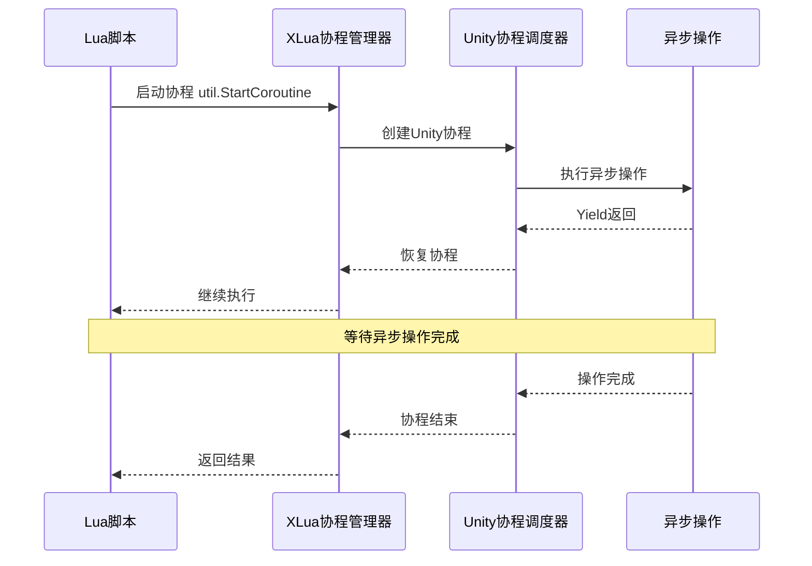
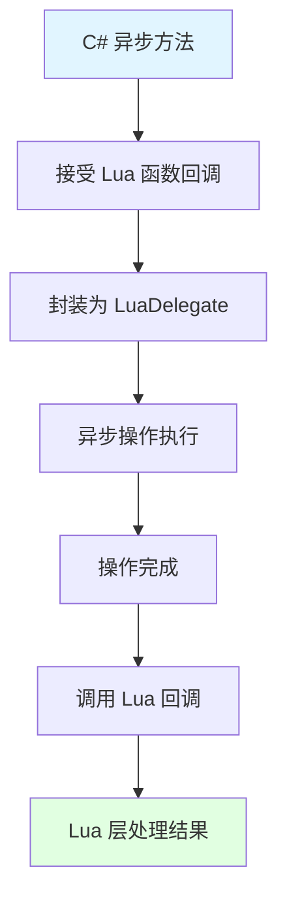
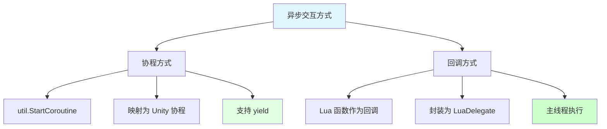
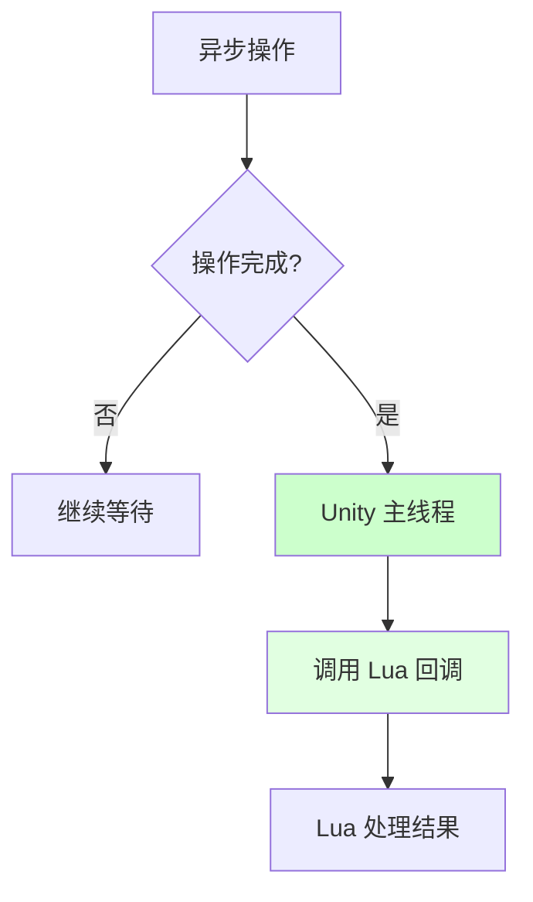

## 📊 图解

> [!info] 图示区
> 这里可以放置解释 Lua 和 C# 异步交互的 mermaid 图表、UML 类图或其他辅助理解的图片

### 协程交互流程



### 回调机制



## 📖 原理

### 核心概念

Lua 和 C# 的异步交互主要通过**协程和回调机制**实现，确保在多线程环境下正确交互。

#### ⚙️ 异步交互机制

| 机制 | 说明 |
|------|------|
| 🔄 **协程适配** | Lua 协程通过 XLua 适配器映射为 Unity 协程 |
| 📞 **回调代理** | Lua 函数可作为回调传递给 C# 异步方法 |
| 🔀 **线程安全** | 确保回调在主线程执行，避免跨线程问题 |
| ⏳ **等待机制** | 支持 yield 等待异步操作完成 |

#### 🎯 关键特性

| 特性 | 实现方式 |
|------|----------|
| 🔀 **协程映射** | `util.StartCoroutine` 将 Lua 函数包装为 Unity 协程 |
| 📞 **Lua 回调** | C# 通过 delegate 接受 Lua 函数作为回调 |
| 🛡️ **线程安全** | 使用 `MainThreadDispatch` 确保回调在主线程执行 |
| ⏱️ **Yield 等待** | 支持 `yield return` 等待异步操作 |

---

## 💡 面试题

### Q：Lua和C#如何实现异步交互？回调函数在哪个线程执行？

#### 🎯 异步交互实现方式

Lua 和 C# 的异步交互主要通过**协程和回调机制**实现，需要特别注意线程安全问题。



#### 📋 方式 1️⃣：协程交互

**Lua 启动 Unity 协程：**

```lua
-- Lua 代码
local util = require "xlua.util"

-- 定义协程函数
local function asyncOperation()
    print("协程开始")

    -- 模拟异步操作
    coroutine.yield(CS.UnityEngine.WaitForSeconds(2))

    print("2秒后继续执行")

    -- 返回结果
    return "操作完成"
end

-- 启动协程
util.StartCoroutine(asyncOperation)
```

**工作流程：**

| 步骤 | 操作 |
|------|------|
| 1️⃣ | Lua 定义协程函数 |
| 2️⃣ | 使用 `util.StartCoroutine` 包装为 Unity 协程 |
| 3️⃣ | Unity 协程调度器管理执行 |
| 4️⃣ | 支持 `yield` 等待异步操作 |

#### 📋 方式 2️⃣：回调机制

**C# 定义异步方法接受 Lua 回调：**

```csharp
// C# 代码
public class AsyncManager
{
    // 接受 Lua 函数作为回调
    public void LoadAssetAsync(string path, Action<string> onComplete)
    {
        // 模拟异步加载
        StartCoroutine(DoLoadAsset(path, onComplete));
    }

    private IEnumerator DoLoadAsset(string path, Action<string> callback)
    {
        // 异步操作
        yield return new WaitForSeconds(1);

        // 在主线程调用回调
        callback?.Invoke("Asset loaded: " + path);
    }
}
```

**Lua 传递回调函数：**

```lua
-- Lua 代码
local asyncMgr = CS.AsyncManager()

-- 传递 Lua 函数作为回调
asyncMgr:LoadAssetAsync("Assets/Prefab.prefab", function(result)
    -- 回调在主线程执行
    print("加载完成: " .. result)
end)
```

#### 🛡️ 线程安全保证

| 机制 | 说明 |
|------|------|
| 🎯 **主线程执行** | 回调确保在 Unity 主线程执行 |
| 🔀 **协程调度** | Unity 协程调度器保证在主帧执行 |
| 🚫 **避免跨线程** | 不允许在工作线程直接调用 Lua |



> [!tip] 关键点
> 所有 Lua 回调都在 Unity 主线程执行，确保线程安全。

#### 💼 实战案例：网络请求异步处理

**问题场景：**
游戏需要从服务器下载玩家数据，并在 Lua 中处理结果。

**实现方案：**

```lua
-- Lua 代码
local function downloadPlayerData(playerId)
    -- 定义回调函数
    local function onSuccess(data)
        -- 回调在主线程执行，可以安全操作 Unity 对象
        print("数据下载成功")
        UpdateUI(data)
    end

    local function onError(error)
        print("下载失败: " .. error)
    end

    -- 启动异步下载
    NetworkManager:DownloadAsync(playerId, onSuccess, onError)
end

-- 调用
downloadPlayerData(12345)
```

```csharp
// C# 代码
public class NetworkManager
{
    public void DownloadAsync(int playerId, Action<string> onSuccess, Action<string> onError)
    {
        StartCoroutine(DoDownload(playerId, onSuccess, onError));
    }

    private IEnumerator DoDownload(int playerId, Action<string> success, Action<string> error)
    {
        // 使用 UnityWebRequest
        using (var webRequest = UnityWebRequest.Get("api/player/" + playerId))
        {
            yield return webRequest.SendWebRequest();

            // 在主线程调用回调
            if (webRequest.result == UnityWebRequest.Result.Success)
            {
                success?.Invoke(webRequest.downloadHandler.text);
            }
            else
            {
                error?.Invoke(webRequest.error);
            }
        }
    }
}
```

#### 📊 异步交互最佳实践

| 实践 | 说明 |
|------|------|
| ✅ **使用协程** | 适合需要等待的操作，如动画、网络请求 |
| ✅ **回调机制** | 适合事件驱动的异步操作 |
| ✅ **主线程保证** | 所有 UI 操作在主线程执行 |
| ❌ **避免阻塞** | 不要在 Lua 中使用死循环等待 |

#### 🎯 协程 vs 回调对比

| 特性 | 协程 | 回调 |
|------|------|------|
| **代码结构** | 线性，易读 | 嵌套，可能形成回调地狱 |
| **适用场景** | 有明确等待步骤的操作 | 事件驱动、一次性操作 |
| **返回值** | 可以直接返回 | 通过回调参数传递 |
| **错误处理** | 使用 try-catch | 需要在回调中检查 |

> [!tip] 选择建议
> - 对于连续的异步操作流程，优先使用协程
> - 对于事件驱动的单次操作，使用回调更简洁

---

## 🔗 相关链接

- [[C#和Lua交互]] - 父主题索引
- [[XLua性能优化]] - 相关主题：异步操作性能优化
- [[Lua实现闭包]] - 相关主题：闭包与回调机制
