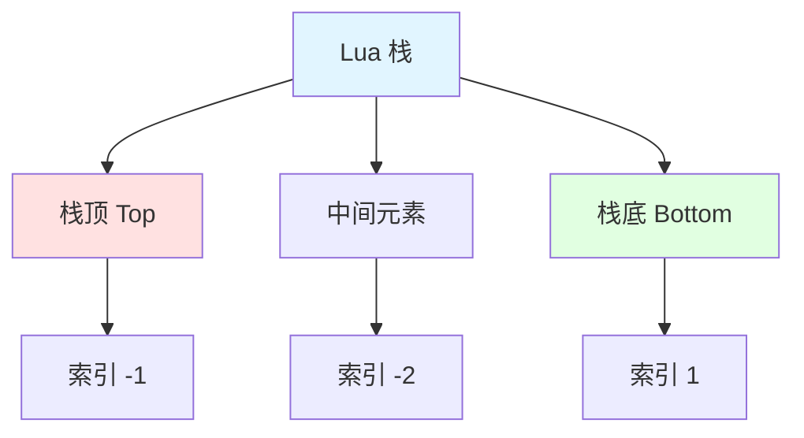
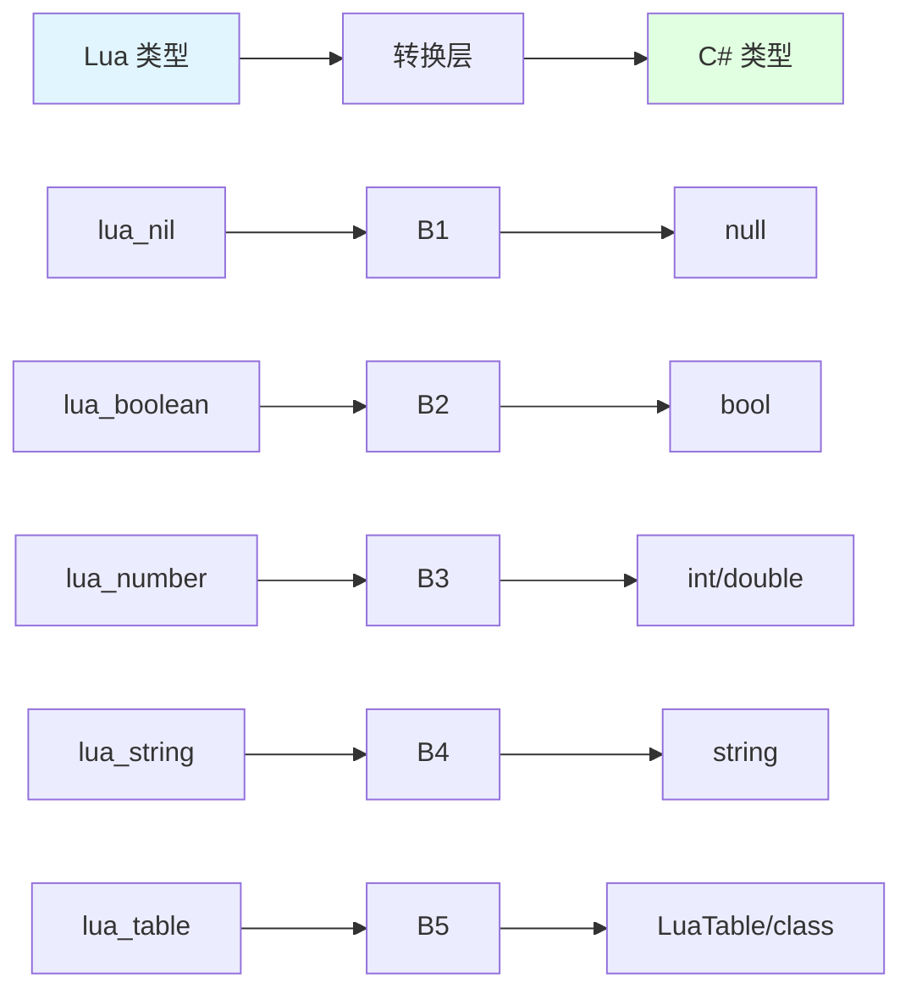
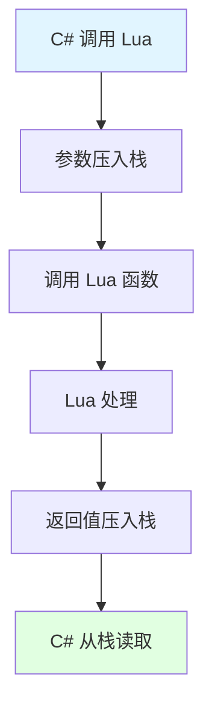
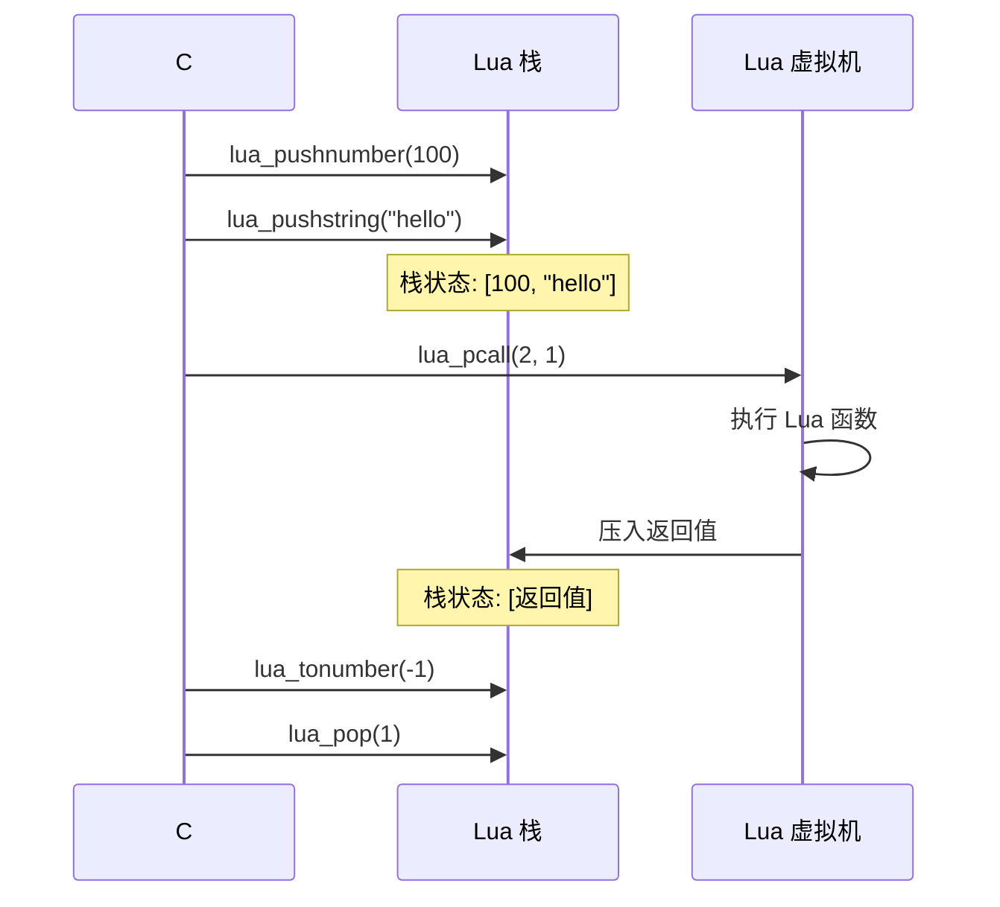
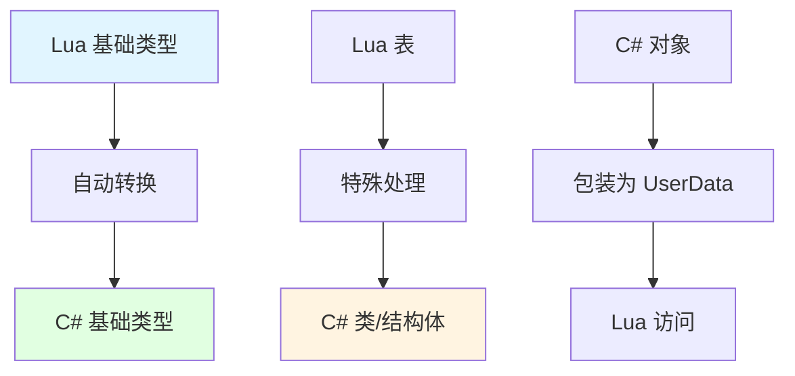
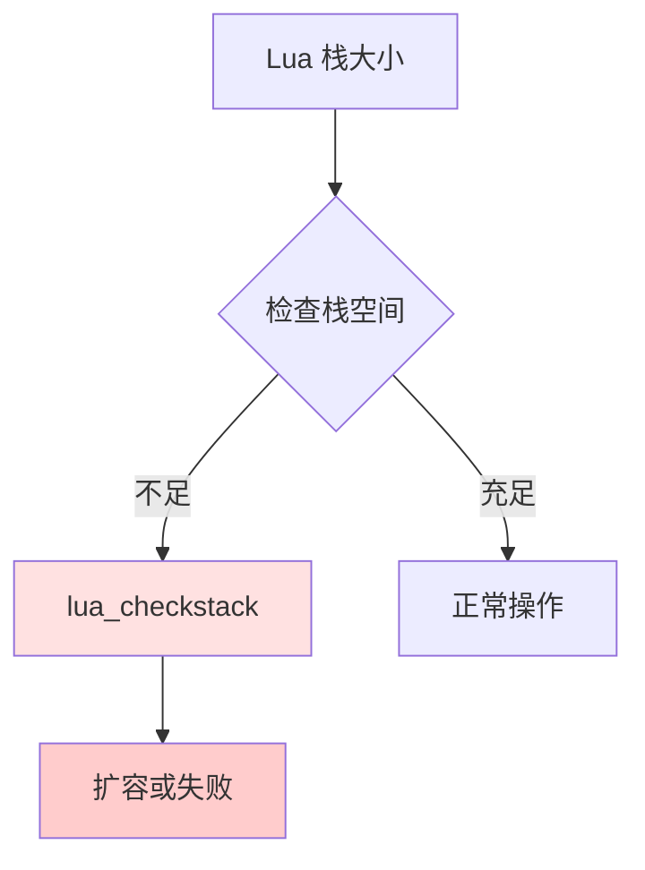

## 📊 图解

> [!info] 图示区
> 这里可以放置解释 Lua 和 C# 数据交互原理的 mermaid 图表、UML 类图或其他辅助理解的图片

### Lua 栈结构



### 数据类型转换



## 📖 原理

### 核心概念

Lua 和 C# 之间的数据交互通过**Lua 栈**实现，使用 P/Invoke 调用 Lua C API。

#### 🎯 Lua 栈机制

| 特性 | 说明 |
|------|------|
| 📊 **虚拟栈** | Lua 和 C# 之间的数据交换桥梁 |
| 🔢 **双向索引** | 正索引从 1 开始，负索引从 -1 开始 |
| ⚡ **LIFO 原则** | 后进先出，类似数据结构中的栈 |
| 🔄 **自动管理** | 栈空间由 Lua 管理，自动回收 |

#### 🏗️ 核心 API 函数

| 函数 | 功能 |
|------|------|
| `lua_gettop` | 获取栈顶元素索引（栈大小） |
| `lua_settop` | 设置栈顶位置 |
| `lua_push*` | 将值压入栈 |
| `lua_to*` | 从栈获取值 |
| `lua_pop` | 弹出栈元素 |

---

## 💡 面试题

### Q1：Lua和C#之间的数据是如何通过栈进行交互的？

#### 🎯 Lua 栈交互原理

Lua 和 C# 之间的数据交互完全通过**Lua 虚拟栈**实现，这是两种语言之间唯一的通信桥梁。



#### 📊 栈的工作原理

**栈结构示意：**

```
Lua 栈示意图：
┌─────────────────────────┐
│  栈顶 (Top, 索引 -1)   │ ← 最新压入的数据
├─────────────────────────┤
│  元素 2 (索引 -2)      │
├─────────────────────────┤
│  元素 3 (索引 -3)      │
├─────────────────────────┤
│  ...                   │
├─────────────────────────┤
│  栈底 (Bottom, 索引 1) │ ← 最先压入的数据
└─────────────────────────┘
```

**双向索引：**

| 索引类型 | 说明 | 示例 |
|---------|------|------|
| **正索引** | 从栈底开始计数，从 1 开始 | 1, 2, 3... |
| **负索引** | 从栈顶开始计数，从 -1 开始 | -1, -2, -3... |

#### 💻 数据传递流程

**C# → Lua（传递参数）：**



**示例代码：**

```csharp
// C# 代码
using LuaAPI = XLua.LuaDLL.Lua;

// 1. 获取 Lua 函数
LuaAPI.lua_getglobal(L, "add");  // 将函数压入栈

// 2. 压入参数
LuaAPI.lua_pushnumber(L, 10);    // 参数 1
LuaAPI.lua_pushnumber(L, 20);    // 参数 2

// 栈状态（从底到顶）：[函数, 10, 20]

// 3. 调用函数（2 个参数，1 个返回值）
LuaAPI.lua_pcall(L, 2, 1, 0);

// 栈状态（从底到顶）：[返回值]

// 4. 获取返回值
double result = LuaAPI.lua_tonumber(L, -1);

// 5. 清理栈
LuaAPI.lua_pop(L, 1);

Console.WriteLine("Result: " + result);  // 输出: Result: 30
```

**对应 Lua 代码：**

```lua
-- Lua 代码
function add(a, b)
    return a + b
end
```

#### 🔄 栈操作详解

| 操作 | 函数 | 效果 |
|------|------|------|
| **压入数字** | `lua_pushnumber(L, 3.14)` | 栈顶增加一个数字 |
| **压入字符串** | `lua_pushstring(L, "hello")` | 栈顶增加一个字符串 |
| **压入布尔值** | `lua_pushboolean(L, true)` | 栈顶增加一个布尔值 |
| **获取数字** | `lua_tonumber(L, -1)` | 从栈顶读取数字 |
| **获取字符串** | `lua_tostring(L, -1)` | 从栈顶读取字符串 |
| **弹出元素** | `lua_pop(L, 1)` | 弹出栈顶的 n 个元素 |
| **获取栈大小** | `lua_gettop(L)` | 返回栈元素个数 |

> [!tip] 关键点
> 栈索引 -1 总是指向栈顶，1 总是指向栈底。

---

### Q2：Lua和C#之间的数据类型是如何转换的？

#### 🎯 类型转换机制

Lua 和 C# 之间有对应的数据类型转换规则，XLua 会在两种语言之间自动转换。



#### 📋 基础类型映射表

| Lua 类型 | C# 类型 | 说明 |
|---------|---------|------|
| `nil` | `null` | 空值 |
| `boolean` | `bool` | 布尔值 |
| `number` | `int` / `double` / `float` | 数字（整数或浮点数） |
| `string` | `string` | 字符串 |
| `table` | `LuaTable` / 类/结构体 | 表或对象 |
| `function` | `delegate` | 委托 |
| `userdata` | C# 对象 | C# 对象引用 |

#### 💻 类型转换示例

**基础类型转换：**

```lua
-- Lua 代码
local data = {
    intValue = 100,
    floatValue = 3.14,
    stringValue = "Hello",
    boolValue = true,
    nilValue = nil
}

-- 传递给 C#
CS.DataProcessor:ProcessData(data.intValue, data.stringValue)
```

```csharp
// C# 代码
public class DataProcessor
{
    public void ProcessData(int number, string text)
    {
        // Lua 的 number 自动转换为 int
        // Lua 的 string 自动转换为 string
        Debug.Log($"Received: {number}, {text}");
    }
}
```

#### 🏗️ 复杂类型转换

**Table ↔ 类/结构体：**

```lua
-- Lua 代码
local playerData = {
    id = 12345,
    name = "Player1",
    position = {x = 10, y = 20, z = 30},
    isActive = true
}

-- 传递给 C#，自动转换为 PlayerInfo 类
local player = CS.PlayerInfo(playerData)
```

```csharp
// C# 代码
public class PlayerInfo
{
    public int id;
    public string name;
    public Vector3 position;
    public bool isActive;

    // XLua 会自动将 Lua table 映射到这个类
}
```

#### 🔄 数组/列表转换

| Lua | C# | 转换方式 |
|-----|----|----------|
| `{1, 2, 3}` | `int[]` | 自动转换 |
| `{a=1, b=2}` | `Dictionary<TKey, TValue>` | 需要手动映射 |

**示例：**

```lua
-- Lua 代码
local numbers = {1, 2, 3, 4, 5}
CS.NumberProcessor:ProcessArray(numbers)
```

```csharp
// C# 代码
public class NumberProcessor
{
    public void ProcessArray(int[] numbers)
    {
        foreach (var num in numbers)
        {
            Debug.Log(num);
        }
    }
}
```

#### ⚠️ 类型转换注意事项

| 注意事项 | 说明 |
|---------|------|
| 🎯 **精度损失** | Lua number 转换为 int 时可能丢失小数部分 |
| 🔄 **空值检查** | Lua nil 转换为 C# null，使用前需检查 |
| 📋 **Table 映射** | Lua table 字段名必须与 C# 类属性名匹配 |
| 🔢 **数值范围** | 注意 Lua number 和 C# 整数范围的差异 |

> [!tip] 最佳实践
> 对于复杂的数据结构，建议定义明确的 C# 类，让 XLua 自动进行类型转换和验证。

---

### Q3：请解释XLua中Lua栈的使用方式和需要注意的性能问题。

#### 📊 Lua 栈使用方式

XLua 封装了 Lua C API，提供了更安全的栈操作方式。

**XLua 栈操作封装：**

```csharp
// XLua 封装的栈操作
public class LuaWrapper
{
    private IntPtr L;

    public void PushNumber(double value)
    {
        LuaAPI.lua_pushnumber(L, value);
    }

    public double CheckNumber(int stackPos)
    {
        return LuaAPI.lua_tonumber(L, stackPos);
    }

    public void Pop(int count = 1)
    {
        LuaAPI.lua_settop(L, -count - 1);
    }
}
```

#### ⚠️ 性能问题与优化

##### 问题 1️⃣：频繁的栈操作

**问题代码：**

```csharp
// ❌ 性能差：频繁的栈操作
for (int i = 0; i < 10000; i++)
{
    LuaAPI.lua_pushnumber(L, i);
    LuaAPI.lua_setglobal(L, "temp");
    LuaAPI.lua_getglobal(L, "temp");
    double value = LuaAPI.lua_tonumber(L, -1);
    LuaAPI.lua_pop(L, 1);
}
```

**优化方案：**

```csharp
// ✅ 性能好：批量操作
LuaAPI.lua_newtable(L);  // 创建一个表
for (int i = 0; i < 10000; i++)
{
    LuaAPI.lua_pushnumber(L, i);      // 压入索引
    LuaAPI.lua_pushnumber(L, i * 2);  // 压入值
    LuaAPI.lua_rawset(L, -3);         // t[i] = i * 2
}
LuaAPI.lua_setglobal(L, "dataTable");  // 一次性设置
```

##### 问题 2️⃣：字符串操作

**性能对比：**

| 操作 | 性能 | 说明 |
|------|------|------|
| `lua_pushstring` | 较慢 | 涉及字符串复制 |
| `lua_pushlightuserdata` | 快 | 仅传递指针 |
| `lua_pushlstring` | 中等 | 可控制长度 |

**优化建议：**

```csharp
// ❌ 不推荐：频繁创建字符串
for (int i = 0; i < 1000; i++)
{
    LuaAPI.lua_pushstring(L, "key_" + i);
    LuaAPI.lua_pushnumber(L, i);
    LuaAPI.lua_settable(L, -3);
}

// ✅ 推荐：使用引用
int keyRef = LuaAPI.luaL_ref(L, LuaIndexes.LUA_REGISTRYINDEX);
// 后续使用引用而非字符串
```

##### 问题 3️⃣：栈溢出

**栈空间限制：**



**预防措施：**

```csharp
public void SafeStackOperation(IntPtr L)
{
    // 检查栈空间是否足够
    if (!LuaAPI.lua_checkstack(L, 10))
    {
        throw new StackOverflowException("Lua 栈空间不足");
    }

    // 执行操作
    LuaAPI.lua_pushnumber(L, 123);
    // ... 其他操作
}
```

#### 📊 性能优化建议

| 优化项 | 说明 | 效果 |
|--------|------|------|
| 🔄 **减少栈操作** | 批量处理数据 | 显著提升性能 |
| 💾 **使用引用** | 避免重复查找 | 减少 CPU 开销 |
| 🧹 **及时清理** | 避免 栈溢出 | 稳定性提升 |
| ⚡ **缓存索引** | 减少字符串查找 | 减少查找时间 |

> [!tip] 性能建议
> 在性能敏感的代码中，尽量减少栈操作次数，使用批量操作和引用机制。

---

## 🔗 相关链接

- [[C#和Lua交互]] - 父主题索引
- [[XLua是如何通过反射与Lua层进行交互的]] - 相关主题：反射与数据交互
- [[XLua性能优化]] - 相关主题：数据交互性能优化
