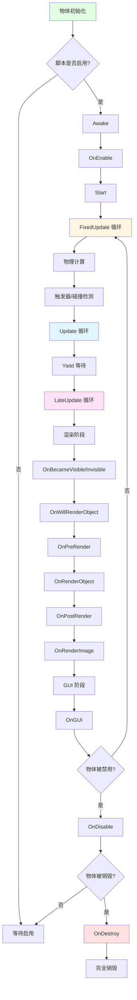
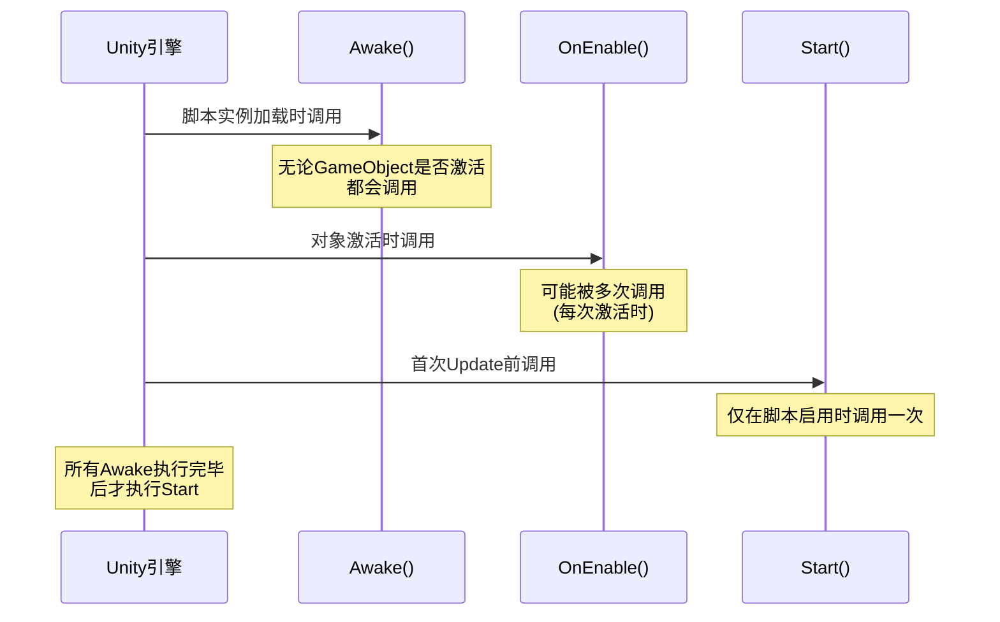
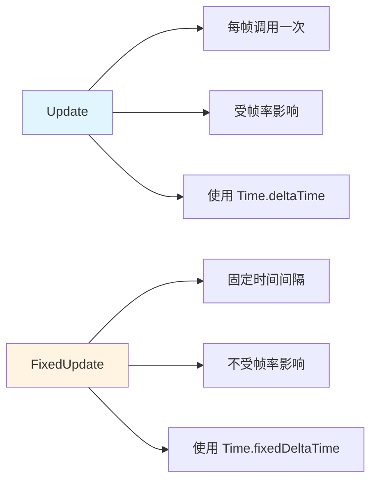
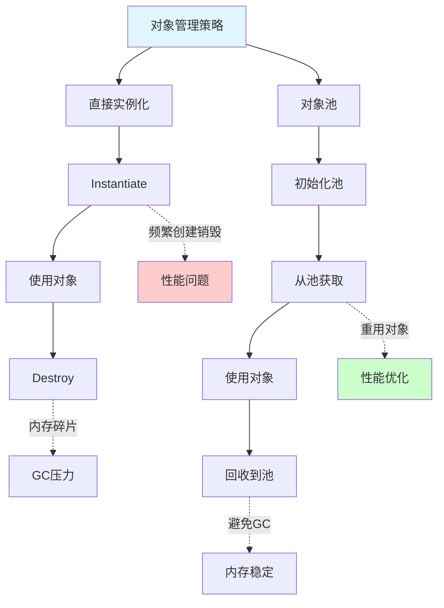
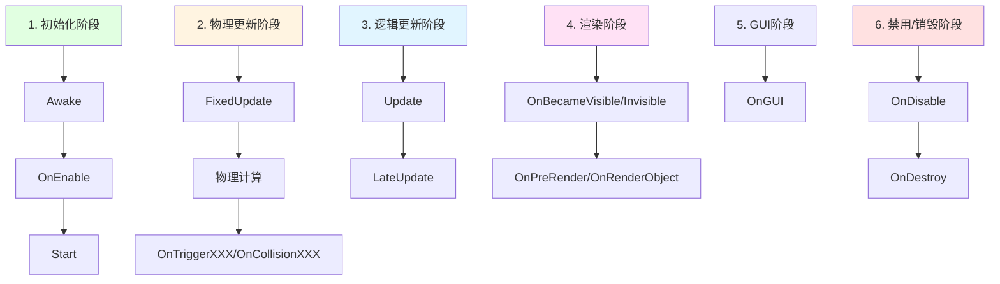
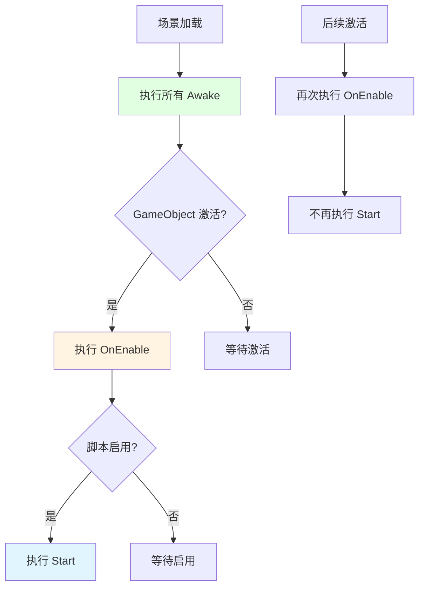
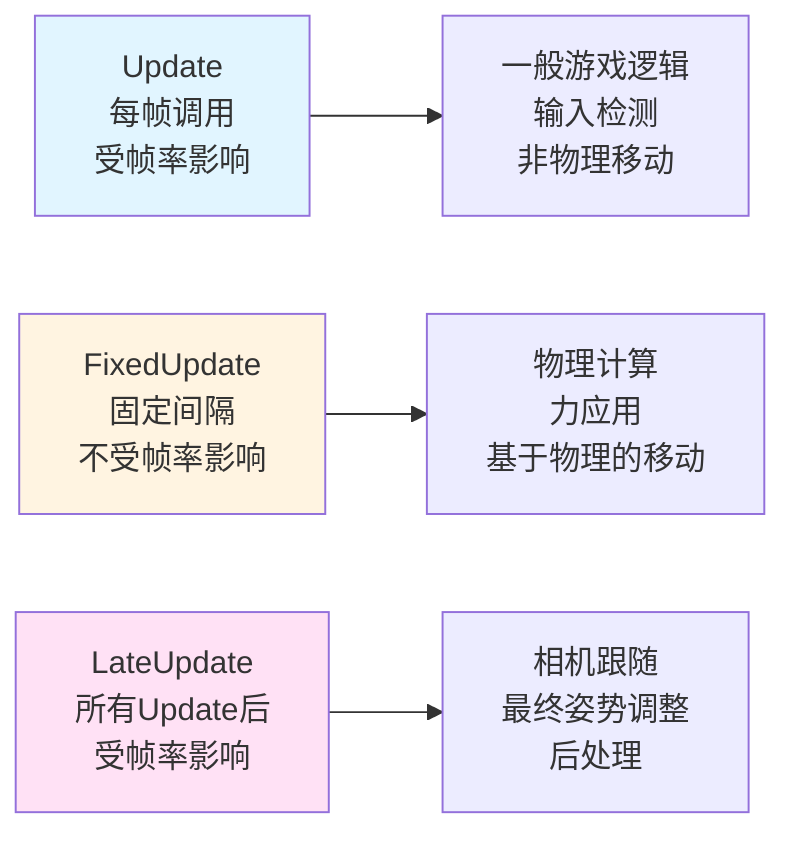
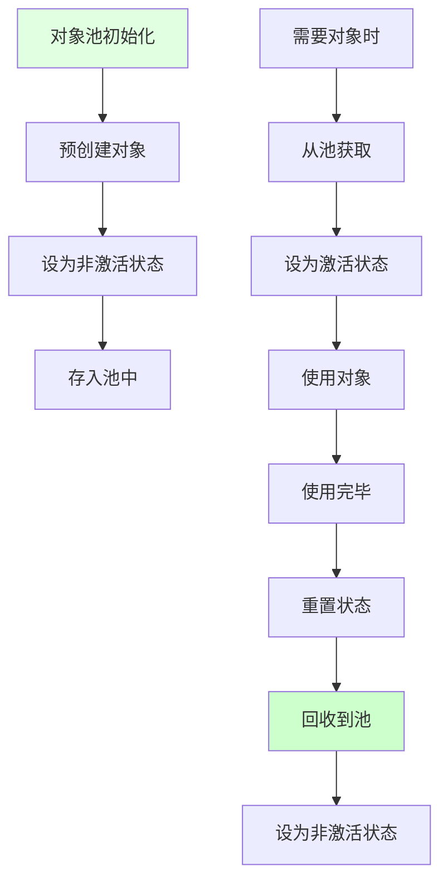

## 📊 图解

> [!info] 图示区
> 这里可以放置解释 Unity GameObject 生命周期的 mermaid 图表、UML 类图或其他辅助理解的图片

### 完整生命周期流程



### 初始化函数执行顺序



### Update 对比 FixedUpdate



### 对象池 vs Instantiate/Destroy



## 📖 原理

### 核心概念

Unity GameObject 的生命周期从创建到销毁可以分为多个关键阶段,每个阶段都有特定的回调函数按特定顺序执行。

#### 🎯 生命周期阶段

| 阶段 | 主要函数 | 说明 |
|------|----------|------|
| **初始化阶段** | `Awake` → `OnEnable` → `Start` | 对象创建和初始设置 |
| **物理更新阶段** | `FixedUpdate` → 物理计算 → 碰撞回调 | 固定间隔的物理模拟 |
| **逻辑更新阶段** | `Update` → `LateUpdate` | 帧驱动的游戏逻辑 |
| **渲染阶段** | `OnBecameVisible` → 渲染回调 → `OnRenderImage` | 场景渲染相关 |
| **GUI 阶段** | `OnGUI` | 立即模式 GUI |
| **禁用/销毁阶段** | `OnDisable` → `OnDestroy` | 清理和资源释放 |

#### ⚡ 关键时间函数

| 函数 | 调用时机 | 使用场景 |
|------|----------|----------|
| `Awake` | 脚本加载时 | 初始化内部状态,获取组件引用 |
| `OnEnable` | 对象启用时 | 注册事件,重置状态 |
| `Start` | 首次 Update 前 | 依赖其他对象的初始化 |
| `FixedUpdate` | 固定时间间隔 | 物理计算,力应用 |
| `Update` | 每帧 | 常规游戏逻辑 |
| `LateUpdate` | 所有 Update 后 | 相机跟随,后处理 |
| `OnDisable` | 对象禁用时 | 取消事件注册 |
| `OnDestroy` | 对象销毁时 | 资源清理 |

---

## 💡 面试题

### Q1：请详细描述 Unity GameObject 的生命周期,各阶段的主要函数调用顺序是什么？

#### 🎯 完整生命周期流程

Unity GameObject 的生命周期从创建到销毁可以分为以下几个关键阶段：



#### 📋 各阶段详解

**1️⃣ 初始化阶段：**

| 函数 | 调用时机 | 特点 |
|------|----------|------|
| **Awake** | 脚本实例加载时 | 即使 GameObject 未激活也会调用 |
| **OnEnable** | MonoBehaviour 被启用时 | 可能被多次调用 |
| **Start** | 第一次 Update 调用前 | 仅当脚本启用时调用一次 |

**2️⃣ 物理更新阶段：**

| 函数 | 调用时机 | 特点 |
|------|----------|------|
| **FixedUpdate** | 固定时间间隔 | 默认 0.02 秒 (50 次/秒) |
| **物理计算** | Unity 执行物理模拟 | 包括碰撞检测 |
| **OnTriggerXXX** | 触发器事件 | OnTriggerEnter、OnTriggerExit 等 |
| **OnCollisionXXX** | 碰撞事件 | OnCollisionEnter、OnCollisionExit 等 |

**3️⃣ 逻辑更新阶段：**

| 函数 | 调用时机 | 特点 |
|------|----------|------|
| **Update** | 每帧调用一次 | 受帧率影响 |
| **LateUpdate** | 所有 Update 调用完成后 | 适合相机跟随 |

**4️⃣ 渲染阶段：**

| 函数 | 调用时机 | 特点 |
|------|----------|------|
| **OnBecameVisible** | 物体进入摄像机视野 | 每个 Camera 调用一次 |
| **OnBecameInvisible** | 物体离开所有摄像机视野 | |
| **OnWillRenderObject** | 物体将被渲染时 | |
| **OnPreRender** | 摄像机渲染前 | |
| **OnRenderObject** | 摄像机渲染后 | |
| **OnPostRender** | 摄像机渲染完成后 | |
| **OnRenderImage** | 后处理效果 | |

**5️⃣ GUI 阶段：**

| 函数 | 调用时机 | 特点 |
|------|----------|------|
| **OnGUI** | 每帧可能多次调用 | 用于处理 GUI 事件 |

**6️⃣ 禁用/销毁阶段：**

| 函数 | 调用时机 | 特点 |
|------|----------|------|
| **OnDisable** | 组件被禁用时 | GameObject 或脚本组件被禁用 |
| **OnDestroy** | 组件或 GameObject 被销毁时 | 清理资源 |

> [!tip] 关键点
> 理解这些生命周期函数的调用顺序对于正确实现游戏功能至关重要：
> - 初始化操作应该放在 `Awake` 或 `Start` 中
> - 依赖于其他组件的初始化应该放在 `Start` 而不是 `Awake`
> - 物理相关计算应该放在 `FixedUpdate` 而不是 `Update` 中
> - 相机跟随等依赖其他对象更新的操作应该放在 `LateUpdate` 中

---

### Q2：Awake、OnEnable 和 Start 有什么区别？它们在实际开发中应该用于什么场景？

#### 🎯 三个初始化函数对比

| 特性 | Awake | OnEnable | Start |
|------|-------|----------|-------|
| **调用时机** | 脚本实例加载时 | 物体从禁用变为启用时 | 首次 Update 前 |
| **调用频率** | 只调用一次 | 可能多次调用 | 只调用一次 |
| **执行顺序** | 最先执行 | 在 Awake 后 | 所有 Awake 后 |
| **GameObject 状态** | 即使未激活也调用 | 需要对象激活 | 需要脚本启用 |
| **脚本状态** | 即使脚本禁用也调用 | 仅脚本启用时调用 | 仅脚本启用时调用 |



#### 💼 实际应用场景

**1️⃣ Awake 适合用于：**

| 场景 | 说明 |
|------|------|
| 🔧 **初始化内部变量** | 不依赖其他 GameObject 的状态 |
| 📦 **获取组件引用** | 使用 `GetComponent` 获取组件 |
| 🎯 **设置初始状态** | 不依赖于其他对象的初始化 |
| 🏗️ **单例模式初始化** | 场景中单例的初始化 |

```csharp
void Awake() {
    // 获取组件引用
    myRenderer = GetComponent<Renderer>();
    myRigidbody = GetComponent<Rigidbody>();
    
    // 单例初始化
    if (instance == null) {
        instance = this;
        DontDestroyOnLoad(gameObject);
    } else {
        Destroy(gameObject);
    }
}
```

**2️⃣ OnEnable 适合用于：**

| 场景 | 说明 |
|------|------|
| 📡 **注册事件监听** | 在 `OnDisable` 中取消注册 |
| 🔄 **重置状态** | 重置可能在禁用期间变化的值 |
| ▶️ **启用功能** | 启用被之前禁用的功能 |
| 📝 **订阅消息系统** | 订阅全局消息或事件 |

```csharp
void OnEnable() {
    // 注册事件
    EventManager.OnGameStart += HandleGameStart;
    
    // 重置状态
    isReadyToFire = true;
    cooldownTimer = 0f;
}

void OnDisable() {
    // 取消注册事件
    EventManager.OnGameStart -= HandleGameStart;
}
```

**3️⃣ Start 适合用于：**

| 场景 | 说明 |
|------|------|
| 🔗 **依赖其他对象** | 依赖于其他 GameObject 已初始化 |
| 🎬 **开始协程** | 启动协程执行异步操作 |
| 🏗️ **复杂初始化** | 涉及多个组件之间依赖的逻辑 |
| 🎮 **引用其他脚本** | 访问其他脚本的 Awake 初始化结果 |

```csharp
void Start() {
    // 依赖于其他组件的初始化
    playerHealth = GameObject.FindWithTag("Player").GetComponent<HealthSystem>();
    
    // 开始协程
    StartCoroutine(SpawnEnemies());
    
    // 复杂初始化
    InitializeAIPathfinding();
}
```

#### 📊 最佳实践总结

| 实践 | 说明 |
|------|------|
| ✅ **Awake** | 执行内部初始化,不依赖其他 GameObject |
| ✅ **OnEnable/OnDisable** | 成对处理事件注册/注销 |
| ✅ **Start** | 执行依赖于其他组件已初始化的逻辑 |
| ⚠️ **避免** | 在这些函数中执行耗时操作,特别是在 `Awake` 中,因为它会阻塞场景加载 |

---

### Q3：Unity 中 Update 和 FixedUpdate 有什么区别？在什么情况下应该使用 LateUpdate？

#### 🎯 三种 Update 函数对比

| 特性 | Update | FixedUpdate | LateUpdate |
|------|--------|-------------|------------|
| **调用频率** | 每帧一次 | 固定间隔 | 每帧一次 |
| **时间间隔** | 不固定 | 固定 (默认 0.02s) | 不固定 |
| **受帧率影响** | ✅ 是 | ❌ 否 | ✅ 是 |
| **执行顺序** | 主要更新阶段 | 物理计算前 | 所有 Update 后 |
| **重要参数** | `Time.deltaTime` | `Time.fixedDeltaTime` | `Time.deltaTime` |
| **适用场景** | 一般游戏逻辑 | 物理相关计算 | 跟随逻辑、后处理 |



#### 💻 代码示例

**Update 使用场景：**

```csharp
void Update() {
    // 输入检测
    if (Input.GetButtonDown("Fire")) {
        FireWeapon();
    }
    
    // 非物理移动
    transform.Translate(Vector3.forward * speed * Time.deltaTime);
    
    // UI更新
    healthBar.fillAmount = currentHealth / maxHealth;
}
```

**FixedUpdate 使用场景：**

```csharp
void FixedUpdate() {
    // 施加物理力
    rb.AddForce(direction * force);
    
    // 基于物理的移动
    Vector3 movement = new Vector3(
        Input.GetAxis("Horizontal"), 
        0, 
        Input.GetAxis("Vertical")
    );
    rb.MovePosition(rb.position + movement * speed * Time.fixedDeltaTime);
    
    // 射线检测（物理相关）
    RaycastHit hit;
    if (Physics.Raycast(transform.position, transform.forward, out hit)) {
        // 处理射线检测结果
    }
}
```

**LateUpdate 使用场景：**

```csharp
void LateUpdate() {
    // 相机跟随目标
    Vector3 desiredPosition = target.position + offset;
    transform.position = Vector3.Lerp(
        transform.position, 
        desiredPosition, 
        smoothSpeed
    );
    transform.LookAt(target);
    
    // 最终姿势调整
    FinalizeCharacterPose();
    
    // 处理游戏对象排序
    SortRenderingOrder();
}
```

#### ⚠️ 注意事项和最佳实践

| 实践 | 说明 |
|------|------|
| ✅ **物理操作** | 始终在 `FixedUpdate` 中处理物理相关操作 |
| ✅ **时间增量** | 在 `Update` 中使用 `Time.deltaTime`，在 `FixedUpdate` 中使用 `Time.fixedDeltaTime` |
| ⚠️ **帧率影响** | 帧率较低时，`FixedUpdate` 可能会多次调用，需要谨慎处理重复操作 |
| ✅ **相机跟随** | 复杂的相机跟随逻辑应放在 `LateUpdate` 中，确保所有对象已更新位置 |
| ❌ **避免** | 在这些函数中执行过于耗时的操作，考虑使用协程或分帧处理 |

---

### Q4：如何正确管理 GameObject 的生命周期以避免常见的性能问题？何时应该使用 Object Pooling 而不是直接 Instantiate 和 Destroy？

#### ⚠️ 常见的 GameObject 性能问题

| 问题 | 影响 | 原因 |
|------|------|------|
| 🔴 **频繁的 Instantiate 和 Destroy** | 内存碎片、GC 压力、CPU 峰值 | 频繁创建和销毁对象 |
| 🟡 **过多的活动 GameObject** | CPU 负担增加 | 即使不在视野内也会执行 Update |
| 🟠 **不合理的组件设计** | 级联更新、性能下降 | 过多的 MonoBehaviour 组件 |

#### ✅ 有效的生命周期管理策略

**1️⃣ 对象池化 (Object Pooling)：**



```csharp
public class ObjectPool : MonoBehaviour {
    public GameObject prefab;
    public int poolSize = 20;
    private List<GameObject> pooledObjects;
    
    void Start() {
        pooledObjects = new List<GameObject>();
        for (int i = 0; i < poolSize; i++) {
            GameObject obj = Instantiate(prefab);
            obj.SetActive(false);
            pooledObjects.Add(obj);
        }
    }
    
    public GameObject GetPooledObject() {
        for (int i = 0; i < pooledObjects.Count; i++) {
            if (!pooledObjects[i].activeInHierarchy) {
                return pooledObjects[i];
            }
        }
        // 可选的扩展池逻辑
        return null;
    }
}
```

**2️⃣ 距离检查和优化：**

```csharp
void Update() {
    float distanceToPlayer = Vector3.Distance(transform.position, player.position);
    
    // 基于距离调整行为
    if (distanceToPlayer > deactivationDistance) {
        gameObject.SetActive(false);
    } else if (distanceToPlayer > reducedUpdateDistance) {
        // 降低更新频率
        if (Time.frameCount % 5 == 0) {
            UpdateBehavior();
        }
    } else {
        // 正常更新
        UpdateBehavior();
    }
}
```

**3️⃣ 分层加载/卸载：**

| 策略 | 说明 |
|------|------|
| 🗺️ **场景分区** | 只加载必要的场景部分 |
| ⏳ **异步加载** | 使用 `SceneManager` 异步加载避免卡顿 |
| 🔄 **动态加载** | 根据玩家位置动态加载/卸载资源 |

**4️⃣ 优化组件更新：**

```csharp
void Update() {
    // 不是每帧都需要执行的计算
    if (Time.frameCount % updateFrequency == 0) {
        PerformHeavyCalculation();
    }
}
```

#### 📊 Object Pooling vs Instantiate/Destroy

**何时应该使用对象池：**

| 场景 | 原因 |
|------|------|
| 🎯 **频繁创建/销毁的对象** | 子弹、粒子效果、敌人、收集物 |
| 📦 **创建成本高的对象** | 复杂预制体、多组件对象 |
| 🎮 **性能关键场景** | 战斗场景、资源密集型场景 |
| 📱 **移动平台** | 性能受限设备 |

**何时可以直接使用 Instantiate/Destroy：**

| 场景 | 原因 |
|------|------|
| 🎲 **低频率创建的对象** | 关卡中稀有的物品 |
| 🔒 **明确不会复用的对象** | 具有唯一状态的对象 |
| 🛠️ **开发原型阶段** | 快速迭代，先实现功能再优化 |

#### 💡 最佳实践

| 实践 | 说明 |
|------|------|
| 🎯 **混合策略** | 关键游戏元素使用池化，次要元素可以即用即创建 |
| 📏 **池大小管理** | 动态调整池大小以适应不同设备 |
| 🔄 **对象复位** | 使用 `OnEnable/OnDisable` 管理池对象状态 |
| 📊 **监控分析** | 使用 Unity Profiler 定期检查对象创建和销毁 |

```csharp
void OnDisable() {
    // 重置对象状态，准备下次重用
    health = maxHealth;
    ammunition = defaultAmmunition;
    transform.localPosition = Vector3.zero;
}
```

> [!tip] 总结
> 通过合理管理 GameObject 生命周期，特别是在适当的场景应用对象池技术，可以有效降低内存分配、减少垃圾回收压力，使游戏运行更加流畅稳定。

---

## 🔗 相关链接

- [[Unity相关]] - 父主题索引
- [[协程]] - 相关主题：异步编程
- [[Unity多线程]] - 相关主题：性能优化
- [[Unity资源管理]] - 相关主题：内存管理
