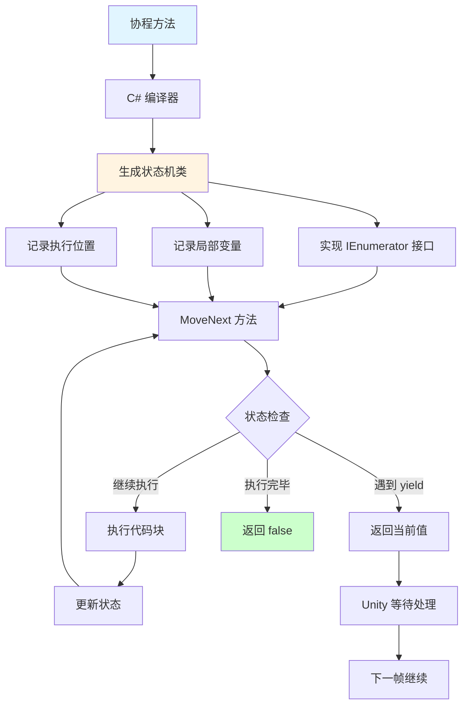
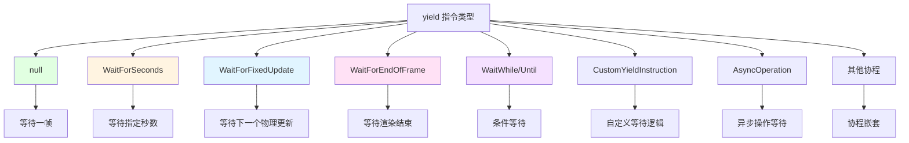
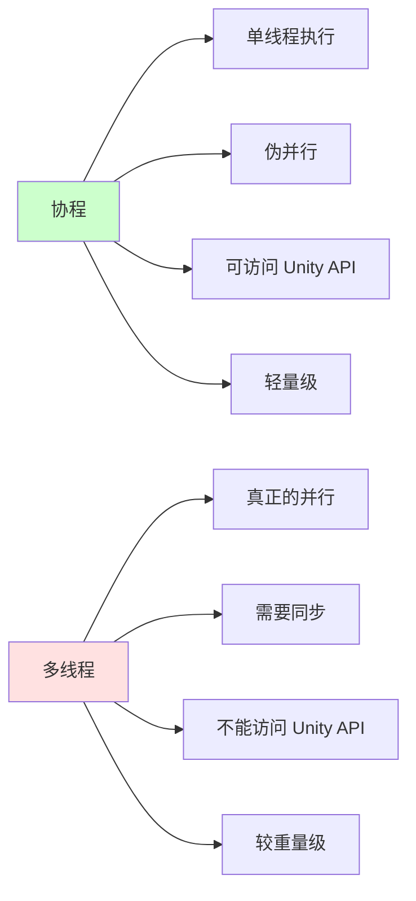
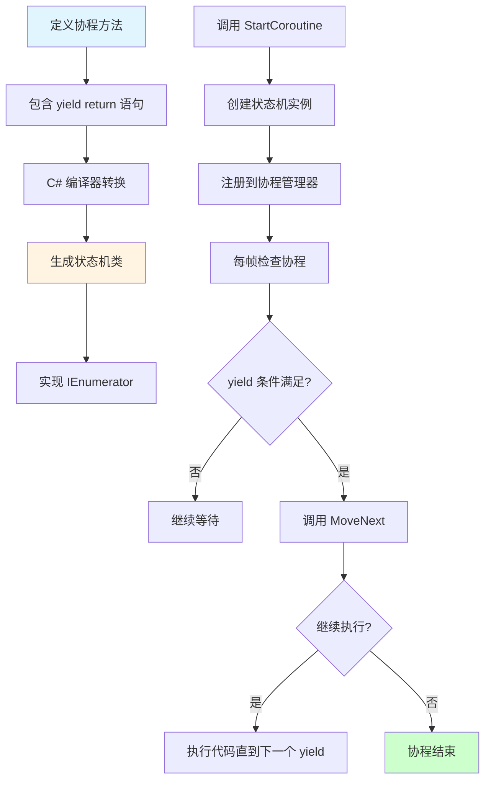
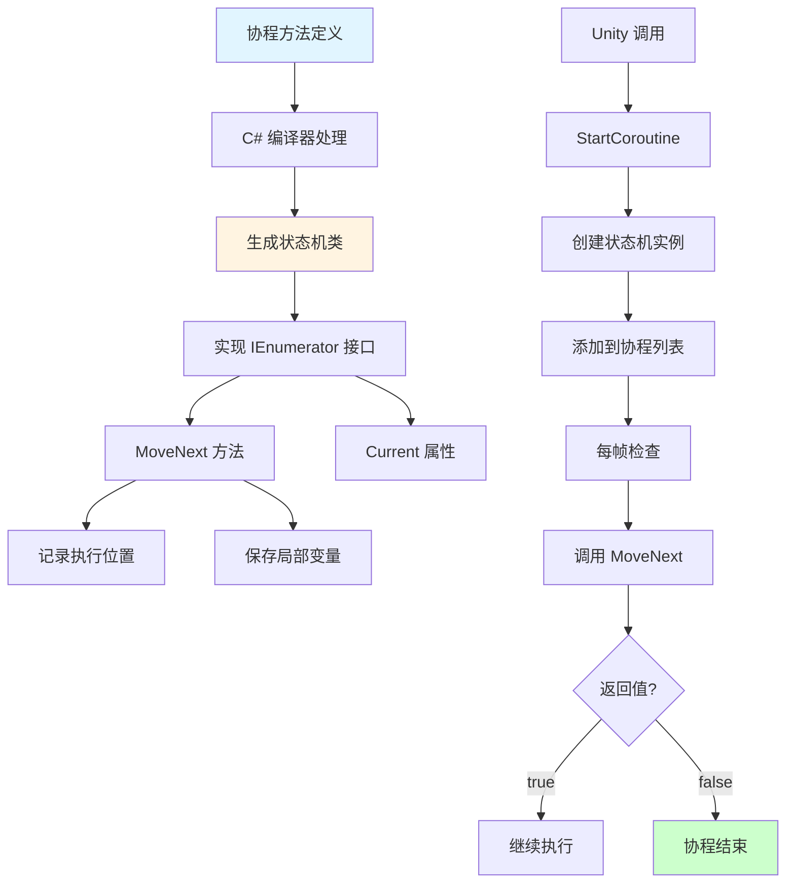
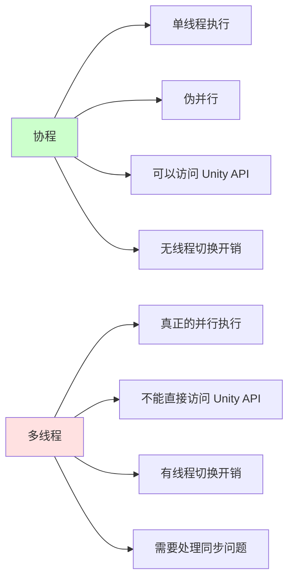
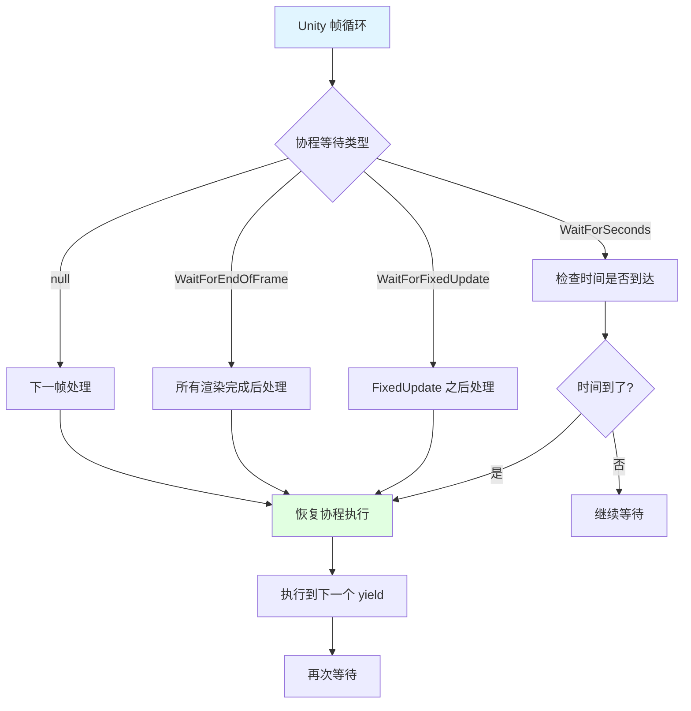

## 📊 图解

> [!info] 图示区
> 这里可以放置解释 Unity 协程的 mermaid 图表、UML 类图或其他辅助理解的图片

### 协程执行流程

```mermaid
sequenceDiagram
    participant Main as 主线程
    participant CM as 协程管理器
    participant Coroutine as 协程
    participant SM as 状态机

    Main->>CM: StartCoroutine(Method())
    CM->>SM: 创建状态机实例
    SM-->>CM: 返回 IEnumerator
    CM->>Coroutine: 调用 MoveNext()
    
    loop 每帧检查
        Coroutine->>SM: 执行到 yield return
        SM-->>Coroutine: 返回 yield 指令
        Coroutine->>CM: 检查等待条件
        
        alt 条件满足
            CM->>Coroutine: 继续 MoveNext()
        else 条件未满足
            CM->>CM: 等待下一帧
        end
    end
    
    Coroutine->>SM: MoveNext() 返回 false
    SM-->>CM: 协程结束
    CM-->>Main: 协程完成

    style Main fill:#e1f5ff
    style SM fill:#fff4e1
```

### 协程状态机结构



### 协程等待类型



### 协程 vs 多线程



## 📖 原理

### 核心概念

Unity 协程是一个强大的特性，它让开发者能够以一种看起来很像多线程的方式编写异步代码，但实际上它在底层并不是真正的多线程。

#### 🔧 协程底层实现

**基于 C# 迭代器：**

| 机制 | 说明 |
|------|------|
| 📦 **迭代器模式** | 使用 `IEnumerator` 接口实现 |
| 🔄 **yield return** | 返回控制权并在下次继续执行 |
| 🤖 **状态机生成** | C# 编译器自动生成状态机类 |
| 💾 **上下文保存** | 保存局部变量和执行位置 |

**协程执行流程：**



#### 🎯 协程的核心特性

| 特性 | 说明 |
|------|------|
| 🔄 **暂停和恢复** | 可以暂停执行并在条件满足后恢复 |
| 📍 **位置记忆** | 自动记住上次执行到的位置 |
| 💾 **变量保持** | 所有局部变量的值被保持 |
| ⏰ **时间控制** | 可以等待特定时间或帧 |
| 🎭 **非阻塞** | 不会阻塞主线程，伪并行执行 |

#### ⚡ 性能考虑

| 方面 | 说明 |
|------|------|
| 💾 **内存分配** | 每个协程都会分配一个状态机对象 |
| 🔄 **调度开销** | 协程的调度和状态管理有一定性能消耗 |
| 📊 **GC 影响** | 大量协程可能导致 GC 压力 |
| ⚠️ **适用场景** | 适合延时执行、动画序列、异步加载 |

---

## 💡 面试题

### Q1：什么是协程？

#### 🎯 协程的定义

**协程** 是 Unity 中一个非常强大的特性，它让我们能够以一种看起来很像多线程的方式编写异步代码，但实际上它在底层并不是真正的多线程。

#### 🔍 底层原理详解

**从底层原理来说，Unity 的协程实际上是基于 C# 的迭代器和 `yield return` 语法实现的。**



**详细工作流程：**

1️⃣ **编译时转换：**
当我们定义一个包含 `yield return` 语句的方法时，C# 编译器会偷偷地将它转换成一个实现了 `IEnumerator` 接口的状态机类。这个状态机能够：
- 记录方法执行到了哪一步
- 保存所有局部变量的值

2️⃣ **运行时执行：**
当我们调用 `StartCoroutine` 时，Unity 会：
- 创建这个状态机的实例
- 将其添加到 MonoBehaviour 内部的协程管理器中
- 在每一帧的适当时机检查所有运行中的协程

3️⃣ **等待机制：**
Unity 会检查协程的等待条件是否满足：
- 如果满足了，就调用迭代器的 `MoveNext` 方法，让协程继续执行
- 直到遇到下一个 `yield` 语句

**示例代码：**

```csharp
// 定义协程
IEnumerator MyCoroutine() {
    Debug.Log("开始执行");
    
    // 等待 2 秒
    yield return new WaitForSeconds(2f);
    
    Debug.Log("2秒后继续");
    
    // 等待另一帧
    yield return null;
    
    Debug.Log("又过了一帧");
}

// 启动协程
StartCoroutine(MyCoroutine());
```

#### 💡 协程的暂停和恢复机制

这就是为什么协程可以实现看似暂停和恢复的功能：

| 机制 | 说明 |
|------|------|
| 📝 **状态记录** | 状态机记住了上次执行到的位置和所有变量的值 |
| ⏰ **条件检查** | `yield return new WaitForSeconds(2f)` 告诉协程管理器：记录当前时间，然后在之后的每一帧检查是否已经过了 2 秒 |
| 🔄 **恢复执行** | 如果时间到了，才继续执行协程 |

#### 🎭 协程与多线程的区别



| 特性 | 协程 | 多线程 |
|------|------|--------|
| **执行方式** | 在主线程上执行 | 在独立线程上执行 |
| **并行性** | 伪并行，分时执行 | 真正的并行执行 |
| **Unity API** | 可以安全访问 | 不能直接访问 |
| **切换开销** | 无线程切换开销 | 有线程切换和同步开销 |
| **编程复杂度** | 简单，不需要考虑同步 | 复杂，需要处理同步 |

#### 📊 性能分析

| 方面 | 说明 |
|------|------|
| 💾 **内存** | 每个协程都会分配一个状态机对象，如果大量使用协程可能会导致额外的内存分配 |
| ⚡ **性能** | 虽然协程在主线程上执行，不会像真正的多线程那样有线程切换开销，但是协程的调度和状态管理仍有一定的性能消耗 |
| 🎯 **适用场景** | 特别适合实现延时执行、动画序列、异步加载等功能，而不必深入处理复杂的多线程同步问题 |

#### 🎮 Unity 事件循环系统

协程的底层实现还涉及到 Unity 的事件循环系统：



在每一帧的特定阶段，Unity 会处理不同类型的协程等待条件：

| 等待类型 | 处理时机 |
|---------|----------|
| `WaitForFixedUpdate` | 在 `FixedUpdate` 之后处理 |
| `WaitForEndOfFrame` | 在所有渲染完成后处理 |
| `WaitForSeconds` | 基于时间的检查 |
| `null` | 下一帧立即恢复 |

> [!tip] 总结
> 协程是 Unity 提供的一个优雅解决方案，让我们能在单线程环境下编写类似异步的代码。但了解它的底层原理（基于迭代器和状态机）对于正确使用协程、避免潜在的性能陷阱非常重要。

---

## 🔗 相关链接

- [[Unity相关]] - 父主题索引
- [[Gameobject的生命周期]] - 相关主题：Update 与协程的对比
- [[Unity多线程]] - 相关主题：协程与多线程的区别
