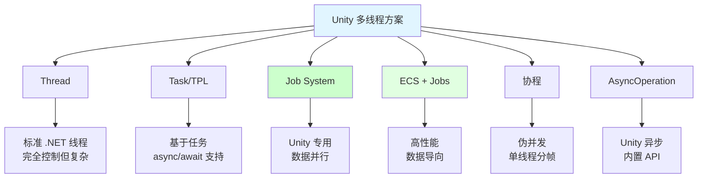
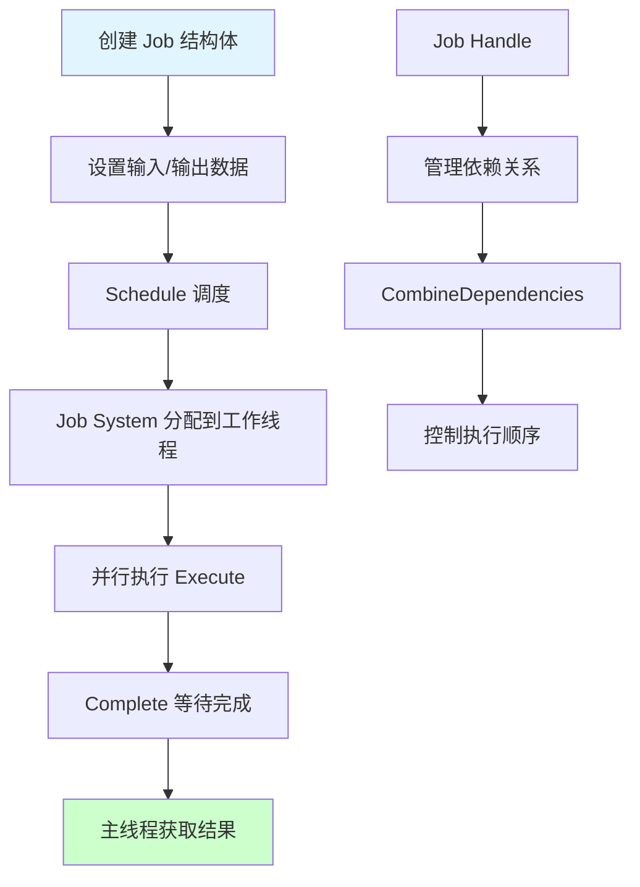
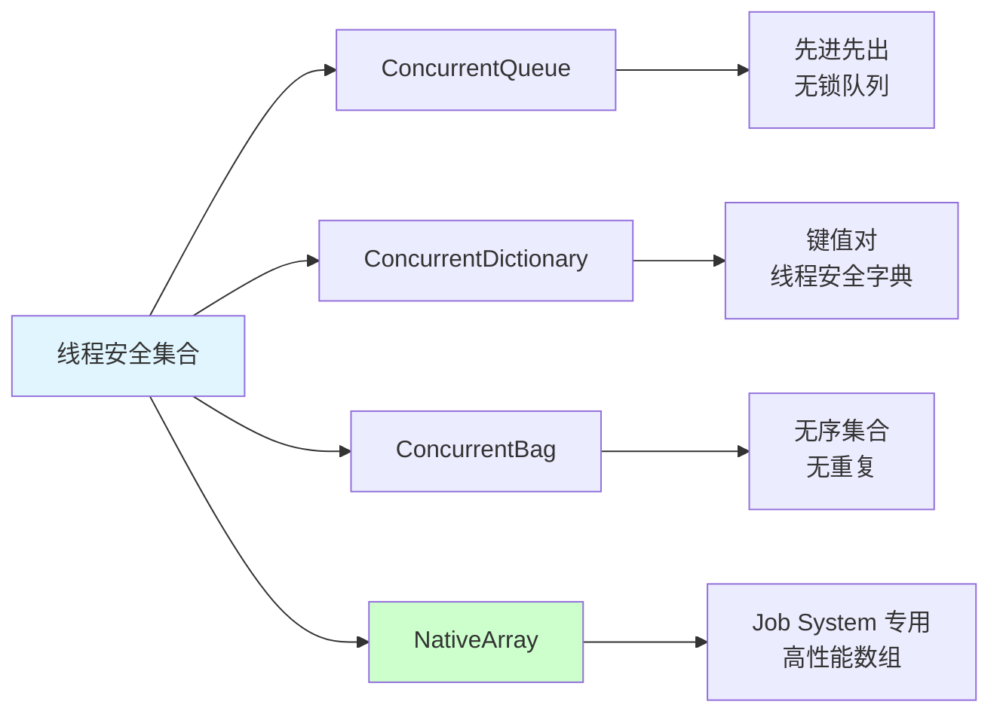
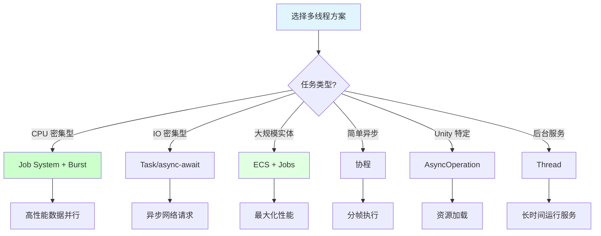
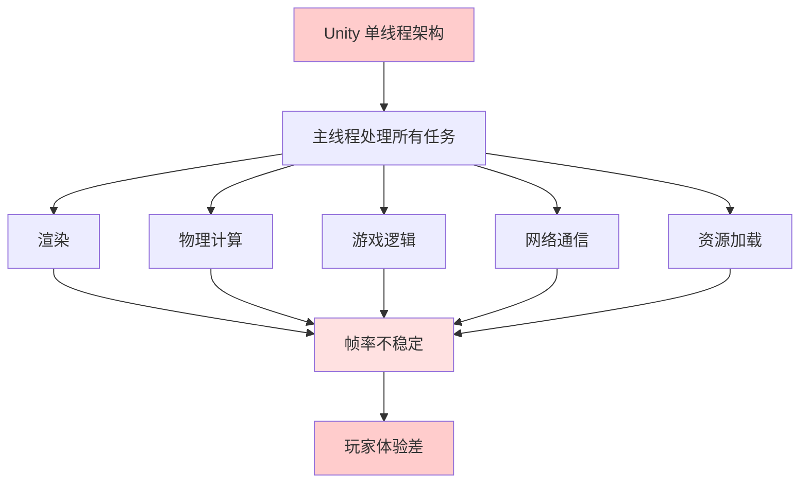
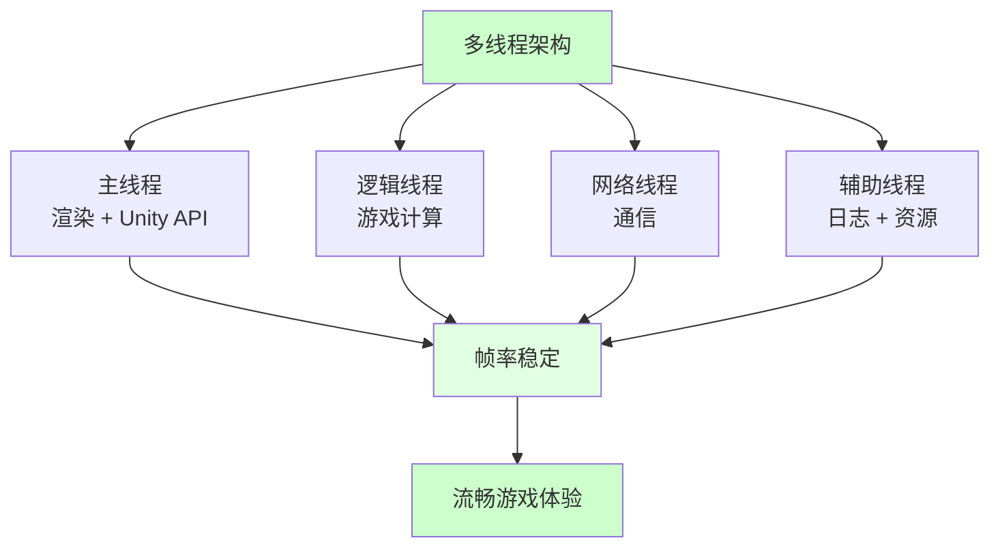
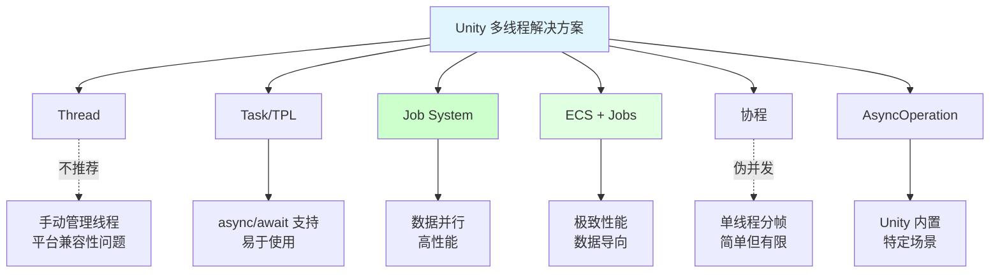
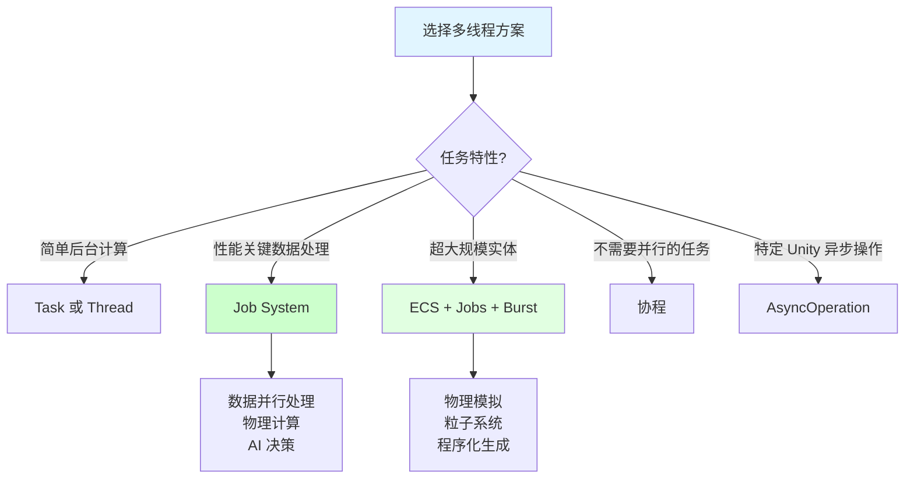
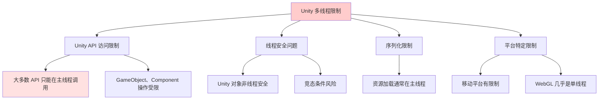

## 📊 图解

> [!info] 图示区
> 这里可以放置解释 Unity 多线程的 mermaid 图表、UML 类图或其他辅助理解的图片

### 多线程解决方案对比



### 主线程与工作线程通信

```mermaid
sequenceDiagram
    participant Main as 主线程
    participant Queue as 消息队列
    participant Worker as 工作线程
    participant Unity as Unity API

    Worker->>Queue: 发送计算结果
    Queue->>Main: Update 中执行队列
    
    Main->>Unity: 安全访问 Unity API
    Unity-->>Main: 返回结果

    Note over Worker: 纯计算<br/>不访问 Unity API
    Note over Main: 处理渲染和<br/>Unity API 调用

    style Main fill:#ccffcc
    style Worker fill:#ffe1e1
```

### Job System 工作流程



### 线程安全集合



## 📖 原理

### 核心概念

Unity 引擎本身是单线程架构，主线程负责渲染、物理计算和引擎 API 调用。但在大型游戏中需要引入多线程架构来处理耗时操作。

#### 🎯 为什么需要多线程

| 问题 | 说明 |
|------|------|
| 🔄 **主线程瓶颈** | 所有逻辑、渲染、物理都在主线程，导致帧率不稳定 |
| ⏱️ **耗时操作** | 复杂 AI 计算、网络通信、资源加载会阻塞主线程 |
| 📊 **性能要求** | 现代 CPU 多核心，不利用多线程是浪费资源 |

#### ⚡ 多线程解决方案

Unity 提供了多种多线程编程方案：



#### 🔐 Unity 多线程限制

| 限制 | 说明 |
|------|------|
| 🚫 **Unity API 限制** | 大多数 Unity API 只能在主线程调用 |
| 🚫 **非线程安全** | Unity 对象通常不是线程安全的 |
| 🚫 **序列化限制** | 序列化系统不是线程安全的 |
| 🚫 **平台限制** | 某些平台（如 WebGL）对多线程支持有限 |

---

## 💡 面试题

### Q1：为什么 Unity 需要使用多线程？Unity 的主线程有什么局限性？

#### 🎯 主线程的局限性

Unity 引擎本身是单线程架构，主线程负责渲染、物理计算和引擎 API 调用。这种设计在简单项目中工作良好，但在大型游戏中会成为瓶颈。



**实际场景举例：**

| 场景 | 问题 |
|------|------|
| 🎮 **战斗场景** | 大量 AI 计算、特效、物理导致帧率下降 |
| 🌐 **网络通信** | 同步网络请求阻塞主线程 |
| 📦 **资源加载** | 大资源加载导致卡顿 |
| 🧠 **复杂 AI** | 寻路、决策计算耗时 |

#### ✅ 多线程架构的优势

通过引入多线程架构，我们可以：



| 优势 | 说明 |
|------|------|
| ⚡ **性能提升** | 充分利用多核 CPU |
| 🎮 **流畅体验** | 主线程专注于渲染，帧率稳定 |
| 🔄 **非阻塞** | 耗时操作不阻塞主线程 |
| 📊 **可扩展性** | 可以根据任务类型创建专门的工作线程 |

#### ⚠️ 多线程的挑战

使用多线程也带来了一些挑战：

| 挑战 | 解决方案 |
|------|----------|
| 🔒 **同步问题** | 使用线程安全的数据结构和锁机制 |
| 💀 **死锁风险** | 合理设计线程间通信，避免循环等待 |
| 🐛 **调试复杂** | 使用专门的调试工具和日志系统 |
| 📈 **设计复杂度** | 清晰划分线程职责，设计良好的通信机制 |

---

### Q2：Unity 中有哪些多线程解决方案？

#### 🎯 Unity 多线程方案全景图

Unity 中提供了多种多线程编程方案，每种都有其特点和适用场景：



#### 📋 方案详细对比

| 方案 | 特点 | 优点 | 缺点 | 适用场景 |
|------|------|------|------|----------|
| **Thread** | 标准 .NET 线程 API | 完全控制线程生命周期 | 需要手动管理同步，平台兼容性问题 | 后台服务、网络通信 |
| **Task/TPL** | 基于任务的异步模型 | 易于使用，支持 async/await | 与 Unity 主线程交互需谨慎 | 网络请求、I/O 操作 |
| **Job System** | Unity 专用作业系统 | 安全性高，性能优化 | 使用有一定限制 | 大规模数据处理、物理计算 |
| **ECS + Jobs** | 数据导向架构 | 极高性能，缓存友好 | 学习曲线陡峭 | 高性能游戏系统 |
| **协程** | 不是真正多线程 | 简单易用，不需要考虑同步 | 不是并行执行 | 分帧操作、动画 |
| **AsyncOperation** | Unity 内置异步 API | 专为 Unity 设计，安全易用 | 功能较为有限 | 资源加载、场景切换 |

#### 💼 选择建议



**选择原则：**

| 原则 | 说明 |
|------|------|
| ✅ **简单后台计算** | 使用 Task 或 Thread |
| ✅ **性能关键的数据处理** | 使用 Unity Job System |
| ✅ **需要高度优化的大规模实体处理** | 使用 ECS + Jobs + Burst |
| ✅ **UI 更新、延时操作** | 使用协程 |
| ✅ **特定的 Unity 异步操作** | 使用 AsyncOperation |

> [!tip] 最佳实践
> 不同的多线程方案可以组合使用，根据具体需求选择合适的工具。理解每种方案的优缺点和限制对于编写高效、稳定的 Unity 应用至关重要。

---

### Q3：Unity 中多线程编程有哪些限制？如何安全地从工作线程与 Unity 主线程通信？

#### 🚫 Unity 多线程的主要限制

Unity 在多线程使用上有一些重要限制：



**详细限制说明：**

| 限制类别 | 具体限制 | 后果 |
|---------|---------|------|
| **Unity API** | 大多数 Unity API 只能在主线程调用 | 不可预测的行为或崩溃 |
| **对象安全** | Unity 对象通常不是线程安全的 | 竞态条件、数据损坏 |
| **序列化** | 序列化系统不是线程安全的 | 序列化错误 |
| **调试** | Debug.Log 等函数限制在主线程 | 调试困难 |
| **平台** | 移动平台、WebGL 有额外限制 | 跨平台兼容性问题 |

#### ✅ 安全的线程间通信方法

**1️⃣ 线程安全集合：**

```csharp
using System.Collections.Concurrent;

private ConcurrentQueue<Action> _mainThreadActions = new ConcurrentQueue<Action>();

// 工作线程
void WorkerThread() {
    Vector3 result = PerformComplexCalculation();
    
    // 将需要在主线程执行的操作入队
    _mainThreadActions.Enqueue(() => {
        gameObject.transform.position = result;  // 安全访问 Unity API
    });
}

// 主线程
void Update() {
    Action action;
    while (_mainThreadActions.TryDequeue(out action)) {
        action.Invoke();
    }
}
```

**2️⃣ MainThreadDispatcher 模式：**

```mermaid
sequenceDiagram
    participant Worker as 工作线程
    participant Queue as 消息队列
    participant Main as 主线程
    participant Unity as Unity API

    Worker->>Queue: Enqueue(Action)
    Note over Worker: 计算完成，提交任务
    
    Main->>Queue: Update() 中执行队列
    Main->>Unity: 安全调用 Unity API
    Unity-->>Main: 返回结果

    style Worker fill:#ffe1e1
    style Main fill:#ccffcc
```

```csharp
public class MainThreadDispatcher : MonoBehaviour {
    private static MainThreadDispatcher _instance;
    private readonly Queue<Action> _executionQueue = new Queue<Action>();
    private readonly object _lock = new object();
    
    private void Awake() {
        if (_instance == null) {
            _instance = this;
            DontDestroyOnLoad(gameObject);
        }
    }
    
    public static void ExecuteOnMainThread(Action action) {
        lock (_instance._lock) {
            _instance._executionQueue.Enqueue(action);
        }
    }
    
    private void Update() {
        lock (_lock) {
            while (_executionQueue.Count > 0) {
                _executionQueue.Dequeue().Invoke();
            }
        }
    }
}

// 使用示例
void ThreadFunction() {
    string result = ComplexOperation();
    
    // 调度到主线程
    MainThreadDispatcher.ExecuteOnMainThread(() => {
        resultText.text = result;  // 安全地更新 UI
    });
}
```

**3️⃣ async/await 模式：**

```csharp
public async void ProcessDataAsync() {
    // 开始在后台线程工作
    string result = await Task.Run(() => {
        return ExpensiveOperation();
    });
    
    // 这里自动回到主线程，可以安全地访问 Unity API
    gameObject.GetComponent<Renderer>().material.color = ConvertResultToColor(result);
}
```

**4️⃣ Unity Job System 的内置机制：**

```csharp
using Unity.Collections;
using Unity.Jobs;

void Start() {
    NativeArray<float> result = new NativeArray<float>(1, Allocator.TempJob);
    
    MyJob job = new MyJob { result = result };
    JobHandle handle = job.Schedule();
    handle.Complete();  // 同步点
    
    // 此时在主线程，可以安全地使用结果
    Debug.Log("计算结果: " + result[0]);
    
    result.Dispose();
}

struct MyJob : IJob {
    public NativeArray<float> result;
    
    public void Execute() {
        result[0] = ComputeComplexValue();  // 在工作线程执行
    }
}
```

#### 📊 最佳实践

| 实践 | 说明 |
|------|------|
| ✅ **清晰区分职责** | 工作线程：纯计算；主线程：Unity API 访问 |
| ✅ **最小化锁和同步** | 使用无锁数据结构，批量处理主线程任务 |
| ✅ **使用 ValueType** | 特别是使用 Job System 时 |
| ✅ **正确处理异常** | 捕获并记录工作线程异常 |
| ✅ **控制线程数量** | 避免创建过多线程，考虑使用线程池 |

> [!tip] 总结
> 通过遵循这些最佳实践和使用适当的线程间通信方法，可以在保持 Unity 应用稳定性的同时，充分利用多线程提升性能。

---

## 🔗 相关链接

- [[Unity相关]] - 父主题索引
- [[协程]] - 相关主题：协程与多线程的区别
- [[Unity资源管理]] - 相关主题：异步资源加载
