## 📊 图解

> [!info] 图示区
> 这里可以放置解释 Unity 资源管理的 mermaid 图表、UML 类图或其他辅助理解的图片

### 资源加载方式对比

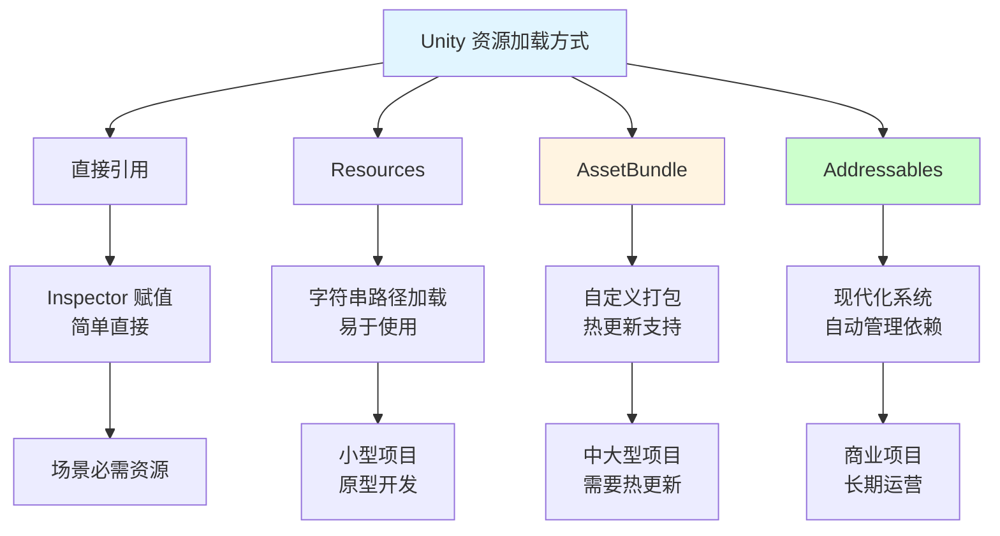

### 特殊文件夹用途

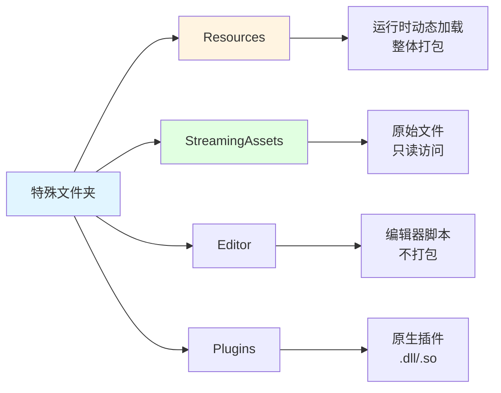

### AssetBundle 工作流程

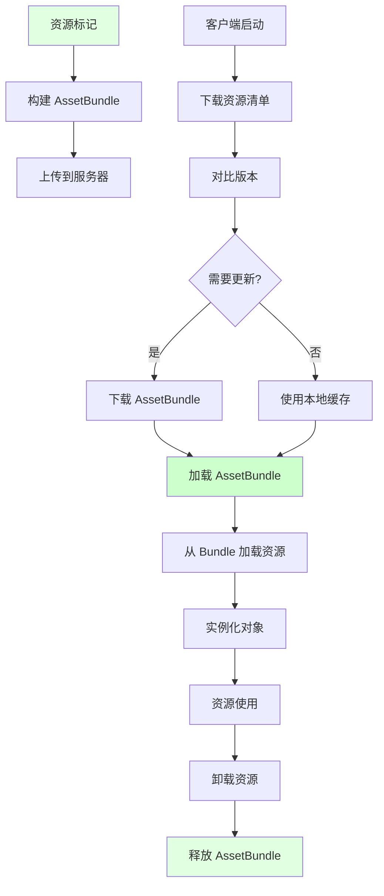

### Addressables 系统架构

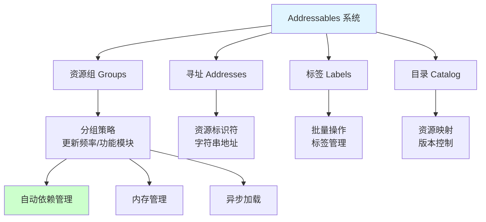

### 内存管理流程

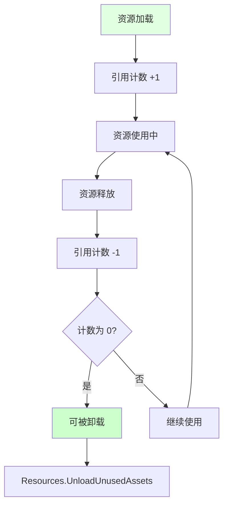

## 📖 原理

### 核心概念

Unity 提供了多种资源管理方式，每种方式有其特定用途和优缺点。

#### 📁 特殊文件夹说明

| 文件夹 | 用途 | 特点 | 适用场景 |
|--------|------|------|----------|
| **Resources** | 运行时动态加载 | 简单但已不推荐 | 小型项目、原型 |
| **StreamingAssets** | 原始文件存储 | 不处理，只读 | 视频、配置文件 |
| **Editor** | 编辑器扩展 | 不打包到游戏 | 编辑器工具 |
| **Plugins** | 原生插件 | 平台特定代码 | 第三方库 |

#### 🔄 资源加载方式演进

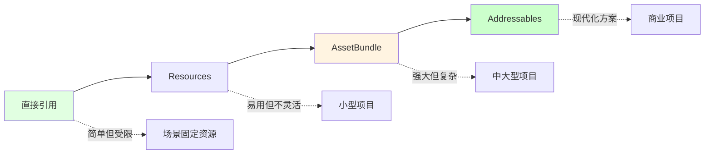

#### 💾 内存管理机制

Unity 的内存管理基于**引用计数和垃圾回收**：

| 机制 | 说明 |
|------|------|
| **引用计数** | 资源被加载时 +1，释放时 -1 |
| **托管内存** | C# 垃圾回收器管理 |
| **非托管内存** | 纹理、网格等需显式释放 |
| **资源实例** | 从原始资产创建的场景对象 |

---

## 💡 面试题

### Q1：Unity 中有哪些资源加载方式？它们各自的优缺点和适用场景是什么？

#### 🎯 资源加载方式全景图

Unity 提供了多种资源加载方式：

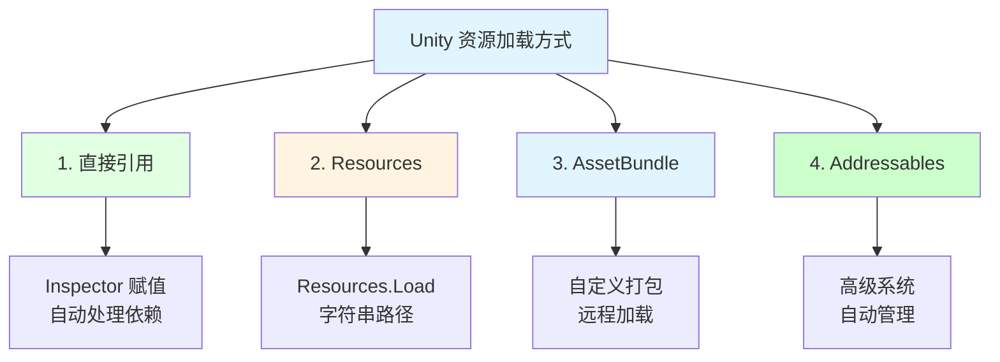

#### 📋 详细对比

**1️⃣ 直接引用（Inspector 赋值）：**

| 特性 | 说明 |
|------|------|
| **工作原理** | 在 Unity 编辑器中直接将资源拖拽到组件字段上 |
| **优点** | 简单直接，无需代码；编辑时可见；自动处理依赖 |
| **缺点** | 无法动态更改；随场景一起加载；不支持运行时替换 |
| **适用场景** | 场景必需的固定资源，核心游戏元素 |

**2️⃣ Resources 文件夹：**

| 特性 | 说明 |
|------|------|
| **工作原理** | 通过字符串路径从特定文件夹加载资源 |
| **优点** | 简单易用，API 简洁；支持运行时动态加载；无需额外构建 |
| **缺点** | 所有内容都会被打包；无法热更新；内存管理不够灵活 |
| **适用场景** | 小型项目、原型开发、资源量少的项目 |
| **注意** | Unity 官方不再推荐使用 |

**3️⃣ AssetBundle 系统：**

| 特性 | 说明 |
|------|------|
| **工作原理** | 将资源打包成独立文件，可远程加载和更新 |
| **优点** | 支持资源热更新；按需加载，减少初始包体；可控的内存管理 |
| **缺点** | 使用复杂，需处理依赖关系；需自行管理版本和缓存 |
| **适用场景** | 中大型项目、需要热更新的游戏、DLC 内容 |

**4️⃣ Addressables 系统：**

| 特性 | 说明 |
|------|------|
| **工作原理** | 基于 AssetBundle 的高级资源管理系统 |
| **优点** | 简化的 API；自动处理依赖关系；内置内存管理；灵活的分组和标签 |
| **缺点** | 学习曲线较陡；对小项目可能过于复杂 |
| **适用场景** | 中大型商业项目、需精细化资源管理的游戏 |

#### 💡 选择建议

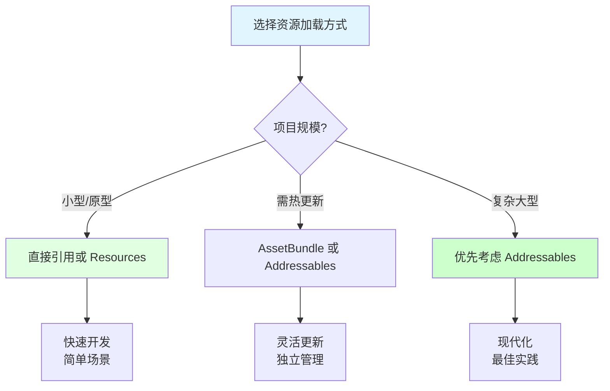

| 考虑因素 | 建议选择 |
|---------|----------|
| 小型/原型项目 | 直接引用或 Resources |
| 需热更新的项目 | AssetBundle 或 Addressables |
| 复杂大型项目 | 优先考虑 Addressables |
| 团队规模、项目复杂度 | 影响选择复杂度 |
| 更新频率 | 决定是否需要热更新支持 |

---

### Q2：解释 Unity 的内存管理机制和引用计数系统。如何避免常见的内存泄漏问题？

#### 🎯 Unity 内存管理核心机制

Unity 的内存管理基于两种机制：

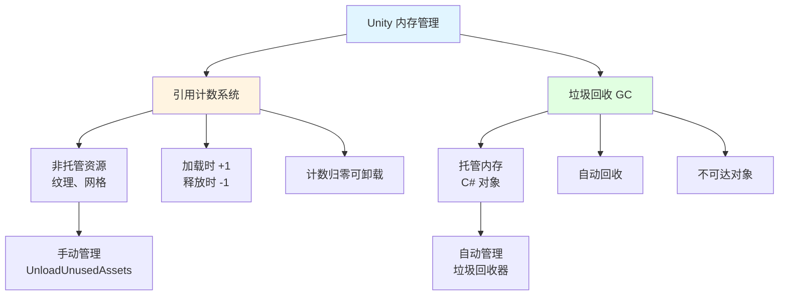

**引用计数系统：**

| 组件 | 说明 |
|------|------|
| **计数规则** | 资源被加载时计数 +1，引用被释放时计数 -1 |
| **卸载条件** | 当计数归零时，资源可被卸载 |
| **适用对象** | 非托管资源（纹理、网格等） |
| **托管内存** | 由 C# 垃圾回收器管理，主要存放对象实例 |

**托管与非托管内存：**

| 类型 | 说明 | 示例 |
|------|------|------|
| **托管内存** | 由 C# 垃圾回收器管理 | C# 对象实例 |
| **非托管内存** | 主要存放大型资源 | 纹理、网格、音频 |

#### ⚠️ 内存泄漏常见原因

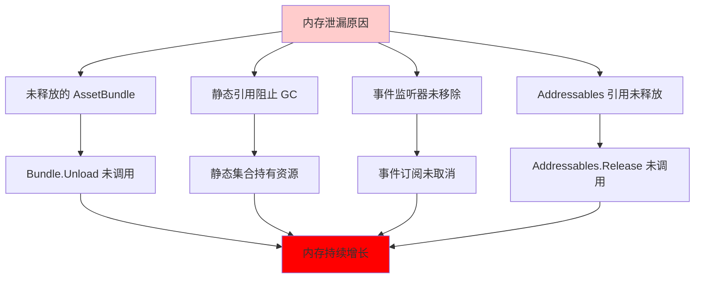

**详细问题说明：**

| 问题类型 | 原因 | 解决方案 |
|---------|------|----------|
| **未释放的 AssetBundle** | 没有调用 `Unload` | 追踪并正确卸载 |
| **静态引用** | 静态集合持有资源 | 使用可生命周期管理的方式 |
| **事件监听器** | 未移除事件订阅 | OnDisable 中取消订阅 |
| **Addressables** | 引用未释放 | 调用 `Release` 方法 |

#### ✅ 内存管理最佳实践

**1️⃣ 清晰的资源生命周期：**

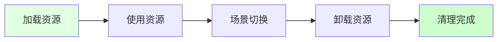

| 实践 | 说明 |
|------|------|
| ✅ **明确定义时机** | 定义加载和卸载时机 |
| ✅ **场景切换触发** | 使用场景切换作为资源管理触发点 |
| ✅ **定期清理** | 适当时机调用 `Resources.UnloadUnusedAssets()` |

**2️⃣ 使用对象池：**

| 实践 | 说明 |
|------|------|
| ✅ **频繁创建销毁** | 使用对象池减少 GC 压力 |
| ✅ **减少内存碎片** | 重用对象而非创建新对象 |

**3️⃣ 定期清理：**

| 实践 | 说明 |
|------|------|
| ✅ **UnloadUnusedAssets** | 场景切换时是清理的好时机 |
| ✅ **内存监控** | 使用 Profiler 监控内存使用 |

**4️⃣ 内存使用监控：**

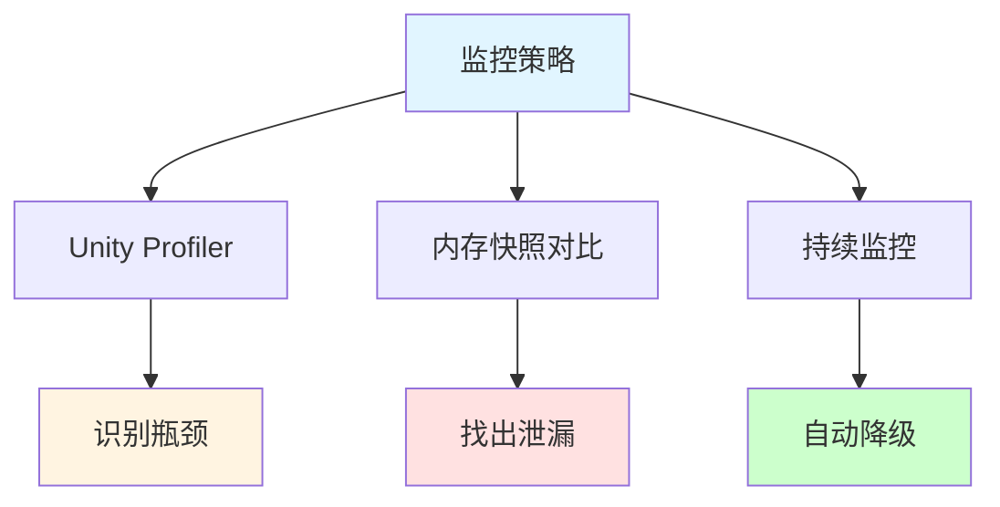

> [!tip] 总结
> 通过遵循这些最佳实践，可以有效避免内存泄漏，保持应用的内存使用在合理范围内。

---

### Q3：详细介绍 Unity Addressables 系统的核心概念和优势。

#### 🎯 Addressables 核心概念

Addressables 是 Unity 推出的现代资源管理系统：

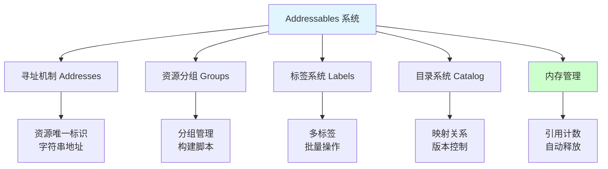

**核心概念详解：**

| 概念 | 说明 |
|------|------|
| **寻址机制** | 资源的唯一标识符，通常为字符串 |
| **标签** | 可为资源分配多个标签，便于批量操作 |
| **资源组** | 资源管理的基本单位，定义打包方式 |
| **目录** | 记录资源映射关系的清单文件 |
| **内存管理** | 自动引用计数系统 |

#### ✨ 主要优势

| 优势 | 说明 |
|------|------|
| 🎯 **统一 API** | 无论资源位置，使用相同 API 加载 |
| 🔄 **自动依赖管理** | 处理资源间的依赖关系 |
| 🌐 **灵活部署** | 支持本地加载、远程分发、CDN 部署 |
| 📦 **资源更新** | 内建版本控制和增量更新 |
| 📊 **分析工具** | 提供丰富的诊断和优化工具 |

#### 📊 资源组织最佳实践

**基于更新频率分组：**

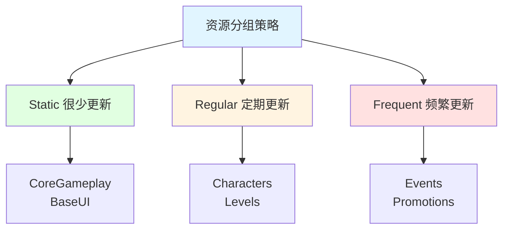

**基于功能模块分组：**

| 组别 | 内容 |
|------|------|
| **UI** | MainMenu、HUD |
| **Characters** | Players、NPCs |
| **Environments** | Urban、Forest |

**混合策略：**

| 策略 | 说明 |
|------|------|
| **LocalRequired** | 本地必需，如 CoreAssets |
| **RemotePreload** | 远程预加载，如 CurrentLevel |
| **RemoteOnDemand** | 按需加载，如 OptionalContent |

**组织核心原则：**

| 原则 | 说明 |
|------|------|
| ✅ **相关性** | 相关资源放同组 |
| ✅ **更新频率** | 更新频率相似的分在同组 |
| ✅ **加载时机** | 根据加载时机分组 |
| ✅ **大小均衡** | 避免单个组过大 |

> [!tip] 总结
> Addressables 系统代表了 Unity 现代资源管理的最佳实践，通过合理规划资源结构可以显著提高游戏加载性能、内存效率和可维护性。

---

## 🔗 相关链接

- [[Unity相关]] - 父主题索引
- [[Unity多线程]] - 相关主题：异步资源加载
- [[Gameobject的生命周期]] - 相关主题：资源初始化
