## 📊 图解

> [!info] 图示区
> 这里可以放置解释行为树和状态机的 mermaid 图表、UML 类图或其他辅助理解的图片

### 行为树结构

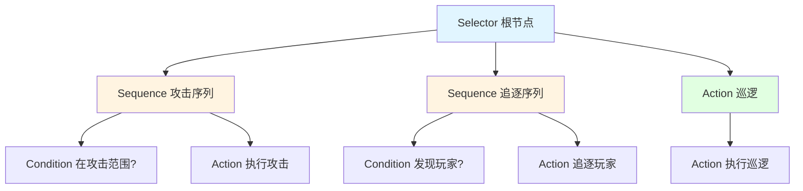

### 状态机结构

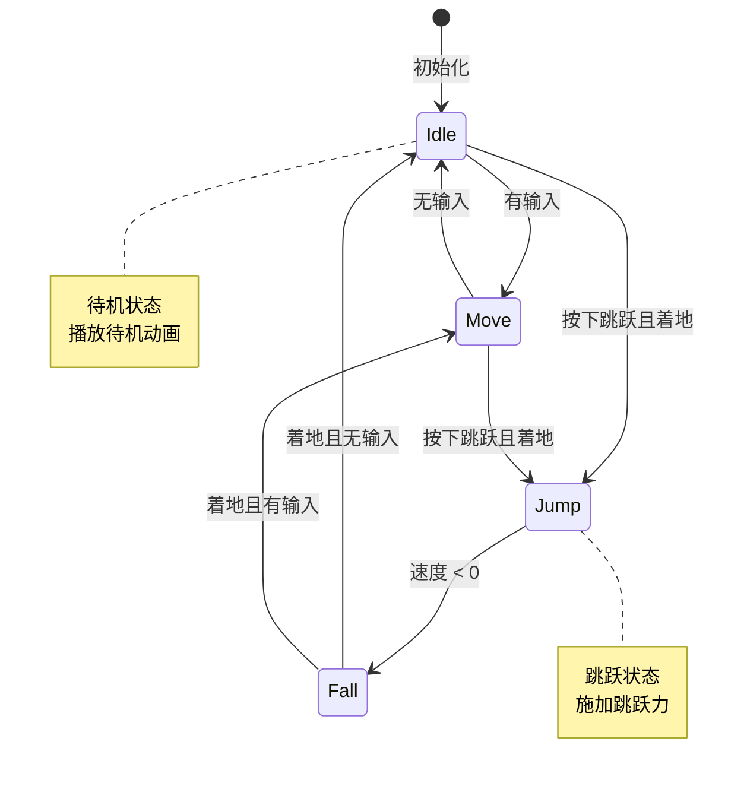

### 行为树节点类型

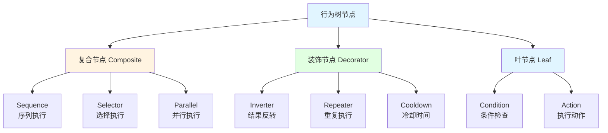

### 状态机 vs 行为树

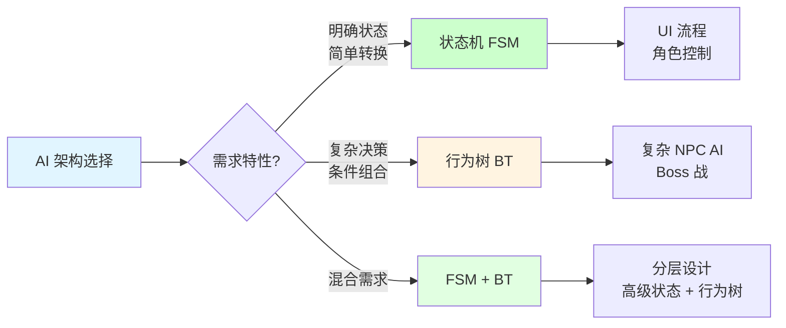

### 混合架构

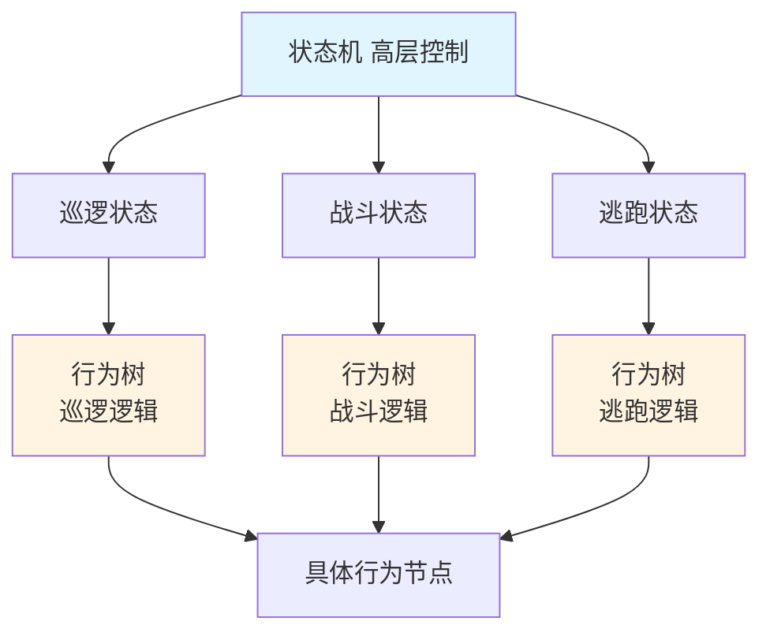

## 📖 原理

### 核心概念

行为树和状态机是两种在游戏开发中广泛使用的 AI 决策和控制流系统。

#### 🎯 行为树 (Behavior Tree)

层级化的树状结构，通过组合不同类型的节点来构建复杂的行为模式。

**核心节点类型：**

| 节点类型 | 说明 | 逻辑 |
|---------|------|------|
| **Sequence** | 序列节点 | 按顺序执行子节点，全部成功才成功 (AND) |
| **Selector** | 选择节点 | 按顺序执行子节点，一个成功就成功 (OR) |
| **Condition** | 条件节点 | 检查条件是否满足 |
| **Action** | 行为节点 | 执行具体行为 |
| **Decorator** | 装饰节点 | 修改子节点行为（反转、重复等） |

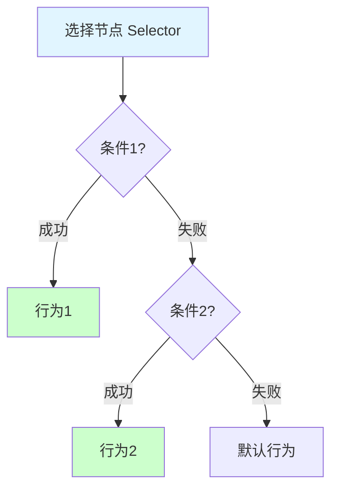

#### 🎯 状态机 (State Machine)

基于状态和转换的模型，系统在不同时刻只能处于一个明确的状态。

**核心组件：**

| 组件 | 说明 |
|------|------|
| **State 状态** | 定义系统在特定时期的行为 |
| **Transition 转换** | 从一个状态切换到另一个状态的条件 |
| **Event 事件** | 触发状态转换的外部刺激 |

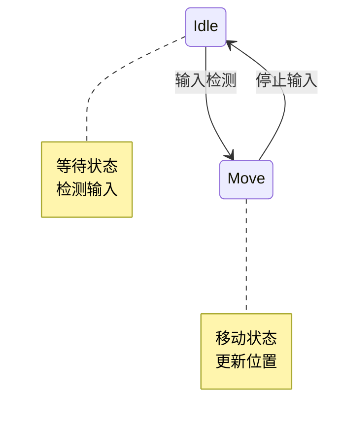

---

## 💡 面试题

### Q1：行为树和状态机有什么区别？它们各自适合什么场景？

#### 🎯 本质区别对比

行为树和状态机有本质上的区别：

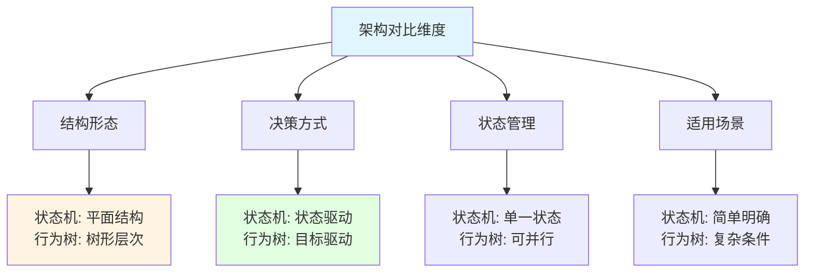

**结构差异：**

| 特性 | 状态机 | 行为树 |
|------|--------|--------|
| **结构形态** | 平面结构，状态和转换 | 树形层次，节点组合 |
| **当前状态** | 任何时刻只能处于一个状态 | 可以执行多个分支 |
| **决策过程** | 状态驱动，当前状态决定行为 | 目标驱动，评估多个行为 |
| **转换方式** | 显式定义转换条件 | 通过节点组合隐式处理 |

**决策过程对比：**

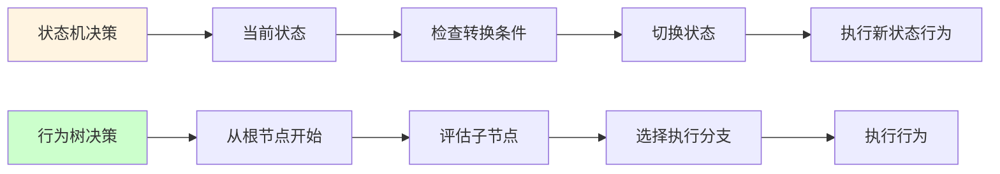

#### ✨ 状态机的特点

**优点：**

| 优点 | 说明 |
|------|------|
| 📊 **概念直观** | 易于理解和实现 |
| 🎯 **状态明确** | 流程清晰，可视化 |
| 🔧 **易于调试** | 状态关系明确 |
| 📈 **可视化** | 状态流程图直观 |

**缺点：**

| 缺点 | 说明 |
|------|------|
| 📈 **状态爆炸** | 状态数量增加时复杂度指数增长 |
| 🔁 **代码重复** | 共享行为需要重复代码 |
| 🚫 **表达能力有限** | 复杂条件逻辑难以表达 |
| 🎭 **层次困难** | 层级行为不易表达 |

**适用场景：**

| 场景 | 说明 |
|------|------|
| ✅ **明确的离散状态** | 角色站立、行走、攻击、死亡 |
| ✅ **UI 流程控制** | 菜单、游戏中、暂停 |
| ✅ **游戏阶段管理** | 介绍、主游戏、结束 |
| ✅ **简单到中等 AI** | 状态明确、转换简单 |

#### ✨ 行为树的特点

**优点：**

| 优点 | 说明 |
|------|------|
| 📦 **高度模块化** | 可重用性强 |
| 👁️ **逻辑清晰** | 行为结构可视化 |
| 🔧 **易于扩展** | 容易添加新行为 |
| 🎭 **部分成功/失败** | 支持复杂的执行状态 |
| 🔄 **灵活组合** | 通过节点组合实现复杂逻辑 |

**缺点：**

| 缺点 | 说明 |
|------|------|
| 📚 **学习曲线陡** | 需要理解节点类型和组合方式 |
| 🎯 **可能过度复杂** | 对于简单 AI 可能过于复杂 |
| 🔍 **状态管理** | 状态管理有时不直观 |
| 🐛 **调试困难** | 在大规模树中难以调试 |

**适用场景：**

| 场景 | 说明 |
|------|------|
| ✅ **复杂 NPC AI** | 需要多层次决策 |
| ✅ **多层次决策** | 需要考虑多种因素和条件 |
| ✅ **可重用行为** | 多个实体共享行为模式 |
| ✅ **高度条件化** | 需要根据多个条件决策 |

#### 💡 实际应用建议

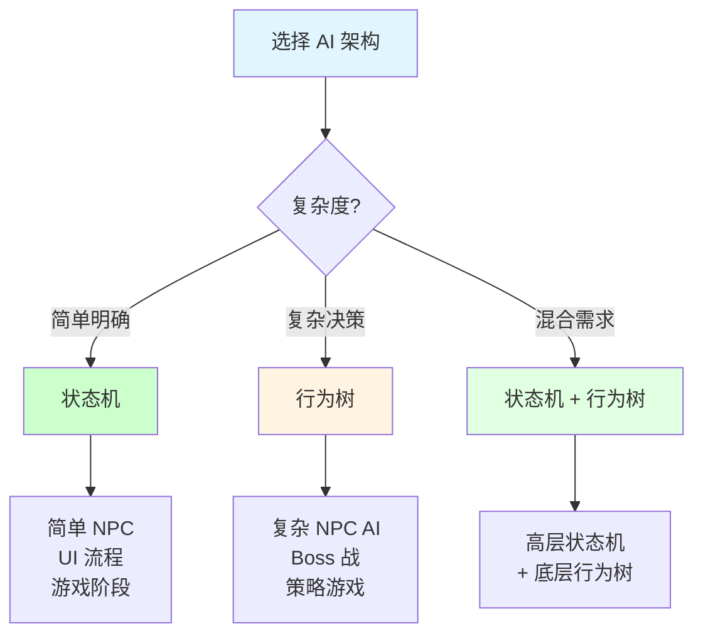

**混合使用策略：**

| 策略 | 说明 |
|------|------|
| 🎮 **简单 NPC** | 使用状态机 |
| 👹 **复杂敌人** | 使用行为树 |
| 🏰 **分层设计** | 状态机管理高级状态，行为树处理细节 |

> [!tip] 实践经验
> 在实际项目中，混合使用状态机和行为树是一个很好的策略，可以在简单性和复杂性之间取得良好的平衡。

---

### Q2：在 Unity 中如何实现状态机？

#### 🎯 状态机核心实现

状态机的实现包含三个核心组件：

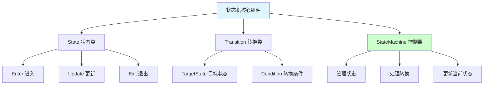

**基础实现：**

```csharp
// 状态基类
public abstract class State {
    public virtual void Enter() { }    // 进入状态时执行
    public virtual void Update() { }   // 状态更新时执行
    public virtual void Exit() { }     // 离开状态时执行
}

// 转换类
public class Transition {
    public State TargetState { get; private set; }
    public System.Func<bool> Condition { get; private set; }
    
    public Transition(State targetState, System.Func<bool> condition) {
        TargetState = targetState;
        Condition = condition;
    }
}

// 状态机控制器
public class StateMachine {
    private State currentState;
    private Dictionary<State, List<Transition>> transitions = new Dictionary<State, List<Transition>>();
    
    public void Update() {
        // 检查转换条件
        if (currentState != null && transitions.ContainsKey(currentState)) {
            foreach (var transition in transitions[currentState]) {
                if (transition.Condition()) {
                    ChangeState(transition.TargetState);
                    break;
                }
            }
        }
        
        // 更新当前状态
        currentState?.Update();
    }
    
    public void AddTransition(State fromState, State toState, System.Func<bool> condition) {
        if (!transitions.ContainsKey(fromState)) {
            transitions[fromState] = new List<Transition>();
        }
        transitions[fromState].Add(new Transition(toState, condition));
    }
    
    public void SetState(State state) {
        if (currentState == state) return;
        currentState?.Exit();
        currentState = state;
        currentState?.Enter();
    }
    
    public State GetCurrentState() {
        return currentState;
    }
}
```

#### 💼 实际应用示例

**角色控制器状态机：**

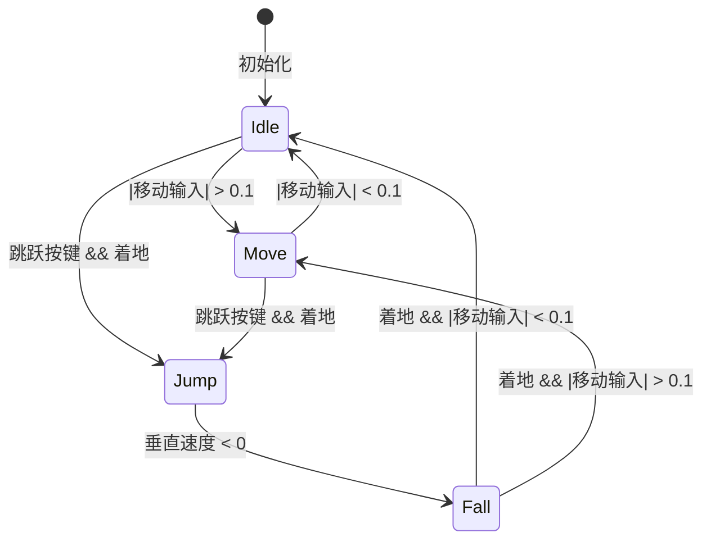

**使用示例：**

```csharp
public class PlayerController : MonoBehaviour {
    private StateMachine stateMachine;
    
    void Start() {
        stateMachine = new StateMachine();
        
        // 创建状态
        var idleState = new IdleState(this);
        var moveState = new MoveState(this);
        var jumpState = new JumpState(this);
        
        // 配置转换
        stateMachine.AddTransition(idleState, moveState, () => Mathf.Abs(Input.GetAxis("Horizontal")) > 0.1f);
        stateMachine.AddTransition(moveState, idleState, () => Mathf.Abs(Input.GetAxis("Horizontal")) < 0.1f);
        stateMachine.AddTransition(idleState, jumpState, () => Input.GetButtonDown("Jump") && IsGrounded());
        
        // 设置初始状态
        stateMachine.SetState(idleState);
    }
    
    void Update() {
        stateMachine.Update();
    }
}
```

#### 🔧 扩展功能

**1️⃣ 分层状态机：**

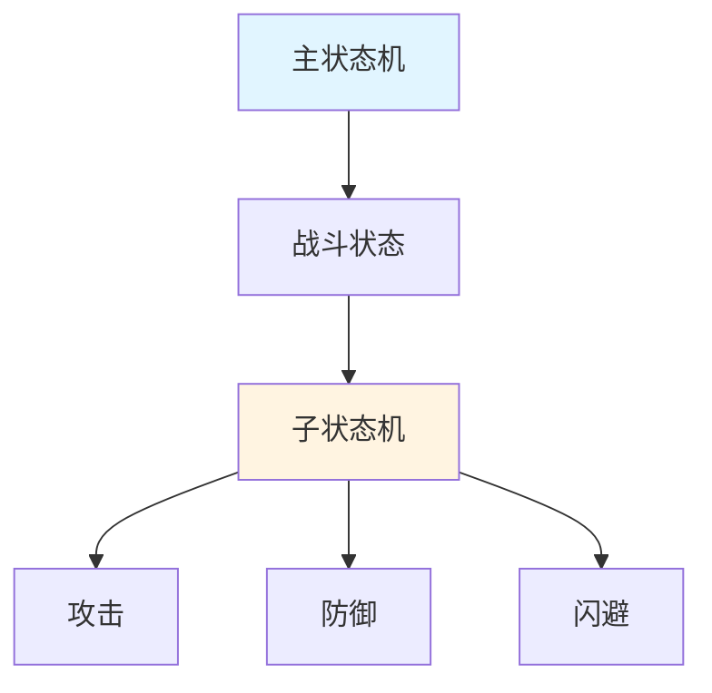

**2️⃣ 状态机数据共享（BlackBoard）：**

```csharp
public class BlackBoard {
    private Dictionary<string, object> data = new Dictionary<string, object>();
    
    public void SetValue<T>(string key, T value) {
        data[key] = value;
    }
    
    public T GetValue<T>(string key, T defaultValue = default) {
        if (data.TryGetValue(key, out object value) && value is T typedValue) {
            return typedValue;
        }
        return defaultValue;
    }
}
```

**3️⃣ 状态历史记录：**

```csharp
public class StateMachineWithHistory : StateMachine {
    private List<State> stateHistory = new List<State>();
    
    public override void SetState(State state) {
        base.SetState(state);
        stateHistory.Add(state);
    }
    
    public State GetPreviousState() {
        return stateHistory.Count > 1 ? stateHistory[stateHistory.Count - 2] : null;
    }
}
```

> [!tip] 总结
> 状态机因其简单明了的结构和直观的行为表示，非常适合实现角色控制、UI 流程、游戏阶段管理等场景。对于更复杂的行为，可以考虑将其与行为树结合使用。

---

### Q3：如何将行为树和状态机结合使用？

#### 🎯 结合使用的策略

在很多复杂游戏系统中，行为树和状态机可以有效地结合使用，发挥各自优势。

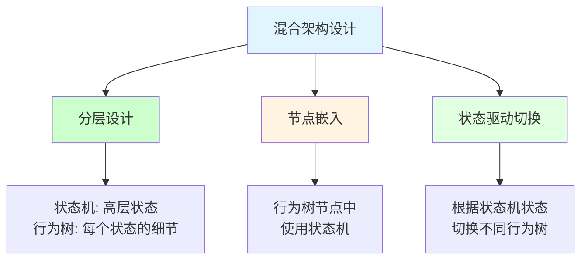

#### 💡 结合方式详解

**方式 1️⃣：分层设计**


**实现示例：**

```csharp
public class HybridAIController : MonoBehaviour {
    private StateMachine stateMachine;
    private Dictionary<State, BehaviorTree> behaviorTrees = new Dictionary<State, BehaviorTree>();
    
    void Start() {
        // 创建主状态机
        stateMachine = new StateMachine();
        
        // 创建主要状态
        var patrolState = new PatrolState();
        var combatState = new CombatState();
        
        // 添加状态转换
        stateMachine.AddTransition(patrolState, combatState, () => IsEnemyDetected());
        stateMachine.AddTransition(combatState, patrolState, () => !IsEnemyNearby());
        
        // 为每个状态创建行为树
        behaviorTrees[patrolState] = CreatePatrolBehaviorTree();
        behaviorTrees[combatState] = CreateCombatBehaviorTree();
        
        // 设置初始状态
        stateMachine.SetState(patrolState);
    }
    
    void Update() {
        // 更新状态机
        State currentState = stateMachine.GetCurrentState();
        stateMachine.Update();
        
        // 更新当前状态对应的行为树
        if (currentState != null && behaviorTrees.ContainsKey(currentState)) {
            behaviorTrees[currentState].Update();
        }
    }
}
```

**方式 2️⃣：行为树节点中使用状态机**

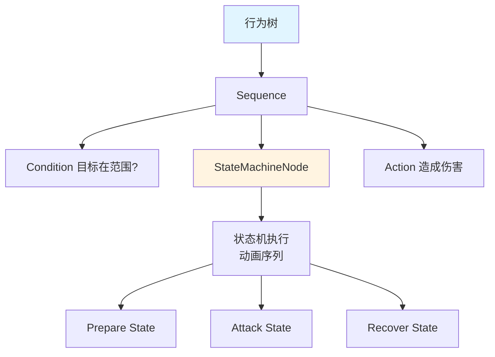

**实现示例：**

```csharp
public class StateMachineNode : BehaviorNode {
    private StateMachine stateMachine;
    private State successState;
    private State failureState;
    
    public override NodeStatus Execute() {
        // 更新状态机
        stateMachine.Update();
        
        State currentState = stateMachine.GetCurrentState();
        
        // 检查是否达到成功或失败状态
        if (successState != null && currentState == successState) {
            Status = NodeStatus.Success;
            return Status;
        }
        
        if (failureState != null && currentState == failureState) {
            Status = NodeStatus.Failure;
            return Status;
        }
        
        Status = NodeStatus.Running;
        return Status;
    }
}
```

#### 🎮 实际应用场景

**应用场景 1️⃣：开放世界游戏 NPC**

| 层级 | 系统类型 | 职责 |
|------|----------|------|
| **高层** | 状态机 | 管理巡逻、战斗、交互、休息 |
| **底层** | 行为树 | 处理每个状态内的具体行为 |

**应用场景 2️⃣：复杂 Boss AI**

| 层级 | 系统类型 | 职责 |
|------|----------|------|
| **高层** | 状态机 | 管理战斗阶段（正常、狂暴、虚弱） |
| **底层** | 行为树 | 控制每个阶段的攻击模式和策略 |

**应用场景 3️⃣：玩家控制系统**

| 层级 | 系统类型 | 职责 |
|------|----------|------|
| **高层** | 状态机 | 处理基本移动状态（站立、行走、跑步、跳跃） |
| **底层** | 行为树 | 管理复杂的战斗动作和组合技 |

#### 📊 选择指南

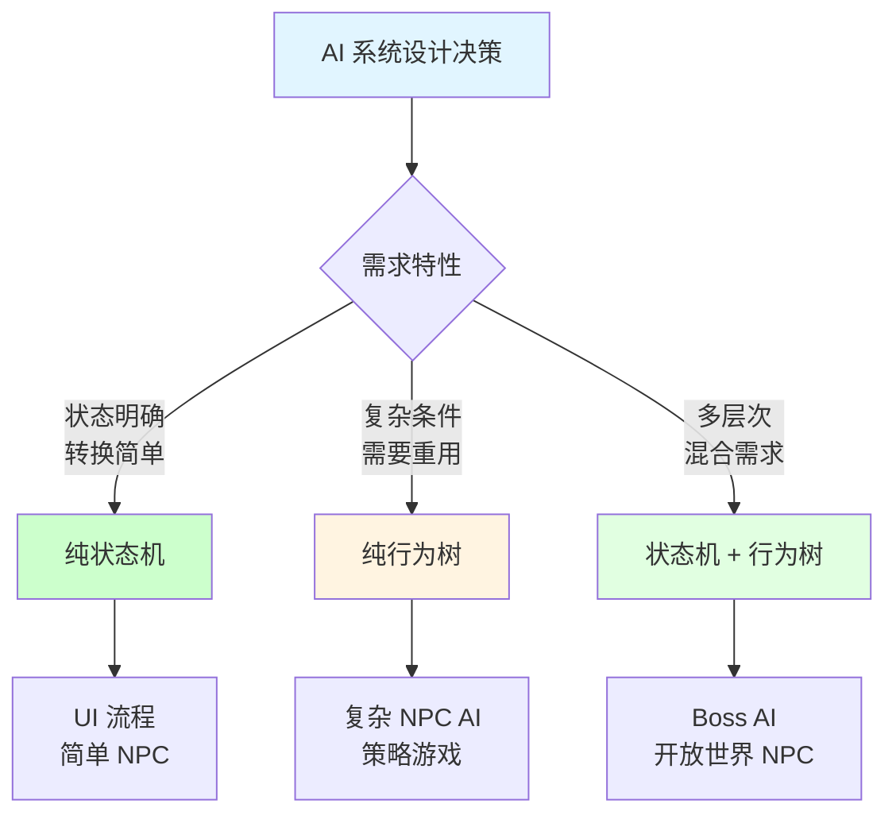

> [!tip] 最佳实践
> 在实际项目中，根据具体需求选择合适的架构。简单系统使用纯状态机，复杂 AI 使用纯行为树，多层次系统使用混合架构。

---

## 🔗 相关链接

- [[Unity相关]] - 父主题索引
- [[Gameobject的生命周期]] - 相关主题：状态管理
- [[Unity多线程]] - 相关主题：AI 性能优化
