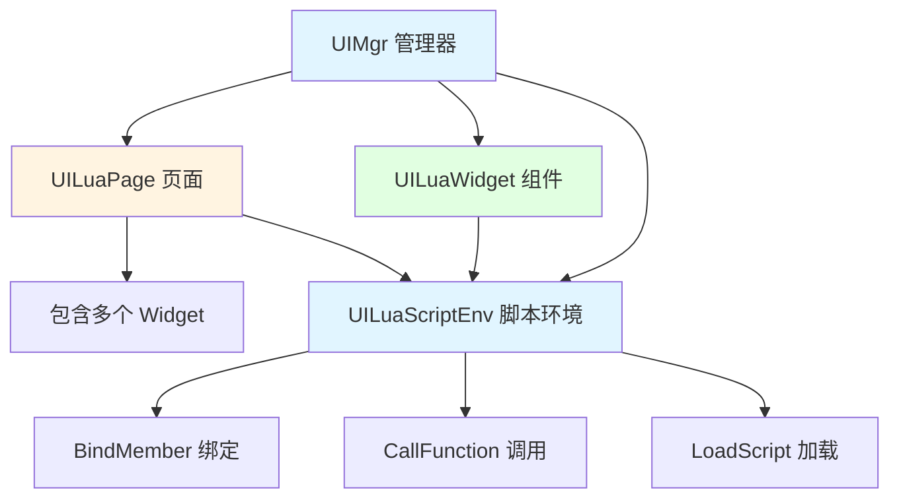
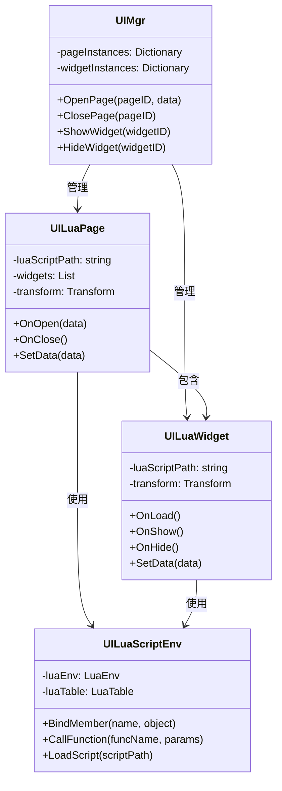
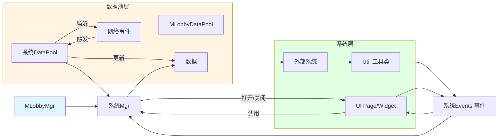
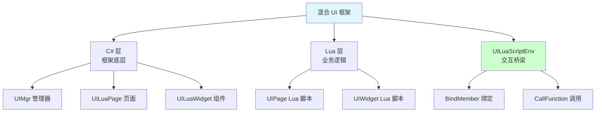
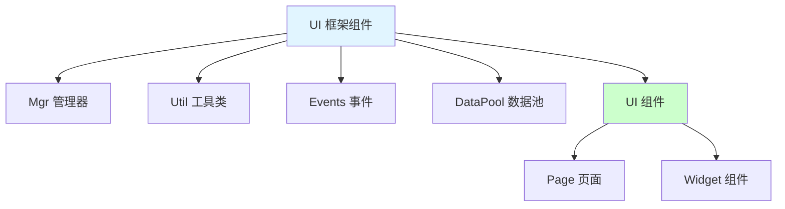

## 📊 图解

> [!info] 图示区
> 这里可以放置解释 UI 系统框架的 mermaid 图表、UML 类图或其他辅助理解的图片

### C# 层 UI 框架架构



### 核心类关系图



### 页面打开流程

```mermaid
sequenceDiagram
    participant Caller as 调用者
    participant UIMgr as UIManager
    participant Page as UILuaPage
    participant Widget as UILuaWidget
    participant Script as UILuaScriptEnv
    participant Lua as Lua VM

    Caller->>UIMgr: OpenPage(pageName, data)
    UIMgr->>UIMgr: 检查是否已打开
    
    alt 页面未打开
        UIMgr->>Page: 创建页面实例
        Page->>Page: InitializeLuaPage()
        
        par 初始化子组件
            Page->>Widget: InitializeLuaWidget()
            Widget->>Script: BindMember(C# Widget)
        and 绑定 Lua 脚本
            Page->>Script: BindMember(C# Page)
            Script->>Lua: 加载 Lua 脚本
            Lua-->>Script: 返回 Lua 表
        end
        
        UIMgr->>Script: CallFunction("_OpenPage", data)
        Script->>Lua: 执行 Lua 逻辑
        Lua-->>UIMgr: 页面打开成功
    end
    
    UIMgr-->>Caller: 页面打开完成

    style Caller fill:#e1ffe1
    style UIMgr fill:#fff4e1
    style Lua fill:#e1f5ff
```

### 系统通信架构



## 📖 原理

### 核心概念

这个 UI 框架采用基于 Lua 的混合架构，将 Unity UI 系统与 Lua 脚本结合，实现了解耦和热更新能力。

#### 🎯 三层架构设计

| 层级 | 组件 | 职责 |
|------|------|------|
| **管理层** | UIMgr | 处理页面打开、关闭等全局管理 |
| **页面层** | UILuaPage | 管理页面生命周期和所有子组件 |
| **组件层** | UILuaWidget | 可复用的 UI 组件，支持动态添加 |

#### 🔧 核心特性

**1️⃣ Lua 驱动的 UI 逻辑：**

| 特性 | 说明 |
|------|------|
| 📝 **XLua 引擎** | 使用 XLua 作为 Lua 脚本引擎 |
| 🎮 **职责分离** | C# 负责框架底层，Lua 负责业务逻辑 |
| 🌉 **脚本环境** | 通过 UILuaScriptEnv 提供 C# 与 Lua 的交互 |

**2️⃣ 组件化设计：**

| 特性 | 说明 |
|------|------|
| 📦 **页面管理** | UILuaPage 管理页面生命周期 |
| 🧩 **组件复用** | UILuaWidget 实现可复用的 UI 组件 |
| ⚡ **动态加载** | 支持组件动态添加和移除 |

**3️⃣ 数据绑定机制：**

| 特性 | 说明 |
|------|------|
| 🔗 **自动绑定** | 各种类型变量的自动绑定（Vector3, Color, Int 等） |
| 🔄 **对象映射** | C# 对象到 Lua 的映射 |
| ⏰ **延迟绑定** | LazyBind 机制优化性能 |

**4️⃣ 性能优化：**

| 特性 | 说明 |
|------|------|
| 💾 **页面缓存** | 页面缓存与重用机制 |
| 📊 **引用计数** | 组件引用计数与内存管理 |
| 🔍 **性能监控** | 性能监控和分析工具 |

**5️⃣ 生命周期管理：**

| 特性 | 说明 |
|------|------|
| 📄 **页面生命周期** | OnOpen, OnShow, OnHide, OnClose |
| 🧩 **组件生命周期** | OnLoad, OnEnable, OnDisable, OnUnload |
| 🤖 **自动管理** | 自动管理 Lua 对象的创建和销毁 |

---

## 💡 面试题

### Q1：你们的 C# 的 UI 框架是如何实现的？

#### 🎯 框架核心架构

这个项目使用的是一个**基于 Lua 的混合 UI 框架**，核心是将 Unity 的 UI 系统与 Lua 脚本结合起来，实现了很好的解耦。



#### 📋 架构分层详解

**从架构上看，整个框架分为三层：**

| 层级 | 组件 | 职责 |
|------|------|------|
| **管理层** | UIMgr | 处理页面的打开、关闭等操作 |
| **页面层** | UILuaPage | 管理页面的生命周期和所有子组件 |
| **组件层** | UILuaWidget | 可以被复用和动态添加 |

#### 🔧 核心工作机制

**1️⃣ Lua 驱动机制：**

```mermaid
sequenceDiagram
    participant CSharp as C# 层
    participant ScriptEnv as UILuaScriptEnv
    participant Lua as Lua VM

    CSharp->>ScriptEnv: 创建页面
    ScriptEnv->>Lua: 加载 Lua 脚本
    Lua-->>ScriptEnv: 返回 Lua 表
    
    CSharp->>ScriptEnv: BindMember 绑定 C# 对象
    ScriptEnv->>Lua: 注册到 Lua 环境
    
    CSharp->>ScriptEnv: CallFunction("_OpenPage")
    ScriptEnv->>Lua: 调用 Lua 方法
    Lua-->>CSharp: 执行业务逻辑

    style CSharp fill:#fff4e1
    style Lua fill:#e1ffe1
```

所有 UI 页面和组件都有对应的 Lua 脚本，通过 UILuaScriptEnv 建立 C# 和 Lua 之间的桥梁。

**2️⃣ 对象绑定机制：**

C# 对象可以通过 `BindMember` 方法绑定到 Lua 环境中，Lua 脚本则通过规定的生命周期函数响应 UI 事件。

| 生命周期函数 | 调用时机 |
|-------------|----------|
| `_OpenPage` | 页面被创建时 |
| `_Load` | 组件加载时 |
| `_OnEnable` | 组件启用时 |
| `_OnDisable` | 组件禁用时 |
| `_ClosePage` | 页面关闭时 |

**3️⃣ 性能优化机制：**

在性能优化方面，框架实现了：

| 优化机制 | 说明 |
|---------|------|
| ⏰ **延迟绑定** | 只在真正需要使用 UI 组件时才进行数据绑定 |
| 💾 **页面缓存** | 页面缓存与重用，避免重复创建 |
| 📊 **引用计数** | 完善的内存管理和引用计数系统 |
| 🔄 **对象池** | 防止内存泄漏 |

#### ✨ 设计优势

| 优势 | 说明 |
|------|------|
| 🔥 **热更新** | UI 逻辑可以热更新（因为在 Lua 中） |
| 🧩 **高度可复用** | UI 组件高度可复用 |
| ⚡ **良好性能** | 保持良好的性能 |
| 🔧 **易于维护** | 代码结构清晰，易于维护 |

#### ⚠️ 潜在挑战

| 挑战 | 说明 |
|------|------|
| 📚 **复杂性** | 需要同时维护 C# 和 Lua 两套代码 |
| 🐛 **调试困难** | 跨语言调试相对困难 |
| 📖 **学习成本** | 需要理解两种语言的交互机制 |

> [!tip] 总结
> 这种设计最显著的优势在于：UI 逻辑可以热更新，UI 组件高度可复用，同时保持了良好的性能。但也带来了一定的复杂性，需要同时维护 C# 和 Lua 两套代码。

---

### Q2：介绍一下你们的 Lua 的 UI 框架架构及其优势

#### 🎯 框架核心组件

我们采用了一个**高度模块化、低耦合**的 UI 框架。框架主要由以下组件构成：



#### 🔧 组件职责详解

| 组件 | 职责 | 说明 |
|------|------|------|
| **Mgr** | 核心管理器 | 处理系统核心逻辑和 UI 管理 |
| **Util** | 工具类 | 提供给外界调用的接口 |
| **Events** | 事件系统 | 定义所有系统相关的消息类型 |
| **DataPool** | 数据池 | 存储数据并监听网络消息 |
| **Page** | 页面 | UI 页面组件 |
| **Widget** | 组件 | 可复用的 UI 组件 |

#### 💡 系统间通信机制

**关键设计：系统间通过消息机制通信而非直接调用**

```mermaid
sequenceDiagram
    participant Activity as 活动系统
    participant Shop as 商城系统
    participant Events as 事件总线

    Activity->>Events: 发送购买请求事件
    Events->>Shop: 分发事件
    Shop->>Shop: 处理购买逻辑
    Shop->>Events: 发送购买结果事件
    Events->>Activity: 分发结果
    Activity->>Activity: 更新 UI

    style Activity fill:#e1ffe1
    style Shop fill:#fff4e1
    style Events fill:#ccffcc
```

#### ✨ 架构优势

**1️⃣ 系统间低耦合：**

| 优势 | 说明 |
|------|------|
| 🔓 **独立开发** | 修改一个系统不影响其他系统 |
| 🗑️ **安全删除** | 可以删除一个系统的 Mgr 而不需要修改其他代码 |
| 🐛 **减少 Bug** | 系统间低耦合极大减少了 bug 出现的可能 |

**2️⃣ 统一的结构模式：**

| 优势 | 说明 |
|------|------|
| 📖 **易于理解** | 所有系统组件遵循相同的设计规范 |
| 🔍 **快速定位** | 开发人员可以轻松预测功能的位置、命名和实现方式 |
| 📚 **降低学习成本** | 大幅降低了学习成本和维护难度 |

**3️⃣ 消息传递机制：**

| 优势 | 说明 |
|------|------|
| 📨 **非直接调用** | 通过消息传递而非直接调用实现系统间通信 |
| 🔌 **功能扩展** | Util 类实际通过生成消息发送给 Mgr 实现功能 |
| ⚡ **优先级机制** | 可以利用消息优先级机制进行功能扩展 |
| 🚫 **无需修改** | 无需修改原有代码即可扩展功能 |

**4️⃣ 双语言支持：**

| 优势 | 说明 |
|------|------|
| 🔒 **C# 部分** | 用于固化的不可热更新部分 |
| 🔄 **Lua 部分** | 用于需要热更新的资源部分 |
| ⚖️ **灵活性** | 提供良好的灵活性和可维护性 |

> [!tip] 总结
> 这种框架设计大大降低了维护成本，提高了开发效率，同时保持了系统的可扩展性和灵活性。

---

## 🔗 相关链接

- [[UI框架]] - 父主题索引
- [[Lua驱动的UI交互]] - 相关主题：Lua 与 C# 交互
- [[UI组件化设计]] - 相关主题：Page 和 Widget 设计
- [[UI数据绑定与生命周期]] - 相关主题：数据绑定与生命周期
- [[UI性能优化与热更新]] - 相关主题：性能优化与热更新
