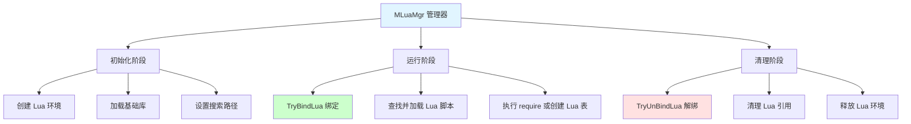
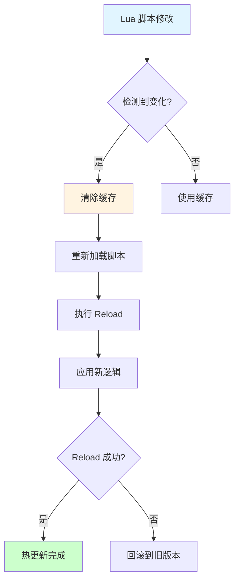
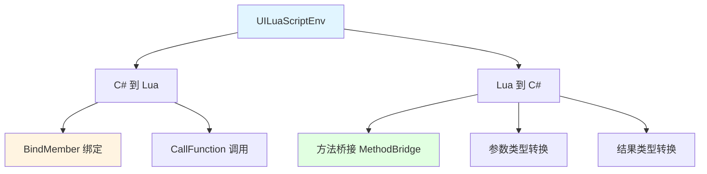

## 📊 图解

> [!info] 图示区
> 这里可以放置解释 Lua 驱动 UI 交互的 mermaid 图表、UML 类图或其他辅助理解的图片

### C# 与 Lua 交互流程

```mermaid
sequenceDiagram
    participant CSharp as C# 调用者
    participant ScriptEnv as UILuaScriptEnv
    participant LuaState as Lua 虚拟机
    participant LuaStack as Lua 栈
    participant LuaVM as Lua VM

    CSharp->>ScriptEnv: CallFunction(funcName, args)
    ScriptEnv->>ScriptEnv: 查找缓存的 LuaFunction
    
    alt 未命中缓存
        ScriptEnv->>LuaState: GetGlobal(funcName)
        LuaState-->>ScriptEnv: 返回 LuaFunction
        ScriptEnv->>ScriptEnv: 缓存 LuaFunction
    end
    
    ScriptEnv->>LuaStack: PushFunction(func)
    
    loop 遍历参数
        ScriptEnv->>LuaStack: PushArg(arg)
    end
    
    ScriptEnv->>LuaVM: PCall(argCount, retCount)
    LuaVM->>LuaVM: 执行 Lua 函数逻辑
    LuaVM-->>LuaStack: 返回结果压栈
    
    loop 遍历返回值
        ScriptEnv->>LuaStack: ReadResult(index)
        LuaStack-->>ScriptEnv: LuaValue
        ScriptEnv->>ScriptEnv: ConvertToCSharpType()
    end
    
    ScriptEnv-->>CSharp: return result

    style CSharp fill:#fff4e1
    style LuaVM fill:#e1ffe1
```

### Lua 调用 C# 方法流程

```mermaid
sequenceDiagram
    participant LuaScript as Lua 脚本
    participant LuaVM as Lua VM
    participant LuaStack as Lua 栈
    participant ScriptEnv as UILuaScriptEnv
    participant MethodBridge as 方法桥接
    participant CSharpObj as C# 对象

    LuaScript->>LuaVM: 调用 obj:Func(a, b)
    LuaVM->>ScriptEnv: 触发 __index / method bridge
    ScriptEnv->>MethodBridge: ResolveMethod(obj, "Func")
    MethodBridge->>MethodBridge: 获取 MethodInfo / Delegate
    MethodBridge-->>ScriptEnv: 返回可调用桥接函数
    
    ScriptEnv->>LuaStack: ReadArg(1..n)
    LuaStack-->>ScriptEnv: Lua 参数
    ScriptEnv->>ScriptEnv: Convert Lua -> C# types
    
    ScriptEnv->>CSharpObj: Invoke(Func, convertedArgs)
    CSharpObj-->>ScriptEnv: result
    
    ScriptEnv->>ScriptEnv: Convert C# -> Lua type
    ScriptEnv->>LuaStack: PushResult(result)
    LuaStack-->>LuaVM: 返回结果
    LuaVM-->>LuaScript: Lua 获取调用结果

    style LuaScript fill:#e1ffe1
    style CSharpObj fill:#fff4e1
```

### MLuaMgr 工作流程



### 重载机制（开发模式）



## 📖 原理

### 核心概念

Lua 驱动的 UI 交互是整个框架的核心特性，实现了 C# 和 Lua 的无缝集成。

#### 🎯 双向调用机制

**C# 调用 Lua：**

| 步骤 | 说明 |
|------|------|
| 1️⃣ **查找函数** | 在 Lua 环境中查找目标函数 |
| 2️⃣ **参数转换** | 将 C# 参数转换为 Lua 类型 |
| 3️⃣ **函数调用** | 使用 PCall 调用 Lua 函数 |
| 4️⃣ **结果转换** | 将返回值从 Lua 转换为 C# 类型 |

**Lua 调用 C#：**

| 步骤 | 说明 |
|------|------|
| 1️⃣ **方法解析** | 通过 __index 或 method bridge 解析方法 |
| 2️⃣ **参数转换** | 将 Lua 参数转换为 C# 类型 |
| 3️⃣ **方法调用** | 使用反射或委托调用 C# 方法 |
| 4️⃣ **结果转换** | 将返回值从 C# 转换为 Lua 类型 |

#### 🔧 MLuaMgr 管理器

MLuaMgr 是 Lua 环境的核心管理器，负责：

| 职责 | 说明 |
|------|------|
| 🏗️ **环境创建** | 创建和初始化 Lua 虚拟机 |
| 📦 **脚本加载** | 加载和管理 Lua 脚本文件 |
| 🔄 **绑定管理** | 管理 C# 对象与 Lua 的绑定 |
| 🗑️ **资源清理** | 清理 Lua 引用和释放资源 |

---

## 💡 面试题

### Q：详细介绍你们的 Lua 的 UI 框架是如何实现 C# 和 Lua 的交互的？

#### 🎯 核心交互机制

我们的框架通过 **UILuaScriptEnv** 类建立 C# 和 Lua 之间的桥梁，实现了双向无缝交互。



#### 📋 详细的交互流程

**C# 调用 Lua 函数：**

```mermaid
sequenceDiagram
    participant UIMgr as UI Manager
    participant Page as UILuaPage
    participant ScriptEnv as UILuaScriptEnv
    participant Lua as Lua VM

    UIMgr->>Page: 打开页面
    Page->>ScriptEnv: CallFunction("_OpenPage", data)
    
    ScriptEnv->>ScriptEnv: 查找缓存的 LuaFunction
    alt 未命中缓存
        ScriptEnv->>Lua: GetGlobal("_OpenPage")
        Lua-->>ScriptEnv: 返回 LuaFunction
        ScriptEnv->>ScriptEnv: 缓存函数
    end
    
    ScriptEnv->>Lua: PushFunction(_OpenPage)
    ScriptEnv->>Lua: PushArg(data)
    ScriptEnv->>Lua: PCall(1, 0)
    
    Lua->>Lua: 执行 Lua 逻辑
    Lua-->>ScriptEnv: 返回结果
    ScriptEnv-->>UIMgr: 页面初始化完成

    style UIMgr fill:#fff4e1
    style Lua fill:#e1ffe1
```

**关键代码实现：**

```csharp
public class UILuaScriptEnv {
    private LuaEnv luaEnv;
    private Dictionary<string, LuaFunction> functionCache = new Dictionary<string, LuaFunction>();
    
    // 调用 Lua 函数
    public object CallFunction(string funcName, params object[] args) {
        // 查找或获取函数
        if (!functionCache.TryGetValue(funcName, out LuaFunction luaFunc)) {
            luaFunc = luaEnv.Global.Get<LuaFunction>(funcName);
            functionCache[funcName] = luaFunc;
        }
        
        // 调用函数
        return luaFunc.Call(args);
    }
    
    // 绑定 C# 对象到 Lua
    public void BindMember(string name, object obj) {
        luaEnv.Global.Set(name, obj);
    }
}
```

**Lua 调用 C# 方法：**

```lua
-- Lua 代码中调用 C# 方法
function UIPage:_OnClickButton()
    -- 调用 C# 对象的方法
    self.csObj:SetActive(false)
    
    -- 或者通过 UI 框架接口
    UIMgr.ClosePage("PageName")
end
```

#### ✨ 交互机制的优势

| 优势 | 说明 |
|------|------|
| 🔄 **双向通信** | C# 和 Lua 可以互相调用 |
| 🎯 **类型转换** | 自动处理类型转换 |
| 💾 **函数缓存** | 缓存 Lua 函数提升性能 |
| 🔒 **类型安全** | 通过泛型和方法签名保证类型安全 |

#### ⚠️ 注意事项

| 注意事项 | 说明 |
|---------|------|
| 🐛 **调试困难** | 跨语言调试比单一语言环境更复杂 |
| 💾 **内存管理** | 需要注意 C# 对象和 Lua 对象之间的引用关系 |
| 📊 **性能开销** | 类型转换和跨语言调用有一定性能开销 |

> [!tip] 最佳实践
> 在实际使用中，应该：
> 1. 尽量减少跨语言调用次数
> 2. 批量传递数据而非逐个属性调用
> 3. 缓存常用的 Lua 函数和 C# 对象引用
> 4. 注意 Lua 对象的生命周期管理，避免内存泄漏

---

## 🔗 相关链接

- [[UI框架]] - 父主题索引
- [[UI系统框架]] - 相关主题：C# 层架构
- [[C#和Lua交互]] - 相关主题：XLua 交互机制
