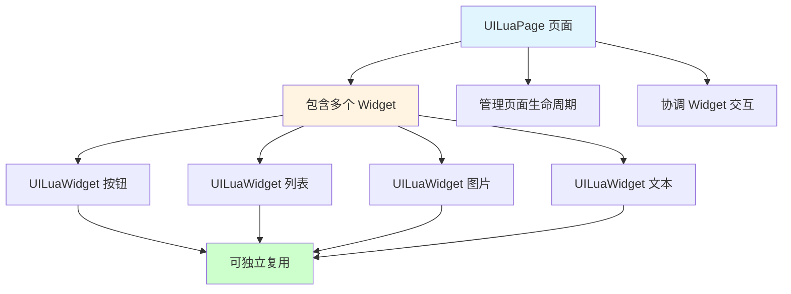
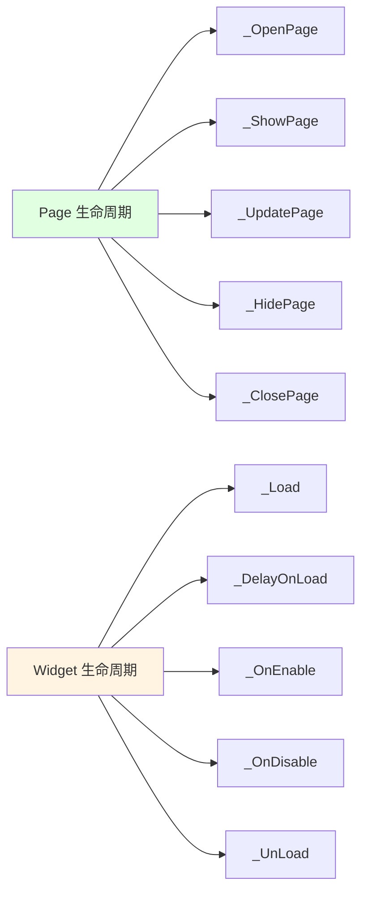
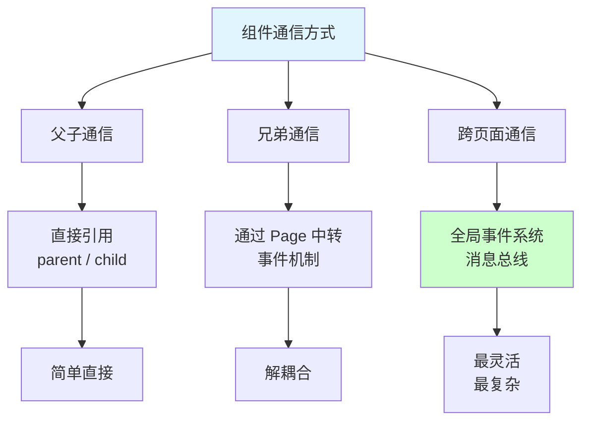
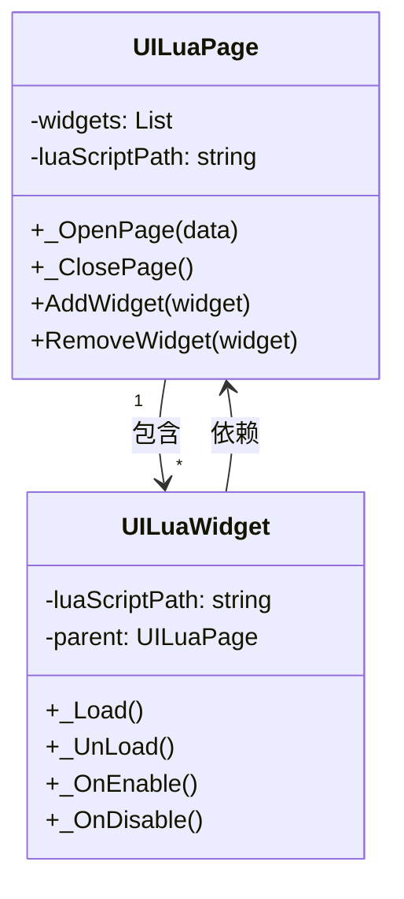
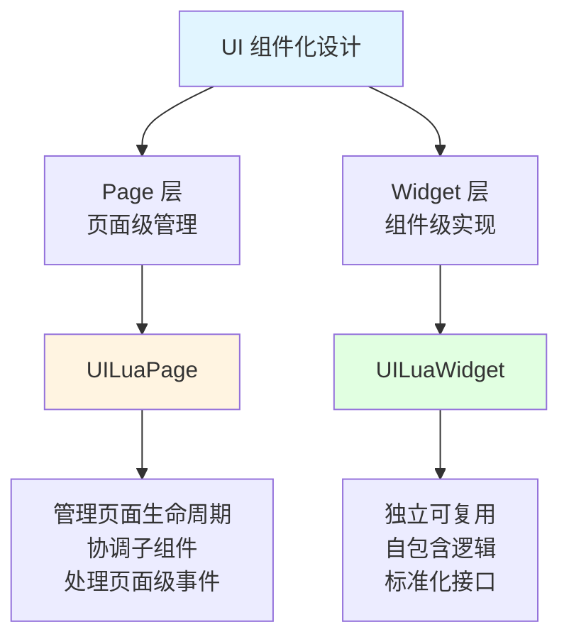
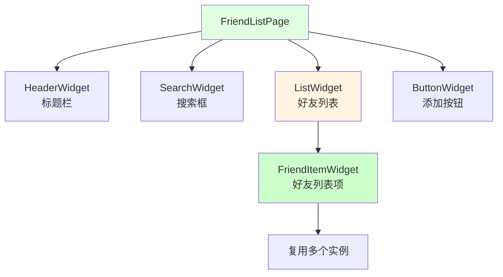

## 📊 图解

> [!info] 图示区
> 这里可以放置解释 UI 组件化设计的 mermaid 图表、UML 类图或其他辅助理解的图片

### Page 与 Widget 关系



### 组件生命周期对比



### 动态组件加载

```mermaid
sequenceDiagram
    participant Page as UILuaPage
    participant UIMgr as UIManager
    participant ResLoader as ResourceLoader
    participant Widget as UILuaWidget
    participant Lua as Lua Script

    Page->>UIMgr: 动态创建组件请求
    UIMgr->>ResLoader: 加载预制体
    ResLoader-->>UIMgr: 返回 GameObject
    
    UIMgr->>Widget: 创建新的 LuaObj
    UIMgr->>Widget: 获取父级 LuaObj
    
    Widget->>Widget: CollectTags 收集标签
    Widget->>Widget: Merge 合并标签
    
    UIMgr->>Lua: TryBindLua 绑定脚本
    UIMgr->>Widget: NotifyOnBind 通知绑定完成
    
    Widget->>Lua: _OnEnable 启用组件
    Widget-->>Page: 组件创建完成

    style Page fill:#e1ffe1
    style Widget fill:#fff4e1
    style Lua fill:#e1f5ff
```

### 组件通信机制



## 📖 原理

### 核心概念

UI 组件化设计是框架的基础，通过 UILuaPage 和 UILuaWidget 实现高度可复用的 UI 组件系统。

#### 🎯 组件层次结构

| 组件类型 | 说明 | 示例 |
|---------|------|------|
| **UILuaPage** | 页面组件，管理完整的 UI 界面 | 登录页面、主界面、设置页面 |
| **UILuaWidget** | 可复用的 UI 组件 | 按钮、列表项、头像框 |

#### 🔄 组件关系



#### ⚡ 动态组件管理

框架支持组件的动态添加和移除：

| 操作 | 说明 |
|------|------|
| ➕ **动态添加** | 运行时动态创建并添加组件 |
| ➖ **动态移除** | 运行时移除不需要的组件 |
| 🔄 **组件重用** | 通过对象池重用组件实例 |

---

## 💡 面试题

### Q：介绍一下你们的 UI 组件化设计方案，Page 和 Widget 是如何协作的？

#### 🎯 组件化设计理念

我们的 UI 框架采用**两层组件化设计**：



#### 📋 Page 和 Widget 的职责划分

**UILuaPage（页面组件）职责：**

| 职责 | 说明 |
|------|------|
| 📄 **生命周期管理** | 管理整个页面的打开、显示、隐藏、关闭 |
| 🧩 **组件协调** | 协调页面内所有 Widget 的交互 |
| 📊 **数据管理** | 管理页面级的数据和状态 |
| 🎭 **事件处理** | 处理页面级的事件和消息 |

**UILuaWidget（UI 组件）职责：**

| 职责 | 说明 |
|------|------|
| 🔄 **自包含逻辑** | 组件内部逻辑完全自包含 |
| ♻️ **可复用性** | 设计为可在不同页面中复用 |
| 🎯 **单一职责** | 每个组件只负责特定功能 |
| 📡 **事件通信** | 通过事件与页面和其他组件通信 |

#### 💡 Page 与 Widget 协作示例

**场景：好友列表页面**



**协作流程：**

```mermaid
sequenceDiagram
    participant Page as FriendListPage
    participant List as ListWidget
    participant Item as FriendItemWidget
    participant Lua as Lua Script

    Page->>Page: _OpenPage 初始化
    Page->>List: _OnEnable 启用列表
    
    List->>Item: 动态创建多个 Item
    Item->>Lua: TryBindLua 绑定脚本
    
    par 并行初始化
        Item->>Lua: _Load 加载数据
        Item->>Lua: _OnEnable 启用
    end
    
    Item->>List: 返回初始化完成
    List->>Page: 列表准备完成
    
    Page->>Lua: _ShowPage 显示页面

    style Page fill:#e1ffe1
    style Item fill:#fff4e1
```

#### 🔧 动态组件加载

框架支持运行时动态加载组件：

| 步骤 | 操作 |
|------|------|
| 1️⃣ **加载预制体** | 通过 ResLoader 加载 Widget 预制体 |
| 2️⃣ **创建组件** | 创建 UILuaWidget 实例 |
| 3️⃣ **绑定脚本** | 将组件绑定到对应的 Lua 脚本 |
| 4️⃣ **收集标签** | 自动收集 UI 标签供 Lua 访问 |
| 5️⃣ **初始化** | 调用组件的生命周期函数 |

**代码示例：**

```lua
-- 在 Lua 中动态创建组件
function FriendListPage:AddFriendItem(friendData)
    -- 动态创建 Item Widget
    local item = self:AddWidget("FriendItemWidget", friendData)
    
    -- 组件会自动初始化
    item:SetData(friendData)
end
```

#### ✨ 组件化设计的优势

| 优势 | 说明 |
|------|------|
| 🧩 **高度复用** | 组件可以在不同页面中复用 |
| 🔧 **易于维护** | 每个组件职责单一，易于理解和维护 |
| 🎨 **并行开发** | 不同开发者可以并行开发不同组件 |
| 🔄 **热更新** | 组件逻辑在 Lua 中，支持热更新 |
| 📦 **团队协作** | 组件化的设计便于团队协作 |

#### ⚠️ 组件设计最佳实践

| 实践 | 说明 |
|------|------|
| ✅ **单一职责** | 每个组件只负责一个明确的功能 |
| ✅ **最小化依赖** | 组件之间尽量减少依赖 |
| ✅ **事件通信** | 使用事件而非直接调用进行通信 |
| ✅ **生命周期管理** | 正确实现组件的生命周期函数 |
| ✅ **数据隔离** | 组件维护自己的数据状态 |

> [!tip] 总结
> 通过 Page 和 Widget 的两层设计，我们实现了高内聚、低耦合的 UI 架构。Page 负责页面级的管理和协调，Widget 负责具体的 UI 组件实现，各司其职，既保证了复用性，又保持了灵活性。

---

## 🔗 相关链接

- [[UI框架]] - 父主题索引
- [[UI系统框架]] - 相关主题：C# 层架构
- [[UI数据绑定与生命周期]] - 相关主题：组件生命周期管理
