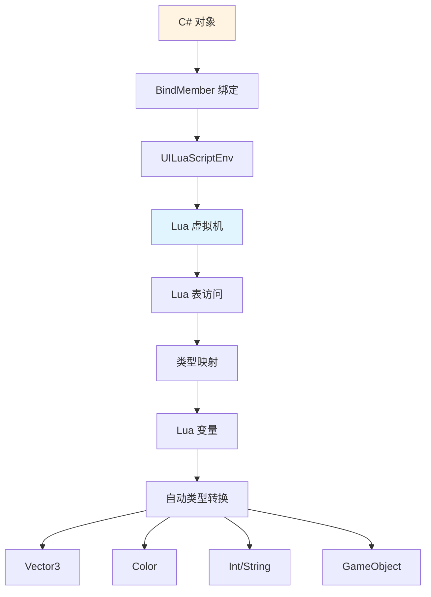
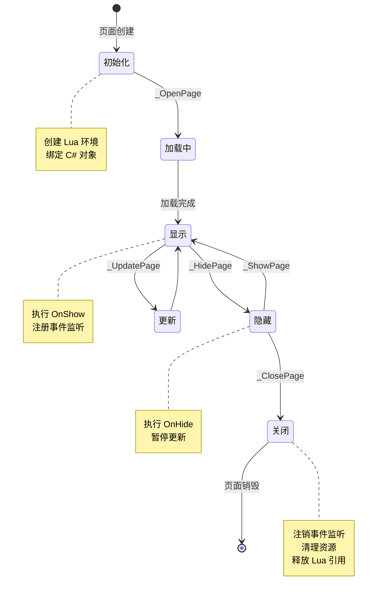
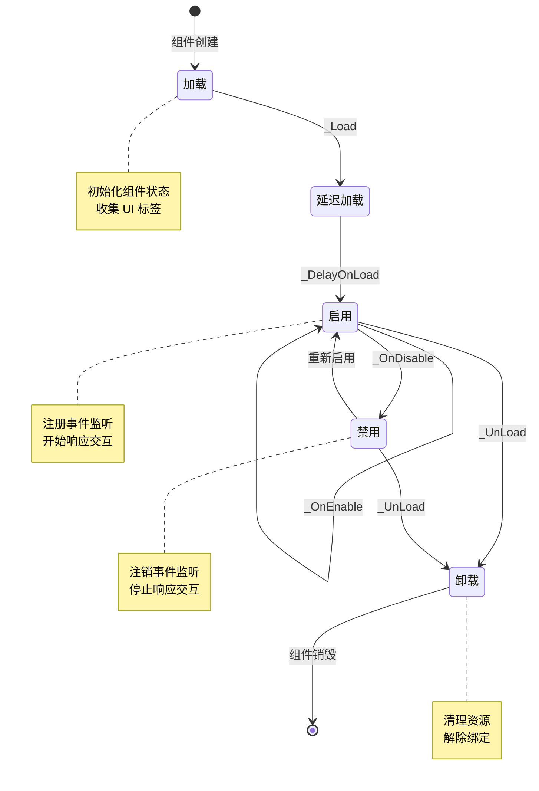
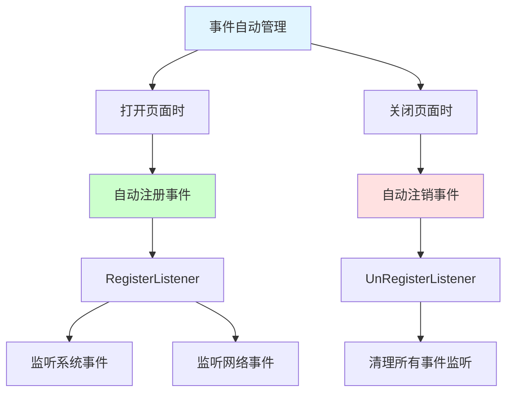
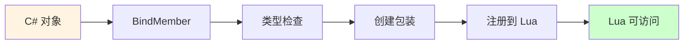
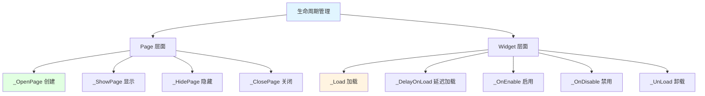
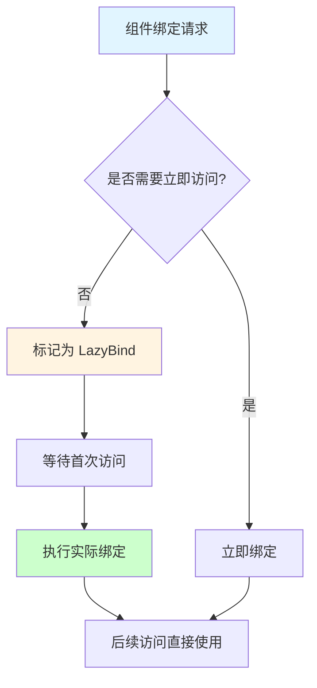

## 📊 图解

> [!info] 图示区
> 这里可以放置解释 UI 数据绑定与生命周期的 mermaid 图表、UML 类图或其他辅助理解的图片

### 数据绑定机制



### 延迟绑定流程

```mermaid
sequenceDiagram
    participant UI as UI 组件
    participant Bind as 绑定系统
    participant Lua as Lua 环境
    participant Data as 数据源

    UI->>Bind: 请求绑定组件
    Bind->>Bind: 检查是否需要延迟绑定
    
    alt 需要延迟绑定
        Bind->>Bind: 标记为 LazyBind
        Note over Bind: 等待真正使用时才绑定
        
        UI->>UI: 组件被访问
        Bind->>Lua: 执行实际绑定
        Lua->>Data: 获取数据
        Data-->>Bind: 绑定完成
    else 立即绑定
        Bind->>Lua: 立即执行绑定
        Lua->>Data: 获取数据
        Data-->>Bind: 绑定完成
    end

    style UI fill:#e1ffe1
    style Lua fill:#e1f5ff
```

### 页面生命周期流程



### 组件生命周期流程



### 自动事件管理



## 📖 原理

### 核心概念

数据绑定和生命周期管理是 UI 框架的核心机制，确保了数据的一致性和资源的正确释放。

#### 🎯 数据绑定机制

**支持的类型绑定：**

| C# 类型 | Lua 类型 | 说明 |
|---------|---------|------|
| `Vector3` | `userdata` | 位置、旋转等 |
| `Color` | `table` | 颜色值 |
| `int/float` | `number` | 数值 |
| `string` | `string` | 字符串 |
| `GameObject` | `userdata` | Unity 对象 |
| `Component` | `userdata` | Unity 组件 |

**绑定流程：**



#### ⏰ 延迟绑定机制（LazyBind）

| 优势 | 说明 |
|------|------|
| ⚡ **性能优化** | 避免一次性绑定所有组件 |
| 💾 **内存节省** | 只绑定实际使用的组件 |
| 🚀 **启动加速** | 减少页面打开时间 |

#### 🔄 生命周期管理

框架实现了完整的生命周期管理：

| 层级 | 生命周期函数 | 说明 |
|------|-------------|------|
| **Page** | `_OpenPage` → `_ShowPage` → `_HidePage` → `_ClosePage` | 页面级别 |
| **Widget** | `_Load` → `_OnEnable` → `_OnDisable` → `_UnLoad` | 组件级别 |

---

## 💡 面试题

### Q：这个 UI 框架的生命周期是如何管理的？数据绑定是如何实现的？

#### 🎯 生命周期管理详解

这个 UI 框架对生命周期的管理非常精细，体现在**页面和组件两个层面**：



#### 📋 页面生命周期

**UILuaPage 生命周期事件链：**

| 生命周期函数 | 调用时机 | 说明 |
|-------------|----------|------|
| **_OpenPage** | 页面被创建时 | 内部触发 `OnOpenPage` 并注册事件监听器 |
| **_ShowPage** | 页面显示时 | 内部触发 `OnShowPage` |
| **_UpdatePage** | 页面需要更新时 | 更新自身及所有需要更新的子组件 |
| **_HidePage** | 页面隐藏时 | 内部触发 `OnHidePage` |
| **_ClosePage** | 页面关闭时 | 注销事件监听器、清理计时器、解除 C# 引用 |

**页面生命周期代码示例：**

```lua
-- Lua 页面生命周期
function UIPage:_OpenPage(data)
    -- 初始化数据
    self.data = data
    
    -- 注册事件监听
    self:RegisterListener("OnDataUpdate", self, self.OnDataUpdate)
end

function UIPage:_ShowPage()
    -- 页面显示时的逻辑
    self:RefreshUI()
end

function UIPage:_HidePage()
    -- 页面隐藏时的逻辑
end

function UIPage:_ClosePage()
    -- 注销事件监听
    self:UnRegisterListener("OnDataUpdate", self, self.OnDataUpdate)
    
    -- 清理数据
    self.data = nil
end
```

#### 📋 组件生命周期

**UILuaWidget 生命周期管理：**

| 生命周期函数 | 调用时机 | 说明 |
|-------------|----------|------|
| **_Load** | 组件加载时 | 初始化组件状态 |
| **_DelayOnLoad** | 支持延迟加载机制 | 避免一次性创建所有组件 |
| **_OnEnable** | 组件启用时 | 注册事件监听 |
| **_OnDisable** | 组件禁用时 | 注销事件监听 |
| **_UnLoad** | 组件卸载时 | 清理资源 |

**组件生命周期代码示例：**

```lua
-- Lua 组件生命周期
function UIWidget:_Load()
    -- 初始化组件
    self.cacheData = {}
end

function UIWidget:_OnEnable()
    -- 注册事件
    self:RegisterListener("OnClick", self, self.OnClick)
end

function UIWidget:_OnDisable()
    -- 注销事件
    self:UnRegisterListener("OnClick", self, self.OnClick)
end

function UIWidget:_UnLoad()
    -- 清理缓存
    self.cacheData = nil
end
```

#### 🔧 数据绑定机制

**自动数据绑定流程：**

```mermaid
sequenceDiagram
    participant Page as UI Page
    participant Widget as UI Widget
    participant Bind as 绑定系统
    participant Lua as Lua 环境

    Page->>Bind: BindMember("button", buttonObj)
    Bind->>Bind: 检查对象类型
    Bind->>Lua: 注册到 Lua 环境
    
    alt 类型需要特殊处理
        Bind->>Bind: 创建类型包装器
        Bind->>Lua: 注册包装器
    end
    
    Lua-->>Page: 绑定完成
    
    Note over Page,Lua: Lua 中可以直接访问 self.button

    style Page fill:#e1ffe1
    style Lua fill:#e1f5ff
```

**各种类型的绑定示例：**

```lua
-- C# 中定义
public class UILuaWidget : MonoBehaviour {
    public Button button;           // 自动绑定为 Lua 函数
    public Image icon;              // 自动绑定
    public Text titleText;          // 自动绑定
    public Vector3 position;        // 自动绑定
    public int count;               // 自动绑定
}

-- Lua 中使用
function UIWidget:_OnEnable()
    -- 直接访问绑定的对象
    self.button.onClick:AddListener(function()
        self:OnButtonClick()
    end)
    
    -- 访问绑定的属性
    self.titleText.text = "标题"
    self.icon.sprite = someSprite
end
```

#### 💾 延迟绑定机制

**LazyBind 优化性能：**



| 优势 | 说明 |
|------|------|
| ⚡ **性能提升** | 避免不必要的绑定操作 |
| 💾 **内存节省** | 只绑定实际使用的对象 |
| 🚀 **启动加速** | 减少页面初始化时间 |

#### 🎭 自动事件管理

框架支持**自动的事件监听管理**：

| 特性 | 说明 |
|------|------|
| 📡 **自动注册** | 页面打开时自动注册事件 |
| 🗑️ **自动注销** | 页面关闭时自动注销事件 |
| 🧹 **防止泄漏** | 减少开发者的心智负担，避免内存泄漏 |

```lua
-- 自动事件管理示例
function UIPage:_OpenPage()
    -- 框架会自动跟踪所有注册的事件
    self:RegisterListener("OnDataUpdate", self, self.OnDataUpdate)
    self:RegisterListener("OnItemClick", self, self.OnItemClick)
end

function UIPage:_ClosePage()
    -- 框架会自动注销所有事件
    -- 开发者不需要手动注销
end
```

#### ✨ 设计优势

| 优势 | 说明 |
|------|------|
| 🎯 **完整生命周期** | 覆盖页面和组件的完整生命周期 |
| 🤖 **自动化管理** | 自动管理事件监听，减少手动操作 |
| 💾 **内存安全** | 正确的清理机制防止内存泄漏 |
| ⚡ **性能优化** | 延迟绑定机制优化性能 |

> [!tip] 最佳实践
> 1. 在 `_OpenPage` 中初始化数据和注册事件
> 2. 在 `_ClosePage` 中清理资源和注销事件
> 3. 使用 `_OnEnable`/`_OnDisable` 管理组件的启用/禁用状态
> 4. 不要在生命周期函数中执行耗时操作

---

## 🔗 相关链接

- [[UI框架]] - 父主题索引
- [[UI系统框架]] - 相关主题：框架架构
- [[Lua驱动的UI交互]] - 相关主题：Lua 与 C# 交互
- [[UI性能优化与热更新]] - 相关主题：性能优化
