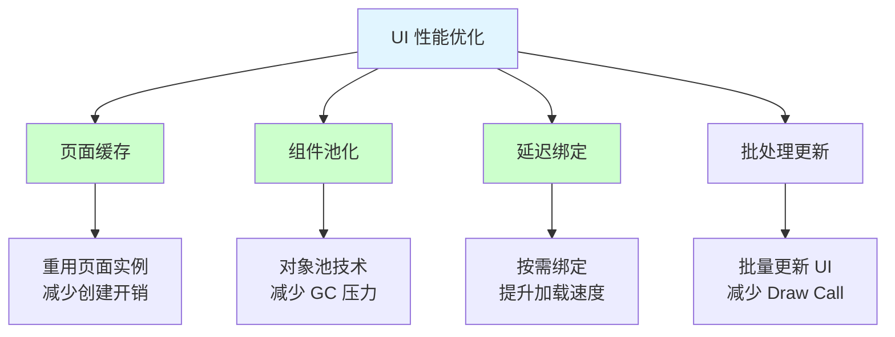
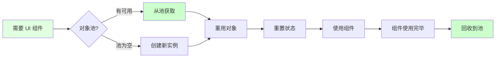
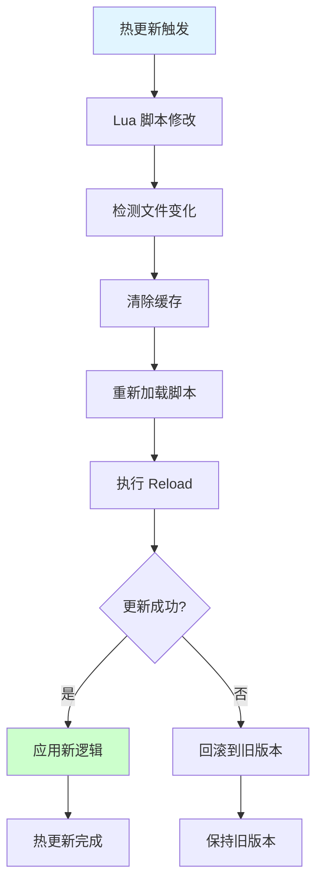
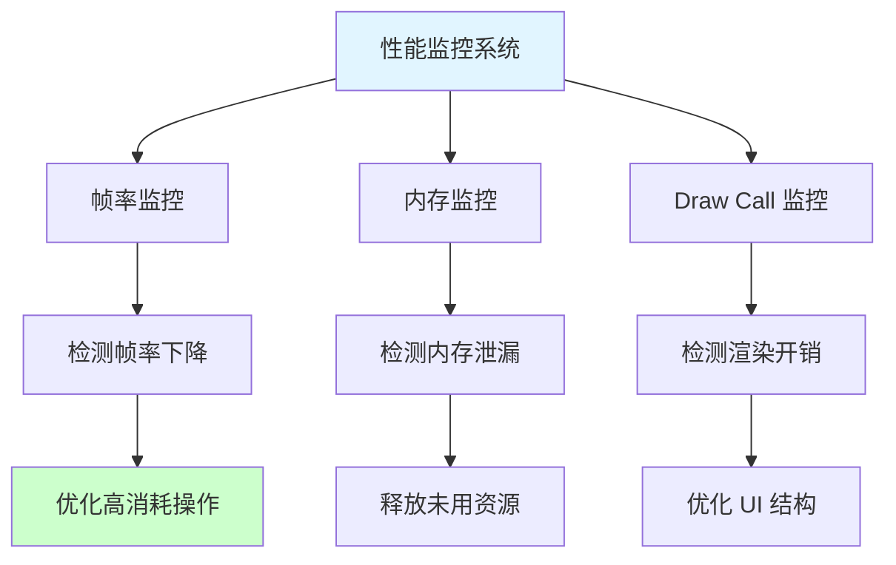
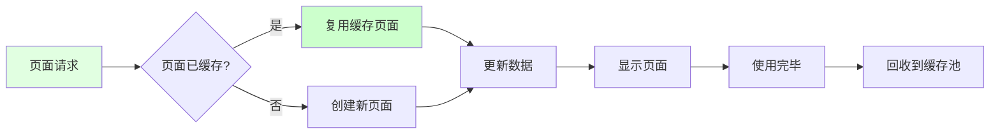
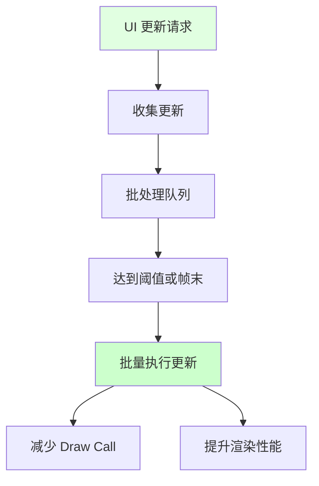
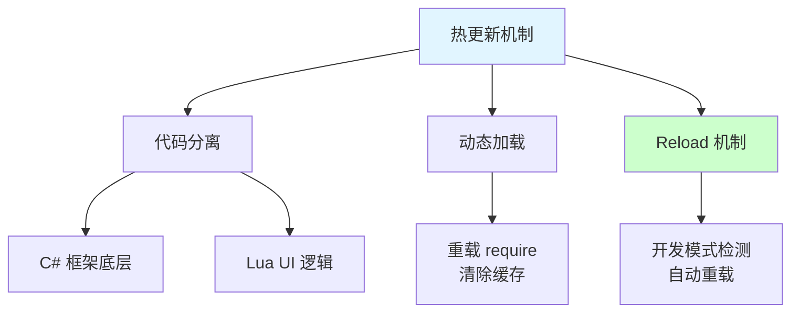
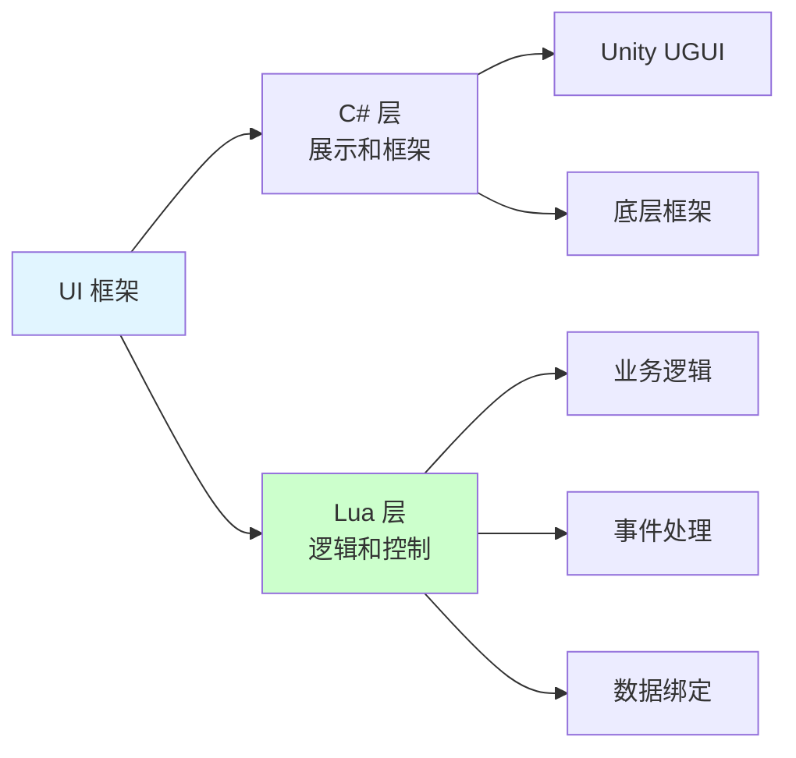
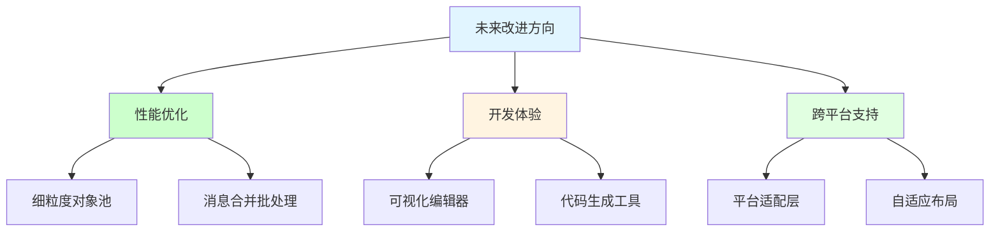

## 📊 图解

> [!info] 图示区
> 这里可以放置解释 UI 性能优化与热更新的 mermaid 图表、UML 类图或其他辅助理解的图片

### 性能优化策略



### 对象池工作机制



### 热更新实现流程



### 性能监控与分析



## 📖 原理

### 核心概念

性能优化和热更新是 UI 框架的重要组成部分，确保了良好的用户体验和快速迭代能力。

#### 🎯 性能优化策略

**1️⃣ 页面缓存与重用：**



**2️⃣ 组件对象池：**

| 优化策略 | 说明 | 效果 |
|---------|------|------|
| 🎮 **频繁组件池化** | 按钮、图标等小组件 | 减少 GC 压力 |
| 💾 **对象复用** | 重用已创建的对象 | 减少实例化开销 |
| 🔄 **状态重置** | 回收时重置状态 | 避免数据污染 |

**3️⃣ 延迟绑定机制：**

| 优势 | 说明 |
|------|------|
| ⚡ **按需绑定** | 只在真正需要时才绑定 | 减少初始化时间 |
| 📊 **分批处理** | 分批绑定组件 | 平滑 CPU 使用 |
| 🚀 **提升启动速度** | 减少页面打开等待时间 | 改善用户体验 |

**4️⃣ 批处理更新：**



#### 🔥 热更新实现机制

**核心实现：**

| 机制 | 说明 |
|------|------|
| 📝 **代码分离** | UI 逻辑在 Lua 中，框架在 C# 中 |
| 🔄 **动态加载** | 支持脚本的动态加载和重载 |
| 🔧 **Reload 机制** | 在不重启应用的情况下重新加载脚本 |

---

## 💡 面试题

### Q：这种 UI 框架如何实现热更新？有哪些优势和局限性？

#### 🎯 热更新实现机制

这个基于 Lua 的 UI 框架实现热更新的核心在于**将 UI 逻辑放在 Lua 层面**，利用了 Lua 作为解释型语言的特性。



#### 📋 实现机制详解

**1️⃣ 代码分离：**



通过 MLuaLuaMgr 管理器实现了 C# 和 Lua 的分离：
- **展示层**：依赖 Unity 的 UGUI 系统
- **逻辑层**：由 Lua 脚本控制

**2️⃣ 动态加载：**

框架重载了 `require` 函数，支持对脚本的动态加载和重载：

| 模式 | 行为 | 目的 |
|------|------|------|
| **开发模式** | 清除缓存，每次都加载最新版本 | 方便调试和开发 |
| **生产模式** | 使用缓存，提升性能 | 减少加载时间 |

**3️⃣ Reload 机制：**

```mermaid
sequenceDiagram
    participant Dev as 开发者
    participant Framework as UI 框架
    participant Lua as Lua VM

    Dev->>Framework: 修改 Lua 脚本
    Framework->>Framework: 检测文件变化
    
    alt 开发模式
        Framework->>Framework: 清除脚本缓存
        Framework->>Lua: 重新加载脚本
        Lua-->>Framework: 新脚本加载成功
        Framework->>Framework: 执行 Reload
        Framework-->>Dev: 新逻辑已应用
    else 生产模式
        Framework->>Lua: 使用缓存脚本
    end

    style Dev fill:#e1ffe1
    style Framework fill:#fff4e1
```

**代码示例：**

```lua
-- 框架重载的 require 函数
local originalRequire = require

function require(moduleName)
    -- 在开发模式下清除特定类型的缓存
    if IsDevelopmentMode() then
        if IsUIPageOrWidget(moduleName) then
            package.loaded[moduleName] = nil
        end
    end
    
    return originalRequire(moduleName)
end
```

#### ✨ 热更新优势

| 优势 | 说明 |
|------|------|
| 🚀 **快速迭代** | 无需重新编译客户端，可以直接更新 UI 逻辑 |
| 🔧 **线上修复** | 可以在不提交新版本的情况下，修复已发现的 UI 问题 |
| 📱 **降低审核风险** | 对于需要应用市场审核的游戏，避免了因 UI 小改动而反复提交审核 |
| ⏰ **减少停机时间** | 问题修复可以立即部署，减少对用户的影响 |

#### ⚠️ 热更新局限性

| 局限性 | 说明 | 影响 |
|--------|------|------|
| 🐌 **性能开销** | Lua 作为脚本语言，执行效率不如原生 C# 代码 | 需要避免复杂计算 |
| 🐛 **调试困难** | 跨语言调试比单一语言环境更复杂 | 需要专门的调试工具 |
| 💾 **内存管理** | 需要格外注意 C# 对象和 Lua 对象之间的引用关系 | 避免内存泄漏 |
| 📚 **学习成本** | 团队需要同时掌握 C# 和 Lua 两种语言及其交互机制 | 增加培训成本 |

#### 💡 热更新最佳实践

**1️⃣ 开发流程：**

| 实践 | 说明 |
|------|------|
| ✅ **版本控制** | Lua 脚本也需要版本控制 |
| ✅ **测试验证** | 热更新前在测试环境充分验证 |
| ✅ **灰度发布** | 逐步推送更新，观察问题 |
| ✅ **快速回滚** | 保留旧版本，出问题快速回滚 |

**2️⃣ 代码组织：**

| 实践 | 说明 |
|------|------|
| ✅ **职责分离** | C# 负责性能关键代码，Lua 负责业务逻辑 |
| ✅ **接口设计** | 设计清晰的 C# 和 Lua 接口 |
| ✅ **错误处理** | 完善的异常捕获和上报机制 |

> [!tip] 总结
> 热更新机制为游戏提供了快速迭代和线上修复的能力，但需要权衡性能和开发效率。合理使用热更新，在保持灵活性的同时确保游戏性能。

---

### Q：基于目前的 UI 框架设计，您认为未来可能的改进方向有哪些？

#### 🎯 未来改进方向

基于当前 UI 框架设计，我认为未来有几个关键的改进方向：



#### 📋 详细改进方案

**1️⃣ 性能优化方向：**

| 改进点 | 说明 | 优势 |
|--------|------|------|
| **细粒度对象池** | 对频繁创建销毁的小型 UI 组件（如物品图标、技能图标）实现专门的轻量级对象池 | 减少 GC 压力和内存碎片化 |
| **消息合并批处理** | 引入消息合并和批处理机制 | 减少在高频交互场景中的性能损耗 |
| **异步加载优化** | 优化资源异步加载流程 | 提升页面打开速度 |

**2️⃣ 开发体验方向：**

| 改进点 | 说明 | 优势 |
|--------|------|------|
| **可视化编辑器** | 开发基于当前架构的 UI 可视化编辑器，自动生成代码 | 大幅提升开发效率，保持架构一致性 |
| **代码生成工具** | 根据配置生成 Mgr、Util、Events 和基础 UI 代码 | 减少重复代码，降低出错率 |
| **实时预览** | 支持 Lua 脚本修改实时预览 | 提升调试效率 |

**3️⃣ 跨平台支持方向：**

| 改进点 | 说明 | 优势 |
|--------|------|------|
| **平台适配层** | 设计平台适配层，使 UI 组件能根据不同平台特性自动调整 | 适配不同平台的特性 |
| **自适应布局** | 实现跨平台的自适应布局系统 | 支持多种分辨率和屏幕方向 |
| **输入适配** | 统一的输入系统，适配触摸、键盘、手柄等 | 提升跨平台体验 |

#### 💡 实施建议

| 改进方向 | 实施难度 | 优先级 | 预期收益 |
|---------|---------|--------|----------|
| 细粒度对象池 | 中 | 高 | 显著提升性能 |
| 可视化编辑器 | 高 | 中 | 显著提升效率 |
| 消息批处理 | 低 | 高 | 改善高频交互性能 |
| 跨平台适配 | 高 | 低 | 扩展平台支持 |

> [!tip] 总结
> 这些改进不需要推翻现有架构，而是在保持其核心优势（低耦合、易维护、一致性）的基础上，使其更加现代化、高效和开发友好。

---

## 🔗 相关链接

- [[UI框架]] - 父主题索引
- [[UI系统框架]] - 相关主题：框架架构
- [[Lua驱动的UI交互]] - 相关主题：Lua 热更新机制
- [[C#和Lua交互]] - 相关主题：XLua 热更新
