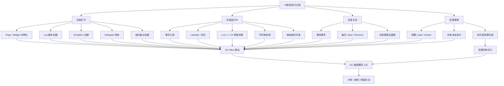
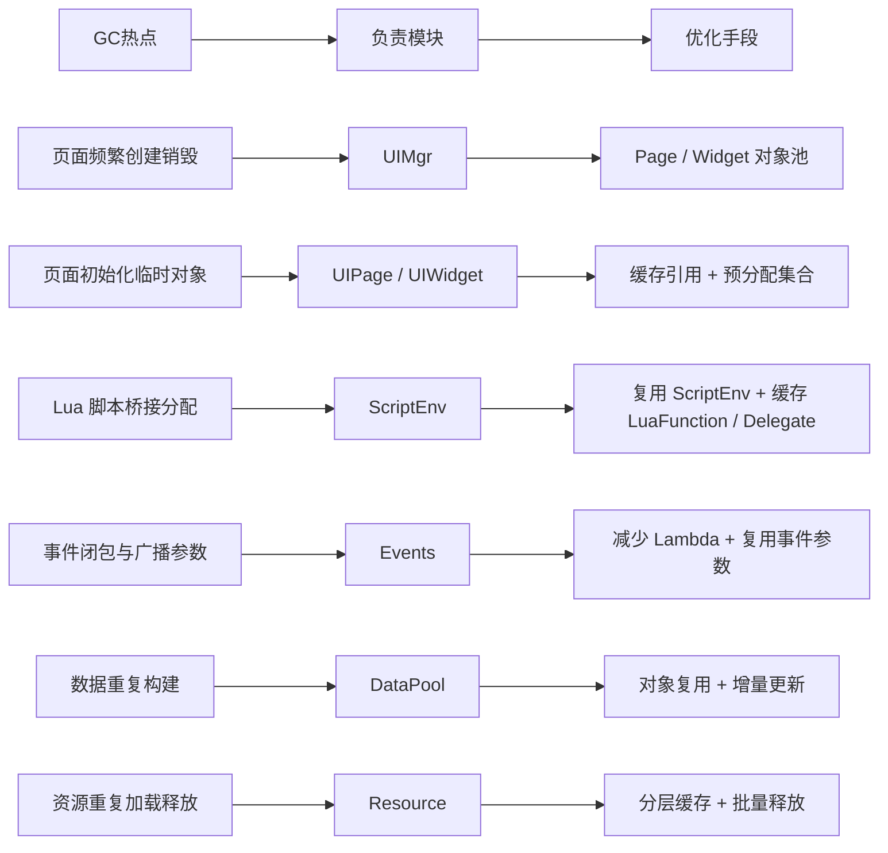

## 📊 图解

### UI 框架中的 GC 触发点

### 模块级优化落地

## 📖 原理

### 核心判断

UI 框架里的 GC 问题通常不是来自单次大对象，而是来自高频小分配。真正要盯的是页面打开、Lua 和 C# 互调、事件系统、临时集合、字符串和资源切换这些热路径。

### 最该讲的 8 个热点

1. 打开页面时的 `Instantiate`、脚本加载和 `ScriptEnv` 创建。
2. Page / Widget 初始化时的临时 `List`、`Dictionary` 和路径字符串。
3. Lua 和 C# 互调时的参数转换、装箱拆箱和桥接初始化。
4. 事件系统里的 `Lambda`、闭包捕获和广播参数对象。
5. `Update` 或高频回调里的每帧 `new`、字符串拼接和 `Linq`。
6. 关闭页面时的解绑、`Clear`、`Remove` 和销毁后重建。
7. 资源系统里的频繁 `Load / Unload` 与对象池未命中。
8. 协程和日志系统带来的零散分配。

### 模块职责化治理

| 模块 | 重点职责 | 优化方向 |
|------|------|------|
| `UIMgr` | 页面调度与生命周期控制 | 优先复用而不是销毁重建 |
| `UIPage / UIWidget` | 组件引用与页面逻辑 | 缓存引用，减少热路径临时对象 |
| `ScriptEnv` | C# / Lua 桥接 | 缓存 `LuaFunction`、`Delegate`，减少桥接分配 |
| `Events` | 订阅与分发 | 避免闭包滥用，降低广播时对象分配 |
| `DataPool` | 数据缓存与状态更新 | 复用数据对象，优先增量刷新 |
| `Resource` | 资源加载与释放 | 做好分层缓存，避免频繁切换 |

### 和 GC 基础知识的边界

- `C# GC` 负责托管堆对象回收。
- 纹理、音频、字体等 Unity 资源更偏非托管内存问题。
- UI 优化时要同时看 `GC Alloc` 和资源生命周期，不能只盯一次 `GC.Collect`。

## 💡 面试表达

### 一句总述

> 我的 UI + Lua 框架优化不是只盯某个函数，而是沿着生命周期做模块化治理：UIMgr 控制复用，UIPage 和 Widget 收敛临时分配，ScriptEnv 缓存桥接调用，Events 降低闭包分配，DataPool 做对象复用，资源层负责分层缓存，目标是把运行期 GC 热点前移到可控阶段。

### 回答顺序

1. 先讲 GC 主要来自高频小分配，不是单次大对象。
2. 再讲热点集中在页面创建、桥接调用、事件系统和资源切换。
3. 最后讲优化不是单点技巧，而是按模块和生命周期统一治理。

## 🔗 相关链接

- [[UI框架]] - 父主题索引
- [[Lua驱动的UI交互]] - 相关主题：桥接调用与 ScriptEnv 缓存
- [[UI性能优化与热更新]] - 相关主题：对象池、缓存与整体优化
- [[C# GC]] - 相关主题：托管堆、分代回收与 GC 基础
