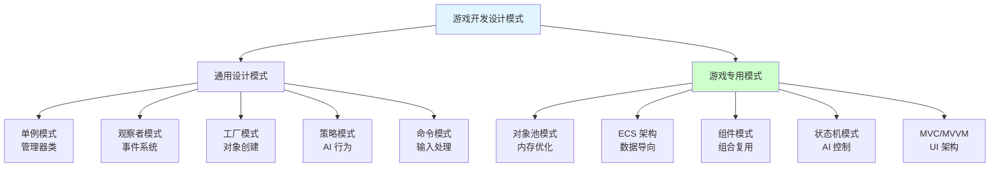
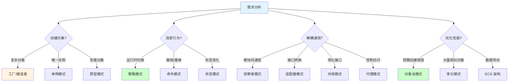
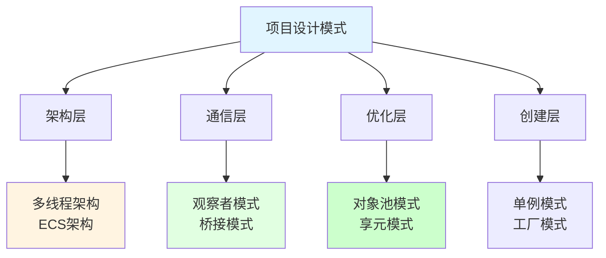
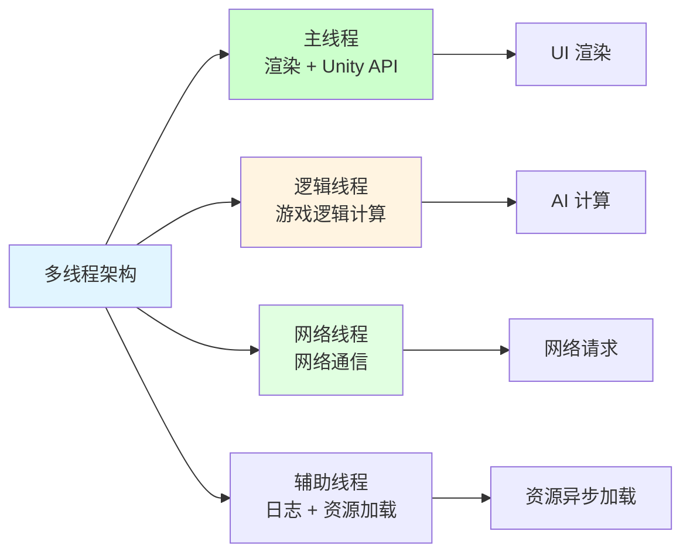
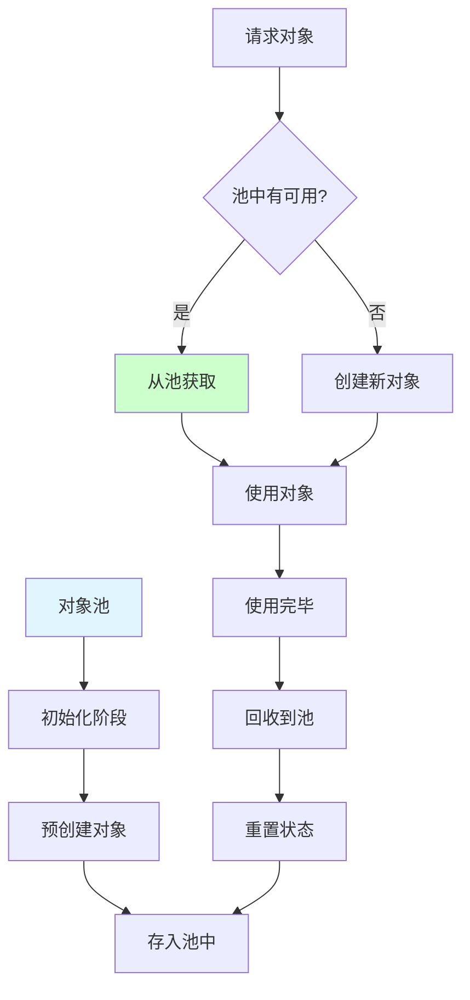
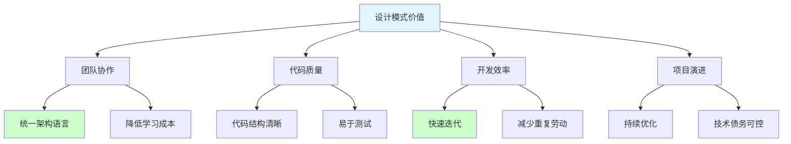

## 📊 图解

> [!info] 图示区
> 这里可以放置解释设计模式分类的 mermaid 图表、UML 类图或其他辅助理解的图片

### 设计模式分类

```mermaid
graph TD
    A[设计模式 23 种] --> B[创建型 Creational<br/>5 种]
    A --> C[结构型 Structural<br/>7 种]
    A --> D[行为型 Behavioral<br/>11 种]

    B --> E[单例 Singleton]
    B --> F[工厂 Method]
    B --> G[建造者 Builder]
    B --> H[原型 Prototype]
    B --> I[抽象工厂 AbstractFactory]

    C --> J[适配器 Adapter]
    C --> K[装饰器 Decorator]
    C --> L[代理 Proxy]
    C --> M[桥接 Bridge]
    C --> N[外观 Facade]
    C --> O[组合 Composite]
    C --> P[享元 Flyweight]

    D --> Q[观察者 Observer]
    D --> R[策略 Strategy]
    D --> S[命令 Command]
    D --> T[状态 State]
    D --> U[责任链 Chain]
    D --> V[解释器 Interpreter]
    D --> W[迭代器 Iterator]
    D --> X[中介者 Memento]
    D --> Y[访问者 Visitor]
    D --> Z[模板方法 Template]

    style A fill:#e1f5ff
    style E fill:#fff4e1
    style J fill:#e1ffe1
    style Q fill:#ccffcc
```



### 游戏开发常用模式



### 模式选择指南



## 📖 原理

### 核心概念

设计模式是软件设计中常见问题的典型解决方案。在游戏开发中，合理使用设计模式可以提高代码的可维护性、可扩展性和性能。

#### 🎯 设计模式的三大分类

| 分类 | 数量 | 核心思想 | 游戏开发常用度 |
|------|------|----------|--------------|
| **创建型** | 5 种 | 对象创建过程的抽象 | ⭐⭐⭐⭐⭐ |
| **结构型** | 7 种 | 类和对象的组合 | ⭐⭐⭐⭐ |
| **行为型** | 11 种 | 对象间的通信和职责分配 | ⭐⭐⭐⭐⭐ |

#### 🎮 游戏开发中的模式应用

| 模式 | 游戏应用 | 典型案例 | 常用度 |
|------|---------|----------|--------|
| **单例模式** | 全局管理器 | GameManager, AudioManager | ⭐⭐⭐⭐⭐ |
| **工厂模式** | 对象创建 | 技能工厂、装备工厂 | ⭐⭐⭐⭐⭐ |
| **观察者模式** | 事件系统 | UI 事件、网络回调 | ⭐⭐⭐⭐⭐ |
| **策略模式** | AI 行为 | 寻路策略、攻击策略 | ⭐⭐⭐⭐ |
| **命令模式** | 输入处理 | 玩家操作、UI 按钮 | ⭐⭐⭐⭐ |
| **状态模式** | 状态管理 | 角色状态、UI 流程 | ⭐⭐⭐⭐⭐ |
| **对象池模式** | 性能优化 | 子弹池、特效池 | ⭐⭐⭐⭐⭐ |
| **ECS 架构** | 数据导向 | Unity DOTS、实体组件系统 | ⭐⭐⭐⭐ |
| **组件模式** | 组合复用 | UI 组件、技能组件 | ⭐⭐⭐⭐⭐ |

#### 📚 设计模式选择原则

| 原则 | 说明 |
|------|------|
| ✅ **针对问题** | 选择能解决实际问题的模式 |
| ✅ **适度使用** | 不要为了用模式而用模式 |
| ✅ **考虑场景** | 团队规模、项目复杂度、性能要求 |
| ✅ **保持简洁** | 优先选择简单易懂的方案 |
| ⚠️ **避免过度设计** | 简单问题不需要复杂模式 |

---

## 💡 面试题

### Q：你们的项目使用了哪些设计模式？

#### 🎯 设计模式全景图

我们的项目采用了多种设计模式和架构思想：



#### 📋 使用的核心设计模式详解

**1️⃣ 多线程架构：**



| 特性 | 说明 |
|------|------|
| 🎮 **职责分离** | 每个线程专注特定任务 |
| ⚡ **性能提升** | 充分利用多核 CPU |
| 🔒 **线程安全** | 通过消息队列和锁机制保证安全 |

**2️⃣ ECS 架构：**

| 优势 | 说明 |
|------|------|
| 📦 **高扩展性** | 易于添加新功能 |
| ⚡ **高性能** | 数据局部性好，缓存友好 |
| 🔄 **易组合** | 通过组合不同组件实现复杂行为 |

**3️⃣ 观察者模式：**

```mermaid
sequenceDiagram
    participant Data as 数据源
    participant Event as 事件系统
    participant UI as UI 界面
    participant Logic as 游戏逻辑

    Data->>Event: 数据变化
    Event->>UI: 通知更新
    Event->>Logic: 触发逻辑

    Note over UI,Logic: 松耦合通信

    style Data fill:#e1ffe1
    style Event fill:#ccffcc
```

| 应用 | 说明 |
|------|------|
| 📡 **模块通信** | 松耦合的消息系统 |
| 🎮 **事件处理** | UI 事件、游戏事件 |
| 🔄 **数据同步** | 数据变化自动通知监听者 |

**4️⃣ 单例模式：**

```mermaid
classDiagram
    
    class GameManager {
        -instance: GameManager
        -isInitialized: bool
        +GetInstance()
        +Initialize()
        +QuitGame()
    }
    
    note right of GameManager
        全局唯一实例
        线程安全初始化
        统一访问入口
    end note
```

| 应用场景 | 示例 |
|---------|------|
| 🎮 **管理器类** | GameManager, AudioManager, UIManager |
| 💾 **数据池** | 数据存储、配置管理 |
| 🔧 **工具类** | 网络管理、文件管理 |
| 🎨 **资源管理** | ResourceManager, AssetManager |

**5️⃣ 对象池模式：**



| 优势 | 说明 |
|------|------|
| 💾 **内存优化** | 减少垃圾回收压力 |
| ⚡ **性能提升** | 避免频繁创建销毁 |
| 🔄 **复用机制** | 对象重用而非重建 |

**6️⃣ 工厂模式：**

| 应用 | 说明 |
|------|------|
| 🎮 **技能创建** | 根据类型创建不同技能实例 |
| 🏹️ **装备生成** | 根据配置创建装备对象 |
| 🎨 **特效管理** | 统一的特效创建和管理 |
| 🎭 **角色创建** | 根据职业创建不同角色 |

#### ✨ 设计模式的综合价值

这些设计模式的综合使用，使得游戏具有：

| 优势 | 说明 |
|------|------|
| 📈 **可扩展性** | 容易添加新功能，不影响现有代码 |
| 🔧 **可维护性** | 代码结构清晰，易于理解和修改 |
| ⚡ **高性能** | 优化内存使用和 CPU 执行效率 |
| 🎮 **可重用性** | 代码组件可以在不同场景重用 |
| 🛡️ **稳定性** | 减少耦合，降低 bug 风险 |
| 👥 **团队协作** | 统一的架构语言，降低沟通成本 |



> [!tip] 总结
> 设计模式是经验的总结，不是教条。在游戏开发中，根据具体需求选择合适的设计模式，避免过度设计。最合适的设计模式是能解决问题的最简单方案。

---

## 🔗 相关链接

- [[设计模式]] - 父主题索引
- [[创建型模式]] - 相关主题：单例、工厂、建造者
- [[结构型模式]] - 相关主题：适配器、装饰器、代理
- [[行为型模式]] - 相关主题：观察者、策略、命令
- [[游戏专用模式]] - 相关主题：对象池、ECS、组件模式
