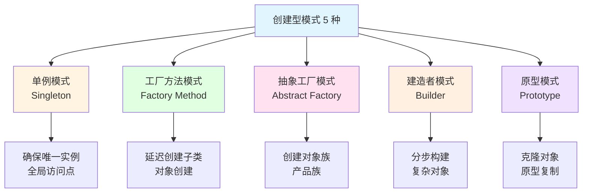
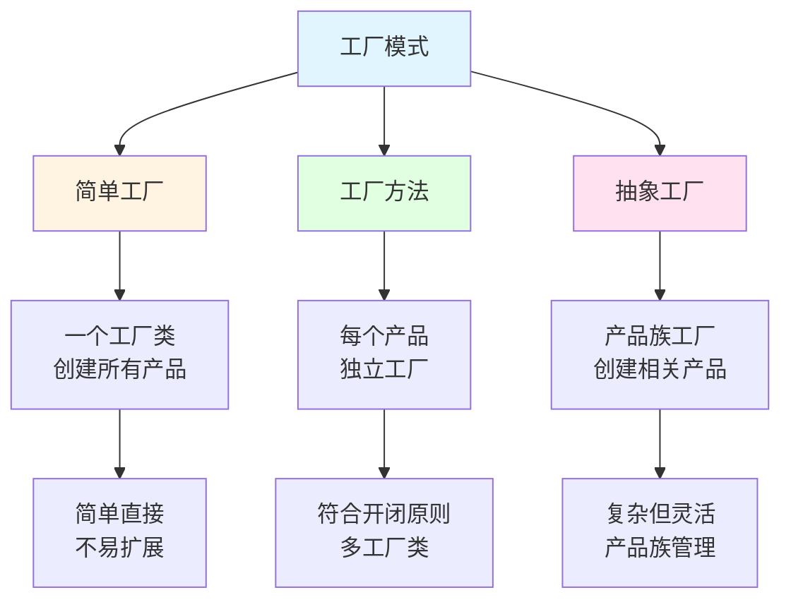
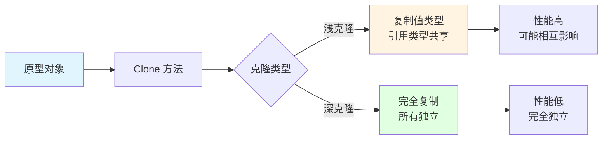
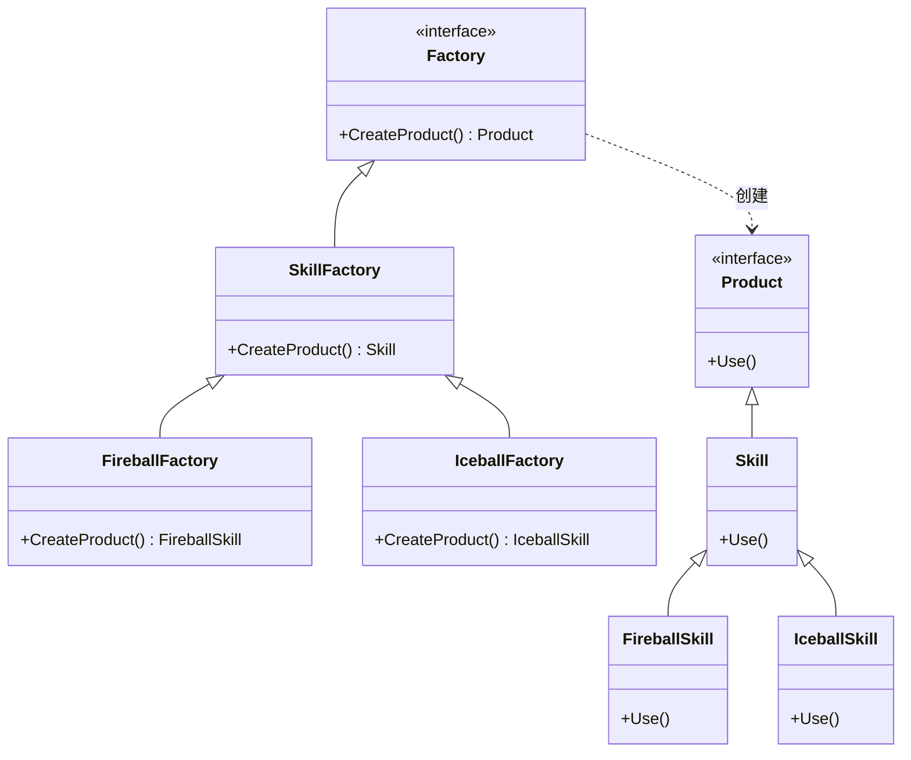
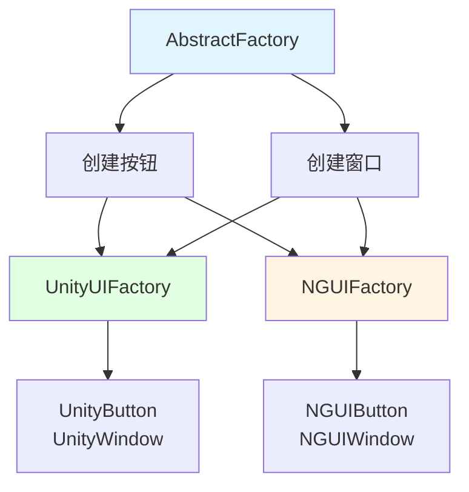
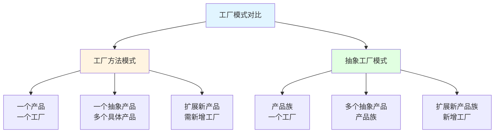
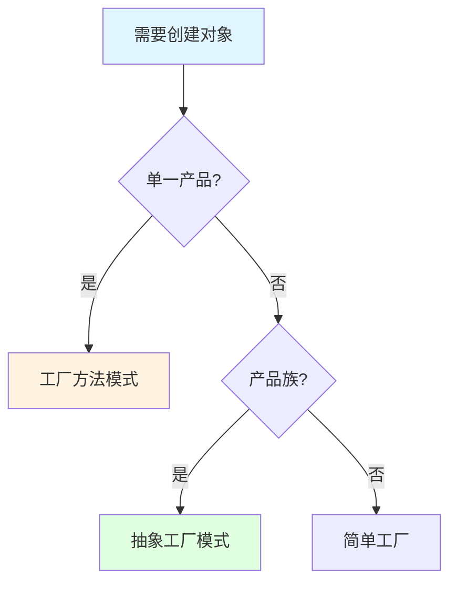
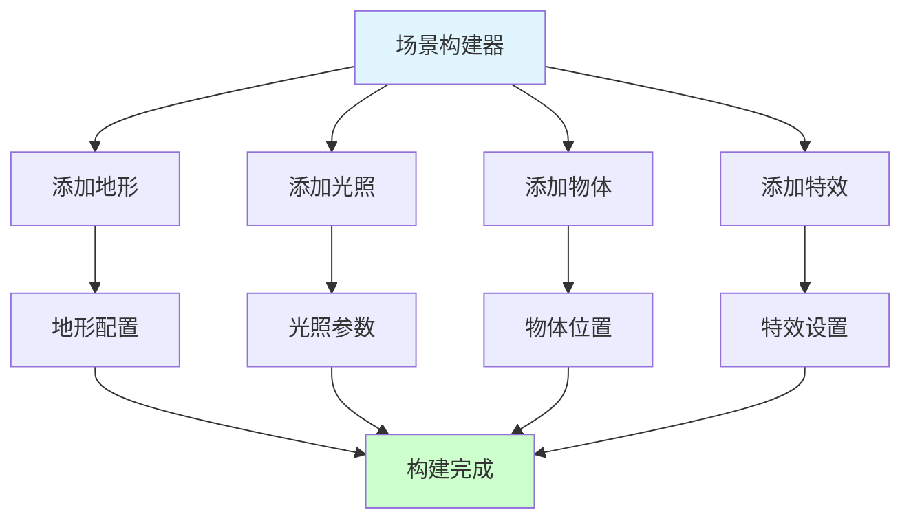
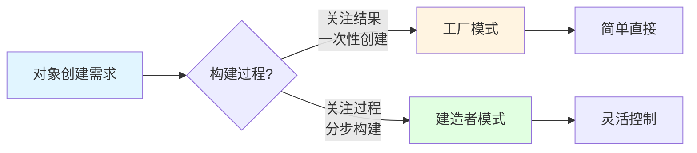

## 📊 图解

> [!info] 图示区
> 这里可以放置解释创建型设计模式的 mermaid 图表、UML 类图或其他辅助理解的图片

### 创建型模式分类



### 单例模式实现

```mermaid
classDiagram
    class Singleton {
        -instance: Singleton
        -isInitialized: bool
        +GetInstance() Singleton
        +Initialize()
        +DoSomething()
    }

    class GameManager {
        -instance: GameManager
        -gameState: GameState
        +GetInstance() GameManager
        +StartGame()
        +PauseGame()
        +QuitGame()
    }

    class AudioManager {
        -instance: AudioManager
        -volume: float
        +GetInstance() AudioManager
        +PlayMusic()
        +StopMusic()
        +SetVolume()
    }

    Singleton <|-- GameManager
    Singleton <|-- AudioManager

    note right of Singleton
        单例基类
        线程安全
        延迟初始化
    end note
```

### 工厂模式分类



### 建造者模式流程

```mermaid
sequenceDiagram
    participant Client as 客户端
    participant Director as 指导者
    participant Builder as 建造者
    participant Product as 产品

    Client->>Director: 构建请求
    Director->>Builder: BuildPartA()
    Builder->>Product: 创建部件A
    Director->>Builder: BuildPartB()
    Builder->>Product: 创建部件B
    Director->>Builder: BuildPartC()
    Builder->>Product: 创建部件C
    Director->>Builder: GetResult()
    Builder-->>Client: 返回完整产品

    style Client fill:#e1ffe1
    style Product fill:#ccffcc
```

### 原型模式克隆机制



## 📖 原理

### 核心概念

创建型模式抽象了实例化过程，帮助系统独立于如何创建、组合和表示它的对象。

#### 🎯 单例模式（Singleton）

**核心思想：** 确保一个类只有一个实例，并提供全局访问点。

| 特性 | 说明 |
|------|------|
| 🎯 **唯一实例** | 类只有一个实例存在 |
| 🌐 **全局访问** | 提供全局访问点 |
| ⏰ **延迟初始化** | 第一次使用时创建实例 |

**实现方式：**

```csharp
// 线程安全的单例实现
public class Singleton<T> where T : class, new()
{
    private static T _instance;
    private static readonly object _lock = new object();
    private static bool _isInitialized = false;

    public static T Instance
    {
        get
        {
            if (!_isInitialized)
            {
                lock (_lock)
                {
                    if (!_isInitialized)
                    {
                        _instance = new T();
                        _isInitialized = true;
                    }
                }
            }
            return _instance;
        }
    }

    protected Singleton() { }
}

// 使用示例
public class GameManager : Singleton<GameManager>
{
    public void StartGame()
    {
        Debug.Log("Game started!");
    }
}

// 调用
GameManager.Instance.StartGame();
```

**游戏开发应用：**

| 应用场景 | 示例 |
|---------|------|
| 🎮 **管理器类** | GameManager, AudioManager, UIManager |
| 💾 **数据存储** | PlayerData, GameConfig |
| 🔧 **工具类** | ResourceManager, NetworkManager |
| 🎨 **资源管理** | AssetLoader, PoolManager |

#### 🏭 工厂方法模式（Factory Method）

**核心思想：** 定义创建对象的接口，让子类决定实例化哪个类。



**游戏开发应用：**

| 应用 | 说明 |
|------|------|
| 🎮 **技能创建** | 根据类型创建不同技能 |
| 🏹️ **装备生成** | 根据配置创建装备 |
| 🎨 **特效管理** | 统一的特效创建接口 |
| 🎭 **角色创建** | 根据职业创建角色 |

```csharp
// 技能工厂示例
public interface ISkillFactory
{
    ISkill CreateSkill();
}

public class FireballFactory : ISkillFactory
{
    public ISkill CreateSkill()
    {
        return new FireballSkill();
    }
}

public class IceballFactory : ISkillFactory
{
    public ISkill CreateSkill()
    {
        return new IceballSkill();
    }
}

// 使用
ISkillFactory factory = new FireballFactory();
ISkill skill = factory.CreateSkill();
skill.Use();
```

#### 🏗️ 抽象工厂模式（Abstract Factory）

**核心思想：** 提供创建一系列相关或相互依赖对象的接口，无需指定具体类。

| 优势 | 说明 |
|------|------|
| 🎨 **产品族管理** | 统一创建相关产品 |
| 🔧 **一致性** | 保证产品族的一致性 |
| 🔄 **易扩展** | 添加新产品族容易 |



#### 🔨 建造者模式（Builder）

**核心思想：** 将复杂对象的构建与表示分离，使同样的构建过程可以创建不同的表示。

| 适用场景 | 说明 |
|---------|------|
| 🎮 **角色创建** | 分步创建角色部件 |
| 🏠️ **场景构建** | 复杂场景的逐步构建 |
| 📊 **配置对象** | 多步骤配置的对象 |

```csharp
// 建造者模式示例
public class CharacterBuilder
{
    private Character _character = new Character();

    public CharacterBuilder SetName(string name)
    {
        _character.Name = name;
        return this;
    }

    public CharacterBuilder SetLevel(int level)
    {
        _character.Level = level;
        return this;
    }

    public CharacterBuilder AddSkill(string skill)
    {
        _character.Skills.Add(skill);
        return this;
    }

    public Character Build()
    {
        return _character;
    }
}

// 使用
Character character = new CharacterBuilder()
    .SetName("Hero")
    .SetLevel(10)
    .AddSkill("Fireball")
    .AddSkill("Ice Shield")
    .Build();
```

#### 📋 原型模式（Prototype）

**核心思想：** 通过复制现有实例来创建新实例，而非通过 new 创建。

| 类型 | 说明 | 应用 |
|------|------|------|
| **浅克隆** | 复制值类型，引用类型共享 | 简单对象 |
| **深克隆** | 完全复制所有字段 | 复杂对象 |

```csharp
// 原型模式示例
public class Monster : ICloneable
{
    public string Name { get; set; }
    public int Health { get; set; }
    public Skill[] Skills { get; set; }

    public object Clone()
    {
        // 深克隆
        Monster clone = new Monster
        {
            Name = this.Name,
            Health = this.Health,
            Skills = (Skill[])this.Skills.Clone()
        };
        return clone;
    }
}

// 使用
Monster prototype = new Monster { Name = "Dragon", Health = 1000 };
Monster clonedMonster = (Monster)prototype.Clone();
```

---

## 💡 面试题

### Q：单例模式有哪些实现方式？线程安全如何保证？

#### 🎯 单例模式实现方式

**1️⃣ 饿汉模式（Eager Initialization）：**

```csharp
public class EagerSingleton
{
    private static readonly EagerSingleton _instance = new EagerSingleton();

    private EagerSingleton() { }

    public static EagerSingleton Instance
    {
        get { return _instance; }
    }
}
```

| 优势 | 劣势 |
|------|------|
| ✅ 线程安全 | ⚠️ 无法延迟加载 |
| ✅ 实现简单 | ⚠️ 可能浪费资源 |

**2️⃣ 懒汉模式（Lazy Initialization）：**

```csharp
public class LazySingleton
{
    private static LazySingleton _instance;
    private static readonly object _lock = new object();

    private LazySingleton() { }

    public static LazySingleton Instance
    {
        get
        {
            if (_instance == null)
            {
                lock (_lock)
                {
                    if (_instance == null)
                    {
                        _instance = new LazySingleton();
                    }
                }
            }
            return _instance;
        }
    }
}
```

| 优势 | 劣势 |
|------|------|
| ✅ 延迟加载 | ⚠️ 双重检查锁定复杂 |
| ✅ 线程安全 | ⚠️ 每次访问都有锁开销 |

**3️⃣ .NET 4.0+ Lazy（推荐）：**

```csharp
public class ModernSingleton
{
    private static readonly Lazy<ModernSingleton> _lazy =
        new Lazy<ModernSingleton>(() => new ModernSingleton());

    public static ModernSingleton Instance { get { return _lazy.Value; } }

    private ModernSingleton() { }
}
```

| 优势 | 说明 |
|------|------|
| ✅ **线程安全** | .NET 内部保证 |
| ✅ **延迟加载** | 首次访问时创建 |
| ✅ **性能优秀** | 无锁开销 |
| ✅ **代码简洁** | 框架支持 |

#### 🔒 线程安全保证机制

| 机制 | 说明 | 性能 |
|------|------|------|
| **双重检查锁定** | 先检查后锁定，再检查 | 中等 |
| **静态初始化** | CLR 保证线程安全 | 最优 |
| **Lazy\<T>** | .NET 框架内置 | 最优 |

> [!tip] 最佳实践
> 游戏开发中推荐使用 .NET 的 Lazy\<T> 实现单例模式，既保证线程安全，又提供延迟加载和优秀性能。

---

### Q：工厂模式和抽象工厂模式有什么区别？在游戏开发中如何选择？

#### 🎯 核心区别



| 对比维度 | 工厂方法模式 | 抽象工厂模式 |
|---------|-------------|-------------|
| **产品数量** | 单一产品 | 产品族（多个相关产品） |
| **工厂职责** | 创建一种产品 | 创建一类产品族 |
| **扩展难度** | 扩展产品容易 | 扩展产品族容易 |
| **复杂度** | 简单 | 复杂 |
| **使用场景** | 单一类产品创建 | 相关产品族创建 |

#### 🎮 游戏开发选择指南

**使用工厂方法模式的场景：**

| 场景 | 示例 |
|------|------|
| 🎮 **技能系统** | 创建不同类型的技能 |
| 🏹️ **装备系统** | 创建武器、防具等 |
| 🎨 **特效系统** | 创建不同类型的特效 |

```csharp
// 工厂方法模式示例：技能工厂
public interface ISkillFactory
{
    ISkill CreateSkill();
}

public class FireballFactory : ISkillFactory
{
    public ISkill CreateSkill() => new FireballSkill();
}

public class IceballFactory : ISkillFactory
{
    public ISkill CreateSkill() => new IceballSkill();
}
```

**使用抽象工厂模式的场景：**

| 场景 | 示例 |
|------|------|
| 🎨 **UI 框架** | 创建 UI 控件族（按钮、窗口、列表） |
| 🎮 **游戏角色** | 创建角色相关对象（模型、技能、装备） |
| 🌍 **场景元素** | 创建场景物体（树木、石头、建筑） |

```csharp
// 抽象工厂模式示例：UI 工厂
public interface IUIFactory
{
    IButton CreateButton();
    IWindow CreateWindow();
    IPanel CreatePanel();
}

public class UnityUIFactory : IUIFactory
{
    public IButton CreateButton() => new UnityButton();
    public IWindow CreateWindow() => new UnityWindow();
    public IPanel CreatePanel() => new UnityPanel();
}
```

#### 💡 选择决策树



> [!tip] 选择建议
> - 只创建一种产品 → **工厂方法模式**
> - 创建相关产品族 → **抽象工厂模式**
> - 产品类型固定且简单 → **简单工厂模式**

---

### Q：建造者模式的应用场景是什么？与工厂模式有何区别？

#### 🎯 建造者模式核心特征

**本质区别：**

| 维度 | 建造者模式 | 工厂模式 |
|------|-----------|---------|
| **创建过程** | 分步骤构建 | 一次性创建 |
| **产品复杂度** | 复杂对象 | 简单/复杂对象 |
| **关注点** | 构建过程 | 创建结果 |
| **表示变化** | 同一过程不同表示 | 不同产品 |

#### 🎮 游戏开发应用场景

**1️⃣ 角色创建：**

```csharp
public class CharacterBuilder
{
    private Character _character = new Character();

    public CharacterBuilder SetBasicInfo(string name, int level)
    {
        _character.Name = name;
        _character.Level = level;
        return this;
    }

    public CharacterBuilder SetAppearance(string model, Color color)
    {
        _character.Model = model;
        _character.Color = color;
        return this;
    }

    public CharacterBuilder AddEquipment(Equipment equipment)
    {
        _character.Equipments.Add(equipment);
        return this;
    }

    public CharacterBuilder AddSkill(Skill skill)
    {
        _character.Skills.Add(skill);
        return this;
    }

    public Character Build()
    {
        return _character;
    }
}

// 使用：流式 API
Character warrior = new CharacterBuilder()
    .SetBasicInfo("Warrior", 10)
    .SetAppearance("WarriorModel", Color.red)
    .AddEquipment(new Sword())
    .AddEquipment(new Shield())
    .AddSkill(new PowerStrike())
    .Build();
```

**2️⃣ 场景构建：**



**3️⃣ UI 配置：**

```csharp
public class UIPanelBuilder
{
    private UIPanel _panel = new UIPanel();

    public UIPanelBuilder SetSize(int width, int height)
    {
        _panel.Width = width;
        _panel.Height = height;
        return this;
    }

    public UIPanelBuilder AddButton(string text, Action callback)
    {
        var button = new UIButton { Text = text };
        button.OnClick += callback;
        _panel.Controls.Add(button);
        return this;
    }

    public UIPanelBuilder SetBackground(Sprite sprite)
    {
        _panel.Background = sprite;
        return this;
    }

    public UIPanel Build()
    {
        return _panel;
    }
}
```

#### 📊 工厂模式 vs 建造者模式



| 使用场景 | 推荐模式 | 原因 |
|---------|---------|------|
| 创建技能 | 工厂模式 | 产品类型明确，一次性创建 |
| 创建角色 | 建造者模式 | 需要配置多个方面 |
| 创建装备 | 工厂模式 | 产品类型固定 |
| 构建场景 | 建造者模式 | 需要逐步添加元素 |

> [!tip] 选择建议
> - 产品构建过程复杂，需要分步骤 → **建造者模式**
> - 产品类型明确，创建过程简单 → **工厂模式**
> - 需要创建产品的不同表示 → **建造者模式**
> - 只关注创建结果 → **工厂模式**

---

## 🔗 相关链接

- [[设计模式]] - 父主题索引
- [[常用设计模式概述]] - 相关主题：设计模式分类
- [[结构型模式]] - 相关主题：适配器、装饰器、代理
- [[行为型模式]] - 相关主题：观察者、策略、命令
- [[游戏专用模式]] - 相关主题：对象池、ECS、组件
