## 📊 图解

> [!info] 图示区
> 这里可以放置解释结构型设计模式的 mermaid 图表、UML 类图或其他辅助理解的图片

### 结构型模式分类

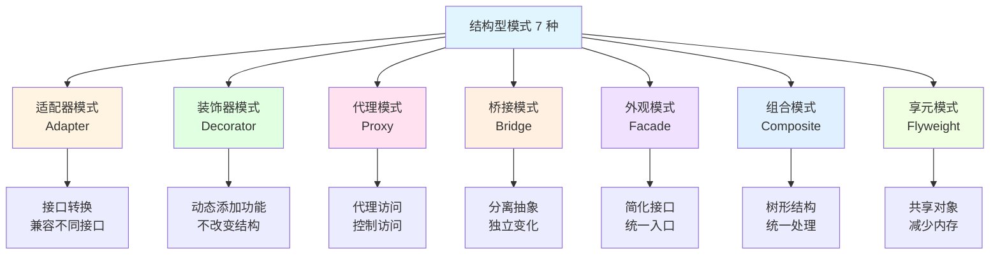

### 适配器模式结构

```mermaid
classDiagram
    class Target {
        <<interface>>
        +Request()
    }

    class Adaptee {
        +SpecificRequest()
    }

    class Adapter {
        -adaptee: Adaptee
        +Request()
    }

    class Client {
        +UseTarget()
    }

    Target <|.. Adapter
    Adapter --> Adaptee
    Client --> Target

    note right of Adapter
        适配器将 Adaptee 的接口
        转换为 Client 期望的 Target 接口
    end note
```

### 装饰器模式结构

```mermaid
classDiagram
    class Component {
        <<interface>>
        +Operation()
    }

    class ConcreteComponent {
        +Operation()
    }

    class Decorator {
        -component: Component
        +Operation()
    }

    class ConcreteDecoratorA {
        +Operation()
        +AddedBehavior()
    }

    class ConcreteDecoratorB {
        +Operation()
        +AddedBehavior()
    }

    Component <|.. Decorator
    Component <|-- ConcreteComponent
    Decorator <|-- ConcreteDecoratorA
    Decorator <|-- ConcreteDecoratorB
    Decorator --> Component

    note right of Decorator
        装饰器可以在运行时
        动态添加功能
    end note
```

### 代理模式类型

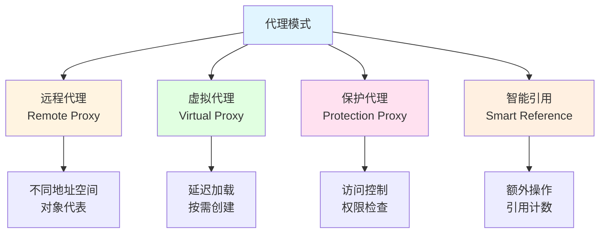

### 桥接模式结构

```mermaid
classDiagram
    class Abstraction {
        -implementor: Implementor
        +Operation()
    }

    class RefinedAbstraction {
        +Operation()
    }

    class Implementor {
        <<interface>>
        +OperationImpl()
    }

    class ConcreteImplementorA {
        +OperationImpl()
    }

    class ConcreteImplementorB {
        +OperationImpl()
    }

    Abstraction --> Implementor
    Abstraction <|-- RefinedAbstraction
    Implementor <|-- ConcreteImplementorA
    Implementor <|-- ConcreteImplementorB

    note right of Abstraction
        桥接模式将抽象与实现分离，
        使它们可以独立变化
    end note
```

### 组合模式树形结构

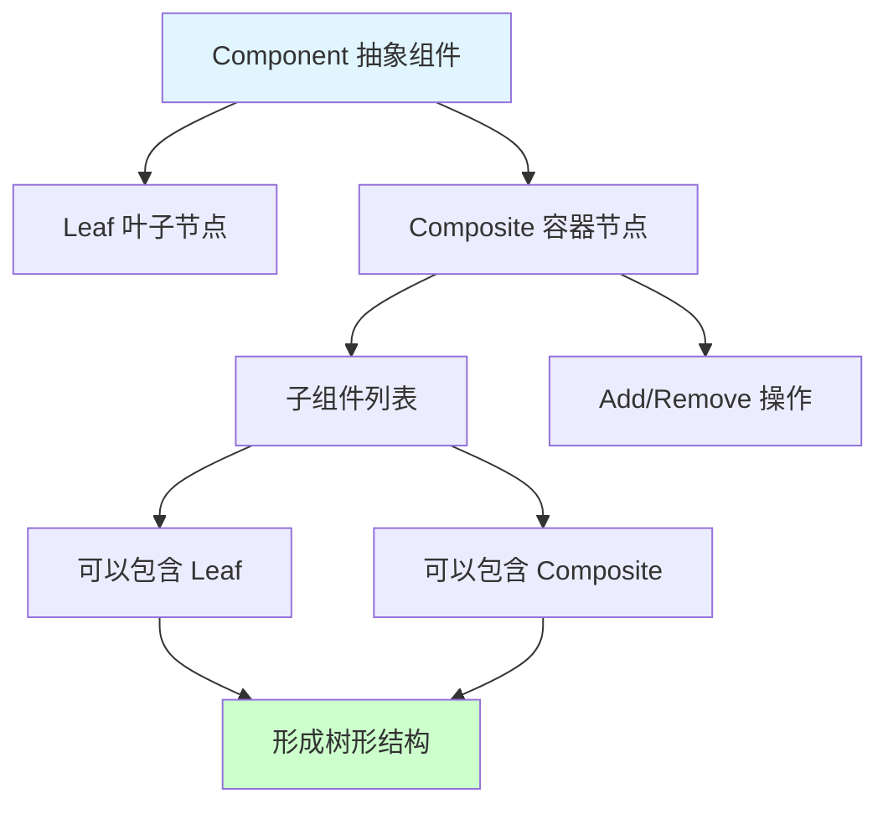

### 享元模式对象共享

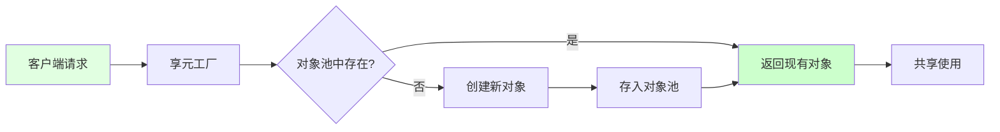

## 📖 原理

### 核心概念

结构型模式关注类和对象的组合，通过继承或组合来构建更大的结构。

#### 🔌 适配器模式（Adapter）

**核心思想：** 将一个类的接口转换成客户期望的另一个接口，使原本不兼容的类可以协同工作。

| 适用场景 | 说明 |
|---------|------|
| 🔄 **接口兼容** | 需要使用现有类，但接口不匹配 |
| 🔧 **复用第三方** | 第三方库接口与项目不符 |
| 🎮 **平台适配** | 不同平台的 API 统一接口 |

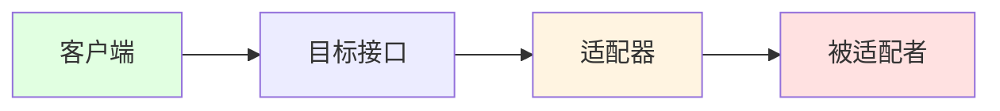

**游戏开发应用：**

```csharp
// 不同的支付接口
public interface IPaymentSystem
{
    void ProcessPayment(float amount);
}

// 第三方支付 SDK
public class ThirdPartyPaymentSDK
{
    public void MakePayment(float money)
    {
        // 第三方实现
    }
}

// 适配器
public class PaymentAdapter : IPaymentSystem
{
    private ThirdPartyPaymentSDK _sdk = new ThirdPartyPaymentSDK();

    public void ProcessPayment(float amount)
    {
        _sdk.MakePayment(amount);
    }
}
```

#### 🎨 装饰器模式（Decorator）

**核心思想：** 动态地给对象添加额外职责，比继承更灵活。

| 优势 | 说明 |
|------|------|
| 🔧 **动态添加** | 运行时添加功能 |
| 🎯 **单一职责** | 每个装饰器只负责一个功能 |
| 🔄 **灵活组合** | 可以任意组合装饰器 |

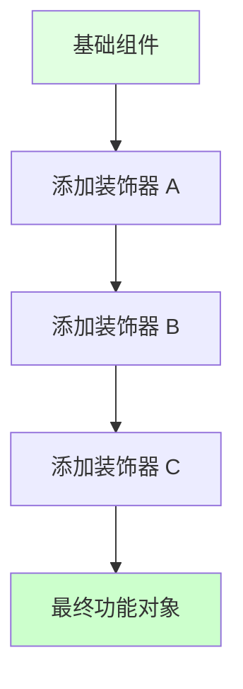

**游戏开发应用：**

```csharp
// 基础武器接口
public interface IWeapon
{
    float GetDamage();
    string GetDescription();
}

// 基础武器
public class Sword : IWeapon
{
    public float GetDamage() => 10f;
    public string GetDescription() => "剑";
}

// 装饰器基类
public abstract class WeaponDecorator : IWeapon
{
    protected IWeapon _weapon;

    public WeaponDecorator(IWeapon weapon)
    {
        _weapon = weapon;
    }

    public virtual float GetDamage()
    {
        return _weapon.GetDamage();
    }

    public virtual string GetDescription()
    {
        return _weapon.GetDescription();
    }
}

// 具体装饰器
public class FireEnchantment : WeaponDecorator
{
    public FireEnchantment(IWeapon weapon) : base(weapon) { }

    public override float GetDamage()
    {
        return base.GetDamage() + 5f;
    }

    public override string GetDescription()
    {
        return base.GetDescription() + "+火焰附魔";
    }
}

// 使用
IWeapon weapon = new Sword();
weapon = new FireEnchantment(weapon);
float damage = weapon.GetDamage(); // 15
```

#### 🛡️ 代理模式（Proxy）

**核心思想：** 为其他对象提供一种代理以控制对这个对象的访问。

| 代理类型 | 应用场景 |
|---------|---------|
| **远程代理** | 网络对象、跨进程调用 |
| **虚拟代理** | 延迟加载、按需创建 |
| **保护代理** | 权限控制、访问限制 |
| **智能引用** | 引用计数、缓存 |

**游戏开发应用：**

```csharp
// 虚拟代理：延迟加载图片
public class ImageProxy
{
    private RealImage _realImage;
    private string _fileName;

    public ImageProxy(string fileName)
    {
        _fileName = fileName;
    }

    public void Display()
    {
        if (_realImage == null)
        {
            _realImage = new RealImage(_fileName);
        }
        _realImage.Display();
    }
}
```

#### 🌉 桥接模式（Bridge）

**核心思想：** 将抽象部分与实现部分分离，使它们都可以独立地变化。

| 优势 | 说明 |
|------|------|
| 🔧 **分离抽象** | 抽象和实现独立变化 |
| 🎯 **扩展性强** | 可以独立扩展抽象和实现 |
| 💾 **减少子类** | 避免类爆炸 |

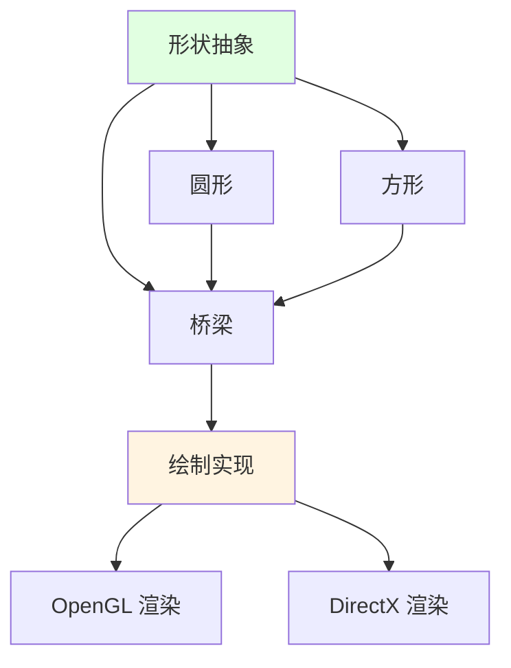

**游戏开发应用：**

```csharp
// 实现接口：渲染 API
public interface IRenderer
{
    void RenderShape(string shape);
}

// 具体实现
public class OpenGLRenderer : IRenderer
{
    public void RenderShape(string shape)
    {
        Debug.Log($"OpenGL 渲染: {shape}");
    }
}

public class DirectXRenderer : IRenderer
{
    public void RenderShape(string shape)
    {
        Debug.Log($"DirectX 渲染: {shape}");
    }
}

// 抽象
public abstract class Shape
{
    protected IRenderer _renderer;

    public Shape(IRenderer renderer)
    {
        _renderer = renderer;
    }

    public abstract void Draw();
}

// 具体形状
public class Circle : Shape
{
    public Circle(IRenderer renderer) : base(renderer) { }

    public override void Draw()
    {
        _renderer.RenderShape("圆形");
    }
}
```

#### 🏪 外观模式（Facade）

**核心思想：** 为子系统中的一组接口提供一个统一的高层接口，使子系统更容易使用。

| 优势 | 说明 |
|------|------|
| 🎯 **简化接口** | 提供简单统一的接口 |
| 🔧 **降低耦合** | 客户端与子系统解耦 |
| 💚 **易于使用** | 减少客户端复杂度 |

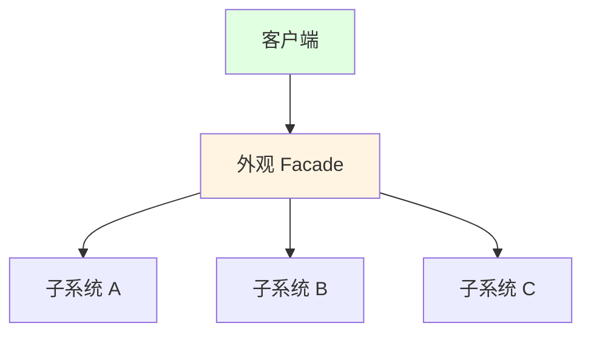

**游戏开发应用：**

```csharp
// 外观：统一资源加载
public class ResourceFacade
{
    private AssetLoader _assetLoader;
    private TextureLoader _textureLoader;
    private AudioLoader _audioLoader;

    public void LoadAll()
    {
        _assetLoader.LoadAssets();
        _textureLoader.LoadTextures();
        _audioLoader.LoadAudio();
    }

    public void UnloadAll()
    {
        _audioLoader.UnloadAudio();
        _textureLoader.UnloadTextures();
        _assetLoader.UnloadAssets();
    }
}
```

#### 🌲 组合模式（Composite）

**核心思想：** 将对象组合成树形结构以表示"部分-整体"的层次结构，使用户对单个对象和组合对象的使用具有一致性。

| 优势 | 说明 |
|------|------|
| 🌲 **树形结构** | 清晰表示层次关系 |
| 🎯 **统一处理** | 统一处理个体和整体 |
| 🔧 **易扩展** | 容易添加新类型 |

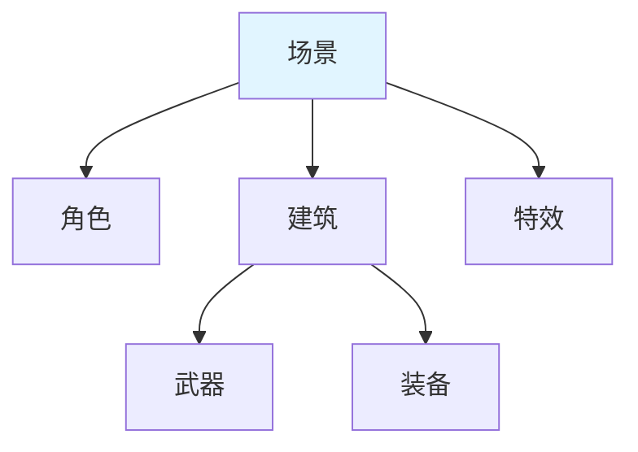

**游戏开发应用：**

```csharp
// 组件基类
public abstract class GameObject
{
    protected List<GameObject> _children = new List<GameObject>();

    public virtual void Add(GameObject child)
    {
        _children.Add(child);
    }

    public virtual void Remove(GameObject child)
    {
        _children.Remove(child);
    }

    public abstract void Update();
}

// 叶子节点
public class Weapon : GameObject
{
    public override void Add(GameObject child)
    {
        throw new NotSupportedException("叶子节点不能添加子节点");
    }

    public override void Update()
    {
        Debug.Log("武器更新");
    }
}

// 容器节点
public class Character : GameObject
{
    public override void Update()
    {
        Debug.Log("角色更新");
        foreach (var child in _children)
        {
            child.Update();
        }
    }
}
```

#### ✈️ 享元模式（Flyweight）

**核心思想：** 运用共享技术有效地支持大量细粒度的对象，减少内存占用。

| 适用场景 | 说明 |
|---------|------|
| 🎮 **大量对象** | 系统中有大量相似对象 |
| 💾 **内存优化** | 需要减少内存占用 |
| 🔄 **对象共享** | 对象的大部分状态可外部化 |

**游戏开发应用：**

```csharp
// 享元工厂
public class TreeFactory
{
    private Dictionary<string, TreeType> _treeTypes = new Dictionary<string, TreeType>();

    public TreeType GetTreeType(string name, Color color, string texture)
    {
        string key = $"{name}_{color}_{texture}";

        if (!_treeTypes.ContainsKey(key))
        {
            _treeTypes[key] = new TreeType(name, color, texture);
        }

        return _treeTypes[key];
    }
}

// 享元对象
public class Tree
{
    private TreeType _type;  // 内部状态（共享）
    private int _x, _y;      // 外部状态（不共享）

    public Tree(TreeType type, int x, int y)
    {
        _type = type;
        _x = x;
        _y = y;
    }

    public void Draw()
    {
        _type.Draw(_x, _y);
    }
}
```

---

## 💡 面试题

### Q：适配器模式和装饰器模式有什么区别？

#### 🎯 核心区别对比

| 维度 | 适配器模式 | 装饰器模式 |
|------|-----------|-----------|
| **目的** | 接口转换 | 功能增强 |
| **改变** | 改变接口 | 不改变接口 |
| **透明性** | 不透明 | 透明 |
| **关注点** | 兼容性 | 扩展性 |
| **使用方式** | 一次性 | 可嵌套 |

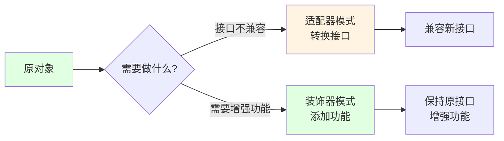

#### 🎮 游戏开发实例对比

**适配器模式应用：**

```csharp
// 场景：统一不同平台的输入接口

// 目标接口
public interface IInputManager
{
    Vector2 GetAxis();
    bool GetButton(string buttonName);
}

// Android 平台输入
public class AndroidInput
{
    public Vector2 GetTouchPosition() { /*...*/ }
    public bool IsTouching() { /*...*/ }
}

// iOS 平台输入
public class IOSInput
{
    public Vector2 GetAccelerometer() { /*...*/ }
    public bool GetTap() { /*...*/ }
}

// Android 适配器
public class AndroidInputAdapter : IInputManager
{
    private AndroidInput _input;

    public Vector2 GetAxis()
    {
        return _input.GetTouchPosition();
    }

    public bool GetButton(string buttonName)
    {
        return _input.IsTouching();
    }
}

// iOS 适配器
public class IOSInputAdapter : IInputManager
{
    private IOSInput _input;

    public Vector2 GetAxis()
    {
        return _input.GetAccelerometer();
    }

    public bool GetButton(string buttonName)
    {
        return _input.GetTap();
    }
}
```

**装饰器模式应用：**

```csharp
// 场景：为武器动态添加特效

// 基础武器接口
public interface IWeapon
{
    void Attack();
}

// 基础剑
public class BasicSword : IWeapon
{
    public void Attack()
    {
        Debug.Log("普通攻击");
    }
}

// 火焰装饰器
public class FireDecorator : IWeapon
{
    private IWeapon _weapon;

    public FireDecorator(IWeapon weapon)
    {
        _weapon = weapon;
    }

    public void Attack()
    {
        _weapon.Attack();
        Debug.Log("附加火焰伤害");
    }
}

// 冰霜装饰器
public class IceDecorator : IWeapon
{
    private IWeapon _weapon;

    public IceDecorator(IWeapon weapon)
    {
        _weapon = weapon;
    }

    public void Attack()
    {
        _weapon.Attack();
        Debug.Log("附加冰霜减速");
    }
}

// 使用：可以嵌套多层
IWeapon sword = new BasicSword();
sword = new FireDecorator(sword);
sword = new IceDecorator(sword);

sword.Attack();
// 输出：
// 普通攻击
// 附加火焰伤害
// 附加冰霜减速
```

#### 💡 选择决策

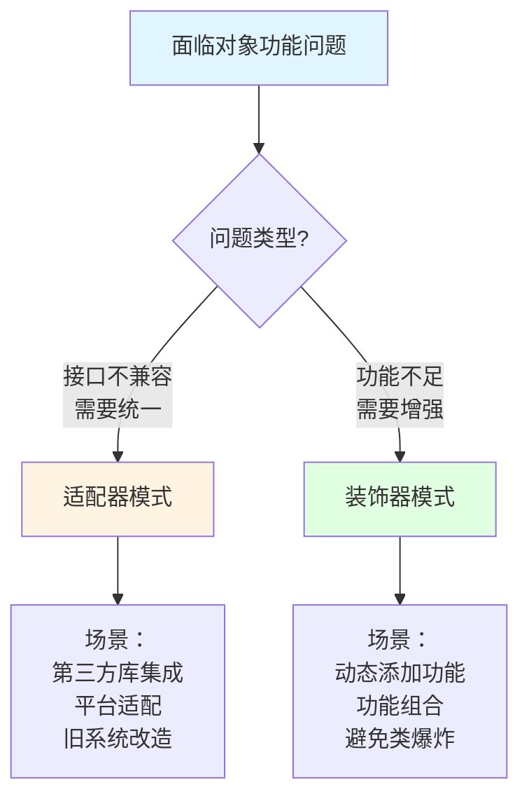

> [!tip] 总结
> - **适配器模式**：解决"接口不兼容"问题，重点是**转换**
> - **装饰器模式**：解决"功能扩展"问题，重点是**增强**

---

### Q：代理模式和装饰器模式看起来很像，有什么本质区别？

#### 🎯 本质区别分析

| 维度 | 代理模式 | 装饰器模式 |
|------|---------|-----------|
| **目的** | 控制访问 | 增强功能 |
| **透明性** | 对客户端隐藏代理存在 | 客户端知道装饰的存在 |
| **创建时机** | 通常在编译时确定 | 运行时动态组合 |
| **关注点** | 访问控制、优化 | 功能扩展 |
| **自我引用** | 代理管理对象的引用 | 装饰器包装对象 |

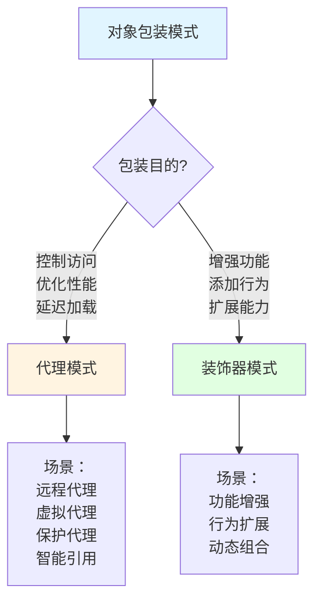

#### 🎮 游戏开发实例对比

**代理模式应用：延迟加载大对象**

```csharp
// 场景：延迟加载大型 3D 模型

public interface IModel
{
    void Render();
}

public class HighPolyModel : IModel
{
    private MeshData _meshData;

    public HighPolyModel()
    {
        // 加载耗时操作
        _meshData = LoadHeavyMesh();
    }

    public void Render()
    {
        // 渲染模型
        _meshData.Render();
    }

    private MeshData LoadHeavyMesh()
    {
        // 模拟耗时加载
        Thread.Sleep(2000);
        return new MeshData();
    }
}

// 虚拟代理
public class ModelProxy : IModel
{
    private HighPolyModel _realModel;
    private string _modelPath;

    public ModelProxy(string path)
    {
        _modelPath = path;
    }

    public void Render()
    {
        // 延迟加载：只有在真正需要时才创建
        if (_realModel == null)
        {
            Debug.Log("延迟加载模型...");
            _realModel = new HighPolyModel();
        }

        _realModel.Render();
    }
}

// 使用
IModel model = new ModelProxy("hero_model");
// 此时还未真正加载

// 只有在渲染时才真正加载
model.Render();
```

**装饰器模式应用：增强武器功能**

```csharp
// 场景：为武器添加多种属性加成

public interface IWeapon
{
    float GetDamage();
    void Attack();
}

public class BasicSword : IWeapon
{
    public float GetDamage() => 10f;

    public void Attack()
    {
        Debug.Log($"造成 {GetDamage()} 点伤害");
    }
}

// 攻击力装饰器
public class DamageBoostDecorator : IWeapon
{
    private IWeapon _weapon;
    private float _boost;

    public DamageBoostDecorator(IWeapon weapon, float boost)
    {
        _weapon = weapon;
        _boost = boost;
    }

    public float GetDamage()
    {
        return _weapon.GetDamage() + _boost;
    }

    public void Attack()
    {
        _weapon.Attack();
    }
}

// 暴击装饰器
public class CriticalDecorator : IWeapon
{
    private IWeapon _weapon;
    private float _criticalChance;

    public CriticalDecorator(IWeapon weapon, float chance)
    {
        _weapon = weapon;
        _criticalChance = chance;
    }

    public float GetDamage()
    {
        return _weapon.GetDamage();
    }

    public void Attack()
    {
        if (Random.value < _criticalChance)
        {
            Debug.Log("暴击！");
            Debug.Log($"造成 {_weapon.GetDamage() * 2} 点伤害");
        }
        else
        {
            _weapon.Attack();
        }
    }
}

// 使用：运行时动态组合
IWeapon weapon = new BasicSword();
weapon = new DamageBoostDecorator(weapon, 5f);  // +5 攻击力
weapon = new CriticalDecorator(weapon, 0.3f);   // 30% 暴击率

weapon.Attack();
```

#### 🔍 识别方法

**如何判断是代理还是装饰器：**

| 判断依据 | 代理模式 | 装饰器模式 |
|---------|---------|-----------|
| **客户端知道吗？** | 客户端可能不知道是代理 | 客户端明确知道添加了装饰 |
| **创建方式** | 通常在内部创建 | 客户端主动创建并包装 |
| **目的** | 控制或优化对象访问 | 扩展对象功能 |
| **接口变化** | 接口通常保持一致 | 接口保持一致，但增强行为 |

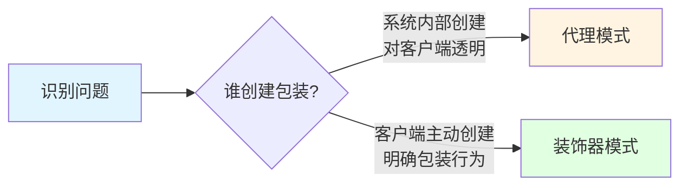

> [!tip] 实战建议
> - **延迟加载、缓存、权限控制** → **代理模式**
> - **功能增强、行为扩展、动态组合** → **装饰器模式**

---

### Q：享元模式在游戏开发中如何应用？有什么注意事项？

#### 🎯 享元模式核心概念

**本质：** 通过共享对象来减少内存占用，将对象的状态分为：

| 状态类型 | 说明 | 示例 |
|---------|------|------|
| **内部状态** | 可共享的、不变的部分 | 模型、纹理、颜色 |
| **外部状态** | 不可共享的、变化的部分 | 位置、旋转、缩放 |

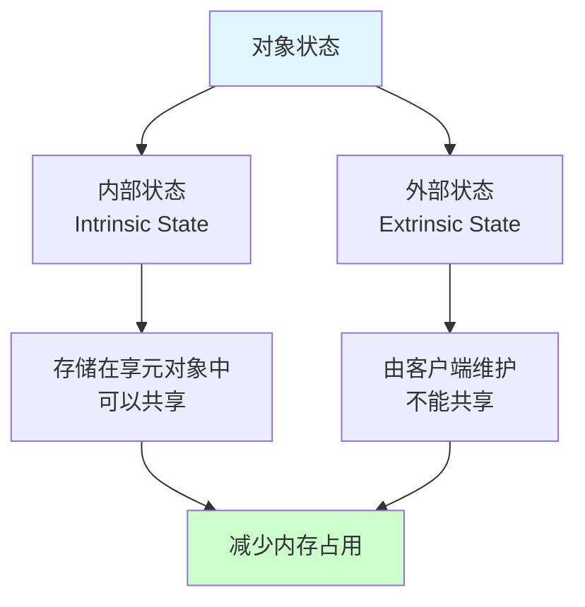

#### 🎮 游戏开发典型应用

**1️⃣ 树木/草地渲染：**

```csharp
// 享元对象：树类型（内部状态）
public class TreeType
{
    public string Name { get; }
    public Color Color { get; }
    public Mesh Mesh { get; }
    public Texture Texture { get; }

    public TreeType(string name, Color color, Mesh mesh, Texture texture)
    {
        Name = name;
        Color = color;
        Mesh = mesh;
        Texture = texture;
    }

    public void Draw(Vector3 position, float scale)
    {
        // 使用共享的网格和纹理绘制
        Graphics.DrawMesh(Mesh, position, Quaternion.identity, new Material(Texture), 0);
    }
}

// 享元工厂
public class TreeFactory
{
    private Dictionary<string, TreeType> _treeTypes = new Dictionary<string, TreeType>();

    public TreeType GetTreeType(string name, Color color, Mesh mesh, Texture texture)
    {
        string key = $"{name}_{color}";

        if (!_treeTypes.ContainsKey(key))
        {
            _treeTypes[key] = new TreeType(name, color, mesh, texture);
            Debug.Log($"创建新的树类型: {key}");
        }

        return _treeTypes[key];
    }

    public int GetTreeTypeCount()
    {
        return _treeTypes.Count;
    }
}

// 树对象（包含外部状态）
public class Tree
{
    private TreeType _type;
    private Vector3 _position;
    private float _scale;

    public Tree(TreeType type, Vector3 position, float scale)
    {
        _type = type;
        _position = position;
        _scale = scale;
    }

    public void Draw()
    {
        _type.Draw(_position, _scale);
    }
}

// 森林（客户端）
public class Forest
{
    private List<Tree> _trees = new List<Tree>();
    private TreeFactory _factory = new TreeFactory();

    public void PlantTree(string name, Color color, Vector3 position, float scale)
    {
        TreeType type = _factory.GetTreeType(name, color, LoadMesh(name), LoadTexture(name));
        Tree tree = new Tree(type, position, scale);
        _trees.Add(tree);
    }

    public void Draw()
    {
        foreach (var tree in _trees)
        {
            tree.Draw();
        }
    }
}
```

**效果对比：**

| 方式 | 对象数量 | 内存占用 |
|------|---------|---------|
| **不使用享元** | 10,000 棵树独立对象 | ~1000 MB |
| **使用享元** | 5 种树类型 + 10,000 个轻量对象 | ~50 MB |

**2️⃣ 粒子系统：**

```csharp
// 粒子类型享元
public class ParticleType
{
    public Texture Texture { get; }
    public Material Material { get; }
    public float Lifetime { get; }
    public Color Color { get; }

    public ParticleType(Texture texture, Material material, float lifetime, Color color)
    {
        Texture = texture;
        Material = material;
        Lifetime = lifetime;
        Color = color;
    }
}

// 粒子对象
public class Particle
{
    private ParticleType _type;
    private Vector3 _position;
    private Vector3 _velocity;
    private float _age;

    public Particle(ParticleType type, Vector3 position, Vector3 velocity)
    {
        _type = type;
        _position = position;
        _velocity = velocity;
        _age = 0f;
    }

    public bool Update(float deltaTime)
    {
        _age += deltaTime;
        _position += _velocity * deltaTime;
        return _age < _type.Lifetime;
    }
}
```

**3️⃣ 字符渲染：**

```csharp
// 字符享元
public class CharacterFlyweight
{
    public char Character { get; }
    public Texture2D Texture { get; }
    public Vector2[] UVs { get; }

    public CharacterFlyweight(char c, Texture2D texture, Vector2[] uvs)
    {
        Character = c;
        Texture = texture;
        UVs = uvs;
    }
}

// 字符工厂
public class CharacterFactory
{
    private Dictionary<char, CharacterFlyweight> _characters = new Dictionary<char, CharacterFlyweight>();

    public CharacterFlyweight GetCharacter(char c)
    {
        if (!_characters.ContainsKey(c))
        {
            Texture2D texture = LoadCharacterTexture(c);
            Vector2[] uvs = CalculateUVs(c);
            _characters[c] = new CharacterFlyweight(c, texture, uvs);
        }

        return _characters[c];
    }
}
```

#### ⚠️ 注意事项

**1️⃣ 确保内部状态真正不变：**

| 问题 | 说明 | 解决方案 |
|------|------|---------|
| 状态变化 | 共享对象被修改 | 严格控制享元对象不可变 |
| 线程安全 | 多线程访问共享对象 | 使用锁或不可变设计 |

**2️⃣ 权衡内存与性能：**

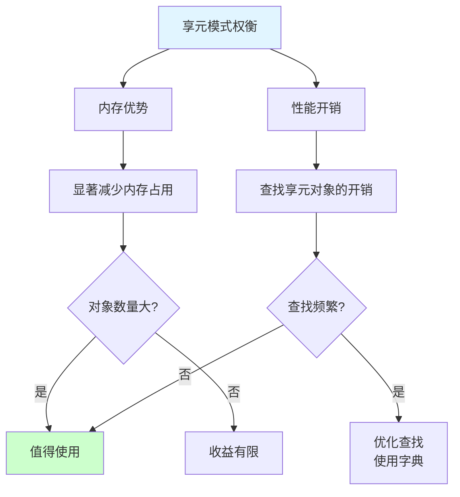

**3️⃣ 正确识别内部/外部状态：**

| 状态类型 | 可共享 | 示例 |
|---------|-------|------|
| ✅ **内部状态** | 可共享 | 模型、纹理、材质、颜色 |
| ❌ **外部状态** | 不可共享 | 位置、旋转、缩放、速度 |

**4️⃣ 与对象池的区别：**

| 维度 | 享元模式 | 对象池 |
|------|---------|-------|
| **目的** | 减少内存占用 | 减少创建/销毁开销 |
| **共享方式** | 同时共享 | 轮流使用 |
| **状态** | 内部状态共享，外部状态独立 | 每次使用时重置状态 |

> [!tip] 最佳实践
> 1. **对象数量大**（成百上千）时考虑使用享元
> 2. 确保内部状态**真正不变**
> 3. 使用高效的查找结构（Dictionary）
> 4. 享元对象应该是**不可变的**
> 5. 注意**线程安全**问题

---

## 🔗 相关链接

- [[设计模式]] - 父主题索引
- [[常用设计模式概述]] - 相关主题：设计模式分类
- [[创建型模式]] - 相关主题：单例、工厂、建造者
- [[行为型模式]] - 相关主题：观察者、策略、命令
- [[游戏专用模式]] - 相关主题：对象池、ECS、组件
