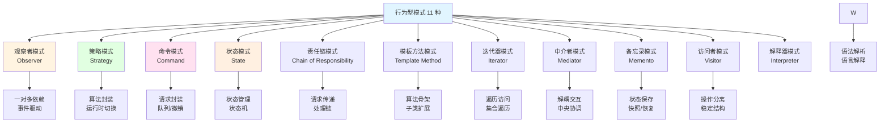
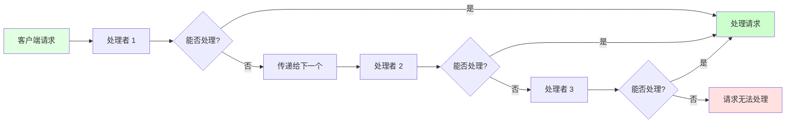
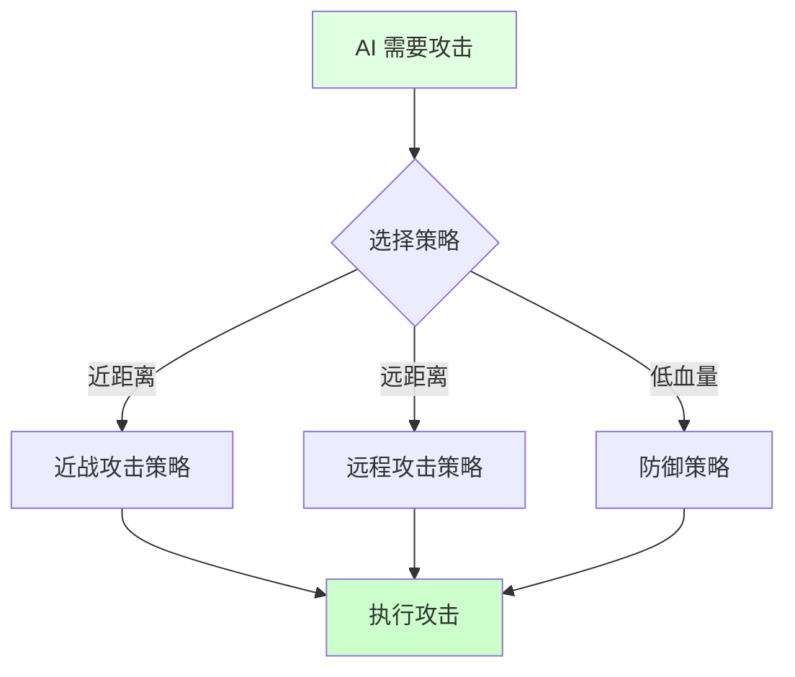
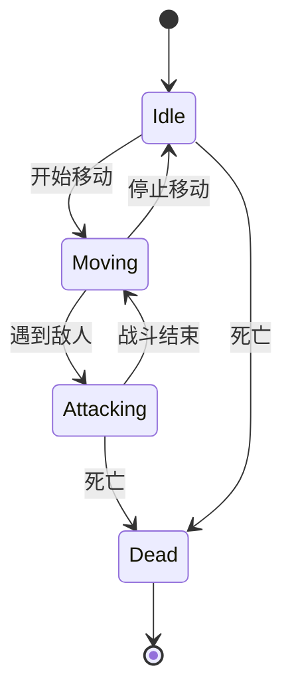
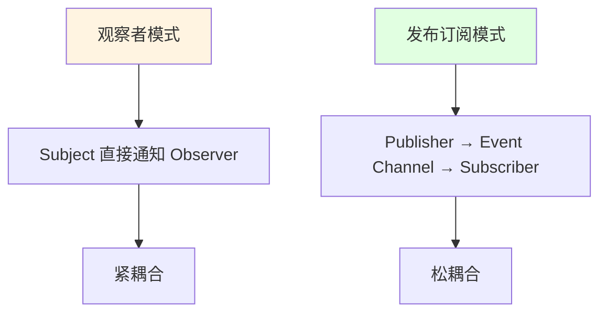
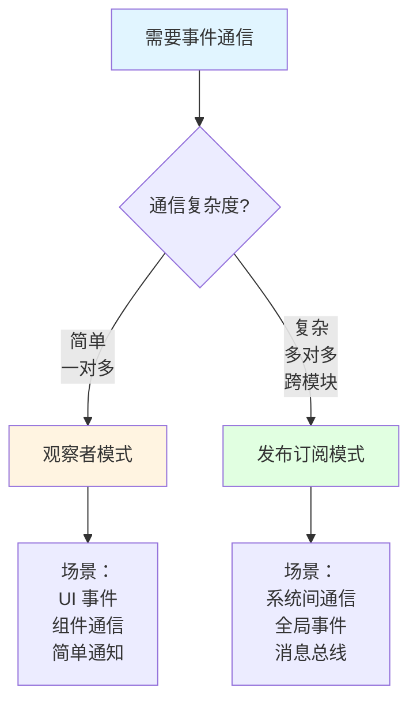
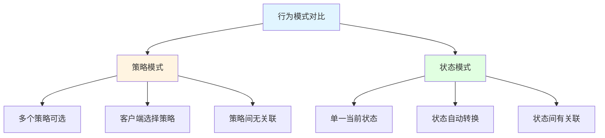
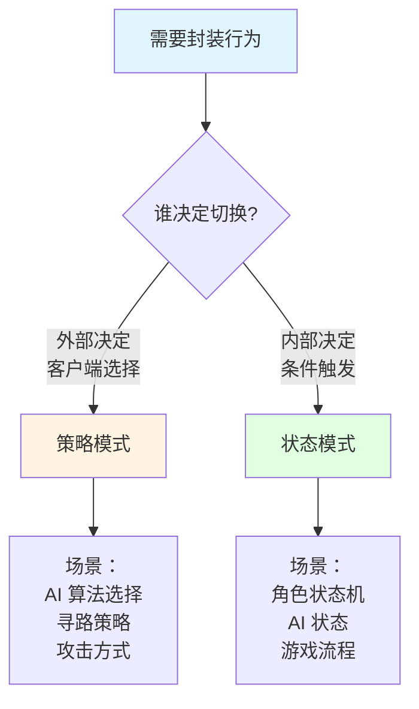
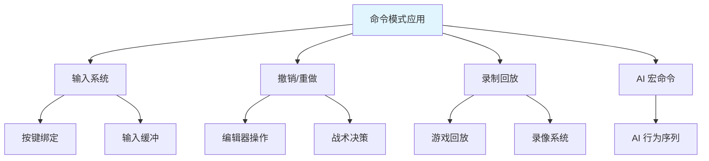

## 📊 图解

> [!info] 图示区
> 这里可以放置解释行为型设计模式的 mermaid 图表、UML 类图或其他辅助理解的图片

### 行为型模式分类



### 观察者模式结构

```mermaid
classDiagram
    class Subject {
        -observers: List
        +Attach observer
        +Detach observer
        +Notify
    }

    class Observer {
        <<interface>>
        +Update
    }

    class ConcreteSubject {
        -state: State
        +GetState
        +SetState
    }

    class ConcreteObserver {
        -subject: Subject
        +Update
    }

    Subject --> Observer : 订阅
    ConcreteSubject --|> Subject
    ConcreteObserver ..|> Observer
    ConcreteObserver --> Subject : 引用

    note right of Subject
        主题维护观察者列表
        状态变化时通知所有观察者
    end note
```

### 策略模式结构

```mermaid
classDiagram
    class Strategy {
        <<interface>>
        +Execute
    }

    class ConcreteStrategyA {
        +Execute
    }

    class ConcreteStrategyB {
        +Execute
    }

    class Context {
        -strategy: Strategy
        +SetStrategy
        +DoAction
    }

    Strategy <|.. ConcreteStrategyA
    Strategy <|.. ConcreteStrategyB
    Context --> Strategy

    note right of Context
        上下文维护策略对象
        可以在运行时切换策略
    end note
```

### 命令模式结构

```mermaid
classDiagram
    class Command {
        <<interface>>
        +Execute
        +Undo
    }

    class ConcreteCommand {
        -receiver: Receiver
        +Execute
        +Undo
    }

    class Invoker {
        -command: Command
        +SetCommand
        +ExecuteCommand
    }

    class Receiver {
        +Action
    }

    Command <|.. ConcreteCommand
    ConcreteCommand --> Receiver
    Invoker --> Command

    note right of Invoker
        调用者通过命令对象
        间接操作接收者
    end note
```

### 状态模式结构

```mermaid
classDiagram
    class State {
        <<interface>>
        +Handle
    }

    class Context {
        -state: State
        +SetState
        +Request
    }

    class ConcreteStateA {
        +Handle
    }

    class ConcreteStateB {
        +Handle
    }

    State <|.. ConcreteStateA
    State <|.. ConcreteStateB
    Context --> State

    note right of Context
        上下文维护当前状态
        状态转换时切换状态对象
    end note
```

### 责任链模式结构



### 模板方法模式结构

```mermaid
classDiagram
    class AbstractClass {
        +TemplateMethod
        #PrimitiveOperation1
        #PrimitiveOperation2
    }

    class ConcreteClass {
        #PrimitiveOperation1
        #PrimitiveOperation2
    }

    AbstractClass <|-- ConcreteClass

    note right of AbstractClass
        定义算法骨架
        子类实现具体步骤
    end note
```

## 📖 原理

### 核心概念

行为型模式关注对象之间的通信、职责划分以及算法的封装，主要解决对象之间的交互问题。

#### 👁️ 观察者模式（Observer）

**核心思想：** 定义对象间的一对多依赖关系，当一个对象状态发生改变时，所有依赖于它的对象都得到通知并自动更新。

| 特性 | 说明 |
|------|------|
| 🎯 **一对多依赖** | 一个主题对应多个观察者 |
| 📡 **事件驱动** | 状态变化触发通知 |
| 🔧 **松耦合** | 主题和观察者互不了解 |

```mermaid
sequenceDiagram
    participant Obs as 观察者
    participant Sub as 主题
    participant Obs1 as 观察者1
    participant Obs2 as 观察者2

    Obs->>Sub: 注册观察者
    Obs->>Sub: 注册观察者

    Note over Sub: 状态发生变化

    Sub->>Obs1: 通知更新
    Sub->>Obs2: 通知更新

    Obs1->>Obs1: 执行更新逻辑
    Obs2->>Obs2: 执行更新逻辑

    style Sub fill:#e1ffe1
```

**游戏开发应用：**

```csharp
// 事件系统（观察者模式）
public class EventManager : MonoBehaviour
{
    private Dictionary<string, List<Action<object>>> _eventDict =
        new Dictionary<string, List<Action<object>>>();

    public void Subscribe(string eventName, Action<object> callback)
    {
        if (!_eventDict.ContainsKey(eventName))
        {
            _eventDict[eventName] = new List<Action<object>>();
        }

        _eventDict[eventName].Add(callback);
    }

    public void Unsubscribe(string eventName, Action<object> callback)
    {
        if (_eventDict.ContainsKey(eventName))
        {
            _eventDict[eventName].Remove(callback);
        }
    }

    public void Publish(string eventName, object data)
    {
        if (_eventDict.ContainsKey(eventName))
        {
            foreach (var callback in _eventDict[eventName])
            {
                callback(data);
            }
        }
    }
}

// 使用示例
public class PlayerHealth : MonoBehaviour
{
    private void OnDamageTaken(int damage)
    {
        EventManager.Instance.Publish("PlayerDamaged", damage);
    }
}

public class UIManager : MonoBehaviour
{
    private void Start()
    {
        EventManager.Instance.Subscribe("PlayerDamaged", OnPlayerDamaged);
    }

    private void OnPlayerDamaged(object data)
    {
        int damage = (int)data;
        UpdateHealthUI(damage);
    }
}
```

#### 🎯 策略模式（Strategy）

**核心思想：** 定义一系列算法，把它们封装起来，并且使它们可以相互替换。

| 优势 | 说明 |
|------|------|
| 🔄 **运行时切换** | 可以在运行时切换算法 |
| 🔧 **易于扩展** | 添加新策略不影响现有代码 |
| 💚 **消除条件语句** | 避免大量的 if-else |



**游戏开发应用：**

```csharp
// 攻击策略接口
public interface IAttackStrategy
{
    void Execute(Character attacker, Character target);
}

// 近战攻击策略
public class MeleeAttackStrategy : IAttackStrategy
{
    public void Execute(Character attacker, Character target)
    {
        float distance = Vector3.Distance(attacker.Position, target.Position);
        if (distance <= attacker.MeleeRange)
        {
            target.TakeDamage(attacker.MeleeDamage);
        }
    }
}

// 远程攻击策略
public class RangedAttackStrategy : IAttackStrategy
{
    public void Execute(Character attacker, Character target)
    {
        Projectile projectile = GameObject.Instantiate(attacker.ProjectilePrefab);
        projectile.Launch(target);
    }
}

// 角色
public class Character
{
    private IAttackStrategy _attackStrategy;

    public void SetAttackStrategy(IAttackStrategy strategy)
    {
        _attackStrategy = strategy;
    }

    public void Attack(Character target)
    {
        _attackStrategy?.Execute(this, target);
    }
}

// 使用
Character enemy = new Character();
enemy.SetAttackStrategy(new MeleeAttackStrategy());
enemy.Attack(player);

// 切换策略
enemy.SetAttackStrategy(new RangedAttackStrategy());
enemy.Attack(player);
```

#### 📜 命令模式（Command）

**核心思想：** 将请求封装为对象，从而允许用不同的请求对客户进行参数化、对请求排队或记录请求日志，以及支持撤销操作。

| 优势 | 说明 |
|------|------|
| 🔄 **撤销/重做** | 容易实现撤销和重做功能 |
| 📝 **请求队列** | 可以对请求进行排队 |
| 🔧 **解耦** | 调用者和接收者解耦 |

```mermaid
sequenceDiagram
    participant Client as 客户端
    participant Invoker as 调用者
    participant Command as 命令
    participant Receiver as 接收者

    Client->>Command: 创建命令
    Client->>Invoker: 设置命令
    Client->>Invoker: 执行命令

    Invoker->>Command: Execute
    Command->>Receiver: Action

    Receiver-->>Command: 完成
    Command-->>Invoker: 完成

    style Client fill:#e1ffe1
    style Receiver fill:#ccffcc
```

**游戏开发应用：**

```csharp
// 命令接口
public interface ICommand
{
    void Execute();
    void Undo();
}

// 移动命令
public class MoveCommand : ICommand
{
    private Character _character;
    private Vector3 _targetPosition;
    private Vector3 _previousPosition;

    public MoveCommand(Character character, Vector3 targetPosition)
    {
        _character = character;
        _targetPosition = targetPosition;
    }

    public void Execute()
    {
        _previousPosition = _character.Position;
        _character.MoveTo(_targetPosition);
    }

    public void Undo()
    {
        _character.MoveTo(_previousPosition);
    }
}

// 输入处理器
public class InputHandler
{
    private Stack<ICommand> _commandHistory = new Stack<ICommand>();

    public void HandleInput()
    {
        if (Input.GetKeyDown(KeyCode.W))
        {
            ICommand moveCommand = new MoveCommand(player, Vector3.forward);
            moveCommand.Execute();
            _commandHistory.Push(moveCommand);
        }

        if (Input.GetKeyDown(KeyCode.Z))
        {
            if (_commandHistory.Count > 0)
            {
                ICommand lastCommand = _commandHistory.Pop();
                lastCommand.Undo();
            }
        }
    }
}
```

#### 🔄 状态模式（State）

**核心思想：** 允许对象在内部状态改变时改变它的行为，对象看起来好像修改了它的类。

| 优势 | 说明 |
|------|------|
| 🎯 **状态管理** | 清晰管理对象状态 |
| 🔧 **易于扩展** | 添加新状态容易 |
| 💚 **消除条件语句** | 避免大量状态判断 |



**游戏开发应用：**

```csharp
// 状态接口
public interface IState
{
    void Enter(Character character);
    void Execute(Character character);
    void Exit(Character character);
}

// 闲置状态
public class IdleState : IState
{
    public void Enter(Character character)
    {
        character.PlayAnimation("Idle");
    }

    public void Execute(Character character)
    {
        if (character.HasEnemyInRange())
        {
            character.ChangeState(new AttackState());
        }
    }

    public void Exit(Character character)
    {
        // 清理
    }
}

// 攻击状态
public class AttackState : IState
{
    public void Enter(Character character)
    {
        character.PlayAnimation("Attack");
    }

    public void Execute(Character character)
    {
        if (!character.HasEnemyInRange())
        {
            character.ChangeState(new IdleState());
        }
    }

    public void Exit(Character character)
    {
        // 清理
    }
}

// 角色状态机
public class Character
{
    private IState _currentState;

    public void ChangeState(IState newState)
    {
        _currentState?.Exit(this);
        _currentState = newState;
        _currentState.Enter(this);
    }

    public void Update()
    {
        _currentState?.Execute(this);
    }
}
```

#### ⛓️ 责任链模式（Chain of Responsibility）

**核心思想：** 为请求创建一个接收者对象链，沿着链传递请求，直到有对象处理它为止。

| 优势 | 说明 |
|------|------|
| 🔧 **解耦** | 发送者和接收者解耦 |
| 🎯 **灵活分配** | 灵活分配职责 |
| ➕ **易于扩展** | 添加新处理器容易 |

**游戏开发应用：**

```csharp
// 处理器接口
public abstract class Handler
{
    protected Handler _nextHandler;

    public void SetNext(Handler handler)
    {
        _nextHandler = handler;
    }

    public abstract void HandleRequest(DamageRequest request);
}

// 护甲处理器
public class ArmorHandler : Handler
{
    public override void HandleRequest(DamageRequest request)
    {
        request.Damage *= 0.8f;  // 减少 20% 伤害
        _nextHandler?.HandleRequest(request);
    }
}

// 护盾处理器
public class ShieldHandler : Handler
{
    public override void HandleRequest(DamageRequest request)
    {
        if (shieldValue > 0)
        {
            float absorbed = Mathf.Min(request.Damage, shieldValue);
            request.Damage -= absorbed;
            shieldValue -= absorbed;
        }

        _nextHandler?.HandleRequest(request);
    }
}

// 使用
Handler armorHandler = new ArmorHandler();
Handler shieldHandler = new ShieldHandler();

armorHandler.SetNext(shieldHandler);

DamageRequest request = new DamageRequest(100);
armorHandler.HandleRequest(request);
```

#### 📋 模板方法模式（Template Method）

**核心思想：** 在父类中定义算法的框架，将一些步骤延迟到子类实现。

| 优势 | 说明 |
|------|------|
| 🎯 **代码复用** | 算法框架复用 |
| 🔧 **易于扩展** | 子类扩展具体步骤 |
| 💚 **统一控制** | 父类控制算法流程 |

**游戏开发应用：**

```csharp
// 角色升级基类
public abstract class LevelUpBase
{
    // 模板方法
    public void LevelUp(Character character)
    {
        IncreaseLevel(character);
        RestoreHealth(character);
        LearnNewSkills(character);
        GrantStatBonus(character);
        ShowLevelUpEffect(character);
    }

    protected abstract void LearnNewSkills(Character character);
    protected abstract void GrantStatBonus(Character character);

    protected void IncreaseLevel(Character character)
    {
        character.Level++;
    }

    protected void RestoreHealth(Character character)
    {
        character.Health = character.MaxHealth;
    }

    protected virtual void ShowLevelUpEffect(Character character)
    {
        // 默认效果
    }
}

// 战士升级
public class WarriorLevelUp : LevelUpBase
{
    protected override void LearnNewSkills(Character character)
    {
        character.AddSkill("Power Strike");
    }

    protected override void GrantStatBonus(Character character)
    {
        character.Strength += 5;
        character.Vitality += 3;
    }

    protected override void ShowLevelUpEffect(Character character)
    {
        // 战士特有效果
        PlayWarriorEffect();
    }
}
```

---

## 💡 面试题

### Q：观察者模式和发布订阅模式有什么区别？

#### 🎯 核心区别对比

| 维度 | 观察者模式 | 发布订阅模式 |
|------|-----------|-------------|
| **通信方式** | 直接通信 | 通过中介通信 |
| **耦合度** | 主题和观察者耦合 | 完全解耦 |
| **同步性** | 通常同步 | 可以异步 |
| **复杂度** | 简单 | 复杂 |



#### 🎮 游戏开发实现对比

**观察者模式实现：**

```csharp
// 观察者模式：直接依赖
public class PlayerHealth : MonoBehaviour
{
    // 直接维护观察者列表
    private List<IHealthObserver> _observers = new List<IHealthObserver>();

    public void AddObserver(IHealthObserver observer)
    {
        _observers.Add(observer);
    }

    public void TakeDamage(int damage)
    {
        Health -= damage;

        // 直接通知所有观察者
        foreach (var observer in _observers)
        {
            observer.OnHealthChanged(Health);
        }
    }
}

public interface IHealthObserver
{
    void OnHealthChanged(int newHealth);
}

public class HealthUI : MonoBehaviour, IHealthObserver
{
    public void OnHealthChanged(int newHealth)
    {
        UpdateHealthBar(newHealth);
    }
}
```

**发布订阅模式实现：**

```csharp
// 发布订阅模式：通过事件总线解耦
public class EventBus
{
    private static EventBus _instance;
    public static EventBus Instance
    {
        get { return _instance ??= new EventBus(); }
    }

    private Dictionary<string, List<Action<object>>> _events =
        new Dictionary<string, List<Action<object>>>();

    public void Subscribe(string eventName, Action<object> callback)
    {
        if (!_events.ContainsKey(eventName))
        {
            _events[eventName] = new List<Action<object>>();
        }
        _events[eventName].Add(callback);
    }

    public void Publish(string eventName, object data)
    {
        if (_events.ContainsKey(eventName))
        {
            foreach (var callback in _events[eventName])
            {
                callback(data);
            }
        }
    }
}

// 发布者：不知道订阅者
public class PlayerHealth : MonoBehaviour
{
    public void TakeDamage(int damage)
    {
        Health -= damage;

        // 通过事件总线发布
        EventBus.Instance.Publish("HealthChanged", Health);
    }
}

// 订阅者：不知道发布者
public class HealthUI : MonoBehaviour
{
    private void OnEnable()
    {
        EventBus.Instance.Subscribe("HealthChanged", OnHealthChanged);
    }

    private void OnHealthChanged(object data)
    {
        int newHealth = (int)data;
        UpdateHealthBar(newHealth);
    }

    private void OnDisable()
    {
        EventBus.Instance.Unsubscribe("HealthChanged", OnHealthChanged);
    }
}
```

#### 💡 选择建议



| 场景 | 推荐模式 | 原因 |
|------|---------|------|
| 组件内部事件 | 观察者模式 | 简单直接 |
| UI 事件 | 观察者模式 | 一对多关系明确 |
| 系统级事件 | 发布订阅 | 解耦要求高 |
| 网络消息 | 发布订阅 | 异步处理 |

> [!tip] 实战建议
> - **简单的一对多关系** → **观察者模式**
> - **复杂的系统级通信** → **发布订阅模式**
> - **需要异步处理** → **发布订阅模式**

---

### Q：策略模式和状态模式有什么区别？

#### 🎯 核心区别分析

| 维度 | 策略模式 | 状态模式 |
|------|---------|---------|
| **目的** | 封装算法 | 管理状态 |
| **切换方式** | 客户端主动切换 | 状态内部自动切换 |
| **数量** | 多个策略可共存 | 只有一个当前状态 |
| **依赖关系** | 策略间独立 | 状态间可能有关联 |



#### 🎮 游戏开发实例对比

**策略模式：AI 攻击策略**

```csharp
// 策略模式：多个策略共存，客户端选择
public class AIController
{
    private List<IAttackStrategy> _availableStrategies = new List<IAttackStrategy>();
    private IAttackStrategy _currentStrategy;

    public AIController()
    {
        // 所有策略都可用
        _availableStrategies.Add(new MeleeStrategy());
        _availableStrategies.Add(new RangedStrategy());
        _availableStrategies.Add(new DefensiveStrategy());

        // 客户端主动选择策略
        _currentStrategy = _availableStrategies[0];
    }

    public void SetStrategy(int index)
    {
        _currentStrategy = _availableStrategies[index];
    }

    public void ExecuteAttack()
    {
        _currentStrategy.Execute();
    }
}

// 策略之间是独立的，互不影响
public class MeleeStrategy : IAttackStrategy
{
    public void Execute()
    {
        Debug.Log("使用近战攻击");
    }
}

public class RangedStrategy : IAttackStrategy
{
    public void Execute()
    {
        Debug.Log("使用远程攻击");
    }
}
```

**状态模式：角色状态机**

```csharp
// 状态模式：只有一个当前状态，状态自动转换
public class CharacterState
{
    private IState _currentState;

    public CharacterState()
    {
        // 初始状态
        _currentState = new IdleState();
        _currentState.Enter(this);
    }

    public void Update()
    {
        // 状态自动决定是否转换
        _currentState.Execute(this);
    }

    public void ChangeState(IState newState)
    {
        _currentState.Exit(this);
        _currentState = newState;
        _currentState.Enter(this);
    }
}

// 状态之间可以相互转换
public class IdleState : IState
{
    public void Execute(CharacterState character)
    {
        // 状态内部决定转换
        if (SeeEnemy())
        {
            character.ChangeState(new AttackState());
        }
        else if (IsMoving())
        {
            character.ChangeState(new MoveState());
        }
    }
}

public class AttackState : IState
{
    public void Execute(CharacterState character)
    {
        Attack();

        // 攻击完成后转换状态
        if (!HasTarget())
        {
            character.ChangeState(new IdleState());
        }
    }
}
```

#### 📊 详细对比表

| 特征 | 策略模式 | 状态模式 |
|------|---------|---------|
| **目的** | 封装不同算法 | 表示不同状态 |
| **切换触发** | 客户端主动 | 状态内部条件 |
| **对象数量** | 可以有多个策略对象 | 只有一个当前状态对象 |
| **对象生命周期** | 策略对象可以长期存在 | 状态对象可能频繁创建销毁 |
| **相互了解** | 策略间互不了解 | 状态间可能需要了解 |
| **上下文** | 上下文持有策略引用 | 状态持有上下文引用 |
| **扩展性** | 添加新策略容易 | 添加新状态容易 |

#### 💡 选择决策树



| 场景 | 推荐模式 | 典型例子 |
|------|---------|---------|
| 多种算法可选 | 策略模式 | 寻路算法（A*、Dijkstra） |
| 对象状态管理 | 状态模式 | 角色状态（待机、移动、攻击） |
| 行为切换 | 策略模式 | AI 行为（攻击、防御、逃跑） |
| 流程控制 | 状态模式 | 游戏流程（主菜单、游戏、暂停） |

> [!tip] 实战技巧
> - **外部控制行为切换** → **策略模式**
> - **内部状态自动转换** → **状态模式**
> - **多个策略可以共存** → **策略模式**
> - **同时只能处于一个状态** → **状态模式**

---

### Q：命令模式在游戏开发中有哪些典型应用？

#### 🎯 命令模式核心价值

命令模式在游戏开发中非常有价值，主要体现在：

| 优势 | 说明 | 应用场景 |
|------|------|---------|
| 🔄 **撤销/重做** | 记录命令历史，支持撤销 | 编辑器、策略游戏 |
| ⏯️ **录制回放** | 记录命令序列 | 游戏回放系统 |
| 📝 **输入队列** | 延迟执行输入 | 网络同步 |
| 🔌 **解耦输入** | 输入与逻辑分离 | 输入系统 |



#### 🎮 典型应用场景

**1️⃣ 输入系统（按键绑定）：**

```csharp
// 命令接口
public interface ICommand
{
    void Execute(GameObject player);
}

// 移动命令
public class MoveCommand : ICommand
{
    private Vector3 _direction;

    public MoveCommand(Vector3 direction)
    {
        _direction = direction;
    }

    public void Execute(GameObject player)
    {
        player.transform.position += _direction * Time.deltaTime;
    }
}

// 跳跃命令
public class JumpCommand : ICommand
{
    public void Execute(GameObject player)
    {
        Rigidbody rb = player.GetComponent<Rigidbody>();
        rb.AddForce(Vector3.up * 10f, ForceMode.Impulse);
    }
}

// 输入处理器
public class InputHandler : MonoBehaviour
{
    private Dictionary<KeyCode, ICommand> _keyBindings = new Dictionary<KeyCode, ICommand>();

    private void Start()
    {
        // 按键绑定
        _keyBindings[KeyCode.W] = new MoveCommand(Vector3.forward);
        _keyBindings[KeyCode.S] = new MoveCommand(Vector3.back);
        _keyBindings[KeyCode.A] = new MoveCommand(Vector3.left);
        _keyBindings[KeyCode.D] = new MoveCommand(Vector3.right);
        _keyBindings[KeyCode.Space] = new JumpCommand();
    }

    private void Update()
    {
        foreach (var binding in _keyBindings)
        {
            if (Input.GetKeyDown(binding.Key))
            {
                binding.Value.Execute(gameObject);
            }
        }
    }
}
```

**2️⃣ 撤销/重做系统：**

```csharp
// 支持撤销的命令接口
public interface IUndoableCommand : ICommand
{
    void Undo(GameObject player);
}

// 放置建筑命令
public class PlaceBuildingCommand : IUndoableCommand
{
    private Vector3 _position;
    private GameObject _buildingPrefab;
    private GameObject _placedBuilding;

    public PlaceBuildingCommand(Vector3 position, GameObject prefab)
    {
        _position = position;
        _buildingPrefab = prefab;
    }

    public void Execute(GameObject player)
    {
        _placedBuilding = GameObject.Instantiate(_buildingPrefab, _position, Quaternion.identity);
    }

    public void Undo(GameObject player)
    {
        if (_placedBuilding != null)
        {
            GameObject.Destroy(_placedBuilding);
        }
    }
}

// 命令管理器
public class CommandManager
{
    private Stack<IUndoableCommand> _undoStack = new Stack<IUndoableCommand>();
    private Stack<IUndoableCommand> _redoStack = new Stack<IUndoableCommand>();

    public void ExecuteCommand(IUndoableCommand command, GameObject player)
    {
        command.Execute(player);
        _undoStack.Push(command);
        _redoStack.Clear();  // 清空重做栈
    }

    public void Undo(GameObject player)
    {
        if (_undoStack.Count > 0)
        {
            IUndoableCommand command = _undoStack.Pop();
            command.Undo(player);
            _redoStack.Push(command);
        }
    }

    public void Redo(GameObject player)
    {
        if (_redoStack.Count > 0)
        {
            IUndoableCommand command = _redoStack.Pop();
            command.Execute(player);
            _undoStack.Push(command);
        }
    }
}
```

**3️⃣ 录制回放系统：**

```csharp
// 可序列化的命令
[Serializable]
public class RecordedCommand
{
    public float Time;
    public string CommandType;
    public Vector3 Position;
    public Quaternion Rotation;

    public void Execute()
    {
        // 根据命令类型执行
        switch (CommandType)
        {
            case "Move":
                ExecuteMove();
                break;
            case "Rotate":
                ExecuteRotate();
                break;
        }
    }

    private void ExecuteMove()
    {
        // 执行移动
    }

    private void ExecuteRotate()
    {
        // 执行旋转
    }
}

// 录制器
public class GameRecorder : MonoBehaviour
{
    private List<RecordedCommand> _recordedCommands = new List<RecordedCommand>();
    private bool _isRecording = false;

    public void StartRecording()
    {
        _isRecording = true;
        _recordedCommands.Clear();
    }

    public void StopRecording()
    {
        _isRecording = false;
    }

    public void RecordCommand(RecordedCommand command)
    {
        if (_isRecording)
        {
            command.Time = Time.time;
            _recordedCommands.Add(command);
        }
    }

    public void Replay()
    {
        StartCoroutine(ReplayCoroutine());
    }

    private IEnumerator ReplayCoroutine()
    {
        float startTime = Time.time;

        foreach (var command in _recordedCommands)
        {
            yield return new WaitForSeconds(command.Time - startTime);
            command.Execute();
        }
    }
}
```

**4️⃣ 宏命令（AI 行为序列）：**

```csharp
// 宏命令：组合多个命令
public class MacroCommand : ICommand
{
    private List<ICommand> _commands = new List<ICommand>();

    public void AddCommand(ICommand command)
    {
        _commands.Add(command);
    }

    public void Execute(GameObject player)
    {
        foreach (var command in _commands)
        {
            command.Execute(player);
        }
    }
}

// 使用宏命令
public class AIController : MonoBehaviour
{
    private void ExecuteAttackSequence(GameObject target)
    {
        MacroCommand attackSequence = new MacroCommand();
        attackSequence.AddCommand(new MoveCommand(target.transform.position));
        attackSequence.AddCommand(new AttackCommand());
        attackSequence.AddCommand(new RetreatCommand());

        attackSequence.Execute(gameObject);
    }
}
```

**5️⃣ 网络同步（命令队列）：**

```csharp
// 网络命令管理器
public class NetworkCommandManager
{
    private Queue<ICommand> _commandQueue = new Queue<ICommand>();

    public void QueueCommand(ICommand command)
    {
        _commandQueue.Enqueue(command);
    }

    public void ProcessCommands(GameObject player)
    {
        while (_commandQueue.Count > 0)
        {
            ICommand command = _commandQueue.Dequeue();
            command.Execute(player);
        }
    }
}

// 使用
public class NetworkPlayer : MonoBehaviour
{
    private NetworkCommandManager _commandManager = new NetworkCommandManager();

    private void Update()
    {
        // 从网络接收命令并加入队列
        if (ReceivedNetworkCommand(out ICommand command))
        {
            _commandManager.QueueCommand(command);
        }

        // 处理命令队列
        _commandManager.ProcessCommands(gameObject);
    }
}
```

#### 💡 最佳实践

| 实践 | 说明 |
|------|------|
| ✅ **轻量化命令** | 命令对象应该轻量，包含必要信息 |
| ✅ **序列化支持** | 如需回放，命令要支持序列化 |
| ✅ **撤销实现** | 考虑命令是否需要撤销功能 |
| ✅ **批量处理** | 使用命令队列批量处理 |
| ✅ **错误处理** | 命令执行失败的处理机制 |

> [!tip] 总结
> 命令模式在游戏开发中非常实用，特别适合：
> - **需要撤销/重做**的场景（编辑器、策略游戏）
> - **输入解耦**的需求（按键绑定、输入系统）
> - **录制回放**功能（游戏回放、录像系统）
> - **网络同步**（命令队列、延迟执行）

---

## 🔗 相关链接

- [[设计模式]] - 父主题索引
- [[常用设计模式概述]] - 相关主题：设计模式分类
- [[创建型模式]] - 相关主题：单例、工厂、建造者
- [[结构型模式]] - 相关主题：适配器、装饰器、代理
- [[游戏专用模式]] - 相关主题：对象池、ECS、组件
