## 📊 图解

> [!info] 图示区
> 这里可以放置解释游戏专用设计模式的 mermaid 图表、UML 类图或其他辅助理解的图片

### 游戏专用模式分类

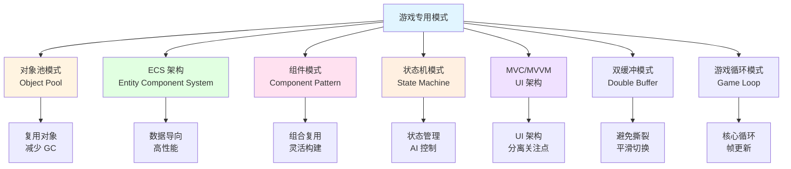

### 对象池工作流程

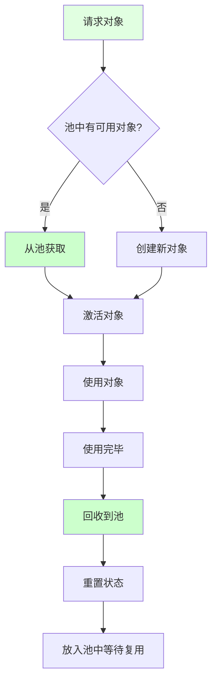

### ECS 架构组成

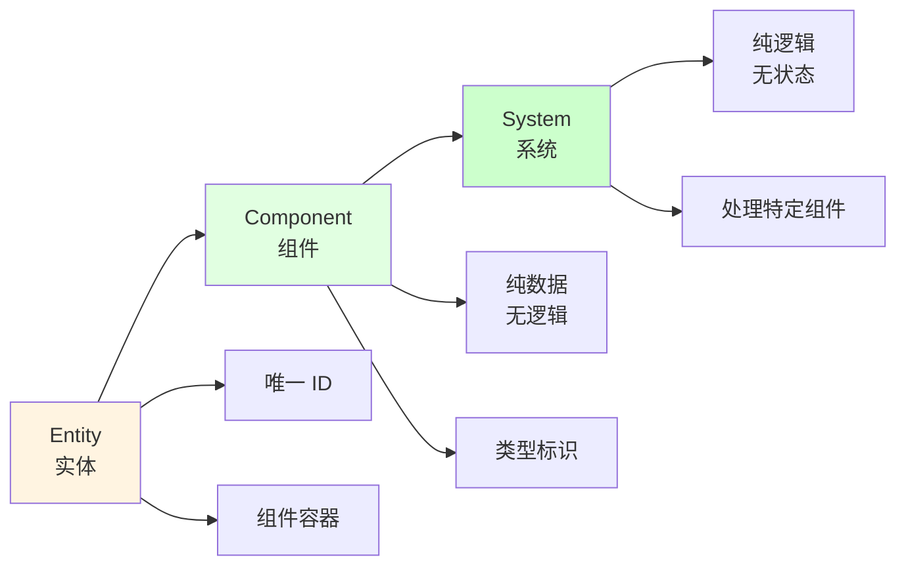

### 组件模式结构

```mermaid
classDiagram
    class GameObject {
        +AddComponent
        +GetComponent
        +RemoveComponent
    }

    class Component {
        <<abstract>>
        +Update
        +OnEnable
        +OnDisable
    }

    class Transform {
        +position
        +rotation
        +scale
    }

    class Renderer {
        +material
        +Render
    }

    class Collider {
        +isTrigger
        +OnCollisionEnter
    }

    GameObject --> Component : 包含多个
    Component <|-- Transform
    Component <|-- Renderer
    Component <|-- Collider

    note right of GameObject
        游戏对象通过组合不同组件
        实现各种功能
    end note
```

### 状态机模式

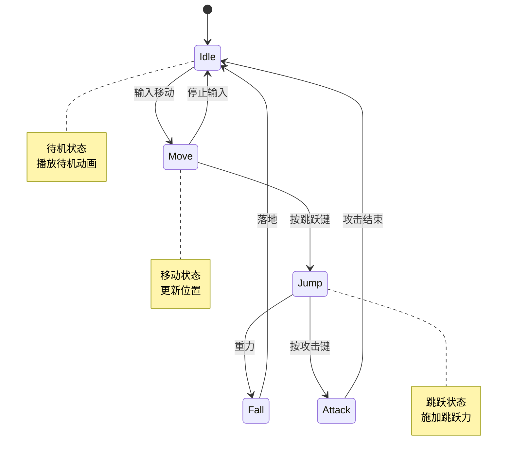

### 双缓冲模式

```mermaid
sequenceDiagram
    participant Game as 游戏逻辑
    participant BufferA as 缓冲区 A
    participant BufferB as 缓冲区 B
    participant Render as 渲染系统

    Game->>BufferA: 写入帧 N
    Note over BufferA: 正在写入

    Render->>BufferB: 读取帧 N-1
    Note over BufferB: 稳定读取

    Game->>Game: 帧完成
    Game->>BufferA: 交换缓冲区

    BufferA->>BufferB: 交换指针
    Note over BufferA,B: 角色互换

    Game->>BufferA: 写入帧 N+1
    Render->>BufferB: 读取帧 N

    style Game fill:#e1ffe1
    style Render fill:#ccffcc
```

### 游戏循环模式

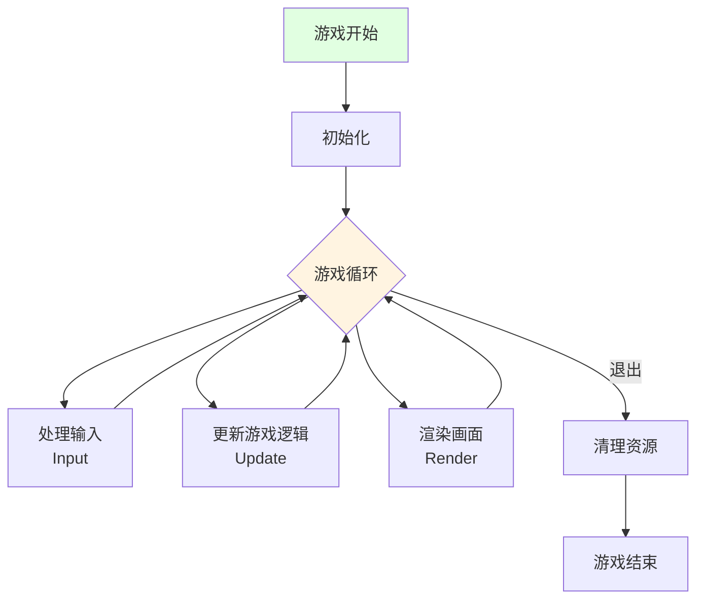

## 📖 原理

### 核心概念

游戏专用模式是游戏开发中特有的设计模式，针对游戏开发的特殊需求（性能、实时性、交互性）而设计。

#### 🏊 对象池模式（Object Pool）

**核心思想：** 预先创建一组对象并存储起来，需要时从池中获取，使用完毕后归还，而不是频繁创建和销毁。

| 优势 | 说明 |
|------|------|
| 💾 **减少 GC 压力** | 避免频繁创建销毁 |
| ⚡ **提升性能** | 复用对象减少开销 |
| 🎯 **稳定帧率** | 避免卡顿 |

**适用场景：**

- 子弹、特效等频繁创建销毁的对象
- 敌人、道具等大量相似对象
- UI 元素、音频对象等

```csharp
// 通用对象池
public class ObjectPool<T> where T : class, new()
{
    private Stack<T> _pool;
    private int _maxSize;

    public ObjectPool(int initialSize, int maxSize)
    {
        _pool = new Stack<T>(initialSize);
        _maxSize = maxSize;

        // 预创建对象
        for (int i = 0; i < initialSize; i++)
        {
            _pool.Push(new T());
        }
    }

    public T Get()
    {
        if (_pool.Count > 0)
        {
            return _pool.Pop();
        }

        return new T();
    }

    public void Return(T obj)
    {
        if (_pool.Count < _maxSize)
        {
            _pool.Push(obj);
        }
    }
}

// Unity 对象池
public class UnityObjectPool<T> where T : MonoBehaviour
{
    private Stack<T> _pool;
    private T _prefab;
    private Transform _parent;
    private int _maxSize;

    public UnityObjectPool(T prefab, int initialSize, int maxSize, Transform parent = null)
    {
        _prefab = prefab;
        _parent = parent;
        _maxSize = maxSize;
        _pool = new Stack<T>(initialSize);

        // 预创建对象
        for (int i = 0; i < initialSize; i++)
        {
            T obj = GameObject.Instantiate(_prefab, _parent);
            obj.gameObject.SetActive(false);
            _pool.Push(obj);
        }
    }

    public T Get()
    {
        T obj = _pool.Count > 0 ? _pool.Pop() : GameObject.Instantiate(_prefab, _parent);
        obj.gameObject.SetActive(true);
        return obj;
    }

    public void Return(T obj)
    {
        if (_pool.Count < _maxSize)
        {
            obj.gameObject.SetActive(false);
            _pool.Push(obj);
        }
        else
        {
            GameObject.Destroy(obj.gameObject);
        }
    }
}
```

#### 🧩 ECS 架构（Entity Component System）

**核心思想：** 数据导向设计，将数据（Component）与逻辑（System）分离，通过组合而非继承来实现功能。

| 组成 | 说明 |
|------|------|
| **Entity（实体）** | 唯一 ID，仅作为组件的容器 |
| **Component（组件）** | 纯数据，无逻辑 |
| **System（系统）** | 纯逻辑，处理特定组件组合 |

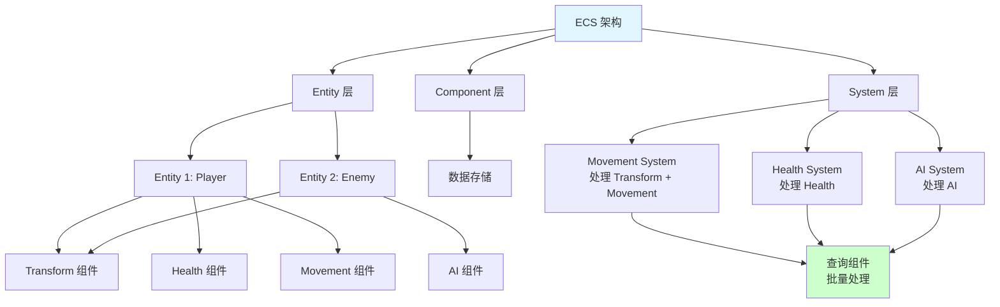

**优势：**

| 优势 | 说明 |
|------|------|
| ⚡ **高性能** | 数据局部性好，缓存友好 |
| 🔧 **易扩展** | 通过组合实现功能 |
| 🎯 **并行处理** | 系统可以并行执行 |

```csharp
// 组件：纯数据
public struct TransformComponent
{
    public Vector3 Position;
    public Quaternion Rotation;
    public Vector3 Scale;
}

public struct MovementComponent
{
    public Vector3 Velocity;
    public float Speed;
}

public struct HealthComponent
{
    public float Current;
    public float Max;
}

// 系统：纯逻辑
public class MovementSystem
{
    public void Update(EntityManager entityManager, float deltaTime)
    {
        // 查询所有具有 Transform 和 Movement 组件的实体
        var entities = entityManager.GetEntitiesWith<TransformComponent, MovementComponent>();

        foreach (var entity in entities)
        {
            ref var transform = ref entity.GetComponent<TransformComponent>();
            ref var movement = ref entity.GetComponent<MovementComponent>();

            // 更新位置
            transform.Position += movement.Velocity * movement.Speed * deltaTime;
        }
    }
}
```

#### 🧰 组件模式（Component Pattern）

**核心思想：** 通过组合多个组件来构建复杂对象，而不是使用继承。

| 优势 | 说明 |
|------|------|
| 🔄 **灵活组合** | 随意组合组件 |
| 🔧 **易于扩展** | 添加新组件不影响现有代码 |
| 💚 **避免类爆炸** | 不需要大量继承层次 |

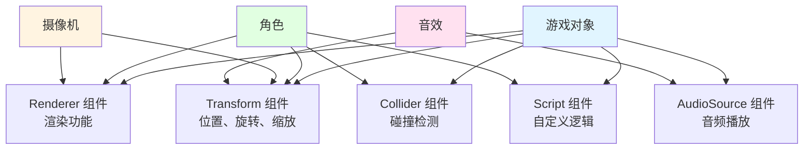

**Unity 中的组件模式：**

```csharp
// 游戏对象通过添加组件获得功能
public class Player : MonoBehaviour
{
    private Rigidbody _rb;
    private AudioSource _audioSource;

    private void Start()
    {
        // 获取组件
        _rb = GetComponent<Rigidbody>();
        _audioSource = GetComponent<AudioSource>();

        // 动态添加组件
        gameObject.AddComponent<LineRenderer>();
    }

    private void Update()
    {
        // 使用组件功能
        if (Input.GetKeyDown(KeyCode.Space))
        {
            _rb.AddForce(Vector3.up * 10f, ForceMode.Impulse);
            _audioSource.Play();
        }
    }
}
```

#### 🎮 状态机模式（State Machine）

**核心思想：** 对象在不同状态下有不同的行为，状态之间可以转换。

| 类型 | 说明 |
|------|------|
| **有限状态机（FSM）** | 简单、状态数量有限 |
| **层次状态机（HSM）** | 支持状态嵌套 |
| **下推自动机（PDA）** | 支持状态栈 |

**游戏开发应用：**

```csharp
// 状态接口
public interface IState
{
    void Enter(Character character);
    void Execute(Character character);
    void Exit(Character character);
}

// 状态机
public class StateMachine
{
    private IState _currentState;

    public void ChangeState(IState newState, Character character)
    {
        _currentState?.Exit(character);
        _currentState = newState;
        _currentState.Enter(character);
    }

    public void Update(Character character)
    {
        _currentState?.Execute(character);
    }
}

// 角色状态
public class IdleState : IState
{
    public void Enter(Character character)
    {
        character.PlayAnimation("Idle");
    }

    public void Execute(Character character)
    {
        if (character.HasEnemyInRange())
        {
            character.StateMachine.ChangeState(new AttackState(), character);
        }
    }

    public void Exit(Character character)
    {
        // 清理
    }
}
```

#### 🎨 MVC/MVVM 模式

**核心思想：** 分离 UI 的展示、逻辑和数据，提高代码的可维护性。

| 模式 | 组件 | 职责 |
|------|------|------|
| **MVC** | Model-View-Controller | 数据-视图-控制器 |
| **MVVM** | Model-View-ViewModel | 数据-视图-视图模型 |

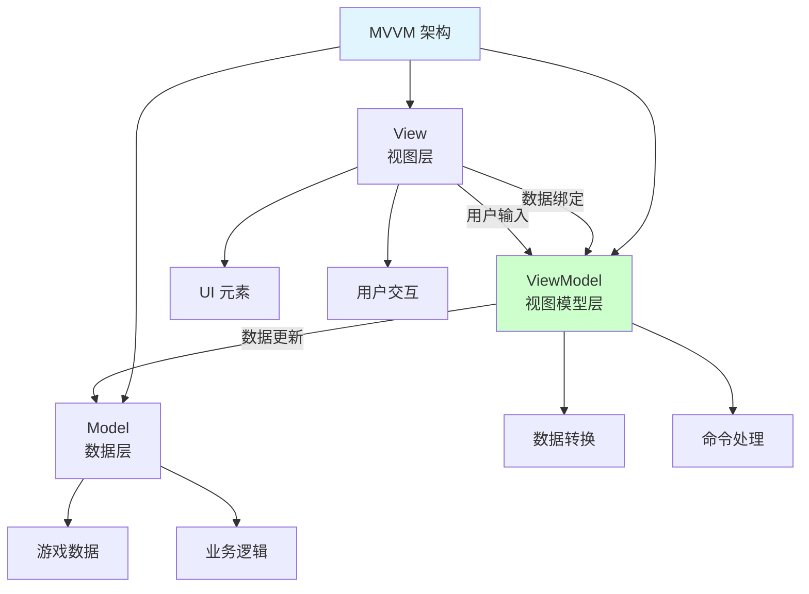

**Unity UI MVVM 实现：**

```csharp
// Model
public class PlayerModel
{
    public int Health { get; set; }
    public int Level { get; set; }
    public string Name { get; set; }
}

// ViewModel
public class PlayerViewModel : MonoBehaviour
{
    private PlayerModel _model;

    public int Health => _model.Health;
    public int Level => _model.Level;
    public string Name => _model.Name;

    public void Initialize(PlayerModel model)
    {
        _model = model;
    }

    public void TakeDamage(int damage)
    {
        _model.Health -= damage;
    }
}

// View
public class PlayerView : MonoBehaviour
{
    public Text HealthText;
    public Text LevelText;
    public Text NameText;
    private PlayerViewModel _viewModel;

    public void SetViewModel(PlayerViewModel viewModel)
    {
        _viewModel = viewModel;
        UpdateView();
    }

    private void Update()
    {
        UpdateView();
    }

    private void UpdateView()
    {
        HealthText.text = $"Health: {_viewModel.Health}";
        LevelText.text = $"Level: {_viewModel.Level}";
        NameText.text = _viewModel.Name;
    }
}
```

#### 🔄 双缓冲模式（Double Buffer）

**核心思想：** 使用两个缓冲区，一个用于读取，一个用于写入，避免读写冲突。

| 应用场景 | 说明 |
|---------|------|
| 🎮 **渲染** | 前缓冲显示，后缓冲绘制 |
| 🎮 **物理模拟** | 当前帧计算，下一帧应用 |
| 🎮 **AI 路径** | 双缓冲路径节点 |

```csharp
// 双缓冲系统
public class DoubleBuffer<T>
{
    private T[] _buffers;
    private int _current = 0;

    public DoubleBuffer()
    {
        _buffers = new T[2];
    }

    public T Current
    {
        get { return _buffers[_current]; }
    }

    public T Next
    {
        get { return _buffers[1 - _current]; }
    }

    public void Swap()
    {
        _current = 1 - _current;
    }
}

// 物理系统双缓冲
public class PhysicsSystem
{
    private DoubleBuffer<List<Rigidbody>> _bodies;

    public void Update(float deltaTime)
    {
        // 在 Next 缓冲区计算
        foreach (var body in _currentBodies)
        {
            Vector3 newPosition = body.Position + body.Velocity * deltaTime;
            // 写入 Next 缓冲区
        }

        // 交换缓冲区
        _bodies.Swap();
    }
}
```

#### 🔄 游戏循环模式（Game Loop）

**核心思想：** 游戏通过一个持续运行的循环，不断处理输入、更新逻辑、渲染画面。

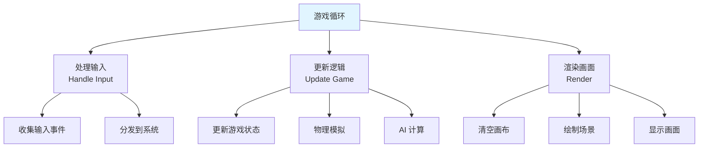

```csharp
// 游戏循环实现
public class GameLoop : MonoBehaviour
{
    private void Update()
    {
        // 处理输入
        HandleInput();

        // 更新游戏逻辑
        UpdateGame(Time.deltaTime);
    }

    private void LateUpdate()
    {
        // 渲染
        Render();
    }

    private void HandleInput()
    {
        // 收集和分发输入
    }

    private void UpdateGame(float deltaTime)
    {
        // 更新游戏状态
        GameStateManager.Instance.Update(deltaTime);

        // 物理模拟
        PhysicsManager.Instance.Simulate(deltaTime);

        // AI 计算
        AIManager.Instance.Update(deltaTime);
    }

    private void Render()
    {
        // 渲染在 Unity 中自动处理
    }
}
```

---

## 💡 面试题

### Q：对象池模式如何实现？有哪些注意事项？

#### 🎯 对象池实现详解

**完整对象池实现：**

```csharp
// 1. 池对象接口
public interface IPoolable
{
    void OnSpawn();
    void OnDespawn();
}

// 2. 通用对象池
public class ObjectPool<T> where T : class, IPoolable, new()
{
    private readonly Stack<T> _pool;
    private readonly int _maxSize;
    private readonly int _initialSize;

    public ObjectPool(int initialSize = 10, int maxSize = 100)
    {
        _initialSize = initialSize;
        _maxSize = maxSize;
        _pool = new Stack<T>(initialSize);

        // 预创建对象
        for (int i = 0; i < initialSize; i++)
        {
            T obj = new T();
            _pool.Push(obj);
        }
    }

    public T Get()
    {
        T obj = _pool.Count > 0 ? _pool.Pop() : new T();
        obj.OnSpawn();
        return obj;
    }

    public void Return(T obj)
    {
        if (obj == null) return;

        obj.OnDespawn();

        if (_pool.Count < _maxSize)
        {
            _pool.Push(obj);
        }
    }

    public int PoolSize => _pool.Count;
}

// 3. Unity 对象池
public class UnityObjectPool<T> where T : MonoBehaviour, IPoolable
{
    private readonly Stack<T> _pool;
    private readonly T _prefab;
    private readonly Transform _parent;
    private readonly int _maxSize;

    public UnityObjectPool(T prefab, int initialSize, int maxSize, Transform parent = null)
    {
        _prefab = prefab;
        _parent = parent;
        _maxSize = maxSize;
        _pool = new Stack<T>(initialSize);

        // 预创建对象
        for (int i = 0; i < initialSize; i++)
        {
            T obj = GameObject.Instantiate(prefab, parent);
            obj.gameObject.SetActive(false);
            _pool.Push(obj);
        }
    }

    public T Get()
    {
        T obj = _pool.Count > 0 ? _pool.Pop() : GameObject.Instantiate(_prefab, _parent);
        obj.gameObject.SetActive(true);
        obj.OnSpawn();
        return obj;
    }

    public void Return(T obj)
    {
        if (obj == null) return;

        obj.OnDespawn();
        obj.gameObject.SetActive(false);

        if (_pool.Count < _maxSize)
        {
            obj.transform.SetParent(_parent);
            _pool.Push(obj);
        }
        else
        {
            GameObject.Destroy(obj.gameObject);
        }
    }

    public void Prewarm(int count)
    {
        for (int i = 0; i < count; i++)
        {
            T obj = GameObject.Instantiate(_prefab, _parent);
            obj.gameObject.SetActive(false);
            _pool.Push(obj);
        }
    }
}

// 4. 对象池管理器
public class PoolManager : MonoBehaviour
{
    private Dictionary<string, object> _pools = new Dictionary<string, object>();

    public ObjectPool<T> GetPool<T>(string poolName, int initialSize = 10, int maxSize = 100)
        where T : class, IPoolable, new()
    {
        if (!_pools.ContainsKey(poolName))
        {
            _pools[poolName] = new ObjectPool<T>(initialSize, maxSize);
        }

        return _pools[poolName] as ObjectPool<T>;
    }

    public UnityObjectPool<T> GetUnityPool<T>(T prefab, int initialSize, int maxSize, Transform parent = null)
        where T : MonoBehaviour, IPoolable
    {
        string poolName = prefab.name;

        if (!_pools.ContainsKey(poolName))
        {
            _pools[poolName] = new UnityObjectPool<T>(prefab, initialSize, maxSize, parent);
        }

        return _pools[poolName] as UnityObjectPool<T>;
    }
}
```

**使用示例：**

```csharp
// 可池化的子弹
public class Bullet : MonoBehaviour, IPoolable
{
    public float Speed = 10f;
    public float LifeTime = 2f;
    private float _spawnTime;

    public void OnSpawn()
    {
        _spawnTime = Time.time;
        // 重置速度
        GetComponent<Rigidbody>().velocity = Vector3.forward * Speed;
    }

    public void OnDespawn()
    {
        // 清理
        GetComponent<Rigidbody>().velocity = Vector3.zero;
    }

    private void Update()
    {
        if (Time.time - _spawnTime > LifeTime)
        {
            // 回收到池
            PoolManager.Instance.GetUnityPool<Bullet>(prefab).Return(this);
        }
    }
}

// 使用对象池
public class Weapon : MonoBehaviour
{
    public Bullet BulletPrefab;
    private UnityObjectPool<Bullet> _bulletPool;

    private void Start()
    {
        _bulletPool = PoolManager.Instance.GetUnityPool(BulletPrefab, 50, 200, transform);
    }

    private void Update()
    {
        if (Input.GetKeyDown(KeyCode.Mouse0))
        {
            Bullet bullet = _bulletPool.Get();
            bullet.transform.position = transform.position;
            bullet.transform.rotation = transform.rotation;
        }
    }
}
```

#### ⚠️ 注意事项

| 问题 | 说明 | 解决方案 |
|------|------|---------|
| **状态重置** | 对象回收后要重置状态 | 实现 OnDespawn 清理 |
| **内存泄漏** | 持有已回收对象引用 | 使用弱引用或及时清空 |
| **池大小** | 池太大浪费，太小不够 | 根据实际使用情况调整 |
| **线程安全** | 多线程访问池 | 使用锁或线程安全队列 |
| **预创建** | 游戏开始时预创建对象 | 使用 Prewarm 方法 |

#### 📊 性能对比

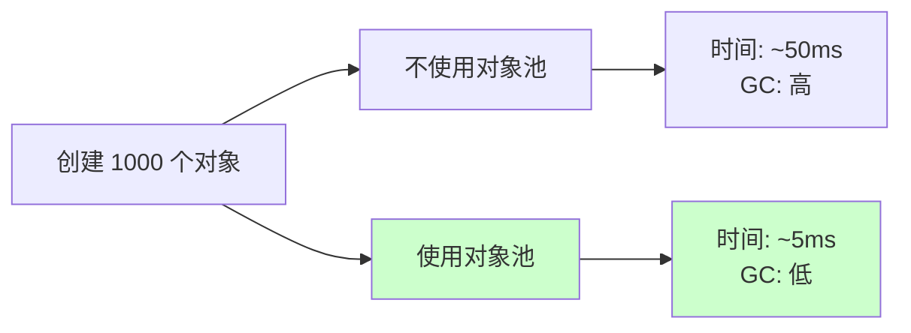

> [!tip] 最佳实践
> 1. **预创建对象**：游戏开始时预创建足够对象
> 2. **正确清理**：OnDespawn 中彻底清理对象状态
> 3. **池大小管理**：根据实际情况动态调整
> 4. **分层池管理**：不同类型对象使用不同池
> 5. **性能监控**：监控池使用情况，优化大小

---

### Q：ECS 架构的优势是什么？与传统 OOP 有何区别？

#### 🎯 ECS vs OOP 核心区别

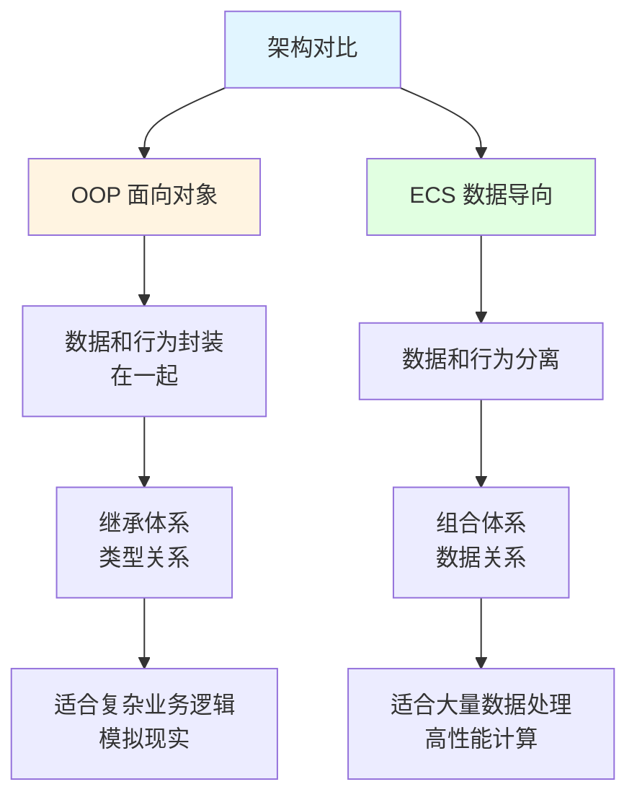

| 维度 | OOP（面向对象） | ECS（数据导向） |
|------|----------------|----------------|
| **组织方式** | 类继承 | 数据组合 |
| **数据与逻辑** | 封装在一起 | 完全分离 |
| **扩展性** | 通过继承 | 通过添加组件/系统 |
| **性能** | 对象指针跳转 | 连续内存访问 |
| **适用场景** | 业务逻辑复杂 | 大量对象同质 |

#### 🎮 实现对比

**OOP 方式：**

```csharp
// OOP: 通过继承实现
public class GameObject
{
    public Transform Transform { get; set; }
    public virtual void Update() { }
}

public class Character : GameObject
{
    public Health Health { get; set; }
    public Movement Movement { get; set; }

    public override void Update()
    {
        Movement.Move();
        Health.Regenerate();
    }
}

public class Player : Character
{
    public Input Input { get; set; }

    public override void Update()
    {
        Input.Handle();
        base.Update();
    }
}

public class Enemy : Character
{
    public AI AI { get; set; }

    public override void Update()
    {
        AI.Think();
        base.Update();
    }
}
```

**ECS 方式：**

```csharp
// ECS: 数据（组件）与逻辑（系统）分离
// 1. 组件：纯数据
public struct TransformComponent
{
    public Vector3 Position;
    public Quaternion Rotation;
}

public struct HealthComponent
{
    public float Current;
    public float Max;
    public float RegenerationRate;
}

public struct MovementComponent
{
    public Vector3 Velocity;
    public float Speed;
}

public struct PlayerTag { }  // 标记组件
public struct EnemyTag { }  // 标记组件

// 2. 系统：纯逻辑
public class MovementSystem
{
    public void Update(EntityManager entityManager, float deltaTime)
    {
        // 批量处理所有移动实体
        var entities = entityManager.Query<TransformComponent, MovementComponent>();

        foreach (ref var entity in entities)
        {
            ref var transform = ref entity.Get<TransformComponent>();
            ref var movement = ref entity.Get<MovementComponent>();

            transform.Position += movement.Velocity * movement.Speed * deltaTime;
        }
    }
}

public class HealthRegenSystem
{
    public void Update(EntityManager entityManager, float deltaTime)
    {
        var entities = entityManager.Query<HealthComponent>();

        foreach (ref var entity in entities)
        {
            ref var health = ref entity.Get<HealthComponent>();

            health.Current = Mathf.Min(health.Current + health.RegenerationRate * deltaTime, health.Max);
        }
    }
}

public class PlayerInputSystem
{
    public void Update(EntityManager entityManager)
    {
        var entities = entityManager.Query<PlayerTag, MovementComponent>();

        foreach (ref var entity in entities)
        {
            ref var movement = ref entity.Get<MovementComponent>();

            movement.Velocity = new Vector3(Input.GetAxis("Horizontal"), 0, Input.GetAxis("Vertical"));
        }
    }
}
```

#### ⚡ ECS 性能优势

**内存布局优势：**

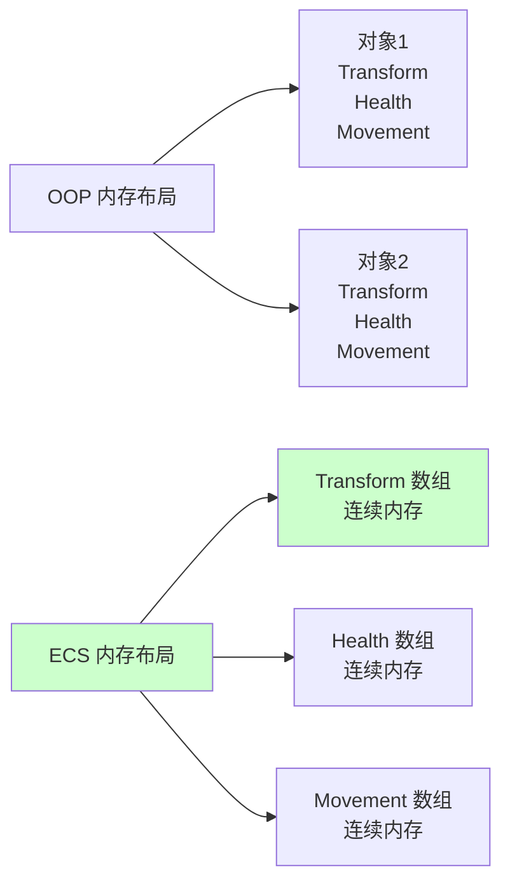

**缓存友好：**

| 特性 | OOP | ECS |
|------|-----|-----|
| **内存访问** | 随机访问（不连续） | 顺序访问（连续） |
| **缓存命中** | 低（频繁跳转） | 高（连续数据） |
| **SIMD** | 难以利用 | 容易利用 |

**并行处理：**

```csharp
// ECS 系统可以并行执行
public class JobSystem
{
    public void Update()
    {
        // 并行执行不同的系统
        Parallel.Invoke(
            () => movementSystem.Update(deltaTime),
            () => healthSystem.Update(deltaTime),
            () => aiSystem.Update(deltaTime)
        );
    }
}
```

#### 📊 适用场景

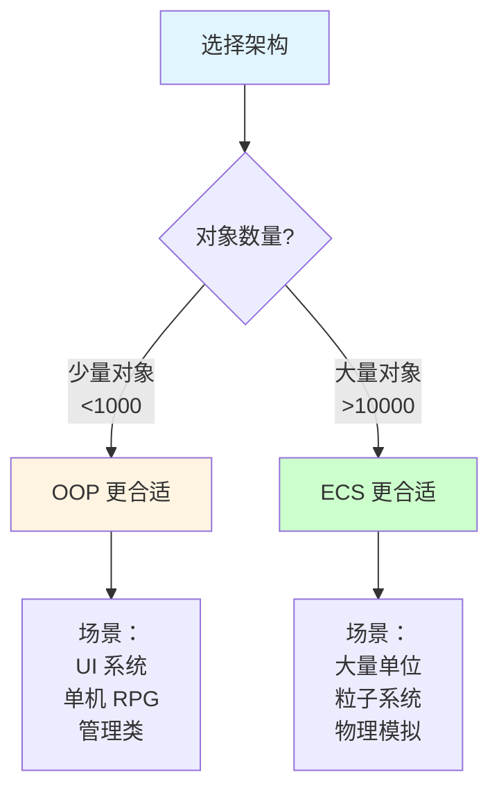

| 场景 | 推荐架构 | 原因 |
|------|---------|------|
| UI 系统 | OOP | 逻辑复杂，对象少 |
| 角色系统 | 混合 | OOP 实现行为，ECS 实现战斗 |
| 粒子系统 | ECS | 大量同质对象 |
| 物理模拟 | ECS | 数据密集计算 |
| 网络同步 | ECS | 数据序列化简单 |

#### 💡 Unity DOTS

**Unity 的 ECS 实现：**

```csharp
// Unity DOTS 示例
public struct RotationSpeed : IComponentData
{
    public float Value;
}

public class RotationSpeedSystem : SystemBase
{
    protected override void OnUpdate()
    {
        float deltaTime = Time.DeltaTime;

        Entities
            .ForEach((ref Rotation rotation, in RotationSpeed speed) =>
            {
                rotation.Value = math.mul(rotation.Value, quaternion.RotateY(speed.Value * deltaTime));
            })
            .ScheduleParallel();
    }
}
```

> [!tip] 选择建议
> - **复杂业务逻辑** → **OOP**（UI、任务系统）
> - **大量同质对象** → **ECS**（粒子、子弹）
> - **混合使用** → **核心逻辑 OOP，性能关键 ECS**
> - **学习成本** → **OOP 容易，ECS 需要思维转换**

---

## 🔗 相关链接

- [[设计模式]] - 父主题索引
- [[常用设计模式概述]] - 相关主题：设计模式分类
- [[创建型模式]] - 相关主题：单例、工厂、建造者
- [[结构型模式]] - 相关主题：适配器、装饰器、代理
- [[行为型模式]] - 相关主题：观察者、策略、命令
