## 📊 图解

> [!info] 图示区
> 这里可以放置解释网络协议的 mermaid 图表、协议栈图或其他辅助理解的图片

### 三种协议对比

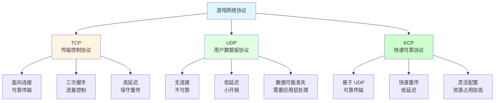

### 协议特性对比

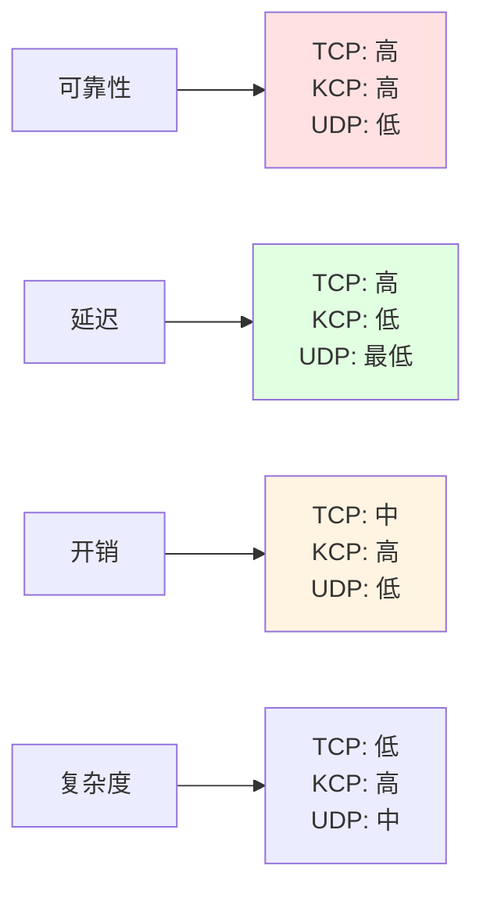

### TCP 三次握手

```mermaid
sequenceDiagram
    participant Client as 客户端
    participant Server as 服务器

    Client->>Server: SYN (seq=x)
    Note over Client,Server: 第一次握手

    Server->>Client: SYN-ACK (seq=y, ack=x+1)
    Note over Client,Server: 第二次握手

    Client->>Server: ACK (ack=y+1)
    Note over Client,Server: 第三次握手<br/>连接建立

    Client->>Server: 数据传输
    Server->>Client: 数据传输

    style Client fill:#e1ffe1
    style Server fill:#ccffcc
```

### KCP 快速重传机制

```mermaid
sequenceDiagram
    participant Sender as 发送方
    participant Receiver as 接收方

    Sender->>Receiver: 数据包 1
    Sender->>Receiver: 数据包 2
    Sender->>Receiver: 数据包 3 (丢失)
    Sender->>Receiver: 数据包 4

    Receiver->>Sender: ACK 1, 2
    Note over Receiver,Sender: 检测到序列号不连续<br/>发送特殊 ACK

    Sender->>Sender: 快速重传数据包 3
    Note over Sender: 无需等待超时

    Sender->>Receiver: 数据包 3 (重传)
    Receiver->>Sender: ACK 3, 4

    style Sender fill:#e1ffe1
    style Receiver fill:#ccffcc
```

## 📖 原理

### 核心概念

游戏网络开发中最常用的三种传输协议：TCP、UDP 和 KCP，它们各有特点和适用场景。

#### 🔌 TCP（传输控制协议）

**核心特性：**

| 特性 | 说明 |
|------|------|
| 🔗 **面向连接** | 需要三次握手建立连接 |
| ✅ **可靠传输** | 保证数据包按序到达，不丢失 |
| 🎛️ **流量控制** | 滑动窗口算法控制发送速率 |
| 🚦 **拥塞控制** | "加性增、乘性减"策略 |
| ⏰ **超时重传** | 保守的超时重传机制 |

**优点：**
- 数据传输可靠，不丢失、不重复
- 操作系统原生支持，使用简单
- 流量控制和拥塞保护网络

**缺点：**
- 延迟较高，不适合实时性要求高的场景
- 拥塞控制算法在弱网下恢复慢
- 头部开销较大（20-60 字节）

**适用场景：**
- 聊天系统
- 交易系统
- 任务进度
- 配置下载

#### 📦 UDP（用户数据报协议）

**核心特性：**

| 特性 | 说明 |
|------|------|
| 🚀 **无连接** | 无需握手，直接发送 |
| ⚡ **低延迟** | 无等待，即时发送 |
| 💨 **轻量级** | 头部仅 8 字节 |
| ❌ **不可靠** | 数据包可能丢失、重复、乱序 |
| 🎛️ **无控制** | 无流量控制和拥塞控制 |

**优点：**
- 延迟最低，实时性最好
- 开销小，节省带宽
- 支持一对多广播
- 灵活性高，可自定义实现

**缺点：**
- 不保证数据可靠性
- 需要应用层实现可靠性机制
- 网络拥塞时无保护

**适用场景：**
- 角色位置同步
- 语音通信
- 实时视频
- 状态快照

#### ⚡ KCP（快速可靠传输协议）

**核心特性：**

| 特性 | 说明 |
|------|------|
| 🚀 **基于 UDP** | 继承 UDP 的低延迟特性 |
| ✅ **可靠传输** | 实现可靠传输机制 |
| ⚡ **快速重传** | 无需等待超时，立即重传 |
| 📈 **非退行拥塞控制** | 网络恢复时快速提升速率 |
| 🔧 **灵活配置** | 丰富的参数配置选项 |

**关键机制：**

**1️⃣ 快速重传：**

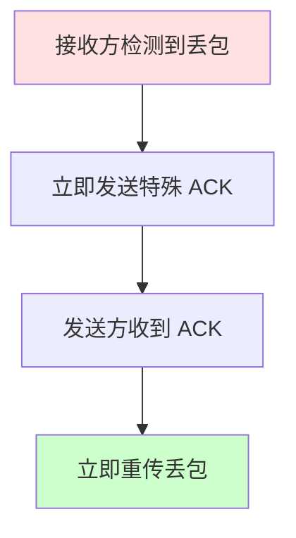

**2️⃣ 参数配置：**

| 参数 | 说明 | 推荐值 |
|------|------|-------|
| **nodelay** | 是否启用无延迟模式 | 0/1 |
| **interval** | 内部更新间隔（ms） | 10-20 |
| **resend** | 快速重传触发次数 | 2 |
| **nc** | 是否关闭拥塞控制 | 0/1 |

**优点：**
- 可靠性与低延迟兼得
- 弱网环境下表现优秀
- 参数可针对场景优化
- 适合移动网络

**缺点：**
- 实现复杂度较高
- CPU 和带宽占用较大
- 需要应用层实现
- 生态不如 TCP/UDP 成熟

**适用场景：**
- 动作类游戏
- MOBA 类游戏
- 手游核心玩法
- 实时协作游戏

---

## 💡 面试题

### Q：请详细介绍 TCP、UDP 和 KCP 三种协议的特点及区别。

#### 🎯 三种协议全景对比

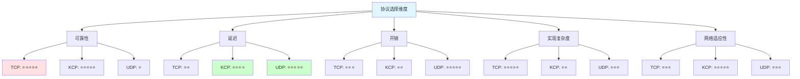

#### 📋 详细特性对比

**1️⃣ 可靠性与速度的平衡：**

| 协议 | 可靠性 | 速度 | 平衡点 |
|------|-------|------|--------|
| **TCP** | 最可靠 | 延迟高 | 适合对可靠性要求高的场景 |
| **UDP** | 不可靠 | 最快 | 适合对实时性要求高的场景 |
| **KCP** | 可靠 | 延迟低 | 两者之间的最佳平衡 |

**2️⃣ 实现复杂度：**

| 协议 | 实现方式 | 复杂度 | 生态支持 |
|------|---------|--------|---------|
| **TCP** | 操作系统底层 | ⭐ | 所有平台原生支持 |
| **UDP** | 操作系统底层 | ⭐⭐⭐ | 所有平台原生支持 |
| **KCP** | 应用层实现 | ⭐⭐⭐⭐⭐ | 需要第三方库或自研 |

**3️⃣ 配置灵活性：**

| 协议 | 可配置项 | 灵活性 | 调优空间 |
|------|---------|--------|---------|
| **TCP** | 系统级参数 | 低 | 有限 |
| **UDP** | 应用层完全控制 | 高 | 完全自定义 |
| **KCP** | 丰富的协议参数 | 中高 | 针对性优化 |

**4️⃣ 资源占用：**

| 资源类型 | TCP | UDP | KCP |
|---------|-----|-----|-----|
| **CPU** | 低 | 低 | 高（快速重传） |
| **带宽** | 中 | 低 | 高（冗余传输） |
| **内存** | 中 | 低 | 中（缓存管理） |

#### 🎮 实际项目应用案例

**案例：动作角色扮演游戏的协议选择**

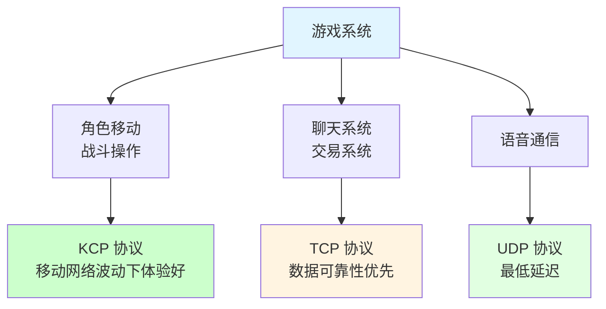

**具体实现：**

| 系统模块 | 协议选择 | 原因 |
|---------|---------|------|
| **角色移动** | KCP | 需要低延迟和可靠性 |
| **战斗操作** | KCP | 实时性和准确性并重 |
| **技能释放** | KCP | 不能丢失操作指令 |
| **聊天系统** | TCP | 消息不能丢失或乱序 |
| **交易系统** | TCP | 涉及虚拟资产，绝对可靠 |
| **语音通信** | UDP | 可接受少量丢包，延迟最低 |
| **位置同步** | UDP | 频率高，允许丢包 |
| **环境特效** | UDP | 非关键数据，优化性能 |

#### 💡 协议选择决策树

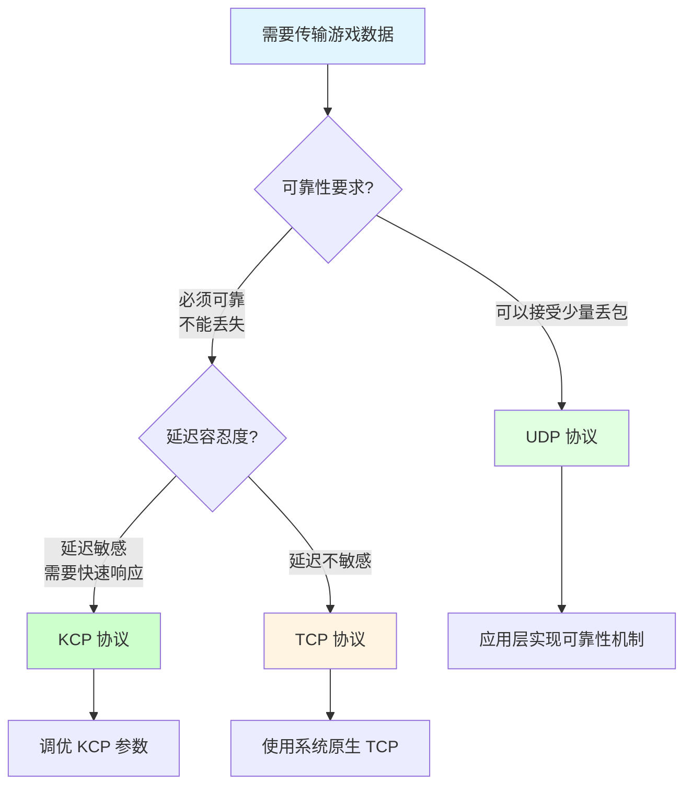

#### 📊 性能对比数据

**弱网环境下的测试数据（30% 丢包率）：**

| 指标 | TCP | KCP | UDP |
|------|-----|-----|-----|
| **平均延迟** | 800ms | 150ms | 50ms |
| **丢包恢复时间** | >1000ms | <50ms | 无恢复 |
| **带宽占用** | 中 | 高 | 低 |
| **CPU 占用** | 低 | 中 | 低 |

> [!tip] 总结
> 三种协议各有优劣，没有绝对的最优选择：
> - **TCP**：适合可靠性优先的场景（聊天、交易）
> - **UDP**：适合实时性优先的场景（语音、位置）
> - **KCP**：适合需要兼顾两者的场景（动作、MOBA）
>
> 关键是根据具体需求选择合适的协议，或采用**混合协议策略**，不同系统使用不同协议。

---

### Q：KCP 协议是什么？它解决了什么问题？在游戏开发中有什么应用？

#### 🎯 KCP 协议核心定义

**KCP（快速可靠传输协议）**是由国内开发者设计的基于 UDP 的可靠传输协议，专为游戏等对延迟敏感的应用场景打造。

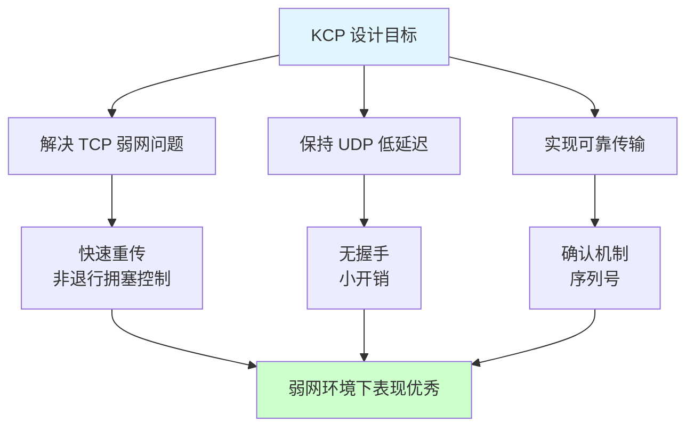

#### 🔍 解决的核心问题

**问题 1：TCP 的保守重传机制**

```mermaid
sequenceDiagram
    participant TCP as TCP 重传
    participant KCP as KCP 重传

    Note over TCP: 数据包丢失
    TCP->>TCP: 等待 RTO 超时
    TCP->>TCP: 重传数据包
    Note over TCP: 延迟：数百毫秒

    Note over KCP: 数据包丢失
    KCP->>KCP: 收到重复 ACK
    KCP->>KCP: 立即重传
    Note over KCP: 延迟：几毫秒

    style TCP fill:#ffe1e1
    style KCP fill:#ccffcc
```

**问题 2：TCP 的退行性拥塞控制**

| 特性 | TCP | KCP |
|------|-----|-----|
| **拥塞控制** | 加性增、乘性减 | 非退行性 |
| **丢包反应** | 窗口减半 | 小幅减少 |
| **恢复速度** | 缓慢 | 快速 |
| **弱网表现** | 差 | 优秀 |

**问题 3：TCP 的固定行为**

| 方面 | TCP | KCP |
|------|-----|-----|
| **参数配置** | 系统级，难调整 | 应用层，灵活配置 |
| **场景适配** | 一刀切 | 针对性优化 |
| **调优空间** | 有限 | 丰富 |

#### ⚙️ KCP 的核心机制

**1️⃣ 快速重传机制：**

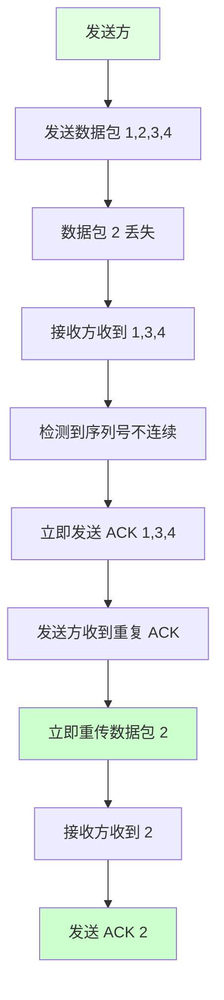

**2️⃣ 非退行性拥塞控制：**

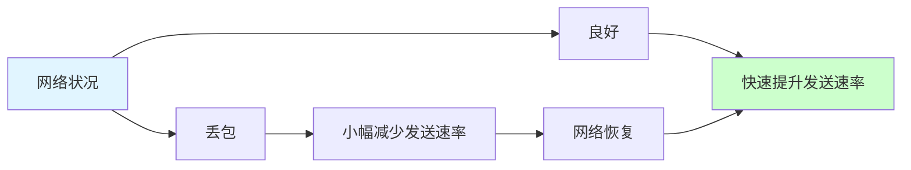

**3️⃣ 灵活的参数配置：**

| 参数 | 说明 | 推荐配置 |
|------|------|---------|
| **nodelay** | 启用无延迟模式 | 移动网络：1<br/>有线网络：0 |
| **interval** | 内部更新间隔（ms） | 实时游戏：10<br/>普通场景：20 |
| **resend** | 快速重传触发次数 | 弱网：2<br/>稳定网络：3 |
| **nc** | 关闭拥塞控制 | 局域网：1<br/>互联网：0 |

#### 🎮 游戏开发中的应用

**应用 1：格斗游戏**

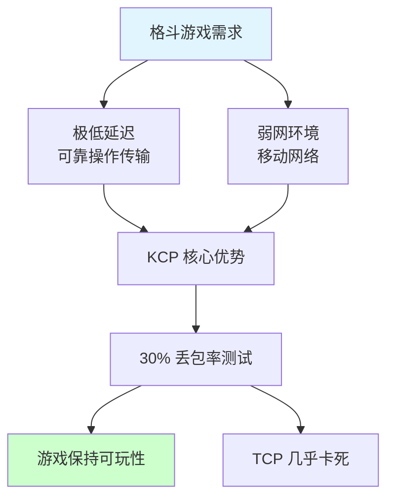

**应用 2：开放世界手游**

| 挑战 | KCP 解决方案 | 效果 |
|------|-------------|------|
| 4G 频繁切换 | 快速重传 | 无感知切换 |
| 信号波动 | 非退行拥塞控制 | 快速恢复 |
| 省流量需求 | 分层可靠性 | 节省 30% 带宽 |

**应用 3：多人联机创造类游戏**

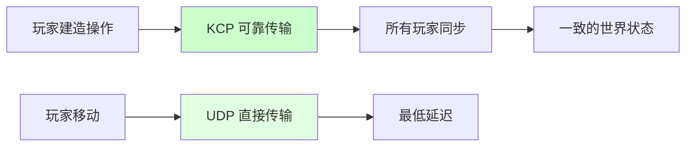

#### 💡 KCP 定制与优化

**优化策略：**

| 优化方向 | 具体措施 | 效果 |
|---------|---------|------|
| **数据分层** | 不同类型数据不同可靠性 | 减少不必要重传 |
| **动态参数** | 根据网络状况调整参数 | 适应不同环境 |
| **混合协议** | KCP + UDP 混合使用 | 平衡性能与可靠性 |
| **应用层优化** | 压缩、预测、插值 | 进一步提升体验 |

**实际项目示例：**

```csharp
// KCP 参数动态调整
public class KCPAdapterManager
{
    public void AdjustKCPParameters(KCP kcp, NetworkQuality quality)
    {
        switch (quality)
        {
            case NetworkQuality.Good:
                kcp.SetNoDelay(0, 20, 2, 0);
                break;
            case NetworkQuality.Medium:
                kcp.SetNoDelay(1, 15, 2, 0);
                break;
            case NetworkQuality.Poor:
                kcp.SetNoDelay(1, 10, 2, 0);
                break;
        }
    }
}
```

#### 📈 KCP vs TCP 性能对比

**测试环境：30% 丢包率**

| 指标 | TCP | KCP | 提升 |
|------|-----|-----|------|
| **平均延迟** | 800ms | 150ms | **81%↓** |
| **丢包恢复** | 1000ms+ | 50ms | **95%↓** |
| **带宽利用率** | 低 | 高 | **2-3x** |
| **CPU 占用** | 低 | 中 | 可接受 |

> [!tip] 总结
> KCP 通过以下创新解决了 TCP 在弱网环境下的痛点：
> 1. **快速重传**：无需等待超时，大幅降低延迟
> 2. **非退行拥塞控制**：网络恢复时快速提升速率
> 3. **灵活配置**：针对不同场景优化参数
>
> 在移动游戏主导的今天，KCP 已经成为动作类、MOBA 类游戏的首选协议。

---

## 🔗 相关链接

- [[网络]] - 父主题索引
- [[网络协议选择与优化]] - 相关主题：协议选择策略
- [[帧同步]] - 相关主题：帧同步网络方案
- [[状态同步]] - 相关主题：状态同步网络方案
