## 📊 图解

> [!info] 图示区
> 这里可以放置解释网络协议选择与优化的 mermaid 图表、决策流程或其他辅助理解的图片

### 协议选择决策树

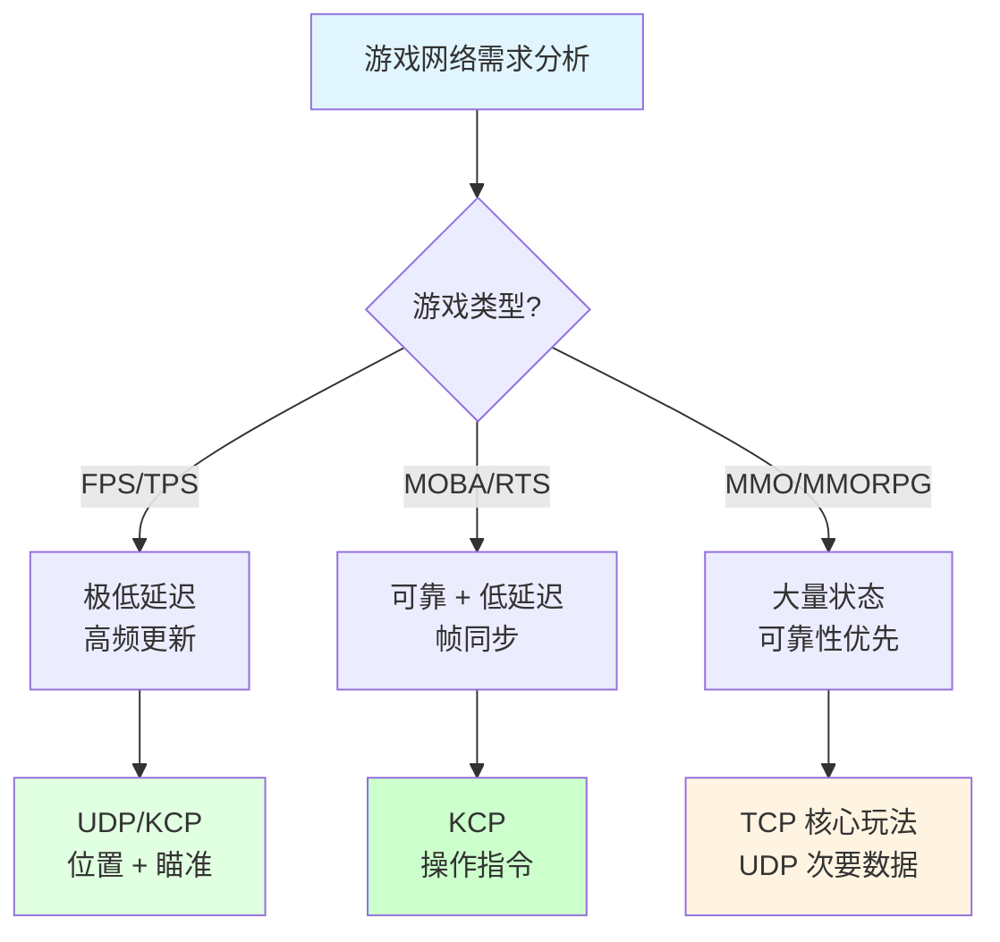

### 数据分类策略

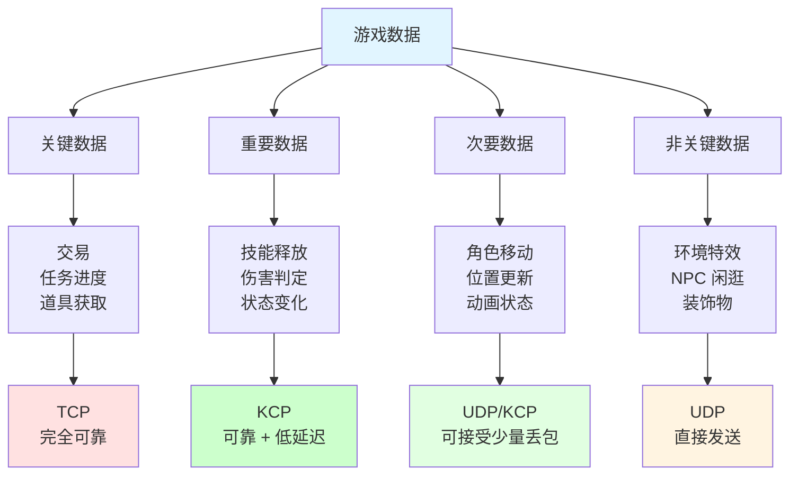

### 混合协议架构

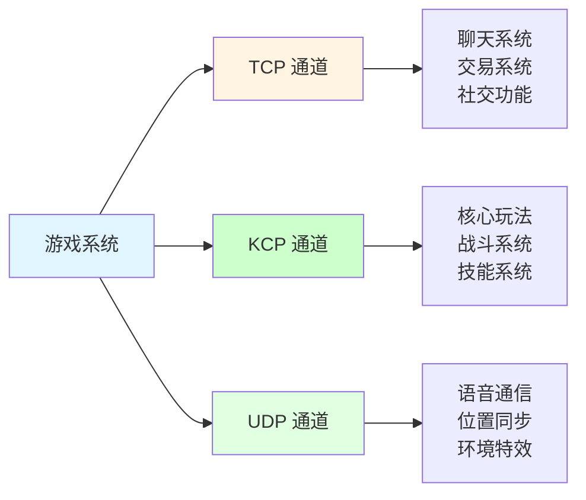

### 网络优化层次

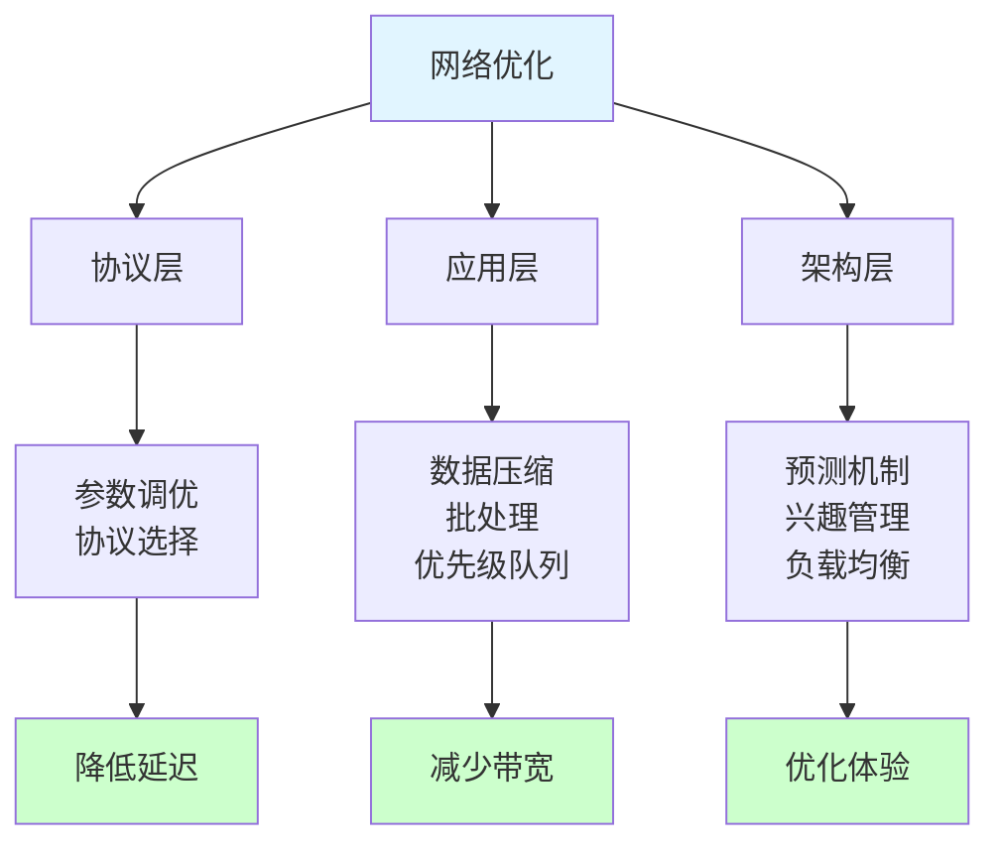

## 📖 原理

### 核心概念

游戏网络优化是一个系统工程，需要从协议选择、数据处理、架构设计等多个层面综合考虑。

#### 🎯 协议选择策略

**基于游戏类型的选择：**

| 游戏类型 | 核心需求 | 推荐协议 | 典型案例 |
|---------|---------|---------|---------|
| **FPS/TPS** | 极低延迟 | UDP/KCP | CSGO、堡垒之夜 |
| **MOBA/RTS** | 可靠 + 低延迟 | KCP | 英雄联盟、王者荣耀 |
| **MMORPG** | 大量状态同步 | TCP + UDP | 魔兽世界 |
| **格斗游戏** | 精确判定 | KCP | 街头霸王 |
| **卡牌游戏** | 可靠性优先 | TCP | 炉石传说 |

**基于数据特性的选择：**

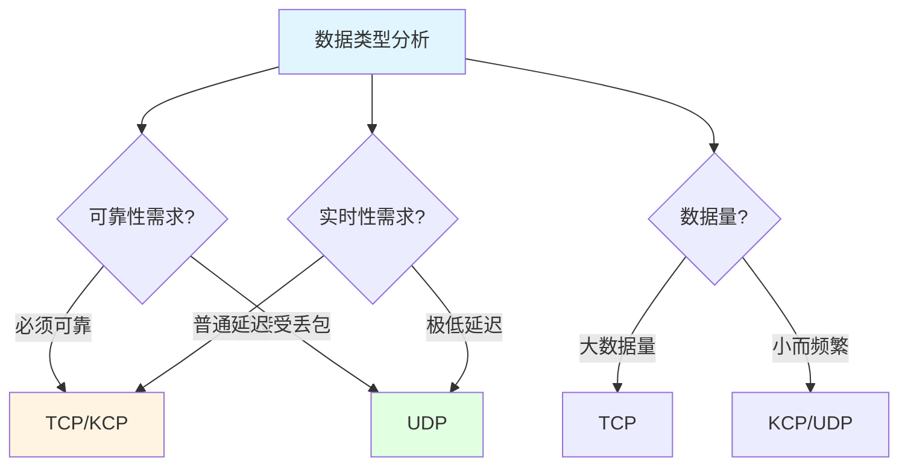

#### 🔧 网络优化技术

**1️⃣ 数据压缩技术：**

| 技术 | 说明 | 效果 |
|------|------|------|
| **二进制协议** | 使用 Protobuf/MsgPack | 比JSON 小 50% |
| **位置量化** | float → short | 减少 50% 大小 |
| **增量编码** | 只传变化量 | 减少 70% 流量 |
| **字典压缩** | 重复数据索引 | 减少 30-50% |

**2️⃣ 批处理与聚合：**

```csharp
// 数据包聚合
public class PacketAggregator
{
    private List<SmallPacket> _buffer = new List<SmallPacket>();
    private float _timer;

    public void Update(float deltaTime)
    {
        _timer += deltaTime;

        if (_timer >= aggregationInterval || _buffer.Count >= maxBatchSize)
        {
            Flush();
        }
    }

    private void Flush()
    {
        if (_buffer.Count > 0)
        {
            BigPacket batched = CreateBigPacket(_buffer);
            Send(batched);
            _buffer.Clear();
            _timer = 0;
        }
    }
}
```

**3️⃣ 优先级队列：**

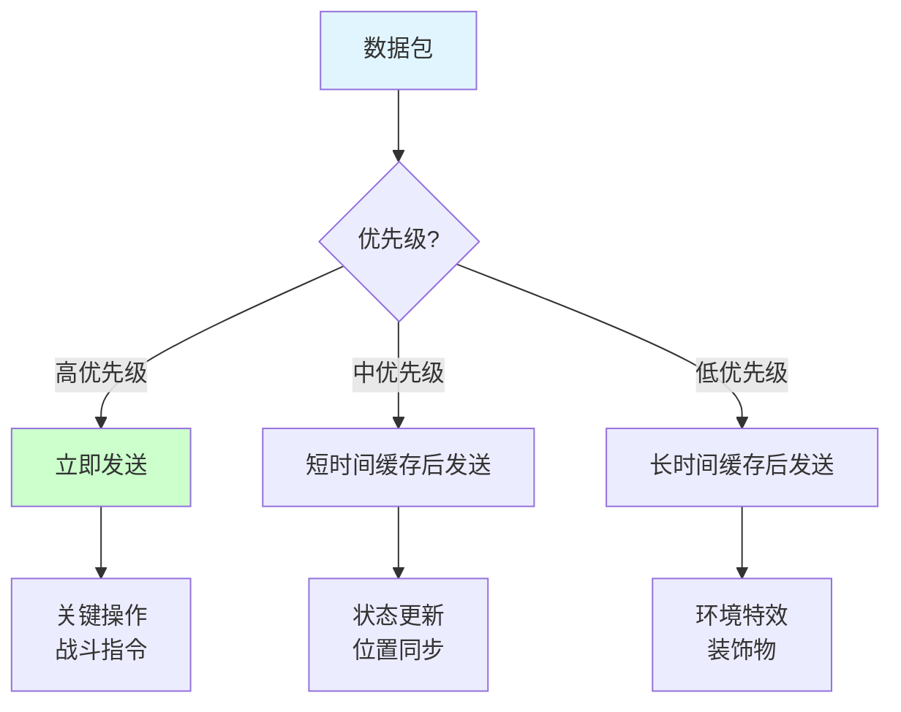

#### 🏗️ 架构层优化

**1️⃣ AOI（兴趣管理）：**

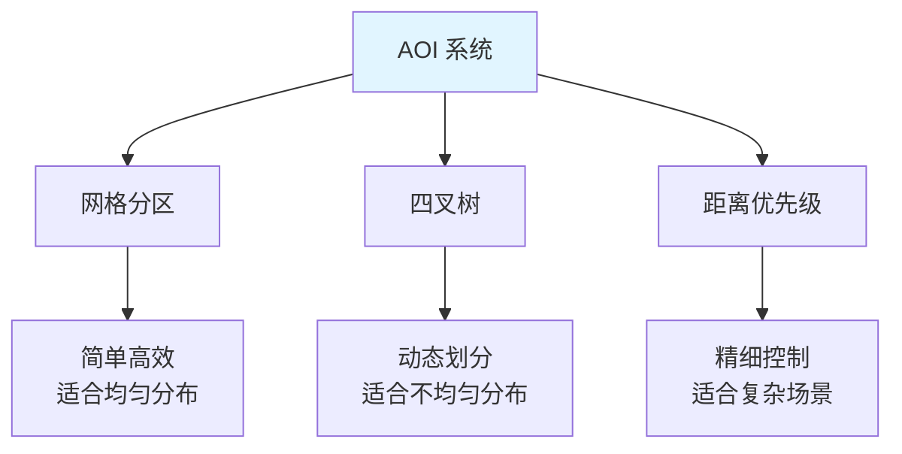

**实现示例：**

```csharp
// 网格 AOI
public class GridAOI
{
    private Dictionary<int, GridCell> _cells = new Dictionary<int, GridCell>();

    public List<Entity> GetVisibleEntities(Vector3 position, float viewDistance)
    {
        List<Entity> visible = new List<Entity>();

        int cellX = (int)(position.x / cellSize);
        int cellZ = (int)(position.z / cellSize);
        int radius = Mathf.CeilToInt(viewDistance / cellSize);

        for (int x = cellX - radius; x <= cellX + radius; x++)
        {
            for (int z = cellZ - radius; z <= cellZ + radius; z++)
            {
                int key = x * 10000 + z;
                if (_cells.TryGetValue(key, out GridCell cell))
                {
                    visible.AddRange(cell.entities);
                }
            }
        }

        return visible;
    }
}
```

**效果：**
- 减少网络流量：**70-90%**
- 降低服务器负载：**60-80%**
- 提升客户端性能：**50-70%**

**2️⃣ 客户端预测：**

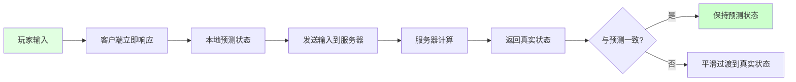

**3️⃣ 插值与外推：**

| 技术 | 用途 | 延迟补偿 |
|------|------|---------|
| **插值** | 平滑状态过渡 | 50-100ms |
| **外推** | 预测未来位置 | 100-200ms |
| **回滚** | 修正状态偏差 | 服务器权威 |

---

## 💡 面试题

### Q：在游戏网络开发中，如何根据不同场景选择合适的网络协议？

#### 🎯 协议选择决策框架

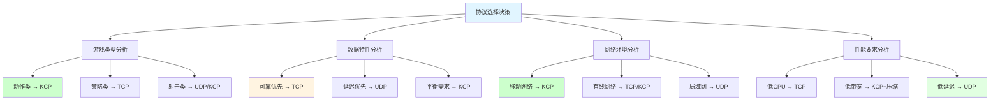

#### 📋 不同游戏类型的协议选择

**1️⃣ FPS/TPS 类游戏：**

| 需求特征 | 推荐方案 | 说明 |
|---------|---------|------|
| **位置同步** | UDP | 高频更新，允许丢包 |
| **射击判定** | KCP | 需要可靠但低延迟 |
| **聊天系统** | TCP | 消息不能丢失 |

**实战案例：**

```csharp
// 射击游戏混合协议
public class ShooterGameNetwork
{
    // UDP: 位置同步（高频，允许丢包）
    public void SendPositionUpdate(Vector3 position)
    {
        udpClient.Send(position);
    }

    // KCP: 射击判定（可靠，低延迟）
    public void SendShootCommand(Vector3 target)
    {
        kcpConnection.SendReliable(target);
    }

    // TCP: 聊天消息（完全可靠）
    public void SendChatMessage(string message)
    {
        tcpClient.Send(message);
    }
}
```

**2️⃣ MOBA 类游戏：**

| 需求特征 | 推荐方案 | 优化配置 |
|---------|---------|---------|
| **操作指令** | KCP | nodelay=1, interval=10 |
| **状态同步** | KCP | resend=2 |
| **聊天/交易** | TCP | 标准配置 |

**性能优化：**

```csharp
// MOBA 游戏 KCP 优化
public class MOBAKCPOptimizer
{
    public void ConfigureForMOBA(KCP kcp)
    {
        // 启用无延迟模式
        kcp.SetNoDelay(1, 10, 2, 0);

        // 调整窗口大小
        kcp.WndSize(128, 128);

        // 设置最大传输单元
        kcp.SetMtu(1200);
    }
}
```

**3️⃣ MMORPG 类游戏：**

| 系统模块 | 推荐方案 | 原因 |
|---------|---------|------|
| **核心战斗** | KCP | 延迟敏感 |
| **经济交易** | TCP | 绝对可靠 |
| **社交聊天** | TCP | 消息完整性 |
| **位置同步** | UDP | 高频更新 |
| **环境特效** | UDP | 非关键数据 |

**架构设计：**

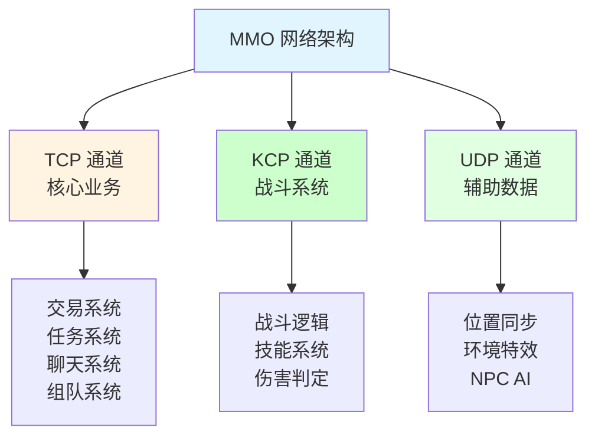

#### 🎯 基于数据特性的选择

**数据分类矩阵：**

| 可靠性需求 | 实时性需求 | 数据量 | 推荐协议 |
|-----------|-----------|-------|---------|
| 高 | 低 | 大 | TCP |
| 高 | 高 | 小 | KCP |
| 中 | 高 | 小 | KCP |
| 低 | 高 | 小 | UDP |
| 低 | 低 | 大 | TCP |

**实际应用示例：**

```csharp
// 智能协议选择路由
public class ProtocolRouter
{
    public void SendData(PacketData data)
    {
        switch (data.type)
        {
            case DataType.Transaction:
            case DataType.Quest:
                // 关键业务数据：TCP
                tcpChannel.Send(data);
                break;

            caseDataType.SkillCast:
            case DataType.Combat:
                // 战斗数据：KCP
                kcpChannel.SendReliable(data);
                break;

            case DataType.Position:
            caseDataType.Animation:
                // 状态数据：UDP
                udpChannel.Send(data);
                break;

            case DataType.Voice:
                // 语音数据：UDP
                udpChannel.SendPrioritized(data, Priority.High);
                break;
        }
    }
}
```

#### 🌐 基于网络环境的选择

**网络环境适配策略：**

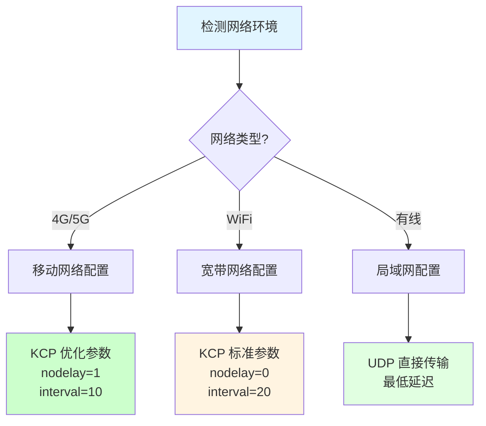

**动态协议切换：**

```csharp
// 动态网络适配
public class NetworkAdaptiveManager
{
    public void OnNetworkQualityChanged(NetworkQuality quality)
    {
        switch (quality)
        {
            case NetworkQuality.Excellent:
                // 网络极好：使用 UDP
                SwitchPrimaryProtocol(ProtocolType.UDP);
                IncreaseUpdateFrequency(60);
                break;

            case NetworkQuality.Good:
                // 网络良好：使用 KCP 标准模式
                SwitchPrimaryProtocol(ProtocolType.KCP);
                SetKCPMode(KCPMode.Standard);
                IncreaseUpdateFrequency(30);
                break;

            case NetworkQuality.Medium:
                // 网络一般：使用 KCP 优化模式
                SwitchPrimaryProtocol(ProtocolType.KCP);
                SetKCPMode(KCPMode.Optimized);
                DecreaseUpdateFrequency(20);
                break;

            case NetworkQuality.Poor:
                // 网络差：使用 KCP 保守模式 + TCP 备用
                SwitchPrimaryProtocol(ProtocolType.KCP);
                SetKCPMode(KCPMode.Conservative);
                DecreaseUpdateFrequency(15);
                EnableTCPFallback();
                break;
        }
    }
}
```

#### 💡 协议选择最佳实践

**经验法则：**

1. **关键数据 > 实时数据 > 次要数据**
   - 关键数据用 TCP
   - 实时数据用 KCP
   - 次要数据用 UDP

2. **混合协议是主流**
   - 没有单一协议能满足所有需求
   - 根据系统模块选择协议
   - 实现协议路由机制

3. **动态适配网络环境**
   - 监控网络质量
   - 动态调整协议参数
   - 必要时切换协议

4. **测试驱动选择**
   - 在目标网络环境中测试
   - 收集真实用户数据
   - 持续优化和调整

> [!tip] 总结
> 协议选择不是一劳永逸的决定，而是需要：
> 1. 深入理解游戏需求
> 2. 分析数据特性
> 3. 考虑网络环境
> 4. 进行充分测试
> 5. 持续监控和优化
>
> 最适合的协议是在满足可靠性要求的前提下，提供最低延迟的方案。

---

### Q：你在游戏项目中是如何优化网络传输的？请结合具体协议谈谈经验。

#### 🎯 网络优化系统框架

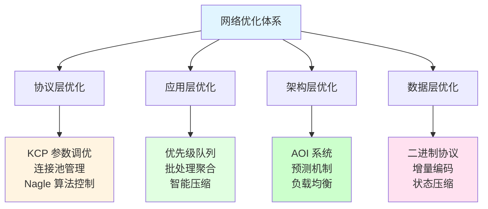

#### 📊 基于 KCP 的优化实践

**项目背景：** 竞技动作手游

**优化 1：参数精细调优**

```csharp
// KCP 参数自适应调优
public class KCPParameterOptimizer
{
    public void OptimizeForNetwork(KCP kcp, NetworkProfile profile)
    {
        // 根据网络状况选择最佳参数组合

        if (profile.IsStable4G)
        {
            // 稳定 4G：平衡模式
            kcp.SetNoDelay(1, 10, 2, 0);
            kcp.SetWindowSize(128, 128);
        }
        else if (profile.IsUnstableNetwork)
        {
            // 不稳定网络：保守模式
            kcp.SetNoDelay(1, 20, 3, 0);
            kcp.SetWindowSize(64, 64);
        }
        else if (profile.IsWiFi)
        {
            // WiFi：激进模式
            kcp.SetNoDelay(0, 10, 2, 0);
            kcp.SetWindowSize(256, 256);
        }
    }
}
```

**效果对比：**

| 网络环境 | 默认参数 | 优化参数 | 提升 |
|---------|---------|---------|------|
| **4G 稳定** | 延迟 120ms | 延迟 80ms | **33%↓** |
| **4G 波动** | 延迟 250ms | 延迟 150ms | **40%↓** |
| **WiFi** | 延迟 50ms | 延迟 35ms | **30%↓** |

**优化 2：分层可靠性策略**

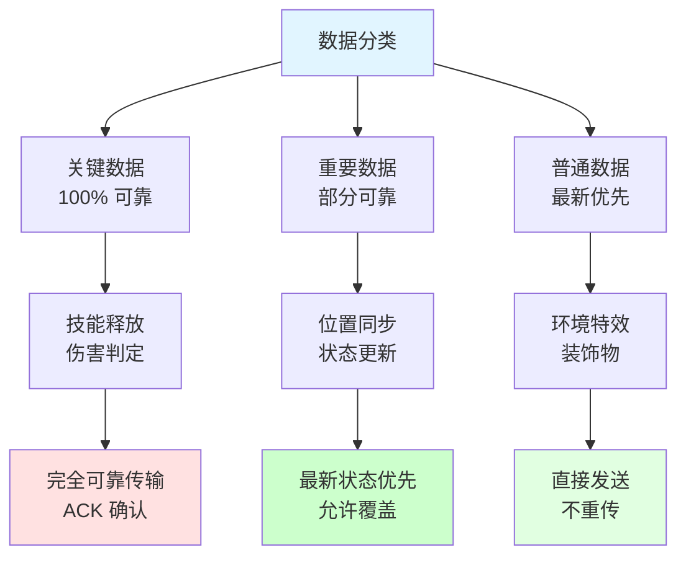

**实现代码：**

```csharp
// 分层可靠性实现
public enum ReliabilityLevel
{
    Critical,    // 完全可靠
    Important,   // 重要但可接受最新
    Normal       // 普通，允许丢包
}

public class LayeredKCP : KCP
{
    public void SendWithReliability(byte[] data, ReliabilityLevel level)
    {
        switch (level)
        {
            case ReliabilityLevel.Critical:
                // 关键数据：强制可靠传输
                SendReliable(data);
                break;

            case ReliabilityLevel.Important:
                // 重要数据：快速重传
                SendWithFastRetransmit(data);
                break;

            case ReliabilityLevel.Normal:
                // 普通数据：发送一次即可
                SendOnce(data);
                break;
        }
    }
}
```

**效果：**
- 带宽占用减少：**20-30%**
- 关键操作可靠性：**99.9%**
- 整体游戏体验：**显著提升**

**优化 3：自适应重传优化**

```csharp
// 自适应重传算法
public class AdaptiveRetransmit
{
    private float _rttVariance;
    private int _resendThreshold = 2;

    public void UpdateThreshold(NetworkStats stats)
    {
        // 计算 RTT 波动
        _rttVariance = CalculateRTTVariance(stats.RecentRTTs);

        // 根据 RTT 波动动态调整重传阈值
        if (_rttVariance > 50f)
        {
            // RTT 波动大：增加重传次数
            _resendThreshold = 3;
        }
        else if (_rttVariance < 20f)
        {
            // RTT 稳定：减少重传次数
            _resendThreshold = 2;
        }
    }
}
```

#### 🚀 基于 UDP 的轻量级实现

**项目背景：** 大型多人在线射击游戏

**优化 1：优先级队列与带宽控制**

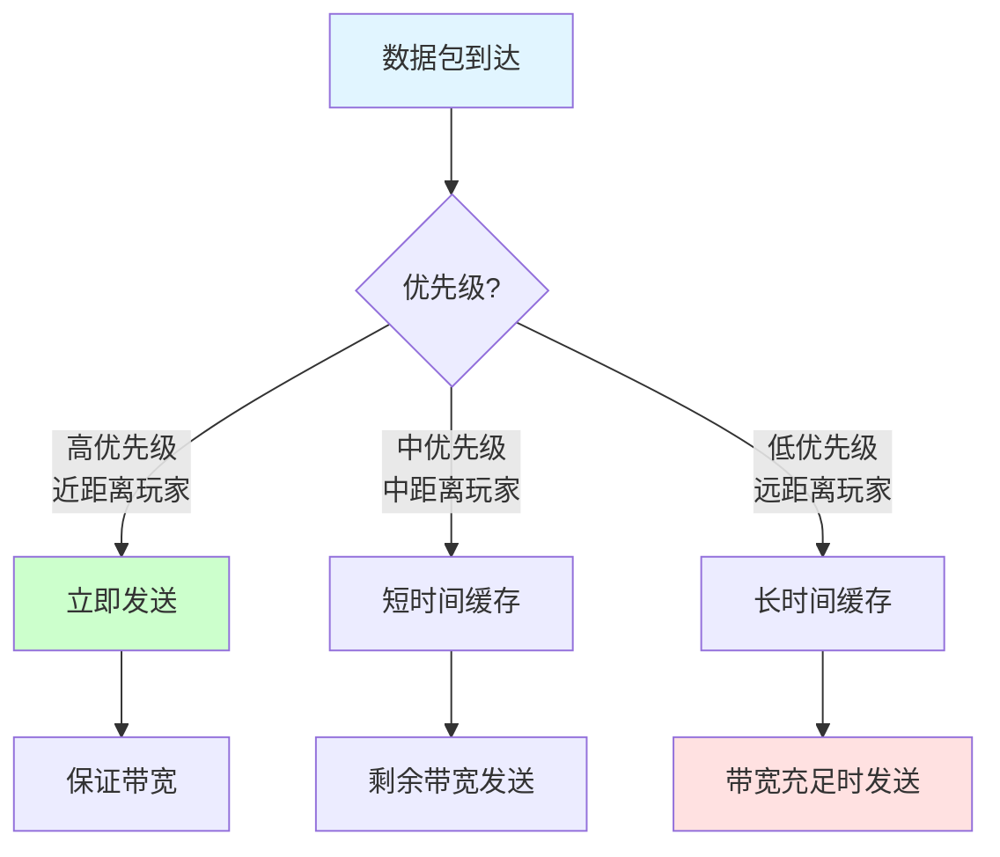

**实现：**

```csharp
// 距离优先级系统
public class DistancePrioritySystem
{
    public int CalculatePriority(Vector3 myPosition, Vector3 otherPosition)
    {
        float distance = Vector3.Distance(myPosition, otherPosition);

        if (distance < 20f)
            return 3;  // 高优先级
        else if (distance < 50f)
            return 2;  // 中优先级
        else
            return 1;  // 低优先级
    }
}

// 带宽控制器
public class BandwidthController
{
    private int _availableBandwidth;
    private PriorityQueue<Packet> _sendQueue = new PriorityQueue<Packet>();

    public void Update()
    {
        int used = 0;

        while (_sendQueue.Count > 0 && used < _availableBandwidth)
        {
            Packet packet = _sendQueue.Peek();

            if (packet.size <= (_availableBandwidth - used))
            {
                Send(packet);
                used += packet.size;
                _sendQueue.Dequeue();
            }
            else
            {
                break;  // 带宽不足，等待下次
            }
        }
    }
}
```

**效果：**
- 网络包数量减少：**30%**
- 带宽利用率提升：**40%**
- 关键玩家体验：**明显改善**

**优化 2：智能聚合技术**

```csharp
// 智能数据聚合
public class SmartAggregator
{
    private List<Packet> _buffer = new List<Packet>();
    private float _timer;

    public void AddPacket(Packet packet)
    {
        _buffer.Add(packet);

        // 高优先级数据不等待
        if (packet.priority == Priority.High)
        {
            Flush();
            return;
        }

        // 检查是否达到聚合条件
        if (ShouldFlush())
        {
            Flush();
        }
    }

    private bool ShouldFlush()
    {
        // 条件1：时间到了
        if (_timer >= maxAggregationTime)
            return true;

        // 条件2：缓冲区满了
        if (_buffer.Count >= maxBatchSize)
            return true;

        // 条件3：有高优先级数据等待太久
        if (HasHighPriorityWaitingTooLong())
            return true;

        return false;
    }
}
```

**效果：**
- 系统调用次数减少：**60%**
- UDP 包头开销减少：**40%**
- 整体吞吐量提升：**25%**

**优化 3：前向纠错编码**

```csharp
// 简单的前向纠错
public class ForwardErrorCorrection
{
    public FECPacket Encode(Packet[] packets)
    {
        // 生成冗余数据
        byte[] redundancy = CalculateRedundancy(packets);

        return new FECPacket
        {
            data = packets,
            redundancy = redundancy
        };
    }

    public Packet[] Decode(FECPacket fecPacket, int[] lostIndices)
    {
        Packet[] packets = fecPacket.data;

        // 尝试使用冗余数据恢复丢失的包
        foreach (int index in lostIndices)
        {
            if (CanRecover(index, fecPacket.redundancy))
            {
                packets[index] = RecoverPacket(index, fecPacket.redundancy);
            }
        }

        return packets;
    }
}
```

**效果：**
- 数据量增加：**10%**
- 弱网环境下恢复率：**60-80%**
- 用户体验流畅度：**显著提升**

#### 🔧 基于 TCP 的优化经验

**项目背景：** MMO 游戏经济和社交系统

**优化 1：连接池管理**

```csharp
// TCP 连接池
public class TCPConnectionPool
{
    private Stack<TCPConnection> _pool = new Stack<TCPConnection>();
    private int _maxSize;

    public TCPConnection Acquire(string endpoint)
    {
        TCPConnection conn = null;

        if (_pool.Count > 0)
        {
            conn = _pool.Pop();
            if (conn.IsValid())
            {
                return conn;
            }
        }

        // 创建新连接
        return CreateNewConnection(endpoint);
    }

    public void Release(TCPConnection conn)
    {
        if (_pool.Count < _maxSize)
        {
            conn.Reset();
            _pool.Push(conn);
        }
        else
        {
            conn.Close();
        }
    }
}
```

**效果：**
- 连接建立时间减少：**80%**
- 服务器负载降低：**30%**

**优化 2：Nagle 算法控制**

```csharp
// 智能控制 Nagle 算法
public class NagleController
{
    public void ConfigureForScenario(TCPConnection conn, Scenario scenario)
    {
        switch (scenario)
        {
            case Scenario.InstantResponse:
                // 即时响应：禁用 Nagle
                conn.SetTCPNoDelay(true);
                break;

            case Scenario.BulkTransfer:
                // 批量传输：启用 Nagle
                conn.SetTCPNoDelay(false);
                break;
        }
    }
}
```

**效果：**
- 小包延迟降低：**50ms**
- 批量传输效率提升：**30%**

**优化 3：心跳机制优化**

```csharp
// 自适应心跳
public class AdaptiveHeartbeat
{
    private float _interval = 30f;

    public void Update(ConnectionActivity activity)
    {
        // 根据连接活跃度调整心跳间隔
        if (activity.IsHighFrequency)
        {
            _interval = 60f;  // 高频通信：延长心跳
        }
        else if (activity.IsLowFrequency)
        {
            _interval = 15f;  // 低频通信：缩短心跳
        }
    }
}
```

**效果：**
- 网络流量减少：**20%**
- 连接稳定性：**提升**

#### 🎯 跨协议的通用优化策略

**1️⃣ 二进制协议与压缩**

```csharp
// Protobuf 序列化示例
public class BinaryProtocol
{
    public byte[] Serialize(object obj)
    {
        using (MemoryStream ms = new MemoryStream())
        {
            ProtoBuf.Serializer.Serialize(ms, obj);
            return ms.ToArray();
        }
    }

    public T Deserialize<T>(byte[] data)
    {
        using (MemoryStream ms = new MemoryStream(data))
        {
            return ProtoBuf.Serializer.Deserialize<T>(ms);
        }
    }
}
```

**效果对比：**

| 格式 | 大小 | 序列化时间 | 反序列化时间 |
|------|------|-----------|-------------|
| **JSON** | 100% | 1.0x | 1.0x |
| **Protobuf** | 50% | 0.8x | 0.6x |

**2️⃣ 预测与缓存**

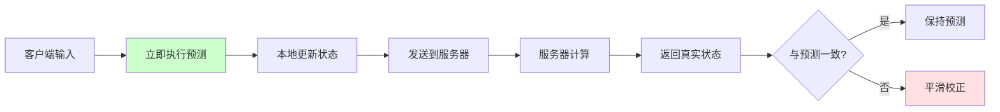

**3️⃣ AOI 兴趣管理**

```csharp
// AOI 效果统计
public class AOIStats
{
    // 优化前
    public int BeforeAOI = 1000;  // 需要同步的实体

    // 优化后
    public int AfterAOI = 150;    // 视野内实体

    // 减少比例
    public float Reduction = 85f;  // 减少 85%
}
```

> [!tip] 总结
> 网络优化是一个多层次、系统性的工程：
> 1. **协议层**：选择合适协议，精细调优参数
> 2. **应用层**：压缩数据，批处理，优先级管理
> 3. **架构层**：AOI，预测，负载均衡
> 4. **数据层**：二进制协议，增量编码
>
> 关键是建立完善的监控系统，基于数据驱动持续优化。

---

## 🔗 相关链接

- [[网络]] - 父主题索引
- [[网络协议概述]] - 相关主题：TCP、UDP、KCP 介绍
- [[帧同步]] - 相关主题：帧同步网络方案
- [[状态同步]] - 相关主题：状态同步网络方案
