## 📊 图解

> [!info] 图示区
> 这里可以放置解释帧同步的 mermaid 图表、流程图或其他辅助理解的图片

### 帧同步原理

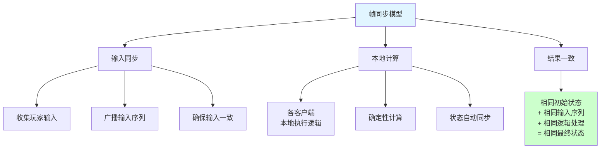

### 帧同步流程

```mermaid
sequenceDiagram
    participant P1 as 玩家1
    participant P2 as 玩家2
    participant Server as 服务器

    P1->>Server: 输入A
    P2->>Server: 输入B

    Server->>Server: 收集输入<br/>打包广播

    Server->>P1: 广播[A,B]
    Server->>P2: 广播[A,B]

    P1->>P1: 本地执行帧N
    P2->>P2: 本地执行帧N

    Note over P1,P2: 状态保持一致

    style Server fill:#ccffcc
```

### 逻辑与渲染分离

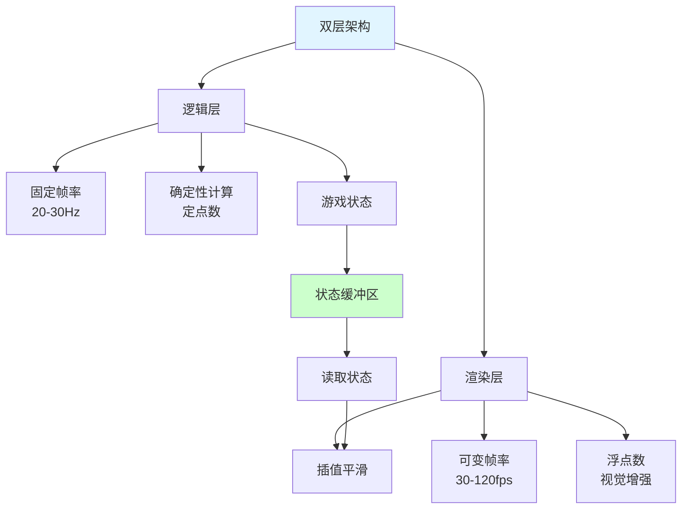

### 帧同步防外挂机制

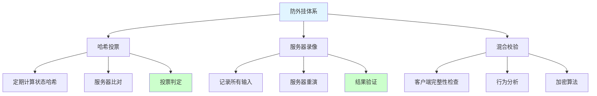

## 📖 原理

### 核心概念

帧同步是一种"输入同步、本地计算"的网络同步模型，特别适合 MOBA、RTS、格斗等竞技类游戏。

#### 🎮 帧同步核心原理

**基本思想：**

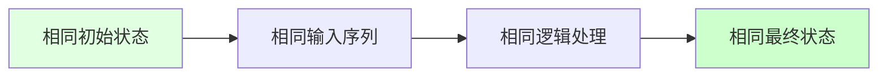

**三个关键条件：**

1. **相同初始状态**：所有客户端从完全相同的状态开始
2. **相同输入序列**：所有客户端收到完全相同顺序的输入
3. **相同逻辑处理**：确定性计算，保证相同输入产生相同输出

#### ⚙️ 帧同步架构

**服务器角色：**

| 职责 | 说明 |
|------|------|
| 📥 **输入收集器** | 收集所有玩家的输入指令 |
| ⏰ **时间仲裁者** | 控制游戏推进节奏 |
| 📡 **输入广播器** | 将输入序列广播给所有客户端 |
| ❌ **不计算逻辑** | 服务器不执行游戏逻辑 |

**客户端职责：**

| 职责 | 说明 |
|------|------|
| 🎮 **执行逻辑** | 本地执行所有游戏逻辑 |
| 📤 **发送输入** | 将自己的操作发送给服务器 |
| 📥 **接收输入** | 接收服务器广播的所有输入 |
| 🖼️ **渲染显示** | 将计算结果渲染显示 |

#### 🔧 逻辑与渲染分离

**分离架构：**

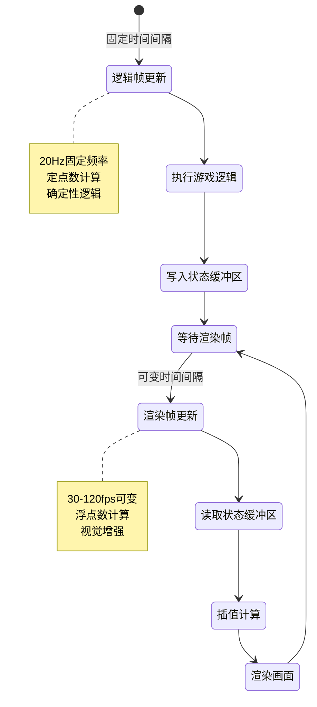

**实现示例：**

```csharp
// 逻辑帧更新（固定20Hz）
void LogicUpdate()
{
    // 收集并处理输入
    ProcessInputs();

    // 更新游戏逻辑（使用定点数）
    UpdateCharacterPositions();
    DetectCollisions();
    ProcessSkillEffects();

    // 将当前逻辑状态写入缓冲区
    gameStateBuffer.Write(currentLogicFrame, gameState);
    currentLogicFrame++;
}

// 渲染帧更新（30-120fps可变）
void RenderUpdate(float deltaTime)
{
    // 计算插值因子
    float t = logicFrameAccumulator / logicFrameInterval;

    // 从缓冲区读取相邻两帧
    GameState prevState = gameStateBuffer.Read(Mathf.FloorToInt(logicFrameTime));
    GameState nextState = gameStateBuffer.Read(Mathf.CeilToInt(logicFrameTime));

    // 插值计算渲染状态
    GameState renderState = InterpolateState(prevState, nextState, t);

    // 渲染
    RenderGameWorld(renderState);
}
```

#### 🔢 定点数计算

**为什么需要定点数：**

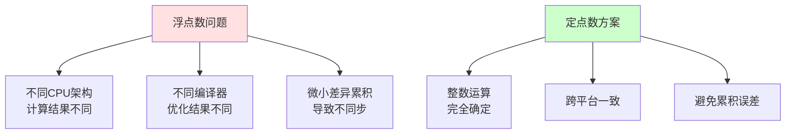

**定点数实现：**

```csharp
// 定点数结构
public struct FixedPoint
{
    private long rawValue;  // 内部值 = 实际值 * 10000
    private const int SCALE = 10000;

    public FixedPoint(float value)
    {
        rawValue = (long)(value * SCALE);
    }

    public static FixedPoint operator +(FixedPoint a, FixedPoint b)
    {
        return new FixedPoint { rawValue = a.rawValue + b.rawValue };
    }

    public static FixedPoint operator *(FixedPoint a, FixedPoint b)
    {
        // 乘法需要额外处理精度
        return new FixedPoint { rawValue = (a.rawValue * b.rawValue) / SCALE };
    }

    public float ToFloat()
    {
        return (float)rawValue / SCALE;
    }
}
```

#### ⚙️ 自研物理引擎

**简化物理系统：**

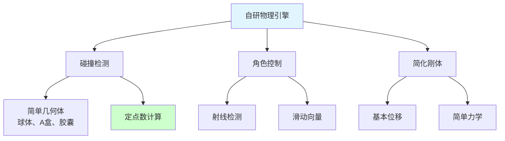

**角色移动实现：**

```csharp
// 确定性的角色移动
public FixedVector3 MoveCharacter(FixedVector3 currentPos, FixedVector3 desiredPos)
{
    // 射线检测
    RaycastResult result = PhysicsSystem.RayCast(currentPos, desiredPos - currentPos);

    if (result.hit)
    {
        // 计算滑动向量
        FixedVector3 slideVector = CalculateSlideVector(
            desiredPos - currentPos,
            result.normal
        );
        return currentPos + slideVector;
    }

    return desiredPos;
}
```

#### 🛡️ 防外挂机制

**1️⃣ 多人哈希投票：**

```mermaid
sequenceDiagram
    participant P1 as 玩家1
    participant P2 as 玩家2
    participant Server as 服务器

    Note over P1,P2: 每100帧

    P1->>Server: 发送状态哈希
    P2->>Server: 发送状态哈希

    Server->>Server: 比对哈希值

    alt 哈希一致
        Server->>Server: 正常继续
    else 哈希不一致
        Server->>Server: 投票判定作弊者
        Server->>Server: 采取措施
    end

    style Server fill:#ccffcc
```

**2️⃣ 服务器录像验证：**

```csharp
// 服务器录像验证
public class ServerReplayValidator
{
    public void ValidateGameSession(GameSession session)
    {
        // 创建虚拟游戏环境
        VirtualGameEnvironment env = new VirtualGameEnvironment();
        env.SetInitialState(session.initialState);

        // 重放所有输入
        foreach (var frame in session.recordedFrames)
        {
            foreach (var input in frame.playerInputs)
            {
                env.ApplyInput(input.playerId, input.data);
            }

            env.AdvanceFrame();

            // 验证检查点
            if (session.checkpoints.ContainsKey(frame.frameId))
            {
                GameState serverState = env.GetCurrentState();
                GameState clientState = session.checkpoints[frame.frameId];

                if (!AreStatesConsistent(serverState, clientState))
                {
                    ReportCheating(frame.frameId);
                }
            }
        }
    }
}
```

**3️⃣ 混合校验机制：**

| 机制 | 作用 | 效果 |
|------|------|------|
| **客户端完整性检查** | 检测代码修改 | 防止内存修改 |
| **行为分析** | 机器学习识别异常 | 智能检测 |
| **加密算法** | 保护关键逻辑 | 增加逆向难度 |
| **社区举报** | 人工审核 | 最终防线 |

---

## 💡 面试题

### Q：请详细解释帧同步的原理，并说明为什么它特别适用于 MOBA 类游戏？

#### 🎯 帧同步深度解析

**核心原理：**

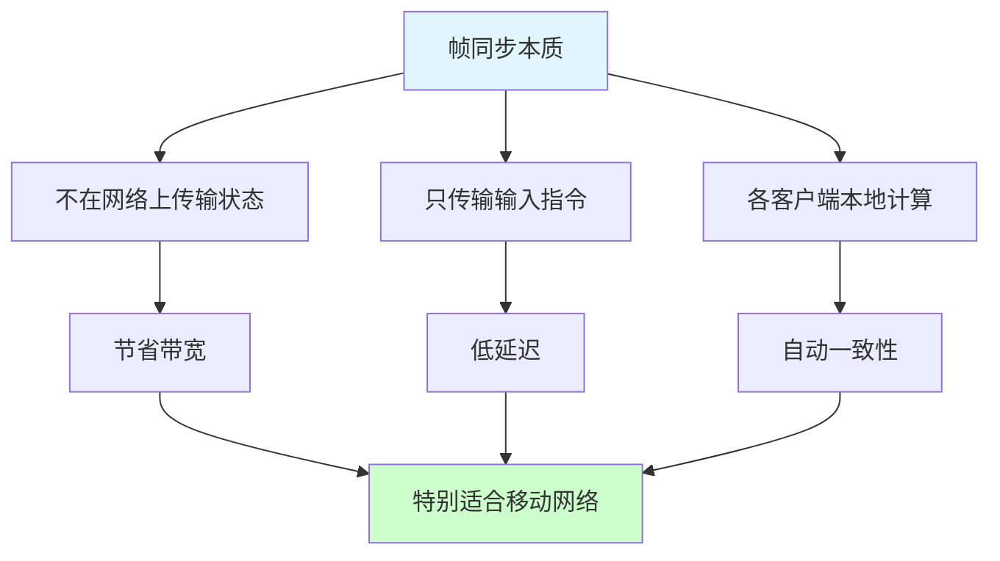

**与传统状态同步对比：**

| 维度 | 帧同步 | 状态同步 |
|------|-------|---------|
| **传输内容** | 输入指令（小） | 游戏状态（大） |
| **计算位置** | 客户端 | 服务器 |
| **带宽需求** | 极低 | 较高 |
| **延迟感知** | 小 | 大 |
| **服务器负载** | 低 | 高 |
| **安全性** | 较低 | 较高 |

#### 🎮 为什么适合 MOBA 游戏

**1️⃣ MOBA 游戏特点分析：**

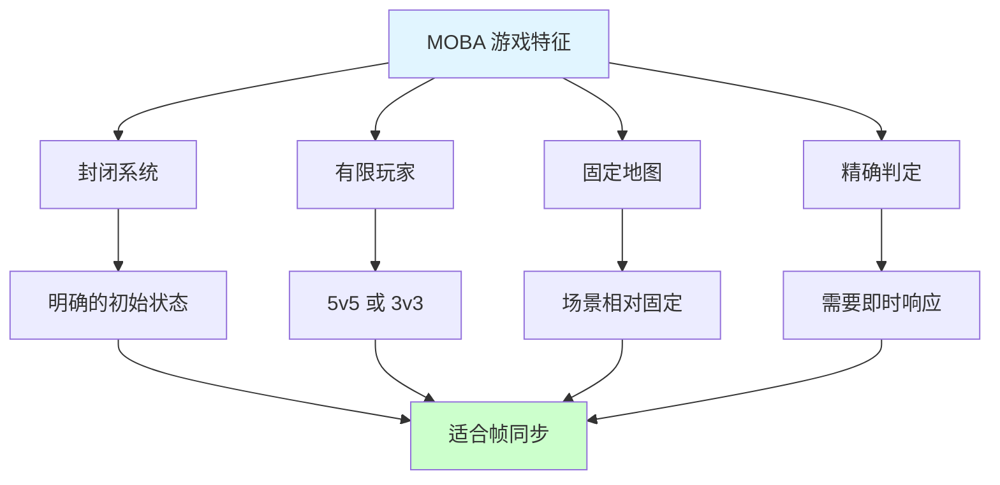

**2️⃣ 技术优势：**

| 优势 | 说明 | MOBA 中的价值 |
|------|------|--------------|
| **低带宽** | 只传输输入指令 | 适合移动网络 |
| **低延迟** | 本地即时响应 | 操作手感好 |
| **精确判定** | 本地计算，无网络误差 | 技能判定准确 |
| **服务器轻** | 只转发输入 | 支持大量并发 |

**3️⃣ 实际参数配置：**

```csharp
// MOBA 游戏典型配置
public class MOBAFrameSyncConfig
{
    // 逻辑帧率：20Hz（每50ms一帧）
    public const int LOGIC_FPS = 20;

    // 输入延迟缓冲：3帧（150ms）
    public const int INPUT_BUFFER = 3;

    // 渲染帧率：30-120fps自适应
    public const int MIN_RENDER_FPS = 30;
    public const int MAX_RENDER_FPS = 120;

    // 哈希校验频率：每100帧
    public const int HASH_CHECK_INTERVAL = 100;
}
```

#### 📊 性能数据

**网络流量对比：**

| 同步方案 | 每秒流量 | 说明 |
|---------|---------|------|
| **帧同步** | 2-5 KB | 只传输输入指令 |
| **状态同步** | 20-50 KB | 传输完整状态 |

**延迟对比：**

| 操作 | 帧同步 | 状态同步 |
|------|-------|---------|
| **本地响应** | 0ms | 50-100ms |
| **网络延迟** | RTT/2 | RTT |
| **总延迟** | RTT/2 | 1.5×RTT |

> [!tip] 总结
> 帧同步特别适合 MOBA 游戏是因为：
> 1. **带宽需求低**：移动网络友好
> 2. **延迟感知小**：即时操作反馈
> 3. **判定精确**：本地计算无误差
> 4. **服务器轻量**：支持大规模对战
>
> 这些优势完美契合 MOBA 游戏的需求。

---

### Q：帧同步游戏中为什么需要使用定点数计算和自研物理引擎？

#### 🎯 确定性计算的挑战

**浮点数的问题：**

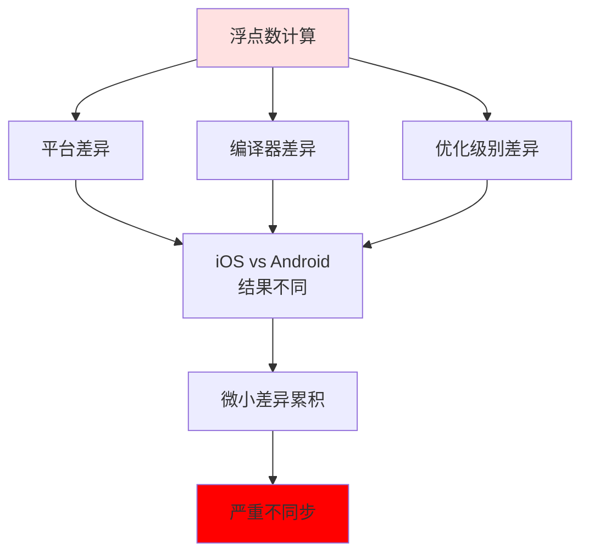

**实际测试数据：**

```csharp
// 浮点数累积误差测试
void TestFloatAccumulation()
{
    float value = 0.0f;

    for (int i = 0; i < 1000; i++)
    {
        value += 0.1f;
    }

    // iOS: 100.000013
    // Android: 100.000027
    // 差异虽然小，但在帧同步中会累积
}
```

#### 🔢 定点数解决方案

**定点数原理：**

| 方面 | 浮点数 | 定点数 |
|------|-------|-------|
| **存储方式** | 符号+指数+尾数 | 纯整数 |
| **计算方式** | 硬件浮点单元 | 整数运算 |
| **跨平台** | 可能不一致 | 完全一致 |
| **精度** | 高 | 固定精度 |

**完整实现：**

```csharp
// 定点数数学库
public struct FixedPoint
{
    private long rawValue;
    private const int FRACTIONAL_BITS = 16;
    private const long SCALE = 1L << FRACTIONAL_BITS;

    public FixedPoint(float value)
    {
        rawValue = (long)(value * SCALE);
    }

    public static FixedPoint operator +(FixedPoint a, FixedPoint b)
    {
        return new FixedPoint { rawValue = a.rawValue + b.rawValue };
    }

    public static FixedPoint operator -(FixedPoint a, FixedPoint b)
    {
        return new FixedPoint { rawValue = a.rawValue - b.rawValue };
    }

    public static FixedPoint operator *(FixedPoint a, FixedPoint b)
    {
        return new FixedPoint { rawValue = (a.rawValue * b.rawValue) >> FRACTIONAL_BITS };
    }

    public static FixedPoint operator /(FixedPoint a, FixedPoint b)
    {
        return new FixedPoint { rawValue = (a.rawValue << FRACTIONAL_BITS) / b.rawValue };
    }

    public float ToFloat()
    {
        return (float)rawValue / SCALE;
    }

    // 三角函数
    public static FixedPoint Sin(FixedPoint angle)
    {
        // 使用查找表或泰勒展开
        return LookupSin(angle);
    }

    public static FixedPoint Cos(FixedPoint angle)
    {
        return Sin(angle + FixedPoint.Pi / 2);
    }
}

// 定点数向量
public struct FixedVector3
{
    public FixedPoint x, y, z;

    public FixedVector3(FixedPoint x, FixedPoint y, FixedPoint z)
    {
        this.x = x;
        this.y = y;
        this.z = z;
    }

    public static FixedVector3 operator +(FixedVector3 a, FixedVector3 b)
    {
        return new FixedVector3(a.x + b.x, a.y + b.y, a.z + b.z);
    }

    public FixedPoint Length()
    {
        return FixedPoint.Sqrt(x * x + y * y + z * z);
    }
}
```

#### ⚙️ 自研物理引擎

**为什么需要自研：**

| 原因 | 说明 |
|------|------|
| **确定性** | 第三方引擎不保证跨平台一致 |
| **简化** | 游戏不需要真实物理仿真 |
| **控制** | 完全控制物理行为 |
| **性能** | 针对游戏场景优化 |

**核心组件：**

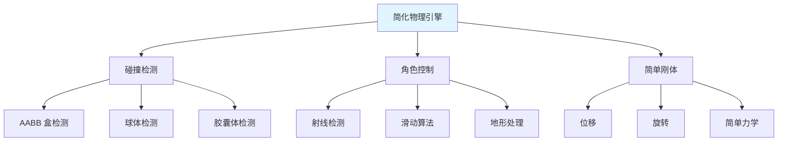

**碰撞检测实现：**

```csharp
// AABB 碰撞检测
public struct AABB
{
    public FixedVector3 min;
    public FixedVector3 max;

    public bool Overlaps(AABB other)
    {
        return (min.x <= other.max.x && max.x >= other.min.x) &&
               (min.y <= other.max.y && max.y >= other.min.y) &&
               (min.z <= other.max.z && max.z >= other.min.z);
    }
}

// 碰撞系统
public class CollisionSystem
{
    public bool CheckCollision(AABB a, AABB b)
    {
        return a.Overlaps(b);
    }

    public RaycastHit RayCast(FixedVector3 origin, FixedVector3 direction)
    {
        // 简化的射线检测
        RaycastHit hit = new RaycastHit();
        // ... 实现细节
        return hit;
    }
}
```

**角色控制实现：**

```csharp
// 角色控制器
public class CharacterController
{
    public FixedVector3 Move(
        FixedVector3 currentPosition,
        FixedVector3 desiredPosition,
        FixedVector3 velocity
    )
    {
        // 射线检测
        RaycastHit hit = PhysicsSystem.RayCast(
            currentPosition,
            desiredPosition - currentPosition
        );

        if (hit.hit)
        {
            // 计算滑动向量
            FixedVector3 slideDir = (desiredPosition - currentPosition)
                - hit.normal * FixedVector3.Dot(
                    desiredPosition - currentPosition,
                    hit.normal
                );

            return currentPosition + slideDir;
        }

        return desiredPosition;
    }
}
```

#### 📊 性能与效果

**跨平台一致性测试：**

| 测试项 | 浮点数 | 定点数 |
|-------|-------|-------|
| **1000帧后位置误差** | 0.5-2.0 单位 | 0 单位 |
| **碰撞检测结果** | 95% 一致 | 100% 一致 |
| **CPU 占用** | 基准 | +15% |

**开发复杂度：**

| 方面 | 复杂度 | 说明 |
|------|-------|------|
| **数学库** | 高 | 需要实现完整的定点数库 |
| **物理引擎** | 中高 | 简化但需要自研 |
| **调试难度** | 高 | 定点数不直观 |
| **维护成本** | 高 | 需要专门团队维护 |

> [!tip] 总结
> 定点数和自研物理引擎虽然增加了开发复杂度，但这是实现帧同步的必要成本：
> 1. **确定性**：保证跨平台完全一致
> 2. **可控性**：完全控制物理行为
> 3. **优化空间**：针对游戏场景优化
>
> 现在有一些开源库可以使用，但在关键项目中通常还是选择自研或深度定制。

---

## 🔗 相关链接

- [[网络]] - 父主题索引
- [[网络协议概述]] - 相关主题：KCP 在帧同步中的应用
- [[网络协议选择与优化]] - 相关主题：帧同步的协议选择
- [[状态同步]] - 相关主题：与状态同步的对比
