## 📊 图解

> [!info] 图示区
> 这里可以放置解释状态同步的 mermaid 图表、架构图或其他辅助理解的图片

### 状态同步原理

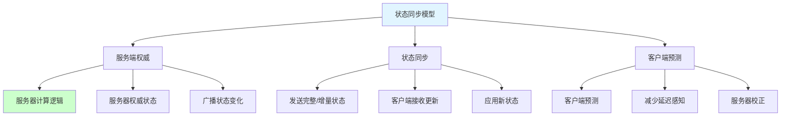

### 状态同步流程

```mermaid
sequenceDiagram
    participant C as 客户端
    participant S as 服务器
    participant O as 其他客户端

    C->>S: 发送操作
    S->>S: 计算新状态
    S->>C: 广播状态更新
    S->>O: 广播状态更新

    C->>C: 客户端预测
    C->>C: 插值平滑

    Note over C,O: 所有客户端看到一致状态

    style S fill:#ccffcc
```

### AOI 兴趣管理

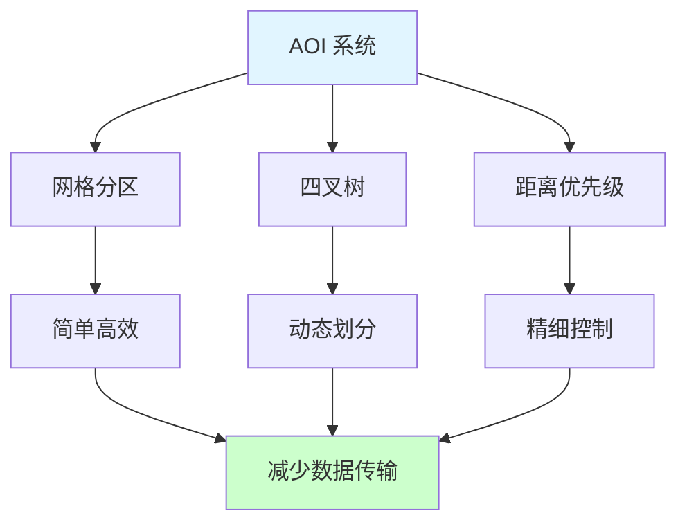

### 状态同步优化技术

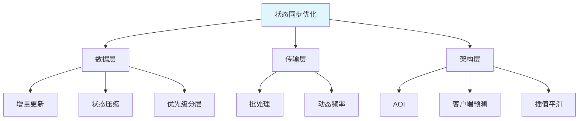

## 📖 原理

### 核心概念

状态同步是"服务端权威、状态同步、客户端预测"的网络同步模型，特别适合 MMO、MMORPG 等大型多人在线游戏。

#### 🎮 状态同步核心原理

**基本思想：**

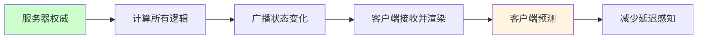

**核心特点：**

| 特点 | 说明 |
|------|------|
| 🖥️ **服务端权威** | 服务器执行所有游戏逻辑 |
| 📡 **状态同步** | 服务器将状态变化广播给客户端 |
| 🔮 **客户端预测** | 客户端预测未来状态，减少延迟感知 |
| 🎯 **插值平滑** | 平滑状态更新，避免跳跃 |

#### 🔄 与帧同步的本质区别

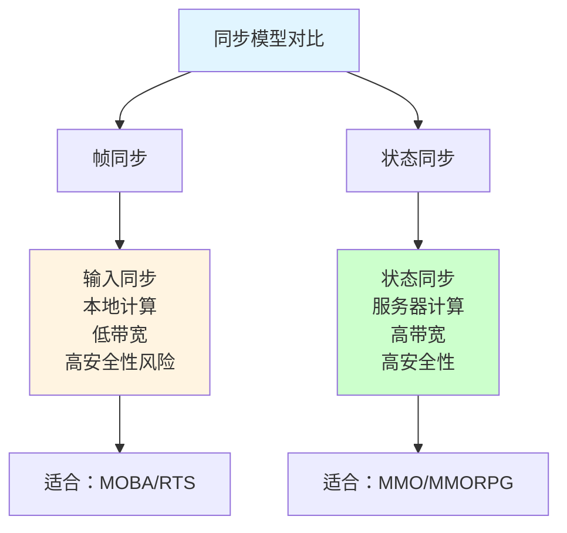

**详细对比表：**

| 维度 | 帧同步 | 状态同步 |
|------|-------|---------|
| **计算中心** | 客户端 | 服务器 |
| **传输内容** | 输入指令 | 游戏状态 |
| **数据量** | 小 | 大 |
| **延迟敏感度** | 高（等最慢玩家） | 低（独立接收） |
| **客户端负担** | 重（执行逻辑） | 轻（主要渲染） |
| **安全性** | 低（客户端计算） | 高（服务器权威） |
| **网络适应性** | 差（严格同步） | 好（独立更新） |
| **服务器成本** | 低（只转发） | 高（计算+广播） |

#### 🏗️ 状态同步架构

**服务器架构：**

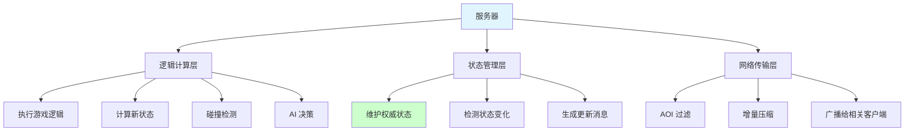

**客户端架构：**

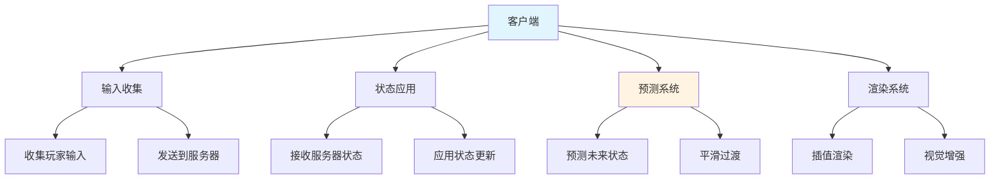

#### 🎯 MMO 状态同步关键技术

**1️⃣ AOI（兴趣管理）：**

**网格分区实现：**

```csharp
// 网格 AOI
public class GridAOI
{
    private int _cellSize = 100;  // 网格大小
    private Dictionary<int, GridCell> _cells = new Dictionary<int, GridCell>();

    public List<Entity> GetVisibleEntities(Vector3 position, float viewDistance)
    {
        List<Entity> visible = new List<Entity>();

        // 计算玩家所在网格
        int cellX = Mathf.FloorToInt(position.x / _cellSize);
        int cellZ = Mathf.FloorToInt(position.z / _cellSize);

        // 计算视野范围内的网格
        int radius = Mathf.CeilToInt(viewDistance / _cellSize);

        // 收集相关网格中的实体
        for (int x = cellX - radius; x <= cellX + radius; x++)
        {
            for (int z = cellZ - radius; z <= cellZ + radius; z++)
            {
                int key = x * 10000 + z;
                if (_cells.TryGetValue(key, out GridCell cell))
                {
                    visible.AddRange(cell.GetEntities());
                }
            }
        }

        return visible;
    }
}
```

**效果：**
- 数据传输量减少：**70-90%**
- 服务器负载降低：**60-80%**

**2️⃣ 增量更新：**

```csharp
// 增量更新
public class DeltaUpdateGenerator
{
    public EntityUpdate CreateDeltaUpdate(Entity entity, EntityState lastSentState)
    {
        EntityUpdate update = new EntityUpdate();
        update.entityId = entity.id;

        // 只发送发生变化的属性
        if (entity.position != lastSentState.position)
        {
            update.hasPositionUpdate = true;
            update.position = entity.position;
        }

        if (entity.rotation != lastSentState.rotation)
        {
            update.hasRotationUpdate = true;
            update.rotation = entity.rotation;
        }

        if (entity.health != lastSentState.health)
        {
            update.hasHealthUpdate = true;
            update.health = entity.health;
        }

        return update;
    }
}
```

**3️⃣ 状态压缩：**

```csharp
// 位置压缩
public struct CompressedPosition
{
    public ushort x;  // 16位，精度约0.5米
    public ushort y;
    public ushort z;

    public CompressedPosition(Vector3 position, Vector3 origin)
    {
        // 量化到16位
        Vector3 relative = position - origin;
        x = (ushort)((relative.x / 65535f) * 65535);
        y = (ushort)((relative.y / 65535f) * 65535);
        z = (ushort)((relative.z / 65535f) * 65535);
    }

    public Vector3 Decompress(Vector3 origin)
    {
        return origin + new Vector3(x / 65535f * 65535f, y / 65535f * 65535f, z / 65535f * 65535f);
    }
}
```

**压缩效果：**

| 数据类型 | 原始大小 | 压缩后 | 节省 |
|---------|---------|-------|------|
| **位置** | 12字节（3×float） | 6字节（3×ushort） | 50% |
| **旋转** | 16字节（4×float） | 8字节（2×float） | 50% |
| **动画** | 8字节 | 2字节 | 75% |

**4️⃣ 客户端预测与插值：**

```csharp
// 客户端预测
public class ClientPrediction
{
    public Vector3 PredictPosition(Vector3 position, Vector3 velocity, float predictionTime)
    {
        return position + velocity * predictionTime;
    }
}

// 状态插值
public class StateInterpolation
{
    public EntityState Interpolate(EntityState prev, EntityState next, float t)
    {
        return new EntityState
        {
            position = Vector3.Lerp(prev.position, next.position, t),
            rotation = Quaternion.Slerp(prev.rotation, next.rotation, t),
            health = Mathf.Lerp(prev.health, next.health, t)
        };
    }
}
```

#### 📊 状态同步优化策略

**优先级分层：**

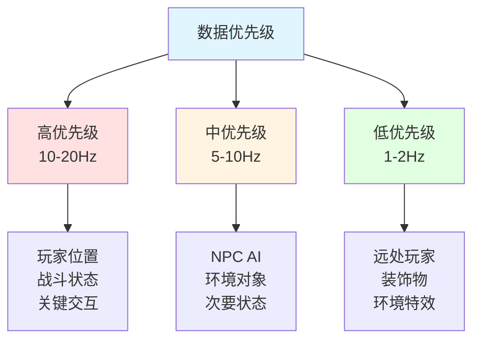

**动态频率调整：**

```csharp
// 动态更新频率
public class DynamicUpdateFrequency
{
    public void AdjustFrequency(ClientConnection client, NetworkQuality quality)
    {
        switch (quality)
        {
            case NetworkQuality.Excellent:
                client.updateFrequency = 20;  // 20Hz
                break;
            case NetworkQuality.Good:
                client.updateFrequency = 15;  // 15Hz
                break;
            case NetworkQuality.Medium:
                client.updateFrequency = 10;  // 10Hz
                break;
            case NetworkQuality.Poor:
                client.updateFrequency = 5;   // 5Hz
                break;
        }
    }
}
```

---

## 💡 面试题

### Q：状态同步的核心原理是什么？它与帧同步有哪些本质区别？在MMO游戏中如何实现高效的状态同步？

#### 🎯 状态同步核心原理深度解析

**三大核心原则：**

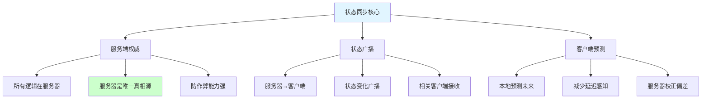

**与帧同步的本质区别：**

| 维度 | 帧同步 | 状态同步 | 本质差异 |
|------|-------|---------|---------|
| **计算位置** | 客户端 | 服务器 | 权威中心不同 |
| **传输内容** | 输入指令 | 游戏状态 | 数据类型不同 |
| **数据量** | 极小 | 较大 | 带宽需求不同 |
| **同步机制** | 严格同步 | 松散同步 | 一致性保证不同 |
| **延迟处理** | 等待最慢者 | 预测+插值 | 延迟感知不同 |
| **安全性** | 较低 | 较高 | 作弊难度不同 |
| **适用规模** | 小规模 | 大规模 | 扩展性不同 |

**网络延迟处理对比：**

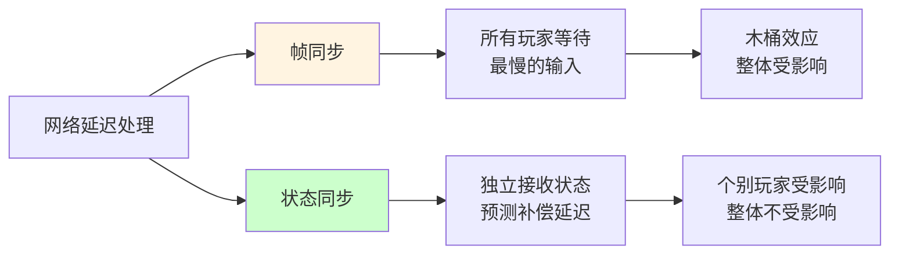

#### 🎮 MMO 高效状态同步实现

**1️⃣ AOI（兴趣管理）：**

**三种实现方式：**

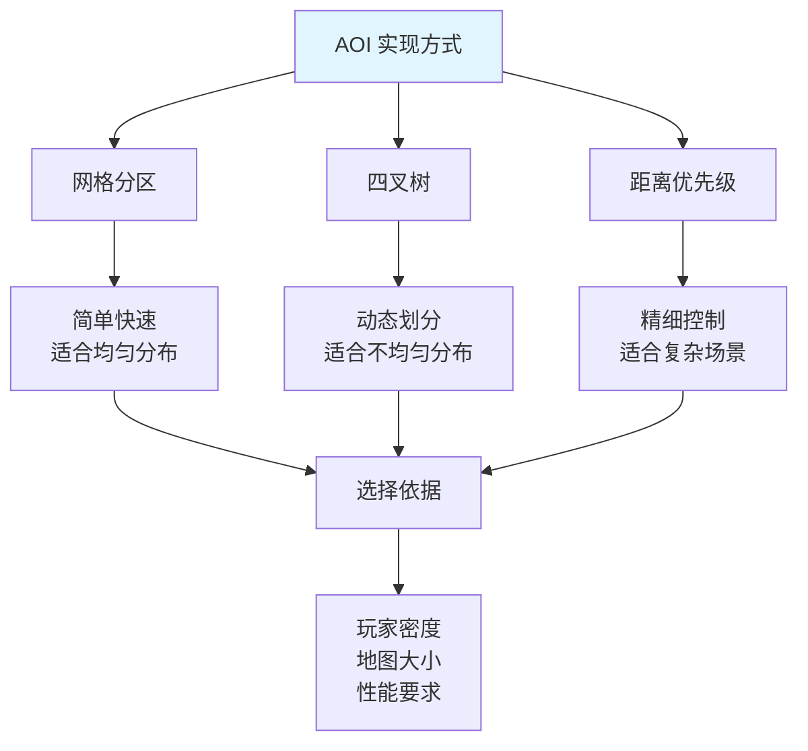

**实现对比：**

| 方式 | 时间复杂度 | 空间复杂度 | 适用场景 |
|------|-----------|-----------|---------|
| **网格分区** | O(1) | O(n) | 均匀分布 |
| **四叉树** | O(log n) | O(n) | 不均匀分布 |
| **距离优先级** | O(n) | O(1) | 简单场景 |

**2️⃣ 增量更新与差异压缩：**

```csharp
// 智能增量更新
public class SmartDeltaUpdate
{
    private Dictionary<int, EntityState> _lastSentStates = new Dictionary<int, EntityState>();

    public List<EntityUpdate> GenerateDeltaUpdates(List<Entity> entities)
    {
        List<EntityUpdate> updates = new List<EntityUpdate>();

        foreach (var entity in entities)
        {
            if (!_lastSentStates.TryGetValue(entity.id, out EntityState lastState))
            {
                // 首次发送，发送完整状态
                updates.Add(CreateFullUpdate(entity));
            }
            else
            {
                // 发送变化的部分
                EntityUpdate delta = CreateDeltaUpdate(entity, lastState);
                if (delta != null)
                {
                    updates.Add(delta);
                }
            }

            // 更新最后发送状态
            _lastSentStates[entity.id] = entity.GetCurrentState();
        }

        return updates;
    }
}
```

**3️⃣ 数据优先级分层：**

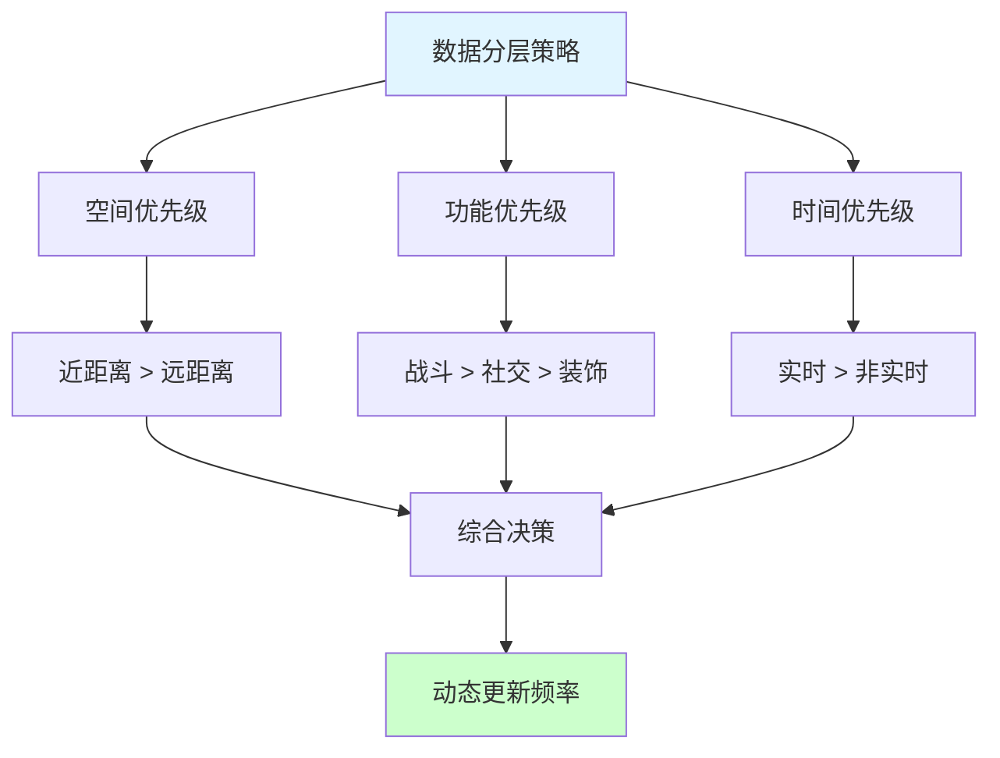

**实现代码：**

```csharp
// 优先级系统
public class PrioritySystem
{
    public UpdatePriority CalculatePriority(Entity entity, Player observer)
    {
        float distance = Vector3.Distance(entity.position, observer.position);
        bool isImportant = entity.IsImportantTo(observer);

        if (distance < 20f && isImportant)
            return UpdatePriority.Critical;  // 20Hz
        else if (distance < 50f)
            return UpdatePriority.High;       // 10Hz
        else if (distance < 100f)
            return UpdatePriority.Medium;     // 5Hz
        else
            return UpdatePriority.Low;        // 1Hz
    }
}
```

**4️⃣ 客户端预测与平滑：**

```csharp
// 客户端预测系统
public class ClientPredictionSystem
{
    public void Update(float deltaTime)
    {
        // 预测本地玩家
        Vector3 predictedPosition = PredictLocalPlayer();
        Vector3 predictedVelocity = PredictVelocity();

        // 应用预测
        localPlayer.visualPosition = predictedPosition;

        // 收到服务器状态时校正
        if (receivedServerState)
        {
            SmoothCorrection(serverState.position, predictedPosition);
        }
    }

    private void SmoothCorrection(Vector3 serverPos, Vector3 clientPos)
    {
        // 平滑过渡到服务器位置
        float t = Mathf.Clamp01(Time.deltaTime * 10f);
        localPlayer.visualPosition = Vector3.Lerp(clientPos, serverPos, t);
    }
}
```

**5️⃣ 状态压缩技术：**

| 技术 | 压缩比 | CPU 开销 | 适用数据 |
|------|-------|---------|---------|
| **量化** | 50% | 低 | 位置、旋转 |
| **增量编码** | 70% | 中 | 连续值 |
| **位图标记** | 变化 | 低 | 属性更新 |
| **字典压缩** | 50-90% | 中 | 重复数据 |

#### 📊 性能优化效果

**单服务器区域性能：**

| 指标 | 优化前 | 优化后 | 提升 |
|------|-------|-------|------|
| **并发玩家** | 200 | 1000+ | **5x** |
| **网络流量** | 50KB/s/玩家 | 15KB/s/玩家 | **70%↓** |
| **CPU 占用** | 80% | 40% | **50%↓** |
| **带宽峰值** | 2Gbps | 800Mbps | **60%↓** |

**优化技术贡献：**

| 技术 | 流量减少 | CPU 减少 |
|------|---------|---------|
| **AOI** | 70% | 30% |
| **增量更新** | 40% | 10% |
| **状态压缩** | 30% | 20% |
| **优先级分层** | 20% | 15% |

#### 💡 最佳实践总结

**MMO 状态同步核心原则：**

1. **服务端权威**：所有逻辑在服务器执行
2. **AOI 过滤**：只同步视野内数据
3. **增量更新**：只传输变化的部分
4. **状态压缩**：减少带宽占用
5. **优先级分层**：根据重要性调整频率
6. **客户端预测**：减少延迟感知
7. **插值平滑**：提升视觉体验

> [!tip] 总结
> 状态同步适合 MMO 的原因：
> 1. **服务器权威**：安全、可控
> 2. **松散同步**：适应大规模玩家
> 3. **优化空间大**：多种优化技术
> 4. **成熟稳定**：大量成功案例
>
> 关键是根据游戏特点，合理组合各种优化技术，在带宽、延迟、一致性之间找到最佳平衡点。

---

## 🔗 相关链接

- [[网络]] - 父主题索引
- [[网络协议概述]] - 相关主题：TCP/KCP 在状态同步中的应用
- [[网络协议选择与优化]] - 相关主题：状态同步优化策略
- [[帧同步]] - 相关主题：与帧同步的对比
