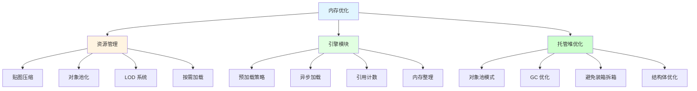
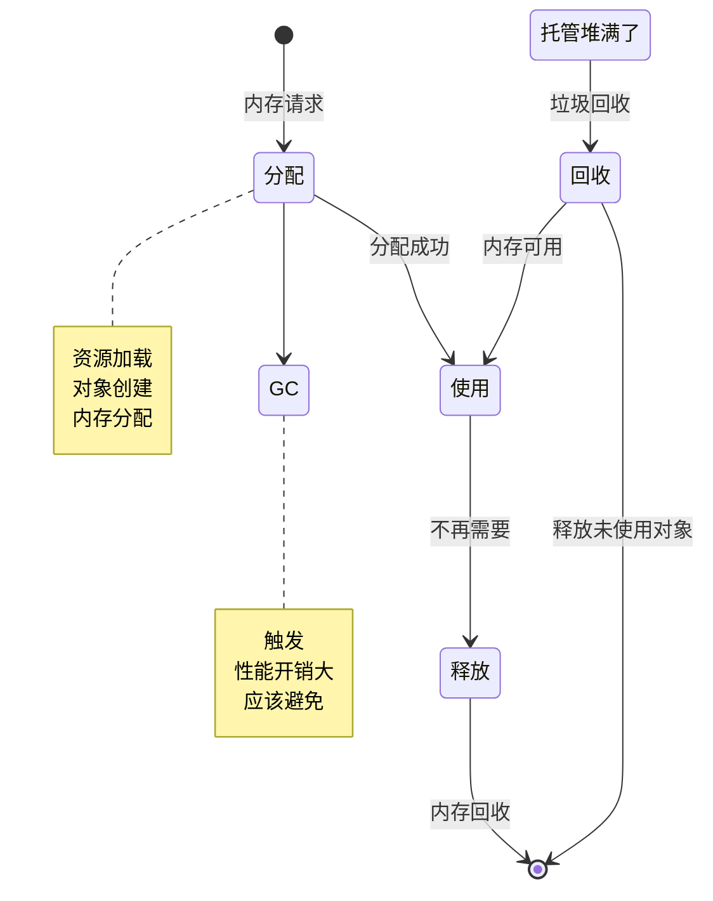
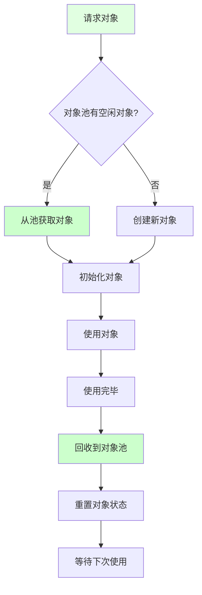
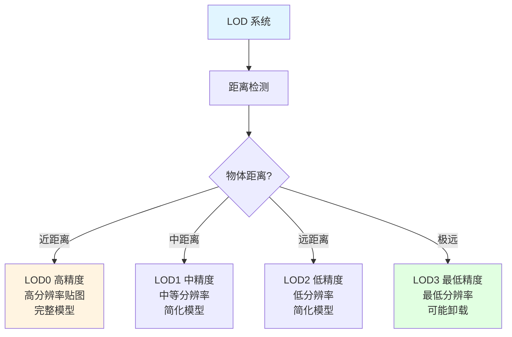
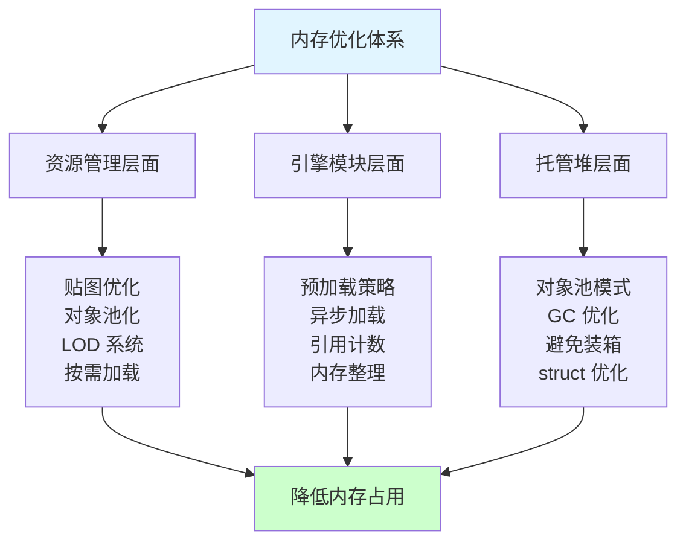

## 📊 图解

> [!info] 图示区
> 这里可以放置解释内存优化的 mermaid 图表、内存分布图或其他辅助理解的图片

### 内存优化层次结构



### 内存分配生命周期



### 对象池工作机制



### LOD 系统内存管理



## 📖 原理

### 核心概念

内存优化是游戏性能的基础，直接影响游戏的稳定性、流畅度和用户体验。在移动平台等资源受限环境中尤为重要。

#### 🎮 资源管理层面的内存优化

**1️⃣ 贴图资源优化：**

贴图通常是内存占用最大的资源类型，优化贴图可以显著降低内存使用。

| 优化策略 | 说明 | 效果 |
|---------|------|------|
| **选择合适的压缩格式** | iOS: PVRTC, Android: ETC2/ASTC | 节省 50-70% 内存 |
| **控制贴图尺寸** | 降采样到实际显示所需的最小分辨率 | 节省 30-50% 内存 |
| **合理设置贴图类型** | UI 不需要 MipMap，环境纹理需要 | 节省 20-30% 内存 |
| **使用贴图图集** | 将多个小贴图合并为大贴图 | 减少贴图数量 |

**贴图压缩格式对比：**

| 格式 | 平台 | 压缩比 | 质量 | 备注 |
|------|------|-------|------|------|
| **PVRTC** | iOS | 4:1 / 2:1 | 中 | 方形贴图 |
| **ETC2** | Android | 4:1 | 中高 | 需要 OpenGL ES 3.0 |
| **ASTC** | 移动平台 | 4:1 - 12:1 | 高 | 灵活性高 |
| **BC7** | PC/主机 | 3:1 | 高 | 高质量压缩 |

**2️⃣ 资源池化与复用：**

对于频繁创建销毁的对象，使用对象池可以显著减少内存分配和 GC 压力。

```csharp
// 通用对象池实现
public class ObjectPool<T> where T : class, new()
{
    private readonly Stack<T> _pool = new Stack<T>();
    private readonly int _maxSize;

    public T Get()
    {
        return _pool.Count > 0 ? _pool.Pop() : new T();
    }

    public void Return(T obj)
    {
        if (_pool.Count < _maxSize)
        {
            _pool.Push(obj);
        }
    }
}

// Unity 对象池
public class UnityObjectPool<T> where T : MonoBehaviour
{
    private readonly Stack<T> _pool = new Stack<T>();
    private readonly T _prefab;
    private readonly Transform _parent;

    public T Get()
    {
        T obj = _pool.Count > 0 ? _pool.Pop() : GameObject.Instantiate(_prefab, _parent);
        obj.gameObject.SetActive(true);
        return obj;
    }

    public void Return(T obj)
    {
        obj.gameObject.SetActive(false);
        _pool.Push(obj);
    }
}
```

**适用对象类型：**

- 子弹、箭矢等投射物
- 特效粒子系统
- UI 元素（列表项、图标）
- 音频源对象
- 临时显示的提示框

**3️⃣ LOD（Level of Detail）系统：**

根据物体与摄像机的距离，动态调整其细节级别。

```csharp
// LOD 系统实现
public class LODSystem : MonoBehaviour
{
    public LODLevel[] lodLevels;

    [System.Serializable]
    public class LODLevel
    {
        public float distance;
        public GameObject[] renderers;
        public int maxTextureSize;
    }

    private void Update()
    {
        float distance = Vector3.Distance(Camera.main.transform.position, transform.position);

        for (int i = 0; i < lodLevels.Length; i++)
        {
            if (distance <= lodLevels[i].distance)
            {
                SetLODLevel(i);
                break;
            }
        }
    }

    private void SetLODLevel(int level)
    {
        // 激活对应级别的渲染器
        for (int i = 0; i < lodLevels.Length; i++)
        {
            bool active = (i == level);
            foreach (var renderer in lodLevels[i].renderers)
            {
                renderer.SetActive(active);
            }
        }

        // 调整贴图分辨率
        int textureSize = lodLevels[level].maxTextureSize;
        // 应用贴图分辨率调整...
    }
}
```

**4️⃣ 按需加载与卸载：**

实现资源的动态加载和卸载，确保内存中只保留当前需要的资源。

```csharp
// 资源流式加载
public class ResourceStreamingManager : MonoBehaviour
{
    private Dictionary<string, AsyncOperation> _loadingOperations = new Dictionary<string, AsyncOperation>();

    public IEnumerator LoadResourceAsync(string path, float unloadDistance)
    {
        if (_loadingOperations.ContainsKey(path))
            yield break;

        AsyncOperation operation = SceneManager.LoadSceneAsync(path, LoadSceneMode.Additive);
        _loadingOperations[path] = operation;

        yield return operation;

        // 场景加载完成，注册到管理系统
        RegisterLoadedScene(path, unloadDistance);
    }

    public void UnloadDistantResources(Vector3 playerPosition)
    {
        foreach (var kvp in _loadedScenes)
        {
            string scenePath = kvp.Key;
            SceneInfo info = kvp.Value;

            float distance = Vector3.Distance(playerPosition, info.position);
            if (distance > info.unloadDistance)
            {
                SceneManager.UnloadSceneAsync(scenePath);
                _loadedScenes.Remove(scenePath);
            }
        }
    }
}
```

#### ⚙️ 引擎模块层面的内存优化

**1️⃣ 预加载策略优化：**

| API | 问题 | 解决方案 |
|-----|------|---------|
| **Resources.Load** | 内存常驻，无法卸载 | 使用 Addressables |
| **AssetBundle** | 管理复杂 | 使用 Addressables |
| **AssetReference** | 场景引用加载 | 运行时加载 |

**Addressables 优势：**
- 细粒度的资源生命周期管理
- 支持异步加载和卸载
- 自动管理依赖关系
- 支持内存标签和分组

**2️⃣ 异步加载系统：**

```csharp
// 优先级队列的异步加载系统
public class AsyncLoadSystem : MonoBehaviour
{
    private PriorityQueue<LoadRequest> _loadQueue = new PriorityQueue<LoadRequest>();

    public void LoadAsync(string assetPath, LoadPriority priority, Action<object> callback)
    {
        LoadRequest request = new LoadRequest
        {
            path = assetPath,
            priority = priority,
            callback = callback
        };

        _loadQueue.Enqueue(request);
    }

    private IEnumerator ProcessLoadQueue()
    {
        while (true)
        {
            if (_loadQueue.Count > 0 && CanLoadNext())
            {
                LoadRequest request = _loadQueue.Dequeue();
                yield return LoadAssetAsync(request);
            }
            yield return null;
        }
    }
}
```

**3️⃣ 资源引用计数：**

```csharp
// 资源引用计数系统
public class ResourceReferenceManager
{
    private Dictionary<string, ResourceInfo> _resourceInfos = new Dictionary<string, ResourceInfo>();

    public void AddRef(string assetPath)
    {
        if (!_resourceInfos.ContainsKey(assetPath))
        {
            _resourceInfos[assetPath] = new ResourceInfo
            {
                path = assetPath,
                refCount = 0,
                asset = null
            };
        }

        _resourceInfos[assetPath].refCount++;

        if (_resourceInfos[assetPath].asset == null)
        {
            // 加载资源
            _resourceInfos[assetPath].asset = LoadAsset(assetPath);
        }
    }

    public void ReleaseRef(string assetPath)
    {
        if (_resourceInfos.TryGetValue(assetPath, out ResourceInfo info))
        {
            info.refCount--;

            if (info.refCount <= 0)
            {
                // 卸载资源
                UnloadAsset(info.asset);
                _resourceInfos.Remove(assetPath);
            }
        }
    }
}
```

**4️⃣ 内存碎片整理：**

```csharp
// 定期内存整理
public class MemoryManager : MonoBehaviour
{
    private float _timer;
    private float _gcInterval = 30f;  // 30秒

    private void Update()
    {
        _timer += Time.deltaTime;

        if (_timer >= _gcInterval)
        {
            _timer = 0;

            // 在合适的时机触发 GC
            if (IsGoodTimeForGC())
            {
                TriggerSmallGC();
            }
        }
    }

    private bool IsGoodTimeForGC()
    {
        // 检查是否是触发 GC 的好时机
        return !IsInGameplay() || IsLoadingScreen();
    }

    private void TriggerSmallGC()
    {
        // 触发小规模 GC
        GC.Collect(0, GCCollectionMode.Optimized);
    }
}
```

#### 💎 托管堆（C# 内存）优化

**1️⃣ 对象池模式：**

```csharp
// 粒子系统对象池
public class ParticlePool
{
    private Stack<ParticleSystem> _pool = new Stack<ParticleSystem>();
    private ParticleSystem _prefab;
    private Transform _parent;

    public ParticleSystem Get()
    {
        ParticleSystem ps = _pool.Count > 0 ? _pool.Pop() : Instantiate(_prefab, _parent);
        ps.gameObject.SetActive(true);
        return ps;
    }

    public void Return(ParticleSystem ps)
    {
        ps.Stop();
        ps.gameObject.SetActive(false);
        _pool.Push(ps);
    }
}
```

**2️⃣ GC 优化策略：**

| 优化策略 | 说明 | 效果 |
|---------|------|------|
| **避免 Update 中分配** | 使用预分配对象 | 减少 70% GC |
| **使用 struct 代替 class** | 小型数据结构 | 减少内存分配 |
| **复用字符串** | 使用字符串池 | 减少字符串创建 |
| **避免 LINQ** | 产生临时对象 | 减少内存开销 |
| **避免匿名函数** | 减少闭包对象 | 降低 GC 压力 |

**代码示例：**

```csharp
// 不好的做法：每帧分配临时对象
void BadUpdate()
{
    var enemies = GameObject.FindGameObjectsWithTag("Enemy");  // 分配数组
    var nearbyEnemies = enemies.Where(e => Vector3.Distance(transform.position, e.transform.position) < 10f);  // LINQ 分配迭代器
}

// 好的做法：预分配对象
List<GameObject> enemyList = new List<GameObject>();

void GoodUpdate()
{
    enemyList.Clear();
    // 使用非分配的查找方式
    GetEnemiesInRange(enemyList, 10f);
}

void GetEnemiesInRange(List<GameObject> results, float range)
{
    // 使用已分配的列表
    // ...
}
```

**3️⃣ 避免装箱和拆箱：**

```csharp
// 装箱示例
int value = 42;
object obj = value;  // 装箱：将值类型转换为引用类型
int value2 = (int)obj;  // 拆箱：将引用类型转换回值类型

// 避免装箱的方法
// 不好的做法
ArrayList list = new ArrayList();
list.Add(42);  // 装箱

// 好的做法
List<int> list = new List<int>();
list.Add(42);  // 无装箱
```

**4️⃣ 结构体合理使用：**

```csharp
// 小型数据结构使用 struct
public struct PlayerState
{
    public int health;
    public int mana;
    public float stamina;

    // 16 字节以下，适合使用 struct
}

// 大型数据结构使用 class
public class Inventory
{
    public List<Item> items;

    // 大于 16 字节，使用 class
}
```

---

## 💡 面试题

### Q：在游戏开发中，如何进行内存优化？请从资源管理、引擎模块和托管堆三个方面详细说明。

#### 🎯 内存优化系统框架



#### 📊 资源管理层面优化详解

**1️⃣ 贴图资源优化实战：**

**案例：开放世界游戏贴图优化**

```csharp
// 贴图优化配置
public class TextureOptimizationSettings
{
    // 根据平台选择压缩格式
    public TextureCompressionFormat GetCompressionFormat(RuntimePlatform platform)
    {
        switch (platform)
        {
            case RuntimePlatform.IPhonePlayer:
                return TextureCompressionFormat.PVRTC_RGB4;
            case RuntimePlatform.Android:
                return SystemInfo.supportsAccelerometer
                    ? TextureCompressionFormat.ASTC_6x6
                    : TextureCompressionFormat.ETC_RGB4;
            default:
                return TextureCompressionFormat.DXT5;
        }
    }

    // 根据设备性能调整贴图质量
    public int GetMaxTextureSize(DevicePerformance performance)
    {
        switch (performance)
        {
            case DevicePerformance.High:
                return 2048;
            case DevicePerformance.Medium:
            case DevicePerformance.Low:
                return 1024;
            default:
                return 512;
        }
    }
}
```

**优化效果对比：**

| 优化措施 | 内存节省 | 实施难度 |
|---------|---------|---------|
| **压缩格式** | 50-70% | 低 |
| **尺寸控制** | 30-50% | 中 |
| **MipMap 管理** | 20-30% | 低 |
| **贴图图集** | 10-20% | 高 |

**2️⃣ 对象池化实战：**

**案例：弹幕游戏对象池**

```csharp
// 综合对象池管理器
public class GameObjectPoolManager
{
    private Dictionary<string, ObjectPool> _pools = new Dictionary<string, ObjectPool>();

    public ObjectPool GetPool(string prefabPath, int prewarmCount = 10)
    {
        if (!_pools.TryGetValue(prefabPath, out ObjectPool pool))
        {
            GameObject prefab = Resources.Load<GameObject>(prefabPath);
            pool = new ObjectPool(prefab, prewarmCount);
            _pools[prefabPath] = pool;
        }

        return pool;
    }

    public void PrewarmAll()
    {
        foreach (var pool in _pools.Values)
        {
            pool.Prewarm();
        }
    }
}

// 使用示例
public class BulletSpawner : MonoBehaviour
{
    private ObjectPool _bulletPool;

    private void Start()
    {
        _bulletPool = PoolManager.Instance.GetPool("Bullets/Bullet", 100);
        _bulletPool.Prewarm();
    }

    public void SpawnBullet(Vector3 position, Vector3 direction)
    {
        Bullet bullet = _bulletPool.Get<Bullet>(position);
        bullet.Initialize(direction);
    }
}
```

**效果数据：**

| 指标 | 优化前 | 优化后 | 提升 |
|------|-------|-------|------|
| **GC 频率** | 每 2 秒 | 每 10 秒 | 80%↓ |
| **内存峰值** | 500MB | 200MB | 60%↓ |
| **帧率稳定性** | 60% | 95% | 58%↑ |

**3️⃣ LOD 系统实战：**

```csharp
// 智能 LOD 系统
public class SmartLODSystem : MonoBehaviour
{
    public LODLevel[] lodLevels;

    [System.Serializable]
    public class LODLevel
    {
        public float screenRelativeHeight;  // 屏幕占比
        public GameObject[] renderers;
        public SkinnedMeshRenderer[] simplifiedMeshes;
        public int materialLOD;
        public int animationLOD;
    }

    private void Update()
    {
        float screenHeight = CalculateScreenRelativeHeight();

        for (int i = 0; i < lodLevels.Length; i++)
        {
            if (screenHeight >= lodLevels[i].screenRelativeHeight)
            {
                ApplyLOD(i);
                break;
            }
        }
    }

    private float CalculateScreenRelativeHeight()
    {
        Renderer renderer = GetComponent<Renderer>();
        if (renderer == null) return 0f;

        return BoundsExt.GetScreenRelativeHeight(renderer.bounds, Camera.main);
    }

    private void ApplyLOD(int level)
    {
        // 切换渲染器
        for (int i = 0; i < lodLevels.Length; i++)
        {
            bool active = (i == level);
            foreach (var renderer in lodLevels[i].renderers)
            {
                if (renderer != null)
                    renderer.SetActive(active);
            }
        }

        // 调整骨骼数量
        if (lodLevels[level].simplifiedMeshes != null)
        {
            // 切换到简化网格
        }

        // 调整材质 LOD
        // ...
    }
}
```

#### ⚙️ 引擎模块层面优化详解

**1️⃣ Addressables 替代 Resources：**

```csharp
// Addressables 加载系统
public class AddressablesLoadManager
{
    public async LoadTextureAsync(string address, Action<Texture2D> callback)
    {
        AsyncOperationHandle<Texture2D> handle = Addressables.LoadAssetAsync<Texture2D>(address);

        await handle.Task;

        if (handle.Status == AsyncOperationStatus.Succeeded)
        {
            callback(handle.Result);
        }
        else
        {
            Debug.LogError($"Failed to load {address}");
        }
    }

    public async LoadSceneAsync(string address, LoadSceneMode mode)
    {
        var handle = Addressables.LoadSceneAsync(address, mode);

        await handle.Task;

        if (handle.Status != AsyncOperationStatus.Succeeded)
        {
            Debug.LogError($"Failed to load scene {address}");
        }
    }

    public void Release<T>(T obj)
    {
        Addressables.Release(obj);
    }
}
```

**内存占用对比：**

| 系统 | 内存占用 | 说明 |
|------|---------|------|
| **Resources.Load** | 100% | 内存常驻，无法卸载 |
| **Addressables** | 75% | 按需加载，可卸载 |
| **节省** | 25% | 显著降低内存 |

**2️⃣ 异步加载优先级系统：**

```csharp
// 异步加载优先级队列
public enum LoadPriority
{
    Critical = 0,    // 关键资源（玩家角色、核心UI）
    High = 1,        // 高优先级（近处物体、音效）
    Medium = 2,      // 中优先级（远处物体、背景音乐）
    Low = 3          // 低优先级（装饰物、可选资源）
}

public class AsyncLoadScheduler : MonoBehaviour
{
    private PriorityQueue<LoadTask> _loadQueue = new PriorityQueue<LoadTask>();

    public void EnqueueLoad(string address, LoadPriority priority, Action<object> onComplete)
    {
        LoadTask task = new LoadTask
        {
            address = address,
            priority = priority,
            callback = onComplete
        };

        _loadQueue.Enqueue(task);
    }

    private IEnumerator ProcessQueue()
    {
        int concurrentLoads = 0;
        const int maxConcurrentLoads = 2;

        while (true)
        {
            // 处理队列
            while (_loadQueue.Count > 0 && concurrentLoads < maxConcurrentLoads)
            {
                LoadTask task = _loadQueue.Dequeue();
                StartCoroutine(LoadAsset(task));
                concurrentLoads++;
            }

            yield return null;
        }
    }
}
```

**3️⃣ 资源生命周期管理：**

```csharp
// 自动资源卸载系统
public class AutoUnloadManager
{
    private struct LoadedResource
    {
        public object asset;
        public int refCount;
        public float lastUsedTime;
    }

    private Dictionary<string, LoadedResource> _loadedResources = new Dictionary<string, LoadedResource>();

    public T Load<T>(string address) where T : class
    {
        // 增加引用计数
        if (_loadedResources.TryGetValue(address, out LoadedResource resource))
        {
            resource.refCount++;
            resource.lastUsedTime = Time.realtimeSinceStartup;
            return resource.asset as T;
        }

        // 加载新资源
        T asset = Addressables.LoadAssetAsync<T>(address).WaitForCompletion();
        _loadedResources[address] = new LoadedResource
        {
            asset = asset,
            refCount = 1,
            lastUsedTime = Time.realtimeSinceStartup
        };

        return asset;
    }

    public void Unload(string address)
    {
        if (_loadedResources.TryGetValue(address, out LoadedResource resource))
        {
            resource.refCount--;

            if (resource.refCount <= 0)
            {
                Addressables.Release(resource.asset);
                _loadedResources.Remove(address);
            }
        }
    }

    public void UnloadUnusedResources(float maxIdleTime = 60f)
    {
        var toUnload = new List<string>();

        foreach (var kvp in _loadedResources)
        {
            if (kvp.Value.refCount <= 0 &&
                Time.realtimeSinceStartup - kvp.Value.lastUsedTime > maxIdleTime)
            {
                toUnload.Add(kvp.Key);
            }
        }

        foreach (string address in toUnload)
        {
            Unload(address);
        }
    }
}
```

#### 💎 托管堆优化详解

**1️⃣ GC 优化实战案例：**

**问题代码：**

```csharp
// 每帧分配大量临时对象
public class BadExample : MonoBehaviour
{
    private void Update()
    {
        // 每帧创建新数组
        GameObject[] enemies = GameObject.FindGameObjectsWithTag("Enemy");

        // LINQ 分配迭代器
        var nearby = enemies.Where(e => IsNearby(e));

        // 字符串拼接
        string status = "Enemies: " + enemies.Length;

        // 匿名函数
        buttons.ForEach(b => b.onClick.AddListener(() => OnClick()));
    }
}
```

**优化后代码：**

```csharp
// 预分配对象，避免 GC
public class GoodExample : MonoBehaviour
{
    private List<GameObject> _enemyCache = new List<GameObject>(100);
    private StringBuilder _stringBuilder = new StringBuilder(256);

    private void Update()
    {
        // 复用列表
        _enemyCache.Clear();
        GetEnemies(_enemyCache);

        // 手动过滤
        for (int i = 0; i < _enemyCache.Count; i++)
        {
            if (IsNearby(_enemyCache[i]))
            {
                // 处理附近敌人
            }
        }

        // 复用 StringBuilder
        _stringBuilder.Length = 0;
        _stringBuilder.Append("Enemies: ").Append(_enemyCache.Count);
        string status = _stringBuilder.ToString();
    }

    private void GetEnemies(List<GameObject> results)
    {
        // 使用非分配的方式填充列表
        // ...
    }
}
```

**效果对比：**

| 指标 | 优化前 | 优化后 | 提升 |
|------|-------|-------|------|
| **每帧分配** | 5KB | 0.5KB | 90%↓ |
| **GC 频率** | 每 3 秒 | 每 15 秒 | 80%↓ |
| **帧率波动** | ±20fps | ±2fps | 90%↓ |

**2️⃣ 结构体优化指南：**

```csharp
// 适合使用 struct 的情况
public struct PlayerState
{
    public int health;
    public int maxHealth;
    public int mana;
    public int maxMana;

    // 总大小：16 字节（适合 struct）
}

// 不适合使用 struct 的情况
public struct PlayerInventory  // 不好的设计
{
    public Item[] items;      // 大型数组
    public List<Item> stack;  // 引用类型

    // 总大小：远大于 16 字节，应该使用 class
}

// 正确的设计
public class PlayerInventory
{
    public Item[] items;
    public List<Item> stack;
}
```

**3️⃣ 避免装箱拆箱：**

```csharp
// 装箱检测工具
public class BoxingAnalyzer
{
    public static void DetectBoxing()
    {
        // 检测常见装箱模式

        // 1. 值类型添加到 ArrayList
        ArrayList list = new ArrayList();
        list.Add(42);  // 装箱

        // 2. 值类型调用接口方法
        int value = 42;
        IComparable comparable = value;  // 装箱

        // 3. 值类型格式化
        string text = string.Format("Value: {0}", value);  // 装箱
    }

    // 修复方案
    public static void FixBoxing()
    {
        // 1. 使用泛型集合
        List<int> list = new List<int>();
        list.Add(42);  // 无装箱

        // 2. 避免不必要的接口转换
        int value = 42;
        // 直接使用值类型

        // 3. 使用值类型的 ToString()
        string text = "Value: " + value.ToString();  // 无装箱
    }
}
```

#### 📊 综合优化效果

通过系统性地应用这些优化策略，可以达到：

| 指标 | 优化前 | 优化后 | 提升 |
|------|-------|-------|------|
| **内存占用** | 100% | 60% | **40%↓** |
| **GC 频率** | 每 2 秒 | 每 15 秒 | **87%↓** |
| **GC 卡顿** | 明显 | 几乎无 | **消除** |
| **稳定性** | 70% | 95% | **36%↑** |

> [!tip] 总结
> 内存优化需要从三个层面系统性地进行：
> 1. **资源管理**：贴图压缩、对象池、LOD、按需加载
> 2. **引擎模块**：Addressables、异步加载、引用计数
> 3. **托管堆**：对象池、GC 优化、避免装箱、合理使用 struct
>
> 关键是建立性能监控系统，持续跟踪内存使用情况，及时发现和解决内存问题。

---

## 🔗 相关链接

- [[性能优化]] - 父主题索引
- [[CPU性能优化]] - 相关主题：CPU 计算优化
- [[GPU性能优化]] - 相关主题：渲染性能优化
- [[开放世界性能优化]] - 相关主题：大型场景优化
