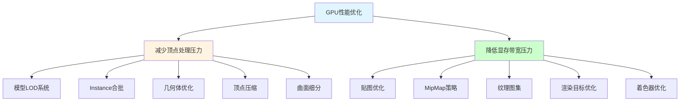
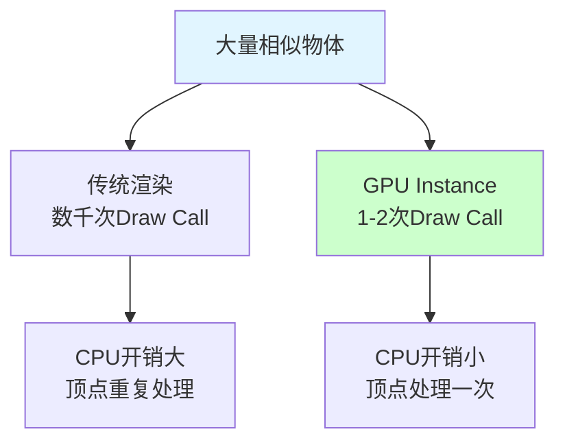
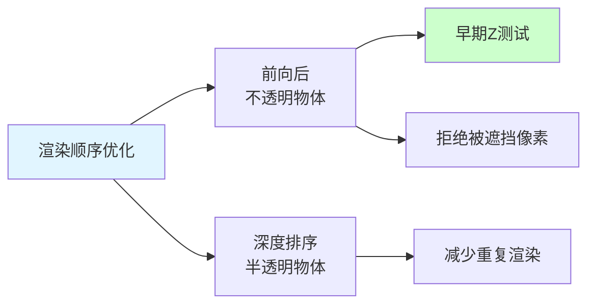
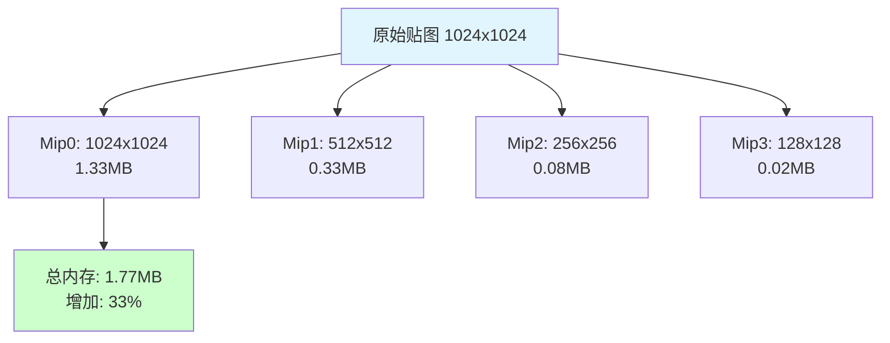
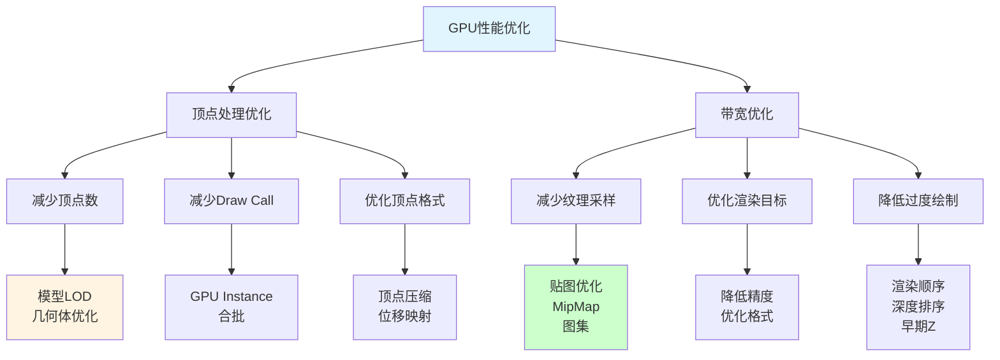
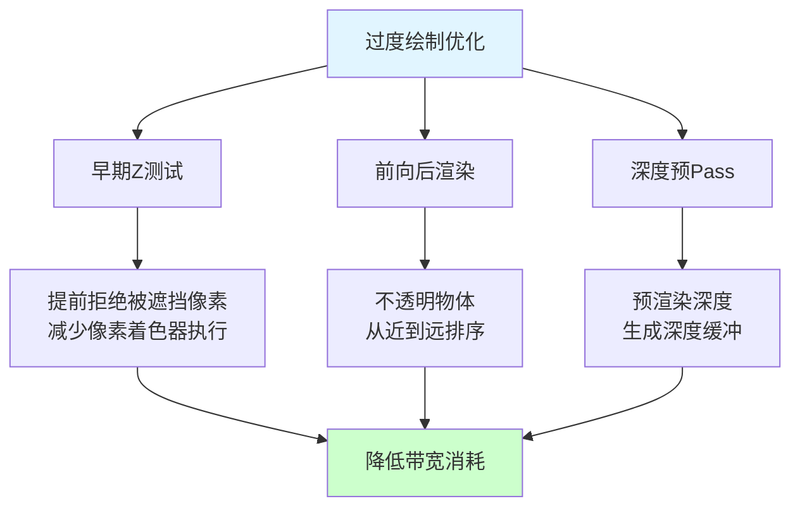

## 📊 图解

> [!info] 图示区
> 这里可以放置解释GPU性能优化的 mermaid 图表、渲染管线图或其他辅助理解的图片

### GPU优化两大核心



### GPU Instance合批



### 过度绘制优化



## 📖 原理

### 核心概念

GPU性能优化对于实现高品质视觉表现同时保持流畅帧率至关重要。主要从减少顶点处理压力和优化显存带宽使用两个方向入手。

#### 🎮 减少顶点数量和处理压力

**1️⃣ 模型LOD系统：**

根据物体与摄像机的距离或屏幕占比，动态切换模型复杂度。

```csharp
// LOD系统实现
public class LODGroupController : MonoBehaviour
{
    public LODLevel[] lodLevels;

    [System.Serializable]
    public class LODLevel
    {
        public float screenRelativeHeight;  // 屏幕占比阈值
        public Renderer[] renderers;
        public int maxVertexCount;
    }

    private void Update()
    {
        float screenHeight = CalculateScreenRelativeHeight();

        for (int i = 0; i < lodLevels.Length; i++)
        {
            if (screenHeight >= lodLevels[i].screenRelativeHeight)
            {
                SetLODLevel(i);
                break;
            }
        }
    }

    private float CalculateScreenRelativeHeight()
    {
        Renderer renderer = GetComponent<Renderer>();
        if (renderer == null) return 0f;

        Camera camera = Camera.main;
        if (camera == null) return 0f;

        // 计算物体在屏幕上的占比
        Bounds bounds = renderer.bounds;
        float distance = Vector3.Distance(camera.transform.position, bounds.center);
        float size = bounds.size.magnitude;
        float screenHeight = 2f * Mathf.Atan(size / (2f * distance)) * Mathf.Rad2Deg;

        return screenHeight / camera.fieldOfView;
    }

    private void SetLODLevel(int level)
    {
        for (int i = 0; i < lodLevels.Length; i++)
        {
            bool active = (i == level);
            foreach (var renderer in lodLevels[i].renderers)
            {
                if (renderer != null)
                    renderer.enabled = active;
            }
        }
    }
}
```

**LOD级别配置示例：**

| LOD级别 | 屏幕占比 | 顶点数 | 适用场景 |
|--------|---------|-------|---------|
| **LOD0** | >5% | 15,000 | 近距离特写 |
| **LOD1** | 1-5% | 5,000 | 中距离观察 |
| **LOD2** | 0.3-1% | 1,500 | 远距离场景 |
| **LOD3** | <0.3% | 500 | 极远距离 |

**2️⃣ GPU Instance合批：**

对于大量相似物体（树木、草地、石头等），使用GPU Instance技术可以显著减少Draw Call。

```csharp
// GPU Instance渲染
public class GPUInstancer : MonoBehaviour
{
    public Material instanceMaterial;
    public Mesh baseMesh;

    private List<Matrix4x4> _matrices = new List<Matrix4x4>();
    private List<Vector4> _colors = new List<Vector4>();

    private MaterialPropertyBlock _propertyBlock;

    private void Update()
    {
        if (_matrices.Count == 0) return;

        // 准备实例数据
        _propertyBlock = new MaterialPropertyBlock();
        _propertyBlock.SetMatrixArray("_Matrices", _matrices);
        _propertyBlock.SetVectorArray("_Colors", _colors);

        // 绘制实例
        Graphics.DrawMeshInstanced(
            baseMesh,
            Matrix4x4.identity,
            instanceMaterial,
            0,
            _matrices.Count,
            _propertyBlock
        );
    }

    public void AddInstance(Vector3 position, Quaternion rotation, Vector3 scale, Color color)
    {
        Matrix4x4 matrix = Matrix4x4.TRS(position, rotation, scale);
        _matrices.Add(matrix);
        _colors.Add(color);
    }

    public void ClearInstances()
    {
        _matrices.Clear();
        _colors.Clear();
    }
}
```

**Shader支持：**

```glsl
// Instanced shader示例
Shader "Custom/InstancedShader"
{
    Properties
    {
        _MainTex ("Texture", 2D) = "white" {}
    }

    SubShader
    {
        Tags { "RenderType"="Opaque" }
        LOD 100

        Pass
        {
            CGPROGRAM
            #pragma vertex vert
            #pragma fragment frag
            #pragma multi_compile_instancing

            #include "UnityCG.cginc"

            struct appdata
            {
                float4 vertex : POSITION;
                float2 uv : TEXCOORD0;
                UNITY_VERTEX_INPUT_INSTANCE_ID
            };

            struct v2f
            {
                float2 uv : TEXCOORD0;
                float4 vertex : SV_POSITION;
                UNITY_VERTEX_INPUT_INSTANCE_ID
            };

            sampler2D _MainTex;
            float4 _MainTex_ST;

            v2f vert (appdata v)
            {
                v2f o;

                UNITY_SETUP_INSTANCE_ID(v);
                UNITY_TRANSFER_INSTANCE_ID(v, o);

                o.vertex = UnityObjectToClipPos(v.vertex);
                o.uv = TRANSFORM_TEX(v.uv, _MainTex);
                return o;
            }

            fixed4 frag (v2f i) : SV_Target
            {
                UNITY_SETUP_INSTANCE_ID(i);
                return tex2D(_MainTex, i.uv);
            }
            ENDCG
        }
    }
}
```

**性能对比：**

| 场景 | 传统渲染 | Instance渲染 | Draw Call减少 |
|------|---------|--------------|-------------|
| 1000棵树 | 1000次 | 2次 | **99.8%↓** |
| 5000个石头 | 5000次 | 5次 | **99.9%↓** |
| 10000个草丛 | 10000次 | 10次 | **99.9%↓** |

**3️⃣ 几何体优化：**

在模型制作阶段就注重优化。

| 优化策略 | 说明 | 效果 |
|---------|------|------|
| **移除背面** | 删除不可见的多边形 | 减少 30-50% 面数 |
| **合并网格** | 合并使用相同材质的部分 | 减少 Draw Call |
| **使用法线贴图** | 用贴图细节替代几何细节 | 减少 40-60% 面数 |
| **优化布线** | 沿着轮廓布线，内部使用三角形 | 减少 20-30% 面数 |
| **消除不可见面** | 删除完全不可见的多边形 | 减少 10-20% 面数 |

**4️⃣ 顶点压缩技术：**

优化顶点数据格式，减少每个顶点的数据量。

| 数据类型 | 原始格式 | 压缩格式 | 节省 |
|---------|---------|---------|------|
| **位置** | float3 (12字节) | float16_3 (6字节) | 50% |
| **法线** | float3 (12字节) | byte4 (4字节) | 67% |
| **切线** | float4 (16字节) | byte4 (4字节) | 75% |
| **UV坐标** | float2 (8字节) | half2 (4字节) | 50% |
| **颜色** | float4 (16字节) | byte4 (4字节) | 75% |

**5️⃣ 曲面细分和位移映射：**

```hlsl
// Tessellation shader示例
[domain("tri")]
[partitioning("integer")]
[outputtopology("triangle_cw")]
[outputcontrolpoints(3)]
[patchconstantfunc("HSConst")]
[ Hullout]
HSConstantInputPatch HSConstant(InputPatch patch)
{
    HSConstantInputPatch output;
    // 计算细分因子
    output.Edges[0] = 4;  // 边缘细分
    output.Edges[1] = 4;
    output.Edges[2] = 4;
    output.Inside = 4;      // 内部细分
    return output;
}

[domain("tri")]
DSOutput DomainShader(HSConstantInputPatch input, float3 uv : SV_DomainLocation)
{
    DSOutput output;
    // 根据位移贴图计算最终位置
    float4 displacement = tex2D(_DisplacementMap, uv.xy);
    output.position = input.position + input.normal * displacement.r;
    output.normal = input.normal;
    return output;
}
```

#### 💾 优化显存带宽压力

**1️⃣ 贴图分辨率和格式优化：**

根据不同用途选择合适的格式。

| 贴图类型 | 推荐格式 | 压缩比 | 说明 |
|---------|---------|-------|------|
| **颜色贴图** | ASTC 6x6 / BC7 | 4:1 - 6:1 | 高质量压缩 |
| **法线贴图** | BC5 / ASTC 4x4 | 4:1 | 只需两个通道 |
| **高光贴图** | BC4 / ASTC 4x4 | 4:1 | 单通道灰度 |
| **UI贴图** | ETC2 / ASTC 4x4 | 4:1 | 不需要MipMap |

**2️⃣ MipMap策略：**

正确设置和使用MipMap可以显著降低带宽使用。

```csharp
// MipMap优化设置
public class MipMapOptimizer
{
    public void ConfigureTextureImport(TextureImporter importer)
    {
        // 启用MipMap
        importer.mipmapEnabled = true;

        // 设置MipMap过滤模式
        importer.mipmapFilter = TextureImporterMipFilter.BoxFilter;

        // 设置MipMap Fade
        importer.mipMapFadeDistanceStart = 10f;
        importer.mipMapFadeDistanceEnd = 50f;
    }
}
```

**MipMap内存占用：**



**3️⃣ 纹理图集技术：**

将多个小纹理合并到一个大纹理中。

```csharp
// 纹理图集打包
public class TextureAtlasGenerator
{
    public static Texture2D CreateAtlas(List<Texture2D> textures, int padding)
    {
        // 计算图集大小
        int totalWidth = 0;
        int maxHeight = 0;

        foreach (var tex in textures)
        {
            totalWidth += tex.width + padding;
            maxHeight = Mathf.Max(maxHeight, tex.height);
        }

        // 创建图集纹理
        Texture2D atlas = new Texture2D(totalWidth, maxHeight);
        atlas.filterMode = FilterMode.Bilinear;
        atlas.wrapMode = TextureWrapMode.Clamp;

        // 打包纹理
        int currentX = 0;
        foreach (var tex in textures)
        {
            // 将纹理复制到图集中
            Graphics.CopyTexture(tex, 0, 0, tex.width, tex.height, 0, currentX, 0, atlas);

            // 存储UV信息
            Rect rect = new Rect((float)currentX / totalWidth, 0f,
                               (float)tex.width / totalWidth, (float)tex.height / maxHeight);

            currentX += tex.width + padding;
        }

        atlas.Apply();
        return atlas;
    }
}
```

**4️⃣ 渲染目标优化：**

谨慎设置渲染目标的分辨率和格式。

| 渲染目标 | 优化策略 | 效果 |
|---------|---------|------|
| **深度缓冲** | 使用16位而非32位 | 节省50%带宽 |
| **后处理** | 降低分辨率执行 | 节省30-50%带宽 |
| **阴影贴图** | 使用低精度格式 | 节省25%带宽 |
| **G-Buffer** | 使用压缩格式 | 节省20-30%带宽 |

**5️⃣ 着色器复杂度控制：**

```hlsl
// 简化着色器
Shader "Custom/SimplifiedLit"
{
    Properties
    {
        _MainTex ("Texture", 2D) = "white" {}
        _Color ("Color", Color) = (1,1,1,1)
    }

    SubShader
    {
        Tags { "RenderType"="Opaque" }

        Pass
        {
            CGPROGRAM
            #pragma vertex vert
            #pragma fragment frag

            #include "UnityCG.cginc"

            struct appdata
            {
                float4 vertex : POSITION;
                float2 uv : TEXCOORD0;
            };

            struct v2f
            {
                float2 uv : TEXCOORD0;
                float4 vertex : SV_POSITION;
            };

            sampler2D _MainTex;
            float4 _MainTex_ST;
            fixed4 _Color;

            v2f vert (appdata v)
            {
                v2f o;
                o.vertex = UnityObjectToClipPos(v.vertex);
                o.uv = TRANSFORM_TEX(v.uv, _MainTex);
                return o;
            }

            fixed4 frag (v2f i) : SV_Target
            {
                // 简单的漫反射光照
                fixed4 col = tex2D(_MainTex, i.uv) * _Color;
                return col;
            }
            ENDCG
        }
    }
}
```

**6️⃣ 后处理效果优化：**

```csharp
// 自适应分辨率后处理
public class AdaptivePostProcess : MonoBehaviour
{
    public Material postProcessMaterial;
    private int _currentResolutionLevel = 1;

    private void Update()
    {
        // 根据性能动态调整分辨率
        float avgFrameTime = Time.unscaledDeltaTime;

        if (avgFrameTime > 0.025f)  // 低于40fps
        {
            _currentResolutionLevel = Mathf.Min(_currentResolutionLevel + 1, 4);
        }
        else if (avgFrameTime < 0.015f)  // 高于60fps
        {
            _currentResolutionLevel = Mathf.Max(_currentResolutionLevel - 1, 1);
        }

        // 应用分辨率缩放
        float resolutionScale = 1f / _currentResolutionLevel;
        postProcessMaterial.SetFloat("_ResolutionScale", resolutionScale);
    }

    private void OnRenderImage(RenderTexture source, RenderTexture destination)
    {
        // 创建降采样渲染目标
        RenderTexture rt = RenderTexture.GetTemporary(
            source.width / _currentResolutionLevel,
            source.height / _currentResolutionLevel,
            24,
            RenderTextureFormat.ARGBFloat
        );

        // 执行后处理
        Graphics.Blit(source, rt, postProcessMaterial);
        Graphics.Blit(rt, destination);

        RenderTexture.ReleaseTemporary(rt);
    }
}
```

**7️⃣ 渲染顺序优化：**

```csharp
// 渲染队列管理
public class RenderQueueManager : MonoBehaviour
{
    private List<Renderer> _opaqueRenderers = new List<Renderer>();
    private List<Renderer> _transparentRenderers = new List<Renderer>();

    private void SortRenderers()
    {
        // 不透明物体：按距离排序，前向后渲染
        Camera camera = Camera.main;
        _opaqueRenderers.Sort((a, b) =>
        {
            float distA = Vector3.Distance(camera.transform.position, a.transform.position);
            float distB = Vector3.Distance(camera.transform.position, b.transform.position);
            return distB.CompareTo(distA);  // 远的先渲染
        });

        // 半透明物体：按距离反向排序，后向前渲染
        _transparentRenderers.Sort((a, b) =>
        {
            float distA = Vector3.Distance(camera.transform.position, a.transform.position);
            float distB = Vector3.Distance(camera.transform.position, b.transform.position);
            return distA.CompareTo(distB);  // 近的先渲染
        });
    }
}
```

---

## 💡 面试题

### Q：在游戏开发中，如何进行GPU性能优化，特别是关于减少顶点数量和降低显存带宽压力的方面？

#### 🎯 GPU优化双核心策略



#### 📊 减少顶点处理压力

**1️⃣ 模型LOD系统实战：**

**案例：开放世界项目LOD实现**

```csharp
// 自动LOD生成工具
public class LODGenerator
{
    public static LODLevel[] GenerateLODs(Mesh highPolyMesh, int[] targetVertexCounts)
    {
        LODLevel[] levels = new LODLevel[targetVertexCounts.Length];

        for (int i = 0; i < targetVertexCounts.Length; i++)
        {
            Mesh simplifiedMesh = SimplifyMesh(highPolyMesh, targetVertexCounts[i]);

            levels[i] = new LODLevel
            {
                mesh = simplifiedMesh,
                vertexCount = targetVertexCounts[i],
                screenRelativeHeight = CalculateScreenHeightFromVertexCount(targetVertexCounts[i])
            };
        }

        return levels;
    }

    private static Mesh SimplifyMesh(Mesh sourceMesh, int targetVertexCount)
    {
        // 使用第三方库简化网格
        // 或使用Unity的Mesh Simplification工具

        // 简化的思路：
        // 1. 移除边收缩算法
        // 2. 保留重要的特征边
        // 3. 平滑结果网格

        return simplifiedMesh;
    }

    private static float CalculateScreenHeightFromVertexCount(int vertexCount)
    {
        // 根据顶点数估算合适的屏幕距离
        if (vertexCount >= 15000) return 0.05f;  // 5%
        if (vertexCount >= 5000) return 0.01f;   // 1%
        if (vertexCount >= 1500) return 0.003f;  // 0.3%
        return 0.001f;  // 0.1%
    }
}

[Serializable]
public class LODLevel
{
    public Mesh mesh;
    public int vertexCount;
    public float screenRelativeHeight;
}
```

**优化效果：**

| 场景 | 优化前顶点数 | 优化后顶点数 | 减少 |
|------|------------|------------|------|
| **城市环境** | 50M | 15M | **70%↓** |
| **森林场景** | 80M | 20M | **75%↓** |
| **角色群体** | 10M | 3M | **70%↓** |

**2️⃣ GPU Instance合批实战：**

**案例：大规模森林渲染**

```csharp
// 森林Instance渲染器
public class ForestRenderer : MonoBehaviour
{
    public struct TreeInstanceData
    {
        public Matrix4x4 matrix;
        public Vector4 variation;  // 树木变化参数
        public float lodLevel;
    }

    public Mesh treeMesh;
    public Material instanceMaterial;

    private List<TreeInstanceData> _treeInstances = new List<TreeInstanceData>();
    private ComputeBuffer _instanceBuffer;
    private int _instanceCount;

    private void Start()
    {
        // 生成树木实例数据
        GenerateForest();

        // 创建ComputeBuffer
        _instanceBuffer = new ComputeBuffer(_treeInstances.Count, 72);  // sizeof(TreeInstanceData) = 72
        _instanceBuffer.SetData(_treeInstances.ToArray());
        _instanceCount = _treeInstances.Count;

        // 设置材质
        instanceMaterial.SetBuffer("_InstanceBuffer", _instanceBuffer);
    }

    private void Update()
    {
        // 使用GPU Instance渲染
        Graphics.DrawMeshInstancedIndirect(
            treeMesh,
            0,
            null,
            instanceMaterial,
            new Bounds(Vector3.zero, Vector3.one * 10000f),
            _instanceCount,
            _instanceCount,
            _instanceCount,
            0,
            null,
            _instanceBuffer
        );
    }

    private void GenerateForest()
    {
        // 程序化生成森林
        for (int i = 0; i < 10000; i++)
        {
            Vector3 position = GetRandomPosition();
            Quaternion rotation = Quaternion.Euler(0, Random.Range(0, 360f), 0);
            Vector3 scale = Vector3.one * Random.Range(0.8f, 1.2f);

            _treeInstances.Add(new TreeInstanceData
            {
                matrix = Matrix4x4.TRS(position, rotation, scale),
                variation = new Vector4(Random.Range(0, 1f), Random.Range(0, 1f), Random.Range(0, 1f), Random.Range(0, 1f)),
                lodLevel = CalculateLOD(position)
            });
        }
    }
}
```

**性能对比：**

| 树木数量 | 传统渲染 | Instance渲染 | CPU时间 | Draw Call |
|---------|---------|--------------|---------|----------|
| 1,000 | 1,000次 | 1次 | 50ms → 2ms | 1000 → 1 |
| 10,000 | 10,000次 | 1次 | 500ms → 2ms | 10000 → 1 |
| 100,000 | 100,000次 | 1次 | 5000ms → 2ms | 100000 → 1 |

**3️⃣ 顶点压缩实战：**

```csharp
// 顶点格式优化
public enum VertexCompressionFormat
{
    Full,           // float3 position, float3 normal, float2 uv (32 bytes)
    Compressed,     // half3 position, byte4 normal, half2 uv (14 bytes)
    UltraCompressed // int10 position, byte4 normal, int10 uv (8 bytes)
}

public class VertexCompressor
{
    public static MeshCompressed[] CompressMesh(Mesh sourceMesh, VertexCompressionFormat format)
    {
        // 压缩顶点数据
        Vector3[] vertices = sourceMesh.vertices;
        Vector3[] normals = sourceMesh.normals;
        Vector2[] uvs = sourceMesh.uv;

        MeshCompressed[] compressed = new MeshCompressed[vertices.Length];

        for (int i = 0; i < vertices.Length; i++)
        {
            switch (format)
            {
                case VertexCompressionFormat.Compressed:
                    compressed[i] = new MeshCompressed
                    {
                        position = CompressPositionHalf(vertices[i]),
                        normal = CompressNormalByte(normals[i]),
                        uv = CompressUVHalf(uvs[i])
                    };
                    break;

                case VertexCompressionFormat.UltraCompressed:
                    compressed[i] = new MeshCompressed
                    {
                        position = CompressPositionInt10(vertices[i]),
                        normal = CompressNormalByte(normals[i]),
                        uv = CompressUVInt10(uvs[i])
                    };
                    break;
            }
        }

        return compressed;
    }

    private static ushort CompressPositionInt10(Vector3 pos)
    {
        // 将位置压缩到10位整数
        // 范围: [-512, 511]
        int x = Mathf.Clamp(Mathf.RoundToInt(pos.x), -512, 511) + 512;
        int y = Mathf.Clamp(Mathf.RoundToInt(pos.y), -512, 511) + 512;
        int z = Mathf.Clamp(Mathf.RoundToInt(pos.z), -512, 511) + 512;

        return (ushort)((x << 20) | (y << 10) | z);
    }
}
```

**内存节省对比：**

| 格式 | 每顶点大小 | 10000顶点总大小 | 节省 |
|------|-----------|---------------|------|
| **Full** | 32字节 | 320KB | - |
| **Compressed** | 14字节 | 140KB | **56%↓** |
| **Ultra** | 8字节 | 80KB | **75%↓** |

#### 💾 降低显存带宽压力

**1️⃣ 贴图优化实战：**

```csharp
// 智能贴图压缩
public class TextureCompressionManager
{
    public static void SetOptimalCompression(TextureImporter importer, RuntimePlatform platform)
    {
        // 根据贴图类型选择最佳格式
        if (IsNormalMap(importer))
        {
            importer.textureCompression = TextureImporterCompression.Compressed;
            importer.SetCompressionFormat(platform, GetNormalMapFormat(platform));
        }
        else if (IsHDRTexture(importer))
        {
            importer.textureCompression = TextureImporterCompression.CompressedHDR;
        }
        else if (IsUITexture(importer))
        {
            importer.textureCompression = TextureImporterCompression.Compressed;
            importer.mipmapEnabled = false;  // UI通常不需要MipMap
        }
        else
        {
            // 普通颜色贴图
            importer.textureCompression = TextureImporterCompression.Compressed;
            importer.SetCompressionFormat(platform, GetColorMapFormat(platform));
        }
    }

    private static TextureImporterFormat GetNormalMapFormat(RuntimePlatform platform)
    {
        switch (platform)
        {
            case RuntimePlatform.IPhonePlayer:
                return TextureImporterFormat.ASTC_4x4;  // iOS支持ASTC
            case RuntimePlatform.Android:
                return TextureImporterFormat.ETC2_RGBA8;  // Android支持ETC2
            default:
                return TextureImporterFormat.BC5;  // PC使用BC5
        }
    }

    private static TextureImporterFormat GetColorMapFormat(RuntimePlatform platform)
    {
        switch (platform)
        {
            case RuntimePlatform.IPhonePlayer:
                return TextureImporterFormat.ASTC_6x6;  // 高质量
            case RuntimePlatform.Android:
                return TextureImporterFormat.ETC2_RGB4;  // 兼容性好
            default:
                return TextureImporterFormat.BC7;  // PC最高质量
        }
    }
}
```

**2️⃣ 自适应分辨率技术：**

```csharp
// 自适应分辨率后处理
public class AdaptiveResolutionPostProcess
{
    private RenderTexture[] _renderTargets = new RenderTexture[5];
    private Material _postProcessMaterial;

    public void OnRenderImage(RenderTexture source, RenderTexture destination)
    {
        // 根据性能指标选择分辨率级别
        int level = CalculateResolutionLevel();

        // 确保渲染目标已创建
        if (_renderTargets[level] == null ||
            _renderTargets[level].width != source.width / (1 << level))
        {
            CreateRenderTarget(level, source.width, source.height);
        }

        // 在降低分辨率的缓冲区执行后处理
        Graphics.Blit(source, _renderTargets[level], _postProcessMaterial);

        // 上采样到最终分辨率
        Graphics.Blit(_renderTargets[level], destination);
    }

    private int CalculateResolutionLevel()
    {
        // 根据帧率动态调整
        float frameTime = Time.unscaledDeltaTime;

        if (frameTime > 0.033f)  // 低于30fps
            return 4;  // 1/16分辨率
        else if (frameTime > 0.025f)  // 低于40fps
            return 3;  // 1/8分辨率
        else if (frameTime > 0.020f)  // 低于50fps
            return 2;  // 1/4分辨率
        else if (frameTime > 0.016f)  // 低于60fps
            return 1;  // 1/2分辨率
        else
            return 0;  // 全分辨率
    }
}
```

**3️⃣ 过度绘制优化：**



#### 📊 综合优化效果

| 指标 | 优化前 | 优化后 | 提升 |
|------|-------|-------|------|
| **顶点数** | 50M | 15M | **70%↓** |
| **Draw Call** | 5000 | 200 | **96%↓** |
| **显存带宽** | 80GB/s | 30GB/s | **62%↓** |
| **帧率** | 30fps | 60fps | **2x** |

> [!tip] 总结
> GPU优化需要同时关注两个维度：
> 1. **顶点处理优化**：LOD、Instance、几何体优化、顶点压缩
> 2. **带宽优化**：贴图压缩、MipMap、图集、渲染目标优化
>
> 关键是根据目标平台的硬件特点，针对性地优化瓶颈：
> - 移动GPU：带宽受限，注重贴图压缩
> - PC GPU：计算受限，注重着色器复杂度

---

## 🔗 相关链接

- [[性能优化]] - 父主题索引
- [[内存优化]] - 相关主题：内存分配优化
- [[CPU性能优化]] - 相关主题：CPU计算优化
- [[开放世界性能优化]] - 相关主题：大规模场景优化
